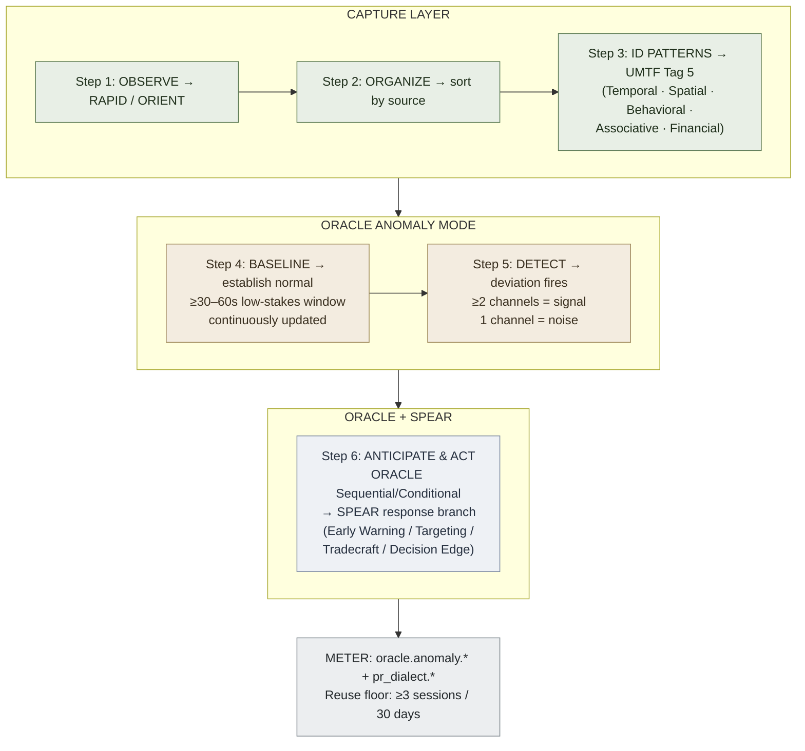

# Pattern Recognition — Operative Dialect

**Summary**: A [UMTF](./universal-mental-tagging-framework.md) domain dialect for operational/intelligence contexts: maps the 6-step Pattern Recognition cycle (Observe → Organize → Identify Patterns → Establish Baseline → Detect Anomalies → Anticipate & Act) onto existing Neural OS frameworks — capture layer (steps 1–3), [ORACLE](./oracle-overview.md) Anomaly mode (steps 4–5), and [SPEAR](./spear-overview.md) (step 6). No new encoder slot or acronym; a Composite application of the existing framework family.

**Sources**:
- Pattern Recognition infographic (covert operative framing; 2026-06-17 `/validate-idea`)
- nonverbal-baseline-detection — Hadnagy ch.8 anomaly-detection framing (independent derivation)
- [ORACLE](./oracle-overview.md) — Anomaly mode; baseline + deviation detection
- [SPEAR](./spear-overview.md) — response procedure encoding
- [RAPID](./rapid-in-neural-os.md) / [ORIENT](./orient-method.md) — capture layer (steps 1–3)
- [UMTF](./universal-mental-tagging-framework.md) — Pattern Tags (family 5) and Temporal Tags (family 6)
- [software-design-principles-for-neural-os](./software-design-principles-for-neural-os.md) — Composite + Strategy patterns; SRP constraint

**Last updated**: 2026-06-17 (Operative Dialect registry section added — this page is provisional owner; instance counter at 2/3, sleep-hygiene-protocol §Operative Dialect registered as 2nd instance)

---

## Unlocks (lead, not footer)

> **ORACLE-Anomaly × SPEAR × capture layer → environmental situational awareness as executable reflex.**

The infographic's 6-step cycle is the same Composite the wiki's existing frameworks already implement separately. Naming the composition makes the skill teachable as one coherent loop — with METER telemetry — rather than three isolated techniques. nonverbal-baseline-detection independently discovered this Composite under the label "anomaly detection against a per-encounter baseline." This page makes the cross-domain link explicit.

**Cross-domain transfer**: the same baseline-deviation machinery applies to behavioral signals (Hadnagy), algorithm shape (code-pattern recognition), exam distractor anatomy (Georgian driving exam), and any calibrated corpus. Skill built in one domain transfers to the others because the underlying loop is the same.

---

## Framework Decomposition

The 6-step cycle is a **Composite** (SDP §Composite pattern). Each step maps to an existing Neural OS layer:

| PR Step | Neural OS layer | What it does |
|---|---|---|
| 1 — Observe | [RAPID](./rapid-in-neural-os.md) / [ORIENT](./orient-method.md) | Scan environment, collect raw data, stay detached |
| 2 — Organize | Capture layer sorting | Sort by category (time, location, actor, method); structure the noise |
| 3 — Identify Patterns | [UMTF](./universal-mental-tagging-framework.md) Pattern Tags (family 5) | Match against the operative pattern taxonomy (see §Pattern Taxonomy below) |
| 4 — Establish Baseline | [ORACLE](./oracle-overview.md) Anomaly mode — baseline phase | What is normal? Define the standard; build confidence over ≥30s–60s of low-stakes observation |
| 5 — Detect Anomalies | [ORACLE](./oracle-overview.md) Anomaly mode — deviation phase | Spot deviations; outliers matter; validate significance (multi-category before acting) |
| 6 — Anticipate & Act | [ORACLE](./oracle-overview.md) Sequential/Conditional + [SPEAR](./spear-overview.md) response chain | Predict intent; assess risk; move decisively |

**Why not a 7th encoder?** SRP (see [software-design-principles-for-neural-os](./software-design-principles-for-neural-os.md) §S): each existing encoder already owns one job. Steps 4–5 are ORACLE's Anomaly mode verbatim. Adding a PR acronym would violate SRP and create a Singleton that merges what is already cleanly separated.

---

## Pattern Taxonomy (UMTF Tag 5 Extensions)

The infographic's five pattern types are domain-specific subclasses of [UMTF](./universal-mental-tagging-framework.md) Pattern Tag (family 5) for operational/intelligence contexts. They extend the spine without re-mapping it (Orthogonality Lock; see [software-design-principles-for-neural-os](./software-design-principles-for-neural-os.md) §Domain Dialects).

| Pattern type | UMTF Tag family | What it answers | Operative example |
|---|---|---|---|
| **Temporal** | Tag 6 (Temporal) + Tag 5 (Pattern) | Time-based cycles and schedules | Movement routine; communication timing; shift changes |
| **Spatial** | Tag 1 (Spatial) + Tag 5 (Pattern) | Locations, routes, geographic behavior | Route predictability; dead-drop geography; transit patterns |
| **Behavioral** | Tag 5 (Pattern) + Tag 3 (State) | Actions, habits, and tendencies | Purchase behavior; daily ritual; stress-response signature |
| **Associative** | Tag 4 (Relation) + Tag 5 (Pattern) | Connections between people, places, and events | Social graph cluster; handler–asset network; recruitment pipeline |
| **Financial** | Tag 4 (Relation) + Tag 6 (Temporal) | Transactions, flows, and economic behavior | Funding cycles; money-mule routing; irregular transfer timing |

The five types are a **Strategy** selector (SDP §Strategy): pick the dominant type for the collection task, then switch if the pattern doesn't discriminate.

---

## Sources of Data (Intel Categories)

Six source types (HUMINT · SIGINT · OSINT · IMINT · FININT · TECHINT) map onto the capture layer's question: *which source feeds this pattern type?*

| Intel source | What it supplies | Pattern types it feeds best |
|---|---|---|
| **HUMINT** (conversations, interviews, observations) | Behavioral + Associative | Behavioral, Associative |
| **SIGINT** (communications, metadata, signals) | Temporal + Associative | Temporal, Associative |
| **OSINT** (public records, media, social platforms) | Spatial + Associative | Spatial, Associative, Temporal |
| **IMINT** (imagery, surveillance, geospatial data) | Spatial + Temporal | Spatial, Temporal |
| **FININT** (financial records, transactions) | Financial + Temporal | Financial, Temporal |
| **TECHINT** (device data, network activity, digital footprints) | Behavioral + Associative | Behavioral, Associative, Temporal |

---

## Building a Baseline (ORACLE Anomaly Mode — Steps 4–5)

These three operational rules map exactly onto the ORACLE Anomaly mode; the infographic is a domain-specific restatement:

1. **Collect sufficient data over time.** Baseline requires ≥30–60s of low-stakes observation (per nonverbal-baseline-detection). A reading before the baseline is established is noise, not signal.
2. **Define boundaries of normal behavior.** The baseline is not personality; it is the emotional/behavioral content displayed *right now* in *this context*. See nonverbal-baseline-detection §What a baseline is — and isn't.
3. **Continuously update the baseline.** Each new low-stakes window refines the prior. ORACLE Anomaly event: `oracle::anomaly::baseline_update`.

**Normal range** (per the infographic's Gaussian framing): ±2σ defines the normal band. Deviations outside this band — spotting the outlier — trigger the Detect step. Multi-category deviation (≥2 channels) is signal; single-category is noise (per nonverbal-baseline-detection §The baseline-establishment protocol).

---

## Anomaly Indicators

These six indicators are the deviation taxonomy for this dialect, pairing with nonverbal-baseline-detection §The deviation taxonomy for behavioral contexts:

| Indicator | ORACLE Anomaly slot | Why it matters |
|---|---|---|
| Sudden change in frequency | Temporal deviation | Rate change is often the first measurable signal |
| Deviation from usual timing | Temporal deviation | Schedule breaks under duress or activation |
| New or unusual locations | Spatial deviation | Route change may signal surveillance-awareness or tasking change |
| Unseen associations | Associative deviation | New node in the social graph is a candidate handler/asset |
| Escalation in resources | Financial deviation | Pre-operational spend spike; resourcing for capability |
| Communication secrecy increase | Behavioral + Associative | OPSEC tightening is itself an anomaly signal |

---

## Application (Step 6 — SPEAR Slot)

Step 6 (Anticipate & Act) is a [SPEAR](./spear-overview.md) response chain: once the anomaly fires, the procedure executes.

The four operative applications from the infographic map onto SPEAR decision branches:

| Application | SPEAR branch | What it drives |
|---|---|---|
| **Early Warning** — detect threats before they materialize | Branch: anomaly-confirmed → escalate | Fires on ≥2-category multi-signal breach |
| **Targeting** — identify key actors and opportunities | Branch: associative-deviation → identify node | New-association anomaly → profile expansion |
| **Tradecraft** — understand surveillance and counter-surveillance | Branch: spatial/behavioral deviation → assess | Route change or secrecy spike → assess own exposure |
| **Decision Edge** — make faster, smarter decisions with confidence | All branches → baseline-confidence enables low-latency choice | Baseline fluency = [Coagulation](./automaticity-and-reflex-training.md)-level anticipation |

---

## METER Hooks

| METER field | What it captures | Pass floor |
|---|---|---|
| `oracle.anomaly.baseline_accuracy` | % of baselines correctly established before any deviation call | ≥90% (matches ORACLE Anomaly target) |
| `oracle.anomaly.deviation_call_accuracy` | % deviations correctly flagged within 5s of onset | ≥60% (hard ceiling per nonverbal-baseline-detection §METER hooks) |
| `oracle.anomaly.false_positive_rate` | % of baseline-normal observations incorrectly flagged as anomalies | <15% (matches ORACLE Anomaly target) |
| `oracle.anomaly.multi_category_requirement` | % of deviation calls based on ≥2 pattern channels | ≥80% |
| `pr_dialect.pattern_type_classified` | % of collection tasks with the dominant pattern type named before data gathering | ≥85% |
| `pr_dialect.step6_latency_ms` | Time from anomaly-confirmed to SPEAR branch decision | <30 000 ms (≤30s; matches ORACLE Sequential target) |

**Dialect reuse floor** (from [software-design-principles-for-neural-os](./software-design-principles-for-neural-os.md) §Domain Dialects legitimacy contract §METER fit): this dialect earns its keep if used ≥3 times in practice sessions within 30 days. Below that, treat as `disposable` tier per [UMTF](./universal-mental-tagging-framework.md) §Priority value classes.

---

## Operative Dialect registry (provisional owner, 2026-06-17)

This page is the **provisional owner** for the [Operative Dialect](./glossary.md) — the covert-operator aesthetic register applied over biology/skill substrate pages (see [software-design-principles-for-neural-os](./software-design-principles-for-neural-os.md) §Domain Dialects for the legitimacy contract). The register adds operator-mission framing (anti-predictability · mission-readiness · no-device-dependency) without restating substrate definitions; the spine stays closed, only the host page's framing changes.

| # | Host page | Substrate | Operative §section | Date | Source |
|---|---|---|---|---|---|
| 1 | [pattern-recognition-operative](./pattern-recognition-operative.md) | [ORACLE](./oracle-overview.md) Anomaly mode + capture layer + [SPEAR](./spear-overview.md) | (this page) | 2026-06-17 | Pattern Recognition infographic |
| 2 | sleep-hygiene-protocol §Operative Dialect | Walker + Jacobs 12-rule sleep hygiene | §"Operative Dialect (2026-06-17)" | 2026-06-17 | "No Alarm. Full Control." infographic (RDCTD.PRO) |

**Promotion rule.** Per the dialect legitimacy contract: at instance ≥3 within ~4 weeks of registration, the Operative Dialect promotes from "provisional owner = this page" to its own dedicated owner page (`operative-dialect.md` or similar). At ≤2 sustained instances or no new instance within 4 weeks, the dialect demotes per the `disposable` tier rule in [UMTF](./universal-mental-tagging-framework.md) §Priority value classes.

**METER event.** `wiki.dialect_used` fires per instance, with `register=operative` and the host page name. Floor: ≥3 instances within 4 weeks.

**What the dialect must NOT do** (orthogonality lock from [software-design-principles-for-neural-os](./software-design-principles-for-neural-os.md) §Domain Dialects):

- It does **not** redefine any spine UMTF tag — operator framing rides on existing Priority + State + Pattern tags.
- It does **not** mint a new acronym at framework level (no "OOP" / "OPSEC encoder" / etc.).
- It does **not** replace the substrate page's authoritative definitions — every §Operative section links back to the host's main content, never restating it.
- It does **not** import contested popular-science claims (e.g. 90-min cycle "wake at cycle end" from operator-aesthetic sleep media) without routing them through the wiki's dialectical-tension pages (e.g. [the-8-hour-myth-tension](./the-8-hour-myth-tension.md)).

---

## Operator Principles → Neural OS Equivalents

The infographic's five principles map onto existing wiki pages:

| Operator principle | Neural OS equivalent |
|---|---|
| **Stay Curious** — question everything, assume nothing | [ok-plateau](./ok-plateau.md) counter; [novice-vs-expert-cognition](./novice-vs-expert-cognition.md) §Expert flexibility |
| **Focus** — filter ruthlessly, noise kills | UMTF §Orthogonality Rules: "use priority tags sparingly; if everything glows, nothing glows" |
| **Connect Dots** — patterns hide in relationships | [CAST](./cast-overview.md) Relation Tags (UMTF Tag 4); [recognition-gym-pattern](./recognition-gym-pattern.md) |
| **Be Patient** — time reveals what moments conceal | ORACLE Anomaly: "collect sufficient data over time"; baseline requires ≥30–60s |
| **Protect the Pattern** — your insights are a force multiplier | [SPARK](./spark-overview.md) T3 knowing-tier ceremonies; composability registry |

---

## Mnemonic

**OO-IP-BDA** = *Observe · Organize · Identify Patterns · Baseline · Detect Anomalies · Act*

Read as: **"OO I Paid Big Dividends Already"** — two O's (Observe, Organize), then I-P (Identify Patterns), then the ORACLE pair (Baseline → Detect), then Act.

Short form: **B→D fires the gun** (Baseline then Deviation = the load-bearing ORACLE pair; the four surrounding steps are setup and execution).

---

## Memory Checksum

If you can answer these from recall in <60s each, the page is encoded:

1. **Name the 6 steps and which Neural OS layer owns each.** (Observe/Organize/Identify → capture; Baseline/Detect → ORACLE Anomaly; Act → ORACLE+SPEAR)
2. **What makes a deviation signal vs. noise?** (≥2 pattern categories firing simultaneously; single-category = noise)
3. **Why is PR not a 7th encoder?** (SRP: ORACLE already owns steps 4–5, SPEAR owns step 6; minting a new acronym adds ceremony without payoff)
4. **Name the 5 operative pattern types and their dominant UMTF tag families.** (Temporal/Tag6+5, Spatial/Tag1+5, Behavioral/Tag5+3, Associative/Tag4+5, Financial/Tag4+6)
5. **State the baseline rule.** (Not personality — emotional/behavioral content displayed *right now, in this context;* established in ≥30–60s of low-stakes observation)

---

## Visual — the Composite skeleton

---

## Related Pages

- [ORACLE](./oracle-overview.md) — owner of Anomaly mode (steps 4–5)
- [SPEAR](./spear-overview.md) — owner of the response procedure (step 6)
- [RAPID](./rapid-in-neural-os.md) · [ORIENT](./orient-method.md) — capture layer (steps 1–3)
- nonverbal-baseline-detection — independent derivation of the same Composite at the behavioral/SE substrate; companion reading
- [UMTF](./universal-mental-tagging-framework.md) — Pattern Tags (family 5) and Temporal Tags (family 6) that underlie the 5 operative pattern types
- [software-design-principles-for-neural-os](./software-design-principles-for-neural-os.md) — Composite pattern (SDP §Composite); Domain Dialects contract; SRP constraint that ruled out a 7th encoder
- [recognition-gym-pattern](./recognition-gym-pattern.md) — sibling architectural primitive; the classification-reflex side of pattern recognition (naming the class under timer)
- [prism-pattern-discovery](./prism-pattern-discovery.md) — the general (non-operative) pattern-*discovery* protocol; PR steps 1–3 (Observe · Organize · Identify) are PRISM's P · R · I specialised to a live environment
- [METER](./meter-overview.md) — `oracle.anomaly.*` and `pr_dialect.*` event schema
- [composability-index](./composability-index.md) — unlock registry: ORACLE-Anomaly × SPEAR × capture layer → operative situational awareness
- [framework-comparison-matrix](./framework-comparison-matrix.md) — master framework routing table; PR sits inside ORACLE's Anomaly mode row
