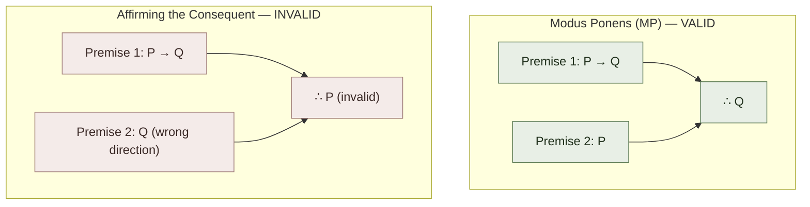
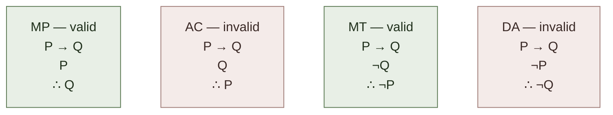

# Modus Ponens (Per-Rule Page — Exemplar)

**Summary**: A **full standalone page** for the most-used inference rule in natural deduction: **Modus Ponens** (MP). *If P → Q is given, and P is given, then Q follows*. The simplest valid argument form; cataloged by Chrysippus c. 250 BCE; appears in every logic textbook ever since; **the load-bearing atom underneath every conditional argument**. This page serves as the **exemplar template** for future per-rule Copi pages (MT, HS, DS, CD, DD, Simp, Conj, Add, plus 10 replacement rules + 4 quantification rules). **Page-tier in [logic-atomic-design](./logic-atomic-design.md) §Pages**: the rule has theoretical coverage in [methods-of-deduction](./methods-of-deduction.md); this page is the worked-instance owner.

**Sources**:
- [Copi/Cohen/McMahon](./copi-introduction-to-logic.md) *Introduction to Logic* 14th ed, Ch 9.
- [methods-of-deduction](./methods-of-deduction.md) — collective treatment of the 19 rules.
- Chrysippus of Soli (c. 279–c. 206 BCE) — first systematic articulation of propositional logic + the conditional inference now called Modus Ponens.
- [Copi](./copi-introduction-to-logic.md) Ch 1 biography of Chrysippus.

**Last updated**: 2026-05-25

---

## One-line

> *P → Q ; P ; ∴ Q*. The simplest valid argument form. **Affirming the antecedent** (the *valid* version) — NOT to be confused with [affirming the consequent](./fallacy-taxonomy.md) (the *invalid* form, *P → Q ; Q ; ∴ P*).

## Unlocks (lead, not footer)

1. **The most-used inference rule in all of logic.** Every natural-deduction proof of moderate length uses MP at least once; many use it dozens of times. **MP is the basic conditional-elimination rule** — given a conditional and its antecedent, you can detach the consequent. **Without MP, natural deduction collapses into trivial truth-table verification only.**

2. **The dark twin makes MP the most-load-bearing reflex.** [Affirming the consequent](./fallacy-taxonomy.md) (*P → Q ; Q ; ∴ P* — invalid) is the most-common formal-logical error in non-trained reasoners. **Drilling MP to reflex requires simultaneously drilling its dark twin's invalidity.** A practitioner who recognizes MP as valid but not affirming-the-consequent as invalid hasn't yet mastered the conditional.

3. **MP grounds every deductive argument with a conditional premise.** Aristotelian categorical syllogisms can be recast in propositional form using conditionals; the resulting arguments use MP. Modern symbolic logic, mathematical proofs, scientific arguments, legal arguments, philosophical arguments — all rely on MP as the atomic move for detaching consequents.

4. **The per-rule exemplar template.** This page demonstrates what a full per-rule wiki page looks like: form + when-to-fire + worked examples + common errors + dark twin + historical context + cross-links. **Future per-rule pages (MT, HS, DS, etc.) follow this template.** The wiki has 19 + 4 = 23 atomic rules in [logic-atomic-design](./logic-atomic-design.md) §Atoms → Rules family; per-rule pages could be authored for each.

## Mnemonic

***P → Q ; P ; ∴ Q*** = *"If P then Q. And P. Therefore Q."*

The two-line setup + the one-line conclusion. **Drill to <8 second reflex**.

## Memory checksum

1. **State the form of Modus Ponens.** (*P → Q ; P ; ∴ Q*. Two premises: a conditional + its antecedent. Conclusion: the consequent.)
2. **State the form of affirming the consequent + why it's invalid.** (*P → Q ; Q ; ∴ P*. Invalid because *P → Q* doesn't mean *Q → P*. Example: *"If it rains, the ground is wet; the ground is wet; therefore it rained"* — but sprinklers also wet the ground.)
3. **Who first systematized this rule?** (Chrysippus of Soli (~3rd century BCE) developed propositional logic + the conditional. The modern name "Modus Ponens" is medieval Latin (*modus ponendo ponens*, "the way that, by affirming, affirms").)
4. **State MP in plain English.** ("If P implies Q, and we have P, then we have Q." Or: "If A leads to B, and A happens, then B happens.")
5. **Why is MP load-bearing?** (Every deductive argument with a conditional premise uses MP (or its contrapositive MT). Natural deduction without MP collapses into truth-table verification only. **MP is the basic conditional-elimination rule.**)

## Visual — MP + its dark twin



**Worked examples**:

| Domain | Premise 1 | Premise 2 | Conclusion |
|---|---|---|---|
| Everyday (MP) | If it's raining, the ground is wet. | It's raining. | ∴ The ground is wet. |
| Mathematical (MP) | If n is divisible by 6, then n is divisible by 3. | 12 is divisible by 6. | ∴ 12 is divisible by 3. |
| Philosophical (MP) | If knowledge implies truth, then K(P) → P. | Knowledge implies truth. | ∴ K(P) → P (the T axiom in epistemic logic). |
| Counter-example (AC) | If it's raining, the ground is wet. (true) | The ground is wet. (true) | ∴ It's raining — could be false (sprinklers ran); the argument is invalid |

**Memory anchor — the four forms**:



Drill the 4-form pattern to reflex: MP + MT are valid; AC + DA are invalid. Confusion is THE most common formal-logical error in non-trained reasoners.

The visual shows MP, its dark twin AC, and the broader 4-form pattern (MP + MT + AC + DA) that constitutes the conditional-logic atoms.

---

## The historical context

### Chrysippus of Soli (~3rd century BCE)

The Stoic logician **Chrysippus** (~279-206 BCE) developed the first coherent system of propositional logic in the ancient world. His logic differed substantially from Aristotle's:

- **Aristotle's logic** (350 BCE) was a logic of **categorical propositions** ("All men are mortal") and **terms** ("men", "mortal").
- **Chrysippus's logic** was a logic of **propositions** ("if it is now day, it is now light") and **propositional connectives** (conditional, conjunction, disjunction).

Chrysippus's famous **modus ponens example** (preserved in Sextus Empiricus and Diogenes Laertius):

> *If it is now day, it is now light.*
> *It is now day.*
> *Therefore, it is now light.*

This is **modus ponens in its original form** — the conditional + its antecedent + the consequent.

Chrysippus catalogued **five basic argument forms** (Diogenes Laertius VII.79-81):
1. *Modus ponens*: *P → Q ; P ; ∴ Q*.
2. *Modus tollens*: *P → Q ; ¬Q ; ∴ ¬P*.
3. *Disjunctive syllogism*: *P ∨ Q ; ¬P ; ∴ Q*.
4. *Conjunction elimination*: *P ∧ Q ; ∴ P* (or ∴ Q).
5. *Conjunctive negation*: *¬(P ∧ Q) ; P ; ∴ ¬Q*.

These five forms are **the same set Copi presents** in [methods-of-deduction](./methods-of-deduction.md) §9 elementary inference rules, ~2200 years later, with minor additions (Constructive Dilemma + Destructive Dilemma + Addition).

### The medieval Latin name

The name *Modus Ponens* is **medieval Latin**: short for *modus ponendo ponens* — "the way that, by affirming (*ponendo*), affirms (*ponens*)". Compare *[Modus Tollens](./per-rule-modus-tollens.md)*: *modus tollendo tollens* — "the way that, by denying, denies".

The medieval logicians (Aquinas, Ockham, Burley, the Oxford Calculators) developed the Latin terminology to distinguish valid forms from invalid ones systematically.

## When MP fires

MP fires whenever you have:
- A **conditional proposition** *P → Q* (or any logical form that reduces to a conditional).
- The **antecedent** *P*.

The conclusion is **the consequent** *Q*.

### Recognition cues

When reading an argument, watch for:
- *"If X, then Y"* + *"X is the case"* → MP fires, deriving *Y*.
- *"Since X implies Y, and X happens"* → MP fires.
- *"Given that X → Y, and X, therefore Y"* → MP is explicit.
- *"X. Therefore Y"* where the unstated [enthymeme premise](./argument-anatomy.md) is *X → Y* → MP firing implicitly.

### Examples in different fields

**Mathematics**:
> *"Every prime > 2 is odd. 17 is prime and > 2. Therefore 17 is odd."*
> (Implicit: *17 prime ∧ 17 > 2 → 17 odd*; antecedent given; ∴ consequent.)

**Science**:
> *"If theory T predicts observation O, and we observe O, [conclude (informally) that T is supported]."*
> (Note: this is NOT strict MP — it's the abductive analog. Strict MP would require us to know that T predicts O AND that T's prediction is the *only* way to get O. Hypothesis confirmation is structurally weaker than MP.)

**Philosophy**:
> *"If God exists, then God is omnipotent. God exists. Therefore God is omnipotent."*
> (MP fires; the conclusion follows IF the premises are true.)

**Legal**:
> *"If a person commits murder, they have committed a felony. The defendant committed murder. Therefore the defendant committed a felony."*
> (MP fires; legal reasoning often uses MP through compound conditionals.)

**Computer science**:
> *"If a program halts on input I, then the verification claim V holds. The program halts on input I (we ran it). Therefore V holds for this input."*
> (MP fires; bounded program verification uses MP after halting is established.)

## The dark twin — affirming the consequent

**Invalid form**: *P → Q ; Q ; ∴ P*.

This is **NOT MP**. The premises here are the conditional + the *consequent* (not the antecedent). The "conclusion" attempts to derive the antecedent from the consequent — backwards.

**Why it's invalid**: *P → Q* doesn't entail *Q → P*. There can be multiple sufficient conditions for *Q*; *P* is just one of them.

**Classic counter-example**: 
> *"If it's raining, the ground is wet. The ground is wet. Therefore it's raining."*
> Counter-example: sprinklers ran. Or the snow melted. Or there was a flood.

**Why it's the most-common formal-logical error**: in everyday reasoning, we often *do* know that *Q* implies *P* (we know rain → wet, AND we tend to believe wet → rain because rain is the most-common cause of wet). The error is treating a *strong association* as a *logical entailment*. Logical entailment is one-directional unless the conditional is bidirectional (*P ↔ Q*).

**Drill discipline**: every time you encounter *P → Q* + *Q*, ask explicitly *"is this MP or AC?"*. The answer is AC; refuse to derive *P*. **<15 second reflex** for this discrimination.

## MP chains + iterated MP

MP can be **iterated**:

```
1. A → B          Premise
2. B → C          Premise
3. A              Premise
4. B              1, 3, MP
5. C              2, 4, MP
∴ C
```

This chain uses MP twice. A long conditional chain can be derived via repeated MP.

**[Hypothetical Syllogism (HS)](./per-rule-hypothetical-syllogism.md)** [registered as a separate atomic rule](./methods-of-deduction.md) = *A → B ; B → C ; ∴ A → C* — derivation of the *compound conditional* without needing *A* itself. HS is **derivable from MP + Conditional Proof**:

```
1. A → B          Premise
2. B → C          Premise
3. | A            Assume (for CP)
4. | B            1, 3, MP
5. | C            2, 4, MP
6. A → C          3-5, CP
∴ A → C  (= HS)
```

So HS is *MP + CP composed*. Many of Copi's other rules are similarly compositions.

## Why MP is the most-load-bearing atomic rule

If you had to pick **one** inference rule to keep and drop all others:

- **MP suffices** for most everyday + scientific + mathematical reasoning.
- Combined with **conditional proof + reductio**, MP + DN + double negation = a *complete* system for propositional logic.
- **Truth-functional logic without MP** is not workable — you have truth-tables but no derivation system.

**MP is the *atomic move* of conditional reasoning**, full stop. Every derivation system has it (or an equivalent). Every logic textbook teaches it first.

## Common errors in applying MP

### Error 1 — Confusing MP with AC

The most common error. *"If P then Q; Q; therefore P"* mistakenly drawn as MP. **The reflex correction**: check that the second premise is *P* (the antecedent), not *Q* (the consequent).

### Error 2 — Confusing the conditional direction

*"P → Q"* and *"Q → P"* are different propositions. Failing to check which direction the conditional runs leads to applying MP backwards.

**Example error**: 
> *"If knowledge implies truth, then K(P) → P. K(P) → P holds. Therefore knowledge implies truth."*
> This is AC, not MP — the conditional was reversed.

### Error 3 — Missing the conditional

Sometimes an argument has the structure of MP without explicit *"if-then"*. Examples:
- *"All ravens are black. This is a raven. Therefore this is black."* — the implicit conditional is *"x is a raven → x is black"*.
- *"Whenever X, Y. X. Therefore Y."* — *"whenever"* is an implicit universal-conditional.

**Recognize implicit conditionals**: any general claim of the form *"all P are Q"* or *"whenever P, Q"* can be cast as *∀x. P(x) → Q(x)*, and combined with a specific *P(a)* via Universal Instantiation + MP.

### Error 4 — Equating MP with material implication

The conditional *P → Q* in classical propositional logic is **material implication**: *P → Q* is true iff (¬P ∨ Q). This has counter-intuitive consequences (every conditional with a false antecedent is vacuously true). **MP still applies regardless** — even vacuously-true conditionals support MP applications, but the *practical relevance* depends on the *truth-conditions* of the conditional.

Non-classical logics (relevance logic, intuitionistic logic, modal logic) handle the conditional differently. In **intuitionistic logic**, MP still holds; in some **relevance logics**, MP is restricted to relevant conditionals.

## Cross-link to the wiki

| Wiki layer | MP's contribution |
|---|---|
| [methods-of-deduction](./methods-of-deduction.md) | MP is the first of the 9 elementary inference rules |
| [validity-vs-soundness](./validity-vs-soundness.md) | MP is the canonical valid form |
| [fallacy-taxonomy](./fallacy-taxonomy.md) §Formal | AC (the dark twin) is a primary formal fallacy |
| [truth-function-machine](./truth-function-machine.md) | MP is justified by the truth-table for material implication |
| [picture-theory-of-language](./picture-theory-of-language.md) | MP's validity is *shown* by the truth-table (a picture of logical form) |
| [argument-anatomy](./argument-anatomy.md) | MP is the inference relation in many conditional arguments |
| [worked-natural-deduction-proof](./worked-natural-deduction-proof.md) | MP appears in the worked example as a chained move |
| [copi-introduction-to-logic](./copi-introduction-to-logic.md) | Ch 9 source |
| [modal-logic-primer](./modal-logic-primer.md) | Modal logic preserves MP at the propositional level |

## METER integration

| Drill | Pass floor | Source |
|---|---|---|
| Apply MP to a given conditional + antecedent | <8 s, ≥95% | this page §Examples |
| Distinguish MP from AC in adversarial examples | <15 s, ≥95% | this page §Dark twin |
| Identify the implicit conditional in an English argument | <30 s | this page §Recognition cues |
| Chain MP through 3-4 conditionals | <60 s | this page §MP chains |
| State MP + AC in symbolic form | <15 s | this page §Visual |

## Status as per-rule exemplar

This page is the **exemplar template** for future per-rule Copi pages. The template structure:

1. **Summary** + frontmatter
2. **One-line** statement of the rule
3. **Unlocks** (lead, not footer)
4. **Mnemonic** for the rule
5. **Memory checksum** (5 questions, <60 s each)
6. **Visual** of the rule + its dark twin (if any)
7. **Historical context** (origin + medieval name + first published occurrence)
8. **When the rule fires** (recognition cues + examples in different fields)
9. **The dark twin** (if any; with counter-examples)
10. **Chains + iteration** (how the rule composes with others)
11. **Common errors** in applying the rule
12. **Cross-link to the wiki** (other layers + uses)
13. **METER integration** (drill targets)
14. **Status note** (relationship to other rules)
15. **Related pages**

**Future per-rule pages** would follow this template:
- *per-rule-modus-tollens* (MT)
- *per-rule-hypothetical-syllogism* (HS)
- *per-rule-disjunctive-syllogism* (DS)
- *per-rule-constructive-dilemma* (CD)
- *per-rule-destructive-dilemma* (DD)
- *per-rule-simplification* (Simp)
- *per-rule-conjunction* (Conj)
- *per-rule-addition* (Add)
- *per-rule-de-morgans-laws* (DeM)
- ... (10 replacement rules) ...
- *per-rule-universal-instantiation* (UI)
- ... (3 more quantification rules) ...

**Decision**: per-rule pages are valuable for atomic-rule drilling but represent diminishing returns past MP/MT/HS/DS. The wiki's [methods-of-deduction](./methods-of-deduction.md) page already covers all 23 rules collectively. **Per-rule pages should be authored selectively** for the rules that warrant standalone treatment (MP definitely; MT probably; others optionally).

## Related pages

- [methods-of-deduction](./methods-of-deduction.md) — collective treatment of all 19 + 4 atomic rules
- [copi-introduction-to-logic](./copi-introduction-to-logic.md) — Ch 9 source
- [fallacy-taxonomy](./fallacy-taxonomy.md) §Formal — affirming-the-consequent (the dark twin)
- [validity-vs-soundness](./validity-vs-soundness.md) — MP is the canonical valid form
- [truth-function-machine](./truth-function-machine.md) — MP justified by truth-table for material implication
- [picture-theory-of-language](./picture-theory-of-language.md) — MP's validity is *shown* in the truth-table
- [argument-anatomy](./argument-anatomy.md) — MP as inference relation in conditional arguments
- [worked-natural-deduction-proof](./worked-natural-deduction-proof.md) — MP appears in chained moves
- [modal-logic-primer](./modal-logic-primer.md) — modal logic preserves MP
- [logic-atomic-design](./logic-atomic-design.md) §Atoms → Rules → MP — the atom this page owns
- [glossary](./glossary.md) — Logic layer registration (Modus Ponens · Affirming the Consequent · Chrysippus)
