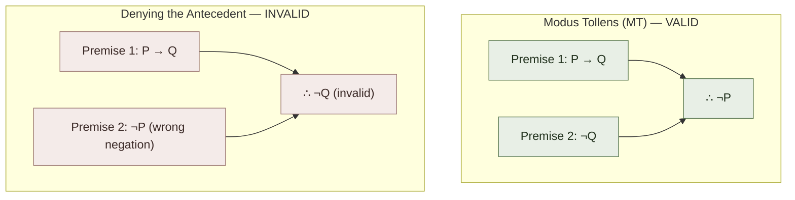
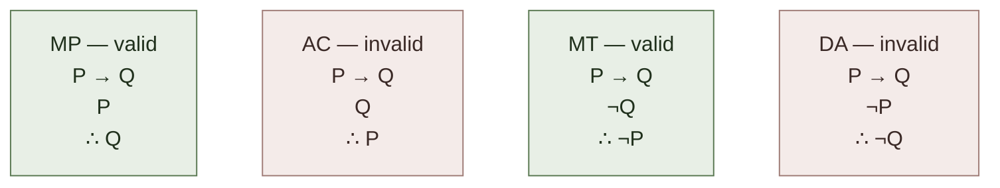

# Modus Tollens (Per-Rule Page)

**Summary**: A **full standalone page** for the second-most-used inference rule in natural deduction: **Modus Tollens** (MT). *If P → Q is given, and ¬Q is given, then ¬P follows*. **The contrapositive of [Modus Ponens](./per-rule-modus-ponens.md)**. Cataloged by Chrysippus c. 250 BCE; medieval Latin name *modus tollendo tollens* ("the way that, by denying, denies"). **The most-used rule in proof by contradiction**: assume the consequent is false; derive that the antecedent must be false. **Sister page to [per-rule-modus-ponens](./per-rule-modus-ponens.md)** completing the conditional-reasoning duo.

**Sources**:
- [Copi/Cohen/McMahon](./copi-introduction-to-logic.md) *Introduction to Logic* 14th ed, Ch 9.
- [methods-of-deduction](./methods-of-deduction.md) — collective treatment of the 19 rules.
- [per-rule-modus-ponens](./per-rule-modus-ponens.md) — sister page; same Chrysippus + medieval Latin lineage.
- Chrysippus of Soli (c. 279-c. 206 BCE) — first systematic articulation.

**Last updated**: 2026-05-25

---

## One-line

> *P → Q ; ¬Q ; ∴ ¬P*. The contrapositive of MP. **Denying the consequent** (the *valid* form) — NOT to be confused with [denying the antecedent](./fallacy-taxonomy.md) (the *invalid* form, *P → Q ; ¬P ; ∴ ¬Q*).

## Unlocks (lead, not footer)

1. **MT is the backbone of [proof by contradiction](./methods-of-mathematical-argument.md).** The reductio strategy works by assuming the negation of the conclusion, deriving a contradiction (or a falsehood from established premises), and concluding the original via DN. **The key inferential move that gets you from "the assumption leads to a falsehood" to "the assumption itself is false" is MT.** Without MT, reductio loses its core.

2. **MT + MP together exhaust direct conditional reasoning.** Given a conditional *P → Q*, only two pieces of evidence let you draw direct conclusions: *P* (giving *Q* via MP) or *¬Q* (giving *¬P* via MT). **Anything else — *¬P* or *Q* — gives you nothing direct**; those are the two dark-twin invalid forms ([denying the antecedent](./fallacy-taxonomy.md) and [affirming the consequent](./fallacy-taxonomy.md) respectively).

3. **MT corresponds to *empirical falsification* (Popper).** [Popper's](./science-and-hypothesis.md) falsifiability criterion is structurally MT applied to scientific hypotheses: *if hypothesis H predicts observation O, and we observe ¬O, then ¬H (the hypothesis is false)*. **The scientific method's strongest move — falsifying hypotheses by failed predictions — is MT.** Theory confirmation is messier; theory falsification has the rigor of MT.

4. **The dark twin (denying the antecedent) is the second-most-common formal error.** *P → Q ; ¬P ; ∴ ¬Q* is invalid because *P → Q* doesn't entail *¬P → ¬Q*. Example: *"If it rains, the ground is wet. It isn't raining. Therefore the ground isn't wet."* — sprinklers may have wet the ground anyway. **Drilling MT requires simultaneously drilling its dark twin's invalidity**, paralleling MP/AC.

## Mnemonic

***P → Q ; ¬Q ; ∴ ¬P*** = *"If P then Q. But not-Q. Therefore not-P."*

**Drill to <8 second reflex.** Same speed target as [MP](./per-rule-modus-ponens.md).

For the dark twin: ***P → Q ; ¬P ; ∴ ¬Q*** is **denying the antecedent (DA)** — invalid.

## Memory checksum

1. **State the form of Modus Tollens.** (*P → Q ; ¬Q ; ∴ ¬P*. Two premises: a conditional + the negation of its consequent. Conclusion: the negation of the antecedent.)
2. **State the form of denying the antecedent + why it's invalid.** (*P → Q ; ¬P ; ∴ ¬Q*. Invalid because *P → Q* doesn't entail *¬P → ¬Q*. Example: *"If it rains, ground is wet; not raining; ∴ ground isn't wet"* — but sprinklers may have wet it.)
3. **State MT's medieval Latin name + meaning.** (*Modus tollendo tollens* — "the way that, by denying, denies". The "denying" part is the *¬Q* premise; the "denies" part is the *¬P* conclusion.)
4. **State MT's relationship to Popper's falsifiability.** (Scientific falsification is structurally MT: hypothesis predicts observation; observation fails; hypothesis is false. The strongest move in the scientific method.)
5. **Why is MT load-bearing for [proof by contradiction](./methods-of-mathematical-argument.md)?** (Reductio assumes the negation of the conclusion, derives a contradiction, concludes the original via DN. MT is the inferential move that gets you from "the assumption leads to falsehood" to "the assumption itself is false". Without MT, reductio loses its core.)

## Visual — MT + its dark twin



**Worked examples**:

| Domain | Premise 1 | Premise 2 | Conclusion | Note |
|---|---|---|---|---|
| Everyday (MT) | If it's raining, the ground is wet. | The ground is not wet. | ∴ It's not raining. | — |
| Scientific — non-example | If Einstein's theory is correct, light bends near massive objects. | We observe light bending near massive objects (1919 eclipse). | MT does NOT fire here | Premise 2 confirms, not falsifies — this is the affirming-the-consequent direction |
| Scientific — MT fires | If theory T predicts O₁, observation should match O₁. | Observation doesn't match O₁. | ∴ Theory T is false (or T's prediction was wrong). | — |
| Proof by contradiction (MT) | If √2 is rational, then p and q in lowest terms can both be even. | ¬(p and q both even in lowest terms). | ∴ √2 is not rational (is irrational). | Goal: prove √2 is irrational. Assume √2 IS rational → p/q in lowest terms; derive p and q both even, contradicting "lowest terms" |
| Counter-example (DA) | If it's raining, the ground is wet. (true) | It is not raining. (true) | ∴ The ground is not wet — could be false; invalid | Counter-example: sprinklers ran, snow melted, or a flood came from upstream — ground is wet without rain |

**The four-form pattern — reminder**:



MP + MT valid; AC + DA invalid. Drill all 4 to reflex.

The visual completes the four-form pattern from [per-rule-modus-ponens](./per-rule-modus-ponens.md).

---

## The historical context

### Chrysippus's original five rules

[MP](./per-rule-modus-ponens.md)'s historical note covers Chrysippus's five basic argument forms. **MT was Chrysippus's #2** (Diogenes Laertius VII.79-81):

> *"If it is now day, it is now light.*
> *It is not now light.*
> *Therefore, it is not now day."*

The form is identical to modern MT. Chrysippus chose his examples for symmetry: MP uses *"it is day → it is light"* + *"it is day"*; MT uses the same conditional + *"it is not light"*.

### The medieval Latin name

*Modus tollendo tollens* — "the way that, by denying (*tollendo*), denies (*tollens*)". Compare *modus ponendo ponens* for MP. **The contrast is precise**: MP affirms the antecedent to affirm the consequent; MT denies the consequent to deny the antecedent.

### MT in 20th-century philosophy of science

**Karl Popper** (1934 *Logik der Forschung* / 1959 *Logic of Scientific Discovery*) made MT the central inference move of the scientific method. The falsifiability criterion is structurally MT:

> *If theory T is correct, then observation O should occur.*
> *Observation O does not occur.*
> *Therefore, theory T is not correct.*

**Popper's argument**: scientific theories cannot be conclusively *verified* by observations (every confirming observation is consistent with both T and not-T plus auxiliary hypotheses), but they CAN be conclusively *falsified* by observations (a failed prediction means either T is wrong or auxiliary hypotheses are wrong; the asymmetry favors MT-style refutation).

Popper's view has been refined (Duhem-Quine: when an observation fails to match, you can blame T or any of the auxiliary assumptions, so falsification is rarely as clean as MT suggests). But **the structural insight stands**: MT is the strongest single-move inference in scientific reasoning.

## When MT fires

MT fires whenever you have:
- A **conditional proposition** *P → Q*.
- The **negation of the consequent** *¬Q*.

The conclusion is **the negation of the antecedent** *¬P*.

### Recognition cues

- *"If X then Y"* + *"Y is not the case"* → MT fires, deriving *¬X*.
- *"Since X → Y, but Y is false"* → MT.
- *"Given that X → Y and Y fails to hold, X must fail too"* → MT explicit.
- *"X. Therefore Y. But we observe ¬Y. So our assumption X must be false."* → MT inside reductio.

### Examples in different fields

**Mathematics — proof by contradiction**:
> *"Assume √2 is rational. Then p/q in lowest terms with p and q integers. Squaring: p² = 2q². So p² is even, hence p is even. Write p = 2k. Then 4k² = 2q², so q² = 2k², so q is even. But p and q both even contradicts 'in lowest terms'. So our assumption (√2 is rational) is false. ∴ √2 is irrational."*
> 
> Structure: hypothesis H = "√2 is rational". Derivation: H → (p, q in lowest terms can both be even). Premise 2: ¬(p, q both even in lowest terms). MT: ∴ ¬H, i.e., √2 is irrational.

**Science — Newtonian gravity vs Mercury's perihelion**:
> *"If Newtonian gravity is exactly correct (no relativistic corrections), then Mercury's orbital perihelion advances 532 arcseconds per century. Observation: Mercury's perihelion advances 575 arcseconds per century. ∴ Newtonian gravity is not exactly correct."*
> 
> MT applied: hypothesis (Newtonian exactly correct) implies prediction (532 arcseconds); prediction doesn't match observation (575); ∴ hypothesis is not exactly correct.

**Legal — refuting alibis**:
> *"If the defendant was at the conference in Chicago at 9 PM, he could not have committed the murder in Boston at 9 PM. Forensic evidence places defendant in Boston at 9 PM. ∴ The defendant was not at the conference in Chicago at 9 PM."*
> 
> MT applied to the alibi's implication.

**Philosophy — refuting metaphysical claims**:
> *"If God is both omnipotent and omnibenevolent, gratuitous evil should not exist. Gratuitous evil exists (observably). ∴ God is not both omnipotent and omnibenevolent."*
> 
> (The "problem of evil" in MT form. Many responses dispute Premise 1 or Premise 2; the *form* is MT.)

**Programming — debugging via expected output**:
> *"If function f is implemented correctly, f(input₁) should return output₁. f(input₁) returns output₂ instead. ∴ Function f is not implemented correctly."*
> 
> MT applied to debugging. Failed test cases use MT.

## The dark twin — denying the antecedent

**Invalid form**: *P → Q ; ¬P ; ∴ ¬Q*.

This is **NOT MT**. The premises here are the conditional + the *negation of the antecedent* (not the consequent). The "conclusion" attempts to derive the negation of the consequent from the negation of the antecedent — but the conditional only runs one direction.

**Why it's invalid**: *P → Q* doesn't entail *¬P → ¬Q*. *Q* may have multiple sufficient conditions; ruling out *P* doesn't rule out *Q*.

**Classic counter-example**:
> *"If it's raining, the ground is wet. It isn't raining. Therefore the ground isn't wet."*
> Counter-example: sprinklers ran. Or the snow melted. Or there was a flood.

**Why it's a common error**: in everyday reasoning, we often *do* know that *¬P → ¬Q* (no rain implies no rain-caused wetness, AND we tend to forget other causes of wetness). The error is treating an exclusive *cause-effect* link as if the cause were the *only* cause.

**Drill discipline**: every time you encounter *P → Q* + *¬P*, ask explicitly *"is this MT or DA?"*. The answer is DA; refuse to derive *¬Q*. **<15 second reflex** for this discrimination.

## MT chains + iterated MT

MT can be **iterated** through a chain of conditionals:

```
1. A → B          Premise
2. B → C          Premise
3. ¬C             Premise
4. ¬B             2, 3, MT
5. ¬A             1, 4, MT
∴ ¬A
```

This chain runs MT backward through a 2-step conditional chain. Generally: given *A → B → C → ... → Z* and *¬Z*, you can iterate MT to derive *¬A*. **This is the inferential pattern of [proof by contradiction](./methods-of-mathematical-argument.md) applied through a multi-step derivation.**

### MT + Modus Ponens together — completeness for conditionals

The combination MP + MT exhausts what you can directly conclude from a conditional + a single piece of evidence:

| Conditional | Evidence | Valid conclusion | Rule |
|---|---|---|---|
| *P → Q* | *P* | *Q* | MP |
| *P → Q* | *¬Q* | *¬P* | MT |
| *P → Q* | *Q* | (nothing) | — (AC is invalid) |
| *P → Q* | *¬P* | (nothing) | — (DA is invalid) |

**Anything you'd want to conclude from a conditional + evidence must fire MP or MT.** The two are the complete direct-reasoning duo for conditionals.

## MT and the contrapositive

The **contrapositive** of *P → Q* is *¬Q → ¬P*. **The two are logically equivalent** (truth-functionally; *Trans* in Copi's replacement rules).

So MT can be reframed as: *P → Q* (which equals *¬Q → ¬P* by contrapositive) + *¬Q* → ∴ *¬P* (now via MP applied to the contrapositive form).

**MT is MP applied to the contrapositive.** This equivalence is sometimes useful when constructing proofs: you can either reach for MT directly, or first apply Trans to get the contrapositive then MP.

## MT in proof by contradiction (the load-bearing role)

**Proof by contradiction structure**:

```
Goal: Prove C.

1. Assume ¬C.
2. Derive premises P₁, P₂, ... (from established facts).
3. Show ¬C → contradiction (using P₁, P₂, ...).
4. Therefore ¬¬C (by MT from step 3 + the fact that contradiction is false).
5. Therefore C (by DN).
∴ C.
```

**The MT fire**: step 4 is MT applied to the conditional ¬C → ⊥ + the premise ¬⊥ (contradiction is false).

Most non-trivial mathematical proofs use this pattern. **MT is the load-bearing inference move of every reductio.**

## Common errors in applying MT

### Error 1 — Confusing MT with DA

The most common error. *"If P then Q; not-P; therefore not-Q"* mistakenly drawn as MT. **The reflex correction**: check that the second premise is *¬Q* (the negation of the consequent), not *¬P* (the negation of the antecedent).

### Error 2 — Forgetting the negation in the conclusion

A student might write the MT conclusion as *P* instead of *¬P*, or forget to negate altogether. **The reflex**: the conclusion's polarity matches the antecedent flipped via the conditional + the consequent's negation.

### Error 3 — Confusing the conditional direction

If the conditional is *Q → P* instead of *P → Q*, then *¬Q* is not the relevant evidence for MT — *¬P* is. **Check direction**: which direction does the conditional run?

### Error 4 — Treating MT as if it requires biconditional

Some students believe MT requires *P ↔ Q* (biconditional), not just *P → Q*. **It doesn't**. MT works on simple conditionals.

### Error 5 — Forgetting MT in scientific reasoning

A scientist who has carefully formulated a hypothesis but doesn't recognize that *a failed prediction is the only conclusive disconfirmation* may continue to believe the hypothesis despite repeated failed predictions. **MT in science = the willingness to be falsified.**

## Cross-link to the wiki

| Wiki layer | MT's contribution |
|---|---|
| [methods-of-deduction](./methods-of-deduction.md) | MT is the second of the 9 elementary inference rules |
| [per-rule-modus-ponens](./per-rule-modus-ponens.md) | Sister page; MT is the contrapositive complement |
| [validity-vs-soundness](./validity-vs-soundness.md) | MT is a canonical valid form |
| [fallacy-taxonomy](./fallacy-taxonomy.md) §Formal | DA (the dark twin) is a primary formal fallacy |
| [methods-of-mathematical-argument](./methods-of-mathematical-argument.md) | MT is load-bearing for proof by contradiction (Method 2) |
| [truth-function-machine](./truth-function-machine.md) | MT justified by the truth-table for material implication |
| [picture-theory-of-language](./picture-theory-of-language.md) | MT's validity is *shown* by the truth-table |
| [argument-anatomy](./argument-anatomy.md) | MT is the inference relation in many empirical-falsification arguments |
| [science-and-hypothesis](./science-and-hypothesis.md) | Popperian falsifiability is structurally MT applied to scientific hypotheses |
| [worked-natural-deduction-proof](./worked-natural-deduction-proof.md) | MT chains through reductio strategies |
| [copi-introduction-to-logic](./copi-introduction-to-logic.md) | Ch 9 source |
| [modal-logic-primer](./modal-logic-primer.md) | MT extends to modal logic where conditionals are involved |

## METER integration

| Drill | Pass floor | Source |
|---|---|---|
| Apply MT to a given conditional + denied consequent | <8 s, ≥95% | this page §Examples |
| Distinguish MT from DA in adversarial examples | <15 s, ≥95% | this page §Dark twin |
| Identify MT in a proof-by-contradiction structure | <30 s | this page §MT in PbC |
| Identify MT in a Popperian scientific falsification | <30 s | this page §Examples §Science |
| Chain MT backward through 3-4 conditionals | <60 s | this page §MT chains |
| State the 4-form pattern (MP/MT/AC/DA) | <30 s | this page §Memory checksum |

## Per-rule template — exemplar continued

This page is the **second per-rule page** following the template established in [per-rule-modus-ponens](./per-rule-modus-ponens.md). The two pages together cover the **MP/MT conditional-reasoning duo**.

**Future per-rule pages would extend the duo**:
- *per-rule-hypothetical-syllogism* (HS): *P → Q ; Q → R ; ∴ P → R*. The chaining rule that "compresses" two conditional steps into one.
- *per-rule-disjunctive-syllogism* (DS): *P ∨ Q ; ¬P ; ∴ Q*. Elimination via negation.
- *per-rule-constructive-dilemma* (CD) and *per-rule-destructive-dilemma* (DD): dual rules for disjunctions of conditionals.
- *per-rule-simplification* (Simp), *per-rule-conjunction* (Conj), *per-rule-addition* (Add): three simple rules for conjunction + disjunction introduction/elimination.
- 10 replacement rules.
- 4 quantification rules (UI · UG · EI · EG).

**Decision**: per-rule pages are valuable for atomic-rule drilling but represent diminishing returns past MP/MT/HS/DS. **The wiki has MP + MT now; future per-rule pages should be authored selectively** based on user demand.

## Related pages

- [per-rule-modus-ponens](./per-rule-modus-ponens.md) — sister page; the MP/MT conditional-reasoning duo
- [methods-of-deduction](./methods-of-deduction.md) — collective treatment of all 19 + 4 atomic rules
- [copi-introduction-to-logic](./copi-introduction-to-logic.md) — Ch 9 source
- [fallacy-taxonomy](./fallacy-taxonomy.md) §Formal — denying-the-antecedent (the dark twin)
- [validity-vs-soundness](./validity-vs-soundness.md) — MT is a canonical valid form
- [methods-of-mathematical-argument](./methods-of-mathematical-argument.md) — MT load-bearing for proof by contradiction
- [science-and-hypothesis](./science-and-hypothesis.md) — Popperian falsifiability = MT applied to science
- [truth-function-machine](./truth-function-machine.md) — MT justified by truth-table for material implication
- [picture-theory-of-language](./picture-theory-of-language.md) — MT's validity is *shown* in the truth-table
- [argument-anatomy](./argument-anatomy.md) — MT as inference relation in empirical-falsification arguments
- [worked-natural-deduction-proof](./worked-natural-deduction-proof.md) — MT in reductio strategies
- [modal-logic-primer](./modal-logic-primer.md) — modal logic preserves MT
- [logic-atomic-design](./logic-atomic-design.md) §Atoms → Rules → MT — the atom this page owns
- [glossary](./glossary.md) — Logic layer registration (Modus Tollens · Denying the Antecedent · Chrysippus · Popperian falsification)
