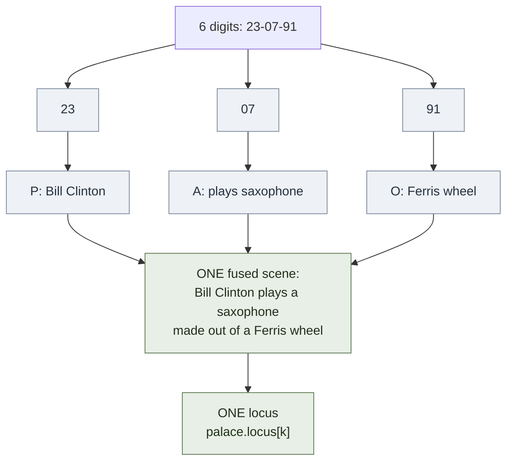

# Person-Action-Object (PAO) System

**Summary**: The PAO (Person-Action-Object) system is a high-compression mnemonic technique that encodes numeric and symbolic sequences as cinematic triples: every 2-digit group `00–99` is pre-assigned a person, an action, and an object, then any longer sequence is read three groups at a time and *fused* into one scene — the **person** from the first group performs the **action** of the second on the **object** of the third. A 6-digit number becomes one image; a 12-digit number becomes two; the loading factor on the [memory palace](./memory-palace.md) drops by 3×. PAO is the operational core of competitive memory-sport digit and card disciplines (Dominic O'Brien's variant, Ben Pridmore's 3-digit extension, Foer's *Moonwalking with Einstein* exposition). This page is the canonical owner.

**Sources**:
- O'Brien, D. (1993). *How to Develop a Perfect Memory* — the Dominic System (initials-from-PAO-people) and PAO's competitive-memory variant.
- Foer, J. (2011). *Moonwalking with Einstein* — popular exposition; Ed Cooke + Lukas Amsüss teaching scenes.
- Lorayne, H. & Lucas, J. (1974). *The Memory Book* — predecessor [Substitute Word](./substitute-word-system.md) foundation that PAO builds on.
- Buzan, T. (1986). *Use Your Perfect Memory* — earlier Major-system + PAO hybrid presentation.
- Internal: [memory-palace](./memory-palace.md), [major-system-for-mathematical-notation](./major-system-for-mathematical-notation.md) (the phonetic encoding that produces PAO triples).

**Last updated**: 2026-06-09

---

## Core mechanism

1. **Pre-assign 100 PAO triples** (one per 2-digit group `00`–`99`). Each row contains a **Person** (distinctive figure), an **Action** (vivid verb), and an **Object** (concrete prop).
2. **Read the target sequence in 6-digit chunks**. Split each chunk into three 2-digit groups: P-group, A-group, O-group.
3. **Fuse one scene**: the *person* from the first group performs the *action* from the second group on the *object* from the third group.
4. **Place the fused scene at one [palace](./memory-palace.md) locus**. A 12-digit number occupies two loci, a 30-digit number five loci, and so on.

The Dominic System is the most common assignment scheme: each 2-digit group maps via a letter-pair (`23 = BC = Bill Clinton`), and Clinton's canonical Action + Object are pre-trained. Major-system phonetic encoding ([major-system-for-mathematical-notation](./major-system-for-mathematical-notation.md)) is the alternative path.

## Worked example

Target: `23-07-91`

- `23` → **Bill Clinton** (Dominic letter-pair B-C → Clinton)
- `07` → Action: **playing saxophone** (Clinton's signature action)
- `91` → Object: **Ferris wheel** (the assigned 91-object)

Fused scene: *Bill Clinton plays a saxophone made out of a Ferris wheel.* One image at one palace locus → 6 digits encoded.

For `23-07-91-44-15-62`: two such scenes at two adjacent loci.

## Why the 3× compression matters

A pure-substitution scheme (one image per 2-digit group) needs 3 loci to hold 6 digits. PAO needs 1 locus. For long sequences (memorized π expansions, full decks of cards, 100-digit competition strings), the palace runs out of loci long before working-memory runs out of imagination — so the bottleneck is **loci consumption**, not image vividness. PAO compresses against the actual bottleneck.

A card-deck variant assigns PAO triples to all 52 cards; a full deck becomes ~17 fused scenes at ~17 loci. World-record memorizers (Pridmore, Konrad) use 3-digit PAO extensions (`PAO-1000`), pushing the compression ratio to 9 digits per locus.

A sibling answer to the same constraint, from a different angle, is Kozarenko's [ТОО](./table-of-support-images.md): instead of compressing more digits into each locus, it manufactures roughly 900 fresh, numerically-addressed loci out of an already-automatized number-code vocabulary, so the address space itself stops being the scarce resource. Where PAO fights loci-consumption by packing more payload per locus, ТОО fights it by minting more loci.

For cards specifically, Kozarenko has a different alternative again: the **[Компас](./spatial-coding.md)** technique reads a card's suit off the *quadrant* of a locus and its rank off a number-image code, so the deck reconstructs from two cheap channels instead of 52 bespoke PAO triples. The two methods solve the same card-memory problem from opposite directions — image-heavy scene (PAO) vs. position-light geometry ([spatial-coding](./spatial-coding.md)) — and neither is claimed superior.

## Visual



Compression comparison — digits held per palace locus:

```chart height=260
{"xAxis":{"type":"category","data":["Without PAO\n(substitute-word)","With PAO","With PAO-1000"]},
 "yAxis":{"type":"value","name":"digits per locus"},
 "series":[{"type":"bar","data":[2,6,9],"itemStyle":{"color":"#5c7a54"}}]}
```

Without PAO: 6 digits = 3 substitute-word images = 3 loci (2 digits/locus). With PAO: 6 digits = 1 fused scene = 1 locus — 3× compression. With PAO-1000: 9 digits = 1 scene = 1 locus — 9× compression.

## Setup cost is the bottleneck

The PAO table itself must be pre-built and *automatic* before the system pays out. Building 100 triples is a one-time ~10-hour investment (memory-sport convention: build via Major or Dominic letter-pairs, drill on Anki to <1s recall, then practice fusion). The system has zero benefit until the table is reflex-grade — see [automaticity-and-reflex-training](./automaticity-and-reflex-training.md) for the drill profile.

This is why PAO has a high *adoption cliff* and a low *operating cost*: most learners abandon during the table-building phase before the system pays back. Operators who get past the cliff report 3–10× speed-ups on numeric memorization vs single-substitution.

## Failure modes

| Failure | Symptom | Mitigation |
|---|---|---|
| **Table not automatic** | Reading 23 → "uh, Bill... Clinton... right" | Anki drill to <1s before encoding live material |
| **Bland triples** | Generic actions (running, walking) blur across loci | Each Action + Object must be sensory-rich and disambiguatable |
| **PAO collision** | Two scenes at adjacent loci share Person → confusion at recall | Re-assign one of the two; pick a maximally-distinct person |
| **Fusion failure** | P, A, O kept as three separate images at one locus | Practice scene-fusion explicitly; the *interaction* is the encoded unit |
| **Order-of-PAO drift** | Encoding `23-07-91` as Action-Person-Object | Fixed canonical order (P then A then O) drilled into the encoding ritual |

## Neural OS implementations

- [memory-palace](./memory-palace.md) — PAO scenes occupy palace loci
- [major-system-for-mathematical-notation](./major-system-for-mathematical-notation.md) — alternative phonetic path that produces PAO triples
- [substitute-word-system](./substitute-word-system.md) — single-image base; PAO is the 3× compression layered on top
- [calendar-memory](./calendar-memory.md), [calendar-reflex](./calendar-reflex.md) — PAO triples encode date arithmetic
- verse-memorization — chapter/verse numbers encoded via PAO

## Related pages

- [memory-palace](./memory-palace.md) — the substrate PAO occupies
- [substitute-word-system](./substitute-word-system.md) — the substitute-word foundation
- [major-system-for-mathematical-notation](./major-system-for-mathematical-notation.md) — the digit→consonant phonetic path
- [automaticity-and-reflex-training](./automaticity-and-reflex-training.md) — the drill profile needed to make the table reflex-grade
- [foer-moonwalking-with-einstein](./foer-moonwalking-with-einstein.md) — popular exposition
- [geography-mnemonic-route](./geography-mnemonic-route.md)
- [mnemonic-methods-master](./mnemonic-methods-master.md)
- [table-of-support-images](./table-of-support-images.md) — Kozarenko's synthetic-loci answer to the same loci-consumption bottleneck, from the opposite direction (more loci, not more payload per locus)
- [spatial-coding](./spatial-coding.md) — Компас, a position-based alternative to PAO for card memorization (quadrant = suit, number-image = rank)

---

## U — See (CAST)
1. Triple-up: one person performs one action on one object
2. 6 digits collapse into one cinematic scene at one locus

## D — Name (NEDF)
1. PAO = Person-Action-Object 2-digit triple system
2. Distinguisher: scene-fusion (not three stacked images)
3. Failure mode: table not automatic before live use

## F — Do (SPEAR)
1. Build 100-row table → drill to <1s → encode in P-A-O groups → fuse → place
2. Read 6 digits → 3 groups → fuse → 1 locus

## B — Watch (HEART)
1. "Almost remembering" the Person → table not reflex yet
2. Adjacent loci sharing a Person → collision risk

## L — Predict (ORACLE)
1. Table automatic → encoding speed 3× substitute-word
2. Table not automatic → encoding speed *worse* than substitute-word

## R — Act (GRACE)
1. Long numeric target → PAO over single-substitution
2. Short target (≤6 digits) → substitute-word is enough
