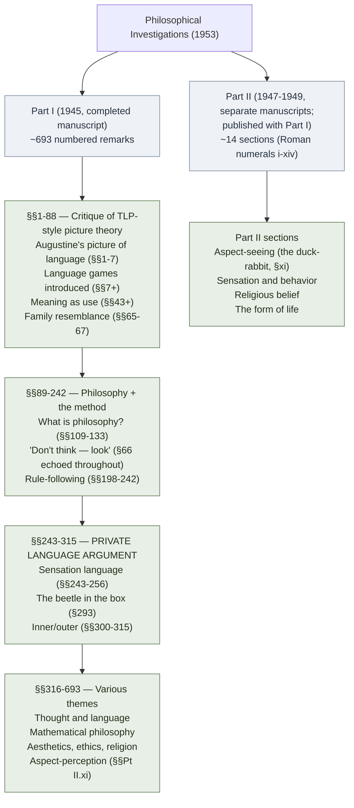

# Philosophical Investigations (Overview)

**Summary**: Ludwig Wittgenstein's **posthumous 1953 book** (German + English in parallel; Anscombe + Rhees editors). The late-Wittgenstein's response to his own TLP. Introduces **language games**, **family resemblance**, **meaning as use**, the **private language argument**, and **rule-following considerations**. Not ingested as a primary source in the Wave-1-4 logic ingest (only Copi + TLP + Logicomix were sources); this page is built from what's referenced *in those sources* + canonical knowledge of *Investigations*, flagged accordingly. **A proper Wave-5+ source ingest of *Investigations* would deepen this page substantially.**

**Sources**:
- *Investigations* itself is **not in the Wave-1-4 logic-ingest source corpus.** This page is built from:
  - [tractatus-logico-philosophicus](./tractatus-logico-philosophicus.md) (where Wittgenstein's later refutation is mentioned)
  - [wittgenstein-ludwig](./wittgenstein-ludwig.md) (biographical context)
  - [logicomix-graphic-novel](./logicomix-graphic-novel.md) (narrative mentions of the late period)
  - Canonical knowledge of the late-Wittgenstein literature
- **Provisional**: this page is the wiki's best-available account from the existing-sources discipline. A future *Investigations* ingest would replace canonical-knowledge content with directly-cited textual content.
- Standard primary text: Ludwig Wittgenstein, *Philosophische Untersuchungen / Philosophical Investigations* (Blackwell 1953, ed. G.E.M. Anscombe + Rush Rhees). Cited in canonical translation by Anscombe; later by Hacker-Schulte (2009 revised edition).

**Last updated**: 2026-08-20 (`glyph:` assigned — [representation-rules](./representation-rules.md) Rule 11); 2026-05-25

---

## One-line

> Language is not one thing with one logical structure; it is a **family of activities** (language games), and **meaning is constituted by use** within these activities. The book has **no single argument**; it consists of ~700 numbered remarks. Reading *Investigations* is itself the methodological lesson — *"don't think — look."* (§66)

## Unlocks (lead, not footer)

1. **The post-1953 transformation of analytic philosophy.** *Investigations* (along with Quine, Davidson, Kripke) reshaped 20th-century analytic philosophy. Its influence in ordinary-language philosophy (Austin, Ryle), philosophy of mind (rejection of Cartesian privacy via the private language argument), philosophy of mathematics (rule-following considerations + Kripkenstein), and post-positivist epistemology is enormous. **For 70 years, *Investigations* has been the most-cited 20th-century philosophy book in the English-speaking world.**

2. **"Don't think — look."** (§66) The methodological slogan. When you encounter a philosophical puzzle, instead of constructing a theory to *explain* it, **look at how the relevant words are actually used** in everyday contexts. The puzzle often dissolves when you stop assuming a single hidden essence and just observe the variety of uses. **The reflex applies far beyond Wittgenstein** — it's the wiki's [take-seriously-but-hold-lightly](./memory-paradox.md) applied to one's own theoretical impulses.

3. **The private language argument.** §§243-315. The most-discussed single passage in the book. Argues that a *strictly private* language — one whose words refer to inner sensations only the speaker can know — is impossible, because meaning requires public criteria for correctness. **The argument has implications for**: philosophy of mind (rejection of Cartesian inner privacy), philosophy of psychology (behaviorism vs introspectionism), epistemology (the foundations of self-knowledge), philosophy of religion (the publicity of religious language).

4. **Family resemblance over essence.** §§65-67. Wittgenstein's example: what do *games* (chess · tennis · ring-around-the-rosie · solitaire · jigsaw puzzles · Olympic games) have in common? **There is no single essence**; there is a network of overlapping similarities. *Family resemblance* (Familienähnlichkeit). The doctrine has enormous downstream impact: any "what is X?" question that presupposes a single essence may be wrongly framed; the wiki's reflex is to ask whether *family resemblance* + *use within practice* is the better answer.

## Mnemonic

**L-G-F-M-P-R** = *Language Games · Family resemblance · Meaning as use · Private language argument · Rule-following.*

Six core themes. Read directly. Each is the load-bearing claim of a section of the book.

## Memory checksum

1. **State the central methodological slogan.** ("Don't think — look." §66. When you encounter a philosophical puzzle, look at how the words are actually used in everyday contexts rather than constructing a theory of their hidden essence.)
2. **What is a language game?** (§§7+. A bounded activity in which language is used in a specific way — describing, reporting, ordering, asking, joking, praying, calculating, etc. Each is a *form of life*. Language is the totality of language games, not a single unified structure.)
3. **What is family resemblance?** (§§65-67. Concepts are unified by *overlapping similarities*, not by a single defining essence. Wittgenstein's example: *game* covers chess + tennis + solitaire + jigsaw + Olympic — no single feature is common to all, but they have overlapping similarities. Most philosophical "essential definition" projects are wrongly framed.)
4. **What is meaning as use?** (§43: *"the meaning of a word is its use in the language."* Meaning is not a Platonic essence, not a mental image, not a picture-theoretic correspondence — it is the *role the word plays in linguistic practice*. To know what a word means is to know how to use it correctly.)
5. **State the private language argument's conclusion.** (§§243-315. A strictly private language — referring only to inner sensations the speaker alone can know — is impossible. Meaning requires public criteria for correctness. *"An 'inner process' stands in need of outward criteria"* (§580).)

## Visual — the structure of the book

**Stylistic features**:

- Numbered remarks, not chapters
- Often dialogue-style: imagined interlocutor's objection followed by Wittgenstein's response
- Few definitions; many examples
- Repetition + variation of themes
- Some remarks ~1 sentence; others several pages
- NO conclusions in the formal sense
- Posthumous — Wittgenstein never finalized

The book has **no linear argument**; reading it is itself the methodological lesson.

---

## The core moves

### Augustine's picture of language (§§1-7)

The book opens with a quotation from Augustine's *Confessions* describing how Augustine learned language as a child — by being shown objects and hearing their names. Wittgenstein criticizes this picture as **too simple**: it assumes language is fundamentally about naming objects, and that all words function this way.

But what about *"if"*, *"now"*, *"five"*, *"pain"*, *"good"*? Naming a denotation doesn't capture how these words work. The Augustinian picture has overgeneralized one limited model.

**Wittgenstein's move**: introduce a series of *language games* in which language is used in different ways. Building-block language (§2): a builder calls *"slab"* and the assistant brings a slab. **No mental images, no essence-of-slab; just learned response.** The language game is meaning's home.

### Language games (§§7+)

A **language game** is a bounded activity in which language is used in a specific way. Wittgenstein lists examples (§23): describing, reporting, observing, speculating, telling stories, making jokes, asking, thanking, cursing, greeting, praying.

**Crucially**: there is no single thing called "language" with a single essential structure. There are *language games* — many of them — each with its own rules. Some involve description; some involve action; some involve performance.

**The implication for TLP**: TLP's truth-function machinery assumed all meaningful propositions reduce to truth-functional combinations of elementary propositions. **But asking "where is the truth-functional structure of *thanks*?" reveals the assumption.** The question is wrongly framed. Thanking is a *language game*, not a proposition.

### Meaning as use (§43)

> *"For a large class of cases — though not for all — in which we employ the word 'meaning' it can be defined thus: the meaning of a word is its use in the language."*

**Meaning is not**:
- A Platonic essence the word "stands for"
- A mental image
- A picture-theoretic correspondence
- A definition in terms of necessary-and-sufficient conditions

**Meaning is**:
- The role the word plays in the language game
- What you do *with* the word
- What constitutes using it correctly vs incorrectly within the practice

**The "correctness" criterion is public**, not private. Meaning requires that there be a shared practice in which correct/incorrect use is intelligible. This sets up the private language argument.

### Family resemblance (§§65-67)

Wittgenstein challenges the request: *"what is common to all language games that makes them language?"*

> *"Don't say: 'there must be something common, or they would not be called 'games' — but look and see whether there is anything common to all."*

He then surveys games: board games (chess, Go) involve strategy and rules; ball games (tennis, baseball) involve physical skill; card games involve hidden information; children's games (ring-around-the-rosie) involve play and joy.

**No single feature is shared by all.** Some share with some; others share with others. The unity of *game* is **family resemblance** — overlapping similarities, like the resemblances among siblings in a family.

**The implication**: many philosophical "essential definition" projects are wrongly framed. The wiki cross-links: when asked *"what is the essence of X?"*, often the better question is *"what family of activities does X cover?"*

### Rule-following (§§198-242)

What does it mean to *follow a rule*? Wittgenstein presents a series of puzzles:

- Add 2 to 1000 → 1002. Add 2 to 1002 → 1004. ... But how do you know to keep adding 2? Why not start adding 4 after 1000?
- A child learning a series may go "+2" until 1000, then naturally extend to "+4". Has the child broken the rule? Or were they following a different rule that just *looks like* "+2" up to 1000?

**Wittgenstein's point**: rule-following is not internal mental computation; it is **embedded in the practice of a linguistic community**. A rule's meaning is constituted by how the community uses + corrects it.

Saul Kripke's famous later interpretation (*Wittgenstein on Rules and Private Language* 1982, "Kripkenstein") draws **skeptical** conclusions about rule-following + meaning. Whether Kripke's reading is faithful to Wittgenstein is contested; the rule-following passages are *the* most-debated section of *Investigations*.

### The private language argument (§§243-315)

The argument's structure (compressed; the original is complex):

1. **Suppose** a *strictly private* language — one whose words refer only to *sensations* the speaker alone can know (call this "S-language").
2. Words in S-language must have *correct* + *incorrect* uses (otherwise they don't really mean anything).
3. *Correctness* requires a *criterion* by which to tell correct from incorrect.
4. But for a *strictly private* sensation, **the speaker has no independent check** — whatever seems correct to them at the moment counts as correct.
5. *Whatever seems correct = correct* is **not a criterion** but the absence of one.
6. **Therefore S-language has no correctness criterion** and is not really a language.

**The "beetle in the box" example (§293)**: imagine everyone has a box with a "beetle" inside; no one can look in anyone else's box; everyone has access only to their own beetle; the box might be empty for some, contain a different thing for others. **In this scenario, the word "beetle" cannot function via reference to the contents of any individual box** — it must work via something publicly accessible (the social practice around boxes).

**Implications**:
- **Cartesian inner privacy**: rejected. The mental cannot be a domain knowable only privately.
- **Behaviorism**: not quite the conclusion. Wittgenstein isn't reducing the mental to behavior; he's saying the *language* for the mental requires public criteria.
- **Philosophy of mind**: reshaped. The hard problem of consciousness becomes (in this tradition) the question of how public criteria are possible for what seems essentially private.

### Aspect-seeing (Part II.xi)

The famous **duck-rabbit** drawing — a figure that can be seen as either a duck or a rabbit, depending on attention.

**Wittgenstein's point**: aspect-perception is not a *purely visual* phenomenon. To see the figure as a duck is to engage a network of concepts about ducks; to see it as a rabbit, a network about rabbits. **The same visual stimulus participates in different conceptual frameworks**, and the "switch" is an activity, not a passive observation.

**Implications**: perception is not theory-neutral; observation is always under-determined by sensory input; perceiving X "as Y" is itself a language-game-bound activity.

## How *Investigations* relates to the wiki

| Wiki layer | *Investigations* contribution |
|---|---|
| [Take-seriously-but-hold-lightly](./memory-paradox.md) | The book *is* Wittgenstein's own application of the rule to TLP |
| [Picture theory](./picture-theory-of-language.md) | TLP's picture theory is *Investigations*' chief target; the wiki retains TLP picture theory operationally but the *Investigations* critique tempers any over-reliance |
| [Show-vs-say](./show-vs-say.md) | Survives in the late period as *meaning shown by use* |
| [Copi Ch 3](./copi-language-and-definitions.md) | The five kinds of definition + cognitive vs emotive meaning are pre-*Investigations* in spirit; *Investigations*' family-resemblance critique sharpens the discussion |
| [BRIDGE LOAD](./bridge-load.md) | Family-resemblance lens is operationally what BRIDGE LOAD uses |
| [scene-grammar](./scene-grammar.md) | The 7 elements + 9 principles are themselves a "family of cases" not a strict essence |
| [anti-tactic-detection](./anti-tactic-detection.md) | "Don't think — look" is what anti-tactic detection asks the user to do |
| [problem-solving-os](./problem-solving-os.md) §Frame | "Don't think — look" applies in problem framing |

## Why *Investigations* is hard to read

- **No linear argument.** ~700 numbered remarks with limited explicit structure.
- **Dialogue style.** Often an imagined interlocutor objects + Wittgenstein responds; without context, the speaker can be ambiguous.
- **Few definitions.** Wittgenstein refuses to define his key terms (language game, form of life); he gives examples and lets the reader extract.
- **Repetition + variation.** The same theme appears in slightly different forms across the book; readers can miss the thread.
- **Aphoristic compression.** Many remarks are 1-2 sentences; their full force unfolds only against the whole.

**The standard reading discipline**: read slowly; read multiple times; read alongside a commentary (Hacker-Baker is standard; Mulhall, McGinn, Cavell are alternative perspectives).

## The Kripkenstein debate

Saul Kripke's *Wittgenstein on Rules and Private Language* (Harvard 1982) presented an interpretation of the rule-following sections as **deeply skeptical** — claiming Wittgenstein's argument establishes that no objective fact determines what rule someone is following. The interpretation became known as **Kripkenstein**.

**The debate**:
- Kripkenstein takes the rule-following passages at maximum skeptical strength.
- *"Standard" Wittgenstein interpretations* (Hacker-Baker, McDowell) read Wittgenstein as offering a *therapeutic* response to skepticism, not an endorsement of it.
- Both readings are textually defensible; the contested passages support different readings.

**The wiki's stance** (per [memory-paradox](./memory-paradox.md)): take the rule-following passages seriously enough to engage; hold any specific interpretation (including Kripkenstein) lightly enough to recognize the textual under-determination.

## Source-discipline note

This page is **provisional**. The Wave-1-4 logic ingest sources were Copi + TLP + Logicomix; *Investigations* itself is not in the ingest corpus. This page is built from:

1. References to *Investigations* in the wiki's existing pages.
2. Canonical knowledge of late-Wittgenstein philosophy.

**A proper Wave-5+ ingest of *Investigations*** (with the German + English parallel text) would:
- Replace canonical-knowledge content with directly-cited textual content.
- Add specific section/paragraph references.
- Surface late-Wittgenstein themes the wiki hasn't yet engaged.
- Enable proper text-grounded analysis.

The wiki flags this page's source-status explicitly; a future Wave 5+ source ingest is queued.

## METER integration

| Drill | Pass floor | Source |
|---|---|---|
| State the methodological slogan + section | <15 s | "Don't think — look." §66 |
| Define a language game with example | <30 s | this page §Language games |
| State the meaning-as-use claim + section | <30 s | "The meaning of a word is its use in the language." §43 |
| State family resemblance | <30 s | this page §Family resemblance |
| State the private language argument's conclusion | <60 s | this page §Private language |
| Distinguish standard Wittgenstein from Kripkenstein | <60 s | this page §Kripkenstein debate |

## Related pages

- [tractatus-logico-philosophicus](./tractatus-logico-philosophicus.md) — the early-period book *Investigations* responds to
- [early-vs-late-wittgenstein](./early-vs-late-wittgenstein.md) — direct comparison
- [wittgenstein-ludwig](./wittgenstein-ludwig.md) — author biography
- [picture-theory-of-language](./picture-theory-of-language.md) — what *Investigations* refutes most directly
- [show-vs-say](./show-vs-say.md) — what *Investigations* recasts as meaning-by-use
- [memory-paradox](./memory-paradox.md) — the meta-rule for handling both Wittgenstein periods
- [copi-language-and-definitions](./copi-language-and-definitions.md) — pre-*Investigations* treatment of meaning that *Investigations* deepens
- [bridge-load](./bridge-load.md) · [scene-grammar](./scene-grammar.md) — wiki applications of family-resemblance + use-based meaning
- [logic-atomic-design](./logic-atomic-design.md) — Wave 5 closing entry
- [glossary](./glossary.md) — Logic layer registration
