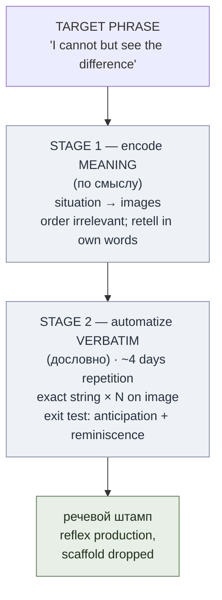
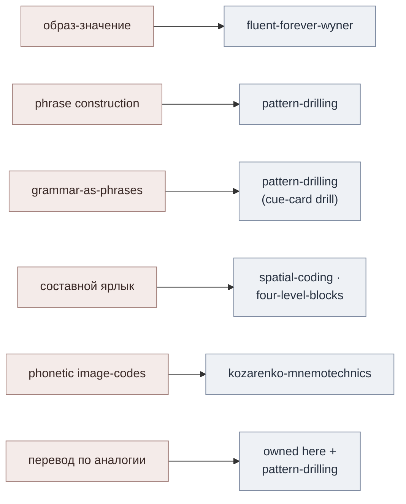

# Phrase-Based Acquisition

**Summary**: The [GMS](./kozarenko-mnemotechnics.md) language layer where the **phrase**, not the word, is the acquisition unit — a two-stage protocol (encode the phrase's meaning as an image, then automatize it over ~4 days into a reflexive *речевой штамп*). It is the phrase-level counterpart to [method-of-guiding-associations](./method-of-guiding-associations.md) (the word-level GMS on-ramp) and a Facade over constructs the wiki already owns.

**Sources**: `GMS_V.Kozarenko.pdf`; [method-of-guiding-associations](./method-of-guiding-associations.md); [fluent-forever-wyner](./fluent-forever-wyner.md); [pattern-drilling](./pattern-drilling.md); [comprehensible-input-protocol](./comprehensible-input-protocol.md).

**Last updated**: 2026-07-10.

---

## What this page is — the phrase as the unit

Kozarenko's language work has two layers. The word layer is already owned by [МНА](./method-of-guiding-associations.md) (word → image). This page owns the **phrase layer**: memorizing whole phrases so that fluent output is *retrieved*, not *assembled* from grammar rules (source: GMS_V.Kozarenko.pdf). The claim is strong — "language is stored in the head as phrases learned to automaticity (эталонные фразы); nobody thinks about grammar while speaking or listening" (source: GMS_V.Kozarenko.pdf).

Like [method-of-guiding-associations](./method-of-guiding-associations.md) and [kozarenko-mnemotechnics](./kozarenko-mnemotechnics.md), this page is a **Facade**: it fully documents the one genuine gap (the *речевой штамп* protocol) and **maps** every other GMS construct onto its existing wiki owner rather than redefining it. It slots into [language-learning-architecture](./language-learning-architecture.md) as the *mnemonic route to the automaticity layer* — a fast on-ramp that feeds, but does not replace, the acquisition engine.

## The речевой штамп protocol (OWNED)

**Фразовый эталон** (*phrase-standard*) and **речевой штамп** (*speech-stamp*) are this page's owned terms. A **фразовый эталон** is a phrase memorized verbatim as a single unit; a **речевой штамп** is that phrase once it has become reflexive — produced automatically, "like a fragment of a poem," with no deliberation (source: GMS_V.Kozarenko.pdf). Verbatim memorization runs in **two stages** (source: GMS_V.Kozarenko.pdf):

1. **Encode the meaning first (по смыслу).** The phrase evokes a combination of visual images (the communication situation); you memorize *those images*, not the string. Word order is irrelevant here — "the cat sits on the table / on the table sits the cat" all reduce to the same image-combination, and you reconstruct the phrase in your own words from the picture (source: GMS_V.Kozarenko.pdf).
2. **Automatize the exact string (дословно).** Holding the image in mind, you repeat the *exact* target-language phrase from memory many times across **~4 days**, until the phrase detaches from the scaffold and fires on its own (source: GMS_V.Kozarenko.pdf). This crossing into reflexive, effort-free production is an automaticity transition on the same ladder documented in [skill-progression-stages](./skill-progression-stages.md).

**Signs it has automatized** — the exit test for stage 2 (source: GMS_V.Kozarenko.pdf):

- **Anticipation (антиципация)** — given the *start* of the phrase (`I cannot but…`), the ending completes itself in consciousness before you choose it.
- **Reminiscence (реминисценция)** — the phrase resurfaces *spontaneously*, unbidden, like a song stuck in your head.

When both appear, the фразовый эталон has become a речевой штамп and the scaffolding images can be dropped (source: GMS_V.Kozarenko.pdf). What can be memorized this way: conversational phrases; new words carried *inside* a phrase; and grammar rules encoded as illustrating example-phrases (source: GMS_V.Kozarenko.pdf).

## Mapping table — construct → existing owner (the Facade half)

| GMS construct | What it does | Wiki owner (do not redefine here) |
|---|---|---|
| **образ-значение** (image-meaning) | Bind a foreign word to a language-independent *image*, never to the L1 translation | [fluent-forever-wyner](./fluent-forever-wyner.md) — its No-Translation Rule / direct image-binding |
| Phrase construction | Build new phrases by *substituting* / *combining* parts of reference phrases | [pattern-drilling](./pattern-drilling.md) — substitution · expansion · chaining |
| Grammar-as-example-phrases | A rule is stored as one illustrating (эталонная) phrase, not as a rule statement | [pattern-drilling](./pattern-drilling.md) — its cue-card drill |
| **составной ярлык** for grammar paradigms | A compound label whose parts hold the members of a grammar table | container-with-parts primitive: [spatial-coding](./spatial-coding.md) · [four-level-blocks](./four-level-blocks.md) |
| Phonetic image-codes | Fixed image per IPA sign / hiragana, written onto the image-meaning | [kozarenko-mnemotechnics](./kozarenko-mnemotechnics.md) — its БЦК-sibling phonetic-code section |
| **перевод по аналогии** | Translate by analogy from memorized reference phrases, not by rule | this page + [pattern-drilling](./pattern-drilling.md) + [fluent-forever-wyner](./fluent-forever-wyner.md) sentence-mining |

**Thin enrichment on образ-значение** (the only thing this page adds over its owner): because the image-meaning is language-independent, *one* image carries *many* languages — яблоко / apple / ringo all hang off the single apple-image (source: GMS_V.Kozarenko.pdf). The polyglot fan-out is a property of image-binding; the binding rule itself stays owned by [fluent-forever-wyner](./fluent-forever-wyner.md).

**Перевод по аналогии** (*translate-by-analogy*) is this page's second owned term: because rule-based translation is often wrong, you retrieve the *analogous* memorized phrase — "how a native speaker says it in this situation" — and adapt it, rather than composing from grammar (source: GMS_V.Kozarenko.pdf). Example: `Я не могу не видеть разницы` → `I cannot but see the difference`, learned as a unit and reused by analogy (source: GMS_V.Kozarenko.pdf). This is the retrieval-side twin of [pattern-drilling](./pattern-drilling.md)'s substitution and [fluent-forever-wyner](./fluent-forever-wyner.md)'s sentence-mining.

## Grammar paradigms via составной ярлык (an application, not a new primitive)

For grammar *tables*, GMS uses a **составной ярлык** — a compound label built from the syllables of a keyword, whose sub-images become slots that hold the table's members. This is the container-with-parts primitive owned by [spatial-coding](./spatial-coding.md) and [four-level-blocks](./four-level-blocks.md); the phrase layer merely *applies* it to grammar (source: GMS_V.Kozarenko.pdf):

- **Japanese noun cases** — the word ПАДЕЖИ splits into ПА·ДЕ·ЖИ → *пальма · дельтаплан · животное*, and the parts of those three images are subdivided to hold all **13** cases, with case-name and (optional) ending images placed on each part; the endings are left implicit because they resurface inside the memorized phrase (source: GMS_V.Kozarenko.pdf). The 13-way subdivision is a paradigm count, held on the label per [skill-progression-stages](./skill-progression-stages.md)'s treatment of enumerated systems.
- **Modal `can`** — a `Canon` camera label subdivided into **6** parts for the rule-sections of *can* (ability · possibility · request/permission · strong doubt · reported speech · useful expressions), each part chained to an example phrase; another paradigm count held on the label per [skill-progression-stages](./skill-progression-stages.md) (source: GMS_V.Kozarenko.pdf).

The reference phrases attached to each slot are then chained with GMS's Chain technique; the sequence is preserved *only* while learning grammar, and dropped once the phrases automatize (source: GMS_V.Kozarenko.pdf).

## The memorize-vs-acquire tension (register, do not resolve)

There is a real, unresolved tension the wiki deliberately holds at both poles:

- **GMS pole** — memorize phrases to reflex; language *is* a store of over-learned эталонные фразы (source: GMS_V.Kozarenko.pdf).
- **Krashen pole** — [comprehensible-input-protocol](./comprehensible-input-protocol.md) (and [krashen-sla-hypotheses](./krashen-sla-hypotheses.md)) hold that language is *acquired* through comprehensible input, not consciously memorized; conscious learning only feeds the Monitor.

Both live in the wiki. [pattern-drilling](./pattern-drilling.md) already flags the same boundary — pattern-drill "does not replace the comprehensible-input acquisition engine." **This page's stance:** mnemonic phrase-memorization is a *proceduralization / Monitor-feeding accelerant* — it front-loads high-frequency chunks and buys automaticity fast — but it is **not** a substitute for the acquisition engine. Kozarenko himself notes the memorized phrases make the brain start *segmenting* known chunks out of the live speech stream (source: GMS_V.Kozarenko.pdf), which is exactly the comprehension side handing off to acquisition. The tension is productive; do not collapse it.

A lighter, non-automaticity-tracked sibling of this protocol exists in the Advance lineage: [vocabulary-word-type-routing](./vocabulary-word-type-routing.md)'s idiom/phrasal-verb row runs the same shape (components memorized to automaticity first, then one figurative-plus-literal scene) but tracks only the one components-automatic gate rather than this page's full anticipation/reminiscence exit test.

## METER fit

The exit signs give a clean [METER](./meter-overview.md) pass-floor. Stage 1 (meaning-encode) passes when you can reconstruct the phrase from its image in your own words. Stage 2 passes only on **reflex-latency**: the phrase must fire from anticipation or reminiscence — completing from its start with no deliberate assembly (source: GMS_V.Kozarenko.pdf). That automaticity threshold is measured on the ladder in [skill-progression-stages](./skill-progression-stages.md), and the ~4-day repetition window is the training budget, not the metric. Sub-threshold verbatim recall (you *can* say it, but only by effortful assembly) is a fail: it is still a фразовый эталон, not yet a речевой штамп. This connects to the [language-production-drill-ladder](./language-production-drill-ladder.md) as the automaticity rung the drill ladder climbs toward.

## Mnemonic

**Rubber stamp, four-day ink.** Picture pressing a rubber **stamp** (штамп) onto paper: the first press (stage 1) leaves a faint image — the *meaning*. You re-ink and re-press for **four days** until the imprint is crisp and instant (stage 2). You know the ink has set when the stamp starts pressing *itself* — the ending completes before you decide (anticipation) and the phrase prints in your head unbidden (reminiscence). A crisp self-printing stamp = речевой штамп.

## Memory checksum

Three falsifiable checks with wrong-answer traps:

1. **Is this a new framework?** If you said yes → wrong. It is a **Facade** — it owns only the *речевой штамп* protocol and *перевод по аналогии*, and maps образ-значение, phrase-construction, grammar-phrases, составной ярлык, and phonetic codes onto existing owners (source: GMS_V.Kozarenko.pdf).
2. **Word or phrase as the unit?** If you said word → wrong; that is [method-of-guiding-associations](./method-of-guiding-associations.md). Here the **phrase** is the acquisition unit — order matters at stage 2, and new words ride *inside* phrases (source: GMS_V.Kozarenko.pdf).
3. **Does this replace comprehensible input?** If you said yes → wrong. It is a proceduralization/Monitor-feeding *accelerant*; the memorize-vs-acquire tension with [comprehensible-input-protocol](./comprehensible-input-protocol.md) is held open, not resolved.

## Visual

Facade fan-out — mapped, not redefined:

## Related pages

- [method-of-guiding-associations](./method-of-guiding-associations.md) — the word-level GMS on-ramp; this page is its phrase-level counterpart
- [fluent-forever-wyner](./fluent-forever-wyner.md) — owner of the image-meaning / No-Translation Rule that образ-значение instantiates
- [pattern-drilling](./pattern-drilling.md) — owner of phrase construction (substitution/expansion/chaining) and the cue-card grammar drill
- [comprehensible-input-protocol](./comprehensible-input-protocol.md) — the acquisition pole this page is held in tension with, not against
- [spatial-coding](./spatial-coding.md) — owner of the container-with-parts primitive that составной ярлык applies to grammar tables
- [four-level-blocks](./four-level-blocks.md) — the nested-slot container the grammar-paradigm labels reuse
- [language-learning-architecture](./language-learning-architecture.md) — where this page slots in as the mnemonic route to the automaticity layer
- [kozarenko-mnemotechnics](./kozarenko-mnemotechnics.md) — the GMS source page and owner of the phonetic image-code section
- [language-production-drill-ladder](./language-production-drill-ladder.md) — the automaticity rung the речевой штамп exit test feeds
- [meter-overview](./meter-overview.md) — the reflex-latency pass-floor for phrase automatization
- [vocabulary-word-type-routing](./vocabulary-word-type-routing.md) — the Advance-lineage sibling algorithm for idioms/phrasal verbs, lighter and non-automaticity-tracked

---

## U — See (CAST)
1. One phrase → meaning-image → 4-day automatize → reflex speech-stamp; a fan-out of arrows to existing owners
2. Two layers stacked: word layer (МНА) below, phrase layer (this page) above, both feeding the automaticity layer

## D — Name (NEDF)
1. Phrase-Based Acquisition = the GMS phrase layer; owns речевой штамп / фразовый эталон + перевод по аналогии
2. Distinguisher: Facade, not a framework — maps образ-значение, construction, grammar-phrases, ярлык, phonetic codes to owners
3. Failure mode: treating it as a rival to comprehensible input, or as the word-level МНА

## F — Do (SPEAR)
1. Encode the phrase's meaning as an image-combination; retell it in your own words
2. Repeat the exact string on that image for ~4 days until anticipation + reminiscence appear, then drop the scaffold

## B — Watch (HEART)
1. Redefining образ-значение / phrase-construction here (parallel-definition risk) — link the owner instead
2. Calling stage-2 "done" on effortful verbatim recall — it's a фразовый эталон, not yet a речевой штамп
3. Collapsing the memorize-vs-acquire tension into one pole — keep both open

## L — Predict (ORACLE)
1. Meaning-first + ~4 days repetition → phrase crosses into reflex; anticipation completes the ending unbidden
2. String-first memorization (skipping the image) → brittle recall, no reminiscence, no automaticity transition

## R — Act (GRACE)
1. New high-frequency phrase → run the two-stage protocol; grammar table → build a составной ярлык of example-phrases
2. Need to produce an unmet sentence → перевод по аналогии from the nearest эталонная фраза, don't compose from rules
