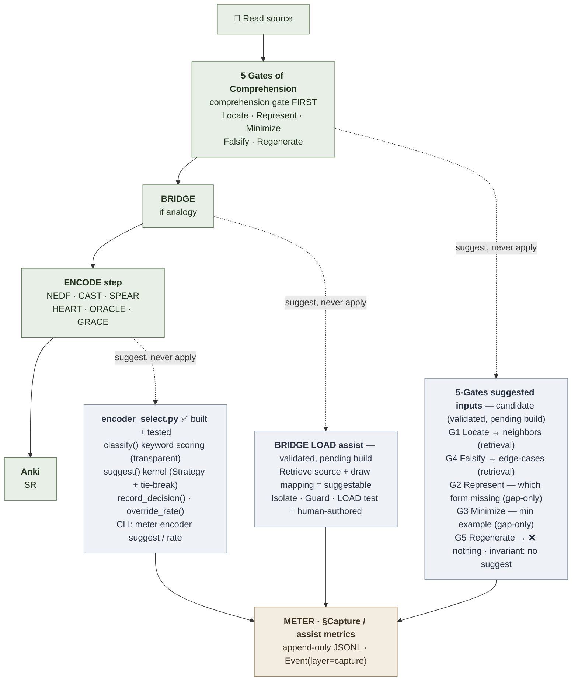

# Pipeline Overview

**Summary**: A one-screen Facade for the Neural OS learning pipeline — the comprehension→encoding→measurement spine, the suggest-then-confirm assist layer that hangs off it, and the METER metrics it emits. This page defines nothing; it links to the owner page for every stage and shows how they connect.

**Sources**:
- [5-gates-of-comprehension](./5-gates-of-comprehension.md)
- [bridge-load](./bridge-load.md)
- [rapid-in-neural-os](./rapid-in-neural-os.md)
- [framework-comparison-matrix](./framework-comparison-matrix.md)
- [meter-overview](./meter-overview.md)
- neural-os-daily-loop

**Last updated**: 2026-08-20 (`glyph:` assigned — [representation-rules](./representation-rules.md) Rule 11); 2026-05-28

---

This page is a **front door**, not an owner. Every stage below is defined on its own page; the value here is seeing the *whole machine* and the two axes that govern it:

- **Left → right is the gate order.** [Comprehension](./5-gates-of-comprehension.md) comes first and is human-owned; encoding is downstream. Nothing is encoded before comprehension passes.
- **Top → bottom is the assist seam.** The suggest-then-confirm assist proposes *inputs*, never verdicts — and splits by polarity: retrieval-shaped suggestions read **low = good**, comprehension-shaped suggestions read **high = good**.

## The machine

The **spine** (solid arrows) is human-owned — every pass/fail stays human. The **assist layer** (dashed arrows) proposes inputs, never applies them.

The METER capture layer collects the assist metrics below. Polarity splits by shape: retrieval-shaped suggestions read **low = good**; comprehension-shaped suggestions read **high = good**.

| Metric | Covers | Healthy | Polarity |
|---|---|---|---|
| `encoder_override_rate` | encoder suggestion | LOW ↓ | retrieval |
| `gate_suggestion_override_rate` | 5-Gates G1 & G4 | LOW ↓ | retrieval |
| `analogy_edit_rate` | BRIDGE draft mapping | HIGH ↑ | comprehension |
| `gate_scaffold_edit_rate` | 5-Gates G2 & G3 | HIGH ↑ | comprehension |

> **G5 REGENERATE** is uninstrumented on the assist side — a suggestion would contaminate the measurement.

## Stage owners

| Stage | Owner page | What it does | Assist status |
|---|---|---|---|
| Comprehension gate | [5-gates-of-comprehension](./5-gates-of-comprehension.md) | refuses to encode material that hasn't passed; [self-explanation](./self-explanation.md) is the sibling protocol | candidate (validated, pending build) |
| Analogy | [bridge-load](./bridge-load.md) | builds a bounded analogy after comprehension; the `LOAD` test stays human | validated, pending build |
| Encode-step routing | [rapid-in-neural-os](./rapid-in-neural-os.md) / [framework-comparison-matrix](./framework-comparison-matrix.md) | picks the encoder per material type (Strategy rule) | ✅ built — `tools/meter/meter/encoder_select.py` |
| Measurement | [meter-overview](./meter-overview.md) | one append-only log; owns `encoder_override_rate` + `analogy_edit_rate`, and the gate metrics' polarity rule | live |

## The one rule that ties it together

A stage is **suggestable** only when its question is answerable by *retrieval* (look something up). A stage that requires the learner to *generate* something is human-only. That single seam decides all of it: the encoder rule is suggestable (it's a written lookup); the [BRIDGE](./bridge-load.md) `LOAD` test is not (it's the learner's comprehension); and inside [5 Gates](./5-gates-of-comprehension.md) the same seam splits the gates — retrieval gates get suggestions, generation gates (especially REGENERATE) do not.

## Related pages

- [5-gates-of-comprehension](./5-gates-of-comprehension.md) — comprehension gate; owns the gate assist + Gate-5 invariant
- [bridge-load](./bridge-load.md) — analogy protocol; owns the analogy assist
- [rapid-in-neural-os](./rapid-in-neural-os.md) — the Encode step's suggested-encoder assist
- [framework-comparison-matrix](./framework-comparison-matrix.md) — the material-type → encoder Strategy rule
- [meter-overview](./meter-overview.md) — measurement layer; owns the assist-metric polarity pair
- neural-os-daily-loop — the concrete daily/weekly rhythm that runs this pipeline
- [composability-index](./composability-index.md) — registry of the unlocks this pipeline composes
- index
