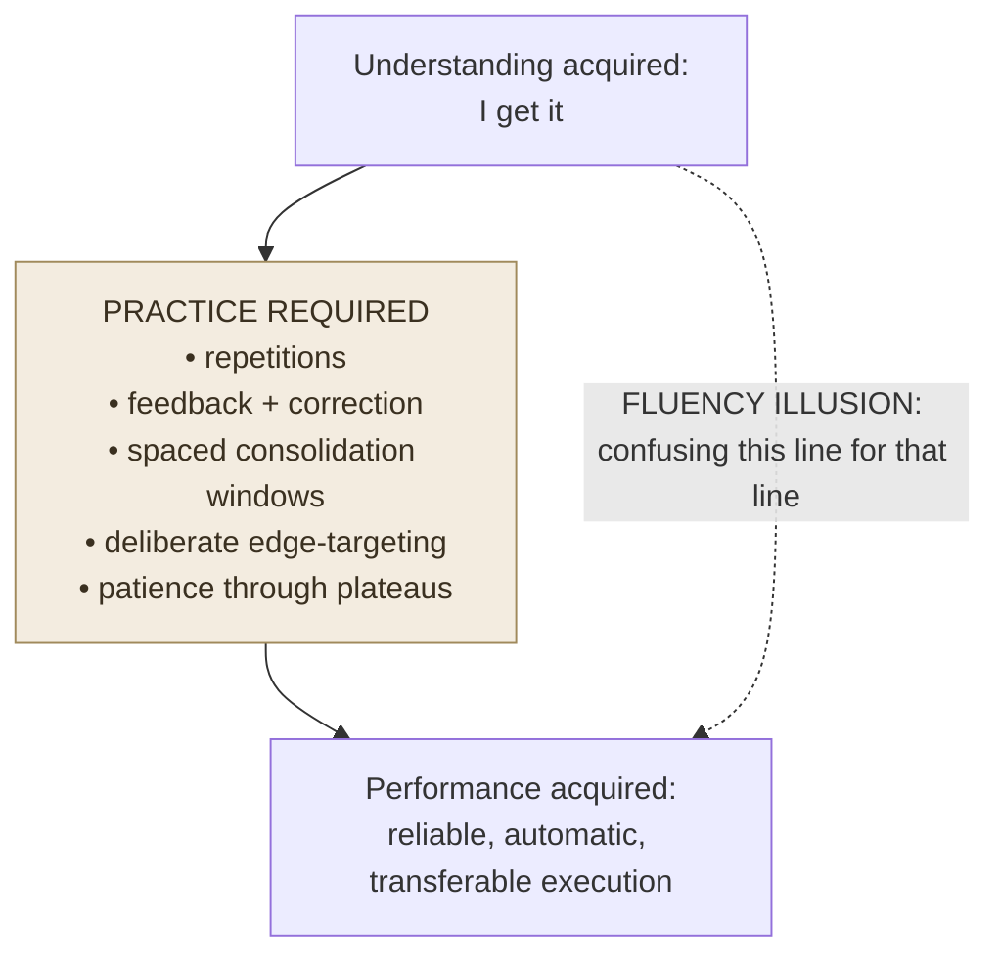

# Practice Is Required, Not Optional

**Summary**: "Practice is required, not optional" is the foundational constraint on any Neural OS learning architecture: **no amount of comprehension, explanation, elaboration, or mnemonic encoding produces expert performance without the volume of practice required for automaticity and consolidation**. This is not motivational — it is a biological and psychological fact derived from multiple convergent sources: the automaticity literature (conscious → automatic requires hundreds to thousands of reps), the [deliberate-practice](./deliberate-practice.md) literature (Ericsson: expert mental representations require deliberate assembly over years), the consolidation literature (sleep-dependent memory consolidation cannot be bypassed), and the [desirable-difficulties](./desirable-difficulties.md) literature (retrieval practice requires practice). The page is a named principle because learners consistently attempt to substitute understanding for doing, and this substitution produces the [fluency-illusion](./fluency-illusion.md) — the experience of comprehension without acquisition. This page is the canonical owner.

**Sources**:
- Ericsson, K. A., Krampe, R. T., & Tesch-Römer, C. (1993). "The Role of Deliberate Practice in the Acquisition of Expert Performance." *Psychological Review*, 100(3), 363-406.
- Bryan, W. L., & Harter, N. (1897). "Studies in the Physiology and Psychology of the Telegraphic Language." *Psychological Review*, 4(1), 27-53. — first automaticity study; plateaus and their resolution.
- Fitts, P. M., & Posner, M. I. (1967). *Human Performance*. Brooks/Cole. — three-stage skill acquisition model (cognitive → associative → autonomous).
- Roediger, H. L., & Karpicke, J. D. (2006). "Test-Enhanced Learning: Taking Memory Tests Improves Long-Term Retention." *Psychological Science*, 17(3), 249-255. — retrieval practice requires actual practice.
- Squire, L. R., & Alvarez, P. (1995). "Retrograde Amnesia and Memory Consolidation: A Neurobiological Perspective." *Current Opinion in Neurobiology*, 5, 169-177. — consolidation window.
- Brown, P. C., Roediger, H. L., & McDaniel, M. A. (2014). *Make It Stick*. Harvard University Press. — fluency illusion / illusion of knowing.
- Willingham, D. T. (2009). *Why Don't Students Like School?* Ch 3: factual knowledge + practice prerequisite for skill.
- Internal: automaticity, [deliberate-practice](./deliberate-practice.md), [fluency-illusion](./fluency-illusion.md), [desirable-difficulties](./desirable-difficulties.md), [active-recall](./active-recall.md), [spaced-repetition](./spaced-repetition.md).

**Last updated**: 2026-06-10

---

## The claim

**Understanding is necessary but not sufficient for skilled performance.**

Every stage of skill acquisition — from initial encoding to expert automaticity — has a practice requirement that cannot be substituted away:

| Stage | What understanding alone provides | What practice provides |
|---|---|---|
| **Encoding** | The trace exists | The trace survives (consolidation requires retrieval) |
| **Fluency** | Can explain it | Can apply it without deliberate effort |
| **Automaticity** | Can recognize correct performance | Can *produce* it reliably, at speed, under load |
| **Expert performance** | Can describe expert moves | Can execute them as chunked primitives |

The gap between each row — understanding vs. doing — is crossed only by practice.

## Why the substitution error is common

Comprehension feels like learning. When a student reads an explanation and says "I get it," their brain *has* done something real — the trace exists, the connections were made. But the feeling of comprehension predicts **retention poorly** (the [fluency-illusion](./fluency-illusion.md)) and **performance not at all**.

The substitution is tempting because:
1. Comprehension is fast; practice is slow
2. Comprehension feels good (aha!); practice is effortful (desirable difficulty)
3. Comprehension is passive; practice requires generation (harder)
4. Teachers reward understanding-demonstration (verbal explanation); performance requires a different test

## The three-stage model (Fitts & Posner 1967)

All skill acquisition passes through three stages, regardless of domain:

| Stage | Name | Characteristics | Required action |
|---|---|---|---|
| 1 | **Cognitive** | Explicit instruction; slow, deliberate, error-prone; the learner is thinking about each step | Deliberate practice targeting the individual steps |
| 2 | **Associative** | Patterns forming; errors detected and corrected more rapidly; some chunks available | Continued practice with feedback; deliberate error-correction |
| 3 | **Autonomous / Automatic** | Performance is fast, accurate, and largely effortless; attention is freed for higher-order decisions | Maintenance practice to retain automation; new deliberate practice for next layer |

A learner who understands a concept has *entered stage 1*. Reaching stage 3 requires:
- Enough total practice repetitions (domain-dependent: hundreds for simple procedures, thousands for complex motor/cognitive skills)
- Adequate spacing between practice sessions (sleep-dependent consolidation)
- Deliberate targeting of errors (not mindless repetition)

## Bryan & Harter's plateaus (1897)

Bryan & Harter studied telegraph operators learning Morse code. They found a pattern: **plateaus** — periods where performance stops improving despite continued practice — followed by sudden jumps. Their interpretation: during the plateau, the learner is building lower-order chunks that will enable the next layer of automation. The jump occurs when the lower layer is fully automated and attention is freed for the next.

The lesson: **plateaus are not failure — they are assembly periods.** The characteristic error is stopping practice during a plateau ("I'm not improving; this approach isn't working") when the correct response is to continue until the jump.

This is why the principle must be stated explicitly: "practice is required, not optional" means "even when the curve appears flat, the practice is mandatory."

## Consolidation is a hard constraint

Memory consolidation is sleep-dependent and cannot be compressed:
- Newly encoded material is unstable for 4–6 hours post-encoding (the consolidation window)
- Sleep triggers hippocampal-to-cortical transfer — without it, the trace remains fragile
- The consolidation window is not shortened by more practice in the same session; it is a biochemical process

This is why massed practice (cramming) fails: it compresses practice into a single consolidation window, producing short-term performance that is poorly retained. Spaced practice (see [spaced-repetition](./spaced-repetition.md)) spreads practice across multiple consolidation windows, producing durable retention.

## Volume requirements by skill class

These are approximate ranges from the literature:

| Skill class | Approximate rep requirement for basic automaticity |
|---|---|
| Single arithmetic fact | 20–50 reps (varies; irregular facts require more) |
| Vocabulary item (L2) | 10–20 spaced exposures to active-recall standard |
| Phonetic reading skill | ~200h of reading practice for reliable decoding |
| Musical instrument — basic technique | Hundreds of hours of deliberate practice |
| Chess — intermediate pattern recognition | ~1000h of deliberate study/analysis (Chase & Simon) |
| Professional expert performance | 10–25 years of deliberate practice (Ericsson) |

The point is not the exact numbers — it is that **volume is non-negotiable**. Understanding reduces the required volume by improving encoding quality; it does not eliminate the volume requirement.

## What "practice" means (not just repetition)

Mindless repetition counts less than deliberate practice. The requirements for practice to advance skill:
1. **Operating near the edge** — the task must be at the edge of current ability (too easy = automaticity maintenance only; too hard = no progress)
2. **Feedback** — the error must be detectable (without feedback, wrong patterns are reinforced)
3. **Correction + repetition** — error corrected, then the correct form practiced until it replaces the error

This is [deliberate-practice](./deliberate-practice.md) as Ericsson describes it. The key qualifier: "practice required, not optional" means *this kind* of practice — effortful, feedback-driven, edge-targeting — not time-on-task regardless of quality.

## Visual

## Failure modes

| Failure | Symptom | Mitigation |
|---|---|---|
| **Fluency illusion** | Student explains concept perfectly; cannot produce on test | Add retrieval-practice component; close-book generation required |
| **Insight substitution** | Learning a new method/shortcut; using insight to explain performance gap away without doing the reps | Track performance metrics; insight without improved performance = not enough practice |
| **Plateau abandonment** | Stopping during a flat learning curve | Identify which sub-skill is plateauing; continue deliberate practice targeting that sub-skill |
| **Volume denial** | "If I had the right approach, this would be faster" (true to a point, false past a threshold) | Acknowledge the irreducible volume; optimize quality while accepting quantity |
| **Cramming** | Massing practice near deadline | Pre-distribute; accept that retention from cramming is short-lived by design |

## Related pages

- automaticity — the target state; stage 3 of the Fitts-Posner model
- [deliberate-practice](./deliberate-practice.md) — the quality constraint on what counts as effective practice
- [fluency-illusion](./fluency-illusion.md) — the substitution error this principle guards against
- [desirable-difficulties](./desirable-difficulties.md) — why effective practice is effortful
- [active-recall](./active-recall.md) — the retrieval-practice form of doing
- [spaced-repetition](./spaced-repetition.md) — the scheduling form of distributed practice
- [making-smaller-circles](./making-smaller-circles.md) — how to structure what you practice
- [chunking](./chunking.md) — what practice builds at the cognitive level

---

## U — See (CAST)
1. Comprehension ≠ performance; practice bridges the gap
2. Three stages: cognitive → associative → autonomous; only reps advance each stage

## D — Name (NEDF)
1. Practice-required principle = understanding is necessary but insufficient; volume + feedback + consolidation are non-negotiable
2. Distinguisher: fluency illusion is the failure state (feels learned; not practised)
3. Failure mode: plateau abandonment

## F — Do (SPEAR)
1. After any new concept: schedule practice sessions (not re-reads) within 24h
2. Track performance metrics not self-assessed understanding

## B — Watch (HEART)
1. "I get it" without production test → fluency illusion active
2. Learning curve flat for 2+ sessions → plateau; continue, don't abandon

## L — Predict (ORACLE)
1. Understanding + spaced retrieval practice → durable performance
2. Understanding alone → familiar but not available; fails under novel conditions

## R — Act (GRACE)
1. Any new skill or concept → identify the practice format; start it in same session or within 24h
2. Performance plateau → increase practice quality (deliberate targeting) before increasing quantity
