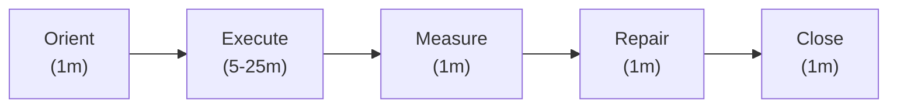

# Practice Loop

**Summary**: The reusable micro-cycle for a single practice session. Sits between [drill-generator](./drill-generator.md) (which specifies one drill) and neural-os-daily-loop (which sequences a whole day): five ordered phases — **Orient · Execute · Measure · Repair · Close** — that turn a drill spec into a [METER](./meter-overview.md)-logged result and a concrete tomorrow-action. This is the answer to *"I have 10 minutes and one skill to drill — what do I actually do?"*

**Sources**:
- [drill-generator](./drill-generator.md)
- neural-os-daily-loop
- [meter-overview](./meter-overview.md)
- [pulse-overview](./pulse-overview.md)
- [rapid-in-neural-os](./rapid-in-neural-os.md)
- [automaticity-and-reflex-training](./automaticity-and-reflex-training.md)
- [red-queen-skill-gym](./red-queen-skill-gym.md)
- [skill-progression-stages](./skill-progression-stages.md)
- Design conversation, 2026-05-13

**Last updated**: 2026-05-13

---

## Why This Page Exists

Neural OS already has a generator that specifies drills and a daily loop that sequences sessions across a day. What was missing was a name for the **single session itself**: the cycle that runs once per drill, leaves behind a measurable trace, and decides what runs next time. Without that name, "practice" silently collapses into either "do reps" (no measurement, no progression) or "follow the day plan" (no per-session governance).

The practice loop is the unit of execution. Everything above it (the daily loop, the gym schedule, the lifecycle manager) plans the loop; everything below it (drills, encoder routines, recall trials) runs inside it.

## Where it sits in the stack

| Layer | What it does | Time scale |
|---|---|---|
| neural-os-daily-loop | Sequences sessions across the day | Day / week / month |
| **Practice Loop** | One session, five phases, one METER event | 5–30 min |
| [drill-generator](./drill-generator.md) | Specifies one drill (target, unit, pass rule) | Per-drill spec |
| Drill ladders (e.g. [soroban-drill-ladder](./soroban-drill-ladder.md)) | Stage 0–7 progression for one skill | Per-skill |
| Encoders (NEDF / CAST / SPEAR / …) | Substrate the drill exercises | Per-artifact |

## Core Claim

A practice loop is **not** a workout, **not** a Pomodoro, and **not** a Spaced-Repetition session. It is the smallest cycle that satisfies four conditions:

1. **One target.** Exactly one skill, one drill, one pass rule. No mixing.
2. **One measurement.** Exactly one [METER](./meter-overview.md) event emitted at close, carrying hit rate, latency, and failure mode.
3. **One repair decision.** The result must promote, hold, or demote the drill on its ladder. No "I'll think about it later."
4. **One tomorrow-action.** The session closes with the next concrete action written down. No blank page in the morning.

If a session is missing any of these four, it is reps — not a practice loop.

## The Five Phases



### 1. Orient (1 min)

- State the **drill spec** out loud or in a note: target skill, unit, pass rule, current ladder stage. Pull from [drill-generator](./drill-generator.md) if not already on hand.
- Check [PULSE](./pulse-overview.md): under **E ≤ 2** drop to single-mode isolation; under **S ≥ 4** drop to format-only.
- Set a timer. The timer is the contract — when it ends, Execute ends.

Orient fails when you start drilling without knowing what counts as passing. If you cannot state the pass rule in one sentence, stop and write it before continuing.

### 2. Execute (5–25 min)

- Run the drill **in isolation**: no mixing topics, no checking phones, no switching to a "more interesting" skill mid-session.
- Capture failures as they happen — a single tally per failure mode is enough. Don't analyze yet.
- If stalled for >15 min without a successful rep, stop and re-orient (the drill is probably too hard — drop one ladder stage; see [skill-progression-stages](./skill-progression-stages.md)).

### 3. Measure (1 min)

Emit one [METER](./meter-overview.md) event with three fields:

- **hit rate** — fraction of reps that met the pass rule
- **latency** — median time per rep (or total / count)
- **dominant failure mode** — the single most common reason reps failed

This is non-negotiable. A session without a METER event did not happen, as far as the system is concerned.

### 4. Repair (1 min)

Pick one of three actions based on the measurement:

| Result | Action | Next session |
|---|---|---|
| Hit rate ≥ pass rule for **second** consecutive session | **Promote** | Next harder ladder stage |
| Hit rate ≥ pass rule for **first** time | **Hold** | Repeat same drill once more to confirm |
| Hit rate < pass rule | **Demote or repair** | Pick a sub-drill targeting the dominant failure mode |

The promote-on-second-pass rule is the central anti-drift guard: it prevents flukes from advancing the ladder.

### 5. Close (1 min)

- Write down **tomorrow's first action** as a concrete sentence: *"Run binary-search glyph drill, Lamp phase, 12 reps, pass = 10/12 in 90s."* Not *"practice code memorization."*
- Re-check PULSE: did Execute drift state? Log E/S out.
- Stand up. Loop ends.

The close-out is the keystone — it eliminates the morning's blank-page problem and is the single most-leveraged minute of the loop.

## Easiest Application — minimum-viable practice loop

For someone applying this for the first time, ignore everything above and run this:

```
0:00–0:01  Orient
           "I am drilling [one skill]. I pass if [one rule]."
           Set timer for 10 minutes.

0:01–0:09  Execute
           Run reps. Tally failures with a single mark per failure type.

0:09–0:10  Measure + Repair + Close
           Write one line in your METER log:
             [date] [skill] [hits/total] [median time] [top failure mode]
           Decide one of: promote / hold / demote.
           Write tomorrow's first action as one sentence.
```

That is the entire loop. Ten minutes, one paper log line, one tomorrow-sentence. No tooling required. No new vocabulary required beyond "drill, pass rule, hit rate."

Everything else on this page is the structured version of the same five moves. Once the minimum-viable version is running daily, layer in: PULSE check-in, ladder stage tracking, pass-rule promotion, then full [METER](./meter-overview.md) event schema.

**Do not** try to start with the full structured version. The loop must be small enough that skipping it feels worse than running it. Start at ten minutes; expand only when the ten-minute version has been kept for two weeks without a miss.

## Worked Example — Code Memorization (Glyph Grammar)

Target skill: regenerate the binary-search snippet from its frozen glyph in under 90s with no syntax errors.

Drill spec (from [drill-generator](./drill-generator.md)):

- **skill_type**: procedure
- **current_stage**: Lamp (recognition) — see [skill-progression-stages](./skill-progression-stages.md)
- **unit**: one function, ≤20 lines
- **failure_mode**: glyph→token misroute (you see the glyph but pick the wrong language token)
- **pass_rule**: regenerate the snippet 10/12 trials within 90s, zero syntax errors

One session:

```
0:00–0:01  Orient
           "Binary-search glyph → Python source.
            Pass: 10/12 trials in ≤90s, no syntax errors. Lamp phase."
           PULSE: E:4 S:2 → full execution.
           Timer: 15 min.

0:01–0:14  Execute
           12 trials. Tally:
             - 10 trials passed (9 of which were ≤90s).
             - 2 failed: both on the `mid = (lo + hi) // 2` line —
               recalled `(lo+hi)/2` instead of `//2`.
           Failure mode confirmed: integer-vs-float operator at the
           mid-line glyph.

0:14–0:15  Measure + Repair + Close
           METER event:
             skill: code-memorization::binary-search
             hits: 10/12 (83%)
             median latency: 72s
             dominant failure: glyph→token misroute (// vs /)
           Decision: HOLD (first pass — repeat tomorrow to confirm).
           Tomorrow's first action:
             "Run binary-search glyph again, Lamp, 12 trials, same pass
              rule. If hit rate ≥10/12 again, promote to Scale phase
              (mixed with linear-search glyph)."
```

Total wall time: 15 minutes. Total system overhead: 3 minutes (Orient + Measure + Repair + Close). Everything else was reps.

Two days like this in a row promote the drill from Lamp → Scale (per [skill-progression-stages](./skill-progression-stages.md)). At Scale, the same five-phase loop runs again — only the drill spec changes.

## How it composes with other systems

- **[drill-generator](./drill-generator.md)** feeds the loop. Without a drill spec, Orient has nothing to declare.
- **[METER](./meter-overview.md)** consumes the loop. Without METER, Measure has nowhere to land.
- **[PULSE](./pulse-overview.md)** modulates the loop. E/S readings at Orient pick the intensity; at Close they confirm drift.
- **neural-os-daily-loop** sequences the loop. A typical day runs 1–3 practice loops inside the working block and gym session.
- **[red-queen-skill-gym](./red-queen-skill-gym.md)** is built from practice loops. RISE (Reflex · Intensity · Sparring · Evaluation) is a sequence of practice loops at increasing pressure.
- **[RAPID](./rapid-in-neural-os.md)** runs above the loop — when an artifact captured during Execute needs ingesting, RAPID is the route out.

## Failure Modes

| Failure | What it looks like | Mitigation |
|---|---|---|
| **No pass rule** | "I'll just practice for a while." | Refuse to start Execute until the pass rule is stated in one sentence |
| **Reps without measurement** | 30 minutes of drilling, no METER event | The METER event is the gate; if you didn't log, the session counts as zero |
| **Promote on first pass** | One good session and you jump a ladder stage | Promotion requires **two** consecutive passes, by design |
| **Skip Repair** | "I'll figure out what to do tomorrow." | Repair is one minute — make the decision now, even if it's "hold" |
| **Vague tomorrow-action** | "Work on code memorization." | Tomorrow's action must name skill + drill + pass rule, not a topic |
| **Loop bloat** | The five-phase structure grows to 20 minutes of overhead | The 1+5+1+1+1 budget is a cap; overhead over ~5 min means the loop is being decorated, not run |
| **Mixed-topic Execute** | Switching skills mid-session to "stay engaged" | One target per loop. If you want two skills, run two loops |
| **Stall ignored** | 25 minutes deep, zero successful reps | At 15 min with no rep, stop and demote one ladder stage; the drill is the wrong size |
| **State-blind execution** | Same drill intensity at E:2 as at E:5 | PULSE modulation at Orient is the answer; if PULSE is skipped, the loop has no governance |

## What This Page Does Not Do

The practice loop explicitly does **not**:

- specify *what* to practice — that's the [drill-generator](./drill-generator.md)'s job
- specify *when* to practice — that's the neural-os-daily-loop's job
- replace project work — practice loops live inside working blocks and gym sessions, they don't replace them
- enforce a fixed duration — 10 minutes is the floor for the minimum-viable version; 30 minutes is a soft ceiling for one loop

## Calibration Defaults

- **Minimum-viable loop**: 10 minutes, paper log, one tomorrow-sentence
- **Full structured loop**: 30 minutes cap, METER event required at Close
- **Stall threshold**: 15 minutes inside Execute without a successful rep → demote one stage
- **Promotion rule**: two consecutive sessions at pass rule → next ladder stage (see [skill-progression-stages](./skill-progression-stages.md))
- **PULSE gate**: E ≤ 2 → single-mode isolation, cut volume 50%; S ≥ 4 → format-only drills

## Bottom Line

A practice loop is the smallest unit of practice that leaves a measurable trace and a concrete next action. Five phases, three minutes of overhead, one METER event. The drill-generator says *what*; the daily loop says *when*; the practice loop is *how one session actually runs*. The minimum-viable version is ten minutes and a paper log line — start there, layer the rest in only after two weeks of unbroken keeping.

## Related Pages

- georgian-driving-exam-b-drill-ladder — exam drill rungs slot into this session micro-cycle
- georgian-driving-exam-b-overview — the exam corpus those sessions run against
- [drill-generator](./drill-generator.md)
- neural-os-daily-loop
- [meter-overview](./meter-overview.md)
- [pulse-overview](./pulse-overview.md)
- [rapid-in-neural-os](./rapid-in-neural-os.md)
- [automaticity-and-reflex-training](./automaticity-and-reflex-training.md)
- [red-queen-skill-gym](./red-queen-skill-gym.md)
- [skill-progression-stages](./skill-progression-stages.md)
- code-memorization
- [soroban-drill-ladder](./soroban-drill-ladder.md)
- [problem-solving-os](./problem-solving-os.md)


---

## U — See (CAST)
1. Five-phase practice micro-cycle: Orient · Execute · Measure · Repair · Close
2. Sits between drill-generator and daily-loop

## D — Name (NEDF)
1. Practice loop = single-session micro-cycle
2. Distinguisher: 5 ordered phases + METER emission
3. Failure mode: skipping Close — no tomorrow-action

## F — Do (SPEAR)
1. 10 min + 1 skill → run all 5 phases
2. Emit METER event → record tomorrow-action

## B — Watch (HEART)
1. Skipping Measure → no signal
2. Skipping Close → no improvement plan

## L — Predict (ORACLE)
1. Session phase → predict output
2. Pattern of phases → predict skill progression

## R — Act (GRACE)
1. Practice slot → run loop
2. Stuck → restart from Orient