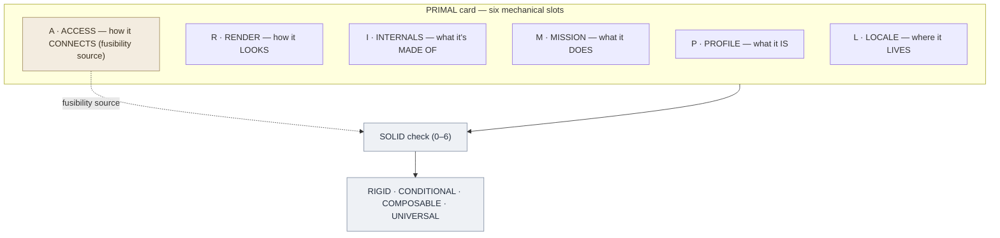

# PRIMAL — Mechanical Descriptor Framework

**Summary**: PRIMAL decomposes a bounded, discrete subject — an object, tool, system, or process you could point at — into six mechanical layers (Profile · Render · Internals · Mission · Access · Locale) and runs a SOLID-grounded fusibility check (0–6) that returns the subject's atomic tier: Rigid · Conditional · Composable · Universal. It is **domain-universal but type-bounded**: it works across every domain, but only on node-like static subjects — relations, persons, and trajectories route to the specialist encoders (see [§Limits](#limits--when-not-to-use)).

**Sources**: Originated in conversation (2026-06-03); grounded in [memory-atomic-design](./memory-atomic-design.md) lens family and first-principles decomposition methodology.

**Last updated**: 2026-08-20 (`glyph:` assigned — [representation-rules](./representation-rules.md) Rule 11); 2026-06-03 (absorption pass — `polarity` slot for absence, `depth: continuous` for fields; 2 mind-map + linear diagrams; SMASHIN' SCOPE enrichment earlier same day)

---

## Glyph

**Structure at a glance** (mind map — six layers radiating from the core, fusibility fed by ACCESS):


**Slot + fusibility detail** (linear card):




## One-line

> Fill six mechanical slots on a bounded, discrete subject; the SOLID check at the bottom returns its atomic tier.

> **Routing**: PRIMAL is the *node / static / discrete* descriptor. If the subject's essence is a **relation** → [CAST](./cast-overview.md); a **person** → [HEART](./heart-overview.md); a **trajectory / procedure** → [SPEAR](./spear-overview.md); a **prediction** → [ORACLE](./oracle-overview.md); a **social move** → [GRACE](./grace-overview.md); a **concept-for-memory** → [NEDF](./nedf-overview.md). See [§Limits](#limits--when-not-to-use) before running PRIMAL on anything that isn't a thing you could point at.

---

## The Six Layers

Every slot is a **closed enum** (pick one) or a **bounded list** (max N items, no explanations). Zero interpretation required — observe and fill.

### P — Profile *(what it is)*

| Slot | Closed values |
|---|---|
| `type` | physical-object · person · process · concept · system · situation · event |
| `scale` | micro · meso · macro |
| `persistence` | permanent · stable · temporary · instant |
| `polarity` | present · absent — default `present`; set `absent` for a gap / negative / counterfactual subject |

### R — Render *(observable form)*

| Slot | Closed values |
|---|---|
| `appearance` | 1 noun phrase, ≤5 words |
| `state` | inert · active · degrading · transitioning · oscillating |
| `multiplicity` | singular · plural · distributed · unbounded |
| `sensory` | list ≤3 — dominant sensory qualities: sound · smell · texture · temperature · colour |
| `symbol` | 1 compressed sign, glyph, or icon — "none" if absent |

### I — Internals *(composition)*

| Slot | Closed values |
|---|---|
| `components` | list ≤5 nouns — no explanations |
| `coupling` | fixed · tight · loose · modular · none |
| `depth` | flat · layered · nested · continuous |
| `sequence` | ordered · unordered · cyclical · hierarchical |

### M — Mission *(function)*

| Slot | Closed values |
|---|---|
| `does` | 1 verb phrase |
| `direction` | input→output · transforms · emits · absorbs · loops |
| `autonomy` | autonomous · dependent · co-dependent |

### A — Access *(interface — fusibility source)*

| Slot | Closed values |
|---|---|
| `accepts` | list ≤5 — what it takes in |
| `emits` | list ≤5 — what it puts out |
| `protocol` | specific · broad · any · proprietary · none |

### L — Locale *(required environment)*

| Slot | Closed values |
|---|---|
| `lives_in` | 1 noun phrase |
| `needs` | list ≤3 conditions |
| `breaks_when` | list ≤2 conditions |

---

## Fusibility Check — SOLID

Five binary questions run on the completed card. Each maps to a SOLID principle — 30+ years of software-engineering evidence that generalises to any composable subject.

| Check | Question | Points |
|---|---|---|
| **S** Single Responsibility | Does it do exactly one job? | 0 or 1 |
| **O** Open/Closed | Can it be extended without restructuring? | 0 or 1 |
| **L** Liskov Substitution | Can another of the same type substitute it? | 0 or **2** |
| **I** Interface Segregation | Are `accepts`/`emits` minimal — no dead slots? | 0 or 1 |
| **D** Dependency Inversion | Do its dependencies name roles/types, not specific instances? | 0 or 1 |

**L is double-weighted**: substitutability is the most direct test of fusibility — if a thing can be swapped for another of its type, it composes by definition.

**Sequence modifier**: if `sequence: ordered`, ask the L question as *"can it substitute while preserving the sequence contract?"* — if not, score L as 0 or 1 rather than 2. Ordered things fuse only at step-boundaries, which constrains substitutability.

**Polarity modifier**: if `polarity: absent`, score fusibility on the *consequence* of the gap, not the gap itself — an absence does not fuse, its effect does. If the consequence has no composable surface, mark the whole check **N/A** rather than RIGID (absence ≠ rigidity, the same false-negative trap as uniqueness).

**Continuity modifier**: if `depth: continuous`, the **I** (Interface Segregation) check reads against `accepts`/`emits` as usual — but ignore the now-N/A `components`/`coupling` slots when judging "dead slots." A field with no parts is not a card with dead weight.

| Score | Tier | Meaning |
|---|---|---|
| 0–1 | **RIGID** | Cannot fuse; must be used whole |
| 2–3 | **CONDITIONAL** | Fuses only with matching type |
| 4–5 | **COMPOSABLE** | Fuses broadly with adaptation |
| 6 | **UNIVERSAL** | Natural building block; a true atom |

---

## Worked Example — "Reading" (a skill)

```
P  type=process · scale=meso · persistence=stable
R  appearance="decoding symbols into meaning" · state=active · multiplicity=singular
   sensory=[eye-movement-flutter, paper-texture, silence] · symbol=none
I  components=[attention, phonological-loop, semantic-memory, eye-movement]
   coupling=loose · depth=layered · sequence=ordered
M  does="extracts meaning from text" · direction=input→output · autonomy=dependent
A  accepts=[text, symbols, diagrams] · emits=[meaning, questions, memory-traces]
   protocol=broad
L  lives_in=wakeful-mind · needs=[attention, literacy, light]
   breaks_when=[fatigue, distraction]

SOLID:
S  Does one job (extract meaning)?                              → 1
O  Extends to new symbol systems without restructure?           → 1
L  Can speed-reading substitute? (sequence=ordered applies)    → 2
I  accepts/emits minimal — no dead weight?                      → 1
D  Depends on "text" (role), not one specific book?             → 1
                                                      Total = 6 → UNIVERSAL
```

### Edge example A — an absence ("the missing API key")

`polarity: absent` flips every slot to describe the *gap*, and fusibility scores the consequence.

```
P  type=physical-object · scale=micro · persistence=temporary · polarity=ABSENT
R  appearance="empty credentials field" · state=inert · multiplicity=singular
   sensory=[none] · symbol=🔑✗
I  components=[] · coupling=none · depth=flat · sequence=unordered
M  does="blocks all authenticated calls" · direction=absorbs · autonomy=dependent
A  accepts=[] · emits=[401-errors] · protocol=none
L  lives_in=request-pipeline · needs=[a request expecting auth]
   breaks_when=[key supplied]

SOLID (scored on the CONSEQUENCE, polarity=absent):
   the gap itself doesn't fuse; its 401-cascade does, but has no
   composable surface of its own.                       → N/A (not RIGID)
```

### Edge example B — a field ("team morale")

`depth: continuous` reinterprets `components` as dimensions and retires `coupling`.

```
P  type=concept · scale=macro · persistence=temporary · polarity=present
R  appearance="collective emotional tone" · state=oscillating · multiplicity=distributed
   sensory=[heaviness↔lightness] · symbol=none
I  components=[intensity, spread, volatility]  ← dimensions, not parts
   coupling=N/A · depth=CONTINUOUS · sequence=unordered
M  does="modulates collective output" · direction=loops · autonomy=co-dependent
A  accepts=[events, leadership-signals] · emits=[productivity, retention]
   protocol=broad
L  lives_in=group · needs=[shared context] · breaks_when=[isolation]

SOLID (continuity modifier: ignore components/coupling for the I check):
S  One job (modulate collective state)?                          → 1
O  Extends to new teams without restructure?                     → 1
L  Can one team's morale substitute another's? (no — singular)  → 0
I  accepts/emits minimal? (parts N/A, so judge only the flows)  → 1
D  Depends on "events" (role), not one named incident?           → 1
                                                      Total = 4 → COMPOSABLE
```

---

## Architecture note

PRIMAL is the **4th sister of the first-principles descriptor pattern** and the **7th application of the [memory-atomic-design](./memory-atomic-design.md) lens family**:

| Sister | Substrate |
|---|---|
| [memory-atomic-design](./memory-atomic-design.md) | Memory structures |
| [money-atomic-design](./money-atomic-design.md) | Financial instruments |
| [problem-solving-atomic-design](./problem-solving-atomic-design.md) | Problem-solving moves |
| [logic-atomic-design](./logic-atomic-design.md) | Logical forms |
| [visualization-atomic-design](./visualization-atomic-design.md) | Visual representations |
| sound-relationship-house | Relational dynamics |
| **PRIMAL** | Any domain — *type-bounded* to node-like static subjects |

PRIMAL is **domain-universal, not type-universal**: it is the first sister not locked to one domain, but it is still bounded to bounded/discrete/static subjects within any domain. That distinction is the whole of [§Limits](#limits--when-not-to-use) — and is itself a Single-Responsibility result: a descriptor that claimed every *type* would fail its own **S** check.

PRIMAL is also the wiki's first instrument that performs **first-principles decomposition mechanically**: filling the six slots IS the first-principles act, conditional on the `(boundary, scale, frame)` triple being fixed first (see [§Limits](#limits--when-not-to-use)).

The three SMASHIN' SCOPE slots (`sensory` · `symbol` · `sequence`) were grafted from the structural subset of [Buzan's SMASHIN' SCOPE](./smashin-scope.md) via [REMAPS](./remaps.md) (12→6 compression). Synaesthesia + Colour → `sensory`; Symbolism → `symbol`; Order/Sequence → `sequence`. The memorability-only principles (Humour, Sexuality, Positive Images, Exaggeration, Imagination) were not absorbed — PRIMAL is a descriptor, not an encoding vividness tool.

The SOLID fusibility check operationalises [composability-index](./composability-index.md) at the single-subject level — run PRIMAL on any subject before asking what it unlocks in combination with another.

---

## Limits & When Not to Use

PRIMAL is **not** good enough for everything — and claiming it were would score **S = 0** on its own fusibility check. A descriptor that does every job does no single job. Its honest band is *static structural description of a bounded, discrete subject, plus a composability read.* Outside that band, named slots crack in predictable ways.

### The boundary–scale–frame caveat (why "no thinking" is conditional)

Slot-filling is mechanical **only after three interpretive choices are fixed upstream** — choices PRIMAL does not name:

1. **Boundary** — where the subject ends and its environment begins (is "a car" the chassis, or chassis + driver + road?).
2. **Scale** — the zoom level (water is `state: oscillating` molecularly, `inert` in a glass, `transitioning` at a coastline).
3. **Frame / purpose** — a knife's RENDER differs for a chef, a metallurgist, and a homicide detective.

PRIMAL is mechanical **given a fixed `(boundary, scale, frame)` triple.** That triple is the real input; choosing it is the one genuinely non-mechanical act. State it before you fill slots, or two people will produce different cards for the same subject and mistake it for a framework bug.

### Subject classes where slots crack

| Subject class | Slot that breaks | Why | Route to |
|---|---|---|---|
| **Relation / 2-place** ("the tension between X and Y") | whole frame | PRIMAL is *unary* — one node. Collapsing a relation into a node loses the relata. | [CAST](./cast-overview.md) |
| **Person** | `accepts` · `emits` · `does` | Reduces a person to I/O and function; Liskov-substituting people is wrong and ethically loaded. | [HEART](./heart-overview.md) |
| **Event / trajectory** ("the crash", "an argument") | `state` · `appearance` | One freeze-frame only; `sequence` names *that* there is order, never *what* it is — no phases. | [SPEAR](./spear-overview.md) |
| **Abstracta / values / numbers** ("justice", "7") | RENDER + ACCESS | No appearance, no I/O — filling them reifies the concept. | [NEDF](./nedf-overview.md) |
| **Continuous field** ("morale", "a gradient") | `components` (≤5 nouns) | Forces a continuous thing into discrete parts. | ✅ **absorbed** — `depth: continuous` retires `components`/`coupling`; see Edge example B. Watch for graduation to a field-sibling if flux/range needs grow. |
| **Absence / negative** ("the missing key", "the silence") | RENDER · INTERNALS | No slot describes a hole-shaped subject defined by what it is *not*. | ✅ **absorbed** — `polarity: absent` flips the card to describe the gap; see Edge example A. |
| **Unique / singular** (one artwork, one event) | fusibility **L** | No other-of-same-type to substitute → reads RIGID. But **uniqueness ≠ rigidity** — a false negative. | — (scoring flaw) |

### Two blind spots in the fusibility score

1. **SOLID measures *designed interface* composability, not material fusion.** A rock fails every SOLID check yet fuses into a wall perfectly. The score answers "can this be a clean module in a system," and silently ignores "can this physically/materially combine."
2. **L requires a *type* to exist.** SOLID assumes a type-set of swappable instances. For found / natural / unique subjects there is no type-set, so L defaults low and conflates *unique* with *uncomposable*.

### Known missing axes (even inside the good band)

`provenance` (who made it / where from) · `ownership` (who controls it — the power axis) · `cost / value / scarcity` (the [money-atomic-design](./money-atomic-design.md) axis) · `end-of-life` (`persistence` is one enum; nothing says *what it becomes* when it ends). These are deliberate omissions to keep the card at 6 layers; reach for the specialist lens when one is load-bearing.

---

## METER

| Event | Meaning |
|---|---|
| `primal.fusibility_score` | Integer 0–6 for any subject; track over time to watch a skill or concept become more composable |
| `primal.profile_type` | Enum snapshot per card; surfaces domain distribution across studied subjects |
| `primal.frame_declared` | Boolean — was the `(boundary, scale, frame)` triple stated before slot-filling? Cards without it are not comparable |

---

## Mnemonic

**"A PRIMAL scan strips the story."**
Profile · Render · Internals · Mission · Access · Locale — fill the slots, the story falls away, the structure remains.

## Checksum

**6 × 6**: six layers, six fusibility points maximum. If either count drifts, the framework has mutated.

---

## Related pages

- [nedf-overview](./nedf-overview.md) — concept encoder; route here for abstracta / values / numbers
- [cast-overview](./cast-overview.md) — graph encoder; route here when the subject's essence is a *relation* (PRIMAL is unary)
- [spear-overview](./spear-overview.md) — procedure encoder; route here for events / trajectories (PRIMAL takes one freeze-frame)
- [heart-overview](./heart-overview.md) — people encoder; route here for persons (PRIMAL instrumentalizes them)
- [oracle-overview](./oracle-overview.md) — prediction encoder; route here for forecasts
- [grace-overview](./grace-overview.md) — social-pragmatic encoder; route here for social moves
- [framework-comparison-matrix](./framework-comparison-matrix.md) — encoder comparison including PRIMAL
- [memory-atomic-design](./memory-atomic-design.md) — the lens family PRIMAL extends to a universal substrate
- [composability-index](./composability-index.md) — registry of unlocks; PRIMAL gives each entry a fusibility score
- [skill-progression-stages](./skill-progression-stages.md) — UNIVERSAL tier maps to the Atom tier in the automaticity ladder
- [smashin-scope](./smashin-scope.md) — Buzan's 12-principle ancestor; `sensory` · `symbol` · `sequence` slots sourced from its structural subset
- [remaps](./remaps.md) — 12→6 compression of SMASHIN' SCOPE; documents the absorb/reframe/drop decisions PRIMAL follows
