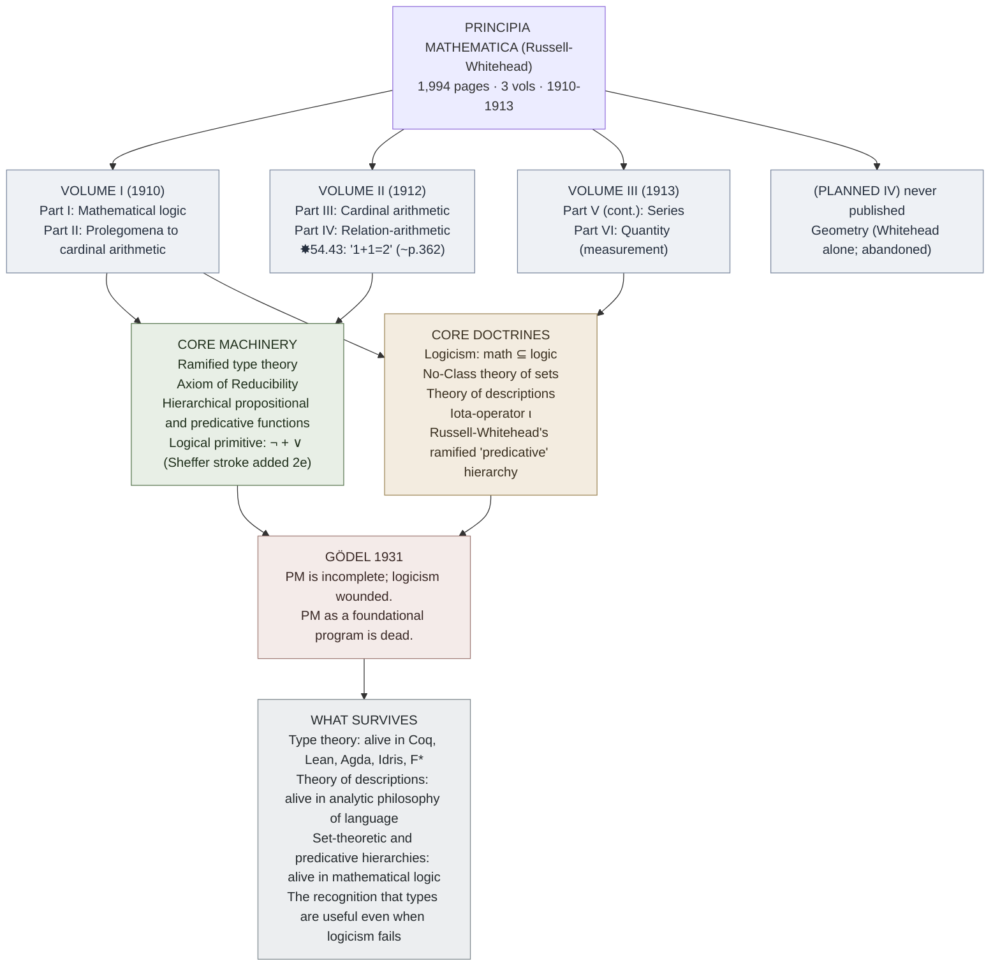

# Principia Mathematica (Russell–Whitehead)

**Summary**: Alfred North Whitehead & Bertrand Russell's three-volume *Principia Mathematica* (Cambridge University Press, 1910–1913). The largest attempt in history to derive all of mathematics from logic alone — Russell's response to his own paradox + the loadbearing instance of [logicism](./foundations-crisis.md). Famous for taking **~362 pages to prove 1+1=2**. Killed as a foundational program by [Gödel 1931](./godels-incompleteness.md), but its **ramified type theory** survives in every modern proof assistant (Coq, Lean, Agda). The book [TLP](./tractatus-logico-philosophicus.md)'s author was responding to.

**Sources**:
- Alfred North Whitehead and Bertrand Russell, *Principia Mathematica*, 3 vols (Cambridge University Press, 1910, 1912, 1913). Second edition 1925-1927 (with new Introduction to the Second Edition).
- Russell's *Introduction to Mathematical Philosophy* (1919) — the popular companion, written in prison during WWI; the standard route into *PM*'s ideas for non-specialists.
- [logicomix-graphic-novel](./logicomix-graphic-novel.md) narrative — Russell's biographical arc through the 13-year *PM* project.
- [russells-paradox](./russells-paradox.md) — the immediate motivation; *PM*'s type theory is the response.
- [godels-incompleteness](./godels-incompleteness.md) — what demolished *PM* as a foundational program.

**Last updated**: 2026-05-25

---

## One-line

> Three volumes. 1,994 pages. 13 years (1900-1913) of writing. The most ambitious foundational project in mathematics. Russell-Whitehead derive arithmetic from logic via *ramified type theory* — bypassing [Russell's paradox](./russells-paradox.md) by stratifying sets into types. Famously takes ~362 pages to prove **1+1=2**.

## Unlocks (lead, not footer)

1. **The first complete demonstration that *most of mathematics* derives from logic.** Pre-*PM*, logicism was an aspiration; Frege had *Grundgesetze* but it collapsed under Russell's paradox. Post-*PM*, the working mathematical community had a 1,994-page existence proof that arithmetic, set theory, and a substantial fragment of analysis are derivable from logic + a few axioms. **The wiki cites *PM* as the canonical instance of "an entire domain reduced to atomic operations on the foundation".** This is the largest atomic-design-style decomposition in intellectual history.

2. **Type theory is alive in every modern proof assistant.** *PM*'s ramified type theory is heavy machinery — most mainstream mathematicians eventually adopted ZFC instead (simpler, less stratified). But type theory survived in CS: Curry-Howard (1934/1969) shows propositions = types; Martin-Löf (1972) develops intuitionistic type theory; modern proof assistants (Coq · Lean · Agda · Idris · F\*) all descend from Russell's response to his own paradox. The wiki's pages on the [Logic Atomic Design](./logic-atomic-design.md) §Gaps registry queue type-theory ingest as a Wave-2 supplement (Pierce *TAPL* or Sørensen-Urzyczyn *Lectures on Curry-Howard*).

3. **The Axiom of Reducibility — *PM*'s greatest weakness.** Ramified type theory creates a hierarchy *too fine* for many useful theorems (a property of properties of natural numbers lives at a different type level than a property of natural numbers; quantifying over "all properties of natural numbers" doesn't make sense in the ramified system). To recover useful mathematics, *PM* added the **Axiom of Reducibility**: any high-type property has a same-extension low-type property. The axiom is ad hoc and broadly recognized (including by Russell himself) as the system's weak point. **The 2nd edition of *PM* (1925-27) tried to remove it; the attempt failed.**

4. ***PM*'s social-substrate cost is the load-bearing biographical fact of Russell's life.** The 13-year project (1900-1913) ended Russell's marriage, ended his close friendship with Whitehead, contributed to the depressions documented in his autobiography, and produced a book *neither Russell nor Whitehead had the strength to revise* after Gödel demolished it. **The substrate cost is registered in [logicians-madness-substrate-thesis](./logicians-madness-substrate-thesis.md) as one of Russell's near-collapses** — the only one of the foundations cast who explicitly survived by *leaving the field* afterward.

## Mnemonic

**3-V · 13-Y · ~362-P · 1+1=2.**

- **3 volumes**.
- **13 years** (1900-1913) of work.
- **~362 pages** to prove 1+1=2 (Volume I, Proposition ✸54.43; modern editions cite the page number variously, ~362-379 depending on edition).
- **1+1=2** — the famous example.

These four anchors fix the book in memory. The famous *"and from this proposition it will follow, when arithmetical addition has been defined, that 1+1 = 2"* (with footnote: *"The above proposition is occasionally useful. It is used at least three times, in ✸113.66 and ✸120.123.472"*) is one of the most-quoted moments in the philosophy of mathematics.

## Memory checksum

If you can answer these in <60 s each from memory, the page is encoded:

1. **Who wrote it, when, in what format?** (Alfred North Whitehead + Bertrand Russell. 3 volumes, Cambridge University Press, 1910 / 1912 / 1913. Second edition 1925-1927 with new Introduction to the Second Edition.)
2. **What did it attempt?** (To derive all of mathematics from logic via ramified type theory — Russell's response to his own 1901 paradox.)
3. **Why ramified type theory?** (To block paradoxes by stratifying sets into types; a set of type n+1 can only contain elements of type n; "set of all sets that don't contain themselves" becomes ungrammatical at the type level.)
4. **What is the Axiom of Reducibility?** (An ad hoc axiom added because pure ramified type theory creates a hierarchy too fine for useful mathematics. The axiom says: every high-type property has a same-extension low-type property. Universally recognized as the system's weak point; the 2nd edition tried and failed to remove it.)
5. **What killed *PM* as a foundational program?** ([Gödel 1931](./godels-incompleteness.md) — applies to *PM* directly. *PM* is incomplete: it contains true statements (like Gödel's G for *PM*) it cannot prove. Mathematical practice continues; the *foundational* ambition of self-certifying logicism is dead.)

## Visual — the structure

---

## The 13-year history

| Year | Event |
|---|---|
| 1900 | Russell discovers Frege's *Begriffsschrift* at the International Philosophy Congress in Paris; conceives the logicist project. |
| 1901 | [Russell's paradox](./russells-paradox.md) discovered. Demolishes Frege's logicism. *PM* will be Russell's response. |
| 1903 | Russell publishes *The Principles of Mathematics* (singular — distinct from the later *PM*) outlining the program. |
| 1905 | Russell publishes *On Denoting* — the theory of descriptions, which will form *PM*'s ι-operator. |
| 1907 | Russell + Whitehead begin serious collaboration. |
| 1910 | Vol I published. Cambridge University Press. |
| 1912 | Vol II published. |
| 1913 | Vol III published. *PM* is "complete" (Vol IV on geometry abandoned). |
| 1919 | Russell publishes *Introduction to Mathematical Philosophy* — the popular companion, written in Brixton Prison during WWI. |
| 1925-1927 | Second edition with new Introduction. Russell attempts to remove the Axiom of Reducibility; the attempt fails. |
| 1931 | Gödel's incompleteness theorems demolish *PM* as a foundational program. |
| 1939 | [Logicomix](./logicomix-graphic-novel.md)' frame story — Russell, lecturing in America on the eve of WWII, can no longer endorse the program he spent 13 years on. |

## Ramified type theory — Russell's response to his paradox

Russell's paradox arose from Frege's Basic Law V — unrestricted comprehension allowed *any* property to define a set, including the property *"is not a member of itself"*. Russell's solution: **stratify into types**.

### The core idea

- **Type 0**: individuals (atoms).
- **Type 1**: sets of individuals.
- **Type 2**: sets of sets of individuals.
- **Type n+1**: sets of objects of type n.

**Rule**: a set of type n+1 can contain only objects of type n. **Effect**: the construction "set of all sets that don't contain themselves" requires the contained sets to be of one type (say n) and the containing set to be of type n+1; but then *R* is type n+1 and cannot be a member of itself (which would require it to be of type n). The paradox is *ungrammatical* at the type level.

### Why "ramified"?

Russell didn't stop at types of *sets*; he also stratified *propositional functions* (predicates) by **order**, generating a doubly-stratified hierarchy. A predicate that quantifies over predicates lives at a higher *order* than the predicates it quantifies over.

This is *ramified* type theory — types within types. The system is *coherent* but cumbersome.

### The Axiom of Reducibility

Ramified type theory is *too* fine: many useful mathematical claims quantify over "all properties of natural numbers" — a claim that spans multiple orders. In strict ramified form, such claims are ungrammatical.

Russell-Whitehead added the **Axiom of Reducibility**: for any propositional function of any order, there is a predicative (lowest-order) propositional function with the same extension.

**The axiom is ad hoc**: it has no logicist justification; it's added because the system would otherwise be unable to prove standard theorems of analysis. Russell himself called it *"the chief blot on the system"*. The 2nd edition (1925-1927) tried to derive it from a simpler principle (Ramsey's reformulation); the attempt failed.

### Modern descendants

**Simple type theory** (Church 1940): drop the orders; keep only the types. Easier to use; loses some discrimination but no important paradoxes return.

**Intuitionistic type theory** (Martin-Löf 1972): add constructive existence; types as propositions; the foundation for modern proof assistants.

**Calculus of Constructions** (Coquand 1986): add dependent types; the foundation of Coq.

**Homotopy type theory** (Voevodsky et al., 2009+): types as homotopy spaces; types as ∞-groupoids; a new attempt at foundations using type theory.

The wiki's stance: type theory is **alive**, post-Gödel and post-Russell. The specific *PM* form is mostly historical; the underlying machinery is one of the most productive ideas in 20th-century logic + computer science.

## The 1+1=2 proof

The famous quip: *Principia* takes ~362 pages to prove 1+1=2.

In *PM* Vol I, Part II, the proof appears at proposition ✸54.43 (modern editions cite pages variously, ~362-379 depending on edition). The text reads:

> *From this proposition it will follow, when arithmetical addition has been defined, that 1+1=2. The above proposition is occasionally useful. It is used at least three times, in ✸113.66 and ✸120.123.472.*

The wry footnote — *"occasionally useful"* — is one of the most-quoted moments in the philosophy of mathematics. The *length* of the proof reflects:

1. **Notational density**: *PM* uses Peano's notation supplemented by Russell-Whitehead's symbols (e.g., *ι* for definite descriptions, *Cls* for the class operator, *ℙ* for cardinal numbers). The page count reflects the verbosity of the underlying formal system.
2. **Logicist commitment**: every step must be justified from logical primitives. There is no "informal proof skipping" allowed.
3. **Type-theoretic stratification**: defining 1, 2, and "addition" requires careful type-level work. 1+1 isn't just "two units"; it's a definition that quantifies over the right types.

Modern proof assistants (Coq, Lean) can also prove 1+1=2 from foundations — and modern systems do it in roughly *one line*. The reduction in length reflects 70+ years of refinement in foundational notation, not a defect in *PM*'s rigor.

## What survives *PM* (other than type theory)

- **Theory of descriptions** (Russell 1905, integrated in *PM*): how to handle definite descriptions like *"the King of France"* logically. Still standard in analytic philosophy of language.
- **No-Class theory of sets**: *PM*'s approach treats sets as logical fictions, defined by their membership conditions. Modern set theory uses Zermelo-Fraenkel; *PM*'s approach survives in some constructive systems.
- **ι-operator** (iota): formal notation for definite descriptions. Still in use.
- **The relation-arithmetic of Vol II**: parallel to cardinal arithmetic; survives in modern relation algebra.
- **The recognition that types are useful even when logicism fails**: the load-bearing insight that survives Gödel.

## What dies in *PM*

- **Logicism as a foundational program**: incomplete by Gödel; no longer the consensus foundation.
- **The Axiom of Reducibility as a foundational primitive**: universally seen as a defect; modern type theory avoids it.
- **Ramified vs simple types distinction**: simple type theory won in mainstream use; ramified survived only in specialized constructive systems.
- **The notation**: largely replaced by modern logical notation (∀, ∃, ∧, ∨, ¬, →, ↔ rather than Russell's idiosyncratic symbols).

## *PM*'s influence

*PM* is one of the most-influential books almost-nobody-reads:

- **Wittgenstein** was Russell's student during *PM*'s composition; [TLP](./tractatus-logico-philosophicus.md) is Wittgenstein's response to *PM*'s logicism.
- **Gödel** read *PM* as his target system — his 1931 incompleteness paper's full title is *"On Formally Undecidable Propositions of Principia Mathematica and Related Systems I"*. Gödel deliberately attacked *PM* because it was the most-developed formal system available.
- **Quine, Carnap, Tarski, Church, Curry, Kleene, Turing** — every leading 20th-century logician engaged with *PM*.
- **Modern functional programming** (Haskell, ML, Scala) inherits *PM*'s type theory via Curry-Howard.
- **Modern proof assistants** (Coq, Lean, Agda) are direct descendants of Russell's response to his own paradox.

Few books have been read in full by fewer people while influencing more fields. The wiki's stance: cite *PM* as a historical artifact; learn modern type theory through Pierce *TAPL* or Sørensen-Urzyczyn *Curry-Howard*.

## Cross-link to the wiki's atomic-design lens

*PM*'s structure is a worked instance of [logic-atomic-design](./logic-atomic-design.md) applied at industrial scale:

- **Atoms**: logical primitives (¬, ∨, =, types, classes).
- **Molecules**: numbered propositions (✸1.1, ✸1.2, … each defined in terms of prior propositions).
- **Organisms**: derivation chains (e.g., the 362-page derivation of 1+1=2).
- **Templates**: the proposition-numbering schema (✸X.Y.Z), the type-stratification schema, the proof-format schema.
- **Pages**: the specific proofs of specific theorems.

The wiki's [logic-atomic-design](./logic-atomic-design.md) hub is conceptually a *generalization* of what *PM* did for mathematics — apply the atom/molecule/organism/template/page decomposition across all of logic.

## METER integration

| Drill | Pass floor | Source | Owner |
|---|---|---|---|
| State authorship, dates, volume count | <15 s | this page §Mnemonic | this page |
| Explain ramified vs simple type theory | <60 s | this page §Russell's response | this page |
| Explain the Axiom of Reducibility and why it's problematic | <60 s | this page §Axiom of Reducibility | this page |
| Name 3 modern descendants of *PM*'s type theory | <30 s | this page §Modern descendants | this page |
| State what Gödel did to *PM* | <30 s | this page §What dies | [godels-incompleteness](./godels-incompleteness.md) |
| Name the famous 1+1=2 proposition location | <15 s | ✸54.43, Vol I, ~p.362 | this page |

## Related pages

- [russells-paradox](./russells-paradox.md) — *PM*'s motivating crisis
- [godels-incompleteness](./godels-incompleteness.md) — *PM*'s explicit target; full title of Gödel's 1931 paper names *PM*
- [foundations-crisis](./foundations-crisis.md) — *PM* is logicism's load-bearing instance
- [logicomix-graphic-novel](./logicomix-graphic-novel.md) — narrative depiction of the 13-year *PM* project
- [tractatus-logico-philosophicus](./tractatus-logico-philosophicus.md) — Wittgenstein's response to *PM* logicism
- [picture-theory-of-language](./picture-theory-of-language.md) — Wittgenstein's competing foundation
- [truth-function-machine](./truth-function-machine.md) — *PM* uses truth-functions but pre-dates the truth-table notation; TLP 4.31 invents the table
- [methods-of-deduction](./methods-of-deduction.md) — Copi-style natural deduction is much more pedagogically efficient than *PM*'s notation
- [logic-atomic-design](./logic-atomic-design.md) — *PM* is the largest worked instance of the lens at industrial scale
- [logicians-madness-substrate-thesis](./logicians-madness-substrate-thesis.md) — Russell's *PM* years as one of the substrate-cost data points
- [glossary](./glossary.md) — Logic layer registration
