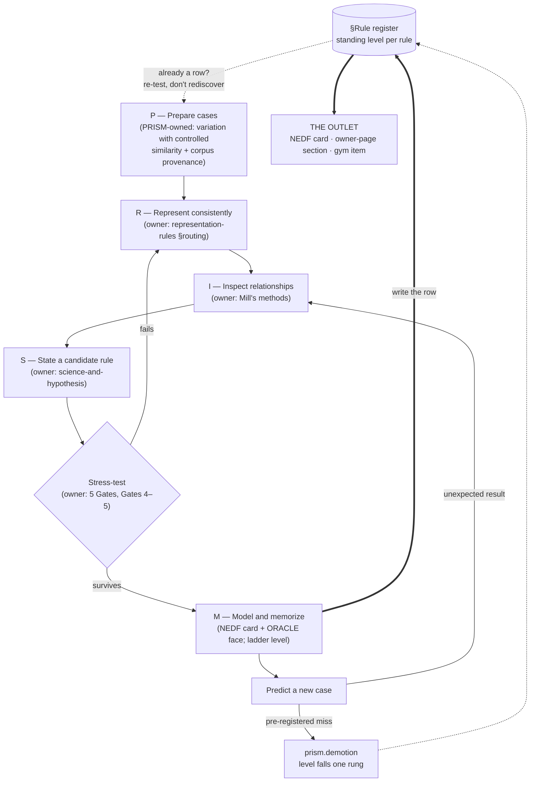

# PRISM — Pattern Discovery Protocol

**Summary**: A capture-layer protocol for extracting a pattern from a *designed* set of cases — **Prepare · Represent · Inspect · State · Model** — built as a **Facade** over five existing owners ([Mill's methods](./causal-reasoning-mill-methods.md) · [representation-rules](./representation-rules.md) · [science-and-hypothesis](./science-and-hypothesis.md) · [5 Gates](./5-gates-of-comprehension.md) · [NEDF](./nedf-overview.md) + [ORACLE](./oracle-overview.md)), plus the one object none of them owned: the **Pattern confidence ladder (0–6)**. Input: a case set. Output: one rule with a ladder level, handed to NEDF + ORACLE for encoding.

**Sources**:
- User proposal "PRISM — a general framework for recognizing, discovering, and learning patterns", 2026-08-27, validated via `/validate-idea` → **keep with modification** (Facade, not framework; ladder registered; no new card type; SHIFTS unregistered).
- Owner pages linked per step (see §The Facade contract) — this page restates none of their definitions.
- [software-design-principles-for-neural-os](./software-design-principles-for-neural-os.md) §Main Constraint, §Domain Dialects guardrail #1, §Facade — the rules that shaped the verdict.
- [framework-comparison-matrix](./framework-comparison-matrix.md) §Architecture — the capture / scoping row this page joins.

**Last updated**: 2026-08-28 (**Run #4 — French phonology**, rule `coda-loss-onset-repair` at level 5: the first run outside the formal/engineering domain family, and the corpus-provenance gate's first live firing — it fired `partial` and changed the record on the day it was added. Register row added; the rule's home page is *owed*, a gap [dictee-gym](./dictee-gym.md) had already flagged independently); 2026-08-28 (**four-gap audit** — the loop had no exit arrow: three runs at levels 5/6/5 had produced zero cards, zero rows and zero gym items. Added §Rule register as the protocol's output surface and pre-run lookup; the ladder gains a *Falls when* column and the descent rule *each rung is lost by failing the test that earned it*, with a `prism.demotion` event; step P gains the corpus-provenance gate (`corpus_states_rule`, caps a sharpening run at 5); the [METER](./meter-overview.md) floor gains the log-every-run clause that repairs a falsifier which could not fire — the 3/3 clearance is downgraded to *provisional* accordingly. Run #2's rule delivered to loop-invariants + amortized-analysis); 2026-08-27 (Run #3 system design — level 5; falsifier CLEARED 3/3; the ladder refused the surface-decoy promotion, unlock ② on live data); 2026-08-27 (Runs #1–#2 recorded — SQL injection at level 5, invariant-as-correctness-engine at level 6; §Worked instances + falsifier counter 2/3); 2026-08-27 (page created from the `/validate-idea` verdict)

---

## Unlocks (lead, not footer)

1. **Builder ↔ recognizer pair.** PRISM is the *slow builder* — it finds a pattern from cases (System 2, minutes). [recognition-gym-pattern](./recognition-gym-pattern.md) is the *fast recognizer* — it names which known pattern applies in seconds (System 1). The Pattern Card's *Recognition cues* slot (§M) is literally a gym stimulus, so **every PRISM run yields a ready-made gym item**. Same shape as the confirmed production-reception-grammar-pair (one protocol structures what leaves the operator, one structures what arrives); registered in [composability-index](./composability-index.md) as a candidate builder ↔ recognizer primitive, N=1.
2. **The ladder gives the wiki's own promotion rule an epistemic scale.** [composability-index](./composability-index.md) promotes a candidate pattern to an owner page when it "appears in 3+ rows without an owner page". That is an informal two-rung ladder. §Pattern confidence ladder makes it explicit: a candidate row is level 3; surviving a counterexample is level 4; **predicting the third instance before it is found is level 5** — a stricter promotion trigger than N=3.
3. **Mill's methods made visual.** Step R draws every case in one normalized visual language. Two normalized panels with a single differing cell *draw* the Method of Difference; one cell lit in every panel *draws* the Method of Agreement. The three comparisons in §I are those methods; the small-multiples row added to [representation-rules](./representation-rules.md) §Diagram-type routing is their pre-attentive form.

## Where PRISM sits

PRISM is a **capture / scoping** member in the [framework-comparison-matrix](./framework-comparison-matrix.md) architecture — a sibling of [RAPID](./rapid-in-neural-os.md), [ORIENT](./orient-method.md), [BRIDGE LOAD](./bridge-load.md) and Semantic Input — **not** a seventh encoder and not a [domain dialect](./software-design-principles-for-neural-os.md). Capture members "decide *what is worth encoding and where it goes*"; PRISM decides **whether a repetition is a pattern worth encoding, and how confident you are allowed to be**. The single responsibility, stated against its siblings:

| Capture member | Takes | Gives |
|---|---|---|
| RAPID | a live situation | a routed note |
| ORIENT | unfamiliar territory | a map of objects / roles / edges |
| BRIDGE LOAD | a target concept | a load-bearing analogy |
| **PRISM** | **a designed case set** | **one graded rule** |

The rule then goes downstream exactly as any other captured material: through 5 Gates if the concept is new, into a NEDF card with an ORACLE face (§M), and — because its recognition cues are a stimulus — into a recognition gym.

The precedent this page follows is [pattern-recognition-operative](./pattern-recognition-operative.md) (2026-06-17): a pattern-recognition cycle validated as a Composite of existing frameworks, refused a new encoder on SRP grounds. PRISM keeps its acronym only because it is a *phase mnemonic in a capture procedure*, which [software-design-principles-for-neural-os](./software-design-principles-for-neural-os.md) §Domain Dialects explicitly leaves on the allowed side ("a phase mnemonic in an operating stack is not an encoder sibling").

## The loop

Five steps, **ordered with two feedback edges and one exit** — so per [representation-rules](./representation-rules.md) Rule 10 the shape is a flow, not a pentagon (the members are a sequence, not a set). The register at the top and bottom is both the entry check and the outlet: a run that does not end in a written row has not produced anything.



Before 2026-08-28 this diagram had no `==>` edges at all: every arrow either advanced inside the loop or fed back into it, and nothing left. That was not a drawing accident — after three runs at levels 5, 6 and 5 the wiki held zero cards, zero register rows and zero gym items. The exit arrow and the register it points at are the fix.

Each step below says **what PRISM adds** and **who owns the rest**. Per the [glossary](./glossary.md) consistency rules, nothing owned elsewhere is redefined here.

## P — Prepare cases *(PRISM-owned)*

Patterns are extracted by comparison, and comparison needs contrast. The PRISM rule — the one piece of step P no other page states — is **variation with controlled similarity**: collect cases that differ in *one dimension at a time* against a shared background, not ten near-identical successes. Five case classes, an unordered set, so drawn as a pentagon (Rule 10):

```
                     ORDINARY
                        ●
        APPARENT      ╱   ╲      SUCCESSFUL
        EXCEPTION   ●       ●
                    │       │
        BORDERLINE  ●───────●  FAILED
```

Cover the labels: an empty corner is a hole in your case set before a single comparison is run. A collection with no *failed* and no *borderline* corner cannot support the Method of Difference in §I at all — the comparison has nothing to differ against. (source: [causal-reasoning-mill-methods](./causal-reasoning-mill-methods.md) §Difference — "identify a case where the effect occurs and a case where it doesn't")

**The provenance gate.** Record one fact about the corpus before comparing: **does a source in it already state the rule?** If yes, the run is *sharpening*, not discovery — cases cannot be independent evidence for a conclusion they were written to illustrate, the same way a test set drawn from the training set proves nothing. A sharpening run is still worth doing (it adds boundaries, a counterexample, and the mechanism the source left implicit) but it **caps at level 5** unless step M produces a first-hand construction. Carried as `corpus_states_rule` on the `prism.run` event. All three runs of 2026-08-27 drew their cases from wiki pages that already held the answer; only run #3 noticed, and only by hand — which is why this is now a gate and not a habit.

**Output:** a set of comparable cases with ≥3 of the 5 corners filled (the [METER](./meter-overview.md) floor in §METER hooks), plus a recorded corpus provenance.

## R — Represent consistently *(owner: [representation-rules](./representation-rules.md))*

Translate every case into **the same visual language** so that what differs is the *case*, not the drawing. Which language: the owner's §Diagram-type routing table already answers it (flowchart for process, causal-loop for feedback, network for connections, tree for hierarchy, 2×2 for comparison on two axes, ladder for progression, floor plan for space, treemap for part-to-whole). Two rows were added to that table from this step on 2026-08-27 — **small multiples** (several cases of one structure, side by side) and **plot** (a quantity changing over a variable) — together with the clause this step contributes:

> **Normalize before comparing.** Same scale, same orientation, same symbol set, same colours, same ordering across all panels. A difference in the drawing is noise; only a difference in the case is signal.

This is the same R as 5 Gates Gate 2 REPRESENT (same word, same job — a convergence, not a collision): Gate 2 asks for three *different* forms of one concept; PRISM-R asks for one *identical* form across many cases. Both refuse verbal-only understanding.

**Output:** comparable visual forms — by default, normalized small multiples.

## I — Inspect relationships *(owner: [causal-reasoning-mill-methods](./causal-reasoning-mill-methods.md))*

Three comparisons, and they are Mill's methods by their proper names — a triangle (Rule 10, n=3):

```
                    same RESULT, different LOOK
                    → the hidden INVARIANT
                      (Method of Agreement)
                              ▲
                             ╱ ╲
                            ╱   ╲
                           ╱     ╲
   similar LOOK,          ▲───────▲        TYPICAL vs ANOMALY
   different RESULT                        → the BOUNDARY / missing condition
   → the decisive DIFFERENCE                 (Method of Residues)
   (Method of Difference ★ most reliable)
```

The owner page ranks them: Difference is the most reliable and Agreement the weakest (a shared factor may be a common third cause) — so a PRISM run that only ever finds agreements is at ladder level 2, not 3. Where the cause can only be *varied*, not removed, the owner's Concomitant Variation is the move, and the plot row of step R is its picture.

**SHIFTS — the visual scan checklist.** Before the three comparisons, sweep each panel for six things. This is an *in-page checklist*, not a registered protocol (its two S's decode to different words, which fails the wiki's mnemonic bar; it stays here until that is fixed). Six unordered members → a hexagon:

```
                    S · Shape & symmetry
                   ╱                     ╲
   S · Similarities,                       H · Hierarchy &
       differences,                            containment
       missing elements
                  ╲                       ╱
   T · Transitions,                      I · Invariants —
       trends, thresholds                    what stays unchanged
                   ╲                     ╱
                    F · Frequency & repetition
```

Most corners already have an owner in the wiki: *Hierarchy* is the Spatial family and *Transitions* the Temporal family of [UMTF](./universal-mental-tagging-framework.md); *Shape / symmetry* and *Invariants* are two of the four [universal-mathematical-tactics](./universal-mathematical-tactics.md); *missing elements* is the missing-dimension scan. SHIFTS only orders the sweep.

**Output:** candidate relationships — one invariant, one decisive difference, one boundary.

## S — State a candidate rule *(owner: [science-and-hypothesis](./science-and-hypothesis.md))*

Turn "these look similar" into a sentence that can be wrong. PRISM's template:

> When **A** appears with **B**, arranged as **C**, it tends to produce **D**, unless **E** is present.

The owner page supplies the discipline around it — this is its Stage 2 (preliminary hypothesis) sharpened into Stage 4 (refinement), and the test of a well-formed rule is the owner's Popper reflex: *what observation would refute this?* If nothing would, it is not a rule yet. Three levels of claim, in ascending order:

| Level | Example | Owner's term |
|---|---|---|
| Observation | "These points form clusters." | Stage 1 — problem / observation |
| Hypothesis | "Distance represents shared properties." | Stage 2 — preliminary hypothesis |
| Pattern | "Cases sharing X and Y consistently cluster, including unseen cases." | Stage 4 → 5 — refined hypothesis with deduced consequences |

A pattern must name a mechanism or a stable relationship, not a resemblance.

**Output:** one testable rule.

## M — Model and memorize *(owners: [5-gates-of-comprehension](./5-gates-of-comprehension.md) · [nedf-overview](./nedf-overview.md) · [oracle-overview](./oracle-overview.md))*

**Stress-test first.** The seven questions PRISM asks are 5 Gates by another route — Gate 4 FALSIFY (strongest counterexample; necessary vs merely common conditions; where it stops working; the simpler explanation) and Gate 5 REGENERATE (predict a hidden case; survive rotation, renaming, reordering). A rule that fails goes back to R; one that survives is stored.

**Store it as an existing card, not a new one.** The proposal's seven-slot Pattern Card maps one-to-one onto slots the wiki already has — so PRISM mints **no card type**. It is the Rule-10 concept card (the NEDF square) with an ORACLE face:

| Pattern Card slot | Existing slot |
|---|---|
| Recognition cues — *what do I notice first?* | NEDF **N**ame-hook + ORACLE **C**ue |
| Structure — *what repeats?* | NEDF **E**ssence |
| Mechanism — *why does it happen?* | NEDF **E**ssence, third layer (below) |
| Prediction — *what happens next?* | ORACLE **E**stimate, given **O**bservation / **C**ue |
| Boundaries — *where does it fail?* | NEDF **F**ailure |
| Counterexample — *what resembles it but isn't it?* | NEDF **D**istinguisher |
| Canonical image — *one diagram* | [representation-rules](./representation-rules.md) Rule 1 (diagram-first) + Rule 11 (one glyph) |

**The three-layer model.** Every robust pattern has three layers, and the ordering is a ladder (surface → deep → mechanism), not a triangle:

| Layer | What it holds | Owner |
|---|---|---|
| Surface cues | what it looks like | [novice-vs-expert-cognition](./novice-vs-expert-cognition.md) — Chi et al.'s *surface features* |
| Deep structure | what relationships repeat | [novice-vs-expert-cognition](./novice-vs-expert-cognition.md) — Chi et al.'s *deep structural principles* |
| Mechanism | why the structure produces the result | **PRISM's extension** — the causal layer Chi's two-way split leaves implicit |

Memorizing only surface cues causes false recognition (the novice sort); the deep structure enables transfer; the mechanism enables *generation* — ladder level 6.

**Pattern quality, in one line.** PRISM's formula is the owner's five hypothesis criteria compressed:

$$\text{Pattern quality} = \text{compression} + \text{explanation} + \text{prediction} - \text{exceptions}$$

Read against [science-and-hypothesis](./science-and-hypothesis.md) **R-T-C-P-S**: compression is *simplicity*, explanation is *relevance + compatibility*, prediction is *predictive power*, and exceptions are what *testability* found. A visually attractive coincidence scores zero on all four.

**Output:** one NEDF card with an ORACLE face, placed on the ladder.

## Pattern confidence ladder (0–6) *(owner: this page)*

Do not classify every interesting repetition as a pattern. Seven ordered rungs — a ladder, per Rule 10 — that say how much a rule may be trusted. This is the epistemic status of the **pattern**, orthogonal to the three **learner** axes in [skill-progression-stages](./skill-progression-stages.md); other pages citing rung numbers cite this section.

| Level | Status | Meaning | Gate up | Falls when | Wiki wiring |
|---:|---|---|---|---|---|
| 0 | Noise | no stable relationship | — | — | not stored |
| 1 | Repetition | it appears more than once | ≥2 cases | — | not stored |
| 2 | Correlation | features vary together | Agreement or Concomitant Variation only | — | not stored |
| 3 | Candidate | a rule explains several cases | a Difference comparison succeeded; rule stated in §S form | the Difference comparison is overturned, or the rule is reworded so loosely that nothing refutes it → **0** | a row in §Rule register; **first storable rung** |
| 4 | Validated | it survives counterexamples | ≥1 *recorded* counterexample (Gate 4) | a counterexample it does **not** accommodate → **3** | register row with a named failure mode |
| 5 | Predictive | it correctly predicts an unseen case | ≥1 *pre-registered* prediction hit (Gate 5) | a pre-registered prediction **misses** → **4** | promotion trigger — alternative to "3+ rows" |
| 6 | Generative | it constructs new solutions | used to build something that did not exist | an artifact it constructs turns out **wrong** → **5** | owner page + gym item |

**Descent is the ascent gate run backwards.** Each rung is earned by passing one specific test, so each rung is lost by failing that same test — no separate machinery, no new vocabulary. This is what makes the column above derivable rather than invented. Two consequences worth stating plainly:

- **A level is a current reading, not a high-water mark.** A ladder that only climbs is a ratchet, and a ratchet is not a confidence scale — it is an inflation mechanism with a numeric disguise.
- **The level belongs to the rule, not to the run that first assigned it.** A dated run record cannot hold a value that changes after the date; §Rule register can. Every descent emits `prism.demotion` naming the failing test, and the register keeps the previous level, so a rule that has fallen once reads differently from one that has never been tested at all.

The goal is not to *spot* patterns but to move them **up** this ladder — and the ladder is also what stops a level-2 correlation from being encoded as if it were a level-5 law, or a level-5 law from staying one after it has been refuted.

## Rule register *(owner: this page)*

The ladder grades a **rule**, and a rule outlives the run that found it — so the level needs somewhere to live that is not a dated report. This table is that place, and it is the protocol's actual output surface: **a level-≥3 rule that is not a row here has not been produced, only described.** Read it *before* step P: if the repetition in front of you is already a row, you are re-testing an existing rule rather than discovering a new one, and the run should go straight to the gate that would move it.

| Rule | Domain | Level | Prev | Corpus stated it? | Home | Still owes | Last tested |
|---|---|---:|---:|---|---|---|---|
| `code-data-confusion` | cybersec | 5 | — | partly — trust-boundary-overflow already holds the mechanism | trust-boundary-overflow | a first-hand generative use (rung 6) | 2026-08-27 · run #1 |
| `invariant-certifies-goal` | algorithms | 6 | — | no — the boolean→ℝ generalization was on neither source page | loop-invariants §The invariant as certificate · amortized-analysis | a gym item (rung-6 wiring) | 2026-08-28 · owner sections written |
| `bottleneck-relocation-trade` | system design | 5 | — | **yes** — system-design-fundamentals states the trade outright | system-design-fundamentals · [composability-index](./composability-index.md) candidate row | a run on a corpus that does not pre-state it | 2026-08-27 · run #3 |
| `coda-loss-onset-repair` | language / phonology | 5 | — | **partial** — the shallow heuristic *"read one letter ahead"* is pre-stated; the mechanism, the unification and the liaison derivations are not | [french-coda-loss](./french-coda-loss.md) — **written 2026-08-28**, closing the gap [dictee-gym](./dictee-gym.md) had flagged independently | a coda-isolating drill set (rung 6); verification of the diachronic claims against a historical-phonology source | 2026-08-28 · run #4 |

Two rules govern the register itself:

1. **Cross-domain rules also earn a [composability-index](./composability-index.md) candidate row; single-domain rules do not.** That page registers structures whose instances *span* domains; writing every PRISM rule into it would bury the signal under domain facts. Of the three above only `bottleneck-relocation-trade` crosses a boundary — system design → cognition, via tools-over-intelligence — so only it has a row there. This corrects the ladder's original L3 wiring, which read "a candidate row in composability-index" and was too wide: the register is the general outlet, that page is the cross-domain special case.
2. **Factor out above ~20 rows** into `wiki/_meta/` as a derived table, the way the page catalog and glyph registry already are. Below that, a table on the owner page is the whole register and costs nothing to maintain.

## Worked instances (live runs)

Full run records: PRISM runs 2026-08-27 (#1–#3) and 2026-08-28-prism-run4-french-phonology (#4), both in `wiki/meter-reports/`. These three entries are the **runs**; the standing level of each **rule** lives in §Rule register and moves after the run is over. Run counter toward the §METER-hooks falsifier: **4 / 4 logged, levels 5, 6, 5, 5 — floor met provisionally** (see the logging clause in §METER hooks — sub-3 runs went unlogged before 2026-08-28, so the sample is survivor-biased).

### Run #1 — SQL injection → rule `code-data-confusion`

| Layer | Content |
|---|---|
| Surface cues | quotes, SQL fragments, unusual parameters |
| Deep structure | user input changes the query's *syntax*, not just its data |
| Mechanism | code and data were not kept separate |

Ladder placement: **level 5 (Predictive) earned first-hand** — two pre-registered predictions (LDAP injection, prototype pollution) confirmed against the independently-authored trust-boundary-overflow. The mechanism is **level-6-capable** (that page uses it generatively to read unseen injection classes), but this run did not construct a working exploit first-hand, so rung 6 is inherited, not produced — the honest cap. Someone holding only the surface cues sits at level 3 and false-recognizes escaped quotes as attacks.

### Run #2 — invariant as correctness engine (algorithms & data structures) → rule `invariant-certifies-goal`

| Layer | Content |
|---|---|
| Surface cues | a specific loop / tree / stack shape |
| Deep structure | a property is preserved across every step (CLRS Init · Maintenance · Termination) |
| Mechanism | correctness = an invariant established, maintained, and implying the goal at termination — P boolean (correctness) or real-valued (cost / potential) |

Ladder placement: **level 6 (Generative) earned first-hand** — the mechanism *constructed* two artifacts in-run: amortized analysis (boolean invariant generalized to a real-valued potential Φ≥0) and a fresh correctness proof for two-pointer pair-sum, an algorithm not in the case set. Counterexample recorded: greedy 0/1-knapsack (a local invariant maintained but not implying the global optimum — the Termination clause failing). See loop-invariants and greedy-algorithms.

### Run #3 — bottleneck-relocation trade (system design) → rule `bottleneck-relocation-trade`

| Layer | Content |
|---|---|
| Surface cues | cache / replica / shard / queue / add-a-box |
| Deep structure | each move trades an abundant resource for a scarce axis |
| Mechanism | conservation: the binding bottleneck is *relocated*, never removed ("the new problem"); gain only when the trade targets the current bottleneck (Amdahl/Goldratt) |

Ladder placement: **level 5 (Predictive)**. Two pre-registered predictions confirmed against independent, other-domain pages — "find the bottleneck first" ([problem-type-recognition-drill-ladder](./problem-type-recognition-drill-ladder.md)) and the relocation mechanism appearing in *cognition* (tools-over-intelligence §"The bottleneck doesn't vanish — it relocates"). Counterexample: caching a write-bound system (spends complexity, buys nothing). **Note:** system-design-fundamentals *already states* the trade-off mechanism, so this run **sharpened a pre-stated pattern** rather than discovering one — a level-6 generative construction was available but not awarded.

### Run #4 — French phonology → rule `coda-loss-onset-repair`

| Layer | Content |
|---|---|
| Surface cues | silent final letters · nasal vowels · liaison · the mute `-e` of agreement |
| Deep structure | a consonant surfaces iff it can occupy an **onset**; in coda position it is deleted |
| Mechanism | one historical event — word-final coda loss — with three repair strategies: delete outright, transfer the nasality to the vowel and delete, or re-attach across the boundary when a vowel is available. The corpus's *delete · fuse · glue* are not three habits but one |

Ladder placement: **level 5 (Predictive)**, rung 6 declined. One clean pre-registered hit — the French confusion-map seed (authored 2026-07-21 for the phonology gym) treats the nasal contrast as a **vowel** target labelled *"bon (nasal, no /n/)"*, exactly as the mechanism requires. A second prediction hit on its mechanism half and **missed** on its error-class half, logged `hit: partial`. Counterexample accommodated: `et` never liaisons though a consonant stands before a vowel — liaison's modern obligatoriness is morphosyntactically fossilized, which the mechanism does not derive. Rung 6 was declined because the generative act available (deriving the unlisted `g` → /k/ liaison, verified on *un long hiver* / *sang impur*) is standard prescriptive French, so *derived it* cannot be cleanly separated from *knew it and justified it*. Full record: 2026-08-28-prism-run4-french-phonology.

**The provenance gate's first live firing.** Added 2026-08-28; used the same day. Without it this run reads as clean discovery. With it the honest entry is *partial* — `unit00b-nasals.md` already says "the next letter decides… read one letter ahead," which is the shallow form of the rule. The gate changed the record on its first use.

**Why the four runs landed on different rungs.** The *generative act available* differed each time: Run #2 reached 6 because constructing a correctness proof is benign and first-hand; Run #1 capped at 5 because constructing a working exploit was declined; Run #3 capped at 5 because the mechanism was pre-stated and no novel construction was produced first-hand. Run #4 capped at 5 for a fourth distinct reason: the generative act was available but indistinguishable from recall. Four runs, four distinct capping reasons — the ladder grading on real differences, not rubber-stamping.

**The meta-finding (Run #3).** Run #3 was structurally the 3rd instance of the *surface-decoy / deep-invariant* candidate, which [composability-index](./composability-index.md)'s mechanical "3+ rows → owner page" rule would promote. This page's own §Pattern confidence ladder **refused** it — the instances are partly a method-artifact (the Inspect step is built to find deep structure under surface diversity) and run #3's decoy was pre-stated. That refusal is §Unlocks unlock ② firing on live data: the ladder's epistemic scale catching what row-counting misses.

## Compact worksheet

```text
  LOOK UP       Already a row in §Rule register? Then this is a re-test, not a discovery —
                go straight to the gate that would move it (up or down).
P — PREPARE     Which of the five corners (ordinary · successful · failed · borderline · exception) are filled?
                Does the corpus already state the rule? yes → sharpening run, caps at level 5.
R — REPRESENT   Which routing-table form? Are all panels normalized (scale · orientation · symbols · colour · order)?
I — INSPECT     Agreement → invariant? Difference → decisive factor? Residues → boundary? (SHIFTS sweep first)
S — STATE       When ___ occurs under ___, then ___, unless ___.  What would refute it?
M — MODEL       Counterexample recorded? Hidden case predicted? → ladder level ___ → NEDF + ORACLE card
  WRITE THE ROW Register updated (level · prev · owes · last tested) AND the artifact that rung owes written.
                Log the run even if it stalled below 3 — that is the only evidence that can kill this page.
```

## METER hooks

| Event / metric | Fires | Floor |
|---|---|---|
| `prism.run {domain, n_cases, corners_filled, corpus_states_rule}` | once per protocol run, **including runs that abort or stall** | `corners_filled ≥ 3` of 5, else step P failed and the run does not proceed; `corpus_states_rule: true` caps the run at level 5 absent a first-hand construction (§P provenance gate) |
| `prism.ladder_level {rule, level}` | at step M, **on every run** | **nothing *stored as a pattern* below level 3 — but every level is *logged*, 0–2 included** |
| `prism.counterexample_recorded {rule}` | level-4 gate | ≥1 per validated rule |
| `prism.prediction_test {rule, pre_registered, hit}` | level-5 gate | ≥1 pre-registered hit; a post-hoc "it would have predicted that" does not count |
| `prism.generative_use {rule, artifact}` | level-6 gate | ≥1 constructed artifact |
| `prism.demotion {rule, from, to, failing_test}` | any descent (§Pattern confidence ladder, *Falls when*) | the register row's Level **and** Prev both move; a demotion that leaves no trace is a deleted falsification |

**Log every run; store only the ones that earn it.** The `prism.ladder_level` floor above previously read "nothing stored below level 3" with no logging clause, and that collided head-on with the falsifier below. The kill-condition is *"if every run stalls at ≤3"* — and a floor that discards sub-3 runs deletes precisely the evidence that condition needs. As originally written the falsifier could not fire under any history, which is the reason the 3/3 standing is worth less than it reads: three logged runs and an unknown number of unlogged ones is a survivor-biased sample. **Storing** a level-2 correlation as though it were a pattern is the thing forbidden; **logging** that a run reached only level 2 is mandatory, and is the only way the page can ever be killed.

**Reuse floor (page falsifier).** Same contract as [software-design-principles-for-neural-os](./software-design-principles-for-neural-os.md) §Domain Dialects §METER fit: PRISM earns its page while it is run ≥3 times in ~4 weeks **and** at least one rule reaches level ≥4 in that window. If every run stalls at ≤3, the protocol is producing repetitions, not patterns — demote to `disposable` per [UMTF](./universal-mental-tagging-framework.md) §Priority value classes and fold the ladder into [composability-index](./composability-index.md). **Standing: 4 / 4 logged runs (2026-08-27 → 28), levels 5, 6, 5, 5 — floor met, provisionally.** Read with the clause directly above: until 2026-08-28 sub-3 runs were not logged, so the sample that "cleared" the falsifier is survivor-biased and the clearance is not yet load-bearing. The first genuinely falsifiable window is the one that starts now. See §Rule register, §Worked instances and 2026-08-27-prism-runs.

## The Facade contract — what this page must not do

- **No parallel definitions.** Mill's methods, the routing table, R-T-C-P-S, the five gates, the NEDF/ORACLE slots and Chi's surface/deep split are *linked*, never restated. If a future edit finds itself *defining* one of Mill's methods here rather than pointing at it, that sentence belongs on the owner page.
- **No new card type.** A Pattern Card is a NEDF card with an ORACLE face; the slot map in §M is the whole story.
- **No second acronym.** SHIFTS is an in-page checklist. It becomes a registered protocol only if a second page needs it *and* the double-S is fixed.
- **No encoder claim.** PRISM outputs a rule; NEDF and ORACLE encode it. The [framework-comparison-matrix](./framework-comparison-matrix.md) routes by material type after PRISM, not instead of it.
- **No orphan rules.** A rule at level ≥3 that is not a row in §Rule register — with the artifact its rung owes actually written — has not been produced, only described. The three runs of 2026-08-27 reached levels 5, 6 and 5 and wrote zero cards, zero rows and zero gym items; every rule name existed in exactly two files, both of them about PRISM. The register exists so that gap is visible instead of invisible.

## Mnemonic

**A prism reveals hidden structure by changing how something is viewed.** That is the whole protocol: change the view (R), and the structure shows (I). The letters in order — **P**repare · **R**epresent · **I**nspect · **S**tate · **M**odel — and the short form: *"prepare, re-draw, compare, say it, test it."* The ladder's short form: **3 to store, 4 to trust, 5 to promote, 6 to build — and every rung falls the way it rose.** The register's short form: *no row, no rule.*

## Memory checksum

If you can answer these from recall in <60 s each, the page is encoded:

1. **Name the five steps and the owner of each.** (P — this page; R — representation-rules; I — Mill's methods; S — science-and-hypothesis; M — 5 Gates + NEDF/ORACLE.)
2. **Which case-set corner, if empty, disables the Method of Difference?** (Failed — and borderline; without a case where the effect is absent there is nothing to differ against.)
3. **What is the first storable ladder rung, and what does level 5 require?** (Level 3 — Candidate; level 5 needs a *pre-registered* correct prediction of an unseen case.)
4. **Why is there no Pattern Card type?** (Its seven slots map onto NEDF N·E·D·F + ORACLE O/C/E + Rule 1's canonical image.)
5. **State the pattern-quality line and what each term is in R-T-C-P-S.** (compression = simplicity · explanation = relevance + compatibility · prediction = predictive power · exceptions = what testability found.)
6. **What makes a level fall, and where does a level live?** (Failing the same test that earned it — a missed pre-registered prediction 5→4, an unaccommodated counterexample 4→3, a construction that turns out wrong 6→5. The level lives on the *rule*, in §Rule register, not on the run that assigned it.)
7. **What must be true of the corpus before a run can exceed level 5?** (It must not already state the rule — otherwise the run is sharpening, not discovery, and the cases are not independent evidence for the conclusion they were written to illustrate.)

## Related pages

- [causal-reasoning-mill-methods](./causal-reasoning-mill-methods.md) — owner of step I's three comparisons (Agreement · Difference · Residues; Concomitant Variation for the plot)
- [representation-rules](./representation-rules.md) — owner of step R's routing table; the small-multiples + plot rows and the normalize clause came from this page
- [science-and-hypothesis](./science-and-hypothesis.md) — owner of step S (Stages 2–6) and of R-T-C-P-S, which the quality line compresses
- [5-gates-of-comprehension](./5-gates-of-comprehension.md) — owner of the stress-test (Gates 4–5); Gate 2 is the same R
- [nedf-overview](./nedf-overview.md) · [oracle-overview](./oracle-overview.md) — the card the Pattern Card slots map onto
- [novice-vs-expert-cognition](./novice-vs-expert-cognition.md) — Chi et al.'s surface / deep split, extended here by a mechanism layer
- [recognition-gym-pattern](./recognition-gym-pattern.md) — the fast half of the builder ↔ recognizer pair; every Pattern Card's cues are a gym item
- [pattern-recognition-operative](./pattern-recognition-operative.md) — the operative-context precedent (Composite, no new encoder); its Observe · Organize · Identify are P · R · I in a live environment
- [universal-mental-tagging-framework](./universal-mental-tagging-framework.md) — family-5 Pattern Tags are what a finished rule becomes; [lego-skills-patterns](./lego-skills-patterns.md) and the HEART pattern library are the libraries it feeds
- [universal-mathematical-tactics](./universal-mathematical-tactics.md) — Symmetry and Invariants, two of the SHIFTS corners
- [framework-comparison-matrix](./framework-comparison-matrix.md) — the capture / scoping row this page joins
- [software-design-principles-for-neural-os](./software-design-principles-for-neural-os.md) — Facade + Composite + DIP; the main-constraint rule that shaped the verdict
- [skill-progression-stages](./skill-progression-stages.md) — the learner ladders this ladder is orthogonal to
- [composability-index](./composability-index.md) — the three unlocks above and the promotion rule the ladder formalizes
- 2026-08-28-prism-run4-french-phonology — run #4, the first outside the formal/engineering domain family and the provenance gate's first live firing
- [dictee-gym](./dictee-gym.md) · [l2-phonology-gym](./l2-phonology-gym.md) — run #4's independently-authored prediction targets
- loop-invariants · amortized-analysis — where run #2's rule `invariant-certifies-goal` was finally delivered (§The invariant as certificate), 2026-08-28
- trust-boundary-overflow · system-design-fundamentals — the home pages of the other two registered rules
- [meter-overview](./meter-overview.md) — `prism.*` event schema
- [glossary](./glossary.md) — PRISM + Pattern confidence ladder registration

---

## U — See (CAST)
1. Five steps in a loop with two feedback edges **and one exit**; each step an edge to its owner page
2. A ladder whose rungs have arrows in both directions, hanging off a register table that survives the run

## D — Name (NEDF)
1. PRISM = Prepare · Represent · Inspect · State · Model
2. Distinguisher: a case set in, a *graded* rule out — the ladder is the difference from plain hypothesis-testing
3. Failure mode: storing a level-2 correlation as a pattern

## F — Do (SPEAR)
1. Repetition noticed? → fill the five corners before comparing
2. Rule stated? → record a counterexample, then pre-register a prediction
3. Level ≥3? → NEDF + ORACLE card; cues → gym

## B — Watch (HEART)
1. Ten near-identical successes in step P
2. Panels drawn in different languages (unnormalized R)
3. A page restating an owner's definition here
4. A run that ends with a level but no register row — the level was described, not produced
5. A register where nothing has ever fallen a rung — the descent gate is not being run
6. A case set drawn entirely from a source that already states the conclusion

## L — Predict (ORACLE)
1. A run with an empty *failed* corner → stalls at level 2
2. A rule with a pre-registered hit → promotes without waiting for a third instance
3. A corpus that already states the rule → the run caps at 5 however good it feels
4. A register with no demotions after a dozen rules → the ladder has reverted to a ratchet

## R — Act (GRACE)
1. Repetition in any domain → run the worksheet
2. Ladder dispute → this page owns the rung numbers
