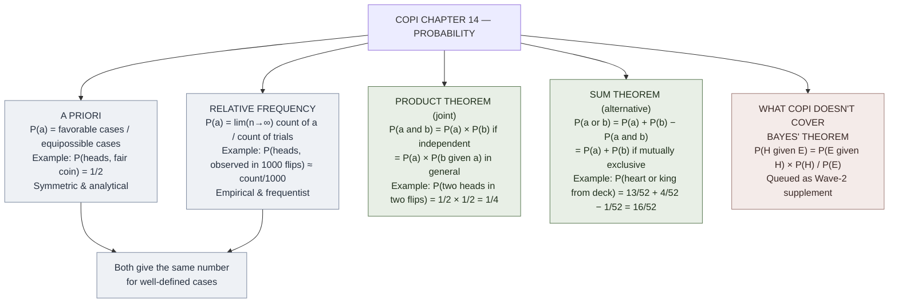

# Probability as Logic (Copi Ch 14)

**Summary**: [Copi](./copi-introduction-to-logic.md) Ch 14's introduction to **probability theory** as the logical extension of inductive inference. Two interpretations: **a priori** (probability from symmetry of equally-possible outcomes) and **relative frequency** (probability from long-run observation). Two foundational theorems: **product theorem** (joint occurrences) and **sum theorem** (alternative occurrences). The pre-Bayesian foundation; the wiki's [logic-atomic-design](./logic-atomic-design.md) §Gaps registers Bayesian inductive logic as a Wave-2 supplement (Jaynes *Probability Theory: The Logic of Science*).

**Sources**:
- [Copi/Cohen/McMahon](./copi-introduction-to-logic.md) *Introduction to Logic* 14th ed, Ch 14 *Probability*.
- Sister page [ORACLE](./oracle-overview.md) distributional mode — the wiki's prediction encoder.
- For the Bayesian extension Copi doesn't reach: queued as Wave-2 supplement (Jaynes 2003).

**Last updated**: 2026-05-25

---

## One-line

> Probability is the **logic of partial certainty**. Two interpretations (a priori from symmetry; relative-frequency from observation). Two theorems (product for joint; sum for alternative). Pre-Bayesian; Copi doesn't reach Bayes' theorem.

## Unlocks (lead, not footer)

1. **Probability as the *quantitative* extension of inductive reasoning.** Where [analogical-reasoning](./analogical-reasoning.md) gives qualitative strength judgments and [causal-reasoning-mill-methods](./causal-reasoning-mill-methods.md) gives causal hypotheses, **probability gives numerical estimates** of partial-certainty claims. The same inductive workflow now produces *measurable* outputs that can be compared, combined, and updated.

2. **Product theorem for joint occurrences.** *P(a and b) = P(a) × P(b)* — for independent events. The simplest probability calculation, and the foundational move for nearly all multi-step probability reasoning. **Independence is the load-bearing precondition**; without it, the formula becomes *P(a and b) = P(a) × P(b | a)* (conditional probability), the gateway to Bayesian reasoning.

3. **Sum theorem for alternative occurrences.** *P(a or b) = P(a) + P(b) − P(a and b)* — by inclusion-exclusion. For mutually exclusive events, the joint term drops. Cross-link: the wiki's inclusion-exclusion tool (puzzle archetype A) **is structurally the probability sum theorem applied to set sizes** — same machinery, set-theoretic interpretation.

4. **Two interpretations, same calculus.** A priori probability (1/6 for a fair die's six) and relative-frequency probability (the limit of observed frequencies in long-run trials) **agree numerically** for well-defined symmetric cases but **differ philosophically** about what probability *is*. The wiki cross-links: a priori = analytical/symmetric; relative-frequency = empirical. Bayesian probability (not in Copi) treats probability as *degree of rational belief*, a third interpretation worth queuing for Wave 2.

5. **Copi doesn't reach Bayes.** The 14th edition does not cover **Bayesian updating** (`P(H|E) ∝ P(E|H) × P(H)`) — the most-important 20th-century development in probabilistic reasoning. The wiki acknowledges this as a Wave-2 gap and queues Jaynes 2003 *Probability Theory: The Logic of Science* for ingest.

## Mnemonic

**A · F · P · S** = *A priori · Frequency · Product · Sum.*

Two interpretations (A · F) + two theorems (P · S) = the basic Copi-Ch-14 quadrant. Read directly as *"A-F-P-S"*.

For the formulas: **P(a and b) = P(a) × P(b)** · **P(a or b) = P(a) + P(b) − P(a and b)**.

## Memory checksum

1. **State the two interpretations.** (1: A priori — probability from symmetry of equally-possible outcomes (e.g., 1/6 for a fair die). 2: Relative frequency — probability from observed frequencies in long-run trials (e.g., limit of heads/total in coin flips).)
2. **State the product theorem.** (*P(a and b) = P(a) × P(b)* for independent events. For dependent events: *P(a and b) = P(a) × P(b | a)*.)
3. **State the sum theorem.** (*P(a or b) = P(a) + P(b) − P(a and b)*. For mutually exclusive events: *P(a and b) = 0*, so *P(a or b) = P(a) + P(b)*.)
4. **Define independence.** (Events a and b are independent iff *P(a | b) = P(a)* (and equivalently *P(b | a) = P(b)*) — i.e., observing one doesn't change the probability of the other.)
5. **What does Copi NOT cover?** (Bayes' theorem and Bayesian updating: *P(H | E) ∝ P(E | H) × P(H)*. This is queued as a Wave-2 supplement (Jaynes 2003).)

## Visual — the two theorems



The two theorems are the load-bearing computational substrate. Bayes' theorem (the third major theorem) is queued.

---

## Two interpretations of probability

### A priori interpretation

**Probability is the ratio of favorable cases to equipossible cases.**

Examples:
- A fair die: 6 equipossible outcomes; *P(rolling 3)* = 1/6.
- A fair coin: 2 equipossible outcomes; *P(heads)* = 1/2.
- A standard deck: 52 equipossible cards; *P(drawing the ace of spades)* = 1/52.

**The interpretation is analytical** — derived from the symmetry of the experimental setup without needing to perform the experiment. The interpretation works well for designed-symmetric cases (dice, coins, lotteries, cards) but struggles for asymmetric real-world events (rain tomorrow, recovery from illness).

### Relative frequency interpretation

**Probability is the limit of the observed frequency of an event in repeated trials.**

Examples:
- *P(heads, biased coin)* = limit of (#heads / #flips) as #flips → ∞.
- *P(rain on June 5 in Atlanta)* = limit of (#rainy June-5s / total June-5s on record).
- *P(survival 5 years after diagnosis)* = limit of (#alive at 5y / #diagnosed).

**The interpretation is empirical** — derived from observation. It works well for repeatable events with stable underlying mechanisms but struggles for one-off events (probability of nuclear war by 2030 cannot be observed in repeated trials).

### How the interpretations relate

For well-defined symmetric setups (fair dice, coins), the two interpretations **agree numerically**: the a priori 1/6 for a fair die equals the limit of (#3s / total rolls) as trials → ∞.

For asymmetric or one-off events, the two interpretations **diverge philosophically**:
- A priori has no purchase (no symmetry to exploit).
- Relative frequency requires defining a reference class of "repeatable" trials.

Bayesian probability (not in Copi) introduces a **third interpretation**: probability as *degree of rational belief*, updatable by observation. Bayesianism handles one-off events naturally (belief about nuclear war by 2030) but requires explicit priors. The wiki queues Jaynes 2003 for Wave 2.

## Product theorem (joint occurrences)

**The probability of two independent events both occurring is the product of their individual probabilities.**

```
P(a and b) = P(a) × P(b)
```

For dependent events, the conditional probability adjustment:

```
P(a and b) = P(a) × P(b | a)
```

Where *P(b | a)* is the probability of *b* given that *a* has occurred.

**Worked examples**:

1. **Two heads in two flips of a fair coin**: *P(H₁ and H₂)* = *P(H₁)* × *P(H₂)* = 1/2 × 1/2 = **1/4**.

2. **Rolling a 6 then a 6 on two dice**: *P(6₁ and 6₂)* = 1/6 × 1/6 = **1/36**.

3. **Three spades drawn in three draws WITH replacement** (independent): *P(3♠)* = (13/52)³ = (1/4)³ = **1/64**.

4. **Three spades drawn in three draws WITHOUT replacement** (dependent): *P(3♠)* = (13/52) × (12/51) × (11/50) = **11/850** (≈ 1/77).

The without-replacement case requires conditional probabilities: after the first spade is drawn, only 12 spades remain among 51 cards; after two spades, 11 remain among 50.

**Independence** is the load-bearing precondition. Events are independent iff *P(a | b) = P(a)*. Coin flips are independent (the coin doesn't remember); card draws without replacement are not (the deck changes).

## Sum theorem (alternative occurrences)

**The probability of one of two events occurring is the sum of their individual probabilities minus the probability of both occurring.**

```
P(a or b) = P(a) + P(b) − P(a and b)
```

The subtraction corrects for double-counting cases where both *a* and *b* occur.

For **mutually exclusive** events (cannot both occur), *P(a and b)* = 0, so:

```
P(a or b) = P(a) + P(b)    [mutually exclusive case]
```

**Worked examples**:

1. **Drawing a heart or a king from a standard deck**: *P(♥)* = 13/52; *P(K)* = 4/52; *P(♥ and K)* = 1/52 (the king of hearts). So *P(♥ or K)* = 13/52 + 4/52 − 1/52 = **16/52** ≈ 30.8%.

2. **Drawing a heart or a spade** (mutually exclusive): *P(♥)* = 13/52; *P(♠)* = 13/52; *P(♥ and ♠)* = 0. So *P(♥ or ♠)* = 13/52 + 13/52 = **26/52** = 50%.

3. **Rolling a 6 or a 1 on one die** (mutually exclusive): *P(6 or 1)* = 1/6 + 1/6 = **2/6** = 1/3.

**Inclusion-exclusion** generalizes the sum theorem to multiple events:

```
P(a₁ or a₂ or ... or aₙ) = Σ P(aᵢ)
                         − Σ P(aᵢ and aⱼ)
                         + Σ P(aᵢ and aⱼ and aₖ)
                         − ...
                         + (−1)ⁿ⁺¹ × P(a₁ and a₂ and ... and aₙ)
```

The wiki's **inclusion-exclusion-tool** (puzzle archetype A) is structurally this formula applied to set sizes — same machinery in set-theoretic interpretation.

## Worked example — birthday paradox

**Question**: In a room of 23 people, what is the probability that at least two share a birthday?

**Approach via the complement**:
- Easier to compute *P(no shared birthday)* first.
- *P(no shared)* = *P(person 2 ≠ person 1)* × *P(person 3 ≠ persons 1, 2)* × ... × *P(person 23 ≠ persons 1-22)*.
- = (365/365) × (364/365) × (363/365) × ... × (343/365).
- ≈ 0.493.

- *P(at least one shared)* = 1 − 0.493 = **0.507**.

The counter-intuitive result: **just 23 people gives >50% probability of a shared birthday**. The intuition fails because we tend to compute the probability of a specific shared birthday with us, not the probability of *any* shared birthday among *any* pair.

## What Copi doesn't cover — Bayesian probability

The most-important 20th-century development in probabilistic reasoning is **Bayesian updating**:

```
P(H | E) = P(E | H) × P(H) / P(E)
```

Where:
- *P(H)* = prior probability of hypothesis H (before observing E).
- *P(E | H)* = likelihood of evidence E given H.
- *P(E)* = total probability of E (across all hypotheses).
- *P(H | E)* = posterior probability of H after observing E.

Bayesian reasoning treats probability as **degree of rational belief**, updated by evidence. It handles one-off events, integrates prior knowledge, and provides a principled way to combine evidence from multiple sources.

**Copi Ch 14 does not cover Bayes' theorem.** The 14th edition (2014) is structurally a *classical* probability text. The wiki cross-references [ORACLE](./oracle-overview.md)'s distributional mode + queues **Jaynes 2003** *Probability Theory: The Logic of Science* as a Wave-2 supplement to close the gap.

## Cross-link to the wiki

| Wiki layer | Connection |
|---|---|
| [oracle-overview](./oracle-overview.md) | ORACLE distributional mode = applied probability; this page is the formal substrate |
| inclusion-exclusion-tool | The wiki's puzzle archetype A tool; structurally the probability sum theorem applied to set sizes |
| information-theoretic-minimum | The ⌈log_b N⌉ tool; conceptually related to information content (entropy = expected information of probability distribution) |
| [causal-reasoning-mill-methods](./causal-reasoning-mill-methods.md) | Mill's methods inform probability assessments via observed frequencies |
| [science-and-hypothesis](./science-and-hypothesis.md) | Probability quantifies the inductive support of hypothesis given evidence |
| [validity-vs-soundness](./validity-vs-soundness.md) | Inductive arguments evaluated for strength; probability gives strength a numerical scale |
| [problem-solving-os](./problem-solving-os.md) | Risk + decision-under-uncertainty layers route through probability |

## Common failure modes

- **Gambler's fallacy**: assuming past coin flips affect future probabilities (independence ignored).
- **Base-rate neglect**: ignoring *P(H)* in favor of *P(E | H)* (Bayes-required but Copi doesn't cover).
- **Conjunction fallacy**: assigning *P(A and B)* > *P(A)*, which is mathematically impossible (Kahneman-Tversky's Linda-the-bank-teller experiment).
- **Probability ≠ frequency over short runs**: 10 heads in 10 coin flips doesn't imply the coin is biased (single-trial probability ≈ 0.001 but possible).
- **Confusing P(A | B) with P(B | A)**: the prosecutor's fallacy; mistaking the conditional direction.

## METER integration

| Drill | Pass floor | Source |
|---|---|---|
| State the two interpretations | <30 s | this page §Two interpretations |
| State the product + sum theorems | <30 s | this page §Mnemonic |
| Apply product theorem to coin-flip / dice problems | <60 s | this page §Product worked examples |
| Apply sum theorem to card / dice problems | <60 s | this page §Sum worked examples |
| Distinguish independence from mutual exclusion | <30 s | this page §Product + §Sum theorems |
| Identify the gambler's fallacy / conjunction fallacy / base-rate neglect | <30 s | this page §Failure modes |

## Related pages

- [copi-introduction-to-logic](./copi-introduction-to-logic.md) — Ch 14 source
- [analogical-reasoning](./analogical-reasoning.md) — Copi Ch 11
- [causal-reasoning-mill-methods](./causal-reasoning-mill-methods.md) — Copi Ch 12
- [science-and-hypothesis](./science-and-hypothesis.md) — Copi Ch 13
- [oracle-overview](./oracle-overview.md) — ORACLE distributional mode
- inclusion-exclusion-tool — sister tool (set-size form of sum theorem)
- information-theoretic-minimum — sister tool (entropy / information)
- [validity-vs-soundness](./validity-vs-soundness.md) — inductive strength as numerical probability
- [problem-solving-os](./problem-solving-os.md) — risk + uncertainty layers
- [logic-atomic-design](./logic-atomic-design.md) §Gaps — Wave-2 supplement (Jaynes 2003 Bayesian probability) queued
- [glossary](./glossary.md) — Logic layer registration
