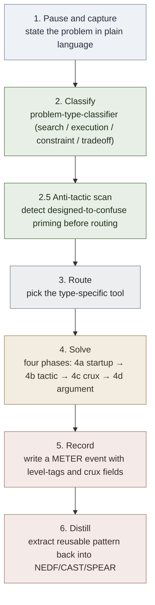
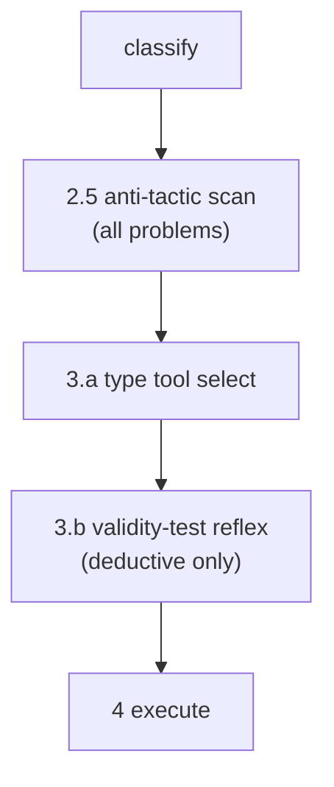

# Problem-Solving OS

**Summary**: Problem-Solving OS is the unified operating system for problem solving in Neural OS. It pulls together the [four-way classifier](./problem-type-classifier.md), the type-specific tools ([FRAME FORGE](./frame-forge.md) for search, [attention-framework](./attention-framework.md) for execution, [decision-kernel](./decision-kernel.md) for tradeoff and constraint), the [six-level maturity ladder](./problem-solving-maturity-levels.md), and the [recognition drill ladder](./problem-type-recognition-drill-ladder.md) into one operational stack with explicit measurement. This is the canonical answer to *"I have a problem — what do I actually do?"*

**Sources**:
- [problem-type-classifier](./problem-type-classifier.md)
- [frame-forge](./frame-forge.md)
- [attention-framework](./attention-framework.md)
- [decision-kernel](./decision-kernel.md)
- [problem-solving-maturity-levels](./problem-solving-maturity-levels.md)
- [problem-type-recognition-drill-ladder](./problem-type-recognition-drill-ladder.md)
- [meter-overview](./meter-overview.md)
- psychology-os-framework
- [rapid-in-neural-os](./rapid-in-neural-os.md)
- [anti-tactic-detection](./anti-tactic-detection.md) · [red-herring-resistance](./red-herring-resistance.md) · [crux-recognition-gym](./crux-recognition-gym.md) (2026-05-24 [livingstone-thomson-brain-teasers](./livingstone-thomson-brain-teasers.md) stress-test)
- [zeitz-startup-strategies](./zeitz-startup-strategies.md) · [universal-mathematical-tactics](./universal-mathematical-tactics.md) · [crux-move](./crux-move.md) · [problem-solving-three-levels](./problem-solving-three-levels.md) · [methods-of-mathematical-argument](./methods-of-mathematical-argument.md) (2026-05-24 [zeitz-art-and-craft](./zeitz-art-and-craft.md) layer)
- Design conversation, 2026-05-07

**Last updated**: 2026-06-21 (added [[#Runnable Form — `psos`]]: the operating stack now has an executable interpreter that emits the Measurement Contract event)

---

## Why This Page Exists

Problem solving is the most important skill Neural OS trains, but its components have lived on separate pages without a unified entry point. The classifier was on one page, the search-problem pipeline on another, the maturity ladder on a third, the recognition drill on a fourth. The user could read each but had no single page that answered *"when I face a problem at 9am, what do I run?"*

This page is that single answer. It is structurally an operating system, not an encoder or governor — it sequences the existing tools, defines the measurement contract, and gives the daily/weekly rhythm.

## The Operating Stack

When a problem arrives, run this top-down:



Each step has a target time. If a step blows its budget, the problem itself becomes a meta-problem — *why is this step slow?* — which is itself classifiable.

| Step | Default budget | Failure if over |
|---|---|---|
| 1. Pause and capture | 60 s | Reactive solving without a stated problem |
| 2. Classify | 30 s | Wrong tool used downstream |
| 2.5 Anti-tactic scan | 30 s | Wrong tactic primed by surface form |
| 3. Route | 10 s | Decision paralysis at the routing step itself |
| 4. Solve | type-dependent (sub-budgets below) | Re-classify; the problem may have shifted |
| 5. Record | 2 min | Lost-pattern bloat; same lesson re-learned |
| 6. Distill | 5 min (only if novel) | No transfer; problem stays one-shot |

### Step 2.5 — Anti-tactic scan

Lateral / trick / red-herring problems require a meta-step between classification and routing — recognizing that the problem is *priming* the wrong classification. Without this scan, the OS will obediently route to (say) FRAME FORGE on a search-looking problem whose answer is actually a single-word linguistic-crux.

The scan runs the three detection signals from [anti-tactic-detection](./anti-tactic-detection.md) — embellishment-to-arithmetic ratio · too-clean obvious answer · genre-aware framing. If any fires, routing flips to "Recast first, then classify" using [zeitz-startup-strategies](./zeitz-startup-strategies.md) §Recast as the preliminary move.

For non-trick problems (most engineering / scientific / business work) the scan resolves to a clean "no" in <10 s and the OS proceeds to step 3 normally. For puzzles or designed-to-confuse problems, the scan is the load-bearing protection against running the wrong pipeline.

### Step 4 — Solve, in four phases

Step 4 was the most under-specified step in the original sequencer. It now runs as four named phases, each with its own owner page:

| Phase | Move | Owner page | Fires when |
|---|---|---|---|
| **4a** Startup | If stuck >5 min, run the startup quartet one strategy at a time: *Get your hands dirty · Penultimate step · Wishful thinking · Make it easier* | [zeitz-startup-strategies](./zeitz-startup-strategies.md) | First 5–10 min of solve |
| **4b** Tactic | Name the tactic: Symmetry · Extreme · Pigeonhole · Invariant (+ cross-domain sub-tactics) | [universal-mathematical-tactics](./universal-mathematical-tactics.md) | Once you have traction |
| **4c** Crux | Identify the one obstacle whose negotiation decides the problem; do not Coagulate at the crux | [crux-move](./crux-move.md) · [problem-solving-three-levels](./problem-solving-three-levels.md) | At the load-bearing obstacle |
| **4d** Argument | Construct the proof / solution: direct · contradiction · standard induction · strong induction | [methods-of-mathematical-argument](./methods-of-mathematical-argument.md) | Closing the solve |

Each move during 4a–4d carries a **level-tag** — S (Strategy) · T (Tactic) · X (Tool) — and a **crux flag** marking the one obstacle that decided the problem. These tags become METER fields in step 5.

Stall escalation inside step 4:

| If step 4 stalls within | Run |
|---|---|
| 5 min | [Startup quartet](./zeitz-startup-strategies.md) (one strategy at a time, 5–10 min each) |
| 15 min (after quartet exhausted) | Reclassify (return to step 2) |
| 30 min | Park; escalate to next-day attempt; log as `stalled` |

## Runnable Form — `psos`

The operating stack above is not just a checklist to follow by hand — it has an executable form. `psos` (in the `meter` package: `tools/meter/meter/psos.py`, exposed as the `psos` console command) is an interpreter that walks a problem down this exact stack and emits the [[#Measurement Contract]] event at the end.

```bash
psos "Find shortest path in a weighted graph with negative edges"
# or, without installing the console script:
python -m meter.psos "your problem here"
```

It runs steps 1–6 interactively: captures the problem (auto-filling `state_at_start` from your last [PULSE](./pulse-overview.md) check-in), asks the [four classifier questions](./problem-type-classifier.md) in order, runs the step 2.5 [anti-tactic scan](./anti-tactic-detection.md), prints the routed tool plus its load-bearing *"don't use"*, lets you log each solve move with its S/T/X level-tag and crux flag, then records a `problem-solving / solve` METER event (plus a separate `distill` event if you name a transfer pattern).

**Design contract.** `psos` is an *internal, declarative* DSL: the control flow — the classifier decision tree, the routing table, the stall rules — lives in the engine, not in any user-facing session syntax. A "session" is dumb data (a problem statement plus the answers you give). This is deliberate; the moment a session can branch on its own it stops being a measurable record and becomes an un-debuggable mini-language. The classifier, routing table, and anti-tactic signals in `psos` are transcribed from their owner pages ([problem-type-classifier](./problem-type-classifier.md), this page, [anti-tactic-detection](./anti-tactic-detection.md)); **on drift, the pages win** — the code is updated to match, never the reverse.

Not yet enforced in the v0 walk (hints only): the stall-escalation timers above, and the step 3.b [validity-test](./validity-vs-soundness.md) for deductive problems. The natural upgrade is protocol-as-data — encoding [FRAME FORGE](./frame-forge.md) / [decision-kernel](./decision-kernel.md) as structured step-definitions the interpreter reads instead of hardcoding.

## Routing Table

Once classified, route to one tool. Do not run all four in parallel.

| Problem type | Primary tool | Secondary tool (if primary stalls) | Don't use |
|---|---|---|---|
| **Search** | [FRAME FORGE](./frame-forge.md) (8-step pipeline) | [BRIDGE LOAD](./bridge-load.md) for analogy | Decision frameworks (premature) |
| **Execution** | [attention-framework](./attention-framework.md) + [reflex training](./automaticity-and-reflex-training.md) | [Red Queen Gym](./red-queen-skill-gym.md) (single-mode isolation) | More theory |
| **Constraint** | [decision-kernel](./decision-kernel.md) (constraint mapping section) | [ORIENT](./orient-method.md) for unfamiliar environments | Frame Forge — search is over |
| **Tradeoff** | [decision-kernel](./decision-kernel.md) (full 7-question protocol) | Prediction logs over weeks | Memory frameworks |

The "Don't use" column is load-bearing. Most problem-solving failure is not from picking the wrong second tool — it is from picking a tool that doesn't match the problem at all (running FRAME FORGE on a tradeoff problem, or memorizing more theory when execution is the bottleneck).

## Maturity Progression

Where the user sits on [problem-solving-maturity-levels](./problem-solving-maturity-levels.md) determines what to train next:

| Level | Where you are | Next training |
|---|---|---|
| 0 Lost | Cannot frame the problem | Daily 1-line problem restatement drill |
| 1 Beginner | Can state but jumps to solving | Two-representation drill on every problem |
| 2 Advanced Beginner | Applies moves mechanically | [problem-type-recognition-drill-ladder](./problem-type-recognition-drill-ladder.md) until ≥85% classification accuracy |
| 3 Competent | Solves normal cases | Reframe drill — solve same problem two ways |
| 4 Advanced | Sees hidden structure | Compression and transfer drills |
| 5 Expert | Sees fast and teaches | Method design; extract from solved cases |

METER tracks the user's sustained level via classification accuracy, time-to-classification, and reframe success rate (see [[#Measurement Contract]] below). Self-assessment is the starting point; metric-confirmed level is the operational truth.

## The Daily Rhythm

| When | What | Time |
|---|---|---|
| Morning warm-up | Pull yesterday's open problems; pick one, run the operating stack steps 1-3 only (frame + classify + route, no solve yet) | 5 min |
| Working block | Run step 4 on the routed tool; if you stall, revisit classification | bounded |
| End of session | Run step 5 (record) for any problem touched today; even partial progress | 5 min |
| Weekly review | Run step 6 (distill) on the week's solved problems; extract one pattern per problem-type touched | 30 min |

This is the concrete answer to "what do I actually do." See neural-os-daily-loop for the full daily/weekly schedule including non-problem-solving activities.

## Measurement Contract

Every problem touched produces METER events. Required fields per event:

```yaml
problem_id: <uuid>
classified_type: <search|execution|constraint|tradeoff>
classification_latency_s: <number>
anti_tactic_scan_fired: <true|false>
red_herring_present: <true|false>
chosen_tool: <frame-forge|attention-framework|decision-kernel|...>
maturity_level_at_attempt: <0-5>
state_at_start: <E:N S:N>                  # PULSE
levels_used: <list of S/T/X tags, in order>   # Zeitz three-level decomposition
crux_identified: <true|false>
crux_level: <strategy|tactic|tool|none>
outcome: <solved|stalled|reclassified|abandoned>
solution_latency_min: <number|null>
transfer_pattern: <pattern-name|null>      # if step 6 distilled something
```

These events feed the standard METER reports plus a dedicated **Problem-Solving Dashboard** with these metrics:

| Metric | Definition | Pass / floor |
|---|---|---|
| Classification accuracy | % correct on type-classifier (validated by retrospect or peer) | Pass ≥85%, floor 70% |
| Time-to-classification | Median seconds from problem statement to type | Pass <30 s, floor 90 s |
| First-tool-correct rate | % where the chosen tool didn't need to be swapped mid-solve | Pass ≥70%, floor 50% |
| Solution rate by type | % solved per problem type | Pass ≥70% per type, floor 40% |
| Reclassification rate | % of problems where mid-solve type-tag changed | Healthy 10–25%; <10% may indicate forced-fit |
| Transfer rate | % of problems that produced a reusable pattern | Pass ≥30%, floor 10% |
| Stall recovery time | Median minutes to restart after a stall | Pass <15 min, floor 60 min |
| Per-archetype performance | Solution rate broken down by [pattern archetype](./lego-skills-patterns.md) | tracked monthly |
| Anti-tactic scan fire rate | % of designed-to-confuse problems where scan caught it before mis-routing | Pass ≥60%, floor 30% |
| Red-herring false-positive rate | % of red-herring-present problems where decorative fact was used in solve — [red-herring-resistance](./red-herring-resistance.md) | ≤10% pass, ≤20% floor |
| Crux identification rate | % of solved problems with the crux explicitly flagged — [crux-move](./crux-move.md) | Pass ≥70%, floor 40% |
| Crux recognition latency | Median time from solve-start to crux flag, as % of total solution time | Pass <30%, floor 60% |
| Crux-recognition rate (puzzle domain) | % of puzzles where crux identified in <60 s — [crux-recognition-gym](./crux-recognition-gym.md) | Pass ≥70%, floor 40% |
| Cognitive-stage compliance at crux | % of crux moves not Coagulated (executed with deliberate attention) | Pass ≥90%, floor 70% |
| Level-tag tool-fetishism rate | % of moves logged as X (Tool) without an S (Strategy) precedent | Pass <10%, floor 25% |

These metrics are the operational form of the [maturity ladder](./problem-solving-maturity-levels.md): hitting the pass thresholds across all metrics for 30+ days is the operational definition of advancing one level.

## Failure Modes

| Failure | What it looks like | Mitigation |
|---|---|---|
| **Classification skipped** | User jumps straight to a familiar tool without naming the problem type | Step 2 has a 30s budget; if step 4 starts without an explicit type tag, the METER event flags `unclassified` |
| **Wrong tool used** | FRAME FORGE on a tradeoff problem; decision-kernel on a search problem | First-tool-correct rate is a metric; persistent low rate triggers re-training the classifier |
| **Stalled-and-stuck** | Problem sits open for days without progress | Stall recovery time is a metric; >60min recovery triggers a forced reclassification |
| **No-record completion** | Problem solved but no METER event recorded; pattern not extracted | Step 5 runs at session end automatically; absence of step-6 distillation is logged |
| **Premature distillation** | Extracting a "pattern" from a one-off solution without the abstraction holding | Only step 6 if the problem type has been seen ≥3 times; distill from clusters, not single cases |
| **Maturity overclaim** | User self-reports level 4 when metrics put them at 2 | Self-assessment is an input; metric-confirmed level is the operational truth |
| **Tool fetishism** | Running FRAME FORGE on every problem because it feels rigorous | Routing table's "Don't use" column is load-bearing; misuse over-triggers METER escalation |
| **Missing the meta-problem** | Pipeline blows budget repeatedly without re-examining whether the operating stack itself fits today's problem | If three consecutive problems blow budget, step 1 expands to "is this a meta-problem about how I'm working?" |

## What This OS Does Not Do

Problem-Solving OS explicitly does **not**:

- replace any of the underlying pages — it sequences them, doesn't subsume them
- solve novel problems for you — it routes you to the right tool faster
- handle long-horizon strategy or multi-month planning (those need their own future layer)
- substitute for domain knowledge — without the underlying knowledge, no operating stack helps
- enforce step compliance — the budgets are defaults, not laws; user judgment can override
- prescribe ethics or values (decision-kernel handles value-ranking but doesn't pick values)
- replace psychology-os-framework — that page diagnoses behavior; this page operates on problems. Different jobs, often run in sequence

## Worked Examples

### Example 1: Search problem (algorithm interview)

```
Problem: "Find the shortest path in a weighted graph with negative edges."
Step 1 (frame, 30s):     given weighted graph G with possibly-negative edges, find shortest path from s to t
Step 2 (classify, 15s):  search problem (path is unknown)
Step 3 (route, 5s):      FRAME FORGE
Step 4 (solve, 8min):
  Frame: shortest-path with negative edges
  Inventory: edges can be negative, no negative cycles assumed
  Represent: graph; relaxation-based algorithm space
  Probe: Dijkstra fails on negative edges; consider Bellman-Ford
  Generate: Bellman-Ford O(VE), SPFA O(VE) avg, Johnson's for all-pairs
  Evaluate: single-source → Bellman-Ford
  Formalize: V-1 relaxation rounds, then negative-cycle check
  Distill: pattern = "relaxation with negative weights → Bellman-Ford family"
Step 5 (record, 2min):    METER event: search / FRAME FORGE / solved / 8min / pattern: bellman-ford-family
Step 6 (distill, 4min):   added to algorithm-pattern-nedf-deck under "shortest-path-weighted"
```

### Example 2: Execution problem (writing avoidance)

```
Problem: "I keep avoiding the writing block I scheduled for today."
Step 1 (frame, 45s):     I have time + know what to write + cannot start
Step 2 (classify, 10s):  execution problem (path known, not executing)
Step 3 (route, 5s):      attention-framework + reflex training
Step 4 (solve, 5min):
  attention-framework diagnostic: energy 3, current task aversive, no clear first action
  fix: smallest viable first action = open the doc, paste yesterday's last paragraph, edit one sentence
  start = 90s timer
Step 5 (record):          METER: execution / attention-framework / partial / fragmentation flag = "no clear first action"
Step 6 (distill):          pattern = "execution stalls when first action is too abstract; concretize to 90s task"
```

### Example 3: Tradeoff problem (career)

```
Problem: "Should I take the senior IC offer or the EM offer?"
Step 1 (frame, 90s):     two valid offers, different career trajectories, must decide by Friday
Step 2 (classify, 20s):  tradeoff problem (both viable, different costs)
Step 3 (route, 5s):      decision-kernel full 7-question protocol
Step 4 (solve, 90min over 2 days):
  reversibility: EM is harder to undo; IC stays optionable
  values rank: technical depth > management surface area > comp
  prediction log: write expected feeling at +6mo, +18mo, +5y for each
  decision record: chosen IC; criteria = depth-first; review at +6mo
Step 5 (record):          METER: tradeoff / decision-kernel / solved / decision-record-id-XYZ
Step 6 (distill):          pattern = "for IC vs management at this stage, default to reversibility"
```

### Example 4: Constraint problem (study time)

```
Problem: "I want to study for the cert but cannot find blocks of focused time."
Step 1 (frame, 60s):     ~2 hours/day available but fragmented; need focused blocks for the cert material
Step 2 (classify, 15s):  constraint problem (path known: study; resource blocked: contiguous time)
Step 3 (route, 5s):      decision-kernel constraint-mapping section
Step 4 (solve, 20min):
  map dependencies: focused time blocked by morning standups, lunch interruptions, evening fatigue
  identify real vs fake constraints: standups are fixed (real); lunch interruptions are negotiable (fake)
  feasible path: 5:30-7am pre-standup window; 30min lunch focused block; 20min post-dinner review
  output: 80min/day reliable, beats fragmented 2hr by far
Step 5 (record):          METER: constraint / decision-kernel / solved / pattern: pre-work focus block
Step 6 (distill):          pattern = "fragmentation > duration; protect smaller windows over chasing larger ones"
```

## Calibration Defaults

- Step budgets: 60s frame, 30s classify, 10s route, type-dependent solve, 2min record, 5min distill
- Pass thresholds (see Measurement Contract above): classification ≥85%, first-tool-correct ≥70%, solution rate ≥70% per type, transfer ≥30%
- Floor thresholds: classification 70%, first-tool-correct 50%, solution rate 40%, transfer 10%
- Maturity-level confirmation window: 30 days of metric pass for next level
- Reclassification healthy band: 10-25% (below = forced fit; above = classifier weakness)
- Stall recovery alert: >60 minutes without progress triggers forced reclassification

## Integration With Other Layers

| Layer | Relationship |
|---|---|
| [METER](./meter-overview.md) | Defines the per-problem event schema; produces the Problem-Solving Dashboard |
| [PULSE](./pulse-overview.md) | State at problem-start is part of the event; low-state sessions Steer toward familiar problem types and away from novel reframing |
| [lifecycle-manager](./lifecycle-manager.md) | Patterns distilled in step 6 are NEDF/CAST/SPEAR cards subject to standard retirement; old solution records archive to wiki ghost-slots |
| [ORACLE](./oracle-overview.md) | Problem-type recognition is, structurally, distributional ORACLE training; the [problem-type-recognition-drill-ladder](./problem-type-recognition-drill-ladder.md) is one of its instances |
| [red-queen-skill-gym](./red-queen-skill-gym.md) | Hosts the type-recognition drill ladder, the reframe drill, the compression drill |
| psychology-os-framework | When a problem keeps stalling and the issue is behavioral (avoidance, identity, motivation), psychology-os-framework's six-room walk diagnoses; this OS resumes once the diagnostic returns an actionable insight |
| [RAPID](./rapid-in-neural-os.md) | Problems are RAPID's natural input. RAPID frames; this OS sequences the response |

## Bottom Line

Problem solving has been Neural OS's most important domain since the start, with strong components scattered across pages. This OS is the missing seam: it sequences the components, defines the measurement, and gives the daily/weekly rhythm. The user's stated highest priority — *highly measurable mental framework for learning and problem solving* — runs on this page plus [METER](./meter-overview.md).

## Diagrams

Operating-stack schematic with all phases: steps 1–6 down the spine, step 2.5 (Anti-tactic scan) gating step 3, step 3 branching to the four type-specific tools, and step 4 expanded into its four phases (4a Startup → 4b Tactic → 4c Crux → 4d Argument):


## External grounding — pipeline siblings, delivery-layer gap, surgical-extensions queue

Problem-Solving OS sequences existing Neural OS tools into a runnable operating stack. The closest external siblings are: McKinsey's 7-step (define / disaggregate / prioritize / workplan / analyze / synthesize / recommend), Pólya's 4-stage (understand / plan / carry / look back), Toyota's Practical Problem Solving 7-step, Six Sigma's DMAIC, Ford's 8D, CRISP-DM (data-science variant), and the medical SOAP/ADPIE/OPQRST family. All eleven are cosmetic variants of the same skeleton; see [problem-solving-pipeline-equivalence](./problem-solving-pipeline-equivalence.md) for the side-by-side mapping.

The current Problem-Solving OS step 5 (Record) captures METER events but does **not** cover communicating the solution to stakeholders. This is the **N1 Delivery-layer gap** flagged in [external-problem-solving-frameworks](./external-problem-solving-frameworks.md) — corroborated by 6 independent traditions (McKinsey "Prewire" + Minto "Pyramid Principle / conclusion-first" + Toyota nemawashi/catchball + Kaiser SBAR + aviation CRM/DESC + legal CREAC). Pending architecture decision: extend Problem-Solving OS with step 5.5 (Communicate) *or* spin a new named protocol sibling to PULSE/METER/SPARK. Either way, the gap is real and corroborated.

Other extension candidates from the fused external catalog (see [external-problem-solving-frameworks](./external-problem-solving-frameworks.md) §"Surgical extensions" table for the full N1–N45 queue):
- **N5 Cynefin axis** (Snowden) — orthogonal classifier to [S·E·C·T](./problem-type-classifier.md); distinguishes complex from complicated tradeoffs
- **N9 Pre-mortem** (Klein) — formal pre-execution failure-imagination step
- **N10 Recognition-Primed Decision** (Klein) — expert-mode skip for [decision-kernel](./decision-kernel.md) for [level-4-5](./problem-solving-maturity-levels.md) users
- **N13 After-Action Review** (US Army) + **Blameless Postmortem** (Google SRE) — template for step 5 records

See [learning-sciences-validation](./learning-sciences-validation.md) for the learning-science grounding of the wiki ([problem-solving-os](./problem-solving-os.md) step 5 + 6 = Look-Back / hansei / spaced-retrospective).

## Validity-test sub-step — added 2026-05-25 from the logic ingest

Added 2026-05-25 from the [Copi](./copi-introduction-to-logic.md) + [TLP](./tractatus-logico-philosophicus.md) + [Logicomix](./logicomix-graphic-novel.md) triple ingest. The Operating Stack gains an explicit **validity-test sub-step** for problems classified as *deductive*:

| Step | Sub-step | What runs |
|---|---|---|
| **3** Choose-Method | 3.a Type-specific tool selection | per problem-type classifier |
| **3** Choose-Method | 3.b **Validity-test (deductive only)** *(NEW)* | *Suppose premises true; seek counter-example; declare invalid (with example) or proceed.* See [validity-vs-soundness](./validity-vs-soundness.md) §Quick-reflex. Pass floor: <30 s. Owner: [validity-vs-soundness](./validity-vs-soundness.md). |

The 3.b sub-step **does not replace** the existing step 2.5 anti-tactic scan — that fires on *any* problem; 3.b fires only on deductive arguments after classification. The two are sequenced:



Cross-link to [argument-anatomy](./argument-anatomy.md) (premise/conclusion extraction must precede 3.b) and [fallacy-taxonomy](./fallacy-taxonomy.md) (3.b's most common counter-example forms are *affirming the consequent* and *denying the antecedent*). For inductive problems, 3.b is replaced by a *strength* check (see [validity-vs-soundness](./validity-vs-soundness.md) §Inductive).

## Related Pages

- [problem-type-classifier](./problem-type-classifier.md)
- [frame-forge](./frame-forge.md)
- [attention-framework](./attention-framework.md)
- [decision-kernel](./decision-kernel.md)
- [problem-solving-maturity-levels](./problem-solving-maturity-levels.md)
- [problem-type-recognition-drill-ladder](./problem-type-recognition-drill-ladder.md)
- [meter-overview](./meter-overview.md)
- neural-os-daily-loop
- psychology-os-framework
- [argument-anatomy](./argument-anatomy.md) — premise/conclusion extraction; prerequisite for 3.b
- [validity-vs-soundness](./validity-vs-soundness.md) — the validity-test reflex; owner of 3.b
- [fallacy-taxonomy](./fallacy-taxonomy.md) — what 3.b is testing against
- [logic-atomic-design](./logic-atomic-design.md) — hub registering 3.b's atoms (`val` · `snd` · `str` · `cog`)
- [copi-introduction-to-logic](./copi-introduction-to-logic.md) — source for 3.b's procedure (Ch 6, Ch 8-10)
- [rapid-in-neural-os](./rapid-in-neural-os.md)
- [red-queen-skill-gym](./red-queen-skill-gym.md)
- [bridge-load](./bridge-load.md)
- [orient-method](./orient-method.md)
- [external-problem-solving-frameworks](./external-problem-solving-frameworks.md)
- [problem-solving-pipeline-equivalence](./problem-solving-pipeline-equivalence.md)
- [problem-solving-atomic-design](./problem-solving-atomic-design.md) — Atomic-design lens; this Operating Stack is its central *template*, FRAME FORGE / Decision Kernel / Attention Framework are *organisms*, the four [universal tactics](./universal-mathematical-tactics.md) are *molecules*, and the worked examples below are *pages*. See for the full 5-tier mapping + new METER fields.
- [learning-sciences-validation](./learning-sciences-validation.md)


---

## U — See (CAST)
1. Six-step problem-solving pipeline
2. Universal problem-solving operating system

## D — Name (NEDF)
1. Problem-solving OS = 6-step pipeline
2. Distinguisher: framework-agnostic pipeline
3. Failure mode: skipping pipeline steps

## F — Do (SPEAR)
1. Problem → run 6-step pipeline
2. Each step → invoke matching framework

## B — Watch (HEART)
1. Step-skipping
2. Wrong framework for step

## L — Predict (ORACLE)
1. Problem type → predict step weights
2. Step → predict framework

## R — Act (GRACE)
1. Problem appears → run OS
2. Stuck → check current step