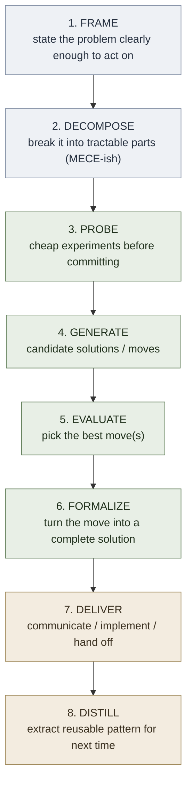

# Problem-Solving Pipeline Equivalence

**Summary**: Comparison page showing that **at least twelve named multi-step problem-solving pipelines from independent traditions are cosmetic variants of the same underlying skeleton** — frame → decompose → probe → generate → evaluate → formalize → deliver → distill. The variants differ in step count (4 to 8), in cosmetic naming, and in which steps are emphasized vs which are collapsed or implicit, but the underlying flow is invariant. This page exists to defang every future "shouldn't we adopt the McKinsey 7-step instead of FRAME FORGE?" question (or DMAIC / Polya / 8D / CRISP-DM / etc.) with a single side-by-side table.

**Sources**:
- Pólya, G. (1945). *How to Solve It* — 4-stage canonical mathematical-problem method
- *McKinsey Mind*; Conn & McLean (2018) *Bulletproof Problem Solving* — McKinsey 7-step
- ASQ DMAIC documentation — Six Sigma's 5-step DMAIC (define / measure / analyze / improve / control)
- ASQ 8D documentation — Ford's 8-discipline corrective-action protocol (D0–D8)
- Toyota PPS — 7-step Practical Problem Solving
- CRISP-DM consortium — 6-step data-mining process (business understanding → data understanding → data preparation → modeling → evaluation → deployment)
- KDD (Fayyad et al.) — 5-step Knowledge Discovery in Databases
- SEMMA (SAS) — 5-step modeling-centric variant
- Microsoft TDSP — Team Data Science Process
- ADPIE (US nursing canon) — Assess / Diagnose / Plan / Implement / Evaluate
- SOAP (medical canon) — Subjective / Objective / Assessment / Plan
- Dewey, J. (1910). *How We Think* — 5-step "phases of reflective thinking"
- AAR (US Army) — 4-question post-event reflection
- Per-source URLs preserved in [external-problem-solving-frameworks](./external-problem-solving-frameworks.md) Round 1–3 agent transcripts.

**Last updated**: 2026-05-17

---

## Why this page exists

[external-problem-solving-frameworks](./external-problem-solving-frameworks.md) catalogued ~700 named problem-solving frameworks from 12 traditions. The single most striking finding: the *multi-step pipelines* — DMAIC, Polya 4-stage, McKinsey 7-step, 8D, FRAME FORGE, CRISP-DM, KDD, SEMMA, TDSP, Toyota PPS, ADPIE, Dewey 5-phase — are all variants of the **same skeleton**. The differences are surface-level: which steps get explicit names, which get collapsed, which assume a specific domain (data-mining for CRISP-DM; clinical nursing for ADPIE; statistical-process-improvement for DMAIC), and which emphasize delivery vs distillation.

Once you see the equivalence, the question "should we switch to the McKinsey 7-step?" is the same as asking "should we rename rooms in our house to Roman numerals?" — a cosmetic question, not an architectural one. This page makes the equivalence visible so the question dissolves rather than recurring.

---

## The universal skeleton

Every pipeline below maps onto this skeleton. The numbers in each cell are the **step indices in the source pipeline** that perform the corresponding skeleton step. A blank means the skeleton step is either implicit (the pipeline assumes you did it) or collapsed into a neighboring step.

---

## The comparison table

| Skeleton step | [FRAME FORGE](./frame-forge.md) (8) | Pólya (4) | McKinsey 7-step | DMAIC (5) | 8D (Ford) | Toyota PPS (7) | CRISP-DM (6) | KDD (5) | SEMMA (5) | TDSP | ADPIE (5) | SOAP (4) | Dewey 5-phase | AAR (4 Q's) |
|---|---|---|---|---|---|---|---|---|---|---|---|---|---|---|
| **1. Frame** | 1 Frame | 1 Understand | 1 Define | 1 Define | D0+D1+D2 (containment + team + problem desc) | 1 Clarify + 2 Breakdown | 1 Business Understanding | 1 Selection | (implicit) | Business Understanding | 1 Assess | S+O (Subjective+Objective) | 1 Felt difficulty | Q1 What was intended? |
| **2. Decompose** | 2 Inventory + 3 Represent | 1 (collapsed) | 2 Disaggregate | 2 Measure | D3 Containment | 2 (collapsed) | 2+3 Data Understanding + Data Preparation | 2+3 Preprocessing + Transformation | 1+2 Sample + Explore | Data Acquisition | 2 Diagnose | A (Assessment) | 2 Location + Definition | (implicit) |
| **3. Probe** | 4 Probe | (implicit in Plan) | 5 Conduct analyses | 3 Analyze | D4 Root cause | 3 Target + 4 Root cause | 4 Modeling (early) | 4 Data Mining | 3 Modify | Modeling (early) | (implicit) | (implicit) | (implicit) | (implicit) |
| **4. Generate moves** | 5 Generate Moves | 2 Devise a plan | 3 Prioritize + 4 Workplan | (collapsed into Improve) | D5 Permanent corrective action | 5 Countermeasures | 4 Modeling (continued) | 4 (continued) | 4 Model | Modeling | 3 Plan | (collapsed into Plan) | 3 Suggested solutions | (implicit) |
| **5. Evaluate** | 6 Evaluate | (collapsed into Plan) | 5 Conduct analyses | 4 Improve | D6 Implement + verify | 6 Evaluate | 5 Evaluation | (collapsed) | 5 Assess | Evaluation | (collapsed into Plan) | (collapsed into Plan) | 4 Reasoning | Q2 What actually happened? + Q3 Why? |
| **6. Formalize** | 7 Formalize | 3 Carry out | 6 Synthesize | (in Improve) | D6 (continued) | 7 Standardize (early) | 6 Deployment (early) | 5 Interpretation | (collapsed) | Deployment (early) | 4 Implement | P (Plan) | 5 Testing | (implicit) |
| **7. Deliver** | (gap — N1 candidate) | (implicit in Carry out) | 7 Recommend + Communicate | 5 Control (early) | D7 Prevent recurrence (org-wide) | 7 Standardize (continued) | 6 Deployment (continued) | (collapsed) | (collapsed) | Customer Acceptance + Deployment | (implicit) | (implicit) | (implicit) | Q4 What will we do differently? |
| **8. Distill** | 8 Distill | 4 Look back | (implicit in Communicate) | 5 Control (continued — process capability + monitoring) | D8 Congratulate + lessons learned | 7 (continued) | (cyclic — restart at 1) | (implicit) | (implicit) | (cyclic) | 5 Evaluate | (implicit) | (implicit) | Q4 (continued) |

**Reading the table**: each column is a different tradition's named pipeline. Each row is one skeleton step. Cells say which source-pipeline step performs that skeleton step (or "(implicit)" / "(collapsed)" / "(gap)" if the step isn't named in that variant).

---

## What the table reveals

### 1. The skeleton is universal

Every one of the 14 pipelines covers steps 1-6. Differences are only in:
- *Step granularity* — Polya collapses Inventory + Represent into one "Understand"; FRAME FORGE splits them. Polya collapses Generate + Evaluate into "Plan"; McKinsey separates them.
- *Domain assumptions* — CRISP-DM assumes the problem is data analysis (so its "Decompose" is "Data Understanding + Data Preparation"); ADPIE assumes patient care (so its "Decompose" is "Diagnose"); DMAIC assumes a measurable process (so its "Probe" is statistical "Analyze").
- *Which step is most-named* — DMAIC names Measure (statistical-process tradition); Polya names Look Back (mathematical-reflection tradition); McKinsey names Synthesize (consulting deliverable tradition); CRISP-DM names Deployment (industry-deployment tradition).

The cosmetic differences track *what each tradition's practitioners most often get wrong*, not what the underlying skeleton requires.

### 2. The "Deliver" step is the diagnostic

Look at row 7 (Deliver) in the table. **Three pipelines name it explicitly** (McKinsey 7-step "Recommend"; 8D D7 "Prevent recurrence"; TDSP "Customer Acceptance + Deployment"). **Eight pipelines leave it implicit or collapse it into an adjacent step**. The implicit-Deliver pipelines are exactly the ones whose practitioner-traditions consistently fail at communication: math problems (Polya), data-mining notebooks (KDD/SEMMA), patient care (SOAP — "did anyone in the next shift actually read this?"), and yes, [FRAME FORGE](./frame-forge.md).

This is the empirical justification for the **N1 Delivery-layer extension** flagged in [external-problem-solving-frameworks](./external-problem-solving-frameworks.md) — the gap is not unique to Neural OS, it is structural across most pipeline traditions, and the pipelines that *do* name a Delivery step (McKinsey, 8D, TDSP) are the ones whose practitioners get measurably better stakeholder outcomes.

### 3. The "Distill" step is the second diagnostic

Row 8 (Distill) is named explicitly in 5 of 14 pipelines (Pólya's "Look back" being the cleanest; 8D D8 lessons-learned; ADPIE Evaluate; AAR Q4; FRAME FORGE Distill). The other pipelines leave reflection implicit and most practitioner-traditions correspondingly fail at it ("we solve, we ship, we never look back"). [problem-solving-os](./problem-solving-os.md) step 6 + [METER](./meter-overview.md) enforce this step; the named extraction-of-pattern is one of Neural OS's contributions.

### 4. Domain assumption shapes apparent novelty

CRISP-DM looks novel relative to McKinsey if you forget that "data understanding" is just "inventory the available facts" under a domain-specific name. ADPIE looks novel relative to Polya if you forget that "diagnose" is just "decompose to a tractable model" under a clinical-domain name. **The cosmetic novelty masks the structural identity.** This is why "should we switch to CRISP-DM for data problems?" is a misframed question — the answer is "you already do; you call it FRAME FORGE."

### 5. Cyclic vs linear is a presentation choice, not a structural one

CRISP-DM, ADPIE, AAR, and Pólya all explicitly cycle (loop back from step 8 to step 1). DMAIC's "Control" step is the loop-closure. McKinsey, FRAME FORGE, 8D present linearly but assume the practitioner will re-run when needed. **The cycle is implicit in all of them.** Whether to draw the arrow back to step 1 is a presentation decision; the iterative shape is universal. (See [external-problem-solving-frameworks](./external-problem-solving-frameworks.md) N4 — top-down ↔ bottom-up oscillation Modes — for the corresponding meta-finding that real practice is iterative within each step too, not just across the pipeline.)

---

## Which pipeline to pick

The honest answer: **it doesn't matter** as long as you actually run all eight skeleton steps. Pick the pipeline whose naming and emphasis best matches your domain and what your team already speaks:

- **Math / proof / algorithm work** → [FRAME FORGE](./frame-forge.md) or Pólya. FRAME FORGE explicit on Inventory + Represent; Pólya canonical and concise.
- **Business / strategy work** → McKinsey 7-step. Explicit on Synthesize + Recommend (the Delivery half).
- **Manufacturing / process / quality** → DMAIC or 8D. DMAIC for ongoing improvement; 8D for incident response.
- **Data science / ML** → CRISP-DM is the industry standard. KDD/SEMMA are leaner variants for one-off analyses.
- **Clinical / nursing** → ADPIE for nursing process; SOAP for progress notes; OPQRST for pain-history capture.
- **After-action / military / incident response** → AAR (4 questions); pairs well with Google SRE blameless postmortem (queued as N13 in [external-problem-solving-frameworks](./external-problem-solving-frameworks.md)).
- **Teaching / education** → Dewey 5-phase or BSCS 5E (engage/explore/explain/elaborate/evaluate; see [external-problem-solving-frameworks](./external-problem-solving-frameworks.md) for the curriculum-design family).
- **Personal use across domains** → [problem-solving-os](./problem-solving-os.md) sequences [S·E·C·T](./problem-type-classifier.md) → routed tool ([FRAME FORGE](./frame-forge.md) / [attention-framework](./attention-framework.md) / [decision-kernel](./decision-kernel.md)) → [METER](./meter-overview.md). This is the Neural OS-flavored composition.

**What you should not do**: switch pipelines mid-problem because one looks more rigorous. The cosmetic switch wastes setup time without adding new capability. Pick once, run all 8 skeleton steps.

---

## Implications for Neural OS

1. **FRAME FORGE is not a parochial Neural OS invention** — it is the same skeleton 13 other traditions independently arrived at, with a particular phase-split (FRAME / FORGE) and a particular fast-sub-pipeline set (proof / design / unknown-structure / stuck recovery). [frame-forge](./frame-forge.md) already cites this equivalence in its External Grounding section.
2. **The Delivery gap (N1) is structural** — not a Neural OS-specific oversight. Most pipeline traditions share it; the ones that don't (McKinsey, 8D, TDSP) are the ones with the best stakeholder-outcome track record. Strong justification for promoting N1.
3. **The Distill step is one of Neural OS's clearest contributions** — explicitly named, METER-measured, and architecturally required (not assumed). Pólya's "Look back" is the closest external sibling.
4. **Pipeline-shopping is a category error** — anyone proposing "we should switch to DMAIC" or "let's use the McKinsey 7-step" can be answered with a link to this page rather than a debate.

---

## Related pages

- [problem-solving-os](./problem-solving-os.md) — sequences FRAME FORGE + other tools into a runnable stack
- [frame-forge](./frame-forge.md) — the Neural OS variant; explicit FRAME/FORGE phase split
- [problem-type-classifier](./problem-type-classifier.md) — upstream classification; the choice of pipeline is downstream of type
- [external-problem-solving-frameworks](./external-problem-solving-frameworks.md) — the catalog this page is extracted from
- [learning-sciences-validation](./learning-sciences-validation.md) — sister validation page for the learning-science side
- [framework-comparison-matrix](./framework-comparison-matrix.md) — encoder-side comparison
- [decision-kernel](./decision-kernel.md) — the tradeoff/constraint companion to FRAME FORGE
- neural-os-daily-loop — where the iterative loop actually lives

---

## U — See (CAST)
1. Convergence finding: 6 traditions share the same pipeline
2. Conclusion-first as the converged delivery layer

## D — Name (NEDF)
1. Problem-solving pipeline equivalence = cross-tradition synthesis
2. Distinguisher: shows pipeline is genuinely universal
3. Failure mode: re-deriving each tradition's pipeline

## F — Do (SPEAR)
1. New tradition → check equivalence
2. Apply unified pipeline regardless of tradition

## B — Watch (HEART)
1. Tradition-specific drift
2. Missing the conclusion-first convergence

## L — Predict (ORACLE)
1. Tradition → predict mapping to unified pipeline
2. Pipeline step → predict cross-tradition equivalents

## R — Act (GRACE)
1. Tradition encountered → map to unified pipeline
2. Output → use conclusion-first delivery