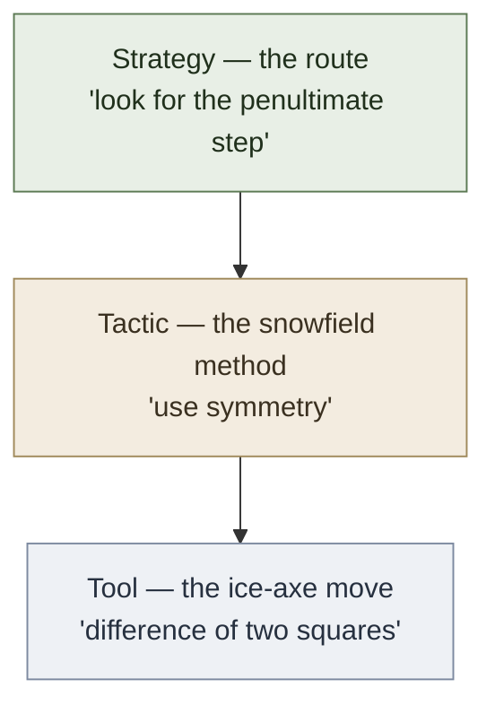

# Problem-Solving Three Levels — Strategy · Tactic · Tool

**Summary**: The decomposition of every problem-solving move into one of three escalating levels of abstraction. **Strategy** = high-level approach (which route to attempt); **Tactic** = mid-level method (how to negotiate a specific obstacle); **Tool** = specific technique applied at one spot. The named **[crux-move](./crux-move.md)** is the obstacle whose negotiation determines whether the whole route succeeds — it can live at any of the three levels. From Paul Zeitz's *The Art and Craft of Problem Solving* (see [zeitz-art-and-craft](./zeitz-art-and-craft.md)).

**Sources**:
- Paul Zeitz, *The Art and Craft of Problem Solving*, 3rd ed. (Wiley 2017), Ch 1.2 "The Three Levels of Problem Solving" — the mountaineering analogy and the worked Hungarian-1926 example.
- George Pólya, *How to Solve It* (1945) — Zeitz's cited ancestor; Pólya's 4 stages (understand · plan · carry out · look back) are the *containers* in which Zeitz's three levels operate during stages 2 and 3.
- [zeitz-art-and-craft](./zeitz-art-and-craft.md) — source-summary page registering the full ingest.

**Last updated**: 2026-05-24

---

## The mountaineering analogy (the picture the whole decomposition rides on)

You are standing at the base of a mountain. To reach the summit:

| Level | What you decide | Mountaineering example | Mathematical example |
|---|---|---|---|
| **Strategy** | The overall plan; *which* route to attempt | "We'll climb the south ridge after scouting from the east face" | "Look for a penultimate step; try numerical experimentation first" |
| **Tactic** | How to negotiate a *specific class* of obstacle | "For the snowfield, travel early while the snow is hard" | "Factor the algebraic expression"; "exploit the symmetry"; "apply the pigeonhole principle" |
| **Tool** | The specific technique applied at a single spot | "Set up a fixed rope and walk with ice-axes through the snowfield" | "Difference-of-two-squares factorization"; "the substitution u := x + 1/x" |

You **summarize a climb in strategic and tactical terms** ("we went up the south ridge via a difficult snowfield"). You do **not** summarize in tool terms ("we held hands and took our pants off for the river crossing") — even though that tool was essential, it doesn't carry the structure of the climb.

The same is true of a mathematical proof. When you describe the solution to someone else, you describe its strategy (the overall plan) and the tactics that powered each phase, not the specific identity-lookups and factorizations that filled in each tactical move.

## The crux move (where the breakthrough lives)

A **crux move** is the *single obstacle* whose negotiation determines whether the whole climb succeeds. Most of the climb may be easy walking; one 10-foot section of vertical ice is the crux. In mathematics, most of a proof may be routine; one insight — the *aha* — is the crux. Owner page: [crux-move](./crux-move.md).

**The crux move can live at any of the three levels.** Zeitz is explicit:

- **Strategic crux**: the breakthrough is the *plan itself*. (Example: realizing that the four-bug problem should be analyzed in a rotating reference frame. Once you have that, the rest is routine.)
- **Tactical crux**: the breakthrough is *which method to apply.* (Example: the Affirmative Action problem solved by "maximize balanced wires" — recognizing that the Extreme Principle fires here is the whole move.)
- **Tool crux**: the breakthrough is a *specific technique applied at one point*. (Example: the algebraic substitution u := x + 1/x in solving x⁴ + x³ + x² + x + 1 = 0 — the substitution is the crux.)

Some problems have multiple crux moves stacked. Some have none — the climb is just routine walking.

## How the levels map onto existing wiki frameworks

This three-level decomposition sits one layer below [problem-solving-os](./problem-solving-os.md) (the operating sequencer) and one layer above [universal-mathematical-tactics](./universal-mathematical-tactics.md) (the named tactic bundle). It is the *cognitive shape* of step 4 ("Solve") in [problem-solving-os](./problem-solving-os.md)'s 6-step pipeline.

| Three levels | [Problem-Solving OS](./problem-solving-os.md) step | [Great Work](./automaticity-and-reflex-training.md) operation |
|---|---|---|
| **Strategy** | Step 3 (Route) + early step 4 | Calcination + Dissolution + Separation (Perceive · Classify · Represent) |
| **Tactic** | Mid step 4 | Conjunction + Fermentation (Select · Execute) |
| **Tool** | Late step 4 | Distillation + Coagulation (Feedback · Automate) |

The crux move maps onto **Conjunction** in the Great Work pipeline (Select: which rule applies?) but can fire at any level. This is consistent with the [crux-move](./crux-move.md) page's claim that crux-resistance is *exactly the part of a problem that resists automation* — Conjunction is the Great Work's hardest operation to automate without producing fossilized errors.

## Why this matters for METER

Every step in a problem-solving session emits a METER event, and the event's *level tag* (S/T/X for Strategy/Tactic/Tool, X for crux) determines what the wiki should drill next:

| METER pattern | Interpretation | Drill prescription |
|---|---|---|
| Many S events, few T or X | User is over-planning, not executing | Force time-boxed strategy phase (max 5 min); push to tactic |
| Many T events, no X identified | User is moving through tactics without spotting the crux | Run [Red Queen](./red-queen-skill-gym.md) crux-detection drill |
| X events identified but coagulated | User has automated the crux; will plateau (see [ok-plateau](./ok-plateau.md)) | Foer metronome at crux: force-regress to Cognitive |
| No S events, immediate T-jumping | Tool fetishism; running familiar tactics without strategic justification | [problem-solving-os](./problem-solving-os.md) step 2 (classify) compliance |

These patterns are precisely what the wiki's existing [skill gym](./red-queen-skill-gym.md) telemetry was designed for; this page provides the level-tag vocabulary the telemetry has been missing.

## Worked example: the 1926 Hungarian contest problem

**Problem.** Prove that the product of four consecutive natural numbers cannot be the square of an integer.

Run the three levels:

1. **Strategy** (Zeitz's term: *orientation*): classify the problem (a "to prove" problem; about impossibility); identify the hypothesis (n is a natural number) and conclusion (n(n+1)(n+2)(n+3) is not a perfect square). Look at the *penultimate step* — what would yield the conclusion in one move? Nothing obvious. Switch strategy to *get your hands dirty*: compute f(n) for n = 1..5.

2. **Strategy → conjecture**: from the table, f(n) is always *one less than* a perfect square. The new strategy is to prove this conjecture. Penultimate step *now* obvious: a positive integer that is 1 less than a square is never a square (because gaps between consecutive squares exceed 1).

3. **Tactic**: prove f(n) + 1 = (something)². Apply the *factoring* tactic. Regroup: [n(n+3)][(n+1)(n+2)] + 1, observe both factors are "almost the same" (both equal n² + 3n + c).

4. **Tool**: introduce symmetry by substituting u := n² + 3n + 1, write the product as (u−1)(u+1) + 1 = u² − 1 + 1 = u². Apply *difference of two squares* (the tool). Conclude f(n) = u² − 1, done.

**The crux** is at step 2 — recognizing that the empirical pattern "always 1 less than a square" is what unlocks the proof. Once that's named, the rest is mechanical. The crux lives at the *strategic* level (it's a recognition, not a tactic or a tool).

This is what Zeitz means by "the problem **metamorphosed into an exercise** at the crux." See [crux-move](./crux-move.md) §"The metamorphosis rule."

## Routing rule (when to be at which level)

**Default escalation order**: Strategy → Tactic → Tool. Always start strategic.

| Symptom | Move to |
|---|---|
| Cannot get started; staring at the problem | **Strategy** — invoke the 4 [startup strategies](./zeitz-startup-strategies.md) |
| Have a plan but it's not making progress | **Tactic** — scan the 4 [universal tactics](./universal-mathematical-tactics.md) for fit |
| Have a tactic but each individual step is grinding | **Tool** — search for the specific technique (factoring identity, integration trick, etc.) |
| The proof is mostly mechanical but one spot is impossible | **Crux move identified** — log it; do not automate; see [crux-move](./crux-move.md) §"Crux-detection drill" |
| The user can solve this problem instantly | Not a problem; it's an *exercise* (Zeitz's distinction). No level required. |

The **anti-pattern** the wiki should detect: jumping straight to Tool ("I'll just try integration by parts") without Strategy or Tactic. This is the math-domain analog of [problem-solving-os](./problem-solving-os.md)'s "tool fetishism" failure mode.

## The 2×2 problem × level matrix (Zeitz's classification)

Zeitz cross-cuts the three levels with two problem-family axes:

| | **Recreational** | **Contest** | **Open-ended** |
|---|---|---|---|
| **To find** | Census-Taker problem; brain teasers | AHSME/AIME numerical answers | Open conjectures (find the formula) |
| **To prove** | Monk problem; pigeonhole classics | USAMO / IMO / Putnam essay questions | Open conjectures (prove the theorem) |

The three levels (Strategy/Tactic/Tool) apply *identically* across all six cells. The cell only determines what counts as "done": for "to find" problems, done = a specific answer with justification; for "to prove" problems, done = a complete argument.

## METER pass-floor for this page

| Test | Pass floor |
|---|---|
| Define Strategy in one sentence | <5 s |
| Define Tactic in one sentence | <5 s |
| Define Tool in one sentence | <5 s |
| Recall the mountaineering analogy mapping | <8 s |
| Given a worked solution, label each move S/T/X | <30 s, 80% accuracy |
| Define crux move | <5 s |
| Recall the escalation order (S → T → Tool) | <4 s |

## Mnemonic

A **mountaineer** in the Velvet Aeon Mode-Environment register: pale-gold dawn light, a single rope hanging from above. The climber is mid-pitch. **Three altitudes** are marked on the rock face by horizontal stone benches: *clouds*-strategy (top, the route-decision was made here at base camp), *snowfield*-tactic (middle, the snowfield-crossing method), *rope-pulley*-tool (base, the specific ice-axe technique). One **glass wall** halfway up — the **crux move** — has a single piton hammered into it. Above the crux: easy ground all the way to the summit. Below: the safety of the already-climbed route. The climber is touching the crux with one bare hand; the other holds the ice-axe. The Velvet Aeon preserve here is *sorrow-as-guidance* — the climber knows the crux is impossible and proceeds anyway.

## Memory checksum

- **3** levels (Strategy · Tactic · Tool) — Zeitz Ch 1.2
- **1** crux move per typical problem (range: 0 to several)
- **1** escalation order: Strategy → Tactic → Tool (always default-start strategic)
- **1** anti-pattern: tool-first (the most common failure)
- **2** Pólya containers (Plan + Carry-out — these are the Pólya stages within which the three levels operate)
- **1** metamorphosis rule (after the crux, the problem becomes an exercise)

If you can recite 3-1-1-1-2-1 from "Three Levels" within 60 seconds, the page is encoded.

## Related pages

- [zeitz-art-and-craft](./zeitz-art-and-craft.md) — the source-summary page
- [crux-move](./crux-move.md) — the named breakthrough concept
- [zeitz-startup-strategies](./zeitz-startup-strategies.md) — the 4 strategy-level unblockers
- [universal-mathematical-tactics](./universal-mathematical-tactics.md) — the 4 tactic-level universal moves
- [methods-of-mathematical-argument](./methods-of-mathematical-argument.md) — the tool-level proof-construction methods
- [problem-solving-os](./problem-solving-os.md) — sequencer; updated §"Zeitz three-level decomposition"
- [automaticity-and-reflex-training](./automaticity-and-reflex-training.md) — the Great Work pipeline this maps onto
- [ok-plateau](./ok-plateau.md) — the crux-move-as-Cognitive-anchor unlock
- [math-proof-glyph-grammar](./math-proof-glyph-grammar.md) — proof shape compression sister
- [representation-rules](./representation-rules.md) — recasts and representations live at the strategic level

---

## U — See (CAST)

1. Three-altitude mountainside (clouds-strategy, snowfield-tactic, rope-tool) with the climber at the crux glass wall
2. Edges: S → T → Tool escalation; crux can hover at any altitude

## D — Name (NEDF)

1. Three levels = Strategy / Tactic / Tool
2. Crux move = the one resistance point that decides the climb
3. Distinguisher: levels are *of abstraction*, not stages in time
4. Failure mode: jumping straight to Tool without Strategy

## F — Do (SPEAR)

1. New problem → state at Strategy level first (the route)
2. Plan in place → descend to Tactic (the snowfield method)
3. Tactic in place → descend to Tool (the specific technique)
4. Stuck → return to the level above; the crux is probably there

## B — Watch (HEART)

1. Strategy-only paralysis (over-planning, never executing)
2. Tool-first reflex (the most common math-student failure)
3. Crux misidentification (treating an easy step as the crux, missing the real one)
4. Coagulating at the crux (the [ok-plateau](./ok-plateau.md) connection)

## L — Predict (ORACLE)

1. New problem with no obvious tactic → predict a strategy-level reframe will be needed
2. Crux identified at strategy level → predict the rest is exercise

## R — Act (GRACE)

1. Read a problem → state which level you're at out loud
2. Stuck ≥ 10 min → escalate one level
3. Solved → label each move S/T/X for the [METER](./meter-overview.md) event
