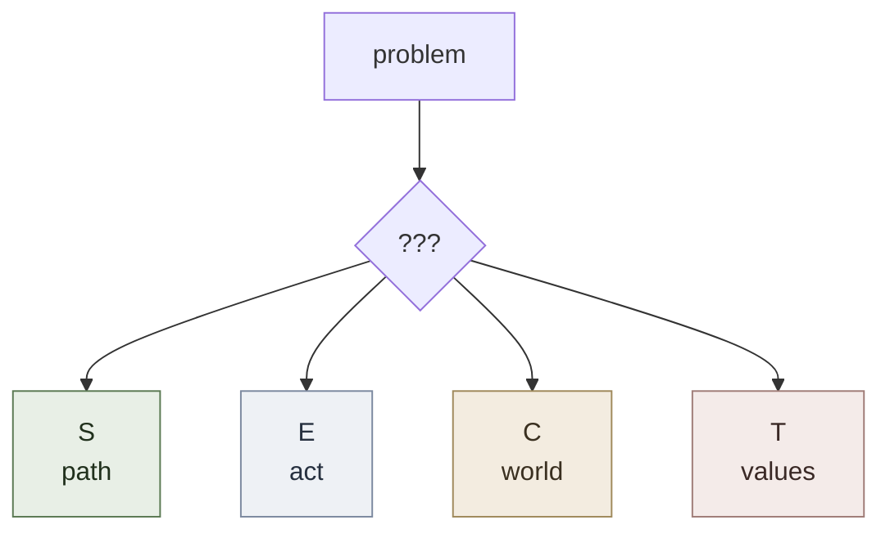
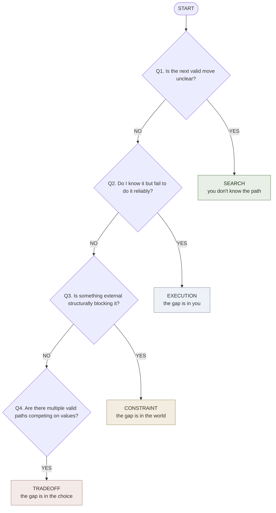

# Problem Type Classifier

**Summary**: A four-way diagnostic — **Search, Execution, Constraint, Tradeoff** — that identifies which kind of gap dominates a problem before any tool is chosen. Misclassification wastes the right tool on the wrong problem.

**Sources**: raw/01 Core_Memory/Problem Type Classifier.md

**Last updated**: 2026-05-07 (retrofit pass: applied [representation-rules](./representation-rules.md) 1+2+3+5+7+8)

---

## Glyph



A fork. Four branches. The classifier picks one — the rest of the system depends on getting this right.

## One-line

> Classify the dominant gap as Search (path), Execution (act), Constraint (world), or Tradeoff (values) — then route to the matching tool.

---

## Concrete example: "I want to write the book"

The same goal, classified four different ways depending on the dominant gap. Each calls for a different tool — using the wrong one wastes effort.

| Dominant gap | Symptom you'd hear | Tool that fits |
|---|---|---|
| **Search** | "I don't know how to structure it." | [frame-forge](./frame-forge.md), [NEDF](./nedf-overview.md), [CAST](./cast-overview.md) |
| **Execution** | "I know the structure but I keep avoiding the desk." | [attention-framework](./attention-framework.md), habit work, [SPEAR](./spear-overview.md) for the known procedure |
| **Constraint** | "I don't have two protected hours anywhere in my week." | [decision-kernel](./decision-kernel.md), dependency analysis, schedule surgery |
| **Tradeoff** | "Writing eats time I'd otherwise spend on income." | [decision-kernel](./decision-kernel.md), explicit value ranking, prediction log |

**Same goal. Different gap. Different fix.** The classification is the leverage point — *not* picking a tool, *not* working harder.

---

## The fast diagnostic (decision tree)

Apply the four questions in order. The first "yes" classifies the problem.



If all four are "no": there's no problem to classify yet. Either the issue is solved or you haven't named it concretely enough — re-read the situation.

---

## 2D placement of the four types

```p5 height=360
p.setup = () => {
  const w = Math.min(el.clientWidth || 600, 600);
  p.createCanvas(w, 360);
  p.noLoop();
};
p.draw = () => {
  const dark = p.isDark;
  p.background(dark ? 30 : 245);
  const ink = dark ? '#ECE4D3' : '#2B2620';
  const green = '#5c7a54', blue = '#7d8aa0', gold = '#a08a5c', rose = '#a07d78';
  const w = p.width, cx = w / 2, cy = 190;
  const halfW = Math.min(w * 0.36, 210), halfH = 120;

  p.stroke(ink); p.strokeWeight(1.5);
  p.line(cx, cy - halfH - 16, cx, cy + halfH + 16);
  p.line(cx - halfW - 16, cy, cx + halfW + 16, cy);
  const ah = 6;
  p.line(cx, cy - halfH - 16, cx - ah, cy - halfH - 16 + ah); p.line(cx, cy - halfH - 16, cx + ah, cy - halfH - 16 + ah);
  p.line(cx, cy + halfH + 16, cx - ah, cy + halfH + 16 - ah); p.line(cx, cy + halfH + 16, cx + ah, cy + halfH + 16 - ah);
  p.line(cx - halfW - 16, cy, cx - halfW - 16 + ah, cy - ah); p.line(cx - halfW - 16, cy, cx - halfW - 16 + ah, cy + ah);
  p.line(cx + halfW + 16, cy, cx + halfW + 16 - ah, cy - ah); p.line(cx + halfW + 16, cy, cx + halfW + 16 - ah, cy + ah);

  p.noStroke(); p.fill(ink); p.textSize(11); p.textStyle(p.ITALIC);
  p.textAlign(p.CENTER, p.BOTTOM); p.text('gap is INTERNAL (in you)', cx, cy - halfH - 22);
  p.textAlign(p.CENTER, p.TOP); p.text('gap is EXTERNAL (in world / among options)', cx, cy + halfH + 22);
  p.textAlign(p.LEFT, p.CENTER); p.text('one valid path', cx - halfW - 12, cy - 12);
  p.textAlign(p.RIGHT, p.CENTER); p.text('many valid paths', cx + halfW + 12, cy - 12);
  p.textStyle(p.NORMAL);

  const qx = halfW * 0.5, qy = halfH * 0.5;
  quad(cx - qx, cy - qy, 'EXECUTION', "can't act", blue);
  quad(cx + qx, cy - qy, 'SEARCH', "don't know path", green);
  quad(cx - qx, cy + qy, 'CONSTRAINT', 'world blocks', gold);
  quad(cx + qx, cy + qy, 'TRADEOFF', 'values disagree', rose);

  function quad(x, y, name, sub, col) {
    p.noStroke(); p.textAlign(p.CENTER, p.CENTER);
    p.fill(col); p.textStyle(p.BOLD); p.textSize(13); p.text(name, x, y - 8);
    p.fill(ink); p.textStyle(p.NORMAL); p.textSize(10.5); p.text('(' + sub + ')', x, y + 9);
  }
};
```

**Reading the grid**:
- Top half = the gap is in your knowledge or capacity
- Bottom half = the gap is outside you
- Left half = exactly one path is on the table
- Right half = multiple candidate paths exist

This is also the order of intervention cost: **Search** (cheap — read, frame) → **Execution** (medium — habits, attention) → **Constraint** (high — change the world) → **Tradeoff** (highest — change yourself, your values, or your bets).

---

## Symptom × bottleneck × tool table

| Type | Core question | Symptoms | Bottleneck | Best tools | Progress signal |
|---|---|---|---|---|---|
| **Search** | What move should I make? | Next step unclear, structure blurry, too many possibilities, missing facts | Weak framing, weak representation, missing prereqs, hidden uncertainty | [frame-forge](./frame-forge.md), [NEDF](./nedf-overview.md), [CAST](./cast-overview.md), [SPEAR](./spear-overview.md) | Search space shrinks; next move obvious |
| **Execution** | Why am I not doing what I already know? | Repeated avoidance, inconsistency, poor follow-through, collapse under pressure | Attention fragmentation, low energy, weak habits, emotional resistance, not yet automatic | SPEAR (automate the known procedure), [attention-framework](./attention-framework.md), habit building | Output regular, latency drops, reliability rises |
| **Constraint** | What makes this move infeasible? | Not enough time/money/energy, missing permission, missing prerequisites, hard external limits | Physical limits, institutional limits, dependency limits, sequencing limits | Constraint mapping, dependency analysis, [decision-kernel](./decision-kernel.md) | Real bottleneck is named, fake ones separated, feasible path appears |
| **Tradeoff** | Which cost am I willing to pay? | Two+ good options; conflict between speed, money, meaning, peace, growth, status; repeated indecision | Unclear values, ignored second-order effects, undefined downside, no reversibility distinction | Explicit value ranking, decision records, prediction logs, [decision-kernel](./decision-kernel.md) | Winning criterion explicit, choice stops looping, review conditions defined |

---

## Boundary set

### What this classifier is NOT

- Not a personality test — it classifies **the current problem**, not your style
- Not a permanent label — the same goal flips type as you progress (Search becomes Execution becomes Constraint as the path clarifies)
- Not mutually exclusive in real life — situations stack types; classify by the **dominant** one and re-classify when it shifts

### What breaks classification

- **Skipping the question** ("just start") — burns the wrong tool on the wrong gap
- **Stopping at Search** — most adults default to "I need to learn more" when the real gap is execution
- **Confusing constraint with execution** — "I have no time" is sometimes execution (you do, but waste it) and sometimes constraint (you genuinely don't)
- **Treating tradeoff as search** — looking for "the right answer" when the real task is choosing a value to optimize

### Adjacent but excluded (deliberate non-features)

- Does not tell you *how* to solve — only *which category*; handoff to type-specific tools is required
- Not a strategic planner — operates on one problem at a time
- Not a feeling diagnoser — classifies the structural gap, not your mood (use [PULSE](./pulse-overview.md) for state)

---

## Compression rule

```
No information gap  ≠  No problem
```

The Search problem disappearing only means the *Search* problem is over. Execution, Constraint, or Tradeoff may still remain. Difficulty does not require an information gap.

---

## One mental motion

> **Fork four fingers.** Hold up the fork in front of the problem and let the symptom point one finger. Whichever finger lights up *is* the type — don't second-guess across fingers.

If two fingers light up, classify the **dominant** one and re-classify after acting on it. The fork resets each cycle.

---

## Routing rules

1. Classify the dominant type **before** picking a tool
2. Use the smallest tool that fits the type
3. Do not use memory frameworks to solve a pure tradeoff problem
4. Do not use more theory when the bottleneck is execution
5. Do not treat a hard external limit as a knowledge gap

---

## Multi-resolution zoom

| Size | Representation |
|---|---|
| **Glyph** | Four-pronged fork (S/E/C/T) |
| **Line** | "Classify the dominant gap as Search, Execution, Constraint, or Tradeoff before picking a tool." |
| **Paragraph** | Four problem types: Search (path unknown), Execution (path known but unreliable), Constraint (world blocks), Tradeoff (multiple valid paths, competing values). Diagnose with the four questions in order; the first yes classifies. Each type has its own tool family — using the wrong tool on the wrong type is the most common failure. |
| **Page** | This page |

---

## Related pages

- [representation-rules](./representation-rules.md) — the rules this page was retrofitted against
- [problem-solving-os](./problem-solving-os.md) — the larger stack this classifier sits at the top of
- [problem-type-recognition-drill-ladder](./problem-type-recognition-drill-ladder.md) — drill ladder for training the classification reflex
- [problem-solving-maturity-levels](./problem-solving-maturity-levels.md) — six-level progression beyond classification
- [frame-forge](./frame-forge.md) — Search-problem tool
- [attention-framework](./attention-framework.md) — Execution-problem tool
- [decision-kernel](./decision-kernel.md) — Tradeoff and Constraint-problem tool
- [SPEAR](./spear-overview.md) — Execution automation
- [rapid-in-neural-os](./rapid-in-neural-os.md) — control loop above all of this


---

## U — See (CAST)
1. 4-way diagnostic for problem type
2. Search · Execution · Constraint · Tradeoff

## D — Name (NEDF)
1. Problem type classifier = 4-way diagnostic
2. Distinguisher: identifies dominant gap before tool choice
3. Failure mode: applying right tool to wrong problem class

## F — Do (SPEAR)
1. Problem → classify into 4 types
2. Pick method matching the dominant type

## B — Watch (HEART)
1. Misclassification
2. Mixing types without dominant

## L — Predict (ORACLE)
1. Class → predict toolset
2. Symptom → predict class

## R — Act (GRACE)
1. New problem → classify first
2. Stuck → re-classify