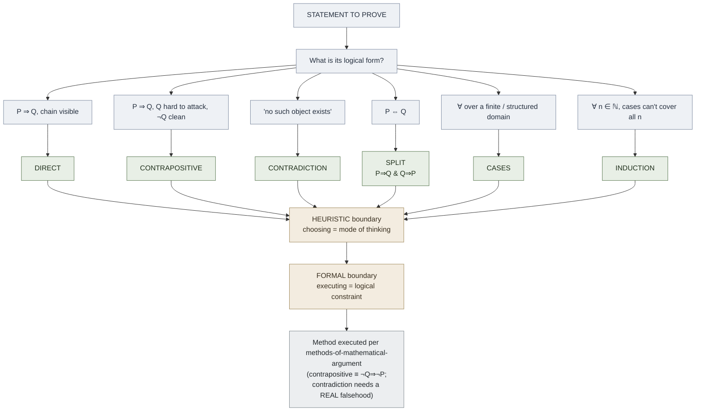

# Proof Strategy Selection

**Summary**: **Proof strategy selection** is the meta-layer that sits *above* the proof techniques themselves — the act of *choosing which proof method to attempt* by reading the [logical form](./picture-theory-of-language.md) of the statement to be proved. The methods it routes to are defined in [methods-of-mathematical-argument](./methods-of-mathematical-argument.md); this page is only about the routing decision, and about the load-bearing caveat that the routing is heuristic while the methods it selects carry formal correctness constraints.

**Sources**: dokumen.pub_introduction-to-proofs-and-proof-strategies-cambridge-mathematical-textbooks (Shay Fuchs, *Introduction to Proofs and Proof Strategies*, Cambridge 2023), Ch 3 "Informal Logic and Proof Strategies", esp. §3.6 "Proof Strategies".

**Last updated**: 2026-06-10.

---

## The core thesis: routing is heuristic, methods are not

Fuchs opens §3.6 by asking whether there is "a recipe that can be executed to generate a proof" the way there is an algorithm for solving a quadratic or finding an extreme value. His answer is blunt: "Unfortunately, no! In fact, I would rather say: *Fortunately*, no!" — because an algorithm for generating proofs would make mathematics "a mechanical and procedural field" stripped of its creative nature (source: ...introduction-to-proofs-and-proof-strategies...pdf).

What remains, in the absence of an algorithm, are *proof strategies*: "These strategies are not algorithms and cannot be applied blindly to create proofs. Instead, they can be seen as commonly used approaches, or **modes of thinking**." Crucially, Fuchs adds that "Choosing an appropriate strategy for proving a given statement can still be challenging" (source: ...introduction-to-proofs-and-proof-strategies...pdf). That sentence is this page's entire subject: the *choosing* step is itself a skill, distinct from executing any individual method.

This places proof strategy selection one level above [methods-of-mathematical-argument](./methods-of-mathematical-argument.md). That page owns the five techniques (direct deduction, proof by contrapositive, proof by contradiction, proof by cases, and the split of a biconditional into two implications) and how each is *executed*. This page owns only the upstream question — *given a statement, which of those do I reach for first?*

## The critical caveat: do not flatten methods into heuristics

The most important thing to keep straight: **the routing is a heuristic; the methods it routes to are not.** Choosing to *try* the contrapositive when a direct attack stalls is a heuristic move — there is no guarantee it will be easier, and you might back out and try something else. But once you commit, the contrapositive method carries a *formal* correctness constraint: an implication P ⇒ Q is provable via its contrapositive only because P ⇒ Q is **logically equivalent** to (¬Q) ⇒ (¬P) (source: ...introduction-to-proofs-and-proof-strategies...pdf). That equivalence is a theorem of logic, not a preference.

Likewise, proof by contradiction is *selected* heuristically (often when proving non-existence), but the method itself demands a *real* contradiction: you assume the negation of what must be proved, and you must "derive a contradiction, that is, ... a statement known to be false" — contradicting "anything that is known to be true, such as a definition, a previously established theorem, or the hypothesis" (source: ...introduction-to-proofs-and-proof-strategies...pdf). A "contradiction proof" that never actually lands on a false statement is not merely a poor strategy choice — it is an invalid proof.

So: **route with heuristics, execute with rigor.** Conflating the two — treating the proof methods themselves as soft heuristics that can be "applied blindly" — is exactly the error Fuchs warns against, and is the line this page draws.

## The form-to-strategy routing table

The selectable signal is the **logical form of the goal statement**. Fuchs notes that most statements can be regarded as implications P ⇒ Q, where P is the hypothesis and Q is what must be proved (source: ...introduction-to-proofs-and-proof-strategies...pdf). The form of that statement, and of Q in particular, suggests a first method to attempt.

| If the statement's form is... | The form-signal is... | Suggested first strategy | Owner of the method |
|---|---|---|---|
| P ⇒ Q with a visible chain from hypothesis to conclusion | the [penultimate step](./zeitz-startup-strategies.md) is reachable directly | **Direct deduction** (default first try) | [methods-of-mathematical-argument](./methods-of-mathematical-argument.md) |
| P ⇒ Q where Q is hard to attack but ¬Q is concrete | the conclusion resists a forward chain | **Contrapositive** — prove (¬Q) ⇒ (¬P) | [methods-of-mathematical-argument](./methods-of-mathematical-argument.md) |
| "no such object exists" / "there are no X with property Y" | an existence-*negation* | **Contradiction** — assume one exists, derive a falsehood | [methods-of-mathematical-argument](./methods-of-mathematical-argument.md) |
| P ⇔ Q (an "if and only if" statement) | a biconditional | **Split into two implications**: prove P ⇒ Q and Q ⇒ P separately | [methods-of-mathematical-argument](./methods-of-mathematical-argument.md) |
| a claim universally quantified over a finite or structured domain | a small, enumerable set of situations | **Cases** — exhaust the possibilities | [methods-of-mathematical-argument](./methods-of-mathematical-argument.md) |
| "for all natural numbers n, P(n)" where cases cannot cover all n | an infinite, integer-indexed domain | **Induction** — base case + inductive step | [methods-of-mathematical-argument](./methods-of-mathematical-argument.md) |

Read the table top-to-bottom as a default order of attempt, not as a lookup that fires exactly once. Fuchs's worked examples in §3.6 show why each signal is reliable:

- **Direct first.** His divisibility-test example (sum of digits divisible by 3 ⇒ number divisible by 3) chains straight from hypothesis to conclusion with no detour (source: ...introduction-to-proofs-and-proof-strategies...pdf).
- **Contrapositive when ¬Q is friendlier.** Proving f(a) ≠ f(b) from a ≠ b is awkward directly (you must manipulate an *inequality*); the contrapositive turns it into "if f(a) = f(b) then a = b", which is an *equation* to simplify — "a process that we are well familiar with" (source: ...introduction-to-proofs-and-proof-strategies...pdf). The form-signal here is literally "the negation is an equality, not an inequality."
- **Contradiction for non-existence.** "A natural way to prove, in mathematics, that something *does not exist*, is to assume that it does, and derive a contradiction." Fuchs runs this on: 3x⁵ − 7x² + 1 = 0 has *no rational* solutions; the corner-removed checkerboard *cannot* be tiled by dominoes; there are *no* naturals with x² − y² = 1; and Euclid's *infinitude* of primes (assume finitely many, derive a divisibility contradiction) (source: ...introduction-to-proofs-and-proof-strategies...pdf).
- **Biconditional → two implications.** "Some mathematical statements are 'if-and-only-if' statements, but these can be naturally regarded as two implications, as P ⇔ Q is logically equivalent to (P ⇒ Q) ∧ (Q ⇒ P)" (source: ...introduction-to-proofs-and-proof-strategies...pdf). The split is mandated by the equivalence, not chosen for convenience.

The two bottom rows — **cases** and **induction** — are the standard responses to the two flavors of "for all" that Fuchs's logic chapter sets up: a *finite/structured* universal yields to exhaustion by cases, while an *infinite, naturally-indexed* universal (where no finite case-split can reach every n) is the home ground of mathematical induction, which Fuchs develops in detail in his next chapter.

## How this wires into the problem-solving stack

Proof strategy selection is the proof-specific instance of the **choose-method gate** in [problem-solving-os](./problem-solving-os.md). In that operating stack, classification and routing precede execution; selecting a proof strategy from the form of a statement is precisely the "route" decision applied to a *to-prove* problem, just before the solve phase where [methods-of-mathematical-argument](./methods-of-mathematical-argument.md) constructs the actual argument.

It also instantiates the strategy/tactic distinction from [zeitz-art-and-craft](./zeitz-art-and-craft.md). In Zeitz's mountaineering frame, deciding *to try contradiction* is a **strategy-level** move (which route up the mountain), while the line-by-line construction of the contradiction is **tactic/tool-level** work. Proof strategy selection lives at Zeitz's strategy altitude; the methods it picks live below it. The two pages are complementary lenses on the same gap: Zeitz names the levels in general; Fuchs supplies the proof-specific routing signals.

A subtle but important difference from Zeitz: Fuchs's selection is keyed on **logical form** (the shape of the quantifiers and connectives in the goal), whereas Zeitz's universal tactics — see [universal-mathematical-tactics](./universal-mathematical-tactics.md) — are keyed on **mathematical structure** (symmetry, extremes, invariants). Both are routing heuristics; they read different features of the problem. A complete solver runs both: form-routing to pick the proof method, structure-routing to find the [crux-move](./crux-move.md) inside it.

## Visual

The decision tree is heuristic above the dashed line and formal below it. If the first branch stalls, back up and take the next-most-promising branch — that backtracking is allowed precisely because the routing layer is heuristic, never an algorithm (source: ...introduction-to-proofs-and-proof-strategies...pdf).

## Mnemonic

A **railway signalman** in a glass switching-tower reads the *shape* of each incoming train and throws one of six levers to route it onto a track. The trains are shaped like their statements: a straight train (**direct**), a train that can only enter the yard backwards (**contrapositive**), a ghost-train labelled "NO SUCH TRAIN" that he proves doesn't exist by clearing the whole yard and showing the schedule breaks (**contradiction**), a double-engined train that must be split and sent down two parallel tracks (**biconditional**), a short train with a countable number of carriages he can check one by one (**cases**), and an *infinitely long* train where he tips the first carriage and each knocks the next (**induction**).

The signalman's *choice of lever* is a judgment call — he can throw the wrong one and re-route. But **the rails themselves are welded steel**: once a train is on the contrapositive track, that track is the logically-equivalent loop ¬Q⇒¬P, and once on the contradiction track it *must* terminate at a real broken signal. The signalman is heuristic; the rails are formal.

## Checksum

- **6** form-signals routed: direct · contrapositive · contradiction · biconditional-split · cases · induction
- **1** boundary: routing is heuristic ("modes of thinking") / methods are formal (logical equivalence, real contradiction)
- **0** algorithms for generating proofs — Fuchs: "Fortunately, no!"
- **2** formal constraints to never flatten: contrapositive ≡ (¬Q⇒¬P); contradiction must derive a statement *known to be false*
- **1** owner for the methods themselves: [methods-of-mathematical-argument](./methods-of-mathematical-argument.md) — this page never defines them, only selects among them

If you can recite 6-1-0-2-1 — six signals, one heuristic/formal boundary, zero proof-generating algorithms, two non-negotiable formal constraints, one owner of the methods — the page is encoded.

## Related pages

- [methods-of-mathematical-argument](./methods-of-mathematical-argument.md) — owner of the proof techniques this page routes to; defines direct/contrapositive/contradiction/cases/induction. This page is strictly the selection layer above it.
- [problem-solving-os](./problem-solving-os.md) — the operating stack whose choose-method/route gate this page instantiates for to-prove problems.
- [zeitz-art-and-craft](./zeitz-art-and-craft.md) — the strategy/tactic distinction; selecting a proof method is a strategy-level move in Zeitz's mountaineering frame.
- [universal-mathematical-tactics](./universal-mathematical-tactics.md) — the structure-keyed sibling of this form-keyed router; both are heuristics reading different features.
- [math-proof-glyph-grammar](./math-proof-glyph-grammar.md) — once a method is selected and executed, this page compresses the resulting proof's shape.
- [validity-vs-soundness](./validity-vs-soundness.md) — what the executed proof must achieve regardless of which strategy selected it.
