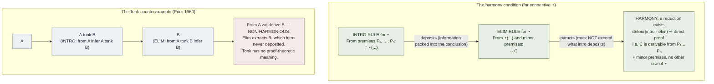

# Proof-Theoretic Semantics

**Summary**: The philosophical program — initiated by Dummett, developed by Prawitz, formalized in the [normalization theorem](./normalization-theorem.md) tradition — that holds *the meaning of a logical constant is given by its rules of use* rather than by truth-conditions in a model. The intro rules of [natural deduction](./natural-deduction.md) *define* the connective (what counts as evidence for it); the elim rules are then constrained by **harmony** — they must extract no more than the intro rules deposit. The sub-formula property is the formal-logic embodiment of *meaning-in-use*: a normal proof shows the connective's meaning *operationally*, not via reference to a model. Named explicitly in Mancosu et al.'s Preface as a payoff of the structural-proof-theory chapters.

**Sources**:
- [Mancosu, Galvan, Zach (2021)](./proof-theory-mancosu-galvan-zach.md) Preface (philosophical payoffs section) + Ch 4 (normalization as the formal vehicle).
- Dummett, M. (1973) "The philosophical basis of intuitionistic logic," in *Truth and Other Enigmas* (1978).
- Dummett, M. (1991) *The Logical Basis of Metaphysics.* Harvard UP. (The canonical articulation.)
- Prawitz, D. (1971) "Ideas and results in proof theory," in *Proceedings of the Second Scandinavian Logic Symposium*: 235-307.
- Prawitz, D. (1973) "Towards a foundation of a general proof theory," in *Logic, Methodology and Philosophy of Science IV*: 225-250.
- Schroeder-Heister, P. (2018) "Proof-theoretic semantics," *Stanford Encyclopedia of Philosophy.*

**Last updated**: 2026-05-27

---

## Unlocks (lead, not footer)

1. **Harmony × [GRACE](./grace-overview.md) discipline × intro-elim duality.** Harmony says: the elim rule for ⋆ must not extract more than the intro rule deposits. GRACE says: *the Read sets up exactly what the Alternatives need to choose between.* Same shape. **The formal-logic ancestor of every wiki *minimum-sufficient-information* discipline.** GRACE's Ground/Read step is the social-pragmatic instance; harmony is the formal-logic statement.

2. **Meaning-in-use × [TLP picture theory](./picture-theory-of-language.md) × [show-vs-say](./show-vs-say.md).** TLP early Wittgenstein: meaning is given by structure, picture-theoretically. Proof-theoretic semantics (Dummett-Prawitz, late 20th century): meaning is given by *use*, where use = the rules. **Both are anti-truth-conditional.** PT semantics is in a sense TLP's logical-positivist successor — but where TLP says meaning is *static* (picture matches fact), PT semantics says meaning is *dynamic* (rules govern derivation). The wiki's encoder paradigm is dynamic in the PT-semantics sense: a concept's meaning is what its NEDF slots license you to do with it.

3. **The Tonk objection × wiki's "named-protocol" discipline.** Prior 1960 proposed a fake connective "tonk" with ∨I-style intro (from A infer A tonk B) and ∧E-style elim (from A tonk B infer B). The result: trivializes the system (from A you derive B). The lesson: **rules of use alone don't constitute meaning if harmony fails.** The wiki's analog: a named protocol that has the right *introduction* shape (sounds plausible) without the right *elimination* shape (doesn't constrain what follows) trivializes the wiki's claims. **First proof-theoretic grounding of the wiki's "every protocol must be falsifiable" rule.**

## Mnemonic

**HARM-D** = *Harmony-required · Anti-truth-conditional · Rules-define · Meaning-in-use · Dummett-Prawitz.*

Reads as "harmony" — what proof-theoretic semantics demands of every logical (or operational) constant.

## Memory checksum

If you can answer these in <60 s each from memory, the page is encoded:

1. State the **core claim** of proof-theoretic semantics. (*The meaning of a logical constant is determined by its rules of use — specifically, its introduction rule in [natural deduction](./natural-deduction.md). The elimination rule is justified by being **harmonious** with the introduction rule. There is no prior, separate, truth-conditional notion of meaning that the rules must "match"; the rules are themselves the meaning.*)
2. Define **harmony** (Dummett-Prawitz). (*The elimination rule for ⋆ extracts no more than the introduction rule for ⋆ deposits. Formally: any detour (intro then elim on the same formula) can be reduced — the elim's conclusion is derivable from the intro's premises. This is exactly the **detour-reducibility** condition that powers the [normalization-theorem](./normalization-theorem.md).*)
3. State the **Tonk objection** (Prior 1960). (*Tonk is a hypothetical connective with intro rule "from A infer A tonk B" and elim rule "from A tonk B infer B." Combining these: from A infer B for any B. Trivializes the system. Lesson: harmony is not automatic — a non-harmonious rule pair makes the connective *meaningless* in the proof-theoretic-semantics sense.*)
4. Name **two responses** to the Tonk objection. (*(i) Belnap 1962: a new connective must yield a **conservative extension** — its rules must not let us prove old-theorems we couldn't before. (ii) Dummett-Prawitz: introduce harmony as a *separate criterion* — a connective's rules are meaning-conferring only if they are harmonious. Both responses converge: tonk fails because it's non-conservative AND non-harmonious.*)
5. Why is **intuitionistic logic privileged** in proof-theoretic semantics? (*The intuitionistic introduction rules have a clean BHK reading (a proof of A∨B is a tagged proof of A or B; a proof of ∃x A(x) gives a witness). Classical logic's negation-based rules (classical absurdity / DNE) don't have this constructive content. PT semantics is *natively* intuitionistic; making sense of classical logic requires additional moves (Dummett's anti-realism, or modal-logic embeddings, or Krivine's call/cc reading).*)

## Visual — the harmony condition

The harmony condition is the formal-logic ancestor of every *minimum-sufficient-information* discipline in the wiki — protocols must not promise more than their premises support.

---

## What proof-theoretic semantics is

The classical theory of meaning (Tarski, Frege, model theory): a formula's meaning is its *truth-conditions* — the set of models in which it holds. The connectives are defined truth-functionally: A ∨ B is true iff A is true or B is true; ∃x A(x) is true iff some assignment to x makes A(x) true. Inference rules are *justified* by being truth-preserving.

Proof-theoretic semantics inverts this. **A formula's meaning is its proofs.** The connectives are defined *inferentially*: A ∨ B *is* the type of objects you can construct by tagged-deposition of either an A-proof or a B-proof; ∃x A(x) *is* the type of (witness, evidence) pairs. Truth-conditions, if they exist, are *derived* from the proof-conditions — not the other way around.

The motivating slogan (Dummett): **to know the meaning of an expression is to know how to use it**. For logical constants, "use" = the introduction rules. The elimination rules are *constrained* by the introduction rules via harmony.

## Dummett's argument

Dummett's argument for proof-theoretic semantics goes through *anti-realism*. Classical realism (the truth-conditional account) says: every well-formed statement has a determinate truth-value, even ones we have no way of knowing. Dummett argues: this is *unintelligible* if meaning is what you learn when you learn the language — you can't learn an unknowable truth-condition.

Anti-realism: meaning must be *manifestable*. What you do with a statement is what its meaning is. For logical statements, that's the rules. Result: intuitionistic logic (which has manifestable constructive content) is the *correct* logic; classical logic is *suspect* (its excluded middle and double-negation rules don't have manifestable content).

The wiki doesn't take sides on this metaphysical debate. But it adopts the **operational** consequence: meaning is given by use, where use is what the wiki's concept pages *do* (their rules, their drills, their METER metrics). This is anti-realism at the wiki-architecture layer regardless of one's metaphysics.

## Harmony in detail

Dummett's harmony criterion has *two* forms (Prawitz further refined them):

### Intrinsic harmony (Dummett)

The intro and elim rules for ⋆ are intrinsically harmonious iff every detour (intro then elim on the same formula) can be reduced — the elim's conclusion is derivable from the intro's premises using only minor premises and no further use of ⋆.

This is exactly the detour-reducibility condition that the [normalization-theorem](./normalization-theorem.md) establishes.

### Stability (Prawitz)

A stronger condition: the elim rule is the *strongest* rule that can be justified by the intro rule, AND the intro rule is the *weakest* rule for which the elim rule can be justified. This rules out both *over-strong* elim (extracts more than intro deposits — non-harmonious) and *over-strong* intro (deposits more than elim extracts — *fails the inversion principle*).

For standard intuitionistic connectives (∧, ∨, →, ⊥, ∀, ∃), the Gentzen-Prawitz rules are stable. For classical absurdity (NK's RAA rule), the rule pair is *not* stable in Prawitz's sense — which is why classical logic is *less natural* in PT semantics.

## The Tonk problem (Prior 1960)

Prior 1960 ("The runabout inference ticket") proposed:

> "If we may introduce a new connective tonk by stipulating its rules of use, what stops us from making tonk produce any inference we like?"

Tonk:
- **Intro**: from A, infer A tonk B (any B).
- **Elim**: from A tonk B, infer B.

Combined: from A infer B for any B. **A free ticket to any inference.** Logic collapses.

Belnap 1962 responded: tonk's rules don't define a *conservative extension* — they let us derive new theorems in the connective-free fragment. A genuine logical constant's rules must extend the system *conservatively* (new theorems only mention the new constant).

Dummett-Prawitz responded: tonk's rules fail *harmony* — the elim extracts more than the intro deposits. A genuine connective's rules must be harmonious.

These two criteria are *equivalent* for natural deduction: harmonious rules give conservative extensions. So Tonk fails both.

The wiki's analog: every named protocol in the glossary must be *constrained* — its "what you do with it" cannot produce more than its "what triggers it" supports. A protocol that fires on weak triggers and produces strong conclusions is a *Tonk-protocol* and must be rejected. This is the formal-logic ancestor of the wiki's "no parallel definitions, no overclaim" lint rule.

## Beyond logic — the wiki application

Proof-theoretic semantics generalizes beyond logical connectives:

### NEDF as PT-semantics for concepts

[NEDF](./nedf-overview.md) cards say a concept's meaning is given by its four slots — Name-hook, Essence, Distinguisher, Failure. The slots are the *rules of use* for the concept. The discipline is exactly PT-semantics: the meaning is the slot contents, not some prior truth-conditional referent.

The harmony analog: the Failure slot must extract no more than the Essence and Distinguisher deposit. A Failure that claims "use this concept incorrectly in any way" extracts more than the concept's positive description supports — Tonk-like failure.

### GRACE as PT-semantics for social moves

[GRACE](./grace-overview.md) cards say a social move's meaning is given by its Read, Alternatives, Choose, Exit slots. The Read deposits; the Choose extracts. Harmony: the Choose must not extract a social commitment the Read didn't license.

### METER as PT-semantics for measurement

[METER](./meter-overview.md) says a measurement's meaning is given by its emission rule (what triggers it) and its consumption rule (how it enters reports). Harmony: a report cannot rely on measurements that the emission rule didn't actually fire.

The wiki's whole architecture is implicitly proof-theoretic-semantic. This page makes it explicit.

## Limits and contested ground

- **Classical logic's status**: PT semantics is most natural for intuitionistic logic. Making sense of classical absurdity, excluded middle, or double-negation elimination requires additional moves. Dummett's reading: classical logic is *philosophically suspect*. Others (Read, Murzi): classical logic can be given a PT-semantic reading via specific harmony-restoring tricks. Contested.

- **Negation**: ¬A is usually defined as A → ⊥, putting all the work into ⊥. But ⊥'s intro and elim are *asymmetric* (no intro rule; ⊥-elim allows anything). This is a *primitive falsity* concession in PT semantics. Some PT-semanticists reject it; others accept it as a structural exception.

- **Higher-order logic and set theory**: PT semantics works cleanly for first-order intuitionistic logic. Higher-order systems have non-harmonious comprehension principles in general; full set theory is *deeply* non-harmonious. PT-semanticists must restrict to predicative fragments (which is part of why Schütte / Pohlers / Rathjen proof theory is largely predicative).

## Connection to the wiki

- **[NEDF](./nedf-overview.md) · [GRACE](./grace-overview.md) · [METER](./meter-overview.md)**: all of these are PT-semantic at the wiki layer. This page is their formal-logic ancestor.
- **[show-vs-say](./show-vs-say.md) · [picture-theory-of-language](./picture-theory-of-language.md)**: TLP says meaning is shown by structure; PT semantics says meaning is shown by *rules of use*. The wiki holds both — TLP for the *static* layer (the encoding shape), PT semantics for the *dynamic* layer (what you can do with the encoding).
- **[Memory Paradox](./memory-paradox.md)**: take seriously enough to use, hold lightly enough to revise. PT semantics is *take the rules seriously* (they ARE the meaning); the Memory Paradox is *hold lightly enough to revise the rules when use evolves*. Both compatible.
- **Wiki's lint discipline**: harmony forbids Tonk-style rules. The lint forbids parallel definitions and overclaim. Same shape.

## Related pages

- [proof-theory-mancosu-galvan-zach](./proof-theory-mancosu-galvan-zach.md) — source textbook (Preface)
- [normalization-theorem](./normalization-theorem.md) — the formal vehicle of harmony
- [sub-formula-property](./sub-formula-property.md) — the structural payoff
- [natural-deduction](./natural-deduction.md) — the calculus PT semantics operates over
- [show-vs-say](./show-vs-say.md) · [picture-theory-of-language](./picture-theory-of-language.md) — TLP ancestor (static-meaning version)
- [nedf-overview](./nedf-overview.md) · [grace-overview](./grace-overview.md) · [meter-overview](./meter-overview.md) — wiki-layer instances
- [godel-gentzen-translation](./godel-gentzen-translation.md) — embeds classical into intuitionistic; partially answers the classical-status question
- [godels-incompleteness](./godels-incompleteness.md) — limits PT semantics' applicability to strong systems
- [bridge-load](./bridge-load.md) — analogy-based meaning at the wiki layer; PT-semantic in structure
- [memory-paradox](./memory-paradox.md) — calibration meta-principle compatible with PT semantics
- [glossary](./glossary.md) — Logic layer registrations
