# Mancosu, Galvan, Zach — An Introduction to Proof Theory

**Summary**: Paolo Mancosu, Sergio Galvan, and Richard Zach's *An Introduction to Proof Theory: Normalization, Cut-Elimination, and Consistency Proofs* (Oxford University Press 2021, ISBN 978-0-19-289593-6, 431 pp). The first elementary English textbook that covers BOTH structural proof theory (axiomatic calculi, natural deduction, sequent calculus, [normalization](./normalization-theorem.md), [cut-elimination](./cut-elimination-hauptsatz.md), mid-sequent / Herbrand) AND ordinal proof theory ([ε₀](./epsilon-zero-and-ordinal-induction.md), ordinal notations, Gentzen's [consistency proof for PA](./consistency-of-peano-arithmetic.md)) without assuming set theory. The wiki's authoritative source for the *metalogic tier* of the [logic-atomic-design](./logic-atomic-design.md) hub — the layer that sits above Copi's symbolic logic and below Gödel's full incompleteness machinery.

**Sources**:
- Paolo Mancosu, Sergio Galvan, Richard Zach. *An Introduction to Proof Theory: Normalization, Cut-Elimination, and Consistency Proofs*. Oxford University Press 2021. 431 pp. ISBN-13 978-0-19-289593-6 (hbk) / 978-0-19-289594-3 (pbk). DOI: 10.1093/oso/9780192895936.001.0001. Source PDF tagged in TagManager as `raw,clipping,meta-knowledge,math,book,pdf,ingested`; extracts at `.tmp/proof-theory-pp*.txt`.
- The book's chapter sequence ([Hilbert's program](./hilberts-program.md) → axiomatic calculi → natural deduction → normalization → sequent calculus → cut-elimination → consistency of PA → ε₀ → consistency continued) maps Gentzen's 1933–1938 papers in pedagogical order, "never deviating much from Gentzen's choice of systems and style of proof" (Preface).

**Last updated**: 2026-05-27

---

## Unlocks (lead, not footer)

1. **Sub-formula property × NEDF Distinguisher × `feedback_visual_per_concept` × [show-vs-say](./show-vs-say.md).** In a normal natural-deduction proof of A, every formula that appears is a sub-formula of A or of an open assumption. This is the *formal logic* version of the encoder discipline that NEDF cards rest on — the Distinguisher narrows to exactly what's load-bearing in A. [TLP picture-theory](./picture-theory-of-language.md) says propositions show their logical form; [normalization](./normalization-theorem.md) says a normal proof shows *exactly* what A requires, no detour-lemmas. The encoder paradigm has its formal home. Owner: [sub-formula-property](./sub-formula-property.md).

2. **[Cut-elimination](./cut-elimination-hauptsatz.md) × wiki retrieval pipeline × [FRAME FORGE Distill](./frame-forge.md) × `/lint` audit.** A cut is a lemma — a detour formula introduced and then eliminated. Cut-elimination produces a *direct* proof using only sub-formulas of the goal. This is structurally what FRAME FORGE Distill + the morning-queue retrieval pipeline + the `/lint` audit do: strip detour-lemmas, surface load-bearing material directly. **First proof-theoretic grounding of the wiki's "directness" discipline.**

3. **[ε₀](./epsilon-zero-and-ordinal-induction.md) × [OK Plateau](./ok-plateau.md) × [skill-progression-stages](./skill-progression-stages.md).** ε₀ is the limit of the tower ω, ω^ω, ω^ω^ω, … — a definable ceiling that no finite ordinal exponentiation crosses. PA proves induction up to every α < ε₀ but cannot prove ε₀ is well-ordered ([Gentzen 1936](./consistency-of-peano-arithmetic.md)). This is the formal-logic twin of the OK Plateau / [self-image](./self-image.md) ceiling: a finite procedure has a definable ceiling; crossing it requires the next ordinal layer (next paradigm, next self-image). Same mechanism, two layers.

4. **[Gödel-Gentzen double-negation translation](./godel-gentzen-translation.md) × [ANTs counter](./ants-and-lies-of-learning.md) / Burns-Beck cognitive distortion countering.** Classical A translates to intuitionistic ¬¬A — provable iff classically provable, but constructively weaker (no witness extracted). This is the structure of effective ANT-countering: when *"I am competent"* is unreachable, *"It's not the case that I'm not competent"* is reachable and defeats the ANT without overclaiming. **Constructive vs classical reasoning in cognition.**

5. **[ND assumption-discharge](./natural-deduction.md) × i-utterance-protocol / SHIELD.** ND's discharge mechanism — reason from assumption A, then close A out when deriving A→B — is the same structural move as I-utterance's E-F-R (the Event is *assumed*; the Request lands independent of the assumption) and SHIELD's *interpret-shielded* (receive A as discharged-already). Production-reception grammar pair gains a formal-logic ancestor.

6. **Mancosu-Galvan-Zach × [logic-atomic-design](./logic-atomic-design.md) — metalogic tier.** Logic Atomic Design currently registers atoms ([premise](./argument-anatomy.md), term, predicate), molecules (validity-tests, syllogisms), organisms (Copi pipelines). Mancosu adds a **proof-theoretic atom layer**: inference-rule atoms (intro/elim pairs), derivation-tree organisms, normalization-as-pipeline, cut-elimination-as-pipeline, ε₀-ordinal-induction-as-organism. **Extends the 4th atomic-design hub one tier deeper.**

7. **The intro/elim duality × proof-theoretic harmony × [GRACE](./grace-overview.md).** Every ND connective has exactly an intro rule and an elim rule, and they must be *harmonious* — the elim must use no more than the intro deposits. This is the formal version of GRACE's discipline ("the read sets up exactly what the alternatives need") and the philosophical home of [proof-theoretic-semantics](./proof-theoretic-semantics.md) (Dummett, Prawitz) — name-checked in the book's preface as a payoff.

Candidate (registered, not promoted):

8. **Mid-sequent / Herbrand's theorem × wiki [recognition-gym pattern](./red-queen-skill-gym.md).** Herbrand finitely-bounds the witnesses any provable ∃-statement needs; the recognition-gym's "60-s budget" has the same finitary-bound shape. Plausible but no instance built yet.

9. **Gentzen's consistency reduction × wiki audit termination.** The proof shows a reduction procedure terminates by ordinal induction; the wiki's `/lint` pass terminates iff every concept page's claims reduce to glossary-registered atoms. Structurally identical termination argument. Candidate because the wiki's lint doesn't yet *formalize* its termination.

## Mnemonic

**HALCEPO** = *Hilbert · Axiomatic · Logical (natural deduction) · Cut-elimination · ε₀ · Peano · Ordinals*.

Plays as *"halt-and-cope"* — the proof-theoretic project ends with finitary-relative-to-ε₀ consistency proofs that "halt and cope" with Gödel's verdict that strict-finitism alone won't do.

## Memory checksum

If you can answer these in <60 s each from memory, the page is encoded:

1. State [Hilbert's program](./hilberts-program.md) in one sentence and name what shut its strict form. (*Consistency of infinitary mathematics is to be proved by finitary metamathematics; [Gödel's second incompleteness theorem](./godels-incompleteness.md) 1931 showed any system that contains arithmetic cannot prove its own consistency by means formalizable within itself.*)

2. State the **introduction-elimination duality** for natural deduction and the canonical "detour." (*Every connective has one intro and one elim rule; the elim must not extract more than the intro deposits — "harmony." A **detour** is an intro followed immediately by elim on the same formula.*)

3. State the [**sub-formula property**](./sub-formula-property.md) and why it matters. (*In a normal NJ proof of A, every formula appearing is a sub-formula of A or of an open assumption. Matters because: (i) decidability of propositional fragment, (ii) consistency follows by inspection, (iii) gives [TLP show-vs-say](./show-vs-say.md) a formal home.*)

4. State **Gentzen's Hauptsatz** and what cut is. (*Hauptsatz: every LK / LJ proof can be transformed into a cut-free proof. A **cut** is a sequent rule that introduces a formula C in the conclusion via Γ⊢Δ,C and C,Π⊢Λ giving Γ,Π⊢Δ,Λ — the formula C is then eliminated. Cuts encode lemmas / abbreviation.*)

5. What is **ε₀** and what is its role in Gentzen's [consistency proof](./consistency-of-peano-arithmetic.md)? (*ε₀ = limit of ω, ω^ω, ω^ω^ω, … = least ordinal α with ω^α = α. Gentzen 1936 proves consistency of PA using induction along well-ordered ordinal notations < ε₀. PA cannot prove ε₀ is well-ordered.*)

## Visual — the proof-theory pipeline

```mermaid
graph TD
  classDef root fill:#eef1f5,stroke:#7d8aa0,color:#26303f;
  classDef structural fill:#e8efe6,stroke:#5c7a54,color:#20301c;
  classDef ordinal fill:#f3ece0,stroke:#a08a5c,color:#3a3020;
  classDef dual fill:#eceef0,stroke:#808a90,color:#24292c;
  classDef found fill:#f4ebe9,stroke:#a07d78,color:#3a2926;

  ROOT["Mancosu · Galvan · Zach — Proof Theory (2021)<br/>431 pp · 9 chapters"]

  ROOT --> STRUCT["STRUCTURAL (Part I, Ch 1-6)<br/>&#9671; axiomatic calculi (M₀/J₀/K₀)<br/>&#9671; natural deduction (NM/NJ/NK)<br/>&#9671; NORMALIZATION — Prawitz 1965<br/>&#9671; sub-formula property<br/>&#9671; sequent calculus (LJ/LK)<br/>&#9671; CUT-ELIMINATION — Gentzen 1935<br/>&#9671; Herbrand / mid-sequent"]

  ROOT --> ORD["ORDINAL (Part II, Ch 7-9)<br/>&#9671; ε₀ + ordinal notations<br/>&#9671; well-foundedness<br/>&#9671; Goodstein sequences<br/>&#9671; ordinal arithmetic<br/>&#9671; GENTZEN'S CONSISTENCY PROOF OF PA (1936)<br/>&#9671; reduction procedure terminates by induction up to ε₀"]

  STRUCT --> DUAL["DUAL<br/>cut-free LK proof &harr; normal NK proof"]
  ORD --> DUAL

  ROOT --> FOUND["FOUNDATIONS (Ch 1)<br/>Hilbert's program · Gödel-Gentzen translation<br/>· finitary metamathematics"]

  class ROOT root;
  class STRUCT structural;
  class ORD ordinal;
  class DUAL dual;
  class FOUND found;
```

The structural and ordinal halves connect by *duality*: a cut-free sequent-calculus proof corresponds to a normal natural-deduction proof (and vice versa). The consistency proof for PA needs ordinal induction beyond what propositional/predicate normalization needs — because PA's induction rule is itself an infinitary inference packaged as a finite schema.

---

## Chapter map

| Ch | Topic | Wiki anchor |
|---|---|---|
| 1 | Introduction — Hilbert's consistency program; Gentzen's proof theory; proof theory after Gentzen | [hilberts-program](./hilberts-program.md) · [gentzens-proof-theory](./gentzens-proof-theory.md) |
| 2 | Axiomatic calculi (M₀ / J₀ / K₀; predicate logic; intuitionistic and classical arithmetic; **Gödel-Gentzen translation**) | (axiomatic calculi already in [copi-introduction-to-logic](./copi-introduction-to-logic.md) Ch 8-9; new for proof theory: [godel-gentzen-translation](./godel-gentzen-translation.md)) |
| 3 | Natural deduction — rules and deductions; NJ; NK; alternative systems; measuring deductions; equivalence with axiomatic | [natural-deduction](./natural-deduction.md) |
| 4 | Normal deductions — double induction; **normalization for J**; **sub-formula property**; size of normal deductions; **normalization for NJ and NK** | [normalization-theorem](./normalization-theorem.md) · [sub-formula-property](./sub-formula-property.md) |
| 5 | The sequent calculus — language of sequents; rules of LK; significance of cut; LJ; translations NJ↔LJ | [sequent-calculus](./sequent-calculus.md) |
| 6 | The cut-elimination theorem — Gentzen's **Hauptsatz**; consequences; **mid-sequent / Herbrand** | [cut-elimination-hauptsatz](./cut-elimination-hauptsatz.md) |
| 7 | The consistency of arithmetic — replacing inductions; reducing suitable cuts; eliminating weakenings; existence of suitable cuts | [consistency-of-peano-arithmetic](./consistency-of-peano-arithmetic.md) §Reduction-procedure |
| 8 | Ordinal notations and induction — orders, well-orders; lexicographical orderings; **ordinal notations up to ε₀**; ordinal arithmetic; trees and **Goodstein sequences** | [epsilon-zero-and-ordinal-induction](./epsilon-zero-and-ordinal-induction.md) |
| 9 | The consistency of arithmetic, continued — assigning ordinal notations < ε₀ to proofs; eliminating inductions from end-part; reduction of suitable cuts | [consistency-of-peano-arithmetic](./consistency-of-peano-arithmetic.md) §Ordinal-bound |
| Appx A-G | Greek alphabet · set-theoretic notation · axioms/rules · exercises · ND reference · sequent reference · cut-elim outline | (reference only) |

## Authority and limits

**Authoritative for**: Gentzen's original results pedagogically rendered (normalization, cut-elimination, ε₀-consistency), the Gödel-Gentzen translation in elementary form, the combinatorial-rather-than-set-theoretic presentation of ordinal notations.

**Citation-grade**: Mancosu and Zach are working proof theorists; Zach is the [SEP author on Hilbert's program](https://plato.stanford.edu/entries/hilbert-program/). Cross-references to Prawitz (1965), Troelstra & Schwichtenberg (2000), Takeuti (1987), Schütte (1977), Negri & von Plato (2001) and the Gentzen *Collected Papers* (Szabo 1969). Avigad reviewed for OUP.

**Not covered (next-step canon)**:
- Type theory and the Curry-Howard isomorphism (see Sørensen & Urzyczyn 2006)
- λ-calculus and computability via proof normalization (see Gallier 1993; Girard *Proofs and Types* 1989)
- Linear logic and Girard's *ludics* (Girard 1987; Girard 2011)
- Reverse mathematics and second-order arithmetic (see Simpson *Subsystems of Second Order Arithmetic* 2009)
- Computational interpretations: Gödel's Dialectica, Kreisel's no-counterexample interpretation (the book gestures in Ch 1 but does not develop)
- Infinitary proof systems (ω-rule, Schütte)
- Bigger ordinals (Γ₀, Bachmann-Howard ordinal, Π¹₁-CA, Π¹₂-CA)

## Connection to existing wiki

- **Sister to [copi-introduction-to-logic](./copi-introduction-to-logic.md)** at the depth axis. Copi is *informal + symbolic logic*; Mancosu et al is *metalogic of those calculi*. Same domain (logic), one tier deeper. Copi gives Modus Ponens as a rule of inference (Ch 9); Mancosu gives the proof-theoretic *meaning* of Modus Ponens via the intro/elim duality and the sub-formula property.

- **Sister to [tractatus-logico-philosophicus](./tractatus-logico-philosophicus.md)** at the meaning axis. TLP says propositions show their logical form (picture theory); proof theory shows what *proofs* are when their form is the load-bearing object. The sub-formula property is the formal-logic instance of [TLP 4.121-4.1212](./show-vs-say.md).

- **Sister to [godels-incompleteness](./godels-incompleteness.md)** at the limits axis. Gödel showed PA cannot prove its own consistency; Gentzen showed it CAN if you add induction up to ε₀. The two together define the post-1931 proof-theoretic landscape.

- **Sister to [hilbert-david](./hilbert-david.md) and [foundations-crisis](./foundations-crisis.md)** at the historical axis. Hilbert's program is the why; this book covers the residue that survived Gödel.

## METER integration

Two new metrics this ingest justifies:

| Drill | Pass floor | Source | Owner |
|---|---|---|---|
| `normal_proof_compliance` — every claim on a concept page traces to a sub-formula of the page's stated thesis OR to an open citation | <90 s audit per page, ≥90% compliance, floor 70% | sub-formula property (Mancosu Ch 4) | [sub-formula-property](./sub-formula-property.md) |
| `cut_elimination_drill` — take a 3-paragraph claim, output the cut-free version (every step uses only material from the conclusion) | <90 s, ≥80% recovery of original entailment | Hauptsatz (Mancosu Ch 6) | [cut-elimination-hauptsatz](./cut-elimination-hauptsatz.md) |
| `assumption-discharge audit` — for any conditional claim in a wiki argument, identify which assumptions were temporarily made and where they get discharged | <60 s | natural deduction (Mancosu Ch 3) | [natural-deduction](./natural-deduction.md) |

Existing metrics this ingest sharpens:
- `tier-respect` ([logic-atomic-design](./logic-atomic-design.md)) — now distinguishes Copi-tier (atoms/molecules/organisms) from Mancosu-tier (metalogic above organisms).
- `fallacy-recognition` ([fallacy-taxonomy](./fallacy-taxonomy.md)) — gains a *formal* sibling: detect detours and cuts in argument structure, not just informal fallacies.

## Related pages

- [hilberts-program](./hilberts-program.md) — the foundational motivation (Ch 1)
- [gentzens-proof-theory](./gentzens-proof-theory.md) — Gentzen's contribution overview
- [natural-deduction](./natural-deduction.md) — NM / NJ / NK (Ch 3)
- [sequent-calculus](./sequent-calculus.md) — LJ / LK (Ch 5)
- [normalization-theorem](./normalization-theorem.md) — Prawitz; detours; normal deductions (Ch 4)
- [cut-elimination-hauptsatz](./cut-elimination-hauptsatz.md) — Gentzen's Hauptsatz (Ch 6)
- [sub-formula-property](./sub-formula-property.md) — the structural payoff
- [godel-gentzen-translation](./godel-gentzen-translation.md) — classical → intuitionistic (Ch 2.15)
- [epsilon-zero-and-ordinal-induction](./epsilon-zero-and-ordinal-induction.md) — ε₀ + ordinal notations (Ch 8)
- [consistency-of-peano-arithmetic](./consistency-of-peano-arithmetic.md) — Gentzen 1936 (Ch 7 + Ch 9)
- [proof-theoretic-semantics](./proof-theoretic-semantics.md) — Dummett / Prawitz harmony program (named in Preface)
- [copi-introduction-to-logic](./copi-introduction-to-logic.md) — the symbolic-logic sister textbook
- [tractatus-logico-philosophicus](./tractatus-logico-philosophicus.md) — picture-theory antecedent
- [godels-incompleteness](./godels-incompleteness.md) — the 1931 result that shaped the post-Hilbert agenda
- [logic-atomic-design](./logic-atomic-design.md) — now extended with metalogic tier
- [composability-index](./composability-index.md) — registers the 7+2 unlocks above
- [glossary](./glossary.md) — Logic layer registrations
