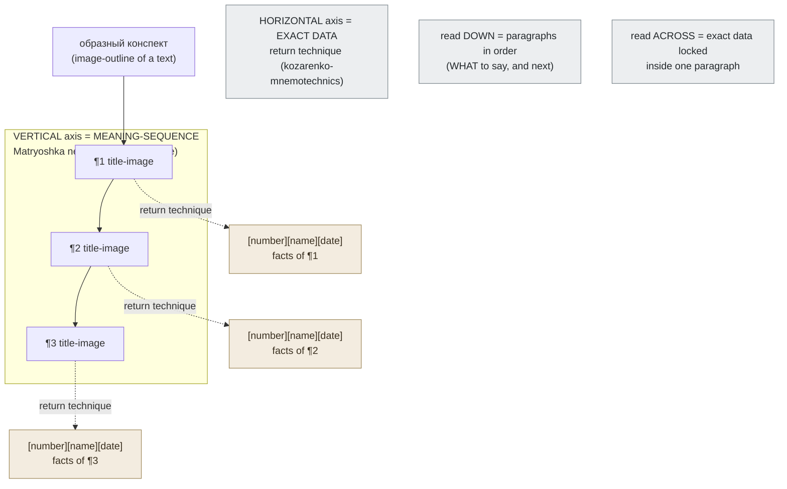

# Prose Memorization

**Summary**: Routing guide for memorizing expository / textbook **prose** the Kozarenko way — the third case in the family beside code-memorization (where code *structure* is the load) and verse-memorization (where *surface form* is the load). For prose the load is **meaning plus a few embedded exact facts**, and verbatim form usually is *not* worth encoding. The default target is an **образный конспект** (image-outline) with two axes; verbatim is the rare fallback.

**Sources**: `GMS_V.Kozarenko.pdf`. Draws on [kozarenko-mnemotechnics](./kozarenko-mnemotechnics.md), [method-of-guiding-associations](./method-of-guiding-associations.md), [memory-palace](./memory-palace.md), [table-of-support-images](./table-of-support-images.md), [four-level-blocks](./four-level-blocks.md), [mnemonic-methods-master](./mnemonic-methods-master.md), [meter-overview](./meter-overview.md), [skill-progression-stages](./skill-progression-stages.md).

**Last updated**: 2026-07-10

---

## Where this sits in the routing family

code-memorization and verse-memorization already cover the two extremes. Code decomposes into structure and you regenerate the tokens; verse *is* its surface form and you encode it word-for-word. Expository prose is the middle case: a textbook paragraph carries **meaning** (which you retell in your own words) plus a handful of **exact facts** — numbers, names, dates — that you must not paraphrase (source: GMS_V.Kozarenko.pdf).

So this page is a router, not one technique. The decision rule:

| Text | Target | Method |
|---|---|---|
| Anecdote / short factual snippet | Meaning only | компрессия → one title-image |
| Normal textbook paragraph(s) | Meaning + embedded exact data | **образный конспект** (two-axis) |
| Text you must recite word-for-word (≤3 pp) | Verbatim | образный конспект + return technique, per paragraph |
| Whole textbook chapter | Theme + "dry residue" per section | **[тематический стикер](./four-level-blocks.md)** outline |

Verbatim is the rare fallback, reserved for one-to-three-page texts (source: GMS_V.Kozarenko.pdf); page-length is the routing threshold here, not a mastery stage — mastery stages live in [skill-progression-stages](./skill-progression-stages.md).

## The compression move (метод сжатия)

**Метод сжатия** ("compression") is the base move under every prose case: a fragment of text collapses down to a short title, and the short title collapses to a single visual image (source: GMS_V.Kozarenko.pdf). The chain runs on two parallel supports:

- **словесная опора** (word-support) — the short verbal title of the fragment.
- **смысловая опора** (meaning-support) — the visual image that title becomes, via the word→image step owned by [method-of-guiding-associations](./method-of-guiding-associations.md) (source: GMS_V.Kozarenko.pdf).

Kozarenko's worked example: a paragraph about astronomer Kh. Mori spotting *two comets in one night* (5 Oct 1975) compresses to the title "two comets in one night," which becomes a clock face with one hour highlighted and two comets around it (source: GMS_V.Kozarenko.pdf). The image recovers *what to talk about* — you then retell the fragment in your own words — but it deliberately does **not** carry the exact data (the name Mori, the date); those are held separately (source: GMS_V.Kozarenko.pdf).

**Anecdotes are the simplest training case** precisely because they carry no exact data to preserve — you memorize only meaning-supports, and chain them together with no horizontal facts to bind (source: GMS_V.Kozarenko.pdf). Start prose training here, then graduate to факты. This difficulty ordering (anecdote → factual → verbatim) is a training progression, not a numbered mastery ladder; for the automaticity ladder itself see [skill-progression-stages](./skill-progression-stages.md).

## Factual text — the two-axis образный конспект

For real textbook prose (**фактографическая информация**), each paragraph gets one title-image (its meaning-support), and the images assemble into an **образный конспект** — an image-outline of the whole text — that is read along **two axes** (source: GMS_V.Kozarenko.pdf):

- **Vertical axis = meaning-sequence.** The order of the paragraph title-images is held by Matryoshka nesting, the loci/nesting technique owned by [memory-palace](./memory-palace.md) (source: GMS_V.Kozarenko.pdf). Reading *down* the конспект gives you the paragraphs in order — what to say, and next.
- **Horizontal axis = exact data.** The precise numbers, names, and dates inside each paragraph hang off that paragraph's image via the return technique (приём возврата), owned and defined in [kozarenko-mnemotechnics](./kozarenko-mnemotechnics.md) (source: GMS_V.Kozarenko.pdf). Reading *across* from a title-image gives you the locked-in facts of that one paragraph. When a paragraph has only a scrap of exact data, it can ride directly on the meaning-image as association elements instead (source: GMS_V.Kozarenko.pdf).

The two axes are orthogonal on purpose: Matryoshka carries the soft, retellable meaning; the return technique carries the hard, verbatim facts — never the reverse. Retelling is then verified out loud against the конспект on a dictaphone or camera, watching for pauses and fidget tells (source: GMS_V.Kozarenko.pdf). For long-term storage, the finished конспект can be parked in the numbered cells of [table-of-support-images](./table-of-support-images.md) for scheduled review.

## Verbatim prose — the rare case

Word-for-word text memorization (**точное запоминание текста**) is labor-intensive and is reserved for preparing an oral recitation — the schoolchild at the blackboard — over texts of only one to three pages (source: GMS_V.Kozarenko.pdf); beyond that, re-route to the meaning-based конспект above. Mechanically it is the same two-axis конспект: each paragraph becomes an image (as with anecdotes), the paragraph sequence is held by Matryoshka, and each paragraph's exact wording is bound to its image by the return technique from [kozarenko-mnemotechnics](./kozarenko-mnemotechnics.md) (source: GMS_V.Kozarenko.pdf). Kozarenko demonstrates on the short text *«Сколько лет шашкам?»* ("How old is draughts?") (source: GMS_V.Kozarenko.pdf). Treat verbatim as the exception you reach for only when recitation is the deliverable.

## Textbook outlines — the тематический стикер

For a whole chapter, the unit is the [тематический стикер](./four-level-blocks.md) (thematic sticker) — see [four-level-blocks](./four-level-blocks.md) for the стикер definition; the *thematic* one codes a textbook section's title, and its parts hold that section's outline (source: GMS_V.Kozarenko.pdf). The image comes either from the section title or from an illustration in the section, and its parts are used as the block structure owned by [four-level-blocks](./four-level-blocks.md); when the parts run out you spawn extra images by free association (source: GMS_V.Kozarenko.pdf).

The sticker holds only the **"сухой остаток"** (dry residue) — formulas, key concepts, scientists' surnames and life-dates, worked examples, experiments, problem-solving data — *not* the connective prose, because retelling is done with the verbatim technique above, not the sticker (source: GMS_V.Kozarenko.pdf). Section numbers ride on the top part of the sticker as image-codes for two-digit numbers, per [mnemonic-methods-master](./mnemonic-methods-master.md) (source: GMS_V.Kozarenko.pdf). Stickers are chained in Matryoshka order, one sequence per chapter (source: GMS_V.Kozarenko.pdf).

Kozarenko works this on 7th-grade physics §35–44, and drills the dry residue of §44 (Torricelli's barometer): the name and life-dates *Torricelli Evangelista (1608–1647)* are encoded — the dates as number-image codes from [mnemonic-methods-master](./mnemonic-methods-master.md) and bound by the return technique — alongside the mercury-tube experiment and the 760 mm Hg ≈ 1013 hPa relation (source: GMS_V.Kozarenko.pdf).

## METER fit

Per [meter-overview](./meter-overview.md), a prose-memorization session emits:

| Field | Meaning |
|---|---|
| `paragraph_titles_recognized` | Fraction of title-images recognized on sight (vertical-axis health) |
| `title_recognition_speed` | Seconds per title-image — should trend toward instant recognition |
| `exact_facts_complete` | Recalled exact facts / total exact facts (horizontal-axis completeness) |
| `retell_pause_count` | Pauses/fidgets on the dictaphone retell (lower = cleaner конспект) |
| `axis_of_failure` | Vertical (lost a paragraph) vs horizontal (lost a fact) — routes the fix |

Pass floor for a factual конспект: `paragraph_titles_recognized = 1.0` and `exact_facts_complete ≥ 0.95`. Title-recognition should reach reflex speed before the конспект counts as consolidated; that reflex band is defined on the automaticity ladder in [skill-progression-stages](./skill-progression-stages.md), not restated here. Long-term retention of the конспект is handed to [encoded-spaced-repetition](./encoded-spaced-repetition.md).

## Mnemonic

**Read down for the story, read across for the facts.** The vertical Matryoshka spine is the *plot* (paragraph after paragraph, what to say next); each horizontal spur off a paragraph-image is its *evidence locker* of exact numbers and names. Lose your place → walk down the spine. Blank on a date → step across into that paragraph's locker.

## Memory checksum

Three falsifiable checks (wrong answer in parentheses):

1. Which axis holds the *sequence* of paragraphs, and which holds the *exact data*? — Vertical/Matryoshka holds sequence; horizontal/return-technique holds exact data. (Trap: swapping them — putting facts on the Matryoshka spine — collapses retrieval; the spine carries soft meaning only.)
2. Why are anecdotes the *simplest* prose to train on? — Because they carry no exact data, so only meaning-supports are encoded — the horizontal axis is empty. (Trap: "because they're short" — length is not the reason; a short factual snippet with a number is harder.)
3. Does a тематический стикер store the section's prose for retelling? — No; it stores only the "dry residue" (formulas, names+dates, experiments). Retelling uses the verbatim "Шашки" technique instead. (Trap: treating the sticker as a recitation script.)

## Visual

## Related pages

- code-memorization — sister router where *structure* is the load, not meaning
- verse-memorization — sister router where *surface form* is the load (verbatim by default)
- [table-memorization](./table-memorization.md) — fourth sister router, for tabular/matrix material; consumes this page's *метод сжатия* logic at the schema level (strip what repeats across rows before encoding anything)
- [kozarenko-mnemotechnics](./kozarenko-mnemotechnics.md) — owner of the return technique (приём возврата) that binds the horizontal axis
- [memory-palace](./memory-palace.md) — owner of Matryoshka / loci nesting that holds the vertical axis
- [method-of-guiding-associations](./method-of-guiding-associations.md) — the word→image step that turns a title into its meaning-support
- [four-level-blocks](./four-level-blocks.md) — the тематический-стикер part structure that holds the dry residue
- [mnemonic-methods-master](./mnemonic-methods-master.md) — number-image codes for dates and section numbers
- [table-of-support-images](./table-of-support-images.md) — durable cell storage for a finished конспект
- [meter-overview](./meter-overview.md) — session instrumentation
- [encoded-spaced-repetition](./encoded-spaced-repetition.md) — long-term maintenance of the конспект
- [skill-progression-stages](./skill-progression-stages.md) — the automaticity / mastery ladder cited for any stage claim

---

## U — See (CAST)
1. A конспект is a graph: Matryoshka spine (vertical) with per-paragraph fact-lockers (horizontal).
2. Nodes = paragraph title-images; horizontal edges = exact-data associations.

## D — Name (NEDF)
1. Prose memorization = route text by load: meaning-only, meaning+facts, or verbatim.
2. Distinguisher vs verse: form is dropped, meaning is kept — the inverse of verse-memorization.

## F — Do (SPEAR)
1. Title each paragraph → image; nest images by Matryoshka for the vertical axis.
2. Bind exact data horizontally via the return technique; verify by spoken retell.

## B — Watch (HEART)
1. Facts drifting onto the meaning spine instead of horizontal spurs.
2. Reaching for verbatim on a text over three pages.

## L — Predict (ORACLE)
1. Anecdote → predict empty horizontal axis (meaning-supports only).
2. Data-dense paragraph → predict heavy return-technique load on the horizontal axis.

## R — Act (GRACE)
1. New expository text → build the two-axis конспект, not verbatim.
2. Recall miss → check which axis failed (lost paragraph vs lost fact) and drill that axis.
