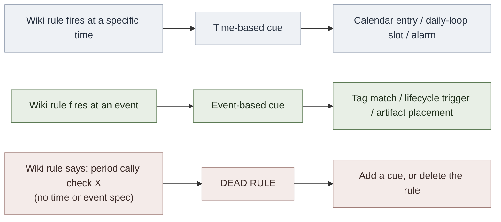

# Prospective Memory

**Summary**: Memory for *future intentions* — the brain's to-do list. Distinct from retrospective memory (what happened) in that it requires the trace to be retrieved at a *specific later time* without conscious rehearsal in the interval. Prospective memory is so failure-prone Genova calls it "almost a kind of forgetting rather than a kind of memory." Cues are time-based ("at 2:50, pick up kid") or event-based ("when you see Diane, ask her…"). Failure rate is high across all ages and stakes — Yo-Yo Ma left his $2.5M cello in a NYC taxi; surgeons left 772 instruments inside patients over 8 years. The wiki has heavy retrospective-memory machinery (encoders, palaces, SR, drill ladders) and almost nothing named for prospective. **The reframe**: TagManager + calendars + drill-deck schedulers + reminder alerts + the daily loop are already prospective-memory *prostheses* — naming the category turns scattered tools into one coherent layer.

**Sources**:
- Lisa Genova, *Remember* (Harmony 2021), Ch 9 "Don't Forget to Remember" — source file `F:\tutorials\Mnemonic Device\Remember...epub`
- Einstein & McDaniel (2005) "Prospective memory: Multiple retrieval processes" — *Current Directions in Psychological Science* 14: 286–290
- Maylor (1990); Smith & Bayen (2004); Kliegel, McDaniel & Einstein eds. (2008) *Prospective Memory: Cognitive, Neuroscience, Developmental, and Applied Perspectives*
- Crovitz & Daniel "Prospective and Retrospective Memory Questionnaire" (PRMQ; Smith, Della Sala, Logie & Maylor 2000) — the 8-item subset Genova quotes
- Gawande, *The Checklist Manifesto* (2009) — pilot + surgical-checklist case for prosthesis approach

**Last updated**: 2026-05-24

---

## The load-bearing unlock

The wiki's [memory palace](./memory-palace.md), [NEDF](./nedf-overview.md), [CAST](./cast-overview.md), [active-recall](./active-recall.md), [spaced-repetition](./spaced-repetition.md), [Red Queen Gym](./red-queen-skill-gym.md), [automaticity](./automaticity-and-reflex-training.md) — every load-bearing memory page — is built for **retrospective memory**: encoding the past so it can be retrieved later under cue. None of these pages addresses the question *"what about memory whose entire point is to fire on its own at a specific future moment without being prompted?"*

That's prospective memory. It's a separate failure surface, and the wiki has been silently building its prosthesis without naming it.

**The unlock**: every tool the wiki already runs as a "discipline" is operationally a prospective-memory prosthesis —

| Tool | What it actually does |
|---|---|
| Daily loop | Schedules cue-firing at fixed time-of-day (time-based prospective cue) |
| TagManager + drill-deck queues | Cues "do this drill on encounter with this material" (event-based) |
| Anki / SR scheduler | Cues "retrieve this card at scheduled future moment" (time-based) |
| Calendar entries + alarms | The canonical prospective-memory prosthesis |
| [lifecycle-manager](./lifecycle-manager.md) retirement triggers | "When card crosses threshold X, propose merge" (event-based) |
| [METER](./meter-overview.md) alerts on flat metrics | "When metric is flat ≥4 sessions, fire OK-Plateau check" (event-based) |
| Front-door / on-the-counter physical cue placement | What Genova's boyfriend does with wine bottles — the wiki's analog is artifact placement |

Naming the category clarifies the failure mode: anywhere a wiki rule says *"check X periodically"* or *"remember to apply Y when Z"* without scheduling the check or installing the cue, the rule is **operationally dead** — it depends on a kind of memory the brain does not reliably support.

---

## The two-step structure of prospective memory (Genova Ch 9)

| Step | What | Failure rate |
|---|---|---|
| **1. Encoding the intention** | "I need to remember to book my daughter's flight before bed" | Low — usually fine |
| **2. Retrieving at the right future moment without prompt** | At 11pm, the intention has to fire on its own | **Very high — this is where everything fails** |

Step 2 is the entire failure surface. The intention has to compete for retrieval with everything else happening at 11pm; if no external cue is firing at that moment, the intention does not surface, no matter how much it mattered.

---

## Cue typology

Every prospective-memory intention attaches to one of two cue types:

| Cue type | Form | Example | Wiki anchor |
|---|---|---|---|
| **Time-based** | "At T:" or "after Δt" | "At 2:50, pick up kid" / "tomorrow morning, take out trash" | Calendar entries, alarms, neural-os-daily-loop |
| **Event-based** | "When E happens, do A" | "When you see Diane, ask her" / "when you exit the taxi, check trunk" | TagManager tag matches, [lifecycle-manager](./lifecycle-manager.md) retirement triggers, drill-deck queues |

Time-based cues fail more often than event-based — humans are bad at noticing "it's now T." Event-based cues fail when the triggering event is masked (Yo-Yo Ma's cello: the gigantic case was in the trunk, **out of sight**, so the "exit-taxi" event did not register the "take cello" sub-cue).

---

## The PRMQ — 8-item self-diagnostic (Smith et al. 2000, via Genova)

Score 5 (very often) → 1 (never):

1. Decide to do something in a few minutes, then forget?
2. Fail to do something supposed to do minutes later even though it's in front of you (take a pill, turn off kettle)?
3. Forget appointments without a calendar/diary prompt?
4. Forget to buy something planned even when you see the shop?
5. Intend to take something with you, leave it behind minutes later even though in front of you?
6. Fail to give a visitor something you were asked to pass on?
7. If a friend was out, forget to try again later?
8. Forget to mention something you meant to say minutes ago?

Genova scored 25/40 herself. The page-recommended use: take this on day-N, recompute every quarter, watch for trend. Sudden jump = prosthesis failure, not pathology (unless other Alzheimer's signs co-fire — see mild-cognitive-impairment).

---

## The Genova prosthesis stack — 6 levers

Generic prosthesis recipe from Genova Ch 9, mapped onto wiki anchors:

| Lever | What | Wiki implementation |
|---|---|---|
| **1. To-do lists** | External capture; "glasses for prospective memory"; *check the list* is the second half | Existing TaskCreate workflow; checklist artifacts in the project root |
| **2. Calendar entries + alerts** | Time-based prosthesis with reminder pings | Existing neural-os-daily-loop structure; phone calendar alarms |
| **3. Implementation intentions** | Specific plan with built-in cues: "I'll do yoga at noon — mat by door at 11:45" beats "I'll exercise today" (Gollwitzer 1999 formalization) | New: every wiki [gym](./red-queen-skill-gym.md) session is more reliable when prescribed as time+place+specific-drill rather than "practice today" |
| **4. Pillbox-style compartmentalization** | Pre-arrange the artifact so the event-based cue (looking at it) doubles as the action and the verification | Drill-ladder per-day bins; SR queue display; "today's deck" UX |
| **5. Impossible-to-miss cue placement** | "On the floor in front of the door" — physically obstruct normal motion until cue is acknowledged | Sticky notes on the monitor; staged files on the desktop; [red-queen-skill-gym](./red-queen-skill-gym.md) open-tab discipline |
| **6. Routine-disruption awareness** | When daily routine breaks, the cues that hung on the routine vanish too — explicitly re-scan for orphaned intentions | New rule for [PULSE](./pulse-overview.md): travel / illness / role-change → re-check prospective-memory anchors |

---

## When prospective memory fails despite high stakes

Stakes do not protect:

- **Yo-Yo Ma** left his 1733 Montagnana cello ($2.5M) in a NYC taxi (1999). Cause: cello case in trunk → event-cue masked.
- **Lynn Harrell** left his Stradivarius ($4M) in another NYC taxi. Same mechanism.
- **Surgeons**: Joint Commission reported **772 instruments left inside patients** over 8 years (through 2013) — 13-inch retractor, 6-inch metal clamp, scissors, scalpels, sponges. Fix: surgical checklists (Gawande 2009).
- **Pilots**: never relied on prospective memory for lower-the-wheels-before-landing — checklists from the start of commercial aviation.

The lesson is uniform: high stakes do not produce reliable retrieval. **Checklists do.** Every wiki rule of the form "always do X before Y" should be a checklist artifact, not a remembered intention.

---

## Routing rule for the wiki

This becomes a lint check: scan all wiki rules of the form "remember to / always / periodically / regularly" and flag any without a scheduled time-cue or specified event-cue.

---

## Implications for the wiki

Five operational follow-ups:

1. **[lifecycle-manager](./lifecycle-manager.md)** — already an event-based prospective-memory prosthesis. Name it explicitly so the architecture is discoverable.
2. **neural-os-daily-loop** — time-based prospective-memory prosthesis. Same naming move.
3. **[red-queen-skill-gym](./red-queen-skill-gym.md) session recommendations** — re-state every drill prescription as a Gollwitzer implementation intention (time + place + specific drill) rather than "practice X today."
4. **CLAUDE.md operational rules** — scan for "periodically" / "remember to" without scheduling; flag candidates for relocation to event-based hooks (TagManager triggers, lifecycle thresholds, METER alerts) or time-based slots (daily loop).
5. **PULSE under routine-disruption** — new sub-rule: travel / illness / role-change → re-scan prospective-memory anchors that were hung on the displaced routine.

---

## METER floor for this page

- Define prospective memory in <6s: "Memory for future intentions — the to-do list in your head."
- Distinguish time-based vs event-based cues in <8s with one example of each.
- Recall the 2-step structure in <6s: encode the intention (easy) → retrieve at right future moment without prompt (hard).
- Name 3 wiki tools that are operationally prospective-memory prostheses in <10s: calendar/daily-loop, TagManager, lifecycle-manager.
- Recall the Yo-Yo Ma cause in <8s: cello case in trunk → event cue masked → "exit taxi" did not fire "take cello."

---

## Mnemonic

A **future-you** floats in a thought bubble above present-you, holding a sign that reads `[DO THIS LATER]`. Future-you is constantly nodded off — the bubble is *always* asleep at the moment you need it. Around present-you are **prostheses** that wake future-you up: a **giant pillbox** with days-of-week compartments, a **calendar with an alarm clock taped to every slot**, a **brown-paper-bag wine bottle on the floor blocking the front door** (Genova's boyfriend), a **surgical checklist on a clipboard**, a **pilot's "wheels down" lever in red**. In the corner, **Yo-Yo Ma** climbs out of a taxi — the **cello case is invisible in the trunk** (greyed out) so future-you stays asleep, and the cello rolls away. Above the whole scene: *"To-do lists are glasses for your prospective memory. There is no shame in a list."* (Genova Ch 9)

---

## Memory checksum

- **2** steps (encode intention · retrieve at future moment without prompt) — failure rate is concentrated in step 2
- **2** cue types (time-based · event-based) — time fails more than event; out-of-sight masks event cues
- **6** Genova prostheses (to-do lists · calendar+alerts · implementation intentions · pillbox compartments · impossible-to-miss placement · routine-disruption awareness)
- **3** high-stakes failure cases — Yo-Yo Ma cello · 772 surgical instruments · pilot wheels (solved by checklist)
- **1** routing rule (time-cue → calendar; event-cue → tag/lifecycle; neither → dead rule)
- **8** PRMQ items (5-very-often … 1-never)

2-2-6-3-1-8 recall from "prospective memory" within 60s → page is encoded.

---

## U — See (CAST)

1. Two parallel timelines — present-self timeline (cues firing left-to-right) + future-self thought-bubble timeline (intention dormant until its cue fires); arrow from cue-event up to intention-bubble = retrieval moment
2. Edges: encode → dormant → cue-fires → retrieve → execute; failure-arrow from cue → "masked / missed" → intention-bubble stays asleep

## D — Name (NEDF)

1. Prospective memory = memory for future intentions; brain's to-do list
2. Cues: time-based (at T) vs event-based (when E happens)
3. Distinguisher: NOT retrospective (what happened); prospective is forward-pointing
4. Failure mode: high in all of us; stakes don't protect; checklists fix

## F — Do (SPEAR)

1. Capture intention immediately into the prosthesis (calendar / list / artifact-placement)
2. Pick cue type: time-based → calendar entry + alarm; event-based → tag-trigger / lifecycle-rule / front-door artifact
3. Specify the implementation intention: time + place + exact action (not "I'll do X today")
4. On routine disruption (travel/illness/role-change): re-scan for orphaned intentions

## B — Watch (HEART)

1. "I'll remember to X" without writing X anywhere = forgotten
2. Stakes-as-substitute for cues: "I won't forget, it's too important" = forgotten
3. Out-of-sight cue (cello in trunk) = forgotten
4. Routine break dropped a cue without a re-anchor = forgotten

## L — Predict (ORACLE)

1. Without an external cue and >2-hour delay → recall probability <50% across all ages
2. Out-of-sight event-cues fail at much higher rate than visible ones
3. Aged 65+ without a prosthesis → recall probability <40% even with prompt

## R — Act (GRACE)

1. New intention forms → write it into the prosthesis within 30 seconds, never trust memory
2. Drill-ladder or daily-loop slot drifts → check for cue removal, not motivation
3. Wiki rule says "periodically" with no cue → flag as dead; add cue or delete

---

## Related pages

- [lifecycle-manager](./lifecycle-manager.md) — event-based prosthesis (retirement triggers)
- neural-os-daily-loop — time-based prosthesis
- [red-queen-skill-gym](./red-queen-skill-gym.md) — gym slots are prospective-memory anchors; specify time+place+drill (Gollwitzer)
- [memory-reconsolidation](./memory-reconsolidation.md) — retrospective-side companion failure mode
- [memory-systems](./memory-systems.md) — overview parent (which now distinguishes retrospective vs prospective)
- [pulse-overview](./pulse-overview.md) — routine-disruption rule lands here
- [meter-overview](./meter-overview.md) — flat-metric alerts are event-based prospective prostheses
- mild-cognitive-impairment — distinguishing normal prospective-memory lapses from MCI (future ingest)
- [daily-planner-as-clock-palace](./daily-planner-as-clock-palace.md) — a day planner as a prospective-memory prosthesis (time / event cue rule)
