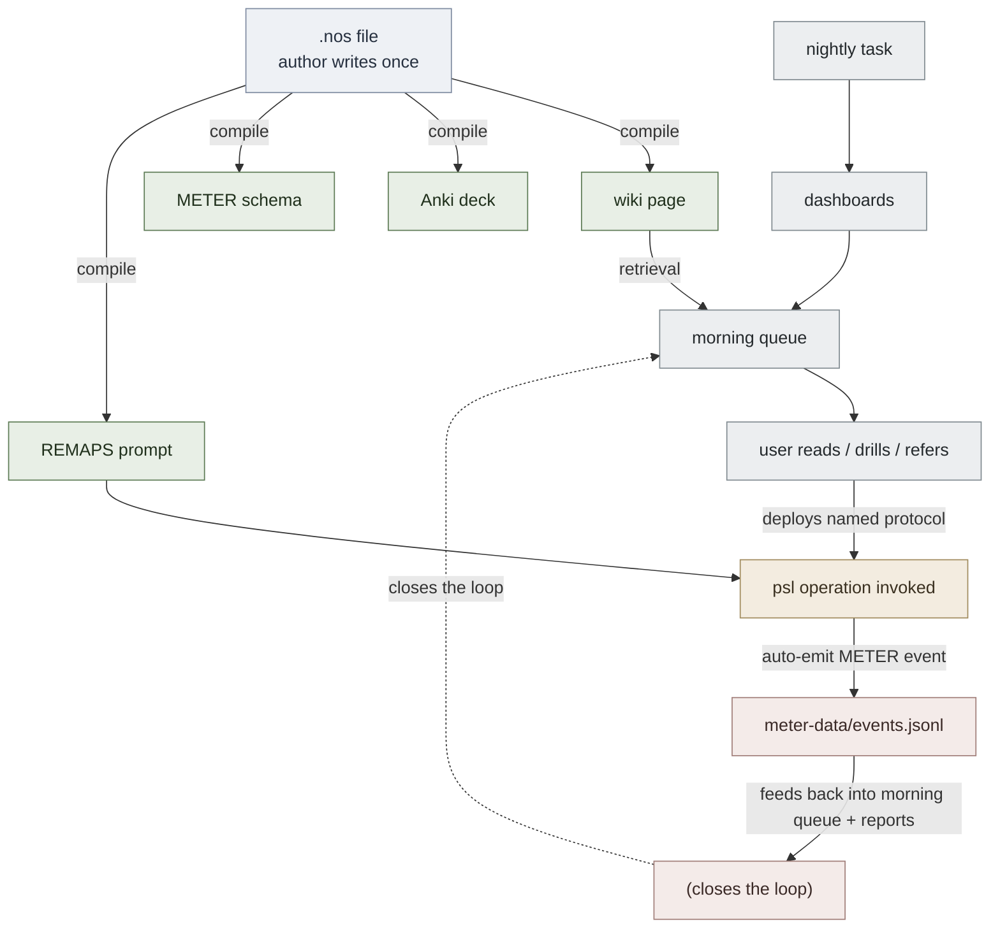

# psl — Problem-Solving Library

**Summary**: A domain-specific library (and eventually a notation) for executing problem-solving operations. Structurally analogous to MATLAB (matrices first-class) and Wolfram (symbolic math first-class): `psl` makes **Problem objects** first-class and the wiki's named protocols (Crux, Invert, Premortem, encoder casts, drill) **callable as typed operations** that compose algebraically. The user-facing pitch — *"a language that gives users vocabulary and mental models to solve any problem in seconds"* — is realized by giving each named protocol an unambiguous invocation, a typed return value, an auto-emitted METER event, and a sub-15s drill latency target.

**Sources**:
- 2026-06-01 idea-validation pass (verdict: KEEP WITH MODIFICATION — library-first, language-later)
- [problem-solving-os](./problem-solving-os.md) — the OS this library executes against
- [framework-comparison-matrix](./framework-comparison-matrix.md) — encoder hexagon becomes the type system
- neural-os-authoring-dsl — sibling proposal; production side of the same lifecycle
- [meter-overview](./meter-overview.md) — every psl operation auto-emits METER events
- [pulse-overview](./pulse-overview.md) — psl operations gate on Energy/Stress state
- [red-queen-skill-gym](./red-queen-skill-gym.md) — `Drill(...)` is a thin wrapper over the gym

**Last updated**: 2026-08-20 (`glyph:` assigned — [representation-rules](./representation-rules.md) Rule 11); 2026-06-01

**Originality**: 🟡 4/9 · distinctive-supporting · O:2 OP:1 I:1 (4 inbound) · [board](../_meta/originality-board.md)

---

## Why this exists

The wiki has 50–100 named problem-solving protocols (FRAME FORGE, ORIENT, BRIDGE LOAD, ARC, SCREAM, Anti-Tactic Detection, Crux Recognition Gym, Invert, Premortem, 5-Why, encoder casts, etc.) — but they live as **prose with diagrams**, not as **callable operations**. To use them in a live problem-solving session, the user re-derives the protocol from memory each time, which:

- has high latency (minutes, not seconds)
- has no measurement (was the protocol executed correctly?)
- has no composition (chaining Invert → Premortem → Crux is mental gymnastics, not a typed pipeline)
- has no state-conditioning (running a full Sword-intensity Drill when Pulse.stress = 5 is a mistake the prose can't enforce)

`psl` turns each protocol into a function with a typed signature, a return value, a measurable event emission, and runtime state-checking. The MATLAB analogy: an engineer who wrote a four-line `psl` chain solves a problem the way an engineer solving a least-squares problem writes `x = A \ b` instead of hand-rolling QR decomposition.

## Library-first, language-later — the critical discipline

**Do not start with syntax.** Start with operations as a Python library.

This is how MATLAB and Wolfram actually evolved historically:

- Cleve Moler wrote LINPACK (Fortran matrix-operation library) in 1979. MATLAB the *language* shipped in 1984. The operations existed and were validated before the syntax was designed.
- Stephen Wolfram had SMP (symbolic-manipulation program in C) operating from 1981. Mathematica the language shipped in 1988. Same pattern: operations first, then syntax.

The risk of starting with syntax is bikeshedding before knowing what the operations should be. The library form is *immediately usable* by anyone who knows Python (or any scripting language with similar surface). When the library has 50+ operations and three months of real use, a **second `/validate-idea` pass on the language-syntax layer** decides whether to add a parser, notebook environment, or REPL.

Until that second validation pass: `psl` is a Python library. Period.

## Core types

```python
@dataclass
class Problem:
    situation:   str            # what's happening
    constraints: list[str]      # what's fixed / non-negotiable
    goal:        str            # desired outcome
    frame:       Optional[str]  # current way of viewing it (may be wrong)
    history:     list[Event]    # operations applied so far
    meter_run:   str            # auto-generated correlation id

@dataclass
class Crux:
    fact:          str          # the load-bearing fact
    witnesses:     list[Problem]  # the problem-variants that surfaced it
    decorative:    list[str]    # facts marked as NOT load-bearing
    confidence:    float        # 0.0 – 1.0

# Encoder kind types (sentinel singletons + dataclass for cast results)
class NEDF: pass
class CAST: pass
class SPEAR: pass
class HEART: pass
class ORACLE: pass
class GRACE: pass

@dataclass
class SpearCard:
    scene:         str
    preconditions: list[str]
    execution:     str
    alternatives:  list[str]
    repair:        list[str]
```

`Problem` is the fundamental object the way matrices are MATLAB's fundamental object. Every operation either consumes a `Problem` (or `Crux`) and produces a typed value, or transforms a `Problem` into another `Problem`.

## Sample session (rough sketch, not committed)

```python
from psl import Problem, Crux, Invert, Premortem, Encode, SPEAR, Drill, Pulse

# Read user state at session start
Pulse.read()  # emits pulse.state event; gates subsequent operations

prob = Problem(
    situation="team velocity dropped 30% over two sprints",
    constraints=["OKR due in 4 weeks", "no headcount change"],
    goal="restore velocity",
)
# auto-emits: psl.problem_created  · with correlation id

inv  = Invert(prob)
# returns Problem variant with inverted goal
# auto-emits: psl.invert  · references the parent problem

prem = Premortem(prob, horizon="4w")
# returns Premortem object (list of named failure causes with probabilities)
# auto-emits: psl.premortem

crux = Crux(prob, witnesses=[inv, prem])
# returns Crux object — the load-bearing fact across the witnesses
# auto-emits: psl.crux_named  · with latency  · pass threshold ≤ 10s

spear = Encode(crux, SPEAR)
# returns SpearCard — the crux as an executable procedure
# auto-emits: psl.encode  · with encoder kind = SPEAR

Drill(spear, intensity="Lamp")
# runs the Red Queen Gym at Lamp (Recognition) intensity
# auto-emits: psl.drill  · with intensity  · with score
# Pulse-gates: if Pulse.stress >= 4, raises PulseGateError unless intensity is downshifted

prob.history  # complete operation log for this problem
```

This is **immediately useful** with no parser, no notebook, no syntax design. The operations are the language.

## Stdlib — initial operations to implement

The first 30 operations to land before any syntax work begins:

| Operation | Purpose | Returns | Anchor |
|---|---|---|---|
| `Problem(...)` | Construct a problem object | `Problem` | this page |
| `Frame(prob)` | Extract / re-name the current frame | `str` | [frame-forge](./frame-forge.md) |
| `Reframe(prob, new_frame)` | Apply a new frame | `Problem` | [frame-forge](./frame-forge.md) |
| `Invert(prob)` | Flip goal to its opposite | `Problem` | meadows-12-leverage-points |
| `Premortem(prob, horizon)` | Reconstruct failure causes | `Premortem` | [oracle-overview](./oracle-overview.md) |
| `Crux(prob, witnesses)` | Extract load-bearing fact | `Crux` | [linguistic-crux](./linguistic-crux.md) |
| `AntiTactic(prob)` | Scan for primed wrong move | `list[str]` | [anti-tactic-detection](./anti-tactic-detection.md) |
| `FiveWhy(prob)` | Recursive causation depth-5 | `list[str]` | [problem-solving-os](./problem-solving-os.md) |
| `Encode(crux, encoder_kind)` | Cast into encoder shape | `NEDFCard \| CASTGraph \| SpearCard \| HeartRoom \| OracleCard \| GraceCard` | [framework-comparison-matrix](./framework-comparison-matrix.md) |
| `Drill(card, intensity)` | Run Red Queen Gym | `DrillResult` | [red-queen-skill-gym](./red-queen-skill-gym.md) |
| `Pulse.read()` | Read Energy/Stress state | `PulseState` | [pulse-overview](./pulse-overview.md) |
| `Pulse.gate(intensity)` | Check if intensity is allowed | `bool` | [pulse-overview](./pulse-overview.md) |
| `Substrate(prob)` | Decompose into substrate vs algorithm | `(Substrate, Algorithm)` | [substrate-algorithm-composition](./substrate-algorithm-composition.md) |
| `Distinguish(concept_a, concept_b)` | Sharp differentiation | `list[str]` | [nedf-overview](./nedf-overview.md) (Distinguisher) |
| `Orient(situation)` | Capture protocol (Objects · Roles · Indexes · Edges · Norms · Threads) | `OrientReport` | [orient-method](./orient-method.md) |
| `BridgeLoad(target, source)` | Analogy-construction | `Bridge` | [bridge-load](./bridge-load.md) |
| `FrameForge(prob)` | 8-step framing protocol | `Frame` | [frame-forge](./frame-forge.md) |
| `Scream(audio)` | Subjects · Continuity · Roles · Events · Assertions · Measures | `ScreamReport` | [semantic-listening-system](./semantic-listening-system.md) |
| `Arc(prob)` | Assess · Run · Close — unified loop | `ArcResult` | [arc-framework](./arc-framework.md) |
| `Ground(situation)` | GRACE.Ground slot — situational read | `GroundReport` | [grace-overview](./grace-overview.md) |
| `Repair(card)` | Add Repair slot if missing | `SpearCard` | [spear-overview](./spear-overview.md) |
| `Alternatives(card)` | Enumerate non-happy-path branches | `list[str]` | [spear-overview](./spear-overview.md) |
| `Failure(concept)` | Generate Failure-slot scenarios | `list[str]` | [nedf-overview](./nedf-overview.md) |
| `Predict(prob, mode)` | ORACLE prediction (4 modes) | `OraclePrediction` | [oracle-overview](./oracle-overview.md) |
| `Meter.emit(event_name, **fields)` | Manual METER event | `None` | [meter-overview](./meter-overview.md) |
| `Meter.report(timeframe)` | Pull METER summary | `MeterReport` | [meter-overview](./meter-overview.md) |
| `History(prob)` | Operation log for a problem | `list[Event]` | this page |
| `Replay(prob, history)` | Re-execute operation chain | `Problem` | this page |
| `Tier(asset)` | Atomic-design tier of an asset | `Tier` | [memory-atomic-design](./memory-atomic-design.md) |
| `Composability(pattern)` | Look up promotion status | `dict` | [composability-index](./composability-index.md) |

When 70% of these are implemented and have been used on real problems, the library has earned its second `/validate-idea` pass on syntax.

## METER pass/floor

Per the wiki's METER-fit rule, every new framework names its metrics before approval:

| Metric | Pass | Floor | Measures |
|---|---|---|---|
| `psl.operation_count_per_session` | ≥ 5 | 2 | Operations per problem-solving session — proxy for adoption |
| `psl.drill_latency_p50` | ≤ 15s | 30s | Median time from `Drill(...)` invocation to correct named move |
| `psl.real_problem_ratio` | ≥ 60% | 40% | Operations on real problems vs toy/test problems |
| `psl.stdlib_coverage` | ≥ 70% | 40% | Fraction of named wiki protocols implemented as operations |
| `psl.crux_named_within_10s` | ≥ 80% | 50% | When `Crux(...)` is called, was the load-bearing fact identified within 10s? |
| `psl.operation_chain_length_avg` | ≥ 3 | 2 | Average chain length — measures whether composition works |
| `psl.pulse_gate_block_rate` | informational | — | How often Pulse gate rejected an operation (signal not a bug) |

If floors are not exceeded after 8 weeks of real use, the library design is wrong and needs revisiting before any syntax work.

## UMTF perceptual-retrieval discipline

Per [universal-mental-tagging-framework](./universal-mental-tagging-framework.md) §"Design Criteria" — *"tags must be instantly perceived rather than decoded step by step. Size, position, motion, and sensory contrast are preferred over abstract symbols."* A pure symbolic library risks losing this.

**Mitigation**: every `psl` operation emits a **triple output**:

1. **The typed value** — for code consumption
2. **A scene description** — REMAPS-compatible, feeds image-gen, preserves perceptual retrieval
3. **A METER event** — for measurement

```python
result = Crux(prob, witnesses=[inv, prem])

result.value      # the Crux object — for code
result.scene      # "A single brass key glowing on a velvet cushion, surrounded by twelve dimmer keys lying scattered around it" — for image-gen and recall
result.meter      # the auto-emitted event dict
```

The scene is **not optional**. An operation that cannot produce a scene description is not yet ready for the stdlib — it indicates the wiki anchor itself lacks perceptual encoding, which must be fixed upstream first.

## Composition with .nos and the wiki retrieval pipeline

`psl` is the **executable** sibling of the `.nos` authoring DSL. Together with the retrieval pipeline they form the complete content lifecycle:



This loop did not exist before. Each piece existed separately. `psl` is what closes it.

## Working title and naming

The package is `psl` (lowercase). Final name decision is deferred until the syntax-layer validation pass. Possible final names — placeholder list:

- **`psl`** — generic; honest about its library-first nature
- **`solva`** — evocative; needs glossary registration
- **`crux`** — collides with the existing concept
- **`forge`** — collides with `frame-forge`

The honest move is to keep it as `psl` until either (a) the syntax layer goes through validation, or (b) the package gets enough traction that a memorable name is worth picking. Naming for a library no one is using yet is premature optimization.

## What this is NOT

- **Not a cognitive-architecture instrument.** Rejected interpretation #2 from the 2026-06-01 first validation pass — a SOAR/ACT-R sibling — was an *academic* tool making the wiki spec machine-executable. `psl` is a *user* tool making the user's problem-solving faster. Per the MATLAB-is-not-SOAR argument: same form (interpreter for domain operations), different audience and purpose.
- **Not an authoring tool.** That is .nos. `psl` executes operations; `.nos` compiles content. Different audience (solver vs author), different surface (REPL vs compiler), different output (live results vs static artifacts).
- **Not a replacement for the wiki.** The wiki remains the encyclopedia. `psl` operations cite their anchor pages. A `psl` user who hits an operation they don't understand reads the wiki page; a wiki reader who wants to *use* a protocol installs `psl`.

## Implementation order

1. **Core types** — `Problem`, `Crux`, encoder-kind sentinels, `PulseState`, `MeterEvent`. ~150 LOC, weekend.
2. **30-operation initial stdlib** — the table above. Each operation: signature, body, scene generator, METER event. ~30 operations × 30–80 LOC each ≈ 1500 LOC.
3. **METER auto-emission** — every operation decorated with `@meter_emit` so events are automatic. ~50 LOC.
4. **PULSE gate** — `@pulse_gate(min_energy=2)` decorator on intensity-bearing operations. ~30 LOC.
5. **Scene generators** — every operation produces a REMAPS-compatible scene. ~30 small templates.
6. **Drill bridge** — `Drill(...)` wraps the existing Red Queen Gym CLI/web infrastructure. ~100 LOC.
7. **8-week trial period** — real problems only. METER reports weekly. Operations that fail their floor on multiple problems get redesigned.
8. **Second `/validate-idea` pass** — when stdlib coverage ≥ 70% and 8-week trial passes floors. *Then* consider syntax / notebook / REPL.

## Open questions (for the second validation pass)

- **Should `psl` operations be pure functions or should they mutate `Problem` objects in place?** Functional style is safer; mutation matches how problems actually evolve in practice. Leaning functional with a `prob.with_op(...)` helper.
- **How does `psl` interoperate with the morning queue?** Should operation results flow into the queue automatically? Lean toward yes — operations are queue events.
- **What about offline use?** First version assumes Python + filesystem. Notebook (Jupyter) integration is the natural next step.
- **Does `Drill(...)` block?** It might run for 60 seconds. Async? Background process? Defer.
- **Cross-language port?** `psl` in Rust / TypeScript? Defer until the Python version proves the operations.

## Failure modes

- **Operation explosion.** Implementing 100+ operations before any are used in real problems. Mitigation: 30-op cap until 8-week trial passes.
- **Symbolic without perceptual.** Letting the typed-value output be enough, dropping the scene generators. Hard discipline: every operation MUST emit a scene or it doesn't ship.
- **Becoming a wiki reader's toy.** If users invoke operations only on toy problems, the `psl.real_problem_ratio` floor catches it.
- **Collapsing into rejected interpretation #2.** If the library starts trying to be a cognitive architecture (multi-agent reasoning, autonomous problem-solving, etc.), step back. `psl` is a user tool — the user is the executor, not a research subject.
- **Bikeshedding the name.** Working title is `psl`; final name decision is deferred. Resist temptation to rename until the library has earned a name.

## Related pages

- [problem-solving-os](./problem-solving-os.md) — the OS this library executes against
- [framework-comparison-matrix](./framework-comparison-matrix.md) — encoder hexagon = stdlib type system
- neural-os-authoring-dsl — `.nos` sibling (authoring side)
- [red-queen-skill-gym](./red-queen-skill-gym.md) — `Drill(...)` wraps this
- [meter-overview](./meter-overview.md) — auto-emitted by every operation
- [pulse-overview](./pulse-overview.md) — gates operation intensities
- [crux-recognition-gym](./crux-recognition-gym.md) — the source of `Crux` / `AntiTactic` operations
- [frame-forge](./frame-forge.md) — `FrameForge(...)` is this protocol made callable
- programming-language-concept-spaces — psl, when it eventually gets syntax, will score on the 13 spaces (Space 13 self-application: psl is a language designed around the encoder hexagon → SPEAR.Repair:R, NEDF.Distinguisher:R, etc.)
- [originality-scoring](./originality-scoring.md) — psl scores against this; the page is currently O:2 OP:0 (design-only)
- [composability-index](./composability-index.md) — psl × .nos × retrieval pipeline registered as the closed-loop unlock

---

## Implementation decisions  *(Phase 0 — 2026-06-02)*

Locked before any code per the Phase 0 gate in `~/.claude/plans/what-could-and-should-humming-charm.md`:

| Decision | Pick | Rationale |
|---|---|---|
| Working name | `psl` (lowercase package) | Honest about library-first status. Final name decision deferred to Phase 5. |
| Host language | **Python 3.10+** | Repo standard; `tools/meter/` already Python-packaged; METER/PULSE/Anki bridges are Python; `match` statements + PEP 604 unions match the dataclass-heavy design. |
| Repo path | **`tools/psl/`** | Mirrors `tools/meter/` exactly. Second packaged tool sets the repo's package-layout precedent. |
| PyPI name (Phase 7) | `neural-os-psl` | Mirrors `neural-os-meter`. `psl` alone is too short and likely taken. |
| License | **MIT** | Repo default posture; library-not-product. |
| Dependencies (Phase 1) | stdlib + `typer>=0.9` + `neural-os-meter` (editable install from `tools/meter/`) | No pydantic, no rich, no click. The 30-op stdlib must run on these. |
| Distribution | `pyproject.toml` + setuptools + PyPI | Match `tools/meter/pyproject.toml` template exactly. |
| Test framework | `pytest>=7` (dev dependency) | Match `tools/meter/tests/` pattern. |
| File extension (Phase 6, contingent) | `.psl` | Decision recorded; only used if Phase 5 says full-syntax. |

**Working-title discipline**: do NOT rename `psl` before Phase 5. The second validation pass on syntax owns the final-name decision.

**Cardinal rule for the interpreter (if Phase 6 ships)**: the interpreter dispatches to the existing library. No parallel implementation of operations. The Python library remains the truth.
