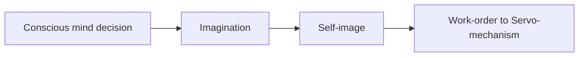
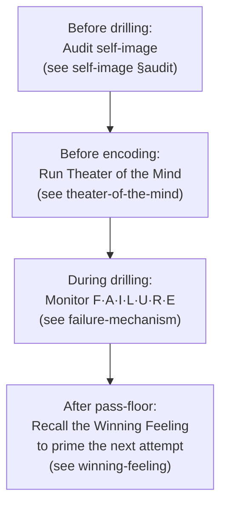

# Psycho-Cybernetics (Maltz 1960 / Kennedy 2001)

**Summary**: Source-summary page for *The New Psycho-Cybernetics* (Maxwell Maltz 1960, updated by Dan S. Kennedy 2001). Maltz reframes the subconscious not as a Freudian id but as a *cybernetic servomechanism* — a guided-missile-style goal-seeking machine that takes a target from imagination + self-image and zig-zags toward it via negative feedback. The book is the **operational ancestor of identity-level learning**: it argues that the **self-image is the upstream gate** of every reflex the wiki's [automaticity pipeline](./automaticity-and-reflex-training.md) tries to build. No drill pushes the learner past the snap-back line that the self-image holds. This makes Maltz the missing prior above the wiki's "highest phase of learning" (Coagulation / automaticity Level 9).

**Sources**: `Clippings/Books/Learning/The New Psycho-Cybernetics by Maxwell Maltz-no-password.pdf` (Prentice Hall Press 2001 edition, 332 pages; ISBN 0-7352-0275-3; original *Psycho-Cybernetics* 1960, sold 30M+ copies across editions).

**Last updated**: 2026-05-24 (initial ingest)

---

## Why this book matters to the wiki

The wiki's pipeline for skill acquisition runs from [comprehension](./5-gates-of-comprehension.md) → [NEDF](./nedf-overview.md) / [CAST](./cast-overview.md) / [SPEAR](./spear-overview.md) encoding → [automaticity training](./automaticity-and-reflex-training.md) → [transfer](./skill-progression-stages.md). The highest phase of this pipeline — Coagulation, the Great Work's 7th operation, automaticity Level 9 — turns cue-action into reflex below verbal thought.

But every wiki page that touches automaticity treats the *learner* as a fixed substrate the pipeline operates on. Maltz argues this is wrong: **the learner is itself a substrate (the [self-image](./self-image.md)) that pre-filters what the pipeline can deliver.** Drilling cannot push the learner past the snap-back line the self-image holds — the rubber band yanks you back even after the gym pass-floor crosses. The pipeline's "Never automate before feedback" rule (which prevents [fossilized errors](./failure-modes-in-encoding.md) in the reflex layer) has an unnamed dual at the *identity* layer: never drill an action whose corresponding self-image hasn't been programmed. Otherwise the action plateaus or regresses.

Maltz also provides the operational protocol for *changing* the self-image — the [Theater of the Mind](./theater-of-the-mind.md) (30 min/day mental rehearsal, 21-day minimum) — and the diagnostic for catching the [Automatic Failure Mechanism](./failure-mechanism.md) mid-activation (F·A·I·L·U·R·E. signals).

This is why the book sits in core-memory palace at level 9: it owns the *upstream gate* of every other learning operation.

---

## Lineage

Maltz built Psycho-Cybernetics on **Norbert Wiener's cybernetics** (1948, MIT) — the science of control and communication in animals, humans, and machines. The word "cybernetics" comes from Greek *kybernētēs*, "steersman." Wiener's WWII work on goal-seeking guided missiles became Maltz's metaphor for the human nervous system: a servomechanism that takes a target, gets feedback from "sense organs," and self-corrects via zig-zag toward the target.

Maltz was a plastic surgeon. He noticed that some patients with reconstructed faces regained confidence; others with identical surgeries stayed miserable. The variable was the **self-image** — what the patient still saw in the mirror, regardless of the actual face. From this he generalised: appearance, ability, achievement are all gated by self-image, not by external reality. (source: pscyho-cybernetics-book-maxwell-maltz.pdf Ch 1)

Dan S. Kennedy's 2001 update preserves Maltz's voice and adds modern examples (Starbucks, Disney, professional golfers, Olympic equestrians, NASA, sales training).

> "Psycho-Cybernetics is, in fact, scientific: It provides practical things to do (not just think about), that yield quantifiable results." (source: pscyho-cybernetics-book-maxwell-maltz.pdf Introduction)

---

## Core architecture (the model)

(source: pscyho-cybernetics-book-maxwell-maltz.pdf Ch 2, "You, As Creator of Your Own Life Experiences")

Each component owns its own wiki page:

| Maltz term | Wiki owner | Role |
|---|---|---|
| Self-image | [self-image](./self-image.md) | The mental blueprint that filters every work-order — the prior |
| Creative Imagination | [theater-of-the-mind](./theater-of-the-mind.md) | The encoder for the self-image (mental rehearsal) |
| Servo-mechanism / ASM | [automatic-success-mechanism](./automatic-success-mechanism.md) | The goal-seeking machine that executes |
| Snap-back effect | [snap-back-effect](./snap-back-effect.md) | The rubber band that yanks back over-reach |
| SUCCESS personality | [success-personality](./success-personality.md) | The 7 traits that trigger the ASM |
| FAILURE signals | [failure-mechanism](./failure-mechanism.md) | The 7 warning lights of the Automatic Failure Mechanism |
| Winning Feeling | [winning-feeling](./winning-feeling.md) | The felt-thermostat of the ASM; recall it to evoke its action-pattern |

---

## The 16-chapter shape (table of contents)

| Ch | Title | Wiki owner / connection |
|---|---|---|
| 1 | The Self-Image: Your Key to Living Without Limits | [self-image](./self-image.md) |
| 2 | How to Awaken the Automatic Success Mechanism Within You | [automatic-success-mechanism](./automatic-success-mechanism.md) |
| 3 | Imagination — The Ignition Key to Your Automatic Success Mechanism | [theater-of-the-mind](./theater-of-the-mind.md) |
| 4 | How to De-Hypnotize Yourself from False Beliefs | [self-image](./self-image.md) §De-hypnotisation; [bridge-load](./bridge-load.md) for false-belief replacement |
| 5 | How to Succeed with the Power of Rational Thinking | [5-gates-of-comprehension](./5-gates-of-comprehension.md); rational-thought coaching session |
| 6 | How to Relax and Let Your Automatic Success Mechanism Work for You | [automatic-success-mechanism](./automatic-success-mechanism.md) §RELAX; [PULSE](./pulse-overview.md) |
| 7 | You Can Acquire the Habit of Happiness | [self-image](./self-image.md) §Habit-of-happiness |
| 8 | Ingredients of the "Success-type" Personality and How to Acquire Them | [success-personality](./success-personality.md) |
| 9 | How to Avoid Accidentally Activating Your Automatic Failure Mechanism | [failure-mechanism](./failure-mechanism.md) |
| 10 | How to Remove Emotional Scars and Give Yourself an Emotional Face Lift | [self-image](./self-image.md) §Emotional scars |
| 11 | How to Unlock Your Real Personality | [self-image](./self-image.md) §Real personality |
| 12 | Do-It-Yourself Tranquilizers that Bring Peace of Mind | [pulse-overview](./pulse-overview.md) (PULSE Stress-side); meditation/relaxation protocols |
| 13 | How to Turn a Crisis into a Creative Opportunity | [problem-solving-os](./problem-solving-os.md); [ARC](./arc-framework.md) reframe |
| 14 | How to Get and Keep "That Winning Feeling" | [winning-feeling](./winning-feeling.md) |
| 15 | More Years of Life and More Life in Your Years | [self-image](./self-image.md) §Longevity (self-image of aging) |
| 16 | True Stories of Lives Changed Using Psycho-Cybernetics | Case anchors for [self-image](./self-image.md) examples |

---

## The five operating principles — AIM · TRUST · RELAX · LEARN · DO

(source: pscyho-cybernetics-book-maxwell-maltz.pdf Ch 2, "Mental Training Exercise" at end)

Maltz's 5-letter operating cycle for the Automatic Success Mechanism. Owned by [automatic-success-mechanism](./automatic-success-mechanism.md); cited as an External-canon ancestor of the [Great Work](./automaticity-and-reflex-training.md)'s final operations (see [glossary](./glossary.md) §External canon citations).

| Letter | Meaning | Wiki cross-reference |
|---|---|---|
| **AIM** | Target must be conceived as "already in existence now" | Great Work *Conjunction* (Select target); [problem-solving-os](./problem-solving-os.md) |
| **TRUST** | The mechanism is tele-logical — supply the goal, the means appear | Great Work *Distillation* (Feedback); [BRIDGE LOAD](./bridge-load.md) guard slot |
| **RELAX** | Negative feedback only works without conscious clamping | [PULSE](./pulse-overview.md) low-stress gate; [automatic-success-mechanism](./automatic-success-mechanism.md) §RELAX |
| **LEARN** | Remember successes, forget failures; trial → error → correction → success | Great Work *Fermentation*; [active-recall](./active-recall.md) |
| **DO** | Act *as if*; let the mechanism work, don't make it work | Great Work *Coagulation* (Automate); [automaticity-and-reflex-training](./automaticity-and-reflex-training.md) |

The cycle is **read-once, hold-five**: cued by name, all 5 unfold without further encoding. Maltz's economy of phrasing is itself a [remaps](./remaps.md) move (Modify-Merge-Move on the verbs of self-help).

---

## The 21-day rule

(source: pscyho-cybernetics-book-maxwell-maltz.pdf Ch 1 and 2, multiple prescriptions)

> "It usually requires a minimum of about 21 days to effect any perceptible change in a mental image. Following plastic surgery it takes about 21 days for the average patient to get used to his new face." (source: pscyho-cybernetics-book-maxwell-maltz.pdf, attributed to Maltz across the work)

The popular "21 days to a habit" myth originates here — though Maltz's original claim is narrower: 21 days is the **minimum to remodel the self-image**, not to install a behavioural habit. (Lally et al. 2010 found behavioural-habit formation averages 66 days, range 18–254.) The wiki adopts 21 days as the **identity-rehearsal floor**, not the habit-formation ceiling — see [theater-of-the-mind](./theater-of-the-mind.md) §Pass-floor.

---

## What Maltz claims that the wiki accepts

1. **The brain operates as a goal-seeking servomechanism.** Confirmed by neuroscience: the basal-ganglia / cerebellum / motor-cortex loop implements exactly the negative-feedback correction Maltz describes for picking up a pencil. (Wolpert & Ghahramani 2000; Shadmehr 2017 *Vigor*.)
2. **Self-image is encoded by authoritative-source × intensity × repetition.** The three levers Maltz names (source credibility, emotional intensity, repetition rate) match the modern consolidation literature on episodic-memory priority encoding (LeDoux on emotional intensity; testimony research on source credibility).
3. **Mental rehearsal recruits the same motor / planning circuits as actual execution.** Confirmed: motor imagery activates supplementary motor area and premotor cortex (Jeannerod 1995; Decety 1996). This is why [theater-of-the-mind](./theater-of-the-mind.md) works for sports performance — the wiki's [visualization-training](./visualization-training.md) already cites this lineage.
4. **Negative feedback drives skill acquisition through zig-zag correction.** Confirmed: motor learning is fundamentally error-driven (Schmidt & Lee *Motor Control and Learning*; Wolpert internal-model literature).
5. **Recall of past success re-evokes the felt-state and primes the corresponding action-pattern.** This is the *winning feeling* mechanism; confirmed by state-dependent learning research (Bower 1981) and by the priming literature on motor sequences.

## What Maltz claims that needs caveats

1. **"Universal mind" / telepathy / Rhine parapsychology** (Ch 2): Maltz endorses J.B. Rhine's Duke parapsychology lab work. The wiki flags this as **non-replicated**; the modern consensus is that Rhine's positive findings did not survive pre-registration discipline (Bem 2011 *feeling the future* failed to replicate; the field has not produced reliable evidence of telepathy / clairvoyance / precognition). Maltz's broader point — that the subconscious has access to associative material the conscious mind can't directly retrieve — stands on incubation-effect research without needing the parapsychology bridge.
2. **"21 days" as universal habit-formation rule** — see above; the original claim is narrower than the popular misquote.
3. **"Genetic predestination is bunk"** (Ch 1) is overstated — heritability of cognitive traits and Big-Five personality is robust at ~40–60% — but Maltz's *operational* point survives: heritability does not determine ceiling, and self-image typically *is* the binding constraint within any given heritable range.
4. **Christian / metaphysical framing** ("our Creator," "divine forgiveness," Ch 15 §Best Self-Image of All) — preserved in the wiki for users it resonates with; users on other metaphysical priors can substitute their own without losing the operational core. The Sabbath / Adventist reader will find Maltz's framing in Ch 11 (Real Personality) and Ch 15 directly compatible with Adventist anthropology (whole-person, not Greek mind/body dualism) — see bible-state-of-the-dead.

---

## Connection to the highest phase of learning

This is the load-bearing claim — see [composability-index](./composability-index.md) confirmed unlock row added 2026-05-24.

The wiki's highest learning phases:

| Axis | Highest state | Page |
|---|---|---|
| Pipeline stage | 8 — Transfer | [skill-progression-stages](./skill-progression-stages.md) |
| Drill ladder stage | 7 — Transfer and zenith | [skill-progression-stages](./skill-progression-stages.md) |
| Automaticity level | 9 — Teaches / debugs others | [skill-progression-stages](./skill-progression-stages.md) |
| Great Work operation | 7 — Coagulation (Automate) | [automaticity-and-reflex-training](./automaticity-and-reflex-training.md) |

Coagulation closes the cue-action loop so the response runs below verbal thought. Maltz adds the **upstream gate**: the response will only run if the self-image accepts the response as belonging to "the kind of person I am." Drilling toward Coagulation without the matching self-image programming plateaus at the [snap-back line](./snap-back-effect.md) — measurably, in the gym, as a pass-floor crossing that doesn't hold across a 7-day gap.

Operationally:

Each step has a METER pass-floor (see [meter-overview](./meter-overview.md)).

---

## METER integration

Maltz did not measure. The wiki does. Every protocol from this book ships with a measurable pass-floor:

| Concept | METER metric | Pass-floor |
|---|---|---|
| Self-image audit | "Kind of person I am" sentence written + reviewed weekly | ≥6/8 weeks |
| AIM·TRUST·RELAX·LEARN·DO recall | Full cycle recall under cold start | <8s |
| S·U·C·C·E·S·S. mnemonic | All 7 traits + 1 example each | mnemonic <6s, examples <30s |
| F·A·I·L·U·R·E. scan | Self-scan when Stress ≥4 | completion <60s |
| Theater of the Mind | 30 min/day session, 21-day streak | 21 consecutive days |
| Winning Feeling recall | Re-evoke a stored past-success felt-state | <5s |
| Snap-back detection | Detection event count | ≥1 logged per week during identity-change phase |

The new SPARK T3 (Knowing) candidate: if a drilling plateau lifts after a completed Theater-of-the-Mind 21-day cycle — measured by a gym-pass-floor crossing that the prior drill-only block did not produce — the self-image-ceiling hypothesis fires as a confirmed unlock. See [spark-overview](./spark-overview.md) §Bidirectional priming.

---

## Mnemonic and checksum (per [representation-rules](./representation-rules.md))

**Mnemonic (single image)**: a brass guided-missile (the [ASM](./automatic-success-mechanism.md)) flying through Maltz's *Theater of the Mind*, with the [self-image](./self-image.md) as the painted target on the wall — the missile zig-zags via negative feedback, but only ever lands on the painting that's actually there.

**Checksum**: name (a) the 5-letter operating cycle AIM·TRUST·RELAX·LEARN·DO, (b) one personally-experienced [snap-back](./snap-back-effect.md) episode from the last 30 days, and (c) one stored past-success that re-evokes the [winning-feeling](./winning-feeling.md) within 5 seconds. If you can do all three, the book's operational core is encoded.

---

## Related pages

- [self-image](./self-image.md) — the upstream gate
- [automatic-success-mechanism](./automatic-success-mechanism.md) — the servo + 5-letter operating cycle
- [theater-of-the-mind](./theater-of-the-mind.md) — the rehearsal protocol
- [winning-feeling](./winning-feeling.md) — the felt-thermostat
- [snap-back-effect](./snap-back-effect.md) — the rubber band
- [success-personality](./success-personality.md) — S·U·C·C·E·S·S.
- [failure-mechanism](./failure-mechanism.md) — F·A·I·L·U·R·E.
- [automaticity-and-reflex-training](./automaticity-and-reflex-training.md) — where this book bolts on as upstream
- [skill-progression-stages](./skill-progression-stages.md) — the highest-phase axes
- [composability-index](./composability-index.md) — the unlocks registered from this ingest
- [glossary](./glossary.md) — registered terms
- [remaps](./remaps.md) — the wiki's transformation moves (REMAPS' Sensations move maps onto Maltz's Theater-of-the-Mind sensory richness rule)
- [memory-palace-for-aphantasia](./memory-palace-for-aphantasia.md) — the structural-scaffolding mode that supports identity-rehearsal without spontaneous imagery
- [world-velvet-aeon](./world-velvet-aeon.md) §Identity sub-mode — the visual register for identity-rehearsal scenes

---

## U — See (CAST)

1. Brain = servo-mechanism (Wiener 1948) + self-image (Maltz 1960) + imagination encoder
2. Edges: self-image → ASM target → action → feedback → stored success → winning-feeling → next attempt
3. Three external-canon ancestors: Wiener (cybernetics), Maltz (self-image), Kennedy (operational update)

## D — Name (NEDF)

1. Psycho-Cybernetics = cybernetic servomechanism applied to identity-level self-improvement
2. The book is the *prior* above the wiki's automaticity pipeline
3. Three load-bearing protocols: Theater of the Mind, Winning Feeling recall, F.A.I.L.U.R.E. scan

## F — Do (SPEAR)

1. Before drilling → run Self-Image Audit
2. Before encoding → run 21-day Theater-of-the-Mind cycle
3. After pass-floor → recall the Winning Feeling to prime the next attempt
4. When Stress ≥4 → run F.A.I.L.U.R.E. scan; restore RELAX before continuing

## B — Watch (HEART)

1. Drilling forever past a ceiling that's actually upstream (self-image)
2. Theater-of-the-Mind sessions running on Velvet Aeon's *romantic-ruin* preserve (primes the failure mechanism — use Identity sub-mode)
3. Conflating "21 days" with habit-formation (it's identity-rehearsal floor, not habit ceiling)
4. Importing Maltz's universal-mind / Rhine parapsychology framing uncritically

## L — Predict (ORACLE)

1. Drilling plateaus that don't move after 3 weeks of mixed/random drills → check self-image, not drill difficulty
2. Pass-floor crossings that don't hold across a 7-day gap → snap-back line is upstream
3. A learner who can't name a Winning Feeling memory ≤5s → ASM not yet recalibrated

## R — Act (GRACE)

1. New skill ambition that's identity-distant → start with Theater of the Mind, not drills
2. Detected F.A.I.L.U.R.E. signal during a session → RELAX gate, defer the drill
3. New T3 Knowing event after identity-cycle completion → file in `wiki/unlocks/` and SPARK ceremony
