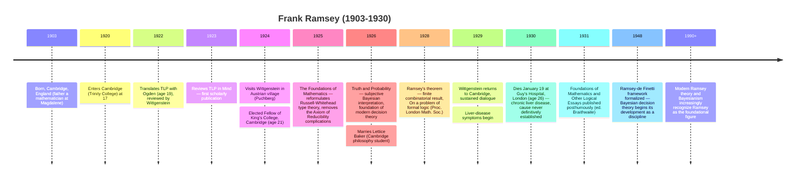

# Frank Ramsey (1903–1930)

**Summary**: English mathematician + philosopher; **assisted C. K. Ogden in translating [TLP](./tractatus-logico-philosophicus.md)** into English at age **19** (1922); **independently developed truth-functional analysis of logical paradoxes**, the subjective interpretation of probability ("Truth and Probability", 1926), Ramsey's theorem in combinatorics (1928), and the structure of pragmatist epistemology. Died at **26** of liver disease (1930). The most underappreciated figure of early-20th-century philosophy + logic; **a counter-instance to [the substrate thesis](./logicians-madness-substrate-thesis.md)** — Ramsey did foundations-grade work and died young from *disease*, not from substrate collapse. His tragedy was *medical*, not *psychological*.

**Sources**:
- D.H. Mellor, *F.P. Ramsey: Notes on a Lifetime* (Routledge 1990) — concise scholarly overview.
- Cheryl Misak, *Frank Ramsey: A Sheer Excess of Powers* (Oxford UP 2020) — recent comprehensive biography.
- Ramsey's primary works: *The Foundations of Mathematics and Other Logical Essays* (posth. 1931, ed. R.B. Braithwaite); *Truth and Probability* (1926); various contributions to *Mind*, *Mathematische Annalen*.
- Mention in Russell's introduction to TLP: *"Mr. F. P. Ramsey has assisted me in the revision of the translation of Wittgenstein's text."*
- [tractatus-logico-philosophicus](./tractatus-logico-philosophicus.md) · [wittgenstein-ludwig](./wittgenstein-ludwig.md) — biographical connections.

**Last updated**: 2026-05-25

---

## One-line

> 19 years old when he assisted with TLP's English translation; 23 when he wrote "Truth and Probability" inventing the *subjective Bayesian* interpretation of probability; 25 when he proved what is now called *Ramsey's theorem* in combinatorics; **dead at 26** of liver disease. Did more by 26 than most philosophers do in 60 years.

## Unlocks (lead, not footer)

1. **Counter-instance to the substrate thesis.** Ramsey's biography would otherwise be the *ideal* substrate-thesis instance — foundations-grade work in formal logic, sustained engagement with the TLP cast (Wittgenstein, Russell, Moore), Cambridge intellectual milieu. **But Ramsey's death was medical** — chronic jaundice progressing to liver failure, possibly from undiagnosed leptospirosis from swimming. **The substrate thesis is a thesis about a *specific* failure mode** (regress-pursuing + isolation + perfectionism → collapse), not about *any* premature death of foundations workers. Ramsey's case clarifies the thesis's boundary.

2. **Subjective Bayesian interpretation of probability — invented 1926.** Ramsey's "Truth and Probability" (1926) proposed that **probability is degree of rational belief**, measurable by betting behavior. The *Ramsey-de Finetti* framework (Bruno de Finetti developed similar ideas independently 1931) is the foundation of modern Bayesian decision theory. **This is the position [Copi Ch 14](./probability-as-logic.md) doesn't reach.** Ramsey reached it in 1926; mainstream probability theory took 50 more years to catch up.

3. **Ramsey theory in combinatorics.** Ramsey's 1928 paper proved what's now called the **finite Ramsey theorem**: for any coloring + size, there exists a sufficiently large structure containing a monochromatic substructure of the desired size. *"Complete disorder is impossible"* — a famous Mottos summary. **Ramsey numbers** (R(s,t) = smallest n such that any 2-coloring of edges of K_n contains a monochromatic K_s or K_t) are still active research; R(5,5) is unknown.

4. **The TLP-translation contribution.** Ramsey at 19 worked through TLP with Ogden, providing technical corrections, suggested word choices, and a sustained dialogue with Wittgenstein (who reviewed the translation himself). Ramsey is the **invisible third voice** behind the Ogden translation; many of the cleaner readings in Ogden are Ramsey's. **The TLP that English-speaking philosophers read in 1922-1961 (until Pears/McGuinness) is partly Ramsey's.**

## Mnemonic

**19-22-23-25-26** = *19 TLP translation · 22 Cambridge fellowship · 23 Bayesian probability · 25 Ramsey theorem · 26 death.*

Five anchor ages. Ramsey did more by 26 than most philosophers do in 60 years.

## Memory checksum

1. **What did Ramsey do for TLP?** (Assisted C.K. Ogden with the English translation 1922, at age 19. Provided technical corrections; sustained dialogue with Wittgenstein. The Ogden TLP that English-speaking philosophers read 1922-1961 is partly Ramsey's work.)
2. **State Ramsey's contribution to probability.** ("Truth and Probability" (1926): probability as *degree of rational belief* measurable by betting behavior. Foundation of modern Bayesian decision theory. **Anticipates what [Copi Ch 14](./probability-as-logic.md) doesn't reach.**)
3. **State Ramsey's theorem (paraphrase).** (Combinatorial: for any coloring + structure size, sufficiently large structures contain monochromatic substructures of the desired size. *"Complete disorder is impossible."* 1928.)
4. **How and when did Ramsey die?** (January 19, 1930, at Cambridge. Age 26. Chronic liver disease (jaundice progressing to liver failure); possible cause leptospirosis from swimming; cause of death not definitively established at the time.)
5. **Why is Ramsey a counter-instance to the substrate thesis?** (Ramsey did foundations-grade work with sustained engagement with the TLP cast in the Cambridge intellectual milieu. The substrate thesis would otherwise *predict* him as a case. **But his death was medical (liver disease), not from substrate collapse.** The thesis is about a *specific* failure mode; Ramsey's death was a different kind of tragedy.)

## Visual — the 5-year window

The 5-year productive window (1925-1929) contains foundations-grade contributions in **three different fields** (foundations of math, probability theory, combinatorics). Few biographies match the density.

---

## The TLP translation contribution (1922)

C.K. Ogden published TLP's English translation in 1922 under his own name, with Russell's introduction prominent. **Ramsey at 19** was the technical assistant. The 1922 Ogden TLP that Wittgenstein himself approved was the result of:

1. Wittgenstein's German manuscript.
2. Ogden's draft translation.
3. Ramsey's technical review (he had read TLP in German and consulted Wittgenstein on specific passages).
4. Wittgenstein's review of the Ogden-Ramsey draft (letters back-and-forth).

**Specific Ramsey contributions** (per Ogden's preface and subsequent scholarship):
- Clarifications of *Sachverhalt* vs *Tatsache* in early propositions.
- Suggestions for technical terminology (e.g., the rendering of the N-operator).
- Identifying genuine ambiguities in the German that required choice in translation.

Ramsey's review of TLP in *Mind* (1923) is the **first sustained scholarly engagement with TLP in English** — a year before any major philosopher published on it. The review is technically acute, friendly in tone, and pre-dates much of what would later become standard Wittgenstein scholarship.

## The 1924-1925 Wittgenstein visits

Ramsey visited Wittgenstein in 1923-1924 while Wittgenstein was teaching primary school in the Austrian village of Puchberg. **Ramsey, 20-21 years old, was sent by Cambridge to consult with Wittgenstein on philosophical issues** — an unusual responsibility for someone that young.

The visits produced:
- Sustained dialogue with Wittgenstein on TLP's content.
- Ramsey's understanding that Wittgenstein had changed views since TLP (the seeds of *Investigations*).
- The professional relationship that contributed to Wittgenstein's eventual return to Cambridge in 1929.

Wittgenstein's letters to Ramsey from this period (preserved) document the friendship: distant, intellectually intense, with Ramsey often the more accessible figure.

## "Truth and Probability" (1926)

Ramsey's most-cited paper. The thesis:

> **Probability is degree of rational belief.** It is not (a priori) frequency, not (relative) limiting frequency, but the betting behavior of a rational agent under uncertainty.

The technical machinery:
1. A rational agent's preferences over outcomes can be represented by a utility function.
2. The agent's beliefs about uncertain events can be represented by a probability function.
3. **Both functions are revealed by the agent's betting behavior** — what odds would they accept on which outcomes.
4. Coherence: the bets accepted should not be exploitable (Dutch-book argument).
5. The probability function so derived satisfies the standard probability axioms (Kolmogorov 1933 later formalized the axioms; Ramsey anticipated them).

**Ramsey's contribution**: the subjective Bayesian interpretation of probability, *operationalized* through betting behavior + the Dutch-book argument.

**Where it lands in the wiki**:
- [Copi Ch 14](./probability-as-logic.md) treats only a priori + relative-frequency interpretations.
- [probability-as-logic](./probability-as-logic.md) §What Copi doesn't cover queues Jaynes 2003 as Wave-2 supplement.
- **Ramsey 1926 is the historical anchor of this whole interpretation.** Bruno de Finetti developed similar ideas independently in 1931; the position is now called *Ramsey-de Finetti*.

Mainstream probability theory took 50+ years to absorb Ramsey-de Finetti as a respectable interpretation; the Bayesian revolution in statistics (Savage 1954, Jaynes 1957+) is the slow propagation of Ramsey 1926.

## Ramsey's theorem (1928)

In a paper titled "On a problem of formal logic" (*Proceedings of the London Mathematical Society*, 1930 — submitted 1928, published posthumously), Ramsey proved:

> **Finite Ramsey theorem**: for any positive integers *r, k, n*, there exists a positive integer *N* such that if the *r*-element subsets of an *N*-element set are colored with *k* colors, then there exists an *n*-element subset all of whose *r*-element subsets are the same color.

**In plainer language**: any sufficiently large structure must contain a monochromatic substructure of any desired size.

**Famous corollary**: at any party of 6 people, either 3 mutually know each other or 3 are mutual strangers. (*R(3,3) = 6.*)

The field that grew up around this result — **Ramsey theory** — is one of the most active areas of modern combinatorics:
- **Ramsey numbers** *R(s, t)* = smallest *N* such that any 2-coloring of the edges of *K_N* contains a monochromatic *K_s* or *K_t*. *R(5,5)* is unknown (between 43 and 48 as of recent results).
- **Infinite Ramsey theorem** + transfinite extensions: descriptive set theory.
- **Graph Ramsey theory** + hypergraph Ramsey theory + structural Ramsey theory.
- **Applications** in theoretical computer science, communications, game theory.

Ramsey's 1928 paper was motivated by a problem in mathematical logic (decidability of first-order classes), but the combinatorial theorem proved more fundamental than the original logical question.

## "The Foundations of Mathematics" (1925)

Ramsey's reformulation of Russell-Whitehead's type theory. Ramsey distinguished:
- **Logical paradoxes** (Russell's paradox) — arise from set-theoretic considerations; addressable by simple type theory.
- **Semantic paradoxes** (Liar, Berry) — arise from confusion between object-language and meta-language; addressable separately.

Ramsey argued that **only logical paradoxes need to be addressed at the level of the formal system**; semantic paradoxes are linguistic confusions resolvable independently. This **simplified Russell's ramified type theory** significantly:
- Russell needed both type stratification AND order stratification to handle both paradox families.
- Ramsey showed type stratification alone suffices for logical paradoxes; semantic paradoxes go elsewhere.
- The **Axiom of Reducibility** (Russell-Whitehead's ad hoc patch) is unnecessary in Ramsey's reformulation.

**Ramsey's 1925 result is the first major improvement on *Principia Mathematica* by anyone.** It would have made *PM*'s second edition (1925-1927) substantially cleaner if Russell-Whitehead had adopted it; they didn't.

## The death (1930)

Ramsey developed jaundice in 1929, progressing through 1929 to liver failure. He was admitted to Guy's Hospital, London, in January 1930. He died January 19, 1930 — age 26.

**The cause of death was never definitively established.** Possibilities:
- **Leptospirosis** (Weil's disease) from swimming in the river Cam — most likely candidate per modern medical retrospective.
- **Viral hepatitis** — another possibility.
- **Hereditary liver disease** — Ramsey's father had health issues; no clear genetic pattern.

**1930 medicine could not diagnose definitively**; liver transplants didn't exist; even effective supportive care was limited. The death was a *medical* tragedy, not a *substrate* tragedy.

## Why Ramsey is a counter-instance to the substrate thesis

The [substrate thesis](./logicians-madness-substrate-thesis.md) predicts that foundations-grade work + isolation + perfectionism converges on a specific kind of collapse. Ramsey's biography:

| Component | Present in Ramsey? |
|---|---|
| Regress-pursuing inside a closed formal system | YES — foundations of math + probability + combinatorics |
| Social isolation from non-domain peers | **NO** — Ramsey was deeply embedded in Cambridge: Trinity, then King's; friendly with Russell, Wittgenstein, Moore, Braithwaite, Keynes; married happily to Lettice; rich relational substrate |
| Abstract perfection as personal standard | PARTIAL — Ramsey was modest about his own work; published much less than he could have; not characterized by self-flagellation |

**Two of the three components absent.** The thesis predicts no substrate-collapse — and indeed Ramsey's biography shows no substrate-collapse pattern.

**His death was from a different cause entirely.** Liver disease, possibly from swimming, in an era without effective treatment.

**Ramsey clarifies the thesis's boundary**: the substrate thesis is about a *specific* failure mode (regress + isolation + perfectionism → collapse), not about *any* premature death of foundations workers. Ramsey is the worked counter-example — full intellectual engagement, no substrate failure, death from medical cause.

## Cross-link to the wiki

| Wiki layer | Ramsey's contribution |
|---|---|
| [probability-as-logic](./probability-as-logic.md) | Ramsey 1926 is the foundation of subjective Bayesian probability (the interpretation Copi Ch 14 doesn't reach) |
| [principia-mathematica](./principia-mathematica.md) | Ramsey 1925 reformulation removes the Axiom of Reducibility |
| [russells-paradox](./russells-paradox.md) | Ramsey distinguished logical from semantic paradoxes |
| [tractatus-logico-philosophicus](./tractatus-logico-philosophicus.md) | Ramsey assisted with the 1922 Ogden translation |
| [wittgenstein-ludwig](./wittgenstein-ludwig.md) | Ramsey's 1923-1924 visits and sustained dialogue helped Wittgenstein return to Cambridge in 1929 |
| [logicians-madness-substrate-thesis](./logicians-madness-substrate-thesis.md) | Ramsey as the **counter-instance** clarifying the thesis's boundary |
| [bertrand-russell](./bertrand-russell.md) | Ramsey reviewed TLP for Russell's circle; engaged with *Principia* via the 1925 reformulation |

## METER integration

| Drill | Pass floor | Source |
|---|---|---|
| Name Ramsey's 3 main contributions and their dates | <30 s | this page §Mnemonic |
| State Ramsey's interpretation of probability | <30 s | this page §Truth and Probability |
| State Ramsey's theorem (paraphrase) | <30 s | this page §Ramsey's theorem |
| Explain why Ramsey is a counter-instance to the substrate thesis | <60 s | this page §Counter-instance |
| Name 3 modern fields descended from Ramsey's work | <30 s | this page (Bayesian decision theory · Ramsey theory · TLP scholarship) |

## Related pages

- [tractatus-logico-philosophicus](./tractatus-logico-philosophicus.md) — the Ogden-Ramsey translation
- [wittgenstein-ludwig](./wittgenstein-ludwig.md) — Ramsey's friendship and sustained dialogue
- [bertrand-russell](./bertrand-russell.md) — Ramsey's reformulation of *Principia*
- [principia-mathematica](./principia-mathematica.md) — Ramsey 1925 removed the Axiom of Reducibility complications
- [russells-paradox](./russells-paradox.md) — Ramsey's distinction between logical and semantic paradoxes
- [probability-as-logic](./probability-as-logic.md) — Ramsey 1926 is the missing interpretation
- [logicians-madness-substrate-thesis](./logicians-madness-substrate-thesis.md) — Ramsey as counter-instance
- [foundations-crisis](./foundations-crisis.md) — Ramsey worked within but did not succumb to the crisis
- [memory-paradox](./memory-paradox.md) — Ramsey's modest take on his own work
- [glossary](./glossary.md) — Logic layer registration
