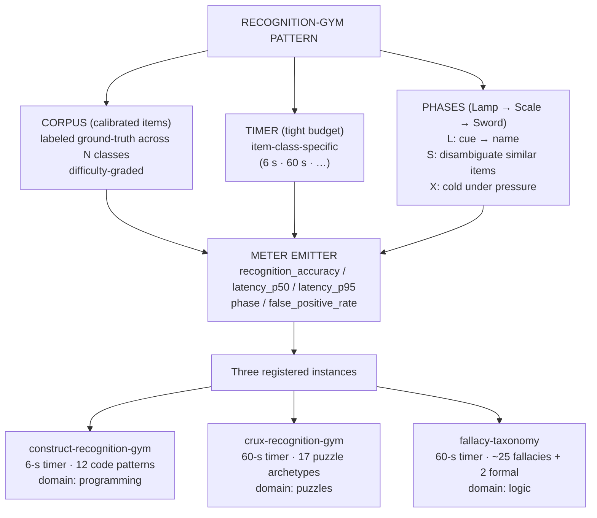

# Recognition-Gym Pattern

**Summary**: An **architectural primitive** registered in [composability-index](./composability-index.md): a [Red Queen Gym](./red-queen-skill-gym.md) instance that drills *recognition-of-which-pattern-applies* under a tight time budget. Promoted from candidate-pattern to owner page on 2026-05-25 after the 3rd registered instance ([Fallacy-Recognition Gym](./fallacy-taxonomy.md)) joined the prior two (construct-recognition-gym for code patterns, [crux-recognition-gym](./crux-recognition-gym.md) for puzzle crux). The pattern's invariant: a calibrated corpus + a per-item identification task + a tight timer + Lamp/Scale/Sword phase progression + METER telemetry. Three instances ≡ three domains; the pattern itself is now an explicit operational primitive future instances can follow without reverse-engineering.

**Sources**:
- [composability-index](./composability-index.md) candidate-pattern registry — recognition-gym row at N=2 (2026-05-24), promoted to N=3 by [fallacy-taxonomy](./fallacy-taxonomy.md) (2026-05-25).
- The three registered instances: construct-recognition-gym (code-pattern recognition, 6-s timer), [crux-recognition-gym](./crux-recognition-gym.md) (puzzle crux recognition, 60-s timer), [Fallacy-Recognition Gym](./fallacy-taxonomy.md) (informal fallacy recognition, 60-s timer).
- Sibling architectural primitives: [substrate-algorithm-composition](./substrate-algorithm-composition.md) · glyph-grammar-pattern.

**Last updated**: 2026-08-20 (`glyph:` assigned — [representation-rules](./representation-rules.md) Rule 11); 2026-05-25

---

## One-line

> A Red Queen Gym whose drill is *"name the pattern this item exemplifies, under timer."* The invariant that survives across domains: classification reflex under tight time pressure, with Lamp → Scale → Sword phase progression and METER telemetry.

## Unlocks (lead, not footer)

1. **Future instances follow a recipe, not reverse-engineering.** Pre-promotion, building a 4th recognition-gym instance required reading two specific instances and inferring the shape. Post-promotion, the recipe is on this page — pick a corpus, a taxonomy, a timer, build the gym.

2. **METER metrics are uniform across instances.** All three existing gyms emit `recognition_accuracy`, `recognition_latency_p50`, `recognition_latency_p95`, `phase` (Lamp/Scale/Sword), `false_positive_rate`. A METER consumer can aggregate across domains without per-gym translation.

3. **The pattern names which gyms are NOT recognition gyms.** A *generation* gym (build the thing from scratch) is not a recognition gym. A *retrieval* gym (recall the definition) is not a recognition gym. A *production* gym (apply the move correctly) is not a recognition gym. The pattern's boundary is sharp: classification *of an already-presented item* under timer.

4. **Cross-instance transfer.** Building proficiency in one recognition gym lowers the entry cost of the next — the meta-skill of "calibrate against a corpus and emit a classification under timer" is itself trained. Hypothesis: a user who passes the Sword phase of construct-recognition-gym reaches the Scale phase of [Fallacy-Recognition Gym](./fallacy-taxonomy.md) ~30% faster than a recognition-gym novice. Candidate METER metric: cross-instance transfer rate.

## Mnemonic

**C-T-P** = *Corpus · Timer · Phases.*

Three ingredients, in order:
- **Corpus**: a calibrated set of items with ground-truth labels.
- **Timer**: a tight time budget (6 s · 60 s · context-specific).
- **Phases**: Lamp (recognition from cue) → Scale (discrimination between similar items) → Sword (cold classification under pressure).

The mnemonic *Corpus-Timer-Phases* is the build recipe.

## Memory checksum

If you can answer these in <60 s each from memory, the page is encoded:

1. **State the pattern's invariant.** (A Red Queen Gym instance that drills classification-of-which-pattern-applies on items from a calibrated corpus, under a tight timer, through Lamp → Scale → Sword phases, with uniform METER telemetry.)
2. **Name the three registered instances.** (construct-recognition-gym for code patterns, 6-s timer; [crux-recognition-gym](./crux-recognition-gym.md) for puzzle crux, 60-s timer; [Fallacy-Recognition Gym](./fallacy-taxonomy.md) for informal fallacies, 60-s timer.)
3. **What is NOT a recognition gym?** (Generation gyms, retrieval gyms, production gyms — they exercise different skills. Recognition is classification *of an already-presented item* under timer.)
4. **Name the three phases.** (Lamp = recognition from cue; Scale = discrimination between similar items; Sword = cold classification under pressure.)
5. **Name the uniform METER fields.** (`recognition_accuracy` · `recognition_latency_p50` · `recognition_latency_p95` · `phase` · `false_positive_rate`.)

## Visual — the pattern skeleton



The three instances differ in *corpus*, *timer scale*, and *taxonomy size*; they agree on *structure*, *phase progression*, and *METER schema*.

---

## The invariant (build recipe)

To build a 4th recognition gym in any domain, supply five ingredients:

### 1. A calibrated corpus

A set of items with **ground-truth labels** the gym can grade against. The corpus must be:
- **Diverse enough** to require actual classification (not surface-keyword matching).
- **Labeled by an authority** (textbook, expert review, prior wiki ingest).
- **Difficulty-graded** so the gym can scale from gentle to adversarial.
- **Large enough** to prevent memorization of the specific items (typically ≥100 items for serious drilling).

Examples:
- construct-recognition-gym: 12 code patterns × ≥10 snippets each = ≥120 items.
- [crux-recognition-gym](./crux-recognition-gym.md): the 211-puzzle [livingstone-thomson-brain-teasers](./livingstone-thomson-brain-teasers.md) corpus.
- [Fallacy-Recognition Gym](./fallacy-taxonomy.md): ~50 worked examples + ~100 exercises from [Copi](./copi-introduction-to-logic.md) Ch 4.

### 2. A taxonomy

The set of **classes** the gym recognizes. Must be:
- **Closed and explicit** (no "miscellaneous" bucket — every item belongs to exactly one class).
- **Owned by a wiki page or named authority** (no inventing categories on the fly).
- **Small enough to be reflexive** (≥3, ≤30 classes; beyond 30 the recognition reflex degrades).
- **Disjoint enough** that Scale-phase discrimination is meaningful.

Examples:
- 12 code-construct classes (loops, recursion, dict access, …).
- 17 puzzle archetypes (A–R, no Q-skip; [puzzle-archetype-taxonomy](./puzzle-archetype-taxonomy.md)).
- ~25 named fallacies + 2 formal = 27 classes ([fallacy-taxonomy](./fallacy-taxonomy.md)).

### 3. A timer

A **per-item time budget** chosen to put the recognition under pressure without making the task impossible. Calibration:

| Domain feature | Timer guidance |
|---|---|
| Item has no embedded narrative noise | 5–10 s |
| Item is a single sentence or symbol | 5–15 s |
| Item is a short paragraph | 30–60 s |
| Item is a multi-paragraph passage | 60–180 s |
| Item is multi-modal or has decoration | scale up by 1.5–2× |

The 6-s vs 60-s vs 180-s timer reflects the natural reading time of the items. The timer is **tight** — designed so a recognition reflex either fires under load or doesn't.

### 4. Three-phase progression

**Lamp · Scale · Sword** ([automaticity-and-reflex-training](./automaticity-and-reflex-training.md) phase taxonomy):

| Phase | Drill | What it builds |
|---|---|---|
| **Lamp** (Recognition) | Show a labeled item; recall the class from a cue | Cue → class binding |
| **Scale** (Discrimination) | Show two similar items, one of each of two classes; pick the right one | Class boundaries; resistance to surface confusion |
| **Sword** (Pressure) | Show an unlabeled item under timer; declare class | Cold reflex under pressure |

Each phase has its own pass-floor; you cannot advance to Sword without passing Scale.

### 5. METER telemetry (uniform schema)

Every recognition gym emits the same fields:

| METER field | What it captures |
|---|---|
| `recognition_accuracy` | Fraction of correct classifications in a session |
| `recognition_latency_p50` | Median per-item classification time |
| `recognition_latency_p95` | 95th-percentile per-item time (tail signal) |
| `phase` | Current Lamp/Scale/Sword phase |
| `false_positive_rate` | Fraction of items declared a class other than ground-truth |
| `pattern` | (this page's name) so aggregators can scope across instances |
| `instance` | (the specific gym's name, e.g. `crux-recognition-gym`) |

This shared schema lets a METER consumer aggregate across instances ("how is my classification reflex across domains?") without per-gym translation.

---

## What is NOT a recognition gym (the boundary)

The pattern is sharp. Adjacent skill-gym shapes are *not* recognition gyms:

| Skill-gym shape | Why it's not recognition | What it is |
|---|---|---|
| **Generation gym**: write a snippet that exemplifies a class | Builds production reflex, not recognition | Production gym |
| **Retrieval gym**: state the definition of a class | Tests memory, not classification | Recall gym |
| **Application gym**: apply a class's procedure to a problem | Tests use, not identification | Production gym |
| **Translation gym**: convert an item from one representation to another | Tests transformation, not classification | Transformation gym |
| **Estimation gym**: predict a numerical answer | Tests quantitative reasoning, not classification | Estimation gym |

The boundary: recognition gyms take an **already-presented item** and emit a **class label** under **timer**. Anything else is a sibling-pattern, not an instance.

## Common failure modes when building a recognition gym

- **Taxonomy too small** (<3 classes): recognition collapses to detection; binary tasks aren't recognition gyms.
- **Taxonomy too large** (>30 classes): recognition reflex degrades; the user falls back to slow conscious classification.
- **Corpus too small**: memorization of specific items defeats classification training.
- **Timer too loose**: the gym is a retrieval test, not a recognition reflex.
- **Timer too tight**: the gym becomes guessing; floor metric noisy.
- **Classes overlap**: Scale-phase discrimination becomes meaningless; the gym trains arbitrary distinctions.
- **No ground-truth labels**: there's nothing to grade against; the gym can't emit `recognition_accuracy`.
- **Phases not isolated**: drilling Sword before Scale fossilizes wrong classifications.

## METER cross-instance transfer (candidate metric)

**Hypothesis**: training in any one recognition gym lowers the time-to-pass-floor in another by a measurable amount, because the *meta-skill* of "classify-under-timer" generalizes. Pre-registered METER metric:

```
cross_instance_transfer = (time_to_pass_naive - time_to_pass_after_prior) / time_to_pass_naive
```

Where `time_to_pass_naive` is days-to-reach-Sword-floor for a recognition-gym novice, and `time_to_pass_after_prior` is the same for a user who has passed at least one other recognition-gym instance.

If the hypothesis holds (target ≥20% reduction), the pattern itself has empirical support beyond the structural homology of its instances.

## Sibling architectural primitives

The recognition-gym pattern joins two prior architectural primitives in [composability-index](./composability-index.md) §Patterns:

| Pattern | Owner | Instances |
|---|---|---|
| [substrate-algorithm-composition](./substrate-algorithm-composition.md) | Original primitive | ~15 confirmed (Soroban × place-value · Vedic × peg-substrate · etc.) |
| glyph-grammar-pattern | Promoted 2026-05-XX | 3 (code-glyph · AWS-glyph · math-proof-glyph) |
| **Recognition-gym pattern** | This page | 3 (construct · crux · fallacy) |

Each promoted pattern follows the same rule: 3 instances → owner page exists; the page extracts the invariant so future instances follow a recipe.

## Candidate instance — driving-exam distractor anatomy (2026-06-11; restored 2026-06-12)

The Georgian B/B1 exam bank (source: teoria-b-tickets-en.pdf) reuses one distractor architecture across themes: the **only-vs-both swap** (a split statute offered as "only" half), the **near-neighbor number** (80 beside 90, 3 s beside 4 s), and the **vehicle-type substitution** (true rule, wrong vehicle) — concentrated in T5 (prohibition signs), T10 (traffic lights), T11 (regulator signals), T20 (intersections). Training the *wrong answer's shape*, not just the right answer, is the gym: see georgian-driving-exam-b-drill-ladder (rungs 2–3) and georgian-driving-exam-b-sign-glyph-grammar (sign→meaning <2 s; regulator-gesture→permitted-directions). **Measured 2026-06-12:** the inclusive option wins only 67/128 (52%) of only/both questions — the gym must train *recognize-then-verify*, never auto-pick; auto-picking is itself the trap the bank sets for pattern-users. **Status: candidate, not promoted** — the confirmed-instance count is unchanged. Boundary question for promotion: classifying wrong-answer *shapes* sits near the [anti-tactic-detection](./anti-tactic-detection.md) sibling; decide which primitive owns it before promoting to a 4th confirmed instance.

## Related pages

- georgian-driving-exam-b-drill-ladder — candidate instance: driving-exam distractor-anatomy gym
- georgian-driving-exam-b-sign-glyph-grammar — candidate instance: sign / regulator-gesture recognition gyms
- construct-recognition-gym — 1st instance (code patterns, 6-s timer)
- [crux-recognition-gym](./crux-recognition-gym.md) — 2nd instance (puzzle crux, 60-s timer)
- [fallacy-taxonomy](./fallacy-taxonomy.md) — owner of the 3rd instance (Fallacy-Recognition Gym, 60-s timer)
- [red-queen-skill-gym](./red-queen-skill-gym.md) — parent infrastructure (Lamp/Scale/Sword phases, METER telemetry)
- [automaticity-and-reflex-training](./automaticity-and-reflex-training.md) — Lamp/Scale/Sword phase taxonomy
- [composability-index](./composability-index.md) — pattern registry (this page promoted from candidate to owner)
- [substrate-algorithm-composition](./substrate-algorithm-composition.md) — sibling architectural primitive
- glyph-grammar-pattern — sibling architectural primitive
- [prism-pattern-discovery](./prism-pattern-discovery.md) — the *discovery* half of the builder ↔ recognizer pair: PRISM finds the pattern slowly, the gym names it in seconds; every Pattern Card's Recognition-cues slot is a gym stimulus
- [meter-overview](./meter-overview.md) — measurement layer schema
- [logic-atomic-design](./logic-atomic-design.md) — Wave 1 logic hub that contributed the 3rd instance
- [glossary](./glossary.md) — Logic layer registration
