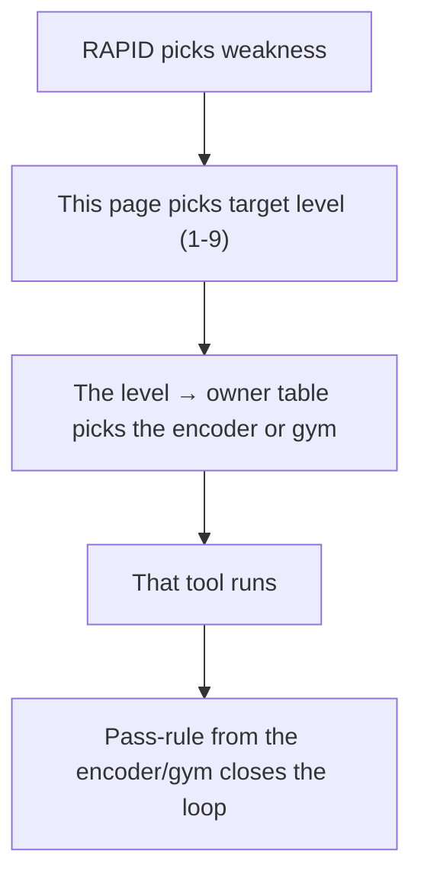

# Red Queen Knowledge Ladder

**Summary**: A universal taxonomy of knowledge levels with a decision rule for selecting the correct training target per piece of knowledge. Sits above the Neural OS encoders (NEDF, CAST, SPEAR, HEART) and the Red Queen performance layer as the *target-selection* decision: given some knowledge, which level of mastery should I aim for, and which is wasteful?

**Sources**:
- User-authored framework, 2026-05-06
- [red-queen-skill-gym](./red-queen-skill-gym.md)
- [rapid-in-neural-os](./rapid-in-neural-os.md)
- [drill-generator](./drill-generator.md)
- [problem-solving-maturity-levels](./problem-solving-maturity-levels.md)
- [framework-comparison-matrix](./framework-comparison-matrix.md)
- [software-design-principles-for-neural-os](./software-design-principles-for-neural-os.md)

**Last updated**: 2026-07-11 — reconciled all rung names to the canonical 0–9 ladder (Unknown→Strategic), matching the `neural-os-school` gym implementation (`App\Support\KnowledgeLadder`).

---

> **Naming note.** The rungs are named by the **0–9 ladder** (Unknown · Familiar · Explainable · Retrievable · Classifiable · Operational · Executable · Reflexive · Transferable · Strategic). Earlier drafts used descriptive category names (Recognition · Explanation · Recall · Classification · Action · Execution · Speed · Adaptation · Judgment); those map 1:1 onto levels 1–9 and are retired. **Wisdom / meta-knowledge** is kept as a reflective layer *above* the 0–9 ladder, not as a numbered rung.

## Why this page exists

Neural OS already has encoders for representation, ladders for progression, and a performance layer for reflex compilation. What it never made explicit was the **decision rule for choosing the target level**. The yak-shaving trap, the maintenance-conversion rule, and the "do not train the whole skill at once" warning all gesture at this gap, but no single page named the levels and the rule for picking among them.

This page fills that gap. It is not a new encoder. It is the *target-selection* layer that decides which existing encoder or gym should run for any given knowledge.

## Architectural verdict

Adopted with a verdict of **KEEP** under the idea-validation protocol in `CLAUDE.md`. Reasoning:

- **SRP**: the page does one thing — target selection. It does not encode, train, or store.
- **OCP**: open to new levels (an eventual *embodied* or *intuitive* level) without changing the encoders.
- **DIP**: encoders depend on the abstraction *"level X target,"* not on this specific 10-level ladder. Swapping the ladder is possible without rewriting NEDF or SPEAR.
- **Composability**: maps cleanly onto every existing Neural OS framework rather than competing.
- **No framework drift**: adds a clean upper layer; does not duplicate any existing component.

The one small cleanup required at adoption: the *Reflexive* level (7) is the same target trained by the [red-queen-skill-gym](./red-queen-skill-gym.md). This page declares the level; the gym page owns the training mechanics. Cross-reference, do not duplicate.

## Knowledge levels table

The canonical rungs are the **0–9 ladder** below (see §Red Queen knowledge ladder (0-9) for the bare standard). This table expands each rung with its knowledge type, whether it needs a reflex, how to train it, and when it is enough.

| Level | Name             | Knowledge type        | What it means                                   |     Need reflex? | How to train                                   | When it is enough                                 |
| ----: | ---------------- | --------------------- | ----------------------------------------------- | ---------------: | ---------------------------------------------- | ------------------------------------------------- |
|     0 | **Unknown**      | —                     | "I cannot recognize it."                        |               No | (the floor — nothing trained yet)              | Never a target; the pre-training baseline         |
|     1 | **Familiar**     | Familiar knowledge    | "I recognize it / have seen it before."         |               No | Reading, examples, light review                | Low-value facts; broad awareness                  |
|     2 | **Explainable**  | Conceptual knowledge  | "I can explain what it means."                  |               No | Notes, diagrams, teaching, Feynman method      | Theory, background, low-frequency concepts        |
|     3 | **Retrievable**  | Memory knowledge      | "I can recall it without looking."              |        Sometimes | Anki, spaced repetition, self-testing          | Facts, terms, formulas, definitions               |
|     4 | **Classifiable** | Pattern knowledge     | "I know what type it is / when it applies."     | Yes, if frequent | Cue cards, contrast cards, mixed drills        | Debugging, AWS, security, math, algorithms        |
|     5 | **Operational**  | Operational knowledge | "I know what to do when I see it."              |      Usually yes | Cue → action drills, real tasks                | Professional skills, exams, live work             |
|     6 | **Executable**   | Procedural knowledge  | "I can actually do the move correctly."         |              Yes | Labs, projects, exercises, repetitions         | Coding, speaking, hacking labs, soroban           |
|     7 | **Reflexive**    | Reflex knowledge      | "I can do it fast, without verbal reasoning."   |              Yes | Timed drills, repetition, mixed practice       | Time-sensitive or performance-heavy skills        |
|     8 | **Transferable** | Transfer knowledge    | "I can use it in new contexts."                 |  Not just reflex | Varied scenarios, projects, teaching           | Real mastery, interviews, production work         |
|     9 | **Strategic**    | Strategic knowledge   | "I can choose, adapt, teach, and debug it."     |           Partly | Case studies, decision logs, tradeoff analysis | Architecture, leadership, security prioritization |

**Above the ladder — Wisdom (meta-knowledge):** "I know how this fits into life / systems / values." Trained by reflection, experience, models, and feedback; needed for long-term decisions and worldview. It is *not* a drill target and has no rung number — the 0–9 ladder stops at Strategic, and Wisdom sits above it as a reflective layer ([memory-systems](./memory-systems.md)).

---

## Simpler version

| If the knowledge is…    | You need…              | Example                                                 |
| ----------------------- | ---------------------- | ------------------------------------------------------- |
| Rarely used             | 1 · Familiar           | "I know this API option exists."                        |
| Important to understand | 2 · Explainable        | "I can explain CAP theorem."                            |
| Must be remembered      | 3 · Retrievable        | "7 = K/G in Major System."                              |
| Must be identified fast | 4 · Classifiable       | "403 → authorization."                                  |
| Must trigger action     | 5 · Operational        | "Object ID in request → test ownership."                |
| Must be performed       | 6 · Executable         | "Write the exploit/lab test."                           |
| Must be fast            | 7 · Reflexive          | "SQS vs SNS in <5 sec."                                 |
| Must work in real life  | 8 · Transferable       | "Design full AWS architecture from vague requirements." |
| Must guide choices      | 9 · Strategic          | "Choose simpler architecture over overengineering."     |

---

## Decision rule

Ask these questions:

| Question                                        | If yes, target this level |
| ----------------------------------------------- | ------------------------- |
| Do I only need to know it exists?               | 1 · Familiar              |
| Do I need to explain it?                        | 2 · Explainable           |
| Do I need to remember it without looking?       | 3 · Retrievable           |
| Do I need to recognize when it applies?         | 4 · Classifiable          |
| Do I need to act when I see it?                 | 5 · Operational           |
| Do I need to physically/mentally perform steps? | 6 · Executable            |
| Do I need to do it fast?                        | 7 · Reflexive             |
| Do I need to use it in unfamiliar situations?   | 8 · Transferable          |
| Do I need to choose between tradeoffs?          | 9 · Strategic             |

---

## When you need reflexes

You need reflexes when the knowledge is:

```text
frequent
important
time-sensitive
confusable
error-prone
performance-related
used under pressure
```

Examples:

| Domain        | Reflex-worthy                                  |
| ------------- | ---------------------------------------------- |
| Cybersecurity | `object ID in request → check IDOR`            |
| Debugging     | `NameError → namespace/autoload path`          |
| AWS           | `fanout → SNS`, `buffering → SQS`              |
| Algorithms    | `longest subarray → sliding window`            |
| English       | `meeting disagreement → polite phrase pattern` |
| Major System  | `17 → image`, `image → 17`                     |
| Teaching      | `blank face → concrete example`                |

---

## When you do **not** need reflexes

You probably do **not** need reflexes for:

| Knowledge                     | Better level               |
| ----------------------------- | -------------------------- |
| Rare historical details       | Familiar / Retrievable (1–3) |
| Low-frequency API options     | Searchable reference       |
| Deep proofs                   | Explainable (2)            |
| Large architecture philosophy | Strategic (9)              |
| Personal reflections          | Wisdom (meta)              |
| One-time tasks                | Checklist                  |

Do not turn everything into reflexes. That becomes maintenance hell.

---

## Red Queen knowledge ladder (0-9)

Use this ladder:

| Level | Name         | Standard                                 |
| ----: | ------------ | ---------------------------------------- |
|     0 | Unknown      | I cannot recognize it                    |
|     1 | Familiar     | I recognize it                           |
|     2 | Explainable  | I can explain it                         |
|     3 | Retrievable  | I can recall it                          |
|     4 | Classifiable | I know when it applies                   |
|     5 | Operational  | I know what to do                        |
|     6 | Executable   | I can do it correctly                    |
|     7 | Reflexive    | I can do it fast                         |
|     8 | Transferable | I can use it in new contexts             |
|     9 | Strategic    | I can choose, adapt, teach, and debug it |

---

## Practical standard

Use this as your default:

| Knowledge importance           | Required level |
| ------------------------------ | -------------- |
| Interesting but low-use        | 1–2            |
| Exam fact                      | 3              |
| Exam problem type              | 4–6            |
| Work skill                     | 5–8            |
| Career-defining skill          | 7–9            |
| Teaching topic                 | 8–9            |
| Safety/security-critical skill | 8–9            |

---

## Examples

### Major System

| Item                          | Needed level                |
| ----------------------------- | --------------------------- |
| "Major System exists"         | 1 · Familiar                |
| Why consonants encode numbers | 2 · Explainable             |
| `1 = T/D`                     | 3 · Retrievable → 7 · Reflexive |
| `17 → dog`                    | 7 · Reflexive               |
| 20 digits → images            | 6 · Executable              |
| Recall after 24h              | 8 · Transferable (retention) |

### AWS

| Item                      | Needed level                   |
| ------------------------- | ------------------------------ |
| What SQS is               | 2 · Explainable                |
| SQS vs SNS                | 4 · Classifiable               |
| Scenario → service choice | 7 · Reflexive                  |
| Full architecture design  | 8 · Transferable / 9 · Strategic |

### Cybersecurity

| Item                             | Needed level                   |
| -------------------------------- | ------------------------------ |
| What IDOR means | 2 · Explainable      |
| Object ID in request → IDOR risk           | 7 · Reflexive        |
| Testing safely in lab            | 6 · Executable                 |
| Reporting impact                 | 8 · Transferable / 9 · Strategic |

### English

| Item             | Needed level     |
| ---------------- | ---------------- |
| Grammar rule     | 2 · Explainable  |
| Phrase pattern   | 3 · Retrievable  |
| Meeting response | 7 · Reflexive    |
| Live interview   | 8 · Transferable |

---

## Final rule

```text
Concepts need understanding.
Facts need recall.
Patterns need classification.
Actions need execution.
Frequent actions need reflexes.
Complex situations need judgment.
Real mastery needs transfer.
```

For Red Queen, the core decision is:

```text
Do I need to merely know this,
or do I need it to fire when the cue appears?
```

If it must fire, train it as a reflex.

---

## Integration with existing Neural OS frameworks

Each level maps onto an existing Neural OS component. This is what makes the ladder additive rather than competing.

| Level | Primary owner in Neural OS                                                                | Encoding artifact                       |
| ----- | ----------------------------------------------------------------------------------------- | --------------------------------------- |
| Familiar (1)     | [semantic-reading-system](./semantic-reading-system.md) mode 1; light `NEDF` exposure                      | margin tag, one-line gloss              |
| Explainable (2)  | [nedf-overview](./nedf-overview.md) essence slot; [bridge-load](./bridge-load.md) output                         | NEDF card, BRIDGE template              |
| Retrievable (3)  | Anki + [spaced-repetition](./spaced-repetition.md) over NEDF / SPEAR cards                           | flashcards, retrieval prompts           |
| Classifiable (4) | [red-queen-skill-gym](./red-queen-skill-gym.md) *Recognition* mode; [problem-type-classifier](./problem-type-classifier.md)        | recognition gym, contrast deck          |
| Operational (5)  | [spear-overview](./spear-overview.md) scene → action mapping; [orient-method](./orient-method.md) handoff           | SPEAR card with cue → first-move        |
| Executable (6)   | [spear-overview](./spear-overview.md) full execution; [drill-generator](./drill-generator.md) anchor + stretch drills | drill ladder Stages 2-4                 |
| Reflexive (7)    | [red-queen-skill-gym](./red-queen-skill-gym.md) performance layer; `RISE` protocol                     | timed gyms with confusion analytics     |
| Transferable (8) | [drill-generator](./drill-generator.md) Stage 7 *Transfer and Zenith*; mixed-domain practice       | transfer drills, real projects          |
| Strategic (9)    | [heart-overview](./heart-overview.md) decision layer; [decision-kernel](./decision-kernel.md); case studies           | decision log, tradeoff record           |
| Wisdom (meta)    | [memory-systems](./memory-systems.md) reflective layer; long-form synthesis pages                 | personal essays, reflection notes       |

Each row is an answer to *"if I decide I need this knowledge at level N, which existing Neural OS tool do I deploy?"*

## How RAPID uses this page

[rapid-in-neural-os](./rapid-in-neural-os.md) is the daily control loop that asks *"which weakness do I attack today?"* This page is what RAPID consults to convert an answer like *"I'm weak on idempotency"* into an actionable target like *"I need idempotency at level 7 (Reflexive) because it's frequent + time-sensitive + interview-critical, so route to the recognition gym, not to another reading session."*

The decision flow:



Without this page, RAPID would have to encode level-selection logic inside its own description. With this page, RAPID stays focused on *prioritization* and delegates *target selection* here.

## Why this was missing

The Neural OS book and the existing wiki have always *acted* on this taxonomy implicitly. The [red-queen-skill-gym](./red-queen-skill-gym.md) page warns *"do not solve reflex problems with more notes."* The [drill-generator](./drill-generator.md) talks about pass rules per stage. The [yak-shaving trap](wiki/david-google-prep-protocol.md:50) names a specific failure mode of training to a higher level than needed.

But the *taxonomy of levels itself* was never extracted. Each component knew its own level but no shared vocabulary existed for *"this knowledge needs to be at level X, not at level Y."* This page makes that vocabulary explicit and gives the existing components a shared target language.

## Governance rules

- **Do not invent new levels casually.** The 10-level ladder is the agreed target language. New levels enter only on real evidence that the existing levels miss a category.
- **Do not train above the required level.** If a piece of knowledge needs Familiar, Retrievable is wasteful and Reflexive is harmful (maintenance load on something rarely used).
- **Do not train below the required level.** If a piece of knowledge needs Reflexive, stopping at Explainable produces an interview-grade collapse.
- **Annotate target level on each skill page.** Wherever practical, declare the target level explicitly so RAPID can see it without re-deriving.
- **Periodic audit.** Reflexes have maintenance cost. Skills that have moved out of the high-use zone should be downgraded to the lowest level that still covers the real use case.

## Bottom line

Knowledge has many shapes. Each shape has a correct level of mastery. Most learning failures are not failures of effort — they are failures of target selection: training to Reflexive when Familiar was enough, or stopping at Explainable when Reflexive was required.

This page names the targets, gives the rule for choosing among them, and connects each target to the existing Neural OS tool that owns it. Use it before invoking any encoder or gym. Doing so converts effort into outcome.

## Related pages

- [red-queen-skill-gym](./red-queen-skill-gym.md) — owns the Reflexive level (7)
- [rapid-in-neural-os](./rapid-in-neural-os.md) — uses this page for target selection
- [drill-generator](./drill-generator.md) — owns Stages 2-7 (Executable through Transferable)
- [problem-solving-maturity-levels](./problem-solving-maturity-levels.md) — six-level competence ladder for problem-solving specifically; orthogonal to this page
- [nedf-overview](./nedf-overview.md), [cast-overview](./cast-overview.md), [spear-overview](./spear-overview.md), [heart-overview](./heart-overview.md) — encoders that own specific levels
- [bridge-load](./bridge-load.md) — owns the Explainable level (2) for unfamiliar concepts
- [semantic-reading-system](./semantic-reading-system.md) — owns the Familiar level (1, input gate)
- [framework-comparison-matrix](./framework-comparison-matrix.md)
- [software-design-principles-for-neural-os](./software-design-principles-for-neural-os.md)

---

## U — See (CAST)
1. 10-level taxonomy of knowledge depth
2. Edges: prerequisite chain + target-level decision rule

## D — Name (NEDF)
1. Knowledge Ladder = "what level should I aim for?"
2. Sits above encoders + Red Queen gym
3. Target depth, not maximum depth

## F — Do (SPEAR)
1. New material → ask: what level is enough?
2. Set target → pick encoder + gym intensity to match
3. Stop training once target reached

## B — Watch (HEART)
1. Over-training shallow material (waste)
2. Under-training load-bearing material (fragile)
3. Wrong target → encoder mismatch

## L — Predict (ORACLE)
1. Target level predicts time-to-mastery
2. Target mismatch → high churn

## R — Act (GRACE)
1. Material onboarding → pick target level first
2. Training tedium → check whether target is already reached