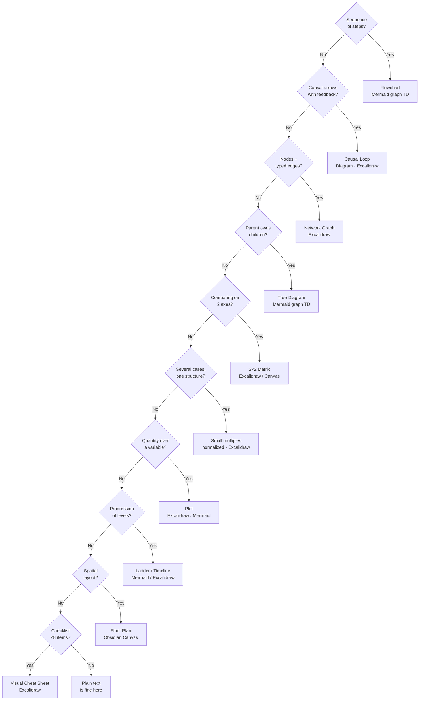

# Representation Rules

**Summary**: Eleven non-negotiable rules for how information is represented across Neural OS. They sit *underneath* NEDF, CAST, SPEAR, HEART, ORACLE, GRACE — the frameworks specify *which fields* to fill; these rules specify *how to fill them so they are 10x faster to read back*. Default to text-only encoding violates these rules. Rules 1–8 govern how a visual is *built*; **Rule 9** governs when it is *withdrawn*, and depends on the Type A / Type B visual split under Rule 1. **Rules 10–11** govern what a visual must make *readable at a glance* — the size of a set (count-shape) and the identity of a page (its one unique glyph).

**Sources**: Internal critique (2026-05-07) of current wiki density. Informed by [framework-comparison-matrix](./framework-comparison-matrix.md), [missing-encoding-layers](./missing-encoding-layers.md), [universal-mental-tagging-framework](./universal-mental-tagging-framework.md), mpl-syntax, [software-design-principles-for-neural-os](./software-design-principles-for-neural-os.md).

**Last updated**: 2026-09-02 (Rule 10 §Downstream use — the count-shape's reading property reused as a *recall* completeness checksum by [multi-valued-attributes](./multi-valued-attributes.md); both boundaries carry over unchanged, and one declared instance added at n=3); 2026-08-27 (§Diagram-type routing — small-multiples + plot rows, two decision-tree questions and the *normalize before comparing* clause, from the [PRISM](./prism-pattern-discovery.md) `/validate-idea`); 2026-08-20 (register grown to 11 instances across 9 pages while authoring the §Visual sections — including the first **cube**, mbti-overview's four independent axes, which the shape table specified but nothing had demonstrated); 2026-08-20 (Rule 10's dead-letter clause satisfied — seven declared count-shapes spanning n=3..7, three of them drawn on this page; Rule 4's five color reservations drawn as their pentagon); 2026-08-20 (Rule 11's dead-letter clause satisfied same day — all 71 concept pages carry a `glyph:`, `glyph-missing` baseline ratcheted to 0; a truncated-frontmatter bug that hid oversized pages from collision detection found and fixed in both detectors); 2026-08-20 (Rules 10 + 11 — count-shape and one-concept-one-glyph — plus the concept-card render at n=4; `/validate-idea` keep-with-modification: relations move from a corner to the edges, so NEDF's F keeps the fourth corner; `glyph:` frontmatter, derived registry at `wiki/_meta/glyph-registry.md`, both dead-letter clauses due 2026-09-17); 2026-08-13 (Rule 9 — scaffold fading condition — plus the Type A / Type B visual split under Rule 1; `/validate-idea` keep-with-modification; dead-letter clause satisfied same day by algorithm-pattern-nedf-deck × 12, and a scope boundary added against the sibling substrate/solution fading axes); 2026-05-17

**Diagrams**:
- `wiki/assets/diagram-type-routing.excalidraw` — decision flowchart: content type → diagram type → Obsidian tool
- [Open in Excalidraw.com](https://excalidraw.com/#json=DVip4ltFIJ3s9oarTUUlZ,bol3yp1HE-ROtNQYe5YoJA)

---

## Why these rules exist

The current wiki is ~95% prose. Every framework is a *text schema with named fields*. That's the bottleneck.

- Reading is **serial** and slow. A sentence consumes working memory token-by-token.
- Vision and space are **parallel** and fast. A 5-element diagram is parsed in ~200ms; five equivalent sentences take 5+ seconds and lose half their content to working-memory turnover.
- Pre-attentive vision (color, shape, position, motion) acts in <200ms with **no conscious attention**. Plain prose can't recruit it.

These rules force every page to recruit vision, space, and the body — not just language.

---

## The 11 rules

*Disambiguation: this is a **set**, not a ladder — the rules are unordered and Rule 11 is not a "level 11". It is unrelated to automaticity's 9 levels, whose numbering is owned by [skill-progression-stages](./skill-progression-stages.md).*

### Rule 1 — Diagram-first, text-as-annotation

Every concept page leads with a drawing: flowchart, state machine, 2D plot, sequence diagram, sketch. Prose becomes captions. The diagram alone (no text) must recover the concept; if it can't, the diagram is wrong, not the text missing.

**Apply to**: NEDF cards, SPEAR procedures, CAST graphs, course rooms, framework pages.

**Test**: hide the text. Can a stranger reconstruct the meaning from the picture?

#### Two visual types (added 2026-08-13)

Rule 1 governed both kinds of visual undifferentiated, which is why [OSNF](./once-seen-never-forget-protocol.md)'s "the image is permanent infrastructure" and Rule 9's "the scaffold must go" read as a contradiction. They are not in contradiction; they govern different objects. Every visual on a wiki page is one of:

| Type | What it is | Fades? | Canonical instance |
|---|---|---|---|
| **A — Addressing visual** | The image *is* the retrieval handle. Its job is to give the concept a unique, re-see-able address in memory. Removing it removes the address. | **Never** | [once-seen-never-forget-protocol](./once-seen-never-forget-protocol.md) §C.4's mandated artifact ([Velvet Aeon](./world-velvet-aeon.md) scene · meme · found image · sketch) |
| **B — Scaffold visual** | A medium you reason *inside*. Its job is to carry the work until the structure is internalised. Removing it is the point. | **Yes — on a declared schedule** (Rule 9) | Singapore's bar model ([singapore-math](./singapore-math.md) §The model method); a traced state machine; a worked 2×2 |

**The routing question**: *does the reader look at this to remember the concept, or to think with it?* Look-to-remember is Type A. Think-with is Type B. A visual that is genuinely both is Type B — the stricter obligation wins, and the addressing job survives fading because Rule 9 retires the *dependence*, not the file.

The two tests are orthogonal, not competing. Rule 1 tests picture-**sufficiency** (hide the text — does the picture carry it?). Rule 9 tests picture-**independence** (hide the picture — do you still have it?). Type A visuals take the first test only.

---

### Rule 2 — Multi-resolution zoom (every concept exists at four sizes)

Every page must exist at four densities, navigable in both directions:

| Size | Purpose |
|---|---|
| **Glyph** — 1 symbol or icon | Indexing, fast scanning |
| **Line** — 1 atomic claim (≤15 words) | Retrieval gates, SR card front |
| **Paragraph** — 3-7 sentences | Review, refresh |
| **Page** — full structure | First encoding, deep work |

If you can't compress to a single glyph, the concept isn't fully understood yet. The compression itself is the test.

**Apply to**: every wiki page, every Anki note, every framework summary.

---

### Rule 3 — Forced 2D placement (position is meaning)

Every framework, list, distinction, or taxonomy must be placed onto a 2x2, 3x3, or continuum. The placement *is* the encoding — once placed, you can recover the concept from its location.

**Examples**:
- NEDF concepts → `concrete↔abstract × stable↔volatile`
- SPEAR steps → `effort × reversibility`
- Algorithm patterns → `state-shape × scan-direction`
- Frameworks → `domain breadth × encoding depth`

**Apply to**: any list of 4+ items. If it can't be placed on a grid, it's probably not a real category — it's a bag.

---

### Rule 4 — Color and shape as global type-signals

A small **shared palette** is reserved across the entire wiki for semantic roles. Pre-attentive vision parses these in <200ms without conscious attention.

**Color reservations**:
- Red — constraint / forbidden / failure
- Blue — resource / input / data
- Green — goal / output / success
- Yellow — decision point / branching
- Gray — optional / context / out-of-scope

**Five reservations, so the count-shape is a pentagon** (Rule 10, declared instance 2026-08-20 — the owner page taking its own rule):

```
                          RED
                       constraint
                       forbidden
                        failure
              ╱                        ╲
         GRAY                            BLUE
       optional                        resource
        context                      input · data
    out-of-scope                            
            ╲                            ╱
          YELLOW ──────────────────── GREEN
          decision                     goal
         branching              output · success
```

Note the pentagon is an *arrangement of the five reservations*, not a drawn node — the shape vocabulary immediately below is Rule 4's node alphabet, and the two must not be confused (see Rule 10 §Not Rule 3, and not Rule 4).

**Shape reservations**:
- Circle — state
- Square — action
- Diamond — decision
- Hex — external system / boundary
- Cloud — uncertain / probabilistic

Pages that use color or shape *must* obey the global vocabulary. Decorative reuse is forbidden.

When a page needs to color-differentiate **arbitrary categories** (not the semantic roles above) and more than ~7 are needed, draw named colors from the [named-color-palette](./named-color-palette.md) reservoir in Kelly priority order — and prefer extending along Value/Saturation/Temperature ([color-theory-mental-model](./color-theory-mental-model.md)) over inventing new hues, which stop being pre-attentively distinguishable past ~7±2.

---

### Rule 5 — Concrete-first, abstraction-last (invert the page order)

Every page opens with **one specific sensory example** — a real number, a real diagram, a named person, a real bug. Abstraction is *derived below*, never above. The reader anchors first, generalizes second. Definitions at the top of the page are a smell.

**Apply to**: framework pages, course rooms, concept pages, anything taxonomic.

**Counter-rule**: if no concrete example exists yet, the concept isn't ready to ship.

**Gap closed (2026-08-13)**: this rule states the *entry* half of Singapore's CPA sequence; **Rule 9** now states the exit half. The evidence behind concrete-first is evidence for concrete-then-**faded** ([singapore-math](./singapore-math.md) §CPA, Fyfe et al. 2014) — concrete-first without a declared withdrawal is half a mechanism.

---

### Rule 6 — Animation / transition for all process knowledge

For procedural information (SPEAR, algorithms, state changes, system dynamics), the **transition** matters more than the static steps. Represent processes as a frame sequence with what-changed-between-frames marked. Even ASCII frame-by-frame beats ordered bullets.

**Encoding**: 4-8 frames; mark deltas in red; one-sentence caption per frame.

**Apply to**: SPEAR procedures, algorithm-pattern-visualizers, any "how does this work over time" page.

---

### Rule 7 — Negative space made explicit (boundary set)

Every concept page must contain three explicit sections the brain otherwise omits:

1. **What this is NOT** — near-neighbors that look identical but aren't
2. **What breaks it** — boundary failure modes (this expands NEDF F-slot)
3. **What's adjacent but excluded** — the design choice this concept rejected

Without this, retrieval misfires when the input is close-but-not — which is most real-world inputs.

**Apply to**: every NEDF card, every framework page, every drill ladder.

---

### Rule 8 — One-mental-motion test

If a concept can't be reduced to a **single physical or spatial act**, it isn't compressed enough.

**Examples**:
- Cosine = leaning forward; sine = reaching up
- Heap = a tower built then knocked from the top
- Stack = plates pushed down and lifted off
- Recursion = a hand reaching into a mirror

Embodied/kinesthetic encoding has the highest density-per-recall-cost the brain offers. Pages without an embodied analog are incomplete.

**Apply to**: every abstract concept, every framework primitive.

---

### Rule 9 — Every scaffold visual declares a fading condition

**Scope: Type B only** (see Rule 1 §Two visual types). Type A addressing visuals are exempt — fading them destroys the address, which is exactly what [OSNF](./once-seen-never-forget-protocol.md) §C.4 forbids.

Every Type B visual declares, in one line beside it, **the state at which the concept should be recoverable with the diagram covered**. A scaffold with no declared exit is not a scaffold, it is a ceiling.

**Test** (picture-independence): cover the diagram. Reconstruct the concept's structure from the cue alone. This runs as the Type-B axis of [once-seen-never-forget-protocol](./once-seen-never-forget-protocol.md) §Stage R's interval falsifier — **not** as a separate review pass. OSNF's axis 1 asks *can you still see the image?*; this asks *can you still do it with the image gone?* Both are wanted; neither substitutes for the other.

**This is not a new principle.** It is the **[expertise-reversal effect](./problem-solving-maturity-levels.md)** (Kalyuga, Ayres, Chandler & Sweller 2003+ — see [glossary](./glossary.md) §External canon citations; also owned at the drill layer by [drill-generator](./drill-generator.md)) applied to the representation layer, where the wiki had never applied it. The effect is already cited in this page's §F block ("Tutorial scaffolding? Apply expertise-reversal") with no rule implementing it; Rule 9 is that implementation. Its evidenced form in mathematics instruction is **concreteness fading** ([singapore-math](./singapore-math.md) §CPA — Fyfe, McNeil, Son & Goldstone 2014), whose stated benefit is stripping away extraneous concrete properties that are true of the example but false of the concept.

**Pattern**: State ([software-design-principles-for-neural-os](./software-design-principles-for-neural-os.md) §State) — a scaffold moves `active → faded → retired` rather than staying fixed.

**Failure mode**: scaffold dependence — the learner can only operate inside the diagram. The worked case is Singapore's own Primary-Four break from bar drawings to letter-symbolic algebra (Ng & Lee 2009). It is the representational twin of [ok-plateau](./ok-plateau.md): comfort inside the support is what stops improvement.

**[METER](./meter-overview.md)**: `repr.scaffold_independent` — on a Type B visual's review, did the structure come back with the diagram covered? **Floor**: a scaffold live ≥3 review cycles that still fails routes to *re-encode*, not to more review — more reps inside the scaffold deepen the dependence. **Dead-letter clause — satisfied 2026-08-13, same day, deadline was 2026-09-10.** The clause read: if no Type B visuals are declared within 4 weeks of adoption, drop Rule 9 rather than keep it as decoration (per §The Main Constraint in [software-design-principles-for-neural-os](./software-design-principles-for-neural-os.md) — ceremony without payoff is rejected). **First declared population**: the 12 diagrams of algorithm-pattern-nedf-deck, each carrying its own per-card fading condition (see that page's §Visual types). The deck also supplies unprompted support for the type split — its N/E/D/F card format has carried one Type A name-hook *and* one Type B diagram per card since 2026-05-20, three months before the distinction was named here. The clause is kept on the page as the record of the gate, not re-armed.

**Apply to**: bar models and other quantity diagrams, worked 2×2s, traced state machines, tutorial-tier walkthroughs, any diagram the reader computes inside. **Do not apply to**: OSNF artifacts, palace imagery, mnemonic scenes, glyphs, hero images.

**Downstream use — the checksum reading (2026-09-02).** Rule 10's payoff is stated above as a *reading* property: an empty corner is visible before a single label is read. [multi-valued-attributes](./multi-valued-attributes.md) §Route 3 reuses the same property at **recall** instead — recover the shape, count the seats, and a member you failed to produce shows as a gap rather than as nothing at all. That is a use of this rule, not a change to it: both boundaries carry over unchanged (the set must be unordered, and past seven the answer is a key and a ladder, not a bigger polygon), and the misapplication that page names — count-shaping a conjugation paradigm — is exactly this rule's ordered-set exclusion being ignored.

**Declared instances** (the live register — a rule with an empty register is decoration): algorithm-pattern-nedf-deck × 12, declared 2026-08-13.

**Scope boundary — this rule governs visuals only.** Two sibling axes withdraw other things under the same expertise-reversal mechanism, each with its own owner and notation: [soroban-learning-method](./soroban-learning-method.md) §Stage 6 Scaffold Fade withdraws the *substrate* holding intermediate state (rungs R1–R4), and [faded-worked-examples](./faded-worked-examples.md) withdraws *how much of a solution is supplied* (step budget `k`). All three are orthogonal and may run at once. Rule 9 does not extend over solutions or substrates, and neither of those extends over visuals — see [glossary](./glossary.md) §Solution-fading layer for the three-axis registry.

---

### Rule 10 — Count-shape (the outline carries the cardinality)

Any set of **2–7 members** is laid out so that the arrangement's outline **is the polygon of its own size**. The members sit at the vertices; the polygon is their *arrangement*, never a drawn node.

| n | Shape | Read as |
|---|---|---|
| 2 | axis / opposed pair | a tension or trade-off |
| 3 | triangle | mutual constraint, pick-two |
| 4 | square (members) · cube (independent axes) | four slots vs four dimensions |
| 5 | pentagon | scorecard, rubric |
| 6 | hexagon | tiling, neighbourhood |
| 7 | ring of 7 | the ceiling — see scope below |

**Why**: counts up to ~4 are apprehended in a single pre-attentive act — *subitizing* (Kaufman, Lord, Reese & Volkmann 1949; the ~4-item limit and its pre-attentive mechanism, Trick & Pylyshyn 1994). Past that, counting becomes serial and slow. A named polygon buys the pre-attentive read back for 5–7 by moving the count out of the *items* and into the arrangement’s *outline*, which vision parses in <200 ms alongside the color and shape signals of Rule 4.

**The load-bearing payoff — the shape is a completeness checksum.** A bulleted list of three cannot show you that a fourth bullet is missing; a square with one empty corner shows it before a single label is read. That property is what prose structurally cannot have, and it is the reason this is a rule rather than a styling preference. It is the visual twin of a [NEDF](./nedf-overview.md) card's empty slot.

**Scope: 2 ≤ n ≤ 7.** A set of one has no shape and needs none. Above seven the polygon stops being pre-attentively distinguishable — the same 7±2 ceiling Rule 4 puts on arbitrary color categories — and the correct form is an **ordered ladder or timeline** (§Diagram-type routing), not a nonagon. Reaching for a nonagon is the signal that the "set" is really two nested sets or a sequence.

**Not Rule 3, and not Rule 4** — the three are orthogonal and routinely compose:

| Rule | Question it answers | What carries it |
|---|---|---|
| **3** Forced 2D placement | *Where does this member sit relative to its neighbours?* | semantic axes |
| **4** Color and shape signals | *What kind of thing is this node?* | the node's own fill and outline |
| **10** Count-shape | *How many are there — and is one missing?* | the arrangement's outline |

Three of them, so — under its own rule — they are a triangle:

```
                   RULE 10 · COUNT-SHAPE
                    "how many, and is
                      one missing?"
                            ▲
                           ╱ ╲
                          ╱   ╲
                         ╱     ╲
                        ╱       ╲
                       ╱         ╲
                      ╱           ╲
                     ╱             ╲
  RULE 4 · COLOR/SHAPE ───────────── RULE 3 · 2D PLACEMENT
  "what kind of node                 "where does it sit
   is this?"                          among its neighbours?"
```

Rule 10's polygon is **never a node**. A square of four circles is four *states* arranged four-ly; it is not "an action" in Rule 4's vocabulary. If you find yourself drawing the polygon as a filled shape with a label inside it, you have written a Rule 4 node and broken Rule 10.

**The on-page counter-example.** Rule 2's four sizes (glyph → line → paragraph → page) are *four* but they are **ordered** — density increases along the list — so they take a ladder, not a square. Cardinality alone does not earn a polygon; the set must be unordered. This is the commonest way to get Rule 10 wrong.

#### The concept card — the worked instance at n = 4

The four-part reading of a concept — *name · rules · relations · distinguisher* — is a square, and drawing it settles where each part actually lives. Three of the four are [NEDF](./nedf-overview.md) slots already; the fourth is not a corner at all.

```
        🏷️ N  name-hook ─────────────── ⚖️ E  essence (rules)
             │ ╲                         ╱ │
             │   ╲                     ╱   │
             │     ╲   🧩 concept    ╱     │
             │       ╲             ╱       │
             │         ╲         ╱         │
             │           ╲     ╱           │
             │             ╳               │
             │           ╱     ╲           │
             │         ╱         ╲         │
             │       ╱             ╲       │
             │     ╱                 ╲     │
             │   ╱                     ╲   │
             │ ╱                         ╲ │
        🔪 D  distinguisher ──────────── 💥 F  failure

   ↖ ↗ ↙ ↘   arrows leaving the four corners = CAST relations
   ╲  N ↔ D  identity   — "which one is this, and not its neighbour?"
   ╱  E ↔ F  behaviour  — "what does it do, and where does that break?"
```

**Relations are edges, so they cannot be corners.** They belong to [CAST](./cast-overview.md), and they leave the square as arrows — which is also why concept cards that try to seat relations in a corner feel cramped. That frees the fourth corner for NEDF's **F** (Failure), which Rule 7's boundary set demands anyway. Nothing from the four-part reading is lost: *rules* is NEDF's **E** (essence — "what the concept does in active form"), and Rule 7's boundary-set duty comes along for free.

**Test**: cover the labels. Say how many members the set has, and point at the empty seat if one is missing.

**[METER](./meter-overview.md)**: `repr.count_recoverable {page, n_expected, n_recalled}` — from the picture alone, is the size right? **Floor**: a set whose count is misread twice is *drawn* wrong (or is over seven and wants a ladder) — redraw it, do not relabel it.

**Dead-letter clause — satisfied 2026-08-20, same day; deadline was 2026-09-17.** The clause read: if fewer than five pages carry a declared count-shape within 4 weeks, drop Rule 10 rather than keep it as decoration (per [software-design-principles-for-neural-os](./software-design-principles-for-neural-os.md) §The Main Constraint). Closed at **7 declared instances across exactly 5 pages** — see the register below. Kept here as the record of the gate, not re-armed.

**Declared instances** (the live register — a rule with an empty register is decoration), all declared 2026-08-20 — **11 instances across 9 distinct pages, against the five pages the dead-letter clause required by 2026-09-17 — clause satisfied**:

| n | Shape | Instance |
|---|---|---|
| 3 | triangle | [multi-valued-attributes](./multi-valued-attributes.md) §The routing question — dissolve · address · enumerate |
| 3 | triangle | this page, Rule 10 §Not Rule 3, and not Rule 4 — the three orthogonal rules |
| 3 | triangle | par-framework §The count-shape — P · A · R, each vertex dual-read |
| 4 | square | this page, Rule 10 §The concept card |
| 4 | square | [nedf-overview](./nedf-overview.md) §The four slots |
| 5 | pentagon | this page, Rule 4 — the five color reservations |
| 6 | hexagon | [framework-comparison-matrix](./framework-comparison-matrix.md) §The six encoders |
| 7 | ring | [universal-mental-tagging-framework](./universal-mental-tagging-framework.md) §The 7 Universal Tag Types — n at the scope ceiling |
| 3 | triangle | glyph-grammar-pattern §Visual — primitives · composition rules · slot map |
| 4 | square | asking-for-help-protocol §Visual — What · Why · From-Whom · By-When, each failure mode an empty corner |
| 4 | **cube** | mbti-overview §Visual — four *independent axes*, so the solid form rather than the flat one |
| 5 | pentagon | [spark-overview](./spark-overview.md) §Visual — Surprise · Progress · Autonomy · Reward · Knowing, each vertex naming the layer it reads from |

The register spans n = 3, 4, 5, 6, 7 **and both n=4 forms** — the flat square for four *members* ([nedf-overview](./nedf-overview.md), asking-for-help-protocol) and the cube for four *independent axes* (mbti-overview), which is the distinction the shape table draws and which had gone undemonstrated until now. Four of the newer instances arrived as a by-product: they were pages needing a §Visual, and the visual a page of 2–7 unordered members *wants* is its count-shape — so the rule and the visual obligation turn out to be the same work. **Deliberately absent** — the ordered sets that were checked and rejected: Rule 2's four sizes, SE Pyramid's five phases, and people-os-overview's six layers are all *ordered*, so each takes a ladder. Cardinality alone does not earn a polygon.

**Apply to**: every enumerated set on a page — framework slots, rule sets, phases, taxonomies, checklists of 2–7. **Do not apply to**: ordered ladders and stage counts, whose numbering is owned by [skill-progression-stages](./skill-progression-stages.md); sequences want a ladder, not a polygon.

---

### Rule 11 — One concept, one glyph (assigned · unique · stable)

Every concept page declares a **concept glyph** in its frontmatter — `glyph: 🧩` — one or two characters that stand for that page and for nothing else in the wiki.

**This is Rule 2's enforcement half, not a second glyph doctrine.** Rule 2 has named *glyph* as the smallest of the four sizes since 2026-05-07 and says "if you can't compress to a single glyph, the concept isn't fully understood yet" — but it never said where the glyph is written down, so the size existed and the artifact did not. `glyph:` is that address. Three obligations follow:

- **Assigned** — a concept page without a glyph has failed Rule 2's compression test, not merely skipped a field.
- **Unique** — no two pages hold the same glyph. This is [UMTF](./universal-mental-tagging-framework.md)'s orthogonality rule *"do not let the same cue mean two different things inside the same local system"*, with the wiki as the local system.
- **Stable** — once assigned, a glyph does not change. UMTF again: *"keep mappings stable after assignment unless you are deliberately rebuilding the whole encoding."* Renaming a page keeps its glyph; the glyph outlives the slug.

**Uniqueness is the load-bearing half.** A glyph that repeats is not an address, it is decoration — and decoration is the exact failure [feedback-visual-per-concept](./feedback-visual-per-concept.md) names for images: it satisfies the letter of the rule and destroys its point. UMTF states both halves already: *"use sensory tags to separate collisions, not as decoration"* and *"if everything glows, nothing glows."* **Test**: swap the glyph for a different pretty one. If nothing is lost, it was not doing work.

**The registry is derived, never hand-maintained.** The authoritative copy is the page's own frontmatter — the page owns its glyph the way it owns its definition (DRY). The glyph→page collision view is *generated* into `wiki/_meta/glyph-registry.md` by `tools/glyph_registry.py`, exactly as the log's per-area views are generated rather than hand-split, per [software-design-principles-for-neural-os](./software-design-principles-for-neural-os.md) §Registries shard on their own retrieval axis. A collision is a lint finding, not a judgement call.

**Three things are called "glyph" — keep them apart:**

| Sense | What it is | Cardinality | Owner |
|---|---|---|---|
| **Concept glyph** | the identity mark of one page | one per page, unique wiki-wide | this rule |
| **Glyph size** | the most compressed of four densities | one rendering among four | Rule 2 |
| **Alphabet glyph** | a primitive in a domain glyph grammar (code, AWS, road signs) | many per page, meaningful only inside its alphabet | glyph-grammar-pattern |

(The unrelated *tag · mark · sigil* trio is disambiguated in `CLAUDE.md` §Consistency rules.)

**[METER](./meter-overview.md)**: `repr.glyph_collision_count` — target 0, machine-checked at pre-commit; and `repr.glyph_recall {glyph, named}` — shown the glyph alone, name the page. **Floor**: a glyph that fails recall twice is not distinctive enough for its neighbourhood; re-pick it *before* it accumulates a history of use.

**Dead-letter clause — satisfied 2026-08-20, same day; deadline was 2026-09-17.** The clause read: if fewer than twenty pages carry `glyph:` within 4 weeks, drop Rule 11 rather than keep it as decoration. **First declared population: all 71 concept pages**, so the lint's `glyph-missing` baseline is ratcheted to **0** — the gap can no longer reopen, and a new concept page without a glyph is a finding on the commit that adds it. The clause is kept here as the record of the gate, not re-armed.

**Found while assigning the population** — worth keeping, because it is the failure mode a uniqueness rule is most exposed to: both detectors read only the first 4000 characters of a page to parse frontmatter, and the semantic-reading plugin's `semantic_tags:` block runs past 20KB on some pages. On those, the closing delimiter was never reached, the glyph parsed as absent, and **the page dropped out of collision detection entirely** — a duplicate against it would have passed silently. A uniqueness check that cannot see a page does not merely miscount; it reports clean. Both now read the whole file, and the fix is regression-tested by planting a duplicate on the 22KB page that exposed it.

**Apply to**: concept pages (the lint's definition — `*-overview`, `*-framework`, `*-protocol`, `*-primer`, `*-pattern`, encoder pages, or explicit `type: concept`). **Do not apply to**: index, log, ledger, and `_meta` pages — they are registries, not concepts, and giving them glyphs is exactly the "everything glows" failure.
---

## Diagram-type routing — which diagram for which content

Rule 1 says "diagram-first" but doesn't specify *which* diagram. This table closes that gap. Drawn from the Periodic Table of Visualization Methods and narrowed to the types relevant to Neural OS content. Obsidian tools listed are what's available natively or via Excalidraw/Canvas plugins.

| Content type | Diagram type | Obsidian tool | Use when |
|---|---|---|---|
| **Process / procedure** | Flowchart | Mermaid `graph TD` | Steps have a defined order with decision points — SPEAR procedures, algorithm patterns |
| **Causal / feedback loops** | Causal Loop Diagram | Excalidraw | Stocks, flows, reinforcing / balancing loops — systems thinking archetypes |
| **Node-edge relationships** | Network Graph | Excalidraw, Graph View | CAST graphs, concept dependency maps, wiki cross-links |
| **Hierarchical structure** | Tree / Hierarchy Diagram | Mermaid `graph TD` nested | Nested palaces, skill dependency trees, taxonomy pages |
| **Comparison / positioning** | 2×2 Matrix | Excalidraw, Canvas | Framework comparison matrix, NEDF Distinguisher pairs, tradeoff analysis |
| **Comparison across cases** | Small multiples (normalized panels) | Excalidraw, Canvas | Several cases of *one* structure drawn in the same visual language at the same scale and orientation, so that what differs is the case, not the drawing — [PRISM](./prism-pattern-discovery.md) step R; Mill's Agreement / Difference in pre-attentive form |
| **Quantity changing over a variable** | Plot (line / scatter) | Excalidraw, Mermaid `xychart-beta` | Trend, threshold, dose-response — [Concomitant Variation](./causal-reasoning-mill-methods.md), METER report curves |
| **Stage progression / ladder** | Vertical ladder / Timeline | Mermaid `graph TD`, Excalidraw | Drill ladders, maturity levels, visualization training stages |
| **Spatial layout / palace map** | Floor plan / Canvas | Obsidian Canvas, Excalidraw | Memory palace architecture, room layouts, hub maps |
| **Reinforcing dynamic** | Flywheel | Excalidraw | Self-reinforcing loops with momentum — SPARK tier ladder, skill compounding |
| **Part-to-whole / proportion** | Treemap or Layer Cake | Excalidraw | Time allocation, cognitive load breakdown, component composition |
| **Framework quick-reference** | Visual Cheat Sheet | Excalidraw | REMAPS moves, NEDF slots, any ≤8-item checklist that needs to be scannable in one fixation |



**Decision rule (choose the first match):**
1. Is there a sequence of steps? → Flowchart
2. Are there causal arrows with feedback? → Causal Loop Diagram
3. Are there nodes connected by typed edges? → Network Graph
4. Is it a hierarchy (parent owns children)? → Tree Diagram
5. Are you comparing items on 2 axes? → 2×2 Matrix
6. Are you comparing several cases of one structure? → Small multiples (normalized)
7. Is it a quantity changing over a variable? → Plot
8. Is it a progression of levels? → Ladder / Timeline
9. Is it spatial? → Canvas / Floor plan
10. Is it a ≤8-item checklist? → Visual Cheat Sheet

**Normalize before comparing** (added 2026-08-27 from [PRISM](./prism-pattern-discovery.md) step R). Whenever the diagram type is chosen *to compare cases* — small multiples above all, but also a 2×2 or a plot with several series — every panel uses the same scale, orientation, symbol set, colours and ordering. A difference in the drawing is noise; only a difference in the case is signal. Rule 4 already fixes colour and shape as global type-signals *within* one system; this clause extends the same discipline *across* the cases being compared.

**Obsidian plugin integration:**
- **Mermaid** (native): flowcharts, trees, sequence diagrams, timelines — use inside fenced ` ```mermaid ` blocks
- **Excalidraw**: everything freeform — causal loops, palaces, matrices, flywheels, cheat sheets
- **Canvas** (native): spatial note arrangements — best for palace maps and 2D concept positioning

---

## Application order (when authoring or refactoring a page)

1. **Concrete example** (Rule 5) — write the one sensory anchor first
2. **Diagram** (Rule 1) — sketch before sentences
3. **2D placement** (Rule 3) — locate it among neighbors
4. **Color/shape** (Rule 4) — apply the global palette
5. **Transitions** (Rule 6) — if procedural, frame-by-frame
6. **Boundary set** (Rule 7) — what is it not, what breaks it, what was rejected
7. **Embodied act** (Rule 8) — find the single physical motion
8. **Count-shape** (Rule 10) — if the page holds a set of 2–7, seat it on its polygon
9. **Multi-resolution** (Rule 2) — generate glyph, line, paragraph versions
10. **Glyph** (Rule 11) — assign the page's one unique `glyph:`, check the derived registry for a collision

If any step can't be completed, the concept is not ready.

Steps 8–10 are the *glanceable* trio and run last for a reason: you cannot pick the right polygon until the set has stopped changing size, and you cannot pick a distinctive glyph until you know which neighbours the page has to be told apart from.

---

## Pilot priority (highest leverage first)

If applying these rules to existing pages, sequence by expected gain:

1. **Rules 1 + 2 together** — diagram + four sizes. This alone changes the wiki from "library you read" to "interface you scan." Predict 3-5x first-pass comprehension, 10x revisit speed.
2. **Rule 3** — 2D placement reveals hidden taxonomy errors that prose hides.
3. **Rule 5** — concrete-first anchors recall.
4. **Rule 7** — boundary sets close the recall-misfire gap.
5. **Rules 10 + 11 together** — count-shape + glyph. Cheap per page (one polygon, one character) and the payoff is retrieval-side: the count becomes checkable and the page becomes addressable by symbol.
6. **Rules 4, 6, 8** — high gain but require global coordination (palette, animation tooling, embodied vocabulary).

---

## Audit hook

When linting the wiki (per CLAUDE.md), check:

- [ ] Does the page open with a diagram OR a concrete example?
- [ ] Is the page's glyph and line version recoverable?
- [ ] If it's a list of 4+, is there a 2D placement?
- [ ] Do colors/shapes follow the global palette?
- [ ] If procedural, is there a frame sequence?
- [ ] Does it have a boundary set (NOT / breaks / adjacent-excluded)?
- [ ] Is there one embodied motion that captures the concept?
- [ ] Is every set of 2–7 seated on its count-shape, with the count readable before the labels?
- [ ] Does the page declare a `glyph:`, and is it unique in `wiki/_meta/glyph-registry.md`?

Flag any "no" as a representation gap. The last two are machine-checked by `.claude/wiki-precommit-lint.py`; the rest are the semantic pass `/lint` covers.

---

## External grounding — Cognitive Load Theory (Sweller)

The 11 rules above are not invented; they operationalize **Cognitive Load Theory** (Sweller 1988, 1994, 2010+) which divides cognitive load into three sources — *intrinsic* (inherent material complexity), *extraneous* (consumed by *how* the material is presented), and *germane* (productive schema-building) — and identifies named effects governing each. Each rule is anti-extraneous-load by design and most of CLT's named effects appear here under different language:

| CLT effect | Rule that operationalizes it | Sweller's finding |
|---|---|---|
| **Worked-example effect** | Rule 5 (concrete-first, abstraction-last) | Studying worked examples beats solving equivalent problems unaided, especially for novices |
| **Split-attention effect** | Rule 1 (label rides *on* the figure, not in a separate legend) | Spatially separated info sources that must be integrated impose extraneous load |
| **Modality effect** | Rule 8 (one embodied motion) + [remaps](./remaps.md) Sensations | Splitting info across visual + auditory channels exceeds a single channel's capacity |
| **Redundancy effect** | Rule 1 narrow form ("text-as-*annotation*", not duplicate of figure) | Identical info in two modalities *adds* load rather than reducing it; dual coding must be complementary, not redundant |
| **Element-interactivity / chunking** | **Rule 10** (count-shape) — *added 2026-08-20; the set's size is read from one outline instead of held as N separate elements in working memory, and its external grounding is subitizing (Trick & Pylyshyn 1994) rather than a Sweller effect proper* | Intrinsic load scales with the number of *interacting* elements a learner must hold at once; chunking them into one unit is the only lever on intrinsic load |
| **Expertise-reversal effect** | **Rule 9** (scaffold visuals declare a fading condition) — *added 2026-08-13; previously the one CLT effect with no rule on this page, applied only at the user level via [problem-solving-maturity-levels](./problem-solving-maturity-levels.md) and the gym Lamp/Scale/Sword phases* | What helps novices (more worked examples, more scaffolding) hurts experts; learners need *less* scaffolding as expertise grows |

See [learning-sciences-validation](./learning-sciences-validation.md) for the broader mapping of Neural OS onto canonical learning science (Sweller's CLT plus Dunlosky/Weinstein's six strategies plus Meyer & Land's threshold concepts). This page operationalizes the **extraneous-load minimization** half of CLT; [remaps](./remaps.md) operationalizes the modality and dual-coding halves; the gym layer operationalizes expertise-reversal at the *drill* level, and Rule 9 now does so at the *representation* level.

**Surgical follow-up**: when a rule is invoked in a future edit, prefer Sweller's named effect (e.g. "concrete-first applies here because of the worked-example effect — see Sweller 1988") over a free-form justification. Citation discipline strengthens the wiki's "Neural OS = validated foundations + novel architecture" claim.

---

## Related pages

- [framework-comparison-matrix](./framework-comparison-matrix.md) — what to encode (these rules govern *how*)
- [missing-encoding-layers](./missing-encoding-layers.md) — gaps these rules begin to close
- [universal-mental-tagging-framework](./universal-mental-tagging-framework.md) — tag vocabulary that complements color/shape
- mpl-syntax — structural carrier; Rule 1 applies to MPL output too
- [software-design-principles-for-neural-os](./software-design-principles-for-neural-os.md) — SOLID for frameworks; this page is SOLID for representations
- [Memory Palace](./memory-palace-architecture-for-neural-os.md) — spatial layout layer that Rules 3 and 4 feed into
- [feedback-visual-per-concept](./feedback-visual-per-concept.md) — the prior question Rules 10–11 presuppose: *why is there an image at all?*
- glyph-grammar-pattern — the other sense of *glyph* (alphabet primitives), disambiguated under Rule 11
- [nedf-overview](./nedf-overview.md) — the four slots the concept card seats on its square
- [prism-pattern-discovery](./prism-pattern-discovery.md) — consumer of §Diagram-type routing at step R; source of the small-multiples and plot rows and the normalize-before-comparing clause

---

## U — See (CAST)
1. Eleven non-negotiable rules sitting *under* the encoders
2. Edges: each rule constrains slot-filling in NEDF/CAST/SPEAR/HEART

## D — Name (NEDF)
1. Representation Rules = how to fill slots for 10× recall
2. Diagram-first, 2D placement, color/shape vocab, concrete-first, count-shape, one glyph
3. Default text-only encoding violates these rules

## F — Do (SPEAR)
1. Filling a slot? Run through the 11 rules
2. Page reads as all text? Refactor against rule 1
3. Drawing a visual? Type it A or B first — B takes rule 9
4. Set of 2–7 on the page? Seat it on its polygon (rule 10)
5. New concept page? Assign its `glyph:` and check the registry (rule 11)

## B — Watch (HEART)
1. Text-heavy pages with no diagrams
2. Color / shape used arbitrarily, no vocabulary
3. Abstract-first explanations (violates concrete-first)
4. Type B visual with no declared fading condition (scaffold with no exit)
5. A set of 2–7 shipped as a bare bullet list — the count is unreadable and a missing member invisible
6. A glyph reused on two pages, or picked because it looked nice (decoration, not an address)

## L — Predict (ORACLE)
1. Pages violating rules → 10× slower readback
2. Rule-compliant pages → reflex-grade retrieval

## R — Act (GRACE)
1. Drafting a page → check the rules before publishing
2. Audit finds violation → refactor or annotate