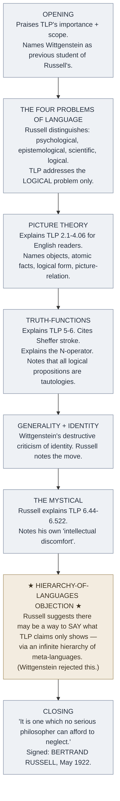

# Russell's Introduction to the Tractatus (1922)

**Summary**: Bertrand Russell's introduction to the 1922 English first edition of [TLP](./tractatus-logico-philosophicus.md) (Kegan Paul, Ogden translation). **The standard scholarly entry-point to TLP for 100 years** — the introduction explains [picture theory](./picture-theory-of-language.md), atomic facts, truth-functions, generality, identity, and the mystical for English-speaking philosophers who weren't fluent in German + Wittgenstein's compressed style. Russell also raises **the hierarchy-of-languages objection** that he would never fully resolve with Wittgenstein. **A primary scholarly document in its own right**, distinct from TLP proper.

**Sources**:
- Bertrand Russell, "Introduction" to *Tractatus Logico-Philosophicus* by Ludwig Wittgenstein (Kegan Paul 1922), pages 7-23 of the 1922 English first edition.
- [tractatus-logico-philosophicus](./tractatus-logico-philosophicus.md) — the primary text Russell introduces.
- [bertrand-russell](./bertrand-russell.md) · [wittgenstein-ludwig](./wittgenstein-ludwig.md) — biographical context.

**Last updated**: 2026-05-25

---

## One-line

> Russell at 50, writing an introduction to his ex-student's TLP, explains picture theory + truth-functions + the mystical to English-speaking philosophers — *and* gently floats the hierarchy-of-languages objection that Wittgenstein never accepted.

## Unlocks (lead, not footer)

1. **The introduction is the *only* TLP-internal source pointing to the hierarchy-of-languages escape.** Russell explicitly suggests that TLP's "what cannot be said but only shown" may be possible to *say* — in a higher-order meta-language. The suggestion is consistent with Russell-Whitehead's [*Principia* ramified type theory](./principia-mathematica.md) (every type and order has its own boundary; you can climb the meta-level ladder). **Wittgenstein rejected the move throughout his life.** Modern type theory + Tarski's truth definition vindicate Russell's instinct *technically* while Wittgenstein's position vindicates *operationally* (the regress doesn't help the encoder for any finite human task).

2. **The introduction is how 100 years of English-speaking TLP scholarship begins.** Pre-Pears-McGuinness 1961, the Ogden-Ramsey translation + Russell's introduction were the *only* English entry-point to TLP. Generations of philosophers read TLP *through Russell's lens* — even when the lens slightly distorted Wittgenstein's intent. **Many anti-Russellian moves in later TLP scholarship are explicitly correcting Russell's introduction.**

3. **Russell's gentle objections show his role as commentator-not-disciple.** Russell's introduction is not deferential. It explains TLP fairly but reserves explicit reservations: about the hierarchy of languages, about the metaphysical subject, about the mystical. **The introduction shows what a careful peer-level engagement with TLP looks like** — not adoration, not dismissal, but principled engagement.

4. **Russell's tone in the introduction is the substrate-thesis exemplar.** Russell at 50 is reading work by his ex-student that has *intellectually overtaken him in some respects*. His response — write a fair-minded introduction that helps the work reach the English audience, while noting his own reservations — is **the protective behavioral move of mature substrate stewardship**. Compare with Frege's response to Russell's letter (acknowledgment + appendix; complete acceptance). Russell engaged with Wittgenstein's work *as a peer*, not as someone whose own work is being demolished.

## Mnemonic

**1922 · Kegan Paul · 17 pages** = *Year · publisher · length of Russell's intro.*

## Memory checksum

1. **When was Russell's introduction published, in which edition?** (1922 English first edition of TLP, published by Kegan Paul, London. Translation by C.K. Ogden (assisted by Frank Ramsey). Russell's introduction pages 7-23.)
2. **What does Russell's introduction cover?** (Picture theory; atomic facts (*Sachverhalt*); truth-functions; generality; identity (Wittgenstein's destructive criticism); the mystical; plus his gentle hierarchy-of-languages objection.)
3. **State the hierarchy-of-languages objection.** (Russell proposes that TLP's "what cannot be said but only shown" may be sayable in a higher-order meta-language. Each level's unsayable becomes sayable at the next; the hierarchy may be infinite. Modern type theory + Tarski's truth definition vindicate this technically; Wittgenstein rejected it.)
4. **Why is Russell's introduction "the standard scholarly entry-point"?** (For 100 years, generations of English-speaking philosophers read TLP through Russell's lens. Pre-Pears-McGuinness 1961, Ogden + Russell's intro were the *only* English access to TLP. Russell's framings still dominate much TLP teaching.)
5. **How does Russell's tone differ from Wittgenstein's TLP?** (Russell explains; Wittgenstein declares. Russell admits uncertainty (hierarchy-of-languages); Wittgenstein doesn't. Russell engages as a peer-commentator; Wittgenstein writes as if from outside the system entirely.)

## Visual — the structure of the introduction

The structure: explain the technical machinery first; raise the philosophical objection second; close with strong endorsement.

---

## The four problems of language (Russell's framing)

Russell opens the introduction with a distinction that *Wittgenstein himself does not explicitly make in TLP*:

> *There are various problems as regards language. First, there is the problem what actually occurs in our minds when we use language with the intention of meaning something by it; this problem belongs to psychology. Secondly, there is the problem as to what is the relation subsisting between thoughts, words, or sentences, and that which they refer to or mean; this problem belongs to epistemology. Thirdly, there is the problem of using sentences so as to convey truth rather than falsehood; this belongs to the special sciences dealing with the subject-matter of the sentences in question. Fourthly, there is the question: what relation must one fact (such as a sentence) have to another in order to be capable of being a symbol for that other? This last is a logical question, and is the one with which Mr. Wittgenstein is concerned.*

**Russell's reading**: TLP is concerned with the *logical* problem (the fourth) — what *structural* relation must hold between a proposition and a fact for the proposition to represent the fact?

**Why this framing matters**: it locates TLP as a logical inquiry, not a psychological or epistemological one. Russell's framing has dominated 20th-century TLP scholarship; some commentators (e.g., later Wittgensteinians influenced by *Investigations*) push back, arguing TLP is doing more than logic alone.

## How Russell explains picture theory

Russell uses his characteristic clarity to render TLP 2.1-4.06 accessible:

> *We make to ourselves pictures of facts.* — Russell quotes TLP 2.1.

He then explains:
- **Facts** are what propositions assert; reality consists of facts.
- **Objects** are the simples — the irreducible constituents of facts.
- **Logical form** is the structural pattern shared between a proposition and the fact it pictures.
- **The picture-relation** is what makes a proposition able to represent a fact: the proposition's elements correspond to the fact's objects; the proposition's logical form is identical with the fact's logical form.

Russell's *operational gloss*: "It is an essential property of the symbol that it stands in this relation to its object, and the symbol can express the fact only by reproducing in its own structure the structure of the fact."

This explanation is **clearer than Wittgenstein's own** in some respects — Russell uses standard mathematical-philosophy vocabulary; Wittgenstein uses compressed aphorism. Generations of English-speaking philosophers learned picture theory through Russell's gloss.

## Russell's explanation of the truth-function machinery

Russell explicitly credits Sheffer:

> *It has been shown by Dr. Sheffer (Trans. Am. Math. Soc., Vol. XIV. pp. 481-488) that all truth-functions of a given set of propositions can be constructed out of either of the two functions "not-p or not-q" or "not-p and not-q". Wittgenstein makes use of the latter…*

Russell then explains Wittgenstein's **N-operator** (joint negation) as a variadic extension of the Sheffer stroke. The "general form of proposition" *[p̄, ξ̄, N(ξ̄)]* is glossed as a recursive procedure for generating all truth-functional propositions from elementary propositions via repeated N-application.

Russell is careful to note: *"What is meant is somewhat less complicated than it sounds."* The N-operator is mechanical once understood; the complexity is in the notation.

## Russell's *destructive criticism* gloss on identity

TLP 5.5301-5.534 contains Wittgenstein's destructive criticism of identity. Wittgenstein argues that identity (=) is not a genuine logical relation; it cannot be defined in terms of other logical primitives without circularity.

Russell glosses:
> *Mr. Wittgenstein accordingly banishes identity and adopts the convention that different letters are to mean different things. In practice, identity is needed as between a name and a description or between two descriptions… For such uses of identity it is easy to provide on Wittgenstein's system.*

**Russell's pragmatic gloss**: Wittgenstein's banishment of identity is technically interesting but operationally manageable. Modern logic typically uses identity as a primitive; Wittgenstein's elimination is a curiosity rather than a load-bearing claim.

## Russell's gloss on the mystical — and his discomfort

Russell explains TLP 6.44-6.522 carefully but reserves explicit reservation:

> *His attitude upon this grows naturally out of his doctrine in pure logic, according to which the logical proposition is a picture (true or false) of the fact, and has in common with the fact a certain structure. It is this common structure which makes it capable of being a picture of the fact, but the structure cannot itself be put into words, since it is a structure of words, as well as of the fact to which they refer.*

Russell explains the show-vs-say doctrine charitably. Then:

> *Mr. Wittgenstein manages to say a good deal about what cannot be said, thus suggesting to the sceptical reader that possibly there may be some loophole through a hierarchy of languages, or by some other exit. The whole subject of ethics, for example, is placed by Mr. Wittgenstein in the mystical, inexpressible region. Nevertheless he is capable of conveying his ethical opinions. His defence would be that what he calls the mystical can be shown, although it cannot be said. It may be that this defence is adequate, but, for my part, I confess that it leaves me with a certain sense of intellectual discomfort.*

**Russell signals dissent without forcing it**. The "certain sense of intellectual discomfort" is one of the great understated objections in 20th-century philosophy.

## The hierarchy-of-languages objection

Russell explicitly suggests:

> *Such a hypothesis is very difficult, and I can see objections to it which at the moment I do not know how to answer. Yet I do not see how any easier hypothesis can escape from Mr. Wittgenstein's conclusions. Even if this very difficult hypothesis should prove tenable, it would leave untouched a very large part of Mr. Wittgenstein's theory, though possibly not the part upon which he himself would wish to lay most stress.*

**Russell proposes**: there may be a *hierarchy of languages*, each one able to *say* what the level below could only *show*. The hierarchy could be infinite; at each level, the next level's machinery makes the previous level's "unsayable" sayable.

**Wittgenstein's response** (private correspondence with Russell): he rejected the hierarchy throughout his life. Even *Philosophical Investigations* (1953) retains the rejection — the late Wittgenstein moves away from picture theory entirely, but doesn't endorse a hierarchy of languages either.

**Modern technical vindication**:
- **Russell-Whitehead's own ramified type theory** in [*Principia Mathematica*](./principia-mathematica.md) is exactly a hierarchy-of-languages move.
- **Tarski's truth definition** (1933) explicitly uses a meta-language to define truth for object-language sentences. Tarski's hierarchy makes Russell's instinct technically rigorous.
- **Type theory in modern proof assistants** (Coq, Lean) uses cumulative type universes — an infinite hierarchy where each universe can refer to lower universes.

**Modern philosophical state**: Russell was technically right that hierarchies work. Wittgenstein was operationally right that the regress doesn't help any finite human task — at any *given* finite level, you have an unsayable. The hierarchy buys you nothing operationally even if it works metaphysically.

## How Russell closes

> *To have constructed a theory of logic which is not at any point obviously wrong is to have achieved a work of extraordinary difficulty and importance. This merit, in my opinion, belongs to Mr. Wittgenstein's book, and makes it one which no serious philosopher can afford to neglect.*
> 
>                                                                                              **BERTRAND RUSSELL.**
>                                                                                                          *May 1922.*

The closing is unequivocal endorsement. Russell does not reject TLP; he calls it indispensable reading despite his reservations.

**This closing has shaped TLP's reception ever since.** Every English-language philosopher discovering TLP encounters Russell's "no serious philosopher can afford to neglect" — and treats TLP accordingly.

## Russell's introduction vs Pears-McGuinness 1961

The Ogden 1922 translation (with Russell's intro) was the only English TLP until Pears-McGuinness in 1961. The Pears-McGuinness edition has:
- A different translation (clearer in some passages; debated in others).
- **No equivalent of Russell's introduction.** Pears-McGuinness wrote their own brief introduction (much shorter, more recent scholarship cited).

Many philosophers prefer to read Ogden + Russell's introduction even when working from Pears-McGuinness, *because Russell's introduction does intellectual work the modern editions don't replicate*. The 1922 framing is itself a primary scholarly artifact.

## Cross-link to the wiki

| Wiki layer | Russell's introduction |
|---|---|
| [tractatus-logico-philosophicus](./tractatus-logico-philosophicus.md) | Russell's introduction explains the technical machinery for English readers |
| [picture-theory-of-language](./picture-theory-of-language.md) | Russell's gloss of picture theory |
| [truth-function-machine](./truth-function-machine.md) | Russell explains the N-operator |
| [show-vs-say](./show-vs-say.md) | Russell's "certain sense of intellectual discomfort" with the doctrine |
| [the-mystical-tlp](./the-mystical-tlp.md) | Russell explains 6.44+ + flags the hierarchy-of-languages alternative |
| [limits-of-language-tlp](./limits-of-language-tlp.md) | Russell's hierarchy-of-languages objection |
| [bertrand-russell](./bertrand-russell.md) | The introduction shows Russell as careful peer-commentator |
| [principia-mathematica](./principia-mathematica.md) | Russell's own type theory anticipates the hierarchy-of-languages move |
| [wittgenstein-ludwig](./wittgenstein-ludwig.md) | Wittgenstein had mixed feelings about Russell's introduction |

## METER integration

| Drill | Pass floor | Source |
|---|---|---|
| Identify the four problems of language Russell distinguishes | <30 s | this page §Four problems |
| State the hierarchy-of-languages objection | <60 s | this page §Hierarchy objection |
| Quote Russell's "certain sense of intellectual discomfort" | <30 s | this page §Discomfort |
| Quote Russell's closing endorsement | <30 s | this page §Closing |
| Distinguish Russell's explanation of picture theory from Wittgenstein's own (TLP 2.1-4.06) | <120 s | this page + [picture-theory-of-language](./picture-theory-of-language.md) |

## Related pages

- [tractatus-logico-philosophicus](./tractatus-logico-philosophicus.md) — the primary text Russell introduces
- [bertrand-russell](./bertrand-russell.md) — author
- [wittgenstein-ludwig](./wittgenstein-ludwig.md) — TLP's author (mixed feelings about Russell's intro)
- [picture-theory-of-language](./picture-theory-of-language.md) · [show-vs-say](./show-vs-say.md) · [truth-function-machine](./truth-function-machine.md) · [the-mystical-tlp](./the-mystical-tlp.md) · [limits-of-language-tlp](./limits-of-language-tlp.md) · [atomic-fact-tlp](./atomic-fact-tlp.md) — TLP concepts Russell explains
- [principia-mathematica](./principia-mathematica.md) — Russell's own work informs his hierarchy-of-languages instinct
- [ramsey-frank](./ramsey-frank.md) — assisted Ogden with the translation Russell introduces
- [logic-atomic-design](./logic-atomic-design.md) — Wave 4 scholarly entry-point added
- [glossary](./glossary.md) — Logic layer registration
