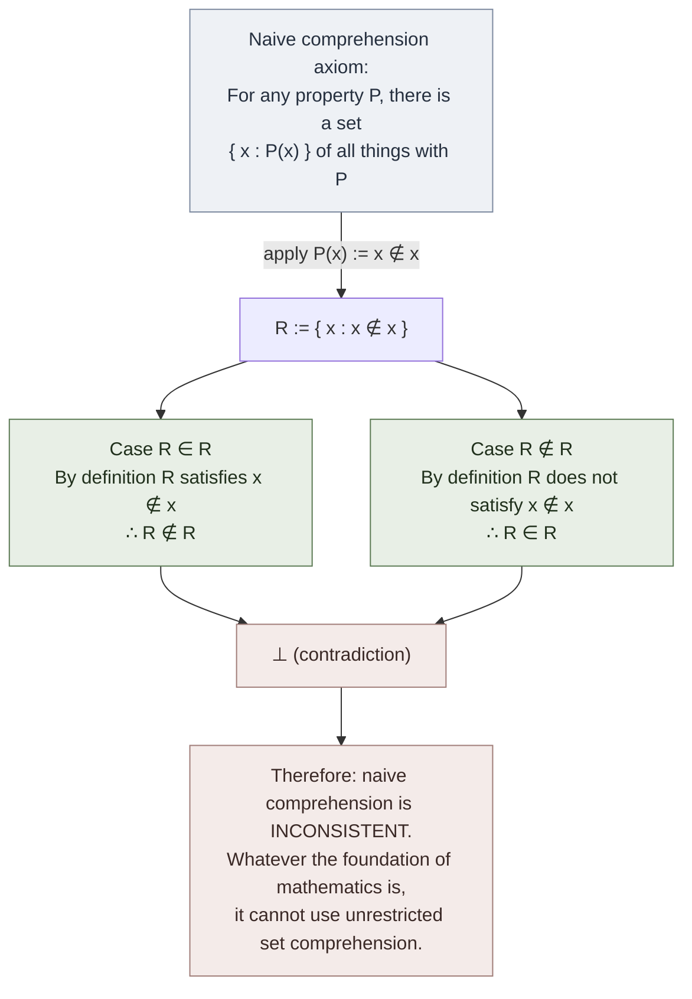

# Russell's Paradox

**Summary**: Bertrand Russell's 1901 discovery: *the set of all sets that do not contain themselves — does it contain itself?* If yes, then by definition it doesn't; if no, then by definition it does. The single moment that demolished Frege's logicist program in mid-publication, motivated type theory, and made the 20th-century foundations crisis inevitable. **The triggering event of [Logicomix](./logicomix-graphic-novel.md)'s entire narrative arc**.

**Sources**:
- Russell's letter to Frege, June 16, 1902 — the original communication of the paradox to its first victim. Frege's reply (June 22, 1902): *"Solatium miseris socios habuisse malorum"* (it is a consolation in misery to have companions). Cited in van Heijenoort, *From Frege to Gödel* (1967), pp. 124–128.
- Russell's first publication: *The Principles of Mathematics* (1903), Appendix B.
- Frege's appendix to *Grundgesetze der Arithmetik* Vol II (1903) — the mid-publication acknowledgment that the logicist foundation has collapsed.
- [logicomix-graphic-novel](./logicomix-graphic-novel.md) — narrative depiction of Russell's discovery and Frege's response.

**Last updated**: 2026-05-25

---

## One-line

> Let R = {x : x ∉ x}. Then R ∈ R iff R ∉ R. Contradiction. The naive set comprehension principle — *for every property P, there is a set of all things with property P* — is therefore inconsistent.

## Unlocks (lead, not footer)

1. **Frege's mid-publication collapse.** Frege had published *Grundgesetze der Arithmetik* Vol I in 1893 deriving arithmetic from logic. Vol II was at press in 1902 when Russell's letter arrived. Frege added an appendix (the *Nachwort*) admitting the foundation had failed: *"A scientist can hardly meet with anything more undesirable than to have the foundation give way just as the work is finished."* The first historical instance of a complete logical system being demolished by a single counter-example — a pattern Gödel repeated 28 years later for Hilbert.

2. **The motivation for type theory.** Russell's response (in *Principia Mathematica* 1910-1913) was to forbid the construction of R by stratifying sets into *types*: a set of type *n+1* can only contain elements of type *n*; the construction "set of all sets that don't contain themselves" is then ungrammatical at the type level. Type theory is alive today (Coq, Lean, Agda, Haskell) as a direct descendant of Russell's response to his own paradox.

3. **Naive set theory is inconsistent.** Pre-Russell, mathematicians used Cantor's set theory with unrestricted comprehension ({x : P(x)} for any predicate P). Post-Russell, mathematics adopts Zermelo-Fraenkel set theory (ZFC), which replaces unrestricted comprehension with a restricted *axiom schema of separation*: {x ∈ A : P(x)} for any predicate P and existing set A. The "all sets" universal disappears.

4. **The paradox is *constructive*** — no magic, no infinity-magic, no hidden assumptions. Just take Frege's own Basic Law V seriously and follow the chain. This is what makes it devastating: there's no way to dismiss it as a quirk of infinite-set theory; the contradiction is at the level of definition itself.

5. **The Barber, the Liar, the King's Library — same shape.** Russell's paradox is one instance of a general *self-reference + negation* pattern that also produces: Cantor's diagonal argument, the Liar paradox ("this sentence is false"), Gödel's incompleteness theorems (a sentence that asserts its own unprovability), the Halting problem (a program that halts iff it doesn't), the Berry paradox (the smallest number not definable in fewer than 16 syllables — a phrase with 15 syllables). The recognition that all these share a structure is part of what makes 20th-century logic *the century of self-reference*.

## Mnemonic

**R = {x : x ∉ x}**

Then ask: *R ∈ R?* — and watch it explode.

Or in English: **"the set of sets that aren't members of themselves — is it a member of itself?"**

For dates: **1901** (discovery) / **1902** (letter to Frege) / **1903** (publication).

## Memory checksum

If you can answer these in <60 s each from memory, the page is encoded:

1. **State Russell's paradox.** (Let R = {x : x ∉ x}. Then R ∈ R iff R ∉ R. Contradiction.)
2. **What did the paradox demolish?** (Frege's logicist program in *Grundgesetze*; naive set theory's unrestricted comprehension principle. Wounded by being a single-step constructive contradiction.)
3. **What was Russell's response?** (Type theory in *Principia Mathematica* 1910–1913. Stratify sets into types; the offending construction becomes ungrammatical at the type level.)
4. **What is the current standard response?** (Zermelo-Fraenkel set theory with restricted comprehension — {x ∈ A : P(x)} replaces {x : P(x)}; the "all sets" universal disappears.)
5. **What other paradoxes share its shape?** (Liar paradox, Cantor's diagonal, Gödel's incompleteness, Halting problem, Berry paradox — the *self-reference + negation* family.)

## Visual — the paradox in one frame

The paradox fits on one page; the consequences run for 80 years.

---

## The full derivation

Frege's Basic Law V (in modern notation): for any predicate P(x), there exists a set { x : P(x) } whose members are exactly the things with property P.

Take P(x) to be *"x is not a member of itself"*, i.e., x ∉ x. By Basic Law V, the set R := { x : x ∉ x } exists.

Now ask whether R ∈ R.

- **Case 1**: Suppose R ∈ R. Then R satisfies the membership criterion for R, which is "is not a member of itself". So R ∉ R. Contradiction.
- **Case 2**: Suppose R ∉ R. Then R *does* satisfy the membership criterion "is not a member of itself". So R ∈ R. Contradiction.

Either case leads to contradiction. The starting assumption — that R exists — must be false. So *some* predicate (the predicate x ∉ x) cannot define a set under Basic Law V. So Basic Law V is *false*.

The proof is two cases of one-line each. There is no infinite-set machinery, no quantifier shuffle, no analytic-philosophy sleight of hand. The contradiction is *constructive* and *unambiguous*.

## What the paradox killed

**Frege's logicism (immediate victim, 1902).** Frege had built *Grundgesetze* on Basic Law V. Russell's letter, arriving while Vol II was at press, said in effect: *Basic Law V leads to contradiction*. Frege's appendix to Vol II is the most heart-breaking single page in the history of mathematics — an attempt to patch the foundation, ultimately unsuccessful, accompanied by the Latin consolation about miserable companions.

**Naive set theory (broader victim, 1900s-1920s).** Cantor's set theory in its 1880s-1890s form used unrestricted comprehension; the paradox demolishes that. Mathematics needs a *restricted* comprehension axiom or a *type-theoretic* stratification.

**The 19th-century "definability" intuition.** Pre-Russell, mathematicians felt that *any clearly stated property* determines a set. Post-Russell, this intuition is wrong: there are clearly stated properties (x ∉ x) for which no set exists.

## What the paradox did not kill

- **Set theory itself.** Zermelo (1908) and Fraenkel (1922) restricted comprehension to *separation* (selecting from an existing set) and added a *replacement* axiom. The result, ZFC, blocks Russell's paradox while preserving virtually all of useful mathematics.
- **Logicism as a long-game program.** Russell-Whitehead's *Principia Mathematica* recovered most of the logicist enterprise via type theory. The program survives in modern type-theoretic foundations (Martin-Löf, HoTT) even after Gödel further wounded it in 1931.
- **The structural shape of mathematics.** Geometry, analysis, algebra all continue unaffected; only their *foundations* are reorganized.

## Russell's response — type theory

In *Principia Mathematica* (1910–1913, with Whitehead), Russell developed *ramified type theory*: every set has a *type*; a set of type *n+1* can contain only elements of type ≤ *n*; the construction "set of all sets that aren't members of themselves" is now *ungrammatical* — you can't form a set that quantifies over its own type-level.

Russell's type theory is heavy machinery; many practitioners adopted ZFC instead (simpler, less stratified). But type theory survived and flourished:

| Descendant | Year | Domain |
|---|---|---|
| Simple type theory | 1940 (Church) | Logic |
| Curry-Howard correspondence | 1934/1969 | Proofs as programs |
| Martin-Löf intuitionistic type theory | 1972 | Constructive foundations |
| System F | 1972 (Girard) | Polymorphic types |
| Calculus of Constructions | 1986 (Coquand) | Coq's foundation |
| Homotopy type theory | 2009+ | Topology + type theory |
| Lean 4 / Coq / Agda | active | Industrial theorem proving |

Russell's response to his own paradox is alive in every modern proof assistant.

## The self-reference + negation pattern

Russell's paradox is one instance of a general structural pattern: *self-reference combined with negation produces contradiction*. The pattern recurs:

| Instance | Year | Self-reference | Negation | Contradiction |
|---|---|---|---|---|
| **Liar paradox** | ancient | "this sentence" | "is false" | true iff false |
| **Cantor diagonal** | 1891 | diagonal function | flipped bit | new element not in enumeration |
| **Russell's paradox** | 1901 | set of itself | non-membership | R ∈ R iff R ∉ R |
| **Berry paradox** | 1906 | "definable in fewer than X words" | minimum | a definable phrase that should be undefinable |
| **Grelling-Nelson paradox** | 1908 | self-applying adjectives | non-self-applying | "heterological" is heterological iff not |
| **Gödel sentence** | 1931 | provability | unprovability | true iff unprovable |
| **Halting problem** | 1936 | self-halting | non-halting | program halts iff doesn't |
| **Curry's paradox** | 1942 | self-referential conditional | implication | "if this is true, X" produces X |
| **Yablo's paradox** | 1993 | infinite chain of "next is false" | non-self-referential? | contradiction without explicit self-reference |

The recognition that all these share a single structural shape is one of 20th-century logic's deepest insights. Russell's paradox is the *load-bearing instance* — the one that forced the entire field to reorganize.

## Russell's biographical impact

The paradox was the moment Russell's foundations project began *and* the moment his teacher Frege's project ended. In Logicomix's framing, Russell carries the weight of having killed his predecessor's life work; the *Principia* (1910–1913) is his attempt at reparation. The reparation does not fully succeed — Gödel 1931 wounds Russell's own logicism. By 1939 (Logicomix's frame story), Russell has effectively *left* the field and writes popular philosophy.

The wiki's interpretation (per [logicians-madness-substrate-thesis](./logicians-madness-substrate-thesis.md)): Russell survived where others (Cantor, Frege, Gödel, Wittgenstein) collapsed precisely because he repeatedly left the field; the paradox is the load-bearing biographical event that made leaving necessary.

## METER integration

| Drill | Pass floor | Source | Owner |
|---|---|---|---|
| State the paradox in symbolic form | <15 s | this page §One-line | this page |
| Derive the contradiction (both cases) | <60 s, written | this page §Full derivation | this page |
| Name 3 paradoxes sharing the self-reference + negation pattern | <30 s | this page §Pattern | this page |
| Name Russell's response (type theory) and one modern descendant | <30 s | this page §Russell's response | this page |
| Name what survives ZFC's restriction | <30 s | this page §What it did not kill | this page |

## Related pages

- [logicomix-graphic-novel](./logicomix-graphic-novel.md) — narrative depiction of Russell discovering the paradox
- [godels-incompleteness](./godels-incompleteness.md) — 1931 sequel killing Hilbert; same self-reference + negation structure
- [principia-mathematica](./principia-mathematica.md) — Russell's response: type theory
- [foundations-crisis](./foundations-crisis.md) — broader narrative; the paradox is the triggering event
- [picture-theory-of-language](./picture-theory-of-language.md) — Russell's introduction to TLP grew partly from his post-paradox concerns
- [tractatus-logico-philosophicus](./tractatus-logico-philosophicus.md) — TLP attempts a different post-paradox foundation
- [logicians-madness-substrate-thesis](./logicians-madness-substrate-thesis.md) — Frege as one of six worked instances; Russell as the survivor
- [logic-atomic-design](./logic-atomic-design.md) — paradox is registered as a Structural-slot atom anchoring the foundations narrative
- [glossary](./glossary.md) — Logic layer registration
