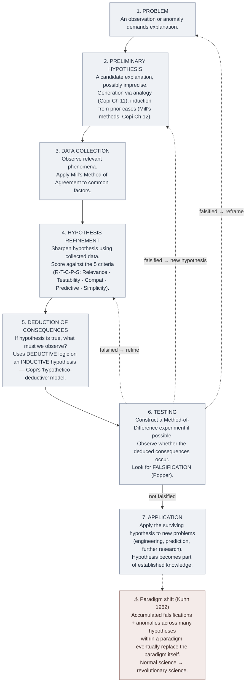

# Science and Hypothesis (Copi Ch 13)

**Summary**: [Copi](./copi-introduction-to-logic.md) Ch 13's treatment of the **scientific method as a seven-stage template** (Problem · Preliminary Hypothesis · Data Collection · Hypothesis Refinement · Deduction of Consequences · Testing · Application). Plus the criteria for evaluating competing hypotheses: **relevance · testability · compatibility with established hypotheses · predictive power · simplicity**. The Organism-tier integration of [analogical](./analogical-reasoning.md) + [causal](./causal-reasoning-mill-methods.md) inductive moves into a workflow that produces *reliable* knowledge over time.

**Sources**:
- [Copi/Cohen/McMahon](./copi-introduction-to-logic.md) *Introduction to Logic* 14th ed, Ch 13 *Science and Hypothesis*.
- Karl Popper, *The Logic of Scientific Discovery* (1959) — the falsifiability criterion; cited but Copi treats it as one criterion among several rather than the load-bearing one.
- Thomas Kuhn, *The Structure of Scientific Revolutions* (1962) — the paradigm-shift / normal-vs-revolutionary-science distinction; Copi briefly addresses.
- [causal-reasoning-mill-methods](./causal-reasoning-mill-methods.md) — the atom-tier substrate.
- [problem-solving-os](./problem-solving-os.md) — sister operational pipeline.

**Last updated**: 2026-05-25

---

## One-line

> Science = seven stages from problem to application. Hypothesis quality = five criteria (relevance · testability · compatibility · predictive power · simplicity). The Organism-tier integration of [analogy](./analogical-reasoning.md) + [Mill's methods](./causal-reasoning-mill-methods.md) into a sustainable knowledge-production workflow.

## Unlocks (lead, not footer)

1. **The seven-stage template is roughly [PS-OS](./problem-solving-os.md) for empirical claims.** Both pipelines have *Problem → Preliminary classification → Data/Diagnose → Hypothesis/Method → Deduction/Execute → Test/Verify → Application/Record*. The scientific method is the *empirical-claims* specialization of the general problem-solving operating stack; PS-OS is the *cross-domain* generalization. **Knowing one is most of knowing the other.**

2. **Five criteria for hypothesis quality.** When you have multiple candidate hypotheses, the criteria sort them: **relevance** (does it address the problem?), **testability** (can it be checked against observation?), **compatibility** (does it cohere with established knowledge?), **predictive power** (does it predict observations beyond the original problem?), **simplicity** (is it Occam's-razor-minimal?). The five-criteria scoring is the *quality control* layer above hypothesis-generation.

3. **Falsifiability ≠ verifiability.** Popper's central insight: scientific hypotheses are characterized by their *falsifiability* — they make predictions that *could* be refuted by observation. Verifiability (positive confirmation) is weaker; a hypothesis can have many confirming instances and still be wrong. **The wiki's reflex**: when reading a claim, ask *what observation would refute this?* If the answer is "nothing", the claim isn't scientifically formed.

4. **Kuhnian paradigm shifts as the macro-scale failure mode.** The seven-stage template is "normal science" — works within an existing paradigm. **Paradigm shifts** (Kuhn 1962) occur when accumulated anomalies in the paradigm exceed the patience of the community; the paradigm is replaced by a fundamentally different framework. The transitions between [logicism · formalism · intuitionism](./foundations-crisis.md) is a paradigm-shift instance in mathematical logic. **The wiki cross-links Kuhn to [the take-seriously-but-hold-lightly meta-rule](./memory-paradox.md)** — paradigms are tools, not idols.

## Mnemonic

**P-PH-D-HR-D-T-A** = *Problem · Preliminary Hypothesis · Data · Hypothesis Refinement · Deduction · Test · Application.*

Read as *"P-P-H-D-H-R-D-T-A"* or directly read the seven stage names. Seven stages from puzzle to applied knowledge.

For the five hypothesis criteria: **R-T-C-P-S** = *Relevance · Testability · Compatibility · Predictive power · Simplicity.*

## Memory checksum

1. **State the seven stages.** (1: Problem. 2: Preliminary hypothesis. 3: Data collection. 4: Hypothesis refinement. 5: Deduction of consequences. 6: Testing. 7: Application.)
2. **State the five hypothesis-quality criteria.** (Relevance · Testability · Compatibility with established hypotheses · Predictive power · Simplicity.)
3. **Define falsifiability (Popper).** (A hypothesis is *falsifiable* if there exist observations that would refute it. Falsifiability is a necessary condition for scientific status. *Verifiability* (positive confirmation) is weaker.)
4. **Distinguish normal science from a paradigm shift.** (Kuhn 1962. Normal science = puzzle-solving within an existing paradigm. Paradigm shift = the framework itself is replaced when anomalies accumulate. Example: Newtonian mechanics → relativity + quantum.)
5. **Cross-link the scientific method to [PS-OS](./problem-solving-os.md).** (Both are seven-stage workflows from problem to applied result. PS-OS is the cross-domain generalization; scientific method is the empirical-claims specialization. Both use [Mill's methods](./causal-reasoning-mill-methods.md) in their Diagnose/Data-collection stage.)

## Visual — the seven-stage spiral

The seven-stage workflow is recursive: testing failures cycle back to refinement or to re-framing the problem. The spiral is the load-bearing structural feature.

---

## The seven stages in detail

### Stage 1 — Problem

Science begins with **observation that demands explanation**. The observation might be an anomaly, a phenomenon not predicted by existing theory, or a puzzle within the existing paradigm.

**Examples**:
- Le Verrier (1846): Uranus' orbit deviates from Newtonian predictions.
- Roentgen (1895): photographic plates fog near cathode-ray tubes.
- Einstein (1905): light's behavior in moving reference frames isn't explained by Newtonian mechanics.
- Genova (2010s): age-related memory decline patterns don't fit a single linear-decline model.

### Stage 2 — Preliminary Hypothesis

A candidate explanation is generated, often via analogy (Copi Ch 11), induction from prior cases (Mill's methods, Copi Ch 12), or imaginative leap. The preliminary hypothesis is often **imprecise** — it identifies a candidate mechanism without specifying details.

**Examples**:
- Le Verrier: an unknown planet beyond Uranus.
- Roentgen: a new kind of ray.
- Einstein: light speed is constant for all observers; space and time are relative.
- Genova: working memory + long-term memory + recall mechanisms separately decline at different rates.

### Stage 3 — Data Collection

Observe relevant phenomena. Apply [Mill's Method of Agreement](./causal-reasoning-mill-methods.md) to identify common factors. The data-collection stage often spans years.

**Examples**:
- Le Verrier: collect precise Uranus orbital data; analyze deviations.
- Roentgen: systematically vary tube conditions; observe the foggy plates.
- Einstein: thought-experiments + observational predictions for Mercury's perihelion.
- Genova: longitudinal cognitive testing across populations.

### Stage 4 — Hypothesis Refinement

Sharpen the hypothesis using collected data. **Score against the five criteria**:
- **Relevance**: Does it address the original problem?
- **Testability**: Can it be checked against observation?
- **Compatibility**: Does it cohere with established knowledge? (Without absolute conservatism — sometimes the hypothesis *forces* revision of established knowledge.)
- **Predictive power**: Does it predict observations *beyond* the original problem?
- **Simplicity**: Is it Occam's-razor-minimal?

**Examples**:
- Le Verrier: a specific orbital location and mass for the predicted planet.
- Roentgen: X-rays as a distinct phenomenon with specific physical properties.
- Einstein: the Lorentz transformations + the equivalence principle.

### Stage 5 — Deduction of Consequences

If the hypothesis is true, what *must* we observe? Copi notes this is the **deductive stage of an otherwise inductive procedure** — once the hypothesis is in place, deduction tells us what to check.

**Examples**:
- Le Verrier: if the planet exists, it should be observable at coordinates X on date Y.
- Roentgen: if X-rays exist, they should penetrate matter with characteristic absorption.
- Einstein: if the equivalence principle holds, light should bend near massive objects; clocks should run slow in gravity wells; Mercury's perihelion should precess by a specific amount.

### Stage 6 — Testing

Construct a [Method-of-Difference](./causal-reasoning-mill-methods.md) experiment if possible. Observe whether the deduced consequences occur. **Look explicitly for falsification** (Popper).

If falsified → return to stage 4 (refinement), stage 2 (preliminary hypothesis), or stage 1 (problem reframing).

**Examples**:
- Le Verrier: Galle observes Neptune at the predicted coordinates on the predicted date (1846). Confirmation. ✓
- Roentgen: Crookes-style cathode-ray tubes systematically produce X-rays under specified conditions. Confirmation. ✓
- Einstein: Eddington's 1919 solar eclipse expedition confirms light-bending; later Mercury perihelion calculations confirm GR. ✓

When a hypothesis is *falsified*, the cycle returns to stage 4 or earlier.

### Stage 7 — Application

The surviving hypothesis is **applied to new problems** — engineering, prediction, further research. The hypothesis is integrated into the body of established knowledge and serves as a substrate for future scientific work.

**Examples**:
- Le Verrier: Newtonian celestial mechanics is reinforced as a predictive tool.
- Roentgen: X-ray technology developed for medical imaging, materials science.
- Einstein: General Relativity becomes the foundation of cosmology, GPS, gravitational-wave detection.

## Falsifiability (Popper, 1934/1959)

Karl Popper's central thesis: **scientific hypotheses are characterized by their falsifiability** — they make predictions that could be refuted by observation.

Examples:
- *"All swans are white"* — falsifiable: observe a black swan → refuted.
- *"There exists at least one swan"* — falsifiable: observe no swans anywhere → refuted (in principle).
- *"Some swans are mystically swans"* — not falsifiable; no observation would refute this.

Popper's criticism of psychoanalysis and Marxism: they could "explain" any observation. **A theory that explains everything explains nothing.** Falsifiability is the demarcation between scientific and non-scientific claims.

**Copi treats falsifiability as one criterion (testability) among several**, rather than as the sole demarcation. The wiki follows Copi: falsifiability is necessary but the other criteria (relevance, compatibility, predictive power, simplicity) also constrain hypothesis quality.

## Kuhnian paradigm shifts (1962)

Thomas Kuhn's *The Structure of Scientific Revolutions* distinguishes:

| Concept | Definition |
|---|---|
| **Paradigm** | A worldview + framework + set of standard problems + methodology shared by a scientific community |
| **Normal science** | Puzzle-solving within an existing paradigm; small-scale refinement |
| **Anomaly** | An observation that doesn't fit the paradigm but is treated as a puzzle to be solved within it |
| **Crisis** | When anomalies accumulate beyond what the paradigm can absorb |
| **Revolutionary science** | The community shifts to a fundamentally different framework — Newtonian → relativistic, Ptolemaic → Copernican |
| **Paradigm incommensurability** | New and old paradigms aren't directly comparable; they ask different questions, use different methodologies, prize different observations |

The [foundations crisis](./foundations-crisis.md) (1874-1939) is a paradigm-shift instance in mathematical logic: Cantorian set theory + naive comprehension as paradigm → Russell's paradox as anomaly → multiple reconstruction programs as competing paradigms → Gödel's incompleteness as crisis → post-Gödel pluralism as new paradigm (no single self-certifying foundation).

**The wiki cross-links Kuhn to [take-seriously-but-hold-lightly](./memory-paradox.md)**: any current paradigm is a tool, not an idol; substantive enough to learn deeply, provisional enough to abandon when accumulated anomalies demand it.

## Cross-link to [problem-solving-os](./problem-solving-os.md)

The scientific method and PS-OS are structurally similar:

| Scientific method (Copi Ch 13) | PS-OS step |
|---|---|
| (1) Problem | Step 1: Frame |
| (2) Preliminary hypothesis | Step 3: Choose Method |
| (3) Data collection | Step 2: Diagnose |
| (4) Hypothesis refinement | Step 3a: Type-specific tool selection |
| (5) Deduction of consequences | Step 4a: Predict |
| (6) Testing | Step 4: Execute + Step 5: Record |
| (7) Application | Step 6: Apply / Repeat |

**Both pipelines invoke [Mill's methods](./causal-reasoning-mill-methods.md) in their Diagnose stage and [natural-deduction](./methods-of-deduction.md) in their consequence-derivation stage.** They are the same workflow specialized to different problem domains.

## Common failure modes

- **Ad-hoc rescue**: refining the hypothesis specifically to dodge each new falsification without independent testing of the refinements.
- **Confirmation bias**: collecting only data that confirms the hypothesis (Mill's Method of Agreement gone wrong without Method of Difference).
- **Theoretical underdetermination**: multiple incompatible hypotheses fit the same data; choosing one requires the five criteria + additional evidence.
- **Streetlight effect**: studying what's easy to study rather than what would discriminate among hypotheses.
- **Treating one criterion as sufficient**: e.g., adopting a hypothesis solely because it's simple (Occam's razor as procrustean bed), ignoring relevance or predictive power.
- **Premature paradigm-shift declarations**: not every anomaly demands paradigm replacement; most are normal-science puzzles.

## METER integration

| Drill | Pass floor | Source |
|---|---|---|
| State the seven stages | <30 s | this page §Mnemonic |
| State the five hypothesis criteria | <30 s | this page §Mnemonic |
| Distinguish falsifiability from verifiability | <30 s | this page §Falsifiability |
| Identify a paradigm shift instance | <60 s | this page §Kuhn |
| Map a scientific paper's argument onto the seven stages | <300 s | applied exercise |

## Related pages

- [copi-introduction-to-logic](./copi-introduction-to-logic.md) — Ch 13 source
- [analogical-reasoning](./analogical-reasoning.md) — Copi Ch 11; hypothesis generation
- [causal-reasoning-mill-methods](./causal-reasoning-mill-methods.md) — Copi Ch 12; data-collection substrate
- [probability-as-logic](./probability-as-logic.md) — Copi Ch 14
- [problem-solving-os](./problem-solving-os.md) — sister operational pipeline
- [prism-pattern-discovery](./prism-pattern-discovery.md) — PRISM steps S · M run this page's Stage 2 → 6 loop on a designed case set; its pattern-quality one-liner is R-T-C-P-S compressed
- [methods-of-deduction](./methods-of-deduction.md) — used at stage 5 (deduction of consequences)
- [memory-paradox](./memory-paradox.md) — paradigm-as-tool, not idol
- [fallacy-taxonomy](./fallacy-taxonomy.md) §Presumption — common failure modes mirror false-cause fallacies
- [oracle-overview](./oracle-overview.md) — ORACLE encoder; predictions = stage 5 deductions
- [foundations-crisis](./foundations-crisis.md) — paradigm-shift instance in mathematical logic
- [logic-atomic-design](./logic-atomic-design.md) — Template-tier (the seven-stage schema)
- [glossary](./glossary.md) — Logic layer registration
