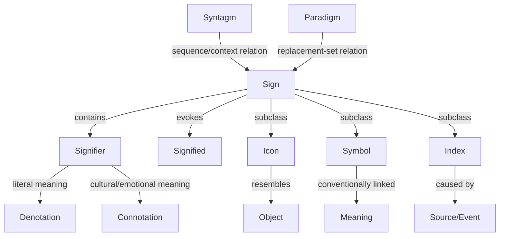

# Semiotics

**Summary**: The triadic theory of signs from Saussure (signifier/signified, denotation/connotation, syntagm/paradigm) and Peirce (icon/symbol/index). A dense relational cluster with three branching axes that share one parent node ("sign") — exactly the shape [CAST](./cast-overview.md) is built to pack into a single graph. Routed as a CAST graph anchored on the Rubik's Cube Palace **Blue face**, with [NEDF](./nedf-overview.md) secondary distinguishers on the four most-collidable terms.

**Sources**:
- [METER](./meter-overview.md) capture `meter-data/captures/2026-05-17/2026-05-17-semiotics-route-001.jsonl` (user-uploaded semiotics infographic; routing turn 2026-05-17T07:02Z)
- [cast-overview](./cast-overview.md) for graph packing
- [nedf-overview](./nedf-overview.md) for term-level distinguishers
- [rubiks-cube-palace](./rubiks-cube-palace.md) for palace addressing
- [red-queen-knowledge-ladder](./red-queen-knowledge-ladder.md) for the L5 target
- [remaps](./remaps.md) for the Modify move that protects icon/symbol/index against collapse

**Last updated**: 2026-08-26

---

## One-line

> A sign has two halves (signifier ↔ signified), two meaning-layers (denotation ↔ connotation), three modes of standing-for (icon resembles · symbol conventionally points · index is caused-by), and lives in two axes of organization (syntagm = sequence · paradigm = substitution-set).

## CAST graph

Primary encoder is [CAST](./cast-overview.md) because the structure is a graph with one parent (`Sign`) and triadic branching. The graph fits the [edge-lives-at-source-node](./cast-overview.md) rule cleanly — each child relation is a distinct verb anchored on `Sign`.

Three structural axes branching from `Sign`:
1. **Composition** — Signifier ↔ Signified (the two halves of every sign).
2. **Meaning layer** — Denotation ↔ Connotation (literal vs cultural/emotional).
3. **Standing-for mode** — Icon ↔ Symbol ↔ Index (resemblance vs convention vs causal trace).

Two outer axes that locate any sign in language:
- **Syntagm** — the sequence/context the sign sits in (e.g. "red light" before "green light" in a traffic cycle).
- **Paradigm** — the substitution set the sign was chosen from (e.g. "red" picked instead of green/yellow/blue).

## NEDF secondary anchors

[NEDF](./nedf-overview.md) cards are needed because four pairs collapse without identity anchors. Each is a separate card; the [Distinguisher](./nedf-overview.md) is what keeps the neighbor concept out.

| Term | Essence | Distinguisher (vs nearest neighbor) | Failure mode |
|---|---|---|---|
| Signifier | The form (sound, mark, image) | vs Signified: form, not meaning | Treating word and meaning as identical |
| Signified | The mental concept the form evokes | vs Referent: concept in head, not object in world | Conflating concept with real-world object |
| Denotation | The literal, dictionary meaning | vs Connotation: stable, decontextual | Reading the dictionary entry and stopping |
| Connotation | Cultural / emotional overlay | vs Denotation: varies by culture and context | Universalizing one culture's connotation |
| Icon | Sign that **resembles** its object (portrait, map) | vs Symbol: similarity, not convention | Calling every visual sign an icon |
| Symbol | Sign **conventionally linked** to its object (word, flag) | vs Icon: arbitrariness, not resemblance | Treating all signs as arbitrary symbols |
| Index | Sign **caused by** its object (smoke → fire, footprint) | vs Symbol: causal trace, not convention | Missing the causal/physical link |

## Palace placement

- **Palace**: [rubiks-cube-palace](./rubiks-cube-palace.md)
- **Face**: Blue (B)
- **Cell**: `B.2` — top-middle edge of the Blue face

The whole graph anchors on `B.2` as a single CAST scene (graph packed into one locus, per the CAST one-graph-per-cell pattern). The seven other cells on the Blue face are open for related concepts (e.g. Saussure vs Peirce biographical anchors, paradigm vs syntagm worked examples) when they're authored.

## [UMTF](./universal-mental-tagging-framework.md) emphasis

- **Relation** — the load-bearing tag; almost every edge in the graph is a *named relation* (conveys / evokes / resembles / caused-by).
- **Pattern** — the triadic icon/symbol/index pattern is a re-usable template.
- **Spatial** — the syntagm/paradigm axes are explicitly spatial-metaphorical (chain vs vertical column).

## [REMAPS](./remaps.md) move

**M (Modify)** — concrete instruction: take *one* object (e.g. a rose) and morph it across all three Peircean states so the contrast is felt, not just listed.

| State | The rose as… | Why it counts |
|---|---|---|
| **Icon** | A photo of a rose | Resembles the actual rose |
| **Symbol** | The word "rose" or a red rose given on Valentine's Day | Convention links flower to romance |
| **Index** | Rose-petal trail leading from a doorway | Causally trace of someone having been there with roses |

Running the morph defeats the most common failure: collapsing icon/symbol/index into "all signs are arbitrary symbols."

## Examples — modern, in the wild

The rose-morph above takes **one** object through three states. This set does
the opposite: three **different** signs off a single phone screen, so the L5
move — look at a sign in the wild, name its mode — has something to practise on
that is not a flower. One icon, one symbol, one index, which is exactly the
forced-counterexample shape failure mode 1 demands. Every row says its verb
aloud (failure mode 2) and carries both meaning layers (failure mode 3).

| Mode | The sign | Say the verb | Denotation | Connotation |
|---|---|---|---|---|
| **Icon** | The live camera preview filling the screen | *resembles* — the rectangle stands for the room because it looks like the room | "this is what the lens is pointed at" | presence: the moment is happening **now** and is capturable — which is why a raised phone changes the behaviour of everyone in frame |
| **Symbol** | The verification badge beside a profile name | *conventionally points* — nothing about a check mark is identity-like; you had to be told | "this account cleared the platform's identity check" | endorsement, notability — and where the badge can be bought, willingness to pay, which is the opposite reading from the same mark |
| **Index** | The "typing…" indicator in a chat | *caused by* — the dots exist because keys are being pressed at the other end | "the other person is composing a message" | attention: you are being answered right now — and its disappearance reads as second thoughts, not as silence |

### The trap this set is built to spring

Mode is a property of the **relation**, not of the picture. The typing dots are
drawn by pure convention — three dots is a designer's choice, and a different
app could use a pulsing bar — yet the sign at work is *dots present ⇒ someone is
pressing keys*, and that is causal. Read the glyph and you call it a symbol;
read the verb and it is an index. The inverse trap runs the same way: 🔥 looks
iconic, and in "this take is 🔥" it points by convention alone.

So the classifying question is never *what does it look like*. It is: **would
this sign still stand if the resemblance broke / if the agreement broke / if the
cause stopped?** Break the resemblance and the camera preview stops meaning the
room. Break the agreement and the badge means nothing. Stop the keystrokes and
the dots vanish on their own — which no amount of convention could arrange.

That third one is the reason an index cannot be faked without faking its cause,
and it is the whole reason Peirce needed a category the other two could not
cover.

## Drill target

- **Drill route**: [drill-ladder](./drill-generator.md)
- **Target level on [red-queen-knowledge-ladder](./red-queen-knowledge-ladder.md)**: **L5 — Action** ("I know what to do when I see it")
- **Stepping stone**: L4 — Classification (contrast-classify icon/symbol/index correctly before applying the framework)

L5 is the right target because semiotics earns its keep at the *application* moment — looking at a sign in the wild (logo, gesture, traffic device, ad) and instantly tagging which mode it operates in and which layer of meaning it carries. Below L5 it's vocabulary; at L5 it becomes a reading instrument.

## Failure modes (pre-empt these in drill design)

1. **All-symbols collapse** — treating every sign as an arbitrary symbol because that's the most-cited example.
   **Counter**: drill batches must include forced icon and index counterexamples (photo, smoke, fingerprint, fever) and reject sets that contain only symbols.
2. **Labels-without-edges** — memorizing the term list without internalizing the verbs *resembles*, *conventionally points*, *caused-by*.
   **Counter**: every drill card must require the learner to *say the verb* aloud, not just name the type.
3. **Denotation/connotation collapse** — reading the dictionary entry and stopping, missing the cultural overlay.
   **Counter**: at L5, every applied case must produce *both* a denotation reading and a connotation reading.

## Open follow-ups (flagged at capture, not yet answered)

The original routing flagged three pieces of information that would strengthen the encoding once supplied:

- [x] One modern real-world example for each of icon / symbol / index (beyond the rose-morph).
- [ ] One worked failure case where denotation and connotation diverge *sharply* (e.g. a corporate logo whose connotation is the opposite of its denotation).
- [ ] A trigger cue for retrieval — pick one mnemonic anchor word (rose / smoke / traffic sign / handshake) that will fire the whole graph from a single token at the door of `B.2`.

When the user supplies these, fold them into the **Examples** section of this page and update the [NEDF](./nedf-overview.md) Name-hook slots on the four most-collidable cards.

## Related pages

- [cast-overview](./cast-overview.md) — primary encoder
- [nedf-overview](./nedf-overview.md) — secondary encoder (per-term distinguishers)
- [rubiks-cube-palace](./rubiks-cube-palace.md) — palace addressing (`B.2`)
- [remaps](./remaps.md) — Modify move for the icon/symbol/index morph
- [red-queen-knowledge-ladder](./red-queen-knowledge-ladder.md) — L5 target rationale
- [drill-generator](./drill-generator.md) — drill route
- [universal-mental-tagging-framework](./universal-mental-tagging-framework.md) — Relation/Pattern/Spatial tags
- [representation-rules](./representation-rules.md) — concrete-first rule (the rose-morph applies it)

---

## U — See (CAST)
1. Triadic theory of signs: Saussure + Peirce
2. CAST graph anchored on Rubik's Cube Blue face

## D — Name (NEDF)
1. Semiotics = sign-theory cluster encoded as CAST graph
2. Distinguisher: NEDF distinguishers on the 4 most-collidable terms
3. Failure mode: term collision (signifier/signified, icon/symbol/index)

## F — Do (SPEAR)
1. Sign question → walk CAST graph
2. Use NEDF distinguishers for collidable pairs

## B — Watch (HEART)
1. Term collision
2. Collapsing the three axes

## L — Predict (ORACLE)
1. Sign question → predict relevant axis
2. Axis → predict node cluster

## R — Act (GRACE)
1. Sign theory → walk graph
2. Collision → consult NEDF distinguisher