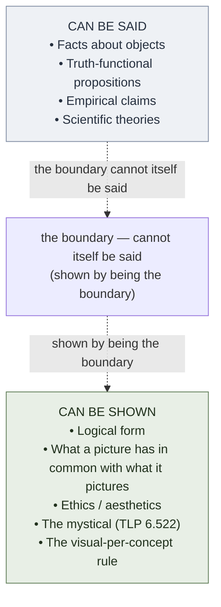

# Show vs Say

**Summary**: Wittgenstein's [TLP](./tractatus-logico-philosophicus.md) central epistemic boundary (propositions 4.121 – 4.1212 + 6.522): *what can be shown cannot be said*. A proposition *shows* its logical form by having that form; it cannot *say* its logical form because saying would require a meta-language whose form would itself need to be shown, ad infinitum. **The philosophical home of the wiki's visual-per-concept rule** — structure can be displayed (diagram, glyph, scene, formula) but cannot be fully stated in prose alone. Confirmed unlock in [composability-index](./composability-index.md) (TLP show-vs-say × visual-per-concept feedback rule).

**Sources**:
- [Wittgenstein TLP](./tractatus-logico-philosophicus.md) (1921 German / 1922 English), propositions 4.121, 4.1211, 4.1212, 4.122, 4.1221, 6.36, 6.522.
- Bertrand Russell, *Introduction to the TLP* (1922) — proposes the *hierarchy-of-languages* objection (which Wittgenstein rejected).
- User feedback memory `feedback_visual_per_concept` (2026-05-22): *every concept/methodology/framework/taxonomy page must ship with its own visual* — independently surfaced by the wiki's own practice before being grounded in TLP.

**Last updated**: 2026-06-29

---

## One-line

> *What can be shown cannot be said.* — TLP 4.1212

A proposition *displays* its logical form by having that form. The form is not an additional fact that the proposition could *also* assert; it is the proposition's *condition of meaning anything at all*. Trying to state the form pushes you up to a meta-language whose form would itself need to be displayed.

## Unlocks (lead, not footer)

1. **The visual-per-concept rule is TLP 4.1212 in operational form.** The wiki's already-established feedback rule (every concept page must ship with a diagram, glyph, scene, timeline, or map) had been holding on stylistic grounds. TLP gives it its philosophical home: prose alone *cannot* show structure — it can only describe it. **Text-only pages don't merely fall short of a preference; they violate the show-vs-say boundary.** This is a load-bearing claim about the wiki's own architecture.

2. **The hierarchy-of-languages escape doesn't work for operational purposes.** Russell's introduction proposes that a meta-language could *say* what TLP's object-language can only show. Russell's instinct is technically defensible (modern type theory and meta-mathematics live there). **But operationally**, the meta-language itself has a form that needs to be shown — the regress is real. For the wiki's purposes (encoding for memory, retrievable structure, communicable knowledge), pictures are required *at every level*. There is no meta-level where you escape needing them.

3. **Glyphs > scenes for some content.** User feedback `feedback_glyph_over_scene` (2026-05-24): for code memorization, the user prefers *frozen Tetris-style polyomino glyphs read at a glance* to time-unfolding palace walks. This is a refinement of show-vs-say: the *shown* form should be readable in one perceptual moment when possible. Static glyphs *show* compact form; dynamic scenes *show* extended form. Match the glyph to the form.

4. **The mystical = the limit case of show-vs-say.** TLP 6.522: *There is indeed the inexpressible. This shows itself; it is the mystical.* Ethics, aesthetics, the meaning of life — these can be shown (in a life lived) but not said (in propositions). The wiki cross-links this to Hebrews 11:1 (*faith = substance of things hoped for, evidence of things not seen*) and to the visual layer of any Bible study.

## Mnemonic

**S/S** = *Show / Say* — separated by a slash, not a comma, because they're *exclusive*.

The slash is the boundary. What's on the left is displayed; what's on the right is asserted. Form is on the left; facts about objects are on the right. The slash itself cannot be said — it can only be shown by *being* the slash.

## Memory checksum

If you can answer these in <60 s each from memory, the page is encoded:

1. **State TLP 4.1212.** (*What can be shown cannot be said.*)
2. **Why can't the logical form of a proposition be said?** (Saying would require a meta-language whose form would itself need to be shown — ad infinitum. The form is *displayed by the proposition having it*, not asserted *in* it.)
3. **What is Russell's hierarchy-of-languages objection?** (Russell proposes that a meta-language could say what the object-language only shows; Wittgenstein rejected this; the wiki sides with Wittgenstein operationally because the regress is real for any finite encoder.)
4. **State the wiki's visual-per-concept rule in TLP terms.** (Concept pages must include a *picture* — diagram, glyph, scene, formula — because the concept's logical form can be *shown* in a picture but not fully *said* in prose. Text-only pages attempt to say what must be shown; they violate the boundary.)
5. **What is the mystical, per TLP 6.522?** (*The inexpressible — shows itself; this is the mystical.* Ethics / aesthetics / meaning live here; they can be displayed in lived action but not asserted in propositions.)

## Visual — the show-vs-say boundary

The boundary itself is on the boundary — it cannot be drawn as a line *within* either box because that would *say* the boundary; it can only be *displayed* by the page being structured into two boxes.

---

## The propositions, in order

### TLP 4.121 — *Propositions cannot represent logical form: it mirrors itself in them. What expresses itself in language, we cannot express by language. Propositions show the logical form of reality. They display it.*

The core proposition. Three claims compressed:

- A proposition can*not* assert its logical form.
- The form *mirrors itself* in the proposition (i.e., the proposition has the form, and *that the proposition has the form* is shown by the proposition).
- *Expression in language* of what the form is — *that* cannot be done.

### TLP 4.1211 — *Thus a proposition "fa" shows that the object a occurs in its sense, two propositions "fa" and "ga" that they are both about the same object.*

Operational example. The proposition *f(a)* — read as *"a has property f"* — *shows* that *a* occurs in this fact. We don't have to additionally write *"and a is mentioned here"* — the writing-down *displays* the mention.

### TLP 4.1212 — *What can be shown cannot be said.*

The slogan form. The most-quoted single sentence in TLP after proposition 7. The wiki's visual-per-concept rule is this proposition operationalized.

### TLP 4.122 — *In a certain sense we can speak of formal properties of objects and atomic facts, or of properties of the structure of facts, and in the same sense of formal relations and relations of structures. … The existence of such internal properties and relations cannot, however, be asserted by propositions, but it shows itself in the propositions which present the situation and treat of the objects in question.*

The technical version. *Formal* properties (e.g. *being a number*, *being a function*) and *formal* relations cannot be asserted — they're shown in the propositions that *use* them.

### TLP 4.1221 — *An internal property of a fact we also call a feature of this fact. (In the sense in which we speak of facial features.)*

The wonderful image. Just as a face's *features* aren't additional things alongside the face — they're *how the face is* — a fact's *internal properties* aren't additional things alongside the fact; they're how the fact is. Trying to *say* a feature is like trying to circle a nose and label it *the nose-feature* — it adds nothing.

### TLP 6.36 — *If there were a law of causality, it might run: "There are natural laws." But that can clearly not be said: it shows itself.*

The applied version. The *existence of natural laws* isn't a fact alongside the natural laws — it's *shown* by there being natural laws. You can't assert *"there are natural laws"* informatively; the asserting requires using laws, which displays the claim.

### TLP 6.522 — *There is indeed the inexpressible. This shows itself; it is the mystical.*

The limit case. The mystical isn't *another set of facts beyond ordinary facts*; it's the *non-factual* — ethics, aesthetics, meaning of life. These show themselves in lived action; they can't be asserted in propositions because they're not the kind of thing propositions are about.

---

## The visual-per-concept rule (operational consequence)

The wiki's [representation rules](./representation-rules.md) include the principle that every concept page must ship with a visual — a diagram, glyph, scene, timeline, map, formula, or otherwise structurally-displaying artifact. This rule was originally surfaced from David's pedagogical experience; the 2026-05-24 [memory-atomic-design](./memory-atomic-design.md) / [problem-solving-atomic-design](./problem-solving-atomic-design.md) / [money-atomic-design](./money-atomic-design.md) hubs each have a *periodic table* diagram; the Brad Frost clipping anchors it; user feedback memory `feedback_visual_per_concept` formalizes it.

**TLP 4.121 + 4.1212 is the philosophical home of this rule.** Structure can be *shown* in a picture; it cannot be fully *said* in prose. A text-only page is attempting to *say* what must be *shown* — it violates the show-vs-say boundary.

Why this matters operationally:
- **Prose decays under retrieval pressure.** Five minutes after reading a paragraph defining a four-tier hierarchy, the prose order is gone. A four-tier *diagram* survives.
- **Prose hides structural relations.** A categorical syllogism rendered as A/E/I/O letters in text is one piece of information; rendered as a Venn diagram, the validity *shows itself*.
- **Prose can lie about its own structure.** A passage saying "this argument has three steps" may have four or two. The diagram either has three or it doesn't — the structure is exposed.

What counts as *showing* (per the wiki's representation-rules):
- **Diagram** — boxes, arrows, hierarchies, flows
- **Glyph** — single static visual mark capturing the form (Tetris piece, periodic-table cell, ideogram)
- **Scene** — palace-loci layout, REMAPS encoding, NEDF four-angle render
- **Formula** — when the structure of the math is itself the picture
- **Timeline** — when temporal order is part of the form
- **Map** — when spatial relations are part of the form
- **Table** — when the structure is grid-like and discrete

What does *not* count as showing:
- A *bullet list* of properties (this *says* properties; it doesn't *show* form).
- A *prose paragraph* describing structure (this *says* structure; it doesn't *show* it).
- A *single sentence* invoking the structure (this *names* the structure; it doesn't *show* it).

Some pages combine showing and saying — that's fine. The minimum bar is **at least one element on the show side per concept page**.

## The hierarchy-of-languages escape

Russell's *Introduction to TLP* (1922) gently floats the objection:

> *Mr. Wittgenstein manages to say a good deal about what cannot be said, thus suggesting … that possibly there may be some loophole through a hierarchy of languages, or by some other exit.*

Russell's proposal: TLP's propositions are themselves senseless *in TLP's own object-language*, but a *meta-language* could be developed that *says* what the object-language can only show.

Wittgenstein rejected this throughout his life. The wiki sides with Wittgenstein operationally — but understands the technical force of Russell's move:

- **Modern type theory** (Russell's own type theory in *Principia*, plus Curry-Howard, Martin-Löf, HoTT) effectively builds *hierarchies* where what's unsayable at one level is sayable at the next.
- **Tarski's truth definition** explicitly uses a meta-language to *say* what *truth* means for object-language sentences.
- **Gödel's incompleteness proof** is itself a meta-mathematical operation that *says*, in the meta-language, things about the object-language that the object-language cannot say.

So the hierarchy escape works *technically* — for formal-systems engineering, you can climb the meta-ladder. **For the wiki's purposes** (memory encoding, retrievable structure, operational pedagogy), it doesn't escape, because *each level of the hierarchy* needs its own visual to *show* its own form. The regress is what makes pictures indispensable in the first place.

## What show-vs-say does *not* claim

- **Pictures are not always required.** TLP is talking about *logical form*. Many specific factual claims about specific objects can be *said* perfectly well in prose — TLP allows this and depends on it. Show-vs-say applies when the content being communicated is *structural / formal / relational*. The empirical sibling [visual-thinking-evidence](./visual-thinking-evidence.md) sharpens this into an operational rule: where no *form-sharing* visual exists, **no visual beats a decorative one** (decorative illustrations score net-negative, d < 0.00 — Levin et al. 1987), refining the visual-per-concept rule from a quota to a quality gate.
- **Pictures are not always sufficient.** A picture *shows* form; it doesn't substitute for the propositions that *use* the form. The wiki's encoder cards have both a picture *and* a prose explanation — picture for form; prose for usage.
- **Show-vs-say is not just about visualization.** It's about *what kind of thing is being communicated*. A formula, a piece of music, a lived life — all can show what cannot be said. The visual register is privileged because it's the easiest to fix on a page; the principle is wider.

## Where show-vs-say shows up in the wiki

| Wiki rule | Show-vs-say grounding |
|---|---|
| `feedback_visual_per_concept` (every concept page ships a *form-sharing* visual) | Direct application of TLP 4.1212; empirically grounded + refined quota→quality in [visual-thinking-evidence](./visual-thinking-evidence.md) |
| `feedback_glyph_over_scene` (frozen glyphs > unfolding palaces for code) | Show-vs-say refined: the shown form should be readable in one perceptual moment |
| `feedback_mnemonics_and_checksums_required` (every concept page has a mnemonic + checksum) | The mnemonic *shows* the spine; the checksum *displays* what counts as retained |
| [representation-rules](./representation-rules.md) | Wiki-internal version of show-vs-say at the implementation layer |
| [scene-grammar](./scene-grammar.md) | The 7 Elements + 9 Principles for building scenes that show form |
| [remaps](./remaps.md) | Six moves that preserve form while varying what's shown |
| [clamp-render-lens](./clamp-render-lens.md) | Render-direction lens; chooses *which* surface shows the form |
| [nedf-overview](./nedf-overview.md) | One-vivid-scene encoder — operationalizes show-vs-say at the concept-card level |

## METER integration

| Drill | Pass floor | Source | Owner |
|---|---|---|---|
| Show-vs-say boundary call (given a wiki claim, decide *shown* / *said* / *both*) | <30 s | TLP 4.121-4.1212 + wiki concept pages | this page |
| Visual-per-concept audit (given a wiki concept page, declare *visual present* / *visual missing*) | <15 s per page | wiki's full concept-page corpus | this page |
| Glyph-vs-scene call (given a concept, pick which display form fits) | <30 s | [memory-atomic-design](./memory-atomic-design.md) §Glyph vs scene | [representation-rules](./representation-rules.md) |

## Failure modes

- **Confusing *I described the form* with *I showed the form*.** Writing "the four families are X, Y, Z, W" is description. Drawing a four-cell diagram is showing. The distinction matters.
- **Picture as decoration.** A picture that *accompanies* prose without sharing the prose's form is decoration, not showing. The picture must *carry the structural load*.
- **Treating the regress as a defeat.** Yes, every meta-level needs its own picture. That's not a failure mode of show-vs-say; that's its operational signature.
- **Over-reading TLP literally.** TLP itself is mostly prose (which TLP's own standards condemn as senseless, per 6.54). The right response is to *climb the ladder, then throw it away*. The wiki cites TLP for grounding without demanding that the wiki's own pages be only pictures.

## Formal-logic instance: the sub-formula property (added 2026-05-27 from Mancosu-Galvan-Zach ingest)

The 2026-05-27 [Mancosu, Galvan, Zach (2021)](./proof-theory-mancosu-galvan-zach.md) ingest surfaced the **sub-formula property** as the formal-logic instance of show-vs-say. In a *normal* [NJ](./natural-deduction.md) proof of A from assumptions Γ, every formula appearing in the proof is a sub-formula of A or of some γ ∈ Γ. The dual: in a *cut-free* [LK](./sequent-calculus.md) proof of Γ ⊢ Δ, every formula is a sub-formula of some formula in Γ ∪ Δ. See [sub-formula-property](./sub-formula-property.md) for the full statement.

Why this matters for show-vs-say: a normal proof *shows* what A requires (its sub-formulas) and *cannot say anything beyond that* (no external formulas appear). The proof is a *picture* of A's logical structure in the TLP sense. TLP 4.121 — *propositions show their logical form* — has its precise formal-logic statement here.

The implication for the wiki's `feedback_visual_per_concept` rule sharpens: a text-only concept page violates the **sub-formula discipline** at the wiki layer — it claims something about a concept without exhibiting the concept's sub-structure visually. Showing requires the form. The sub-formula property is the rigorous statement of *why* the visual rule is structural, not stylistic.

## Related pages

- [tractatus-logico-philosophicus](./tractatus-logico-philosophicus.md) — source primary text
- [picture-theory-of-language](./picture-theory-of-language.md) — sister concept; what picture theory says, this page says about the consequence
- [visual-thinking-evidence](./visual-thinking-evidence.md) — the empirical correlate; verified cognitive-science backing for the visual rule + the quota→quality refinement
- [representation-rules](./representation-rules.md) — wiki-internal show-vs-say rules
- [scene-grammar](./scene-grammar.md) — operational construction rules for shown form
- [nedf-overview](./nedf-overview.md) — encoder card with mandatory visual
- [sub-formula-property](./sub-formula-property.md) — formal-logic instance (Mancosu-Galvan-Zach 2021)
- [normalization-theorem](./normalization-theorem.md) · [cut-elimination-hauptsatz](./cut-elimination-hauptsatz.md) — the theorems that produce sub-formula-bounded proofs
- [proof-theoretic-semantics](./proof-theoretic-semantics.md) — Dummett-Prawitz reading: meaning-in-use is the dynamic sibling of TLP's static showing
- [memory-atomic-design](./memory-atomic-design.md) / [problem-solving-atomic-design](./problem-solving-atomic-design.md) / [money-atomic-design](./money-atomic-design.md) / [visualization-atomic-design](./visualization-atomic-design.md) — four sister hubs, each with a periodic-table diagram
- bible-study-hebrews-11-1 — Hebrews 11:1 *hypostasis / elenchos* pairing shares show-vs-say's epistemic shape
- [logic-atomic-design](./logic-atomic-design.md) — the hub; show-vs-say is the boundary the hub's visual-per-concept rule defends
- [glossary](./glossary.md) — Logic layer registration (show-vs-say · the-mystical · limits-of-language · Wittgenstein's-ladder · sub-formula-property)
