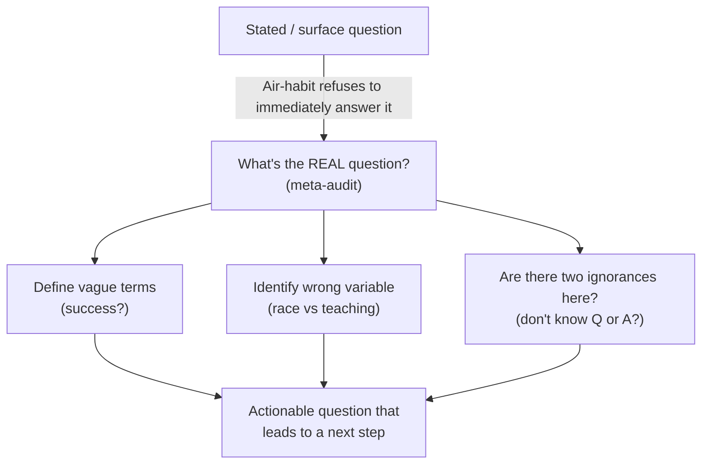

# Air — Raise Questions / Be Your Own Socrates (Burger Habit 3)

**Summary**: Burger and Starbird's third habit of effective thinking ([*The 5 Elements of Effective Thinking*](./burger-5-elements-effective-thinking.md) 2012, Ch 3). Asking is more important than answering. Three sub-moves: (1) how answers can lead to questions · (2) creating questions enlivens your curiosity · (3) what's the real question? The Feynman O-ring story is the canonical Air anchor — cut through complex chemistry-and-mechanics with one basic question. *"What's the real question?"* is the missing atom that fills [anti-tactic-detection](./anti-tactic-detection.md) step 2.5. Names overlap with [automaticity-and-reflex-training](./automaticity-and-reflex-training.md)'s Air=Conceptual skill-type — they are not the same (see [five-elements-mapping-reconciliation](./five-elements-mapping-reconciliation.md)).

**Sources**: [burger-5-elements-effective-thinking](./burger-5-elements-effective-thinking.md) Ch 3 (pp. 73–94); [burger-heart-of-mathematics](./burger-heart-of-mathematics.md) "Welcome!" and "Surfing the book" (pp. xi–xxvi) where questions are operationalized as a pedagogical primitive.

**Last updated**: 2026-05-27 — created during the Burger ingest.

---

## The three sub-moves

### 1. How answers can lead to questions

The Feynman O-ring story (pp. 75–76): On January 28, 1986, the space shuttle *Challenger* exploded shortly after launch. The presidential commission investigating the disaster included Caltech physicist Richard Feynman. Engineering analyses became enormously complex — chemistry, physics, mechanics, materials science. Feynman cut through it all by asking one basic question: *"What if we just test the elasticity of a cooled O-ring?"* He demonstrated live on televised broadcast: a NASA O-ring, a C-clamp, a paper cup of ice water. When he released the C-clamp after submerging the rubber, it did not return to its previous round shape. The coast-to-coast audience watched the miserable mystery resolve in two minutes.

> *"Confident leaders in every profession are not afraid to ask the stupid questions. 'Stupid,' of course, is not the appropriate adjective for these questions — we actually mean basic questions: the questions to which you may feel embarrassed about not already knowing the answers."* — Burger & Starbird p. 76

**Personal policy**: *"Never pretend to know more than you do."* When you don't know something, admit it quickly and immediately take action — ask a question. Paradoxically, asking basic questions makes you appear smarter; pretending to know more makes you less successful over time.

**Overcoming bias** (pp. 77–78): *"Get in the habit of asking, 'Do I really know?'"* Refuse to accept assertions blindly. Challenge teachers. *"You are the best authority on what you don't understand — trust yourself."*

**Take another look**: ask how an issue looks from various viewpoints. Mathematical issues numerically · graphically · algebraically · physically. Social issues economically · globally · locally · historically. *"Everything fits together and interacts — take the transformative step of asking how."*

**"If an exam is looming, write the test itself"** (pp. 78–79): well beforehand, compose a list of good exam questions; put it away; later take that mock test. Composing the questions forces you to ask *"what are the central ideas and do I truly understand them?"* — if you can't create the questions, you're not ready for the test.

### 2. Creating questions enlivens your curiosity

The "official questioner" practice (pp. 84–85): every day in each of Burger's classes he randomly selects two students who are given the title of "official questioner." These students must pose at least one question during that class.

Carrie's testimony (p. 84): one of Burger's students visited his office after being appointed official questioner. *"It was a lecture just like the others, but this time, she said, she was forced to have a higher level of consciousness; she was more alive, more aware of what went on, and more attuned to the subtler content of the discussion. She also admitted that as a result she got more out of that class."* Carrie became a regular question-poser thereafter and added a great deal of value — not just to her own understanding, but to class discussions.

**Don't ask "are there any questions?"** Assume there are. Say: *"Talk to your neighbor for sixty seconds and write down two questions."* Then call on pairs to read their questions.

### 3. What's the real question?

> *"Working on the wrong questions can waste a lifetime."* — Burger & Starbird p. 73

Three of Burger's examples of *bad* questions and what their *better* versions are (pp. 86–88):

| Bad question | What's wrong | Better question(s) |
|---|---|---|
| **"How can I be successful?"** | Vague. Unanswerable until you carefully define "successful." | What does success mean *for me*? Money? Happiness? A specific art-form? |
| **"How can I ace my exam?"** | Focuses on the impending test itself rather than how to improve. *(Like preparing for a 30-push-up challenge by focusing on what shirt to wear, instead of slowly building up push-up capacity over time.)* | "How can I become more engaged in the course material?" · "Could I give a lecture explaining the material?" · "Could I write a detailed outline for this course?" |
| **"Why do African Americans underperform on math tests?"** | Draws attention to the wrong variable: race. *Billions of dollars and frustrating effort* have been spent on this. | Pertinent variables: teaching methods · available resources · constructive help received · encouragement · time on task · feeling of belonging · history of success/failure. Questions about *these* themes lead to interventions that help underperforming students of all races. |

**Two kinds of ignorance**: cases where you know the right question but not the answer · cases where you don't even know which question to ask. *"Seeking the right question forces you to realize that there are at least two kinds of ignorance."*

**Meta-questions** (pp. 91–92): before beginning work on an assignment, ask: *"What's the goal of this task? What benefit flows from the task?"* The bear-and-two-hikers joke: *"We'll never outrun the bear" — "I don't have to. My only question is can I outrun you?"* The second hiker identifies the right question.

> *"There is nothing so useless as doing efficiently that which should not be done at all."* — Peter Drucker (cited Burger & Starbird p. 92)

---

## Where Air fits in the wiki

| Wiki page | How Air shows up |
|---|---|
| [anti-tactic-detection](./anti-tactic-detection.md) | "What's the real question?" is the missing 30-s scan atom — runs as step 2.5 between Classify and Route |
| [crux-recognition-gym](./crux-recognition-gym.md) | "Bear question" pattern is the canonical meta-question audit; recognition < 30 s |
| [orient-method](./orient-method.md) | ORIENT's *Threads* slot is operationalized question-creation in unfamiliar live environments |
| [5-gates-of-comprehension](./5-gates-of-comprehension.md) | Burger's "if you can't create the questions, you're not ready" = the *Falsify* gate |
| [bridge-load](./bridge-load.md) | BRIDGE's Bounded-Question slot is operationalized Burger Air-habit |
| [red-queen-skill-gym](./red-queen-skill-gym.md) | Lamp phase tests recognition; Scale phase tests question-generation under pressure |
| [ants-and-lies-of-learning](./ants-and-lies-of-learning.md) | Per-thought ANT protocol is Air-habit applied to one's own beliefs |
| [socratic-question-generation](./socratic-question-generation.md) | this page |

---

## METER integration

| Event | Operational form | Pass floor |
|---|---|---|
| `real_question_detection_pass` | Given a surface question, name the underlying question that would actually move the needle | ≥60% (floor 30%) |
| `questions_generated_per_lecture_hour` | While listening/reading, generate explicit questions about the material | ≥4/hr |
| `official_questioner_rotations/week` | Pair-up rotations where you (or someone) is required to pose ≥1 question | ≥3/week |
| `meta_question_audit_pre_task` | Before starting a task, write the goal-question and benefit-question | binary; required-gate for >2-hr tasks |
| `exam_self_test_compose_pass` | Compose mock exam ≥1 week before real exam; take it; score | ≥75% on self-composed exam predicts ≥75% on real |

---

## Visual — the Air-habit as a question-tree

---

## Mnemonic — *"Cool the O-Ring, Then Outrun Your Friend"*

Two anchor stories in one line.

- *"Cool the O-Ring"* = Feynman → ask the basic question that cuts through complexity (sub-moves 1+2)
- *"Outrun Your Friend"* = bear/hiker joke → identify the real question (sub-move 3)

---

## Memory Checksum

Numbered inventory (recite in ≤20 s):

1. **Sub-move 1**: How answers can lead to questions (story: Feynman O-ring on televised broadcast)
2. **Sub-move 2**: Creating questions enlivens curiosity (story: Carrie the "official questioner")
3. **Sub-move 3**: What's the real question? (stories: "How can I be successful?" / "How can I ace my exam?" / "Why do African Americans underperform on math?" all reframed)
4. **Personal policy**: Never pretend to know more than you do
5. **"Write the test yourself"** protocol: compose your own exam before the real one
6. **Bear-and-two-hikers joke**: meta-question identification

**Counts**: 3 sub-moves · 5 named stories · 1 personal policy · 1 mock-exam protocol · 1 Drucker quote.

**Recite floor**: ≤20 s for the 3 sub-moves; ≤60 s with stories.

---

## Related pages

- [burger-5-elements-effective-thinking](./burger-5-elements-effective-thinking.md) — parent ingest summary
- [five-elements-mapping-reconciliation](./five-elements-mapping-reconciliation.md) — collision page (Air-habit ≠ Air-skill-type)
- [understand-deeply-habit](./understand-deeply-habit.md) · [fail-to-succeed-habit](./fail-to-succeed-habit.md) · [flow-of-ideas-habit](./flow-of-ideas-habit.md) · [transformative-change-habit](./transformative-change-habit.md) — sibling habits
- [anti-tactic-detection](./anti-tactic-detection.md) — "what's the real question?" is the load-bearing step-2.5 atom
- [orient-method](./orient-method.md) — ORIENT *Threads* slot operationalizes this habit
- [5-gates-of-comprehension](./5-gates-of-comprehension.md) · [bridge-load](./bridge-load.md) — operationalize Burger's question-discipline at the encoder gate
- [crux-recognition-gym](./crux-recognition-gym.md) — bear-question pattern recognition
- [ants-and-lies-of-learning](./ants-and-lies-of-learning.md) — per-thought ANT protocol = Air-habit on beliefs
