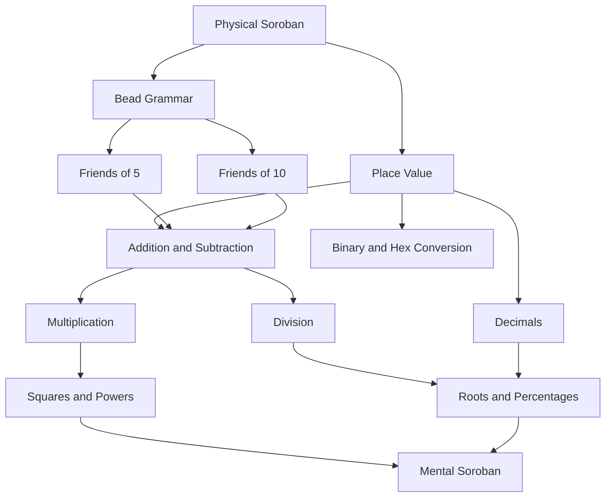
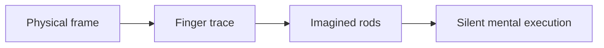
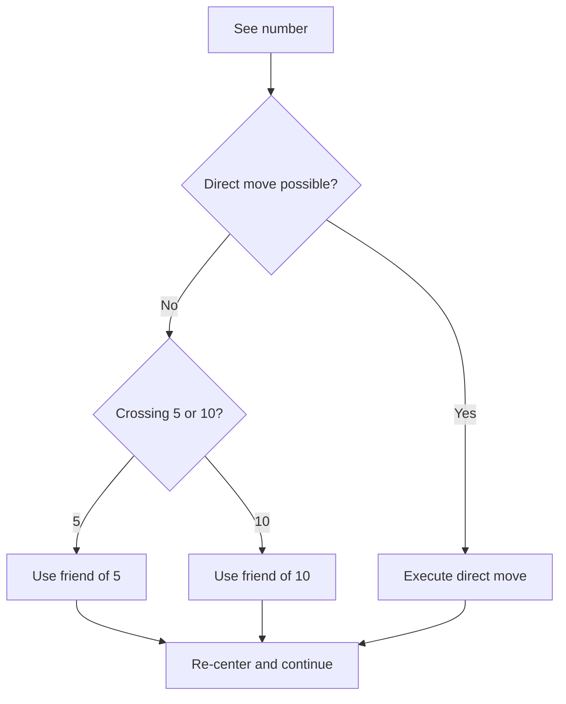
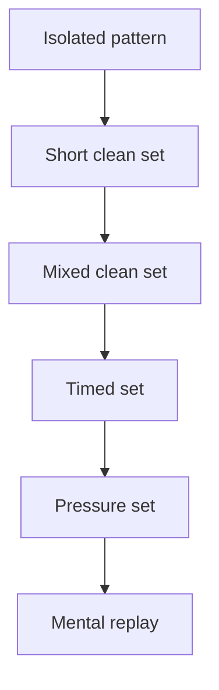
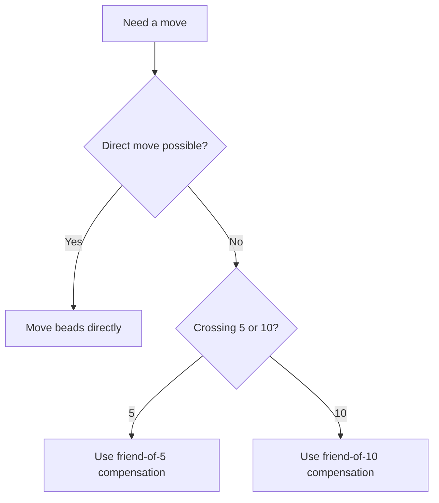
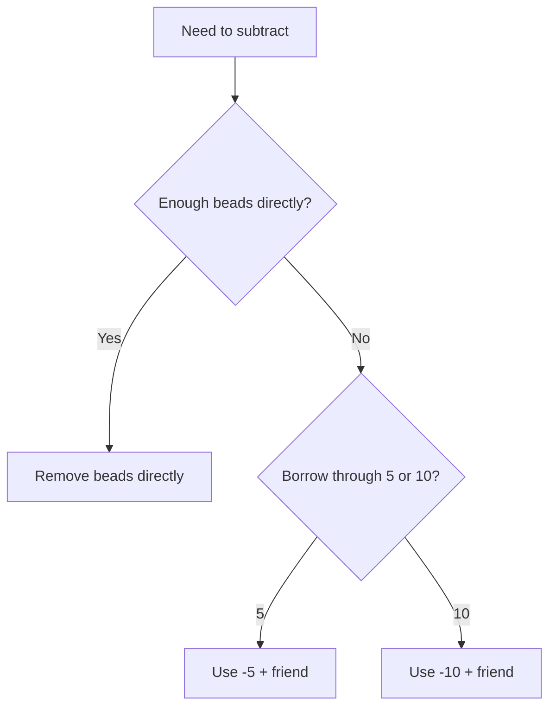
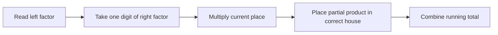
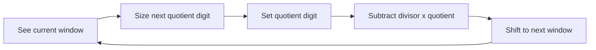

# Soroban Learning Method

External reference: https://www.sorobanexam.org/training.html?serie=4

**Summary**: A practical method for combining soroban with mnemonics so arithmetic becomes a small set of stable visual and procedural patterns rather than raw digit pushing. The core rule is: use soroban for quantity and place value, and use mnemonics for complements, scan rhythm, product facts, root patterns, and base conversion anchors. Includes a visual `0 to hero` roadmap, stage-specific strategies, and an operation peg set so every move type has a fixed familiar scene rather than a reconstructed rule.

**Sources**:
- Original synthesis requested by user
- math-learning-with-neural-os.md
- universal-mental-tagging-framework.md
- symbolic-encoding-systems.md
- [Peg System](./peg-system.md) — owner of the method; abstracted from `raw/Neural OS Book/Peg System.md`
- Number-Shape system — digit values on a rod (0=soccer ball, 1=candle, 2=swan, 3=handcuffs, 4=sailboat, 5=seahorse, 6=elephant trunk, 7=arrow, 8=snowman, 9=lightning)
- Number-Rhyme system — rod positions (0=hero/Superman, 1=sun, 2=shoe, 3=tree, 4=door, 5=hive, 6=bricks, 7=heaven, 8=skate, 9=vine)
- Alphabet Food Peg set (A=Apple … Z=Zucchini), user-specified 2026-06-30; rendered in `tools/soroban-stepper.html` (reference panel), `tools/soroban-place-value-pegs.html` (place-value column identities), and `wiki/assets/alphabet-food-pegs.svg`
- Cube Digit Faces (6 color-redundant die-face images; rose = sky bead; grammar A), user-specified 2026-07-02 via `/validate-idea`; source drawing `Excalidraw/Soroban_PEG.excalidraw.md`

**Last updated**: 2026-08-21 — §Core Claim names the quantity layer as the base-10 instance of [tile-as-calculator](./tile-as-calculator.md)'s general N-cell ring; 2026-08-13 — §Stage 6 gains a scope boundary against the two sibling fading axes ([representation-rules](./representation-rules.md) Rule 9 for visuals, [faded-worked-examples](./faded-worked-examples.md) for solutions); 2026-07-22 — §Stage 6 states the Scaffold Fade (R1–R4) in its general form; it is the protocol three sibling pages ([division-drill-ladder](./division-drill-ladder.md), [squaring-reflexes](./squaring-reflexes.md), [symbolic-fluency-drill-ladder](./symbolic-fluency-drill-ladder.md)) instantiate on their own substrates

---

## Core Claim

Soroban should not be learned as isolated bead moves.

It should be learned in four layers:

1. **Quantity layer**: each rod is a decimal house
2. **Complement layer**: every hard move collapses into a friend-of-5 or friend-of-10 pattern
3. **Procedure layer**: each operation has a fixed scan and execution rhythm
4. **Mnemonic layer**: recurring decisions get image hooks so recall is faster than recomputation

The main discipline is simple:

- do not memorize every possible move
- memorize the small grammar that generates the moves

The quantity layer is base-10 by construction: a rod is a fixed ten-state ring, and every complement in the layer below is a friend-of-10. [tile-as-calculator](./tile-as-calculator.md) is the general form of that ring — an N-cell polyomino holds a base-N digit, with the same cycling-is-addition grammar and the same carry rule parameterized by N. The soroban is its high-throughput physical instance at N = 10. Learn the soroban for speed in decimal; reach for the tile substrate when the same grammar is needed in another base.

## System Diagram



## Visual Index

Use this as a fast map for the page's visual layers:

| Visual cue | What it helps with | Where to look |
|---|---|---|
| `☀️🌍` | one-rod digit states and bead reading | [One-Rod Visual Map](#one-rod-visual-map) |
| `🏠⚡` | complements and compensation logic | [The Two Friend Systems](#the-two-friend-systems), [Stage 2 Drills: Complements](#stage-2-drills-complements) |
| `➖` | borrow behavior and subtraction compensation | [Stage 4 Drills: Subtraction](#stage-4-drills-subtraction) |
| `✖️` | multiplication placement and partial products | [Stage 6 Drills: Multiplication](#stage-6-drills-multiplication) |
| `➗` | quotient windows and full division cycle | [Stage 7 Drills: Division](#stage-7-drills-division) |
| `🧠` | mental soroban transition and replay | [Stage 6: Mental Soroban](#stage-6-mental-soroban), [Mental Soroban To Hero](#7-mental-soroban-to-hero) |
| `🍎` | letter-keyed peg list (independent of the rods) | [Alphabet Food Pegs (A–Z)](#alphabet-food-pegs-az) |
| `🌹` | per-column digit identity for mental soroban (cube faces; rose = sky bead) | [Cube Digit Faces (vertical axis)](#cube-digit-faces-vertical-axis) |

## Soroban Vocabulary

Use one permanent image set:

| Soroban part | Meaning | Mnemonic cue |
|---|---|---|
| upper bead | 5 | **sky bead** `☀️` |
| lower beads | 1 each | **earth beads** `🌍` |
| rod | place value | **number house** `🏠` |
| bar | active boundary | **truth line** |
| left side | larger value | **big houses** `⬅️` |
| right side | smaller value | **small houses** `➡️` |
| decimal point | fixed scale marker | **lantern** `🏮` |

Emoji legend:

- `☀️` = sky bead
- `🌍` = earth bead
- `🏠` = number house
- `🏮` = decimal lantern
- `⬅️` = larger place values
- `➡️` = smaller place values

Operational language:

- bead touching the bar = active `✅`
- bead away from the bar = asleep `💤`
- upper bead = `sky ☀️`
- lower beads = `earth 🌍`

Example:

- `7` is not just seven
- it is `sky + 2 earth`

That makes digits feel structural instead of abstract.

## One-Rod Visual Map

Use this compact rod notation:

- left side = sky bead `☀️`
- right side = four earth beads `🌍🌍🌍🌍` from bar outward
- `*` = active bead touching the bar `✅`
- `o` = asleep bead away from the bar `💤`

Format:

```text
sky | earth
```

Examples:

| Digit | Structure | Rod state |
|---|---|---|
| `0` | `0` | `o | oooo` |
| `1` | `1` | `o | *ooo` |
| `2` | `2` | `o | **oo` |
| `3` | `3` | `o | ***o` |
| `4` | `4` | `o | ****` |
| `5` | `5` | `* | oooo` |
| `6` | `5 + 1` | `* | *ooo` |
| `7` | `5 + 2` | `* | **oo` |
| `8` | `5 + 3` | `* | ***o` |
| `9` | `5 + 4` | `* | ****` |

Vertical view of `7`:

```text
  *
-----
  *
  *
  o
  o
```

If this map is not instant, do not move on to arithmetic.

## The Two Friend Systems

Almost all fast addition and subtraction comes from two complement families.

| Family | Pairs | Mnemonic | Use |
|---|---|---|---|
| friends of 5 | `1-4`, `2-3` | one hand completes 5 | when crossing the sky bead boundary |
| friends of 10 | `1-9`, `2-8`, `3-7`, `4-6`, `5-5` | one house borrows from the neighbor | when crossing the rod boundary |

Compact mantras:

- **Five stays in one house** `🏠`
- **Ten crosses to the next house** `🏠 -> 🏠`

If the learner owns these two complement systems, the rest of soroban becomes much lighter.

Fast complement cues:

- `5` family = `☀️` boundary
- `10` family = next `🏠`

## The Mnemonic Stack

Use the same retrieval order every time:

1. **See the rod** `👀`
2. **Name the needed move** `🏷️`
3. **Check direct or complement** `⚖️`
4. **Execute** `✋`
5. **Re-center the eyes** `🎯`

Recommended mental tags:

- spatial: left = larger, right = smaller
- state: active beads are touching the truth line
- temporal: scan left to right for setup, right to left for carry-sensitive execution
- pattern: direct move, friend-of-5 move, friend-of-10 move

This is the smallest useful soroban mnemonic architecture.

## Operation Pegs

The [Peg System](./peg-system.md) principle: build the structure before the material arrives. For soroban, that means assigning each move type a fixed, familiar scene in advance. When a situation requires a move, the scene appears automatically and the physical steps follow it — no reconstruction needed.

There are six situations. Assign one scene to each and stop re-deriving the logic.

| Move type | Familiar scene | What it triggers |
|---|---|---|
| **Direct** | exact change — you have the right coins, you place them | add or remove earth beads directly |
| **F5 add** | coin flip — no small change, so you use a nickel and get change back | sky bead down `☀️↓`, remove the friend earths |
| **F5 subtract** | returning the nickel — give the nickel back, keep the difference | sky bead up `☀️↑`, add the friend earths |
| **F10 carry** | call the neighbor — your house is full, borrow one unit next door and settle the difference | `+1` earth on tens rod, remove friend earths on ones |
| **F10 borrow** | return to the neighbor — send one unit back and recover what you owe | `−1` earth on tens rod, add friend earths on ones |
| **Sky assist** | double exchange — sky is in the way, so deal with the neighbor first, then clear the sky, then settle the earth | `+10`, then `−5`, then `+earths` (or reversed for sub) |

### How to install these pegs

Do not wait until the drill to form the image.

Build the image deliberately first:

1. Say the scene name aloud: `coin flip`
2. Visualize it for five seconds: a coin spinning, landing, you receiving change
3. Walk through the bead moves while holding the image: sky bead down, friend earths up
4. Repeat for all six move types before any timed drill

Once the pegs are installed, every drill session begins with one retrieval pass — hear the situation, let the scene appear, execute the moves. Speed comes after the images are automatic, not before.

### Rod pegs

Use the **Number-Rhyme system** to remember *which rod* you are on. Each rod index rhymes with a word, and that word has a fixed image.

| Rod | Place value | Rhyme word | Image |
|---|---|---|---|
| `0` | ones | **hero** | Superman |
| `1` | tens | **sun** | bright sun |
| `2` | hundreds | **shoe** | sneaker |
| `3` | thousands | **tree** | oak tree |
| `4` | ten-thousands | **door** | wooden door |

For most soroban work only rods `0` and `1` are active:

- **Hero rod** `0` — the ones place, where earth beads move most often
- **Sun rod** `1` — the tens place, where carries and borrows land

When a step says `+10 (carry on tens)`, the image is: you are moving to the **sun rod**, one earth bead up toward the sun. When a step says `-10 (borrow from tens)`, one earth bead drops away from the sun.

This gives direction to the carry/borrow: you are not just "moving a bead on rod 1" — you are sending something to the sun or pulling it back.

### Complement pegs

Use the **Number-Shape system**: each digit has a fixed image based on what the numeral looks like. Complement pairs then become visual story pairs — no arithmetic needed, just a scene.

Number-Shape key:

| Digit | Shape image |
|---|---|
| `0` | soccer ball |
| `1` | candle |
| `2` | swan |
| `3` | handcuffs |
| `4` | sailboat |
| `5` | seahorse |
| `6` | elephant trunk |
| `7` | arrow / boomerang |
| `8` | snowman |
| `9` | lightning bolt |

Friends of `5` — the seahorse appears when two shapes meet:

| Pair | Visual scene |
|---|---|
| `1 + 4 = 5` | a candle lights the way for a sailboat — a seahorse watches from the water |
| `2 + 3 = 5` | a swan tangled in handcuffs — rescued by a passing seahorse |

Friends of `10` — ten is the finish line, two shapes cross it together:

| Pair | Visual scene |
|---|---|
| `1 + 9 = 10` | lightning strikes the candle — it explodes into ten sparks |
| `2 + 8 = 10` | the swan bumps into the snowman — both tumble into ten pieces |
| `3 + 7 = 10` | the arrow shatters the handcuffs — ten links fly apart |
| `4 + 6 = 10` | the elephant splashes the sailboat — ten waves |
| `5 + 5 = 10` | two seahorses face each other and merge — ten bubbles rise |

Replace any scene with one that loads faster for you. The rule is identical to the operation pegs: if you hesitate, the image has not been stabilized yet.

Fluency test: when you hear `3`, does the handcuffs image appear before you consciously search for it? If not, drill that pair in isolation until it does.

## Alphabet Food Pegs (A–Z)

The three peg sets above are all keyed to *numbers* — Number-Shape for digit values, Number-Rhyme for rod positions, and the operation pegs for move types. They stay exactly as they are: the soroban still reads digits `0–9` through them.

This section adds a **fourth** peg set keyed to *letters*. It is a [Peg System](./peg-system.md) for material that is ordered or labelled **alphabetically** rather than numerically — checklists, indexes, section/menu labels, ranked lists, anything up to 26 stable slots. It never touches the soroban's digit *reading* — the beads still hold the digit `0–9`. The letters do two jobs: a **standalone ordered list** (see *How to use it*), and an optional **place-value column identity** on the soroban itself (see *As place-value column identities*).

The list is an **acrostic** (initial-sound) peg: each letter is anchored by a food whose name starts with that letter. Food is the chosen image family on purpose — one concrete, sensory, edible object per slot, so two pegs never blur into each other.

| Letter | Food | Letter | Food |
|---|---|---|---|
| `A` | 🍎 Apple | `N` | 🍜 Noodles |
| `B` | 🍌 Banana | `O` | 🧅 Onion |
| `C` | 🥐 Croissant | `P` | 🍕 Pizza |
| `D` | 🍩 Donut | `Q` | 🥧 Quiche |
| `E` | 🥚 Egg | `R` | 🍚 Rice |
| `F` | 🍟 Fries | `S` | 🍝 Spaghetti |
| `G` | 🍇 Grapes | `T` | 🌮 Taco |
| `H` | 🍯 Honey | `U` | 🍲 Udon |
| `I` | 🍦 Ice cream | `V` | 🍰 Vanilla cake |
| `J` | 🍮 Jelly | `W` | 🧇 Waffles |
| `K` | 🥝 Kiwi | `X` | 🍛 Xacuti curry |
| `L` | 🍋 Lemon | `Y` | 🥣 Yogurt |
| `M` | 🥭 Mango | `Z` | 🥒 Zucchini |

### How to use it

Same discipline as the operation pegs — install the images before you need them, then retrieve, don't reconstruct.

- **Ordered list** → hang item *n* on the *n*-th letter's food: item 3 rides the Croissant, item 7 rides the Honey.
- **Labelled slot** → use the letter directly: section `Q` is the Quiche shelf.
- **Two-letter index** → chain two foods into one scene (`CV` = a Croissant on a Vanilla cake).

### As place-value column identities

The pegs also work *on* the soroban — not as digits, but as **column labels**. Give each place value its letter-food: `A` = ones, `B` = tens, `C` = hundreds, `D` = thousands, and so on up the frame. The bead column still holds the digit `0–9`; the food only names *which place* you are looking at — the same job the Number-Rhyme rod pegs (hero = ones, sun = tens) already do, but with a more discriminable image and room for far more places.

The payoff: a multi-digit number becomes a **string of foods**. `1598` reads as Donut · Croissant · Banana · Apple carrying `1 · 5 · 9 · 8` — the foods tell you the place, the beads tell you the digit. That column-identity anchor is what keeps the places from blurring during mental soroban (the original reason this composition was flagged as an unlock).

### Flipped pegs = decimal places

The pegs extend *below* the ones, too — by **flipping**. The decimal point is a mirror: integer places sit to its left with **upright** pegs, and fractional places sit to its right reusing the **same foods turned upside-down**. Flipped Apple = tenths, flipped Banana = hundredths, flipped Croissant = thousandths. The flip is the *only* difference between a place and its fractional echo — `A` is both ones (upright) and tenths (flipped), so the pegs never re-anchor and you never run out of letters below the ones.

So `15.98` reads as upright Banana `1` · upright Apple `5` — point — flipped Apple `9` · flipped Banana `8`. You see Apple twice: right-side-up for the ones, upside-down for the tenths. (This supersedes the older "float the decimal point / move the unit rod" trick — the flip keeps the pegs fixed instead.)

Built as a live tool at `tools/soroban-place-value-pegs.html` — 11 integer columns (`A`–`K`, upright) + a decimal point + 4 fractional columns (`A`–`D`, flipped); type a decimal like `15.98` and watch it decode into upright integer pegs and flipped fraction pegs.

### Mnemonic

**"Every letter eats."** Walk `A → Z` as a 26-course tasting menu — Apple, Banana, Croissant … all the way to Zucchini. The plate is the slot; the food is whatever you hang on it.

### Memory checksum

- **26 pegs, one per letter, no gaps and no repeats.** Recite the menu `A → Z`; you should land on Zucchini exactly at `Z`.
- **Three trap slots** (the obvious word doesn't start with the letter): `Q` = **Quiche** (not "cake"), `U` = **Udon** (not "noodles" — that's `N`), `X` = **Xacuti curry** (a real Goan dish, not "x-ray").
- **Collision guard:** `I` Ice cream vs `Y` Yogurt must stay distinct — Ice cream is the **cone** 🍦, Yogurt is the **bowl** 🥣.
- **Four word-not-picture slots:** no exact emoji exists for `J` Jelly (🍮 is flan), `Q` Quiche (🥧 is pie), `U` Udon (🍲 is a pot), or `Y` Yogurt (🥣 is a bowl) — recall these by the **word**, not the glyph. `U` 🍲 and `Y` 🥣 also share the round-bowl silhouette with `N` 🍜 and `R` 🍚, so disambiguate them by contents, not shape.

### The 26-slot card


### Letter labels the place; beads hold the digit

The one rule that keeps this clean: a letter is a *place label*, never a *digit*. The bead column always carries the value `0–9`; the food peg only says **which** place that column is (or, in the standalone list, which slot an item sits in). Letting a letter stand in for a digit *on the beads* would overload one surface with two meanings — exactly the tag collision the wiki's tagging discipline warns against. Used as a column identity or as a standalone list, the alphabet pegs add a second, non-numeric axis without ever disturbing the bead arithmetic.

## Cube Digit Faces (vertical axis)

The food pegs above answer *which place* (the horizontal axis). This section adds the **vertical axis**: *which digit* the column currently holds, as one vivid percept per state instead of a raw bead pattern. Raw bead states are systematic but not distinctive — `7` and `8` differ by one earth bead — which is exactly what makes soroban cheap to *compute* on and expensive to *hold* during mental soroban. Each column becomes a cube (one col is a cube), read through the [observer-inside-method](./observer-inside-method.md) frame, and the cube's face image gives the state a discriminable identity.

Six face images, one per die face, each **color-redundant** — the object *is* its face color, so color and image reinforce the same retrieval:

| Face (die value) | Color | Image |
|---|---|---|
| `1` | yellow | 🚕 Taxi |
| `2` | orange | 🍊 Tangerine |
| `3` | green | 👽 Alien |
| `4` | blue | 🌊 Wave |
| `5` | red | 🌹 Rose |
| `6` | white | 😇 Angel |

### The digit grammar (soroban-faithful)

The encoding mirrors the bead grammar exactly — 4 earth beads + 1 sky bead — so every arithmetic move is a small percept change:

- `0` = the bare food column (nothing on it)
- `1–4` = the earth face alone: Taxi, Tangerine, Alien, Wave
- `5` = **Rose alone** — the rose *is* the sky bead
- `6–9` = **Rose + earth face**: `6` = rose+taxi, `7` = rose+tangerine, `8` = rose+alien, `9` = rose+wave

`1598` then reads down the columns as: Donut+Taxi `1` · Croissant+Rose `5` · Banana+Rose+Wave `9` · Apple+Rose+Alien `8` — the food names the place, the cube faces name the digit, and a friend-of-5 move is literally "toggle the rose, rotate one face."

Rules that keep the grammar clean:

- **One canonical form per digit.** `6` is rose+taxi, never the angel face. The **Angel (`6`) face is retired from digit duty** — it is reserved-icon inventory (a natural candidate for the operator vocabulary in [major-system-for-mathematical-notation](./major-system-for-mathematical-notation.md), e.g. sign or decimal marker, if that need matures).
- **Rose means 5 everywhere in this system** — alone (the digit `5`) or composing (`6–9`). It is deliberately *not* vine: in the frozen audio-peg set of [peg-audio-visual-matrix](./peg-audio-visual-matrix.md), vine already means `9` (and hive means `5`), so a vine sky-bead marker would give one image two numeric meanings across channels — an orthogonality violation under the [UMTF](./universal-mental-tagging-framework.md) rules. Rose appears in no other number channel.
- **Orientation carries no digit information.** The TOP-direction markers in the source drawing serve cube-manipulation fluency only. Digit identity lives entirely in face identity + rose presence — a rotated taxi is still `1`.

### The Merge variant — one object per column (user-proposed 2026-07-02)

The grammar above binds by *interaction* (the alien abducts the apple). The **Merge variant** binds by *material*, [REMAPS](./remaps.md)'s Merge move applied to the column: the digit-object is **built from the food's flesh** — an apple-fleshed taxi is `1` in the ones, a banana-fleshed taxi is `1` in the tens. One percept per column instead of a 2–3-object mini-scene, which makes it the compact read for tableau work (a 4-digit tableau = 4 fused objects).

Division of labor between the two styles:

- **Merge for compactness** — reading and holding a row; minimum object count; the same single-percept philosophy as [peg-audio-visual-matrix](./peg-audio-visual-matrix.md)'s audio×visual binding.
- **Interaction for strength** — motion and bizarreness are the stronger memory channels; when a column keeps slipping, escalate the fused object into a scene. The styles compose: *a banana-fleshed taxi driving through* is both at once.
- **What Merge does not buy**: cross-number distinctiveness. An apple-taxi recurs in every number with `1` in the ones — episodic separation still comes from journey loci, exactly as for interaction scenes.

**Color-trap guard (registered).** The cube faces are color-redundant by design (the taxi *is* yellow), and material fusion collides with that channel: **banana-, lemon-, and honey-fleshed objects are all yellow-on-yellow** against the taxi, and **apple-on-rose is red-on-red**. Merged percepts in these families must differ by **texture and shape — peel, rind, wax, drip — never by hue**. Drill floor before relying on the variant: yellow-family merged-object discrimination (banana-taxi vs lemon-taxi vs honey-taxi) <1s.

### Scope: working representation, not durable storage

This system is the *in-calculation state channel* for mental soroban. It does **not** replace the durable-storage number encoders: [peg-audio-visual-matrix](./peg-audio-visual-matrix.md) keeps the `00–99` single-percept job (one percept per number, bindable inside other scenes at its <1.5s floor — this system spends 2–3 objects per digit and cannot meet that), and the Major System keeps long-digit-string storage (see [major-system-for-mathematical-notation](./major-system-for-mathematical-notation.md) §Routing: the arithmetic substrates and the storage encoders "complement each other; they do not compete"). Within its own scope it supersedes raw bead-state imagery as the thing you *hold* per column; the Number-Shape complement scenes remain the pre-fluency teaching layer.

This section is also **L0/L1 of the [number-codec-ladder](./number-codec-ladder.md)** — the unified architecture that extends these faces upward through tableau snapshots (L2) and the matrix-cell deep pack (L3, candidate) toward durable large-number storage, with a soroban-computed checksum seal. The durable-storage boundary above still holds until that ladder's promotion gate is passed.

### Memory checksum

- **6 images, and each one wears its face color** (taxi yellow, tangerine orange, alien green, wave blue, rose red, angel white). If an image and its color disagree, the image has drifted.
- **Only 4 images carry earth-bead duty** (taxi/tangerine/alien/wave). Rose is the sky bead; Angel is never a digit.
- **Every digit `0–9` has exactly one form**; digits `6–9` always contain the rose.

### METER pass-floors

| Skill | Pass-floor |
|---|---|
| Face image → digit (and reverse) | <1s |
| Column read: (food place, cube state) → place+digit | <1.5s |
| Full 4-column number read (e.g. `1598`) | <5s |
| Friend-of-5 move as percept change (rose toggle + face step) | <2s |

### Visual source

The working drawing lives at `Excalidraw/Soroban_PEG.excalidraw.md` — four unfolded nets: face names, face images, TOP-orientation markers, and die values (opposite faces sum to 7, the structure [observer-inside-method](./observer-inside-method.md) drills).

## 0 To Hero Roadmap

```mermaid
flowchart LR
    Z0[0: Never used soroban] --> Z1[1: Read digits on one rod]
    Z1 --> Z2[2: Build numbers across rods]
    Z2 --> Z3[3: Own friends of 5 and 10]
    Z3 --> Z4[4: Fast addition and subtraction]
    Z4 --> Z5[5: Multiplication layout]
    Z5 --> Z6[6: Division rhythm]
    Z6 --> Z7[7: Squares roots percentages]
    Z7 --> Z8[8: Powers decimals conversions]
    Z8 --> Z9[9: Mental soroban]
    Z9 --> Z10[Hero: Fast accurate flexible]
```



Hero does not mean performing circus arithmetic.

It means:

- accurate under time pressure `⏱️`
- stable across integers and decimals `🔢`
- able to switch between physical and mental soroban `🧠`
- able to use soroban as a general arithmetic interface `⚙️`

## Roadmap Table

| Level | Name | Main goal | Exit test |
|---|---|---|---|
| `0` | zero | understand rods, beads, bar, and place value | can represent any digit `0-9` |
| `1` | novice | build 1-digit and 2-digit numbers cleanly | can set random 2-digit numbers without hesitation |
| `2` | complement learner | own friends of `5` and `10` | answers complements instantly |
| `3` | operator | addition and subtraction become procedural | solves mixed carry and borrow drills accurately |
| `4` | builder | multiplication and division gain structure | can do `2x1`, `2x2`, and simple division reliably |
| `5` | extender | squares, percentages, roots, powers, decimals | can reduce advanced tasks to known patterns |
| `6` | mental soroban user | visualize rods without touching the frame | solves short calculations mentally |
| `7` | hero | speed, flexibility, composure, low error rate | performs mixed calculations with consistent control |

## Learning Sequence

### Stage 1: Number Formation

Learn to flash every digit `0-9` instantly on one rod.

Targets:

- physical soroban first
- no arithmetic yet
- say the structure aloud: `5 + 2`, `5 + 4`, `3`, `0`

Drill:

- random single digits for 2 minutes
- random two-digit numbers for 2 minutes
- random decimals for 2 minutes

### Stage 2: Complements

Drill only the friend systems.

Targets:

- answer every friend-of-5 pair instantly
- answer every friend-of-10 pair instantly

Prompt format:

- `need 3 to make 5`
- `need 7 to make 10`

This stage matters more than early speed.

### Stage 3: Addition And Subtraction

Do not mix multiplication yet.

Targets:

- direct moves
- friend-of-5 compensation
- friend-of-10 compensation
- one carry or borrow
- multiple carries or borrows

### Stage 4: Multiplication And Division

Only start when addition and subtraction are automatic.

Targets:

- one-digit tables
- partial products
- placement discipline
- quotient estimation

### Stage 5: Derived Operations

Build advanced operations as structured reductions:

- percentages -> multiplication or division by `100`
- powers -> repeated multiplication
- roots -> grouped-digit estimation plus subtraction checks
- binary and hex -> conversion overlays, not native soroban arithmetic

### Stage 6: Mental Soroban

Remove the physical frame gradually:

1. physical soroban
2. finger trace without soroban
3. eyes closed with imagined rods
4. silent mental execution



#### Scaffold Fade (R1–R4) — the general form

The four rungs above are not soroban-specific. They generalise to any skill that starts on an external object and ends in the head, and the wiki uses them under that name across substrates:

| Rung | What holds the state | Soroban instance |
|---|---|---|
| **R1** | an external physical object | the frame itself |
| **R2** | gesture — the object is gone, its geometry is not | finger trace on the desk |
| **R3** | an imagined object | eyes closed, imagined rods |
| **R4** | nothing — only the result moves | silent mental execution |

**The promotion criterion is accuracy at low speed, never speed.** Advancing a rung early is the standard way learners stall for months; this page says the same thing twice more (see the Stage-6 caution and the daily-session note) because it is the most-violated rule in the method.

Other substrates instantiate the same rungs with their own R1: the multiple table in [division-drill-ladder](./division-drill-ladder.md), graph paper in [squaring-reflexes](./squaring-reflexes.md), and balance-scale tiles in [symbolic-fluency-drill-ladder](./symbolic-fluency-drill-ladder.md). Each of those pages owns its own rung contents; this section owns the protocol.

**Not the only fading axis.** R1–R4 answer *where the intermediate state lives*. Two sibling axes withdraw different things and carry their own notation — [representation-rules](./representation-rules.md) Rule 9 withdraws the picture, and [faded-worked-examples](./faded-worked-examples.md) withdraws how much of the solution is supplied (step budget `k`). All three run on the same underlying effect, and they are orthogonal: a learner can sit at R2 on the substrate axis while still at `k=1` on the solution axis. Do not restate one axis's rungs on another's page.

## Strategy Diagram



## Learning Strategies From 0 To Hero

### 1. Zero To Novice

Goal:

- remove fear of the frame
- make digits feel physical

Strategy:

- use very short sessions
- say every number aloud while setting it
- do not start timed drills yet
- use only integers at first

Best drills:

- show digit -> set digit
- hear digit -> set digit
- see number -> name bead structure

### 2. Novice To Complement Learner

Goal:

- stop counting beads one by one
- replace counting with complement recall

Strategy:

- isolate friends of `5` and `10`
- drill complements away from the soroban too
- use flashcards: `need 2 to make 5`, `need 8 to make 10`
- do not mix in multiplication early

Best drills:

- complement flash drills
- one-rod compensation drills
- single-carry and single-borrow problems

### 3. Complement Learner To Operator

Goal:

- make addition and subtraction automatic

Strategy:

- sort drills by error type
- do one family at a time: direct, friend-of-5, friend-of-10
- keep rhythm constant
- increase speed only after clean accuracy

Best drills:

- 20 direct additions
- 20 friend-of-5 additions
- 20 friend-of-10 additions
- same pattern for subtraction

### 4. Operator To Builder

Goal:

- make multi-step arithmetic structured rather than chaotic

Strategy:

- separate multiplication facts from soroban placement
- separate division estimation from subtraction mechanics
- use worked examples before speed rounds

Best drills:

- multiplication table recitation
- partial-product placement drills
- quotient estimation drills
- subtraction-under-pressure drills

### 5. Builder To Extender

Goal:

- reduce advanced operations to known primitives

Strategy:

- treat percentages as decimal shifts plus simple fractions
- treat powers as repeated squaring or decomposition
- treat roots as grouping plus estimation
- keep binary and hex as conversion practice, not primary soroban arithmetic

Best drills:

- `10%`, `5%`, `1%`, `25%`, `12.5%` transformations
- square and square-root pairs
- cube and cube-root perfect cases
- binary nibble to decimal conversion

### 6. Extender To Mental Soroban

Goal:

- remove dependency on the physical frame without losing structure

Strategy:

- fade the physical object gradually
- keep the same scan direction as on the real soroban
- use eyes and fingers as light motor cues
- stop if the imagined frame becomes blurry and reset with the physical one

Best drills:

- 2-digit mental addition
- 2-digit mental subtraction
- 1-step percentage and square drills
- visual replay of set -> move -> final state

### 7. Mental Soroban To Hero

Goal:

- handle mixed arithmetic with speed, stability, and low cognitive strain

Strategy:

- mix operations intentionally
- practice under time and under distraction
- keep an error log
- rotate between exactness mode and speed mode

Best drills:

- mixed arithmetic ladders
- decimal-heavy sets
- power and root mini-sets
- conversion sets: decimal <-> binary, decimal <-> hex

## Weekly Roadmap

Use this `12-week` version if you want a direct path.

| Week | Focus | Daily priority |
|---|---|---|
| `1` | rods and digits | number formation |
| `2` | multi-digit numbers and decimals | placement and reading |
| `3` | friends of `5` | one-rod complements |
| `4` | friends of `10` | carry and borrow logic |
| `5` | addition | direct plus complement additions |
| `6` | subtraction | direct plus complement subtraction |
| `7` | multiplication facts | table compression and recall |
| `8` | soroban multiplication | placement and partial products |
| `9` | division | estimate, subtract, shift |
| `10` | percentages, decimals, squares | advanced reductions |
| `11` | roots and powers | grouped digits and decomposition |
| `12` | mental soroban and mixed review | speed plus control |

## Readiness Gates

Do not advance just because the calendar moved.

Advance when the gate is true:

- from Stage 1 to Stage 2: digits are formed instantly
- from Stage 2 to Stage 3: complements are answered without counting
- from Stage 3 to Stage 4: addition and subtraction stay accurate during mixed drills
- from Stage 4 to Stage 5: multiplication table and placement are both stable
- from Stage 5 to Stage 6: advanced operations reduce cleanly to known patterns
- from Stage 6 to Hero work: mental image stays stable across several steps

## Practice Modes

Use three modes only:

| Mode | Purpose | Rule |
|---|---|---|
| slow mode `🐢` | install correct pattern | no timer, verbalize every move |
| clean mode `🎯` | increase fluency | moderate pace, zero sloppy moves |
| speed mode `⚡` | stress-test automaticity | timer allowed, errors logged immediately |

The common mistake is entering speed mode before clean mode exists.

## Anti-Failure Rules

- do not learn multiplication before complements are stable
- do not force mental soroban before the physical scan is automatic
- do not train only speed; train error diagnosis too
- do not mix too many advanced topics in one week
- do not use binary and hex to escape weak decimal foundations

## Perfect Drill System

The best drill system is not random.

It follows one rule:

- isolate `🔹`
- stabilize `🧱`
- mix `🔀`
- speed up `⚡`
- pressure test `🔥`

Every drill below uses the same pass rule:

- `90%+` accuracy before increasing speed
- `95%+` accuracy before advancing to the next stage

If accuracy drops, return to the previous cleaner drill.

For a full zero-to-hero progression with stage mapping, daily blocks, weekly review, and failure-mode routing, use [soroban-drill-ladder](./soroban-drill-ladder.md).

## Drill Ladder



This page contains the detailed named drills. For the dedicated progression page, see [soroban-drill-ladder](./soroban-drill-ladder.md).

## Stage 1 Drills: Beads And Digits

### Drill 1.1: One-Rod Flash

Goal:

- map each digit to bead structure instantly

Method:

- prepare random digits `0-9`
- show one digit
- set it on one rod
- say the structure aloud

Example calls:

- `6` -> `5 + 1`
- `9` -> `5 + 4`
- `3` -> `3`

Visual mini-set:

| Call | Answer | Rod state |
|---|---|---|
| `3` | `3` | `o | ***o` |
| `6` | `5 + 1` | `* | *ooo` |
| `9` | `5 + 4` | `* | ****` |

Dose:

- `30` reps per set
- `3` sets daily

Pass:

- all `10` digits can be set without pause

### Drill 1.2: Two-Rod Build

Goal:

- stop treating multi-digit numbers as separate single digits

Method:

- use random `2-digit` numbers
- set the full number without restarting
- read it back aloud

Visual examples:

| Number | Tens rod | Ones rod |
|---|---|---|
| `24` | `2 = o | **oo` | `4 = o | ****` |
| `57` | `5 = * | oooo` | `7 = * | **oo` |
| `90` | `9 = * | ****` | `0 = o | oooo` |

Dose:

- `20` reps per set
- `2` sets daily

Pass:

- can set and read `20` random `2-digit` numbers cleanly

### Drill 1.3: Decimal Placement

Goal:

- attach scale cleanly before arithmetic begins

Method:

- choose numbers like `3.4`, `12.05`, `0.8`, `25.7`
- place the decimal lantern first
- then set the digits

Visual placement examples:

| Number | Layout idea |
|---|---|
| `3.4` | `3 [lantern] 4` |
| `12.05` | `1 2 [lantern] 0 5` |
| `0.8` | `0 [lantern] 8` |
| `25` | `2 5` |
| `0.25` | `0 [lantern] 2 5` |

Dose:

- `15` reps per set
- `1` set daily

Pass:

- no confusion between `2.5`, `25`, and `0.25`

## Stage 2 Drills: Complements

### Drill 2.1: Friend-Of-5 Flash

Goal:

- instant complement to `5` `⚡`

Method:

- call `1`, learner answers `4`
- call `2`, learner answers `3`
- reverse direction too

Dose:

- `20` calls per set
- `3` sets daily

Pass:

- answers come without counting fingers or beads

### Drill 2.2: Friend-Of-10 Flash

Goal:

- instant complement to `10` `⚡`

Method:

- call `1`, learner answers `9`
- call `7`, learner answers `3`
- reverse direction too

Dose:

- `30` calls per set
- `3` sets daily

Pass:

- all pairs answered in under one second each

### Drill 2.3: Compensation Moves

Goal:

- translate complements into bead actions

Method:

- start from one visible number
- ask for one move that requires compensation
- learner executes and names the compensation

Examples:

- from `8`, add `4` -> `+10 - 6`
- from `3`, add `4` -> `+5 - 1`
- from `12`, subtract `8` -> `-10 + 2`

Visual snapshots:

| Move | Before | After | Spoken logic |
|---|---|---|---|
| `8 + 4` | `* | ***o` | `1` carry, `2` left | `+10 - 6` |
| `3 + 4` | `o | ***o` | `* | **oo` | `+5 - 1` |
| `12 - 8` | tens `*ooo`, ones `**oo` | tens `oooo`, ones `****` | `-10 + 2` |

Compensation decision:



Dose:

- `20` reps per set
- `2` sets daily

Pass:

- compensation statement is immediate and correct

## Stage 3 Drills: Addition

### Drill 3.1: Direct Addition Only

Goal:

- strengthen easy moves without noise

Method:

- use only sums that need no complement
- examples: `21 + 3`, `14 + 2`, `30 + 4`

Dose:

- `25` reps per set
- `2` sets daily

Pass:

- zero hesitation on direct bead moves

### Drill 3.2: Friend-Of-5 Addition

Goal:

- own the `+5 - friend` pattern

Method:

- use problems that cross `5` but not `10`
- examples: `3 + 4`, `2 + 3`, `11 + 4`

Dose:

- `25` reps per set
- `2` sets daily

Pass:

- learner names the compensation before touching beads

### Drill 3.3: Friend-Of-10 Addition

Goal:

- own the `+10 - friend` pattern

Method:

- use problems that cross `10`
- examples: `8 + 6`, `27 + 8`, `43 + 9`

Dose:

- `25` reps per set
- `2` sets daily

Pass:

- carry logic stays clean across rods

### Drill 3.4: Mixed Addition Ladder

Goal:

- combine direct, friend-of-5, and friend-of-10 work

Method:

- solve `10` direct additions
- then `10` friend-of-5 additions
- then `10` friend-of-10 additions
- then `10` mixed additions

Dose:

- `40` reps
- `1` ladder daily

Pass:

- mixed set remains above `90%`

## Stage 4 Drills: Subtraction

### Drill 4.1: Direct Subtraction Only

Method:

- use only easy removals
- examples: `9 - 2`, `15 - 3`, `62 - 1`

Dose:

- `25` reps per set
- `2` sets daily

### Drill 4.2: Friend-Of-5 Subtraction

Method:

- use `-5 + friend` forms
- examples: `15 - 4`, `8 - 3`, `23 - 4`

Dose:

- `25` reps per set
- `2` sets daily

### Drill 4.3: Friend-Of-10 Subtraction

Method:

- use `-10 + friend` forms
- examples: `12 - 8`, `52 - 8`, `70 - 9`

Borrow snapshots:

| Move | Before | After | Spoken logic |
|---|---|---|---|
| `12 - 8` | tens `*ooo`, ones `**oo` | tens `oooo`, ones `****` | `-10 + 2` |
| `52 - 8` | tens `* | oooo`, ones `o | **oo` | tens `o | ****`, ones `o | ****` | `-10 + 2` |
| `70 - 9` | tens `* | **oo`, ones `o | oooo` | tens `* | *ooo`, ones `o | *ooo` | `-10 + 1` |

Borrow decision:



Dose:

- `25` reps per set
- `2` sets daily

### Drill 4.4: Mixed Borrow Ladder

Method:

- `10` direct subtractions
- `10` friend-of-5 subtractions
- `10` friend-of-10 subtractions
- `10` mixed subtractions

Pass:

- clean borrow behavior with no rod confusion

## Stage 5 Drills: Addition And Subtraction Fluency

### Drill 5.1: Alternating Operations

Goal:

- prevent the learner from locking into one operation

Method:

- alternate signs every problem
- example set: `12 + 8`, `20 - 7`, `16 + 9`, `34 - 8`

Dose:

- `30` reps
- `1` set daily

Pass:

- no operation-switch lag

### Drill 5.2: Running Total Drill

Goal:

- build continuity and working-memory control `🧠`

Method:

- start from one number
- apply a chain of `8-12` operations without resetting

Example:

- start `25`
- `+7`
- `-9`
- `+4`
- `+8`
- `-6`

Dose:

- `5` chains daily

Pass:

- final value is correct and rhythm is stable

## Stage 6 Drills: Multiplication

### Drill 6.1: Multiplication Facts Compression

Goal:

- make the table fast enough to support soroban placement

Method:

- recite by patterns, not only by rows
- doubles, near-10, commutative pairs, halves-and-doubles

Dose:

- `5` minutes daily

Pass:

- one-digit products are immediate

### Drill 6.2: One-Digit Times One-Digit On Soroban

Method:

- solve all products from `2x2` to `9x9`
- set result physically each time

Dose:

- `20` reps per set
- `2` sets daily

### Drill 6.3: Two-Digit By One-Digit Layout

Method:

- problems like `24x3`, `17x4`, `32x6`
- say partial product and placement aloud

Placement sketch for `24 x 3`:

```text
   24
x   3
-----
   12   <- 3 x 4, ones-side product
  60    <- 3 x 20, tens-side product
-----
   72
```

Partial-product view:

| Step | Spoken action | Result slot |
|---|---|---|
| `3 x 4` | ones product `12` | ones and tens |
| `3 x 20` | tens product `60` | tens and hundreds |
| combine | `12 + 60` | final `72` |

Layout flow:



Dose:

- `15` reps per set
- `2` sets daily

Pass:

- place value errors disappear

### Drill 6.4: Two-Digit By Two-Digit Grid

Method:

- problems like `12x13`, `24x16`, `31x22`
- track `ac`, `ad`, `bc`, `bd`

Grid sketch for `12 x 13`:

```text
12 = (10 + 2)
13 = (10 + 3)

ac = 10 x 10 = 100
ad = 10 x 3  = 30
bc = 2  x 10 = 20
bd = 2  x 3  = 6

100 + 30 + 20 + 6 = 156
```

Dose:

- `10` reps per set
- `1` set daily

Pass:

- can complete the grid without losing sequence

## Stage 7 Drills: Division

### Drill 7.1: Quotient Estimation

Goal:

- see the next quotient digit quickly `👀`

Method:

- look at a partial dividend window
- estimate the next quotient digit before moving beads

Examples:

- `84 / 7` -> first quotient digit `1`
- `96 / 8` -> first quotient digit `1`
- `144 / 12` -> first quotient digit `1`

Window sketch:

```text
84 / 7
^^
look at the current dividend window first
```

Dose:

- `20` estimates daily

### Drill 7.2: Subtract-The-Product

Goal:

- strengthen the cleanup phase of division

Method:

- give quotient digit and divisor
- learner subtracts the matching product from the current window

Dose:

- `20` reps daily

### Drill 7.3: Full Division Cycle

Method:

- use the full rhythm: see, size, set, subtract, shift
- start with exact divisions only

Examples:

- `84 / 7`
- `96 / 8`
- `144 / 12`

Cycle flow:



Worked sketch for `84 / 7`:

```text
84 / 7
1. see 8 -> quotient digit 1
2. subtract 7 -> remainder 1
3. shift 4 down -> 14
4. quotient digit 2
5. subtract 14 -> 0
result = 12
```

Mental cue:

- `👀 see -> 📏 size -> ✍️ set -> ➖ subtract -> ➡️ shift`

Dose:

- `10` reps per set
- `1-2` sets daily

Pass:

- learner does not lose the window or quotient position

## Stage 8 Drills: Squares, Roots, Percentages

### Drill 8.1: Square Pairs

Method:

- alternate between number and square
- `12 -> 144`, `15 -> 225`, `18 -> 324`

Dose:

- `20` reps daily

### Drill 8.2: Near-Base Squares

Method:

- focus on numbers near `10`, `50`, `100`
- examples: `9^2`, `11^2`, `48^2`, `52^2`

Dose:

- `15` reps daily

### Drill 8.3: Perfect Square Recognition

Method:

- give result first
- learner names the root if exact

Examples:

- `144 -> 12`
- `225 -> 15`
- `324 -> 18`

Dose:

- `20` reps daily

### Drill 8.4: Percent Families

Method:

- take one base number
- compute `10%`, `5%`, `1%`, `25%`, `50%`, `12.5%`

Example:

- base `80`
- `10%=8`, `5%=4`, `1%=0.8`, `25%=20`, `50%=40`, `12.5%=10`

Dose:

- `10` base numbers daily

Pass:

- percent transformations become faster than re-multiplying

## Stage 9 Drills: Cube Roots, Powers, Decimals

### Drill 9.1: Perfect Cubes

Method:

- memorize cube pairs
- `1^3`, `2^3`, `3^3` ... `10^3`

Dose:

- `10` reps daily

### Drill 9.2: Cube Ending Map

Method:

- give cube ending
- learner names root ending

Examples:

- `8 -> 2`
- `7 -> 3`
- `2 -> 8`

Dose:

- `20` calls daily

### Drill 9.3: Exponent Decomposition

Method:

- rewrite powers into doubled blocks

Examples:

- `x^8 = ((x^2)^2)^2`
- `x^13 = x^8 * x^4 * x`

Dose:

- `10` decompositions daily

### Drill 9.4: Decimal Shift Drill

Method:

- shift decimal left or right on command

Examples:

- `25.4` -> `2.54`
- `0.84` -> `8.4`
- `12.05` -> `0.1205`

Dose:

- `20` reps daily

## Stage 10 Drills: Binary And Hex Overlays

### Drill 10.1: Binary Nibbles

Method:

- convert `4-bit` binary groups to decimal and back

Examples:

- `1010 -> 10`
- `0111 -> 7`
- `13 -> 1101`

Dose:

- `20` reps daily

### Drill 10.2: Hex Anchors

Method:

- convert `A-F` to decimal and back

Examples:

- `A -> 10`
- `F -> 15`
- `12 -> C`

Dose:

- `20` reps daily

### Drill 10.3: Decimal Conversion Workflow

Method:

- convert binary or hex to decimal
- do the arithmetic on soroban
- convert back only if needed

Pass:

- learner never confuses conversion with core soroban movement

## Perfect Daily Drill Templates

### Template A: Absolute Beginner `15 min`

1. `4 min` one-rod flash
2. `4 min` two-rod build
3. `3 min` decimal placement
4. `4 min` friend-of-5 flash

### Template B: Early Operator `20 min`

1. `3 min` complements
2. `5 min` direct addition
3. `5 min` friend-of-5 and friend-of-10 addition
4. `5 min` subtraction drills
5. `2 min` mental replay

### Template C: Builder `25 min`

1. `4 min` complement review
2. `6 min` mixed addition and subtraction
3. `7 min` multiplication
4. `5 min` division
5. `3 min` error log review

### Template D: Advanced `30 min`

1. `5 min` warm-up mixed arithmetic
2. `8 min` multiplication or division
3. `7 min` squares, roots, or percentages
4. `5 min` powers or conversions
5. `5 min` mental soroban

## Weekly Drill Rotation

Use this repeating pattern:

- day `1`: install
- day `2`: stabilize
- day `3`: mix
- day `4`: speed
- day `5`: pressure
- day `6`: review weak spots
- day `7`: light recovery and mental replay

Meaning:

- install = slow, isolated patterns
- stabilize = same patterns with more reps
- mix = combine related patterns
- speed = add timer
- pressure = longer chains and less predictable sets

## Drill Design Rules

- one drill should train one main failure point
- short clean sets beat long sloppy sessions
- do not add time pressure until movement patterns are correct
- log every repeated error by category
- when one drill becomes easy, make it mixed before making it fast
- mental soroban starts only after physical soroban is stable

## Addition

Use one decision tree:

1. try direct addition
2. if blocked by the sky boundary, use friend-of-5
3. if blocked by the rod boundary, use friend-of-10

Mantra:

**Same house if possible. Hand if five. Neighbor if ten.**

Examples:

- `8 + 6` -> add `10`, subtract friend `4`
- `27 + 8` -> on ones rod: `+10 - 2`
- `43 + 9` -> on ones rod: `+10 - 1`

Mnemonic image:

- direct move = clean step
- friend-of-5 = flip the sky bead and compensate below
- friend-of-10 = open the next house and pay back the friend

## Subtraction

Use the inverse decision tree:

1. try direct subtraction
2. if blocked by the sky boundary, use friend-of-5
3. if blocked by the rod boundary, use friend-of-10

Mantra:

**Take from the house. If not, take the hand. If not, borrow the neighbor.**

Examples:

- `15 - 4` -> `-5 + 1`
- `52 - 8` -> `-10 + 2`
- `70 - 9` -> `-10 + 1`

The learner should hear subtraction as compensation, not loss.

## Multiplication

Soroban multiplication becomes manageable when split into three memories:

1. the one-digit product table
2. the place-value placement rule
3. the partial-product scan order

Recommended mnemonic:

**Look, multiply, place, carry, continue.**

Training order:

- `1-digit x 1-digit`
- `2-digit x 1-digit`
- `2-digit x 2-digit`
- larger numbers only after the layout is stable

Useful compression patterns:

- near `10`: `9x7 = 10x7 - 7`
- doubles: `4x8 = 2x16`
- halves and doubles: `25x16 = 50x8 = 100x4`

For multi-digit work, treat multiplication as a grid:

`(a + b)(c + d) = ac + ad + bc + bd`

The soroban handles placement; the mnemonic handles which partial product comes next.

## Division

Division is multiplication run backward with repeated estimation.

Use this fixed rhythm:

1. **see** the current dividend window
2. **size** the next quotient digit
3. **set** the quotient digit
4. **subtract** the matching product
5. **shift** to the next window

Mnemonic:

**See, size, set, subtract, shift.**

Division prerequisites:

- instant multiplication table
- stable subtraction under borrow
- good place-value awareness

Without those three, division stays noisy.

## Squaring

Squaring is one of the best advanced soroban drills because the pattern repeats.

Three routes are enough at first:

1. direct squares `1^2` to `25^2`
2. near-base squares
3. split-form squares

Split-form rule:

`(a + b)^2 = a^2 + 2ab + b^2`

Near-base rules:

- `(10 - a)^2 = 100 - 20a + a^2`
- `(10 + a)^2 = 100 + 20a + a^2`
- `(100 - a)^2 = 10000 - 200a + a^2`

Mnemonic:

**Frame, double, patch.**

- frame = the main base square
- double = the middle correction
- patch = the small tail square

## Square Root

Square root is worth learning because it pairs cleanly with squaring.

Use two rules first:

1. group digits in pairs from the decimal point
2. estimate each root digit from the leftmost group, then subtract and continue

Mnemonic:

**Pairs for square roots.**

Core training:

- memorize perfect squares `1` to `30`
- practice pair grouping on integers and decimals
- do only exact or near-exact roots first

## Percentage

Percentages are native to soroban because they are just place-value shifts and fractional combinations.

Anchor set:

| Percentage | Fast soroban meaning |
|---|---|
| `10%` | move decimal one place left |
| `1%` | move decimal two places left |
| `50%` | divide by `2` |
| `25%` | divide by `4` |
| `5%` | half of `10%` |
| `12.5%` | divide by `8` |

Mnemonic:

**Percent means per hundred: shift two, then rebuild.**

Examples:

- `15% of 80` -> `10% + 5%`
- `32% of 250` -> `30% + 2%`
- `12.5% of 64` -> `1/8 of 64`

## Cube Root

Cube root is possible, but it should be learned later than square root.

Start with perfect cubes only.

Two rules:

1. group digits in triples from the decimal point
2. use the last digit to identify the unit digit of the root

Mnemonic:

**Triples for cube roots.**

Perfect-cube ending map:

| Cube ends in | Root ends in |
|---|---|
| `1` | `1` |
| `8` | `2` |
| `7` | `3` |
| `4` | `4` |
| `5` | `5` |
| `6` | `6` |
| `3` | `7` |
| `2` | `8` |
| `9` | `9` |
| `0` | `0` |

For non-perfect cube roots, soroban is best used for estimation and correction, not as the first thing to teach.

## Decimals

Decimals do not change the rod logic.

They only change scale.

Rule:

- rods stay the same
- the decimal lantern tells you where the spoken value begins

Useful habits:

- place the decimal before starting
- if the task is messy, temporarily convert to integers
- restore the decimal at the end

Mnemonic:

**Rods hold quantity. The dot holds language.**

## Powers

Higher powers should not be learned as repeated blind multiplication.

Use exponent decomposition.

Examples:

- `x^4 = (x^2)^2`
- `x^8 = ((x^2)^2)^2`
- `x^13 = x^8 * x^4 * x`

Mnemonic:

**Build powers by doubling, then combine the needed blocks.**

This is the same idea as binary exponent decomposition, which makes powers one of the best bridges between soroban arithmetic and computational thinking.

## Binary And Hex

Standard soroban is a decimal instrument.

So binary and hex are **applicable as overlays**, not as native operating modes.

### Binary

Best use:

- place-value understanding
- power-of-two drills
- exponent decomposition
- decimal conversion practice

Recommended binary mnemonic:

`8-4-2-1`

Treat every nibble as a four-seat room:

- `0001 = 1`
- `0010 = 2`
- `0100 = 4`
- `1000 = 8`
- combine active seats to get the decimal value

### Hex

Best use:

- grouping binary by nibbles
- converting between hex and decimal
- supporting programming and memory-address intuition

Recommended hex anchors:

- `A=10`
- `B=11`
- `C=12`
- `D=13`
- `E=14`
- `F=15`

Practical rule:

- convert hex to decimal when doing ordinary soroban arithmetic
- convert back to hex at the end if needed

If the learner wants native non-decimal abacus work, that is a separate system, not standard soroban.

## Daily 20-Minute Protocol

Use this loop:

1. `3 min` number formation
2. `3 min` complements
3. `5 min` addition and subtraction
4. `4 min` multiplication or division
5. `3 min` one advanced topic: squares, roots, percentages, powers, or conversions
6. `2 min` mental replay with eyes closed

Weekly rule:

- one week = one main operation family
- keep one review block for older families

## Error Rules

If performance stalls, check this order:

1. weak complement recall
2. poor place-value placement
3. unstable scan rhythm
4. multiplication table gaps
5. trying advanced operations too early

Most learners do not fail because soroban is too hard.

They fail because complements and procedure rhythm never became automatic.

## Bottom Line

The soroban method should be learned as:

- a **decimal place-value machine**
- a **complement grammar**
- a **small family of operation routines**
- a **mnemonic system for recurring decisions**

If you do that, addition, subtraction, multiplication, division, squaring, roots, percentages, decimals, powers, and even binary or hex conversion stop feeling like separate subjects and start feeling like variations of one stable interface.

## Related Pages

- [math-learning-with-neural-os](./math-learning-with-neural-os.md)
- [SPEAR](./spear-overview.md)
- [symbolic-encoding-systems](./symbolic-encoding-systems.md)
- [UMTF](./universal-mental-tagging-framework.md)
- [trigonometry-compass-palace](./trigonometry-compass-palace.md)
- [observer-inside-method](./observer-inside-method.md) — the spatial frame the cube digit faces are read through
- [peg-audio-visual-matrix](./peg-audio-visual-matrix.md) — the durable-storage 00–99 channel the cube system deliberately does *not* replace
- [major-system-for-mathematical-notation](./major-system-for-mathematical-notation.md) — long-digit-string storage layer; also where the retired Angel face could serve as a reserved operator icon


---

## U — See (CAST)
1. Soroban learning method spine
2. Bead-driven place-value arithmetic

## D — Name (NEDF)
1. Soroban learning method = bead-arithmetic learning spine
2. Distinguisher: bead-driven, complementary to Vedic
3. Failure mode: confusing physical vs mental soroban path

## F — Do (SPEAR)
1. Pick stage → physical first → mental later
2. Drill via soroban-drill-ladder

## B — Watch (HEART)
1. Stopping at physical
2. Skipping the mental transition

## L — Predict (ORACLE)
1. Stage → predict transferable skill
2. Mental soroban → predict speed

## R — Act (GRACE)
1. Arithmetic learning → start with method
2. Physical mastered → transition to mental