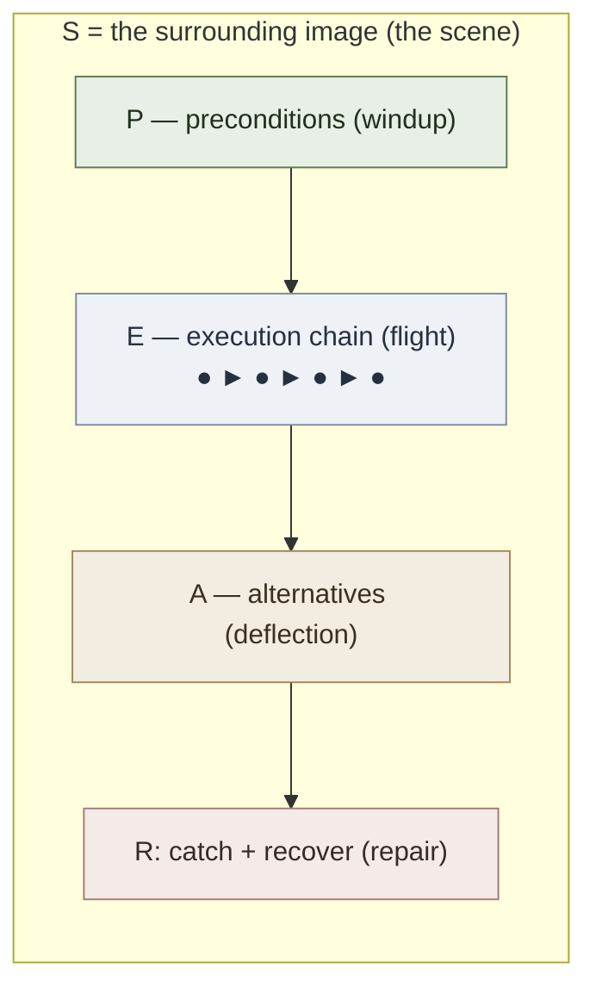

# SPEAR Overview

**Summary**: SPEAR encodes a procedure as **one runnable scene** with five slots: Scene, Preconditions, Execution, Alternatives, Repair. Output is executable memory — recoverable under pressure, not just descriptive notes.

**Sources**: 05_SPEAR_TEMPLATE.md; FRAMEWORK_OVERVIEW.md; Concept Encoding Protocol.md

**Last updated**: 2026-08-20 (§Checksum authored — 3 falsifiable retrieval questions replace the TODO stub); 2026-08-20 (§Mnemonic authored — TODO stub replaced with a real device); 2026-08-20 (`glyph:` assigned — [representation-rules](./representation-rules.md) Rule 11); 2026-05-09 (retrofit pass: applied [representation-rules](./representation-rules.md) 1+2+3+5+7+8)

---

## Glyph



A throw: preconditions are the windup, the chain is the flight, branches and repair catch deflections.

## One-line

> Encode a procedure as one vivid scene + entry conditions + execution chain + branches + repair paths — runnable from memory under pressure.

---

## Concrete example: encoding "Binary Search" with SPEAR

A real worked card before any abstraction.

### S — Scene

A librarian stands before a sorted shelf of books. She tears the shelf in half with one motion, glances at the middle book, throws away the wrong half, and tears the remaining half again. She keeps halving until she's holding the target book — or her hands close on empty air.

(One image carries the whole algorithm.)

### P — Preconditions


| Precondition (all must hold) | Note |
|---|---|
| Array is SORTED | most common failure |
| Random-access available | not a linked list |
| Target type matches array type | — |

If any precondition fails, the procedure is invalid — don't enter.

### E — Execution

```
lo = 0, hi = n - 1
loop while lo <= hi:
    mid = lo + (hi - lo) / 2     ← not (lo+hi)/2 — overflow
    if arr[mid] == target:
        return mid
    if arr[mid] < target:
        lo = mid + 1             ← discard left half
    else:
        hi = mid - 1             ← discard right half
return -1                         ← not found
```

The librarian's hands moving through the shelf *is* this loop. Each tear corresponds to one iteration.

### A — Alternatives


| Variant              | Difference from base                                                          |
| -------------------- | ----------------------------------------------------------------------------- |
| Lower-bound          | Don't return on equality; keep searching left for first occurrence            |
| Upper-bound          | Don't return on equality; keep searching right for last occurrence            |
| Insertion point      | Return `lo` instead of `-1` when not found                                    |
| Rotated sorted array | Compare `arr[mid]` to `arr[lo]` to identify which half is sorted, then decide |

### R — Repair (failure modes and fixes)


| Failure | Symptom | Fix |
|---|---|---|
| Off-by-one | Misses target at boundary | `lo <= hi`, not `lo < hi`, for inclusive bounds |
| Integer overflow | Crashes on huge arrays | `mid = lo + (hi-lo)/2` |
| Infinite loop | Hangs | Ensure `lo` or `hi` *always* moves; never `lo = mid` |
| Wrong comparison branch | Returns `-1` for a present element | Trace `[1,2,3,4,5]` looking for `3` step by step |

**Why this works**: the librarian scene is the global compression. Preconditions block the most common bug (forgot to sort). The execution chain is concrete enough to *run*. Alternatives prevent the rigid base-case-only encoding that snaps under variation. Repair catches the four most common bugs *before* they happen because they're encoded into the procedure itself.

---
- [ ] needs fixing (outdated)
## Where SPEAR sits (2D placement among frameworks)

```p5 height=340
p.setup = () => { p.createCanvas(Math.min(el.clientWidth||600, 600), 340); p.noLoop(); };
p.draw = () => {
  const dark = p.isDark;
  p.background(dark ? 30 : 245);
  const ink = dark ? '#ECE4D3' : '#2B2620';
  const green = '#5c7a54';
  const grid = dark ? '#6b7280' : '#9aa0a6';
  const w = p.width, h = p.height, cx = w / 2, cy = h / 2;
  p.stroke(grid); p.strokeWeight(1.5);
  p.line(cx, 40, cx, h - 40); p.line(40, cy, w - 40, cy);
  p.noStroke(); p.fill(grid);
  p.triangle(cx - 5, 46, cx + 5, 46, cx, 36);
  p.triangle(cx - 5, h - 46, cx + 5, h - 46, cx, h - 34);
  p.triangle(46, cy - 5, 46, cy + 5, 36, cy);
  p.triangle(w - 46, cy - 5, w - 46, cy + 5, w - 34, cy);
  p.fill(ink); p.textStyle(p.ITALIC); p.textSize(12); p.textAlign(p.CENTER, p.CENTER);
  p.text('dynamic / changes over time', cx, 20);
  p.text('static / time-invariant', cx, h - 16);
  p.textAlign(p.LEFT, p.CENTER); p.text('single thing', 44, cy - 14);
  p.textAlign(p.RIGHT, p.CENTER); p.text('many things / network', w - 44, cy - 14);
  p.textAlign(p.CENTER, p.CENTER);
  p.fill(green); p.textStyle(p.BOLD); p.textSize(15); p.text('SPEAR', cx * 0.5, cy * 0.55);
  p.textStyle(p.NORMAL); p.textSize(11); p.text('◀ this', cx * 0.5, cy * 0.55 + 18);
  p.fill(ink); p.text('(procedure)', cx * 0.5, cy * 0.55 + 34);
  p.textStyle(p.BOLD); p.textSize(14); p.text('HEART, ORACLE, GRACE', cx * 1.5, cy * 0.6);
  p.text('NEDF', cx * 0.5, cy * 1.4);
  p.text('CAST', cx * 1.5, cy * 1.4);
};
```

**SPEAR's quadrant**: dynamic + single-thing. A single procedure that unfolds over time. As soon as you need *many* parallel procedures or a graph of procedures, route to [CAST](./cast-overview.md); if the procedure is conditional/predictive, route to [ORACLE](./oracle-overview.md).

---

## The five slots

| Slot | Role | Primary [UMTF](./universal-mental-tagging-framework.md) tag |
|---|---|---|
| **S** Scene | One vivid global image of the whole procedure | Sensory |
| **P** Preconditions | What must be true before entry | State |
| **E** Execution | The core ordered chain | Temporal |
| **A** Alternatives | Branches, variants, edge-case paths | Temporal + Pattern |
| **R** Repair | What goes wrong and how to recover | Priority |

Slots are **not** five flashcards. They are **five entry points into one runnable scene**. The librarian *is* the binary-search procedure — the slots are facets of the same image.

SPEAR is primarily **Temporal + Spatial + State**, with **Priority** essential whenever bugs, preconditions, or repair paths matter.

---

## Boundary set

### What SPEAR is NOT

- Not a checklist — bullets without a unified scene fragment under pressure
- Not pseudocode — pseudocode is abstract; SPEAR demands an embodied image
- Not for static concepts — that's [NEDF](./nedf-overview.md)
- Not for relational graphs — that's [CAST](./cast-overview.md)

### What breaks SPEAR

- **No scene** (bare steps only) — loses the global compression; recall takes O(steps) instead of O(1)
- **Missing preconditions** — most "the procedure failed" cases are really entry-state mismatches
- **No alternatives** — base case stored, but execution snaps when input is one step off-pattern
- **No repair** — procedure collapses under pressure with no recovery path
- **Steps as flat bullets** without a unified narrative — vision can't recruit
- **Generic scene** ("a person doing a thing") — placeholder doesn't anchor; needs sensory specificity

### Adjacent but excluded (deliberate non-features)

- Pure NEDF — single-concept; can't carry temporal flow
- Pure CAST — directional and graph-shaped; lacks ordered execution semantics
- Formal decision trees — accurate but disembodied
- Recipe cards / runbooks — sequences without preconditions or repair

---

## One mental motion

> **Throw the spear**: windup (preconditions), release (scene start), flight (execution), deflection (alternatives), retrieve (repair). One continuous gesture.

Or simpler: **walk the route from start to end while the scene plays at each step**.

If you can't act it out as a single physical motion, the procedure isn't compressed enough.

---

## When to use SPEAR

Use SPEAR when:

- material is an algorithm, workflow, or repeatable process
- order matters
- preconditions determine correctness
- branch handling or repair knowledge matters
- you must execute from memory under pressure

Reach for another framework when the difficulty is:

- defining what a concept *is* → [NEDF](./nedf-overview.md)
- distinguishing one concept from a neighbor → [NEDF](./nedf-overview.md)
- mapping a network of dependencies → [CAST](./cast-overview.md)
- modeling a person → [HEART](./heart-overview.md)
- predicting under conditions → [ORACLE](./oracle-overview.md)

---

## Why it works

- **Scene** compresses the whole process into one image
- **Preconditions** prevent invalid starts (most common procedural failure)
- **Execution** preserves order and intermediate state
- **Alternatives** preserve branching logic so the procedure survives variation
- **Repair** preserves operational resilience under pressure

This is more robust than memorizing bare pseudocode or a checklist, because the procedure becomes a runnable scene — recall traverses the image, not a numbered list.

---

## Multi-resolution zoom

| Size | SPEAR representation |
|---|---|
| **Glyph** | Arrow chain with one alternative branch and a repair catch (the diagram above) |
| **Line** | "One vivid scene + entry conditions + execution chain + branches + repair paths." |
| **Paragraph** | SPEAR is for procedures, algorithms, and workflows. Five slots — S (scene), P (preconditions), E (execution), A (alternatives), R (repair) — collapse into one runnable image. The scene compresses the whole; preconditions guard entry; execution preserves order; alternatives preserve branching; repair preserves recovery. Used when *how to do it* is the hard part, not *what is it* (NEDF) or *what connects to what* (CAST). |
| **Page** | This page |

---

## Relationship to other frameworks

- [NEDF](./nedf-overview.md) handles the concept layer when the algorithm depends on abstract concepts that also need encoding
- [CAST](./cast-overview.md) handles relational structure when the procedure operates inside a larger system
- [ORACLE](./oracle-overview.md) handles the *predictive* version of a procedure (given X, what comes next?)
- [representation-rules](./representation-rules.md) governs how the five slots are filled (concrete-first, diagram, boundary set, embodied motion)

SPEAR is the procedure-focused member of the broader framework family.

---

## Constraint and extension notes

- **Aphantasia.** The Scene slot is the imagery-heavy slot and degrades under absent or weak voluntary visual mental imagery. Compensating moves: Preconditions becomes the retrieval cue (recognise the situation, not the picture), Execution is carried as a procedural list / motor program rather than a mental movie, and Alternatives + Repair are unchanged because they are text-and-rule. See [memory-palace-for-aphantasia](./memory-palace-for-aphantasia.md) §"Notes for SPEAR users" for the full re-weighting.
- **Scene slot won't come into focus.** Diagnostic: you can recite the steps but the global image won't compress — recall stays O(steps), not O(1). That means you don't yet have a *source procedure* to borrow from; the target procedure is sitting in pseudocode and can't recruit vision. Run [BRIDGE LOAD](./bridge-load.md) before encoding, biased to BRIDGE's `machine`, `flow`, or `map` analogy classes (procedures usually borrow from these). Slot routing: Source-procedure image → Scene (the librarian *is* binary search); Mapping (target steps ↔ source actions) → Execution chain; Boundary / breakpoints → Repair (where the source procedure would fail is where the target's recovery lives); Forbidden-transfer / nearest-neighbor → Alternatives (variants of the procedure that the source analogy *doesn't* cover are exactly where Alternatives must be authored). Preconditions stays independent of BRIDGE — entry-state validation is mechanism-specific, not analogical. See [composability-index](./composability-index.md) *comprehension-protocol × encoder* row for the cross-encoder mapping.


## Mnemonic

**"Set the stage · check the locks · run it · know the detours · carry a patch."** S Scene, P Preconditions, E Execution, A Alternatives, R Repair — the order a procedure is actually survivable in. A SPEAR card with no patch is a description, not a procedure.

## Checksum

1. Name the five slots in order.
2. What separates a SPEAR card from pseudocode, and from a plain checklist?
3. Which slot's absence turns a SPEAR card into a description rather than a procedure?

## Related pages

- [representation-rules](./representation-rules.md) — the rules this page was retrofitted against
- [UMTF](./universal-mental-tagging-framework.md)
- [umtf-operational-template](./umtf-operational-template.md)
- [framework-comparison-matrix](./framework-comparison-matrix.md)
- [NEDF](./nedf-overview.md)
- [CAST](./cast-overview.md)
- [HEART](./heart-overview.md)
- algorithm-pattern-nedf-deck — concrete SPEAR-adjacent examples for 12 LeetCode patterns
- [memory-palace-for-aphantasia](./memory-palace-for-aphantasia.md) — Scene-slot caveat and Preconditions/Execution/Repair re-weighting

---

## U — See (CAST)
1. Procedure as one runnable scene
2. 5 slots: Scene · Preconditions · Execution · Alternatives · Repair

## D — Name (NEDF)
1. SPEAR = procedure encoder
2. Output = executable memory, recoverable under pressure
3. Not just description — actually runnable

## F — Do (SPEAR)
1. New procedure → set the Scene
2. Preconditions → check before running
3. Execution → numbered steps; add Alternatives + Repair

## B — Watch (HEART)
1. Steps without preconditions (mis-fires)
2. No Repair slot → fragile under failure
3. Description disguised as procedure

## L — Predict (ORACLE)
1. SPEAR-encoded → survives high-pressure recall
2. Description-only → blanks under stress

## R — Act (GRACE)
1. Procedure spotted → SPEAR, not NEDF
2. Failed run in the field → strengthen Repair slot