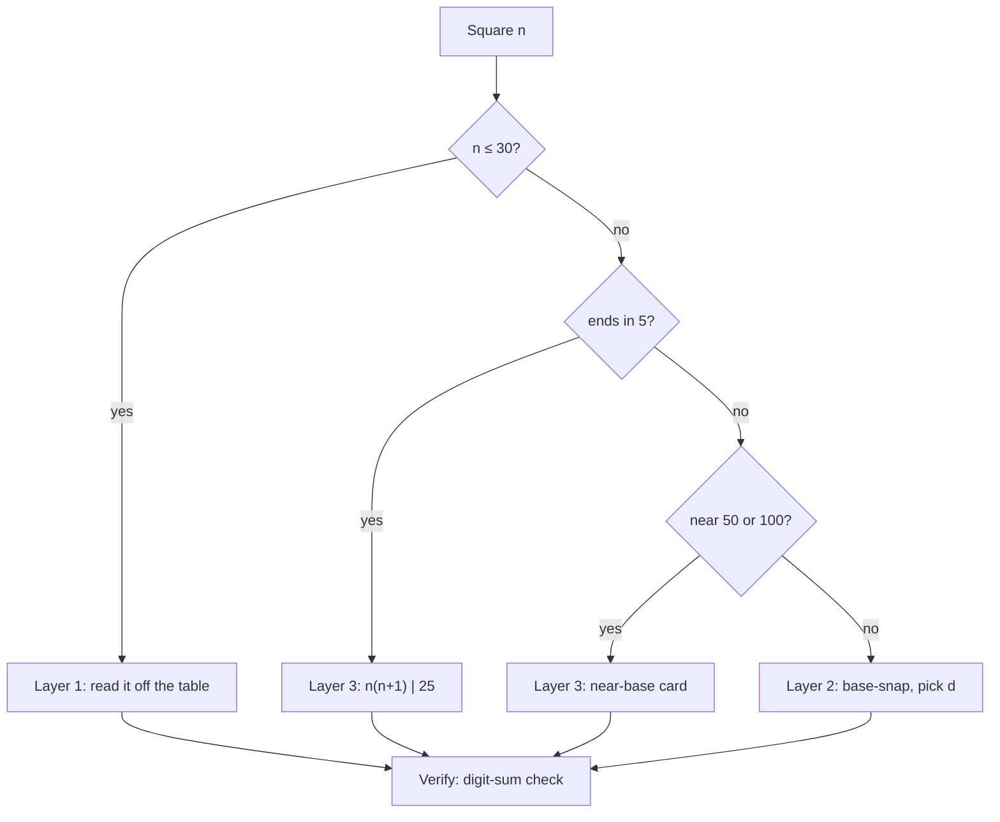

# Squaring Reflexes

**Summary**: Squaring is a *lookup* problem wearing a computation costume, and treating it as computation is why it stays slow. Three layers cover it completely: a memorised table for `1–30` (retrieval, not arithmetic), the **base-snap** identity `n² = (n+d)(n−d) + d²` for everything above it, and two pattern cards (ends-in-5, near-base) that fire so often they are cached rather than derived. Base-snap is not a new method — it is [the generator](./speed-math-unifying-generator.md) with *opposite* offsets, the mirror of the equal-offset case that produces Trachtenberg's three-block squaring. The physical entry point is graph paper, where the identity is a strip cut off one side of a square and slid onto the other; the [Scaffold Fade](./soroban-learning-method.md) carries it from there to silent.

**Sources**:
- [speed-math-unifying-generator](./speed-math-unifying-generator.md) — owns the identity `(B+a)(B+b) = B(B+a+b) + ab` that both squaring routes specialise
- [trachtenberg-squares-and-roots](./trachtenberg-squares-and-roots.md) — the equal-offset route (three-block `[a²][2ab][b²]`); Trachtenberg 1960 Ch 6
- [vedic-speed-math](./vedic-speed-math.md) §4 — ends-in-5 and near-base squaring as pattern cards
- [soroban-learning-method](./soroban-learning-method.md) §Stage 6 Scaffold Fade — the R1→R4 removal protocol; §Stage 8 drills squares on the board
- [peg-audio-visual-matrix](./peg-audio-visual-matrix.md) — the percept vocabulary used for the handful of sticky table entries
- Design conversation 2026-07-22 (operator request: easy physical start, then mental). No new raw source ingested.

**Last updated**: 2026-07-22

---

## The three layers

| Layer | Covers | Kind of thing | Cost to install |
|---|---|---|---|
| **1 — the table** | `n = 1…30` | retrieval | ~18 genuinely new facts |
| **2 — base-snap** | any `n` | one identity | one rule, one worked derivation |
| **3 — pattern cards** | ends-in-5 · near 50 · near 100 | cached specialisations | two cards |

Nothing else is needed. Squaring has no state-holding problem — nothing has to survive between steps — which is precisely why it does **not** get a drill ladder the way [division](./division-drill-ladder.md) does. It gets reflexes.

## Layer 1 — the table is smaller than it looks

Squares `1–12` are already reflex for anyone who owns the times table. Squares `1–30` therefore cost eighteen new facts:

```
   13 169    17 289    21 441    25 625    29 841
   14 196    18 324    22 484    26 676    30 900
   15 225    19 361    23 529    27 729
   16 256    20 400    24 576    28 784
```

Four of those eighteen are free: `15² = 225` and `25² = 625` fall out of the ends-in-5 card, `20²` and `30²` out of place value. The real install is **fourteen facts**.

**Encode only the sticky ones.** Run the table for a week; three or four entries will keep failing (`17² = 289` and `23² = 529` are the usual offenders). Give *those* a [peg-audio-visual-matrix](./peg-audio-visual-matrix.md) percept — the two-digit cell for the input bound to the cell for the output — and leave the rest to plain spaced repetition.

Building the full thirty as encoded scenes is over-tagging, the same anti-ceremony call [number-codec-ladder](./number-codec-ladder.md) makes about sealing four-digit PINs: if everything gets a scene, the scenes stop meaning "this one is hard." Fourteen facts is a small deck, not an encoding project.

## Layer 2 — base-snap, and where it comes from

```
   n² = (n + d)(n − d) + d²
```

Choose `d` so that `n + d` or `n − d` lands on a round number. Then the multiplication is trivial and the correction `d²` is a single-digit square you already own.

```
   47² :  d = 3  →  50 · 44 + 9      = 2200 + 9    = 2209
   93² :  d = 7  →  100 · 86 + 49    = 8600 + 49   = 8649
   68² :  d = 2  →  70 · 66 + 4      = 4620 + 4    = 4624
   112²:  d = 12 →  124 · 100 + 144  = 12400 + 144 = 12544
```

### It is the generator's other symmetric case

[speed-math-unifying-generator](./speed-math-unifying-generator.md) states the identity `(B+a)(B+b) = B(B+a+b) + ab`. Squaring is what you get when the two offsets are related:

- **Equal offsets** (`a = b`): `(10a+b)² = 100a² + 20ab + b²` — Trachtenberg's three-block `[a²][2ab][b²]` pattern ([trachtenberg-squares-and-roots](./trachtenberg-squares-and-roots.md)).
- **Opposite offsets** (`a = −b`): set `B = n`, `a = +d`, `b = −d`, and the identity gives `(n+d)(n−d) = n·n + (d)(−d) = n² − d²`. Rearrange and you have base-snap.

So the two ways to square a number are the two symmetric special cases of one identity, and neither is a new fact. That is the whole delta this page adds to the generator's table: one more row, not a new chapter.

**Which to use.** Base-snap when `n` is within about ten of a round number (which is most of the time, since every `n` is within five of a multiple of ten). Three-block when it is not, or when you are working on paper and want the digit-walk. Above `100`, base-snap almost always wins because `n + d` can be pushed to a clean hundred.

## Layer 3 — the two pattern cards

**Ends in 5.** `(n5)² = n(n+1) | 25`.

```
   85² = 8·9 | 25 = 7225
   35² = 3·4 | 25 = 1225
```

Derivable from base-snap with `d = 5`, but cached anyway — it fires constantly and deriving it costs more than remembering it. [speed-math-unifying-generator](./speed-math-unifying-generator.md) flags exactly this entry as a reflex that earns standalone status despite being derivable.

**Near a base.** For `50 + a`, the square is `(25 + a) | a²`; for `100 + a`, it is `(100 + 2a) | a²` — right block sized to the base's digit budget, overflow carried left.

```
   57² = (25 + 7) | 49  = 3249
   47² = (25 − 3) | 09  = 2209
   107² = (100 + 14) | 49 = 11449
    93² = (100 − 14) | 49 =  8649
```

Note `47²` and `93²` appear in both this section and the base-snap worked set, landing on the same answers by different routes. That is a feature: the two routes cross-check each other, and disagreement means one of them was executed wrong.

## The physical start — graph paper

Layer 2 is the only layer with anything to *understand*, and it has a two-minute physical demonstration that makes it permanent.

On squared paper, `n²` is a square of `n × n` cells. Cut a strip `d` wide off one side — the remaining rectangle is `n × (n − d)`. Slide that strip onto the adjacent side and it extends the rectangle to `(n + d) × (n − d)`, except that the corner `d × d` is missing.

```
   n² = (n + d)(n − d) + d²
        └── the slid rectangle ──┘  └ the missing corner ┘
```

Draw it three times with different `d` and the identity stops being a formula you recall. This is the R1 rung, and it is the reason to buy the tiles or the paper: it is not for daily practice, it is for making one rule unforgettable in an afternoon.

## The fade

Per [soroban-learning-method](./soroban-learning-method.md) §Stage 6 Scaffold Fade, promoting only on accuracy:

| Rung | What you do | Promote when |
|---|---|---|
| **R1** | Graph paper. Draw the square, cut the strip, count the leftover `d²`. | you can predict the leftover before counting it, three times running |
| **R2** | Sketch or trace the cut in the air; arithmetic written: `47² → 44·50 + 9`. | the sketch stops adding anything |
| **R3** | Picture the cut, say `d` aloud, compute silently. | `d` selection is immediate, not searched |
| **R4** | Answer with no visible step. | — |

Layers 1 and 3 skip the fade entirely — they are lookups, and lookups have no scaffold to remove. Only Layer 2 climbs.



## Failure modes

- **Computing what should be retrieved.** Deriving `23²` with base-snap every time means Layer 1 was never installed. Retrieval should beat derivation below 30; if it doesn't, drill the table, not the identity.
- **Sign slip on the correction.** Base-snap *adds* `d²`; difference-of-squares *subtracts* it. `(n+d)(n−d) = n² − d²` and `n² = (n+d)(n−d) + d²` are the same statement, and the direction you are travelling decides the sign. Say the sentence "and add back the corner" out loud during R2 — the graph-paper image is what keeps the sign right.
- **Choosing `d` greedily.** Snapping to the nearest ten is not always best; `112²` snaps to a hundred with `d = 12` and stays easy because `d²` is still a two-digit square you know. The rule is *make one factor round*, not *make `d` small*.
- **Route disagreement ignored.** If base-snap and the near-base card give different answers, one execution was wrong. Do not pick the one that looks nicer — redo it, or settle it with the digit-sum check ([vedic-digit-sum-check](./vedic-digit-sum-check.md)).
- **Over-encoding the table.** Fourteen facts do not need fourteen scenes. See the anti-ceremony note in Layer 1.

## METER pass-floors

Measurement per [METER](./meter-overview.md) convention:

| Skill | Pass-floor |
|---|---|
| Table entry `n ≤ 30` recalled cold | <1 s |
| Ends-in-5 square, any two-digit input | <2 s |
| Near-50 or near-100 square | <3 s |
| `d` selected for an arbitrary two-digit `n` | <1.5 s |
| Base-snap square, two-digit `n`, R4 | <5 s |
| Base-snap square, three-digit `n` near a hundred, R4 | <10 s |
| Cross-route agreement (base-snap vs near-base on the same input) | matches, or the mismatch is caught |

Suggested event names: `square_table_recall` · `square_ends_in_five` · `square_base_snap` · `square_d_selection` · `square_route_crosscheck`.

## Mnemonic

**"Read it, snap it, or know the card."** Below thirty you read; near a base you know the card; everywhere else you snap to a round number and add back the corner.

## Memory checksum

- **Three layers**, and only the middle one has a fade — lookups have no scaffold to remove.
- **Fourteen genuinely new facts** in the `1–30` table once the times table, the ends-in-5 card, and place value are subtracted.
- **The corner is added, not subtracted** — `n² = (n+d)(n−d) + d²`. Travelling the other way flips the sign.
- **Equal offsets give three-block, opposite offsets give base-snap** — both are [one identity](./speed-math-unifying-generator.md), one row apart.
- **Squaring has no state problem**, which is why it gets reflexes and not a ladder.

## Related pages

- [speed-math-unifying-generator](./speed-math-unifying-generator.md) — owns the identity; this page is the squaring row of its delta sheet
- [trachtenberg-squares-and-roots](./trachtenberg-squares-and-roots.md) — the equal-offset route and the square-root inverse
- [vedic-speed-math](./vedic-speed-math.md) — §4 owns the ends-in-5 and near-base pattern cards
- [vedic-perfect-square-roots](./vedic-perfect-square-roots.md) · [vedic-duplex-square-roots](./vedic-duplex-square-roots.md) — the inverse direction
- [division-drill-ladder](./division-drill-ladder.md) — the companion operation, which *is* a state problem and does get a ladder
- [soroban-learning-method](./soroban-learning-method.md) — the Scaffold Fade protocol; §Stage 8 squares on the board
- [peg-audio-visual-matrix](./peg-audio-visual-matrix.md) — percepts for the sticky table entries
- [number-codec-ladder](./number-codec-ladder.md) — the anti-ceremony precedent for not encoding everything
- [vedic-digit-sum-check](./vedic-digit-sum-check.md) — the tie-breaker when two routes disagree

---

## U — See (CAST)
1. A square with a strip cut off one side and slid onto the other, corner missing
2. Three layers stacked: table below, identity above, cards to the side

## D — Name (NEDF)
1. Squaring reflexes = lookup first, one identity second
2. Distinguisher: no state to hold, therefore no ladder — reflexes only
3. Failure mode: deriving what should be retrieved; sign slip on the corner

## F — Do (SPEAR)
1. `n ≤ 30` → read the table
2. Ends in 5 or near a base → play the card
3. Otherwise → snap one factor round, add back `d²`

## B — Watch (HEART)
1. Base-snap used below 30 (the table was never installed)
2. Two routes disagreeing and the nicer answer being kept

## L — Predict (ORACLE)
1. `n` within ten of a round number → predict base-snap wins
2. Table entry still failing after a week → predict it needs a percept, not more reps

## R — Act (GRACE)
1. Square needed live → route by the decision tree, verify by digit-sum
2. Sticky table entry → bind one matrix cell pair, not a whole deck
