# Storm and Siege Protocol (Штурм и Осада)

**Summary**: Canonical owner of **Штурм / Storm** (one massive single-session memorization push, culminating in a "day of records") and **Осада / Siege** (daily systematic small-step accumulation) — the two named, opposed vocabulary-scheduling strategies in Yagodkin & Zgoda's *Учись учиться*. The source's own resolution is that they are **not rivals but phases**: Storm is the accumulation event, Siege is the preservation layer, and the book instructs you to combine them (source: Ягодкин Н.А., Згода А.Н. - Учись учиться - 2023.pdf). This page also carries the vocabulary-scoped **habit-formation** rules attached to Siege, and registers the page's biggest unlock: Yagodkin's hand-waved "learn words *before* the lesson" rule is given a real mechanism by [sleep-dependent-memory-consolidation](./sleep-dependent-memory-consolidation.md), converting folklore into a falsifiable scheduling rule.

**Sources**:
- `raw/05 Meta_Knowledge/Mnemonics/Ягодкин Н.А., Згода А.Н. - Учись учиться - 2023.pdf` — §Расписание запоминания / Штурм и день рекордов / Осада / Формирование привычки. Cited throughout as (source: Ягодкин Н.А., Згода А.Н. - Учись учиться - 2023.pdf).
- McGonigal, K. *The Willpower Instinct* — cited **by the source itself** (Russian ed.: *Сила воли. Как развить и укрепить*, М.: Манн, Иванов и Фербер, 2019), chapter «Эффект „какого чёрта“: почему вина не помогает» ("The 'What the Hell' Effect: why guilt doesn't help"). One of the few external citations in the book.
- Internal: [yagodkin-advance-mnemonics](./yagodkin-advance-mnemonics.md) (lineage Facade), [sleep-dependent-memory-consolidation](./sleep-dependent-memory-consolidation.md) (mechanism owner), [spaced-repetition](./spaced-repetition.md) (spacing owner), [active-recall](./active-recall.md), [desirable-difficulties](./desirable-difficulties.md).

**Last updated**: 2026-08-20 (`glyph:` assigned — [representation-rules](./representation-rules.md) Rule 11); 2026-07-16.

---

## What this page owns

Two strategies, named in the source as the two basic ways to reach any goal, vocabulary included: **штурм** (storm) and **осада** (siege) (source: Ягодкин Н.А., Згода А.Н. - Учись учиться - 2023.pdf).

- **Штурм / Storm** — doing an enormous volume of work in a single approach. It costs large effort and the tempo cannot be held for long (source: Ягодкин Н.А., Згода А.Н. - Учись учиться - 2023.pdf).
- **Осада / Siege** — gradual, systematic, ideally daily acquisition of new material in small steps (source: Ягодкин Н.А., Згода А.Н. - Учись учиться - 2023.pdf).

The source poses "which regime is correct?" and answers: **both are necessary — they have different goals and different areas of application** (source: Ягодкин Н.А., Згода А.Н. - Учись учиться - 2023.pdf). That answer is the spine of this page.

This page does not define the encoding technique the Storm consumes — the image-coding lineage, Воронка and Антибаран live in [yagodkin-advance-mnemonics](./yagodkin-advance-mnemonics.md); the word-to-image mechanics belong to [substitute-word-system](./substitute-word-system.md). This page owns only the **scheduling layer**: how much, how often, in what shape.

---

## Visual — the two regimes side by side

| | **ШТУРМ / Storm** | **ОСАДА / Siege** |
|---|---|---|
| **Shape** | One massive push, single approach | Small steps, ideally daily |
| **Cost** | Large effort; tempo not sustainable | Low effort; sustainable indefinitely |
| **Purpose in source** | Break to the next level; break through difficulty or stagnation; skill formation; psychological function | Repetition of learned words; formation of the daily-practice habit |
| **Volume** | 300 floor · 600 target · 1,000 stretch · 1,500–2,000 records (per day) | 1,000–3,000 words / 3 months on Advance's English courses (≈300–1,000 per month) |
| **Daily norm** | n/a — it is an event, not a norm | 10–30 words in 10 minutes (stated optimum) |
| **Rest** | Rest day between storm days; full rest day before the main storm if ramping 10–12 days | 1 rest day per week, better 2 |
| **Risk if used alone** | "Shatters against impregnable walls" without quality preparation | Never raises the skill ceiling; 100/day stays your maximum |
| **Role in the pair** | **Накопление** — accumulation | **Сохранение** — preservation |

All rows (source: Ягодкин Н.А., Згода А.Н. - Учись учиться - 2023.pdf).

The source's closing instruction on the pair: *combine storm and siege, accumulation and preservation of knowledge, and progress will be rapid* (source: Ягодкин Н.А., Згода А.Н. - Учись учиться - 2023.pdf).

### The Storm ramp

```mermaid
flowchart LR
    P["Week 1<br/>30 min/day<br/>base training"] --> S1
    S1["Storm day 1<br/>100 words"] --> R1["rest day<br/>≥50 new + review all<br/>no overload"]
    R1 --> S2["Storm day 2<br/>200 words"]
    S2 --> R2["rest day"]
    R2 --> S3["Storm day 3<br/>400 words"]
    S3 --> R3["rest day"]
    R3 --> S4["Storm day 4<br/>700 words"]
    S4 --> R4["rest day"]
    R4 --> S5["Storm day 5<br/>1,000 words<br/>= the target"]
    S5 -.->|"if the ramp spans 10–12 days"| F["full rest day before<br/>the main storm —<br/>no exercises at all"]
```

Ramp values and rest rules (source: Ягодкин Н.А., Згода А.Н. - Учись учиться - 2023.pdf). Note the gaps are **+100 / +200 / +300 / +300** — the ramp is *not* a doubling sequence, a detail easy to corrupt in recall.

---

## ШТУРМ — Storm and the day of records

### What Storm is for

The source gives Storm two jobs beyond raw volume: it lets you **cross to the next level, break through a difficulty or a stagnation**, and it is **indispensable in skill formation**. It also carries an explicitly named **psychological function**. Like any real-life storm, it requires quality preparation — otherwise it may "shatter against impregnable walls" (source: Ягодкин Н.А., Згода А.Н. - Учись учиться - 2023.pdf).

The psychological function is stated concretely: if even once in your life you memorize 300 words in a day (better 1,000), you occupy a certain height in your own consciousness, and from there tasks of 50 or 100 words no longer look like tasks — they look like a light warm-up. If your experience tops out at 100 words per day, that stays your maximum and keeps producing stress (source: Ягодкин Н.А., Згода А.Н. - Учись учиться - 2023.pdf). Yagodkin anchors this with a personal case: unable to do a single pull-up in 8th grade, he trained daily to twenty; thereafter ten felt like a warm-up and fifteen didn't count as a result (source: Ягодкин Н.А., Згода А.Н. - Учись учиться - 2023.pdf).

### Day-of-records tiers

Advance closes its «Курс развития памяти», «Учись учиться» and «Технологии работы с информацией» programmes with a **day of records** — memorize as many information units as possible: foreign words, numbers, facts, hieroglyphs (source: Ягодкин Н.А., Згода А.Н. - Учись учиться - 2023.pdf).

| Tier | Units in one day | Source's framing |
|---|---|---|
| **Floor** | **300** | The minimum bar; after the course this is done easily in **2–3 hours** |
| **Target** | **600** | "Impressive"; the result Advance orients **all students aged 18–60** toward |
| **Stretch** | **1,000** | Reached by **~20% of graduates**; most stop at 300–600 |
| **Records** | **1,500–2,000** | Individual record-holders in a single day |

(source: Ягодкин Н.А., Згода А.Н. - Учись учиться - 2023.pdf). The source adds a motive for stopping short of 1,000 that is worth preserving: some students deliberately **reserve room for the next climb**, considering the bar they already took to be very high (source: Ягодкин Н.А., Згода А.Н. - Учись учиться - 2023.pdf).

The **~20% of graduates** figure is Advance-internal programme statistics with no external citation and no stated sample **(needs verification — Advance-internal, no external citation)**.

### The two claimed effects

**1. Intellectual endurance.** The first reason given for the day of records: training intellectual endurance, after which the productivity of *any* mental activity can be raised **at minimum 2–3×** (source: Ягодкин Н.А., Згода А.Н. - Учись учиться - 2023.pdf). This is a broad transfer claim with no study, no measure and no control condition offered **(needs verification — Advance-internal, no external citation)**.

**2. Skill-ceiling transfer.** The second reason: the unusually high load **reveals every bottleneck and difficulty** while simultaneously working all elements of the technology to their maximum (source: Ягодкин Н.А., Згода А.Н. - Учись учиться - 2023.pdf). From this the source draws its sharpest claim:

> Higher skill characteristics will belong not to the person who memorized 100 words a day for a month (3,000 words in total), but to the person who memorized 100 words a day for a week and then went on a storm — **and even if they managed 500 words rather than 1,000, the skill still crosses to a new level** (source: Ягодкин Н.А., Згода А.Н. - Учись учиться - 2023.pdf).

This is the load-bearing and most falsifiable claim on the page: it asserts that **a single high-load event beats 6× the cumulative volume** for skill quality (not for word count). It is offered as "our experience" with no measurement of the skill characteristics in question **(needs verification — Advance-internal, no external citation)**. It is, however, a clean fit with [desirable-difficulties](./desirable-difficulties.md) — a high-load event that degrades in-session comfort while raising the durable parameter — which is the direction a test should probe.

### Storm preparation protocol

The source's 7-step preparation for a 1,000-word storm (source: Ягодкин Н.А., Згода А.Н. - Учись учиться - 2023.pdf):

1. Read the book through and do all exercises, **especially visualization and information-coding** ones.
2. **First week**: 30 minutes of training per day.
3. **From the second week**: choose the days and times for the *preparatory storms*.
4. The ramp: **day 1 = 100 · day 2 = 200 · day 3 = 400 · day 4 = 700 · day 5 = 1,000**. You may cover this faster than five steps — the thousand may settle into memory on the **second** storm day.
5. **Between storm days, at least one rest day**: memorize **not less than 50** new words and repeat everything previously learned, but give no overloads.
6. If you approach the big storm **smoothly over 10–12 days**, take a break the day before and rest **entirely without exercises**.
7. Schedule the main storm on a **day off**, warn friends in advance that you will be unavailable, and exclude all distracting factors.

Two further preconditions are given outside the numbered list: **rest and sleep well before the storm**, and book the storm day in your calendar now, with a reminder for the start of preparation (source: Ягодкин Н.А., Згода А.Н. - Учись учиться - 2023.pdf).

**Textual ambiguity, unresolved in-source**: steps 3–4 call days 1–5 *preparatory* storms yet place the full 1,000 on day 5, while steps 6–7 speak of a distinct "big/main storm." Whether day 5 **is** the day of records or precedes it is not stated. Do not silently pick one — the safe reading is that the ramp terminates *in* the main storm and step 6 covers the slower 10–12-day variant.

### Storm's "rest day" is not a rest day

Worth flagging because it inverts the plain-English word: the mandatory day between storms still carries **≥50 new words plus full review of everything learned so far** (source: Ягодкин Н.А., Згода А.Н. - Учись учиться - 2023.pdf). Only the day before the main storm in the 10–12-day variant is a true zero-exercise day. A reader who takes "rest day" literally breaks the protocol in the safe-looking direction.

---

## ОСАДА — Siege

### The course load

On Advance's English courses students must memorize **1,000 to 3,000 new words in three months** — roughly **300 to 1,000 per month** (source: Ягодкин Н.А., Згода А.Н. - Учись учиться - 2023.pdf).

The source then raises the obvious objection against itself: with a skill of 300 (let alone 1,000) words per day, no daily work should be needed — a couple of weekends would cover a month ahead. Its answer: **"but this is not always so"** (source: Ягодкин Н.А., Згода А.Н. - Учись учиться - 2023.pdf).

### Why words are learned *ahead* of the lesson — four reasons

The source affirms that learning words in advance is a good idea and gives four reasons (source: Ягодкин Н.А., Згода А.Н. - Учись учиться - 2023.pdf):

1. It **is** a storm — it raises the skill to a higher level.
2. Words learned in advance get **repeated**, so by the time you reach the exercises and texts they have already "settled in memory and put down roots."
3. In lessons you **cover more**, because all the words are already known: no time is spent memorizing them and the material is absorbed much faster.
4. **The practice of learning words on the day they must be used strongly slows language progress.**

Reason 4 is the operationally important one, and the source's stated mechanism for it is this:

> It turns out that **different regions of the brain participate with different intensity** in reproducing information **on the day of study** versus **after the first night's sleep** (source: Ягодкин Н.А., Згода А.Н. - Учись учиться - 2023.pdf).

That attribution is hand-waved — no regions are named, no study is cited **(needs verification — Advance-internal, no external citation)**. It is also **superseded**: see §The unlock below, where the wiki supplies a real mechanism that both explains and sharpens the rule. Treat the "different brain regions" phrasing as a folk gloss on a correct instruction, not as the reason to follow it.

### Siege for language skill vs Siege for words

The source draws a distinction the wiki should keep: **memorizing words** is loading information into long-term memory, but **language skills** (understanding, speaking, reading, writing) are a different kind of thing — they are far better trained **one hour daily than seven hours once a week in storm mode**, because intensity matters and skills roll back to the initial level during breaks (source: Ягодкин Н.А., Згода А.Н. - Учись учиться - 2023.pdf). Its supporting observation: school curricula run exactly three subjects at no less than twice a week — mathematics, Russian, and the foreign language — and even so, most of what is studied is still forgotten (source: Ягодкин Н.А., Згода А.Н. - Учись учиться - 2023.pdf).

Conclusion as stated: daily sessions are indispensable in language learning; **even short ones (10–15 minutes) consisting only of repetition let you not lose what was acquired on the storms** (source: Ягодкин Н.А., Згода А.Н. - Учись учиться - 2023.pdf). See [language-learning-protocol](./language-learning-protocol.md) for the wiki's owner of the broader language-skill schedule; this page stops at the vocabulary layer.

### Why Siege still matters for words

Two reasons given (source: Ягодкин Н.А., Згода А.Н. - Учись учиться - 2023.pdf):

- Siege is needed **for repeating** the words already learned.
- The **habit of daily practice is best formed precisely during word memorization** — and once the words are learned, the habitual slot can be redirected to grammar.

The argument for why vocabulary is the ideal habit substrate is worth keeping: with words the task is clear, nothing must be chosen, no preparation is needed if a list exists, five spare minutes buys ten new words, and the result is **visible, tangible and countable**, which drives motivation. Studying a language, by contrast, requires long spin-up — select material, get into the exercise, unpack the topic — and you cannot take a level test daily to see progress (source: Ягодкин Н.А., Згода А.Н. - Учись учиться - 2023.pdf). The source's summary: *memorizing words is the beginning of the path of learning a language, and discipline is everything — not only in language* (source: Ягодкин Н.А., Згода А.Н. - Учись учиться - 2023.pdf).

---

## Habit formation (vocabulary-scoped)

Scoped deliberately: these are the source's habit rules **as they apply to the daily vocabulary norm**. The wiki has no general habit-formation owner, and this page does not attempt to become one — it is the Siege layer's operating manual, nothing broader.

The stated algorithm is "start and don't quit"; starting is generally easy and needs only a moment of maximal motivation, and the failures all live in "don't quit" (source: Ягодкин Н.А., Згода А.Н. - Учись учиться - 2023.pdf).

### The minimum norm

**Optimal norm: 10–30 words learned in 10 minutes** — the reasoning being that even on the busiest day, ten minutes can be found (source: Ягодкин Н.А., Згода А.Н. - Учись учиться - 2023.pdf). The word *minimum* is load-bearing for two reasons the source names:

- Nobody likes acting under compulsion, even self-imposed — so **reward yourself for over-performance** (the source's example: thirty words above norm buys an episode of a favourite series, or ice cream).
- **Better a small norm over-performed daily** than a moment of fright at the volume and abandonment of the whole thing.

Fix the norm **by result, not by time spent** — the source states this is much simpler (source: Ягодкин Н.А., Згода А.Н. - Учись учиться - 2023.pdf).

### The rules around the norm

| Rule | Detail |
|---|---|
| **Rest days** | One per week, **better two** |
| **Pre-loading a busy day** | Learn double the norm the day before a day you know will be full — but **not more than once a week, or it turns into a Storm** |
| **Broken streak** | Don't condemn yourself; we subconsciously avoid situations that lead to self-condemnation, so treat a slip lightly |
| **Penalties** | If you set a fine, **never punish yourself with additional words to memorize** — you risk losing motivation. A fine should be deprivation of something pleasant, or an increase in some routine load |
| **Time** | If no special slot exists, use pauses — transport, waiting, walking. The source's audit trick: open **screen time** on your phone and find the "lost" couple of hours |
| **Preparation** | Have the list ready in the phone/app or printed and left in a visible place; **the simpler the words, the less desire to quit** |

All rows (source: Ягодкин Н.А., Згода А.Н. - Учись учиться - 2023.pdf).

The "not more than once a week or it becomes a Storm" rule is the source policing its own boundary: doubling is a Siege operation only while it stays occasional. That is the cleanest in-source statement that Storm and Siege are **distinguished by frequency and load, not by activity**.

### The "what the hell" effect

The source's stated reason not to break the norm: **when rules are broken, the brain begins to consider them optional and goes on breaking them**. Its illustrations are recidivism (criminals who have served a sentence reoffend at the same crime far more often than ordinary people) and smoking ("there is no such thing as one cigarette") (source: Ягодкин Н.А., Згода А.Н. - Учись учиться - 2023.pdf).

This is the one point in the section carrying a **real external citation**, given in a footnote: McGonigal's *The Willpower Instinct* (Russian ed. Манн, Иванов и Фербер, 2019), chapter «Эффект „какого чёрта“: почему вина не помогает» — the *what-the-hell effect*, in which a single slip cascades into full relapse, and guilt makes it worse rather than better (source: Ягодкин Н.А., Згода А.Н. - Учись учиться - 2023.pdf, citing McGonigal).

Note the internal tension the source leaves standing, and does not reconcile: **"never break the rule, because breaking it makes it optional"** sits directly beside **"don't condemn yourself if you slipped, treat it lightly."** McGonigal's actual result is what dissolves it — guilt is the relapse driver, so the correct posture is *hold the rule, drop the self-punishment*. The source's own advice to never fine yourself with extra words is the same principle applied.

### Self-contract

The source supplies a fill-in-the-blank contract to be signed with yourself, with slots for: city and date · full name · **minutes per day** committed to your development, not counting two days off per week · nearest goals (**number of words**; language level for daily life / work / study / other) · a promise to reward yourself worthily for each achievement · an explicit "if I miss the deadline, nothing terrible happens, but I undertake to re-plan and continue" clause · and an "if I fail the daily norm, I will additionally do the following" penalty slot · signature (source: Ягодкин Н.А., Згода А.Н. - Учись учиться - 2023.pdf).

The "nothing terrible happens — re-plan and continue" clause is the what-the-hell effect being engineered out at the level of the contract itself.

### The discipline case

Yagodkin's own case, from studying in South Korea before he knew mnemonics: a norm of **20 words per day**, written on cards before sleep and drilled by rote every free minute the next day. **600 cards accumulated in a month**, the algorithm became a habit, and by the end of his studies he had **more than 10,000 learned words** — with **not a single day missed** (source: Ягодкин Н.А., Згода А.Н. - Учись учиться - 2023.pdf). His own retrospective: mnemonics beat rote by a multiple, but *a systematic approach and self-discipline produce results even with an imperfect method* — and his anti-slip self-talk was that yielding to a minute's weakness would waste all prior work, "one mistake and the habit is over" (source: Ягодкин Н.А., Згода А.Н. - Учись учиться - 2023.pdf).

---

## The unlock — pre-loading requires a night, not a lesson

**This is the most valuable thing on this page.**

Yagodkin's Siege rule says: load vocabulary **ahead of** the lesson that will use it; learning words on the day they must be used strongly slows progress. His stated reason — "different brain regions participate with different intensity on the day of study versus after the first night's sleep" — is folklore-grade **(needs verification — Advance-internal, no external citation)**. He names no region, cites no study, and offers no way to be wrong.

The wiki already owns the mechanism he is gesturing at. [sleep-dependent-memory-consolidation](./sleep-dependent-memory-consolidation.md) documents the **post-learning lock-in window**: sleep after learning is what locks in the day's encoding, and skipping the *first* night after encoding erases consolidation gains that later recovery sleep cannot restore. That page owns the mechanism; this page owns the scheduling rule that follows from it.

The conversion:

> **Operational rule**: pre-loaded vocabulary must cross **at least one full night's sleep** before the lesson that consumes it.

This is strictly better than Yagodkin's version in three ways:

1. **It has a mechanism.** "The trace has not been transferred to cortex yet" replaces "different regions, different intensity."
2. **It is quantified where his is vague.** The unit is *one night*, not "in advance" — and the first night specifically, since [sleep-dependent-memory-consolidation](./sleep-dependent-memory-consolidation.md) establishes that the first night's character is all-or-nothing.
3. **It is falsifiable.** It predicts a *discontinuity*, not a gradient: same-day pre-loading (morning-load, evening-lesson, no sleep interval) should behave like same-day teaching, while a one-night interval should show the lift. A gradual "more advance notice is better" curve would falsify it; Yagodkin's phrasing predicts nothing either way and so survives any result.

The test that separates them is cheap: **morning-load / evening-lesson** vs **evening-load / next-day lesson**, matched on elapsed hours. Yagodkin's rule as written cannot distinguish these. The sleep-consolidation reading says only the second should work.

Two supporting notes, both flagged as inference rather than source claims:

- The source **independently** prescribes "rest and **sleep well** before the storm" (source: Ягодкин Н.А., Згода А.Н. - Учись учиться - 2023.pdf), which is the same page's **pre-sleep rinse** — sleep before learning preparing the hippocampus to receive, with a documented deficit when deprived. Yagodkin arrives at both sleep windows around the Storm without connecting either to consolidation. That both halves show up is corroborating, not confirming.
- His Korea case wrote cards **before sleep** and drilled them **the next day** (source: Ягодкин Н.А., Згода А.Н. - Учись учиться - 2023.pdf) — incidentally the same one-night interval, though he presents it as a scheduling convenience, not a mechanism.

Do not read the above as the source teaching sleep consolidation. It does not. The mechanism is supplied by [sleep-dependent-memory-consolidation](./sleep-dependent-memory-consolidation.md); the value of this page is that it makes his rule operational and refutable.

---

## The contradiction — is Storm just cramming?

[spaced-repetition](./spaced-repetition.md) carries a **massed practice / cramming** failure-mode row: all study in one block before a deadline, high in-session feel, near-zero one-month retention, stated unqualified. Storm is study massed into one block and claims durable gains. On the surface these collide.

The resolution, stated precisely and without overclaiming:

**Storm and Siege are arguably orthogonal phases, not competing strategies.** Storm is an **encoding event** — it moves material in and, per the source's claim, stresses the technique enough to raise the skill ceiling. Siege is the **spacing and review layer** — its two named jobs are repeating learned words and holding the daily habit. The source itself never proposes Storm as an alternative to review; its instruction is to **combine accumulation and preservation**, and it states that even 10–15-minute daily repetition sessions exist precisely to **not lose what was acquired on the storms** (source: Ягодкин Н.А., Згода А.Н. - Учись учиться - 2023.pdf). Advance always pairs them.

What this does **not** license:

- It does **not** rescue cramming. **Storm without a Siege-phase review schedule *is* just cramming**, and the [spaced-repetition](./spaced-repetition.md) row applies to it in full. The one-month retention of a 1,000-word day with no review afterward is not defended by this page, and the source does not defend it either.
- It does **not** show the spacing effect has an exception. Nothing here contests the Cepeda/Ebbinghaus result. Storm massing occurs at the *encoding* step; the spacing that matters happens across the review schedule that follows, which Siege supplies.
- It does **not** validate the skill-ceiling-transfer claim, which remains **(needs verification — Advance-internal, no external citation)**. The claim is about *skill quality*, not retention; it and the cramming row are not even measuring the same outcome, which is part of why they can both be true.

The honest summary: the apparent contradiction dissolves into a **phase distinction**, and the burden it places on the practitioner is that the Siege schedule is **not optional decoration on the Storm — it is the half that makes the Storm anything other than cramming**.

## Number rule — the ramp is not a stage ladder

The Storm ramp (**100 → 200 → 400 → 700 → 1,000**) is a **session-volume ladder**, not a skill-stage ladder. Its rungs are quantities of words memorized in one sitting; they are not stages, levels, maturity tiers or degrees of automaticity, and they carry no claim about what the learner *can do* at each rung.

Stated explicitly so a future lint pass does not "fix" it: **this ramp is deliberately not cited against [skill-progression-stages](./skill-progression-stages.md), and must not be mapped onto the 0–7 drill ladder or any other registered ordered system.** Forcing that citation here would manufacture exactly the number drift the wiki's consistency rule guards against — five volume numbers would be silently converted into five skill stages that no source claims exist. The same applies to the day-of-records tiers (300 / 600 / 1,000 / 1,500–2,000): those are **volume bars**, not levels.

Where a genuine skill ladder is wanted for this material, [automaticity-and-reflex-training](./automaticity-and-reflex-training.md) owns the reflex-training ladder and [skill-progression-stages](./skill-progression-stages.md) owns the registered stage counts.

---

## METER floors

| Skill | Floor | Card type |
|---|---|---|
| Name both regimes and their one-line contrast | <6s | Free recall |
| State the day-of-records tiers (300 / 600 / 1,000 / 1,500–2,000) | <5s, 100% | Cued recall |
| Recite the ramp (100 / 200 / 400 / 700 / 1,000) | <5s, 100% | Cued recall |
| State the Siege daily optimum (10–30 words / 10 min) | <3s | Cued recall |
| State the pre-loading rule with its mechanism owner | <8s | Cued recall |
| Given "I stormed 1,000 words and did no review" — classify it | <6s | Application (correct answer: cramming; the SR row applies) |
| Name which Storm claims are unverified | <8s | Discrimination |
| Explain why the ramp is not a stage ladder | <8s | Application |

---

## Mnemonic

**The fortress of the thousand words.**

A **fortress on a hill** — the vocabulary you want. Two armies work it at once, and the scene only reads correctly when both are present.

**The siege ring** (below, patient): a circle of tents around the hill. Every evening **one tent lights a lantern** — between **ten and thirty lanterns, lit in ten minutes**, never more effort than that. **Two tents in the ring stay dark all week** — the two rest days. One tent is allowed to light **double lanterns** the night before a storm-cloud day, but only **once around the whole ring per week**; light double twice and the tent catches fire and becomes a Storm. Beside the ring stands a **contract nailed to a post**, half its lines blank, and a **stack of unlit lanterns nobody may use as a punishment** — the fine is never more words.

**The assault ladder** (against the wall, brief and violent): **five rungs** carved **100 · 200 · 400 · 700 · 1,000**. Between every pair of rungs hangs a **hammock with fifty sandbags in it** — the "rest" day that is not restful. Only at the very foot of the ladder, if the climb has taken ten to twelve days, is there a **bare patch of grass with nothing on it at all** — the one true zero day before the main storm.

**Three banners** hang down the wall at heights **300**, **600**, **1,000**; **one climber in five** reaches the thousand-banner, and most stop at the lower two — some deliberately, leaving the height for a later climb. Far above, on the spire, two legendary flags read **1,500** and **2,000**.

**The moon between ladder and gate**: every sack of words carried up the ladder must be **hung on the moon for one whole night** before it can be passed through the gate into the fortress. Words handed straight from ladder to gate **fall through the gate's grate** — that is same-day teaching. The moon is not the source's; it was lent by [sleep-dependent-memory-consolidation](./sleep-dependent-memory-consolidation.md) and it is what makes the rule testable.

**The gate itself only holds if the ring is lit.** Take the siege ring away and the storm is a **raid** — the ladder still reaches the top, the sacks still go over the wall, and by next month the fortress is empty again.

## Checksum

- **Two armies check**: the scene must contain **both** the ring and the ladder. If your image has only the ladder, you have encoded cramming, not this page. If only the ring, you have encoded a 100-a-day plateau that never raises the ceiling.
- **Five rungs, not four or six**: 100 · 200 · 400 · 700 · 1,000.
- **Non-doubling check** (the highest-value drift trap): the gaps are **+100 / +200 / +300 / +300**. If your ladder reads 100 → 200 → 400 → **800** → 1,600, you have smoothed it into a doubling sequence the source does not state. 400 → 700 is **+300**.
- **Three banners + one spire**: 300 / 600 / 1,000 on the wall; 1,500–2,000 on the spire. **One climber in five** reaches 1,000 — if your scene has half the climbers up there, you have inflated an already-unverified figure.
- **Hammock check**: the hammocks between rungs contain **fifty sandbags**, not zero. If your rest day is empty, you have broken the protocol in the direction that feels safe. Only the **bare grass patch** (the 10–12-day variant) is truly empty.
- **Lantern check**: **10–30 in 10 minutes**, and **two dark tents** per week. If the norm in your scene is 100 words because that sounds more serious, you have re-created the exact failure the source designs against — a norm big enough to quit over.
- **Double-light check**: doubling is allowed **once per week per ring**. Twice and the tent burns — it has become a Storm. This is the boundary between the two regimes, and it is *frequency and load*, not activity.
- **No-punishment check**: the unlit lanterns can never be used as a fine. If your scene punishes a dark night with extra words, you have encoded the one thing the source explicitly forbids.
- **Moon position**: the moon sits **between ladder and gate**, never after the gate. Reversed, you have put the sleep window after the lesson, which is the wrong half of the loop and consumes the words before they consolidate.
- **Ladder-is-not-a-staircase**: the rungs are **sacks of words**, never ranks, badges or levels. The moment a rung in your image acquires a title ("adept," "level 3"), you have manufactured a stage ladder out of a volume ladder — the number drift this page explicitly refuses. Nothing on this ladder cites [skill-progression-stages](./skill-progression-stages.md).
- **Unverified-claims check**: three things in the scene are painted in **faded, translucent ink** — the 2–3× endurance gain, the one-in-five figure, and the "storm beats a month of 100/day" skill transfer. If they look as solid as the ramp numbers in your image, you have promoted Advance-internal claims to established fact.

---

## Related pages

- [yagodkin-advance-mnemonics](./yagodkin-advance-mnemonics.md) — the lineage Facade; owns Воронка / Антибаран and the encoding technique the Storm consumes
- [sleep-dependent-memory-consolidation](./sleep-dependent-memory-consolidation.md) — mechanism owner; supplies the post-learning lock-in that makes the pre-loading rule operational
- [spaced-repetition](./spaced-repetition.md) — the spacing/review layer Siege implements; owns the massed-practice failure-mode row this page carves out
- [active-recall](./active-recall.md) — the retrieval half of the Siege review sessions
- [desirable-difficulties](./desirable-difficulties.md) — the frame the skill-ceiling-transfer claim should be tested against
- [automaticity-and-reflex-training](./automaticity-and-reflex-training.md) — owns the reflex-training ladder (which the Storm ramp is *not*)
- [kozarenko-mnemotechnics](./kozarenko-mnemotechnics.md) — sibling Russian mnemonics lineage
- [substitute-word-system](./substitute-word-system.md) — the word-to-image mechanics underneath the volume numbers
- [language-learning-protocol](./language-learning-protocol.md) — owner of the broader language-skill schedule this page's vocabulary layer feeds
- [skill-progression-stages](./skill-progression-stages.md) — registered stage-count owner; deliberately **not** cited for this page's ramp

---

## U — See (CAST)
1. Two regimes on one target: siege ring (daily) + assault ladder (event)
2. Edges: Storm → skill ceiling; Siege → retention + habit; both → vocabulary
3. Pre-load → **night** → lesson (the moon sits on the edge, not the node)

## D — Name (NEDF)
1. Штурм = one massive push, unsustainable tempo, accumulation
2. Осада = daily small steps, sustainable, preservation
3. Distinguisher: they differ by **frequency and load**, not by activity — doubling more than once a week "becomes a Storm"
4. Failure mode: Storm without Siege = cramming, full stop

## F — Do (SPEAR)
1. Want the ceiling raised → ramp 100/200/400/700/1,000 with loaded rest days between, day off for the main storm
2. Ramping over 10–12 days → one true zero-exercise day immediately before
3. Daily → 10–30 words in 10 minutes, 1–2 days off a week
4. Vocabulary needed for a lesson → load it so it crosses one full night's sleep first

## B — Watch (HEART)
1. "Rest day" read literally → it carries ≥50 words + full review
2. Storm with no review schedule attached → cramming wearing a protocol's clothes
3. Punishing a broken streak with extra words → the one explicitly forbidden move; kills motivation
4. Norm set at 100 because it sounds serious → the volume you eventually quit over
5. Quoting the 2–3× / one-in-five / skill-transfer numbers as established → all three are Advance-internal and unverified

## L — Predict (ORACLE)
1. Same-day pre-loading (no sleep interval) should behave like same-day teaching — a discontinuity, not a gradient
2. If pre-loading shows a smooth "more notice = better" curve, the sleep-consolidation reading is wrong and Yagodkin's vaguer version survives
3. The skill-ceiling-transfer claim, if tested, most likely resolves as a [desirable-difficulties](./desirable-difficulties.md) effect rather than a 2–3× general-productivity gain

## R — Act (GRACE)
1. Vocabulary plateau at 100/day → schedule one Storm; the ceiling is psychological before it is technical
2. Language course starting in three weeks → begin pre-loading now, one night minimum per batch
3. Habit broken → drop the guilt, keep the rule, never fine yourself in words
4. Big storm planned → book the day off, warn people, sleep well the night before
