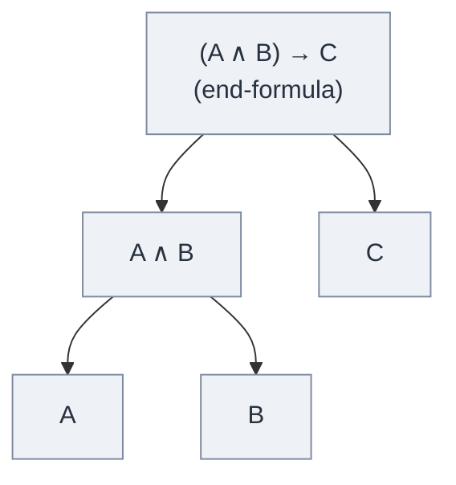

# Sub-Formula Property

**Summary**: In a *normal* [NJ](./natural-deduction.md) proof of A from assumptions Γ, every formula appearing in the proof is a sub-formula of A or of some γ ∈ Γ. The dual: in a *cut-free* [LK](./sequent-calculus.md) proof of Γ ⊢ Δ, every formula appearing is a sub-formula of some formula in Γ ∪ Δ. This is the central structural payoff of [normalization](./normalization-theorem.md) and [cut-elimination](./cut-elimination-hauptsatz.md) — the formal-logic statement that a proof needs no concepts beyond those in its conclusion and [premises](./argument-anatomy.md). The wiki's authoritative source for the proof-theoretic grounding of [TLP show-vs-say](./show-vs-say.md) and the [NEDF](./nedf-overview.md) Distinguisher discipline.

**Sources**:
- [Mancosu, Galvan, Zach (2021)](./proof-theory-mancosu-galvan-zach.md) Ch 4.4 (sub-formula property for the connectives) + Ch 4.8 (sub-formula property for NJ) + Ch 6.10 (consequences of the Hauptsatz).
- an-introduction-to-proof-theory-normalization-cut-elimination-and-consistency-proofs.pdf — Ch 4.5 (the size of normal deductions) + Ch 6.10 (disjunction property of LJ, independence corollaries).
- Prawitz, D. (1965) — original NJ formulation.
- Gentzen, G. (1935c) — original LK formulation as a corollary of the Hauptsatz.
- Orevkov, V.P. (1982, 1993) — lower bounds on the size of cut-free / normal proofs.

**Last updated**: 2026-06-10

---

## Unlocks (lead, not footer)

1. **Sub-formula property × [NEDF](./nedf-overview.md) Distinguisher × `feedback_visual_per_concept` × [show-vs-say](./show-vs-say.md).** The Distinguisher of an NEDF card asks: *what makes A different from its nearest neighbor B?* The answer must use *sub-features of A* — not external concepts. The sub-formula property is the formal-logic statement of exactly this: a normal proof of A uses only sub-formulas of A. **Both disciplines say: the concept's content is its sub-structure, and nothing else.** TLP 4.121 says propositions *show* their [logical form](./picture-theory-of-language.md) (which is their sub-formula structure). The sub-formula property gives this its formal home.

2. **Sub-formula property × wiki page discipline × `/lint` parallel-definition check.** CLAUDE.md §Consistency Rules: a registered glossary term must not be re-defined on a non-owner page. The sub-formula property is the formal-logic version: a concept that doesn't appear in the page's stated thesis (its end-formula) must not be invented on the page. *Either link to the owner, quote it, or refactor the claim to be about how the term is used here, not what it is.* **The wiki's own audit discipline gets a proof-theoretic basis.**

3. **Sub-formula property × decidability × proof search.** Because every formula in a cut-free / normal proof of a propositional formula A has bounded size (size ≤ size of A), cut-free / normal proof search is *finite* — propositional logic is *decidable* by the sub-formula property alone. This is the foundational ancestor of every modern SAT / SMT solver: the sub-formula property is *why* propositional reasoning is in principle finite, even when the practical algorithm is exponential.

## Mnemonic

**SUBS** = *Sub-formulas-only · Use-cited-or-derived · Bounded-by-conclusion · Show-vs-Say-formalized.*

Reads as "subs" — every formula in a normal proof is a *sub-formula* of something already on the table.

## Memory checksum

If you can answer these in <60 s each from memory, the page is encoded:

1. State the **sub-formula property for NJ**. (*In a normal NJ proof of A from open assumptions Γ, every formula occurring is a sub-formula of A or of some γ ∈ Γ.*)
2. State the **sub-formula property for cut-free LK**. (*In a cut-free LK proof of Γ ⊢ Δ, every formula occurring is a sub-formula of some formula in Γ ∪ Δ.*)
3. Why does the **NK version** need slight attenuation? (*NK's classical-absurdity rule introduces ⊥ from a proof of contradiction with ¬A; the resulting normal NK proof's formulas are sub-formulas of A, of open assumptions, OR are formulas of shape ¬sub-formula. The "negation-attenuation" is unavoidable because classical logic intrinsically uses negative information.*)
4. What follows from the sub-formula property for **propositional logic**? (*Decidability. The set of sub-formulas of A is finite; normal-proof search through this set is a finite tree; therefore "A is a theorem" is decidable.*)
5. What follows from the sub-formula property for **NJ specifically** that fails for NK? (*The existence property: if NJ ⊢ ∃x A(x), then a normal proof's last rule is ∃I, which requires a specific term t with NJ ⊢ A(t). Witness is extracted from the proof. NK doesn't have this — classical ∃-proofs need not exhibit witnesses.*)

## Visual — the property in pictures

**End-formula → its sub-formula tree**:

The normal NJ proof of *((A ∧ B) → C)* may use only: *((A ∧ B) → C)*, *(A ∧ B)*, *A*, *B*, *C* — these and only these (plus formulas from open assumptions).

**Counterexample without the sub-formula property** — a proof of *A → A* that (illegitimately) leans on an external fact about negation as a lemma:

1. *A → ¬¬A* — some external fact about negation
2. *¬¬A → A* — double-negation elimination (CLASSICAL!)
3. (1) + (2) by transitivity → *A → A*

The formulas *¬¬A*, *¬A* do NOT appear in the conclusion *A → A* nor in any open assumption. This proof is NOT normal.

The Hauptsatz says: it can be transformed into a normal proof that uses only sub-formulas of *A → A* — which is just *A* and *(A → A)*. The normal proof is the identity proof.

The property is what makes a proof a *direct* argument: nothing in the proof refers to concepts outside the conclusion and premises.

---

## What the property says (precisely)

### For NJ (Mancosu et al. Ch 4.4 and 4.8)

A normal NJ-deduction has the structure of an *E-part followed by I-part* (the "main branch" structure):

- Going from the bottom of the proof upward, you first encounter introduction rules (and ⊥-elim) — call this the **I-part**.
- Above that, you encounter elimination rules — the **E-part**.
- The boundary is the **minimum formula** of the main branch.

In each segment, formulas only *get smaller* (sub-formulas of what was above / below). The end-formula and the open assumptions cap the whole structure. Result: *every* formula in the proof is a sub-formula of the end-formula or of an open assumption.

### For LK / LJ (Mancosu et al. Ch 6.10)

Direct: every sequent-calculus rule (other than cut) introduces a formula that is either an axiom A ⊢ A (atomic) or a formula whose principal sub-formula was already in a premise. So cut-free LK proofs have the sub-formula property by induction on proof structure.

The Hauptsatz adds: this holds for *every* LK/LJ proof, since cuts can be eliminated.

### For NK (Mancosu et al. Ch 4.9)

NK's classical rules (absurdity, double-negation elim) create the possibility that a sub-formula appears *negated* in the proof even when the conclusion doesn't mention it negated. The precise statement:

> Every formula in a normal NK-deduction of A from Γ is a sub-formula of A or of some γ ∈ Γ, OR is of the form ¬B where B is such a sub-formula.

This attenuation is structural — it reflects the classical option of arguing through negation. Pure intuitionistic logic has no analog.

## Why it matters

### 1. Consistency

Pure NJ has no proof of ⊥. Pure LK has no proof of the empty sequent. Both consistency proofs follow by inspection of cut-free / normal proof shapes:

- Normal NJ proof of ⊥ would have empty I-part (can't introduce ⊥ from nothing) and empty E-part (sub-formulas of ⊥ are just ⊥). Contradiction.
- Cut-free LK proof of ⊢ (empty sequent) would require a rule whose conclusion is the empty sequent. No such rule exists in cut-free LK. Contradiction.

This is a **finitary** consistency proof for pure logic. (For arithmetic, the consistency proof goes through cut-elimination + ordinal induction — see [consistency-of-peano-arithmetic](./consistency-of-peano-arithmetic.md).)

### 2. Decidability of propositional fragment

Sub-formulas of a propositional formula A form a finite set. Cut-free / normal proof search through this finite set terminates. **Propositional logic is decidable.**

This is the conceptual basis for SAT solvers, BDD-based reasoning, tableau methods. Practical decidability is exponential in the worst case (np-completeness of SAT), but *in-principle* decidability is the sub-formula property.

### 3. Existence and disjunction properties (NJ)

In a normal NJ proof of ∃x A(x), the *last* inference must be ∃I (because no other intro rule produces ∃-formulas, and a normal proof has no detours, so the last rule can't be an elim feeding into nothing).

∃I requires a specific term t such that A(t) is the premise. So the proof *exhibits* the witness. Similarly for ∨: normal NJ proof of A ∨ B ends with ∨I, which requires either A or B as premise.

**This fails for NK.** Classical proofs of ∃x A(x) can use the classical absurdity rule to derive ∃x A(x) without naming any specific witness — they prove that *not all x fail*, which classically implies *some x succeeds* but doesn't extract that some.

### 4. Constructive content

For NJ: the sub-formula property is the formal-logic statement of *the Brouwer-Heyting-Kolmogorov interpretation* of intuitionistic connectives — every proof of ∃x A(x) gives a witness; every proof of A ∨ B gives a winning disjunct; every proof of A → B gives a method for converting proofs of A to proofs of B. See [proof-theoretic-semantics](./proof-theoretic-semantics.md).

For NK: no such constructive content in general — but the sub-formula property still bounds the *form* of the argument.

### 5. The formal home of show-vs-say

[TLP 4.121](./show-vs-say.md): *propositions show their logical form; they display it.* TLP 4.1212: *what can be shown cannot be said.*

The sub-formula property says: a normal proof of A *shows* what A requires (its sub-formulas) and *cannot say anything beyond that* (no external formulas appear). The normal proof is a *picture* of A's structure in the TLP sense.

This is the strongest unlock from the Mancosu et al. ingest. The wiki's `feedback_visual_per_concept` rule — every concept page must ship with a visual — gets a deeper philosophical home: the visual is the page's normal form, *showing* what the concept's sub-structure is. A text-only concept page is trying to *say* what can only be *shown*.

## The price of normality — size blowup (§4.5)

The sub-formula property is not free. Forcing a proof into normal form can make it **dramatically larger**. The cleanest illustration in the source is a family of formulas p ⊃ A(n), where A(n) is a nested conjunction of depth n (source: an-introduction-to-proof-theory-normalization-cut-elimination-and-consistency-proofs.pdf, Ch 4.5):

- The **normal** deduction of p ⊃ A(n) has size **at least 2^(n−1)** — it is exponential in n, because the normal form must rebuild every layer of the conjunction from its sub-formulas and there are no smaller normal proofs (source: an-introduction-to-proof-theory-normalization-cut-elimination-and-consistency-proofs.pdf, Ch 4.5).
- But there is a **non-normal** deduction — built by *chaining* a fixed size-5 lemma R(B,C,D) together with size-2 connectors — whose size grows only *linearly*: 9n − 16 (for n ≥ 3) (source: an-introduction-to-proof-theory-normalization-cut-elimination-and-consistency-proofs.pdf, Ch 4.5).

So the chained non-normal proof reuses a detour as a *lemma* and stays small, while the normal proof is forbidden that reuse (a lemma whose formula is not a sub-formula of the conclusion would violate the property) and must pay exponentially. The source tabulates the gap directly: for n = 7, 8, 9, 10 the normal vs non-normal sizes are 64 vs 47, 128 vs 56, 256 vs 65, 512 vs 74 — the normal proof's size explodes while the chained one crawls (source: an-introduction-to-proof-theory-normalization-cut-elimination-and-consistency-proofs.pdf, Ch 4.5).

**Orevkov lower bounds.** This is not an artifact of one toy family. Orevkov (1982, 1993) proved rigorous lower bounds showing that *no* short normal (cut-free) proofs exist for whole classes of formulas — normalization can entail a non-elementary blowup in the worst case (source: an-introduction-to-proof-theory-normalization-cut-elimination-and-consistency-proofs.pdf, Ch 4.5, fn. 6).

The moral for the wiki: the sub-formula property buys *directness and decidability* but charges in *size*. This is the proof-theoretic statement of a tradeoff the wiki feels constantly — a self-contained page (every claim traces to a sub-feature of its own thesis) is longer than a page that leans on cited lemmas. The cut / the lemma / the inbound cross-reference is a *compression device*; normalizing it away (inlining the lemma) restores directness at the cost of size. Mechanized proof search inherits this too: even though the sub-formula property makes propositional validity decidable, the search can be exponential — the same wall NP-completeness of SAT names at the complexity level.

## LJ disjunction and existence properties (Hauptsatz corollaries; fail for LK)

On the sequent-calculus side, the sub-formula property delivers two celebrated *structural* corollaries for intuitionistic **LJ** that have no classical analog in **LK** (source: an-introduction-to-proof-theory-normalization-cut-elimination-and-consistency-proofs.pdf, Ch 6.10).

**Disjunction property of LJ (Theorem 6.32).** If ⇒ A ∨ B is derivable in LJ, then LJ already derives ⇒ A or derives ⇒ B. The proof is pure Hauptsatz: take a cut-free proof of ⇒ A ∨ B; by the sub-formula property its last inference can only be ∨₁R or ∨₂R (weakening-right is ruled out, since its premise would be the empty sequent ⇒ , which is unprovable by consistency). Whichever right-rule it is hands you a cut-free proof of the corresponding disjunct (source: an-introduction-to-proof-theory-normalization-cut-elimination-and-consistency-proofs.pdf, Ch 6.10).

**Existence property of LJ.** The quantifier sibling: if ⇒ ∃x A(x) is derivable in LJ, the last inference of its cut-free proof must be ∃R, which names a *witness* term t with ⇒ A(t) derivable. So the proof exhibits the witness — the sequent-calculus mirror of the NJ existence property already on this page (source: an-introduction-to-proof-theory-normalization-cut-elimination-and-consistency-proofs.pdf, Ch 6.10).

**These fail for LK.** Classical LK proves ⇒ A ∨ ¬A for *every* A without proving either disjunct — so it has neither the disjunction nor the existence property. The source uses the LJ disjunction property to *prove independence results proof-theoretically*: LJ does not prove ⇒ A ∨ ¬A (Prop 6.33) and does not prove ⇒ ¬¬A ⊃ A (Cor 6.34) — were either derivable, the disjunction property plus a cut would force LJ to prove the empty sequent, contradicting its consistency (source: an-introduction-to-proof-theory-normalization-cut-elimination-and-consistency-proofs.pdf, Ch 6.10). The book notes the *same* separations fall out of normalization for NJ (Corollaries 4.46, 4.47) — the LK formula that classically counts as a [tautology](./picture-theory-of-language.md) (excluded middle) is exactly the witness of the divide: classically a tautology, intuitionistically not even a theorem (source: an-introduction-to-proof-theory-normalization-cut-elimination-and-consistency-proofs.pdf, Ch 6.10).

The deep point: the disjunction and existence properties say a normal/cut-free LJ proof's *shape is its content* — the last rule cannot lie about what was constructed. That is the sub-formula property cashed out as constructive guarantees, and it is exactly what classical logic forfeits by allowing proof through negation.

## Connection to the wiki

### NEDF Distinguisher

The Distinguisher slot in [NEDF](./nedf-overview.md) asks: *what makes this concept different from its nearest neighbor?* The answer must use sub-features of the concept itself — not unrelated facts. This is the encoder-layer instance of the sub-formula property.

A good NEDF card: *Mutex's Distinguisher: only one holder at a time (vs. semaphore which permits N holders).* The Distinguisher uses the mutex's own sub-features (lock-state, holder-count) compared to a neighbor's.

A bad NEDF card: *Mutex's Distinguisher: invented in 1965 by Dijkstra.* This is a fact about the concept, but not a sub-feature — it doesn't *show* what the mutex is. The proof of "I understand mutex" should rest on mutex's sub-formulas, not on historical trivia.

### Wiki's lint discipline

CLAUDE.md §Consistency rules — particularly the "no parallel definitions" rule — is the wiki-layer instance of the sub-formula property:

> Do not redefine a registered term on a non-owner page. If you find yourself writing "X means…", "X is…", or a `# X` heading on a page that is not the owner of X, stop. Either link to the owner, quote it, or refactor the claim to be about how X is used in this context (not what X is).

A concept that doesn't appear in the page's stated thesis (its end-formula) must not be invented on the page. The same discipline as the sub-formula property, lifted from formal proofs to wiki pages.

### METER metric

`normal_proof_compliance` (introduced by this ingest): every claim on a concept page must trace to a sub-formula of the page's stated thesis OR to an open citation. Pass ≥90%, floor 70%.

The audit procedure: take the page's `**Summary**:` as the end-formula; walk each claim in the page; check that each claim's load-bearing terms are either sub-features of the summary's terms OR linked-out to other pages where they are sub-features.

## Failure modes

- **Decoration as definition** ([show-vs-say](./show-vs-say.md) §Picture as decoration): adding a fact about a concept that *doesn't* sub-feature the concept. Common case: biographical facts on a conceptual page.
- **Lemma leakage**: a wiki page uses a concept as a lemma (cited from another page) but never *retires* the lemma — leaves it in scope, polluting later claims. Equivalent to a cut not being eliminated.
- **[Tier-conflation](./problem-solving-atomic-design.md) across hubs** (see [logic-atomic-design](./logic-atomic-design.md) §Anti-patterns): running a Molecule's discipline at the Organism level — the Organism's "sub-formulas" are different.

## Related pages

- [proof-theory-mancosu-galvan-zach](./proof-theory-mancosu-galvan-zach.md) — source textbook (Ch 4.4, 4.8, 6.10)
- [normalization-theorem](./normalization-theorem.md) — produces the normal proofs that satisfy this property
- [cut-elimination-hauptsatz](./cut-elimination-hauptsatz.md) — the sequent-calculus form
- [natural-deduction](./natural-deduction.md) · [sequent-calculus](./sequent-calculus.md) — the calculi
- [show-vs-say](./show-vs-say.md) — TLP grounding of "the proof shows its sub-structure"
- [picture-theory-of-language](./picture-theory-of-language.md) — picture-theory ancestor
- [nedf-overview](./nedf-overview.md) — encoder-layer instance (Distinguisher discipline)
- [proof-theoretic-semantics](./proof-theoretic-semantics.md) — Dummett-Prawitz philosophical reading
- [consistency-of-peano-arithmetic](./consistency-of-peano-arithmetic.md) — needs sub-formula property for atomic-cuts-only restriction
- [godels-incompleteness](./godels-incompleteness.md) — limit on how far sub-formula property reaches
- np-completeness — SAT's worst-case wall behind in-principle decidability
- [problem-solving-atomic-design](./problem-solving-atomic-design.md) — tier-conflation anti-pattern owner
- [glossary](./glossary.md) — Logic layer registrations
