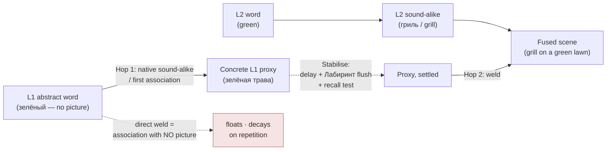
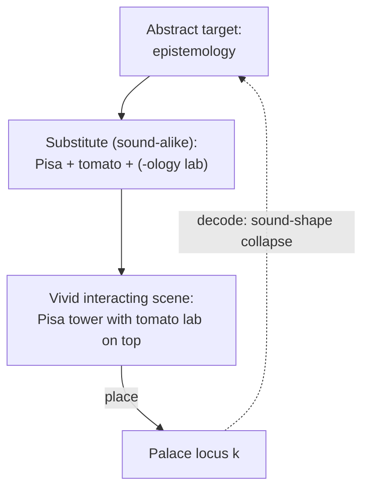

# Substitute Word System

**Summary**: The Substitute Word system (Harry Lorayne, 1957–1974) is the foundational mnemonic move that converts an **abstract, unfamiliar, or hard-to-visualize word** into a **concrete, easy-to-visualize substitute** that *sounds like* or *looks like* the original. The technique is the universal on-ramp into the [memory palace](./memory-palace.md), [PAO](./person-action-object-system.md), and most named-object encoders: you cannot place "epistemology" at a palace locus, but you can place "a Pisa tower made of melted ice cream on a mology" (`Pisa-temol-ogy`). Substitution turns the abstract into the picturable; the picturable then enters the rest of the encoder stack. The companion move is the **Phonetic Bridge** — extending the substitution to multi-syllable or foreign-language targets via sound-chain decomposition. Its hardest case — words that are abstract *in their referent* rather than merely unfamiliar in sound — is handled by the **two-hop L1-concretization bridge** documented below. SPM (Substitute-Picture-Memory) is the workflow term Lorayne uses for the whole protocol. This page is the canonical owner.

**Sources**:
- Lorayne, H. & Lucas, J. (1974). *The Memory Book*. Stein & Day. — Chapters on the Substitute Word, Phonetic Alphabet, and SPM workflow.
- Lorayne, H. (1957). *How to Develop a Super-Power Memory*. — original presentation.
- Buzan, T. (1986). *Use Your Perfect Memory*. — UK lineage of the same technique.
- Foer, J. (2011). *Moonwalking with Einstein* — pedagogical context; the "deer + Lyle Lovett" exposition.
- Ягодкин Н.А., Згода А.Н. (2023). *Учись учиться*. — Advance (Russian) lineage; phonetic coding rules, the two-hop bridge for abstract-referent words, the «Столбики» drill, and the speed floors / error markers.
- Internal: [memory-palace](./memory-palace.md), [person-action-object-system](./person-action-object-system.md), [major-system-for-mathematical-notation](./major-system-for-mathematical-notation.md).

**Last updated**: 2026-07-31 ([bedrock](./bedrock.md) cross-link — anchor-permanence selection criteria); 2026-07-16

---

## Core mechanism

Given an abstract or unpicturable target word `T`:

1. **Decompose** `T` into one or more *sound-alike* or *look-alike* substitutes — concrete nouns that share phonemes, syllables, or shape with `T`. (`epistemology → Pisa-temol-ogy`; `mitochondria → my-toe-condor-ia`; `prosopagnosia → pros-soap-ag-nose-ia`).
2. **Construct one vivid scene** from the substitute(s), interacting with each other or with the encoding host (a palace locus, a person, an object).
3. **Place the scene** at the encoding location.
4. **Decode** by re-reading the scene's substitutes back into the original word — the *sound shape* of the substitutes triggers retrieval of `T`.

The substitution does not need to be exact. It needs to be **close enough that the sound-shape collapses back** on recall. Lorayne's heuristic: *if you can hear the original word inside your substitute's pronunciation, the substitute will work.*

## Worked examples

| Target | Substitute(s) | Scene |
|---|---|---|
| Epistemology | Pisa + tomato + ology (lab) | Leaning tomato in a lab on top of the Tower of Pisa |
| Mitochondria | My toe + condor | A giant condor attacks my toe |
| Prosopagnosia | Pros + soap + nose | Pro tennis players wash a giant nose with soap |
| Tachycardia | Taco + heart | A spicy taco is jammed inside a beating heart |
| Tristan | Trees + tan | Trees getting a sunbathing tan |

The pattern: pick the **shortest substitute chain** that covers enough phonemes to be uniquely retrievable. Two-substitute chains are the sweet spot; three or more risk recall drift.

## Phonetic Bridge

The Phonetic Bridge is the extension move: when a target's sound-shape doesn't decompose cleanly into English nouns (a Hebrew word, a chemical name, a person's name in an unfamiliar language), bridge across:

1. **Source language → near-sound English substitute** (`shalom → shall-um → "shall-om" → 'show alarm'`)
2. **Substitute → vivid scene**
3. **Scene + meaning glue** (a marker that links the scene to its real meaning, e.g. a peace dove inside the scene for `shalom = peace`)

The bridge is one extra step; the cost is a vividness loss, the payoff is access to phonologies the encoder has no native handle on. Wyner's *Fluent Forever* ([fluent-forever-wyner](./fluent-forever-wyner.md)) builds an entire language-learning method on the Phonetic Bridge.

## Two-hop bridge — words abstract in their referent

The Phonetic Bridge above solves an **unfamiliar sound**. It does not solve an **unfamiliar referent**. Words like *заслуга* (merit), *полномочие* (authority), *наличие* (presence) are entirely ordinary in the encoder's *own* language and still have no picture — the substitution machinery above has nothing concrete to grab. This is the standing complaint against every image-based vocabulary system, and nothing above this line answers it.

The answer from Yagodkin's Advance school ([yagodkin-advance-mnemonics](./yagodkin-advance-mnemonics.md)) is to stop trying to weld the foreign sound onto the native meaning at all — there is no native picture to weld it *to* — and insert a hop. The source is blunt that if a word has no concrete image, the only place one can come from is the encoder's imagination (source: Ягодкин Н.А., Згода А.Н. - Учись учиться - 2023.pdf).

### Hop 1 — concretize the native word

Run the Substitute Word move *on the native language word*, in the native language, before any foreign word is in play. The output is a picture that stands in for the L1 meaning:

| Native abstract word | Native sound-alike proxy |
|---|---|
| заслуга (merit) | «за слугой» — *behind the servant* |
| изречение (saying) | «из речки» — *out of the creek* |
| полномочие (authority) | полнолуние (*full moon*) / полная мочка (*full earlobe*) |
| наличие (presence) | «на личинке» — *on the larva* |
| помощь (help) | помидор мощный — *a mighty tomato* |
| мечта (dream) | меч + мачта — *sword + mast* |
| уют (comfort) | утюг — *a clothes iron* |

(source: Ягодкин Н.А., Згода А.Н. - Учись учиться - 2023.pdf)

Note what these proxies are **not**: they are not translations, glosses, or semantic symbols. They are sound-alikes of the *native* word — the same phonetic move as everywhere else on this page, just aimed inward. After Hop 1 you hold a picture for the L1 meaning, and the abstract word has been converted into an ordinary concrete-noun problem.

### Stabilise — delay plus an interference flush

Hop 2 does not follow immediately. The source inserts a deliberate **two-to-three-minute pause with a filler task** — its «Лабиринт» maze exercise — to flush short-term memory, then returns and tests the L1 word→image link by covering each column in turn (source: Ягодкин Н.А., Згода А.Н. - Учись учиться - 2023.pdf). For abstract words it goes further and recommends separating the image-building stage *in time* from the vocabulary work entirely, with repetition cycles on the L1 word→image links alone — potentially starting **several days ahead** of touching the foreign words (source: Ягодкин Н.А., Згода А.Н. - Учись учиться - 2023.pdf). The delay is scheduling in the sense [spaced-repetition](./spaced-repetition.md) owns; the covered-column check is [active-recall](./active-recall.md) applied to the proxy rather than to the vocabulary.

The filler task is doing real work and is not decoration. Without an interference flush, the "successful" recall you observe is short-term echo, and you weld Hop 2 onto a link you have not actually verified.

### Hop 2 — weld the foreign sound onto the concrete proxy

Only now does the foreign word enter. Its sound-alike substitute is fused into a scene with the *proxy image* from Hop 1 — never with the abstract meaning. The source's adjective walk-through shows the full shape: *зелёный* (green) is abstract as a bare property, so it is first concretized to its own first association **зелёная трава** (green grass); the English `green` is then coded as **гриль** (a grill); the scene is a barbecue firing on a green lawn (source: Ягодкин Н.А., Згода А.Н. - Учись учиться - 2023.pdf).

### The failure mode this names

State it plainly, because it is the reason the delay is not optional: **welding the L2 sound directly onto an abstract L1 meaning — without concretizing the L1 side first and letting it settle — produces an association with no picture in it.** There is nothing for the scene to hang on, so the link floats and decays under repetition instead of consolidating. That is precisely the complaint mnemonic-vocabulary systems attract about abstract words, and it is a *procedural* fault, not a limit of the method.

Two secondary cautions from the source: the proxy image for an abstract word is far more **subjective** than for a concrete noun (two people picture "dog" alike, "merit" not at all), so borrowed proxies are markedly weaker than self-generated ones and should be treated as a fallback for when the skill or the time is missing; and the encoder should take the **first** association rather than shop for the best one, swapping only if it demonstrably fails on review (source: Ягодкин Н.А., Згода А.Н. - Учись учиться - 2023.pdf).

Which words actually need this route — rather than a plain one-hop substitution — is [vocabulary-word-type-routing](./vocabulary-word-type-routing.md)'s job. This page owns the mechanism; that page owns the dispatch. A related but distinct route, anchoring an abstract word to a fixed collocation or a cultural stereotype rather than to a sound-alike (the source codes English `simply` onto a SIM card inside the "one does not simply walk into Mordor" meme), is semantic rather than phonetic and belongs to [МНА](./method-of-guiding-associations.md)'s non-phonetic doors (source: Ягодкин Н.А., Згода А.Н. - Учись учиться - 2023.pdf).

## Onset priority and the «Столбики» drill

Advance's phonetic-coding rules add a placement constraint this page did not previously carry: **encode the beginning of the word**. The stated reason is that *«именно начало вспомнить сложнее всего»* — the start is the hardest part to recall, and the onset alone, sometimes a single sound, is often enough to unlock the whole word. The substitute should therefore be chosen for maximal similarity to the *onset*, and long words are covered by chaining several onset-anchored images (source: Ягодкин Н.А., Згода А.Н. - Учись учиться - 2023.pdf).

The worked chain: Kyrgyz **сорпо** ("soup") — a syllable sequence uncharacteristic for a Russian ear — becomes **СОРока** (magpie) + **ПОрог** (threshold): a magpie steps over a threshold, trips on it, and falls into a bowl of soup (source: Ягодкин Н.А., Згода А.Н. - Учись учиться - 2023.pdf). Each substitute is pinned to a syllable *onset*, in order, and the meaning-anchor (the soup) closes the scene.

This sharpens the existing "shortest substitute chain" heuristic above: the chain should be short **and** front-loaded. A substitute that matches a word's tail while missing its head buys little, because the tail is the part that would have been recallable anyway.

### «Столбики» — a trainable drill

The source treats phonetic coding as a **skill to be isolated and trained**, not a knack, and gives it a named exercise (source: Ягодкин Н.А., Згода А.Н. - Учись учиться - 2023.pdf):

- **Setup**: a grid of word-onsets — *Сан · Чер · Сло · Май · Фас · Дон…*
- **Task**: for each stub, produce a completion word — САН → САНКИ (sled), ЧЕР → ЧЕРЕНОК (cutting), СЛО → СЛОН (elephant), МАЙ → МАЙКА (T-shirt), ФАС → ФАСОЛЬ (beans).
- **Constraint**: work the columns *vertically*, under a stopwatch or racing another person, so time pressure drives production.
- **Skip rule**: a stub that will not resolve is marked and abandoned immediately — the source's *«антибаран»* ("anti-ram", i.e. don't butt heads with it) principle — rather than dwelt on.
- **Progression**: on the first pass any word counts; afterwards, restrict output to nouns, or to words that carry a concrete vivid image for you personally.

«Столбики» is the direct trainer for this page's core move: onset-stub → concrete completion, on the clock. It is the drill to reach for when the Failure modes table below diagnoses "substitute too distant" or "substitute too generic" repeatedly. It trains the production half of the skill in isolation, in the sense [automaticity-and-reflex-training](./automaticity-and-reflex-training.md) describes.

The onset rule can be pushed one step further: instead of re-deriving the onset image each time, **freeze one fixed image per recurring onset into a reusable table** and reuse it forever (`sw` → pig, `con` → horse). That caches this rule the way the [Major System](./mnemonic-methods-master.md) caches digits, and «Столбики» is exactly its trainer. That extension — with its load-bearing collision rule (the frozen onset is a *surname*; the rime carries identity) and a falsifiable promotion gate — is documented on [onset-peg-alphabet](./onset-peg-alphabet.md). It is a candidate, not a standing ruling.

## Pass-floors and error markers

Advance is unusual among mnemonic sources in publishing speed floors and a diagnostic table rather than only technique (source: Ягодкин Н.А., Згода А.Н. - Учись учиться - 2023.pdf):

| Measure | Floor / marker | Notes |
|---|---|---|
| Bare word → first image call-up | **≤1 s/word**, read under a metronome | Grab the *first* image that arrives; do not shop for the best one — the same image must resurface next time for the link to hold |
| Image recalls, but slowly | **>3 s = error marker** | Source's stated cause: poorly *connected* images (not a bad substitute) — remedy is to work the visualization of the *link*, not to re-pick the substitute |
| Image does not recall at all | error marker | Cause: badly chosen or badly connected images, or working with eyes closed |
| Images recall but the sound garbles (endings/parts lost) | error marker | Cause: bad phonetic coding — add extra images for the dropped prefixes and endings; also under-repetition after load |
| Stalling on a word that will not code | error marker | Do not sit on a word longer than **2–3 s** on a first pass; mark and move on («антибаран») |

These are speed floors on the way to fluency, not ladder rungs; where a drilled skill sits on the wiki's automaticity ladder is [skill-progression-stages](./skill-progression-stages.md)'s call, and this source does not map onto it.

**Abstract words are expected to be slower.** Recall of an abstract word's proxy after the interference flush is *recall*, not recognition, and the link is inherently weaker than for a concrete noun — the ≤1 s floor above is a concrete-noun floor and should not be enforced against the two-hop bridge. A figure of ~3–4 s for post-flush abstract-word recall circulates in Advance practice but is **(needs verification — Advance-internal)**; it is not stated in the 2023 text, which prescribes the delay and the repetition cycles without publishing a target time.

### Numeric tension — 1 s/word vs 6 s/element

Two paced-encoding numbers now sit in the wiki and look like they disagree. They do not:

- Advance sets a **1 s/word** floor for reading a word and having an image (source: Ягодкин Н.А., Згода А.Н. - Учись учиться - 2023.pdf).
- Kozarenko's metronome, documented on [kozarenko-mnemotechnics](./kozarenko-mnemotechnics.md), runs at **1 beat/second grouped in sixes, budgeting 6 seconds per element**.

Both schools run the same 1-beat-per-second metronome; they differ in the **unit of work per element**. Advance's 1 s buys a bare word→image call-up — the raw visualization reflex, drilled in isolation with nothing to place it on. Kozarenko's 6 s buys a *complete encode*: image call-up **plus** connection **plus** placement at a locus. These measure different granularities and are not competing claims about the same operation. Do not average them; a 1 s call-up is a component of, not a rival to, a 6 s locus-placement.

## SPM workflow (Substitute–Picture–Memory)

Lorayne's three-step encoding ritual:

1. **Substitute** — pick the substitute(s).
2. **Picture** — render the scene; make it interactive, exaggerated, sensory.
3. **Memorize** — place the scene at the encoding host and *test* by attempting a cold retrieval after 60 seconds.

The 60-second cold test catches substitution failures before they propagate. If the cold retrieval misses, the substitute is too weak — pick a stronger one before placing.

## Visual

## Relation to other encoders

| Encoder | Role of Substitute Word |
|---|---|
| [memory-palace](./memory-palace.md) | Substitute Word is the **on-ramp**; abstract content can't enter the palace without it |
| [person-action-object-system](./person-action-object-system.md) | PAO triples are typically *built* via Substitute Word + Major phonetic |
| [major-system-for-mathematical-notation](./major-system-for-mathematical-notation.md) | Major produces phoneme-string from digits; Substitute Word picks the noun that *holds* that phoneme-string |
| verse-memorization | Verse-number → Substitute Word noun; verse-content → keyword substitution |
| [bilateral-contrast-system](./bilateral-contrast-system.md), [hand-phonetic-system](./hand-phonetic-system.md) | Hand-channel encoders use Substitute Word for the verbal partner |

Without the Substitute Word as the lingua franca, the rest of the encoder stack is restricted to already-concrete content (only a small fraction of any real curriculum).

Kozarenko's Giordano-school taxonomy names this same move [МНА](./method-of-guiding-associations.md) (*Метод Наводящих Ассоциаций*) — a seven-technique inventory of the identical abstract→concrete conversion, not a rival system. Three of its seven doors ride the same sound-alike principle documented above (its syllable-build door is this page's Phonetic Bridge under another name); the other four run semantic routes — fixed collocation, symbolization, attaching to a known referent — that this page's phonetic framing does not otherwise cover.

**A third independent lineage.** The Advance school ([yagodkin-advance-mnemonics](./yagodkin-advance-mnemonics.md)) derives the identical move again — abstract-or-foreign word → concrete sound-alike substitute → vivid interacting scene — from a commercially independent Russian tradition that does not cite Lorayne and does not cite Kozarenko. Its universal encode algorithm runs: visualize the *meaning* (first image); visualize a sound-alike association for the *foreign word* (second image); fuse the two into a single picture where they are inseparable or interacting, imagining it vividly while saying the foreign word aloud **three times** (source: Ягодкин Н.А., Згода А.Н. - Учись учиться - 2023.pdf). That is this page's core mechanism with a spoken-rehearsal rider bolted on. The wiki's own logic on [kozarenko-mnemotechnics](./kozarenko-mnemotechnics.md) — "two lineages deriving the same move set is evidence the moves are real, not arbitrary" — reads stronger at three: Anglo-American stage magic (Lorayne), the Russian Giordano school (Kozarenko), and Russian commercial edtech (Advance) converge on the same substitution primitive from three unrelated starts.

## Failure modes

| Failure | Symptom | Mitigation |
|---|---|---|
| **Substitute too distant phonologically** | Recall produces wrong word | Test with 60-second cold retrieval; pick closer substitute |
| **Substitute too generic** | "Tree" or "house" used too often → palace collision | Pick distinctive variants ("a burning bonsai" not "tree") |
| **Substitute chain too long** | 4+ substitutes drift on recall | Cap at 2; break long targets into 2 separate placements |
| **No interaction in scene** | Substitutes stand side-by-side rather than fusing | Force a verb between them; static scenes recall worse than action scenes |
| **Sound-shape ambiguity** | "Pisa-tomato-ology" decodes as "pisamatology" or worse | Add a meaning-anchor (a philosopher figure inside the lab) to disambiguate |
| **Abstract referent welded directly** | Link has no picture in it; "recalls" at first, floats and decays under repetition | Two-hop bridge — concretize the L1 word first, flush, *then* weld |
| **Hop 2 welded too soon** | Passes the immediate check, fails days later | The check was short-term echo; insert the delay + filler task before testing |
| **Substitute matches the word's tail** | Onset is the part that stalls on recall | Re-pick for onset similarity; chain onset-anchored images («Столбики» to drill it) |

## Neural OS implementations

- [memory-palace](./memory-palace.md) — abstract content enters palace via Substitute Word
- [person-action-object-system](./person-action-object-system.md) — PAO triple build pipeline uses Substitute Word
- [major-system-for-mathematical-notation](./major-system-for-mathematical-notation.md) — phoneme→noun step is Substitute Word
- verse-memorization, [calendar-memory](./calendar-memory.md), [geography-mnemonic-route](./geography-mnemonic-route.md) — all consume Substitute Word
- [fluent-forever-wyner](./fluent-forever-wyner.md) — Phonetic Bridge as the language-learning operating layer

## Related pages

- [memory-palace](./memory-palace.md)
- [person-action-object-system](./person-action-object-system.md)
- [major-system-for-mathematical-notation](./major-system-for-mathematical-notation.md)
- [fluent-forever-wyner](./fluent-forever-wyner.md)
- verse-memorization
- [mnemonic-methods-master](./mnemonic-methods-master.md)
- [geography-mnemonic-route](./geography-mnemonic-route.md)
- [foer-moonwalking-with-einstein](./foer-moonwalking-with-einstein.md)
- [method-of-guiding-associations](./method-of-guiding-associations.md) — Kozarenko's seven-technique named instance of this same abstract→concrete move
- [kozarenko-mnemotechnics](./kozarenko-mnemotechnics.md) — second independent lineage; source of the 6 s/element metronome budget
- [yagodkin-advance-mnemonics](./yagodkin-advance-mnemonics.md) — third independent lineage; owner of the Advance school, its drills and its curriculum
- [vocabulary-word-type-routing](./vocabulary-word-type-routing.md) — dispatches word types to routes; routes abstract-referent words to the two-hop bridge here
- [onset-peg-alphabet](./onset-peg-alphabet.md) — the "cache the onset anchor" extension: freezes §Onset priority into a reusable lookup table (candidate)
- [bedrock](./bedrock.md) — supplies the *selection* criteria this page leaves open: which anchors are worth building onto (permanence over vividness) and how to tell a permanent bridge from an ordinary one
- [spaced-repetition](./spaced-repetition.md) — the delay and the L1 proxy repetition cycles the two-hop bridge depends on
- [active-recall](./active-recall.md) — the covered-column test that verifies a proxy before Hop 2
- [automaticity-and-reflex-training](./automaticity-and-reflex-training.md) — «Столбики» and the ≤1 s call-up as isolated reflex drills
- [skill-progression-stages](./skill-progression-stages.md) — owner of ladder positions; these pass-floors are speeds, not rungs
- [language-family-clustering](./language-family-clustering.md) — the other axis of vocabulary difficulty (cognates and false friends)

---

## U — See (CAST)
1. Abstract → concrete sound-alike → vivid scene
2. The scene's sound-shape collapses back to the target on recall
3. No picture on the L1 side → nothing to weld to → hop through a native proxy first

## D — Name (NEDF)
1. Substitute Word = concrete sound-alike replacement for abstract target
2. Distinguisher: phonetic similarity, not semantic similarity
3. Failure mode: substitute too distant to collapse back
4. Two-hop bridge = the abstract-*referent* case; the extra hop is L1→L1, not L1→L2

## F — Do (SPEAR)
1. Decompose target sound → pick substitute(s) → vivid scene → place → test
2. 60s cold retrieval before propagating
3. Onset first: anchor substitutes to the word's head, chain forward
4. Abstract target → Hop 1 (native proxy) → flush + delay → Hop 2 (weld L2 sound)

## B — Watch (HEART)
1. Substitute felt clever but recall failed → too distant
2. Same substitute reused across pages → collision risk
3. Image recalls but takes >3 s → the *link* is weak, not the substitute
4. Abstract word passed the check immediately → suspect short-term echo, not a link

## L — Predict (ORACLE)
1. Strong substitute + interactive scene → recall in days-to-weeks
2. Static side-by-side substitutes → recall fades fast
3. Direct weld onto an abstract meaning → holds today, gone after repetition

## R — Act (GRACE)
1. Abstract target → Substitute Word first, then encode
2. Foreign-language target → Phonetic Bridge variant
3. Abstract-referent target → two-hop bridge; build proxies days ahead of the vocabulary
4. Coding feels slow → drill «Столбики» on the clock, don't grind the live word list
