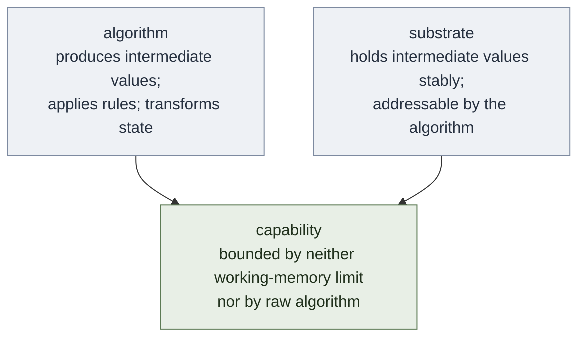

# Substrate-Algorithm Composition

**Summary**: An architectural primitive recurring across Neural OS — an *algorithm* (computation, encoding, or progression rule) combined with a *state substrate* (external scaffold that holds intermediate values stably) produces a capability that **neither component has alone**. The substrate breaks the working-memory bottleneck; the algorithm provides the operations. Recognising this pattern explicitly unlocks new compositions: every strong substrate is a candidate platform for new algorithms, and every algorithm too big for working memory is a candidate for a new substrate.

**Sources**:
- Conversation synthesis with the user (2026-05-11) during Vedic-math skill-ceiling analysis
- Composes downstream of Soroban Learning Method, [vedic-speed-math](./vedic-speed-math.md), [nedf-overview](./nedf-overview.md), code-memorization, [automaticity-and-reflex-training](./automaticity-and-reflex-training.md)

**Last updated**: 2026-05-11

---

## The pattern

**The unlock**: working memory holds ~4–7 items briefly. Any procedure with more than 4–7 intermediate values overruns it and silently fails. A state substrate moves those values into a more durable representation (spatial position, visual scene, peg-encoded image, bead on a rod, locus in a palace), addressable by the algorithm. Result: the *effective* working-memory limit becomes whatever the substrate can hold — for a memory palace that's hundreds, for soroban that's full place-value precision, for a peg matrix that's 100 stable scenes.

This is why hand-calculation seems impossible to untrained adults but trivial to soroban masters: same algorithm, different substrate. And it's why "knowing the technique" is never sufficient on its own — without a substrate, the technique exceeds working memory after three or four digits.

---

## Why it works (the three substrate properties)

A substrate produces the unlock only when it satisfies all three:

1. **Resolution** — high enough to encode every distinct intermediate value uniquely. Two different values must never collide to the same substrate position. (Vedic-math fails on the substrate side if two digit-pegs share the same image.)
2. **Stability** — values stay put for the full duration of the calculation, without being overwritten by phonological-loop chatter or interruptions. Bead positions on a soroban have this property automatically; mental scenes have it only after drilling.
3. **Addressability** — the algorithm knows where to write and where to read. Memory palaces work because loci have a fixed walking order; peg systems work because numbers map to pegs by a deterministic rule.

If any of these three fails, the composition collapses back to working-memory-bound performance.

---

## Confirmed instances in the wiki

| Algorithm | Substrate | Capability unlocked | Owner page |
|---|---|---|---|
| Place-value arithmetic (add, sub, mul, div) with friend-of-5/10 complements | Soroban beads — real or imagined-on-rods | Streaming mental arithmetic on long columns; full-precision place-value | Soroban Learning Method |
| Algebraic-identity arithmetic (Base Method, Criss-Cross, Flag) | Number-shape / number-rhyme / Major-system peg images | Multi-digit mental multiplication and division without losing intermediate digits | [vedic-speed-math](./vedic-speed-math.md), [vedic-speed-math-skill-ceiling](./vedic-speed-math-skill-ceiling.md) |
| Visual grammar (room=function, door=call, fork=if, loop=circle, palette of 29 sensations) | Memory palace of program-shaped rooms and props | Code recall by structure rather than syntax; cross-language stability | code-memorization |
| NEDF encoding rule (Name-hook · Essence · Distinguisher · Failure) | 4-slot scene template per concept | Retrievable cards from any of 4 angles | [nedf-overview](./nedf-overview.md) |
| REMAPS transformation moves (Rotate · Exaggerate · Modify · Associate · Palace · Sensations) | Any weak image needing reinforcement | Abstract / weak / ordinary / static material becomes retrievable | [remaps](./remaps.md) |
| Drill progression (Lamp → Scale → Sword) | Skill-gym measurement environment | Automaticity advancement that is measurable not just claimed | [automaticity-and-reflex-training](./automaticity-and-reflex-training.md), [red-queen-skill-gym](./red-queen-skill-gym.md) |
| Spaced retrieval scheduling | Anki / SR-card deck collection | Durable long-term recall without proportional study-time growth | [spaced-repetition](./spaced-repetition.md) |
| Construct-classification rule (12-construct taxonomy, 6-second timer) | Snippet-stream gym with telemetry | Reflexive pattern recognition with per-construct floor measurement | construct-recognition-gym |
| Pre-encoded REMAPS scenes (100 impossible objects with motion + sensation) | 10×10 peg-audio-visual matrix | Drop-in encoding substrate for any 100-item domain (vocabulary, opcodes, periodic table) | [peg-matrix-remaps-scenes](./peg-matrix-remaps-scenes.md) |
| Trachtenberg digit-walking algorithm (per-multiplier rules + general two-finger method) | Working memory itself — one running digit + one carry + one neighbor lookup | Pen-and-paper-free multiplication and division of arbitrary-shape numbers at uniform speed; no algebraic prior or visual substrate required (the historical design specification, since Trachtenberg developed this in Nazi concentration camps without writing materials) | [trachtenberg-system](./trachtenberg-system.md) |
| Language-profile-recall algorithm (walk N orthogonal concept-spaces, read cell-pick at each) | 12 mini-palaces, one per concept-axis (type system, memory model, scope, evaluation, concurrency, error handling, module system, effect system, paradigm composition, execution model, syntax family, metaprogramming) — each holding 2–10 cells as loci | **Programming-language knowledge that compresses across N languages**: N languages cost ~N + 12 + Σ deltas instead of 12N. The 3rd language onward compresses heavily because most cells reuse the existing infrastructure. NEDF Distinguisher slots sharpen because the contrast surface is fixed at 12 named axes | programming-language-concept-spaces |

Each row is an instance of the same compositional shape. Every one of them is a capability that the algorithm alone cannot produce and the substrate alone cannot animate.

**Trachtenberg is the minimal-substrate extreme.** Soroban assumes a bead substrate, Vedic assumes a peg-image substrate, but Trachtenberg's design specification was *no substrate beyond working memory itself*. The algorithm is therefore shaped to fit a minimal substrate (the rules never require holding more than one digit + one carry + one neighbor at a time) rather than the substrate being chosen to fit the algorithm. This inverts the usual design move and is worth keeping visible: when the user is operating under a hard substrate constraint (no paper, aphantasia per [memory-palace-for-aphantasia](./memory-palace-for-aphantasia.md), pre-algebra learners, distraction-prone settings), the right move is *algorithm-shaped-to-substrate*, not the other way around.

### Notation as a sub-substrate (Kaktovik observation)

Beneath the algorithm/substrate split there is a third axis worth naming: the *notation* used to represent intermediate values. Two algorithms with the same substrate can have different working-memory costs purely because of how the values are displayed/written. Kaktovik Iñupiaq numerals (base-20, with digit-forms that visually expose sub-fives and sub-twenties) are the canonical example — practitioners report less carry-heavy addition and division than base-10 because the numeric form itself surfaces the partial-counts that base-10 forces into mental arithmetic. (source: Clippings/Is Anyone Using Kaktovik Iñupiaq Numerals to Speed up Their Math.md, captured in [vedic-speed-math-skill-ceiling](./vedic-speed-math-skill-ceiling.md) §"Adjacent: notation as a substrate variable")

The Neural OS-relevant claim is *not* that Kaktovik is better than base-10 — the forum source is enthusiastic but inconclusive. The claim is that **notation is a substrate variable**, finer-grained than the algorithm/substrate split. The same algorithm, in different notation, has different working-memory cost. Treat notation as a third axis to inspect when a composition's performance is underwhelming.

### N-substrate composition (programming-language concept-spaces)

A different generalization, applied at the knowledge-architecture level. Instead of one substrate per algorithm, **N substrates** are composed via the Composite pattern, with the algorithm walking each substrate in sequence and reading a value from each. programming-language-concept-spaces decomposes programming-language knowledge into 12 orthogonal concept-axes (type system, memory model, scope, evaluation strategy, concurrency, error handling, module system, effect system, paradigm composition, execution model, syntax family, metaprogramming); each axis gets its own mini-palace; a specific language is encoded as a 12-cell route picking one cell per axis. This is the same primitive applied 12 times with the cell-picks composed.

The general claim: when a domain has N orthogonal axes of variation with finite cell-sets per axis, encoding instances as cell-tuples rather than flat fact-lists produces compression that compounds with the number of instances encoded. Candidate domains for the same move (per [composability-index](./composability-index.md)): human languages (phonology / morphology / syntax / pragmatics), operating systems, CPU architectures.

---

## Anti-patterns (when the composition fails)

1. **Substrate too coarse** — can't distinguish intermediate values. Symptom: confusion between "what was the third digit" type errors. Fix: upgrade substrate resolution (number-shape → Major system; "object on shelf" → typed prop with sensation).
2. **Substrate drift** — same meaning encoded inconsistently across runs or cards. Symptom: recall works on day 1, decays disproportionately by week 2. Fix: freeze the palette (code-memorization shows this discipline explicitly).
3. **Algorithm assumes more substrate than exists** — e.g., a 5-digit Vedic operation needing 7 peg-slots when only 5 are stable. Symptom: technique works on toy examples, fails on real ones. Fix: extend substrate before extending algorithm.
4. **Substrate addressability gap** — algorithm produces a value but doesn't know where to put it. Symptom: works on rehearsed examples, fails on novel ones. Fix: make the addressing rule explicit and drill it.
5. **Substrate-algorithm coupling too tight** — substrate works only for one algorithm, can't be reused. Symptom: building separate substrates for adjacent skills. Fix: invest in a shared substrate (peg system used for arithmetic *and* dates *and* vocabulary).

---

## Design heuristics

- **Build the substrate before the algorithm.** Soroban works because rod-and-bead positions were stabilised before any operation was learned. Vedic works because pegs were stabilised before any cross-multiplication.
- **Test substrate resolution with a collision check.** Pick any two intermediate values the algorithm could produce. If they would map to the same substrate position, the substrate is too coarse.
- **Make the substrate reusable across algorithms.** A peg system that serves Vedic arithmetic *and* date arithmetic *and* vocabulary is worth more than three single-purpose substrates. This is why the [peg-matrix-remaps-scenes](./peg-matrix-remaps-scenes.md) artifact has such high leverage — one substrate, many algorithms.
- **When a technique stalls below its predicted speed/capacity, ask which side is failing.** If errors are "I knew what to do but lost the digits," the substrate is failing. If errors are "I had the digits but didn't know what to do with them," the algorithm is failing.

---

## How to spot a new unlock

Scan the wiki with two questions:

1. **"Is there an algorithm in this domain that exceeds working memory?"** If yes, the missing piece is a substrate. Candidate: any technique that "works on small examples but breaks on real ones."
2. **"Is there a substrate I have that no algorithm currently uses?"** If yes, the missing piece is an algorithm. Candidate: any memory palace, peg matrix, or visual grammar that's already fluent for one task — it can probably host adjacent tasks for free.

Both questions surface candidate unlocks. Log them in [composability-index](./composability-index.md) as candidates, then promote to confirmed once tested.

---

## Why this matters for Neural OS as a framework

The encoder spine (NEDF, CAST, SPEAR, HEART) and the performance layer (drill ladders + skill gyms) are *all* substrate-algorithm compositions:

- [NEDF](./nedf-overview.md) — encoding-rule algorithm × 4-slot scene substrate
- [CAST](./cast-overview.md) — graph-walking algorithm × node-and-edge substrate
- [SPEAR](./spear-overview.md) — story-spine algorithm × narrative scene substrate
- HEART — interrogation-rule algorithm × question-and-answer substrate
- Drill ladders — progression algorithm × skill-gym substrate

Recognizing the pattern explicitly tells you that **adding a new encoder is always either (a) adding a new substrate that existing algorithms can run on, or (b) adding a new algorithm that runs on an existing substrate.** Trying to add both at once is what produces the "framework drift" anti-pattern in [framework-comparison-matrix](./framework-comparison-matrix.md) — too many moving parts, no shared substrate, no compositional leverage.

The Neural OS architectural rule that falls out: **prefer composition over invention**. New capabilities should be unlocks (existing-algorithm × existing-substrate or new-algorithm × existing-substrate) rather than new-everything builds.

---

## Related pages

- [composability-index](./composability-index.md) — registry of every known and candidate substrate-algorithm composition in the wiki; scannable for "what can I unlock by combining X with Y?"
- Soroban Learning Method — primary instance: bead substrate × place-value algorithm
- [vedic-speed-math](./vedic-speed-math.md) — instance: peg substrate × algebraic-identity algorithm
- [vedic-speed-math-skill-ceiling](./vedic-speed-math-skill-ceiling.md) — quantifies the unlock magnitude (working-memory duration roughly 2× longer, multi-digit calculations sustainable)
- code-memorization — instance: palace substrate × visual-grammar algorithm
- [nedf-overview](./nedf-overview.md) / [remaps](./remaps.md) — encoder-spine instances
- [automaticity-and-reflex-training](./automaticity-and-reflex-training.md) — the engine that drills any substrate-algorithm composition to reflex
- [framework-comparison-matrix](./framework-comparison-matrix.md) — registers the framework drift this pattern resists
- [software-design-principles-for-neural-os](./software-design-principles-for-neural-os.md) — the SOLID/pattern lens; this primitive composes cleanly with Strategy + Composite + Adapter

---

## U — See (CAST)
1. Pattern: substrate × algorithm composition produces unlock
2. Reusable composition recipe

## D — Name (NEDF)
1. Substrate-algorithm composition = unlock-generating pattern
2. Distinguisher: explicit composition pattern, not single example
3. Failure mode: looking for unlocks without checking substrate

## F — Do (SPEAR)
1. New algorithm → check available substrates
2. Composition → produces unlock

## B — Watch (HEART)
1. Missing substrate check
2. Algorithm-only thinking

## L — Predict (ORACLE)
1. Substrate × algorithm → predict unlock class
2. Substrate missing → predict no-unlock

## R — Act (GRACE)
1. New algorithm → check substrate fit
2. Stuck → look for substrate