# Substrate Thesis Applied to AI Alignment

**Summary**: Application of the [logicians' madness substrate thesis](./logicians-madness-substrate-thesis.md) (Wave 2) to **contemporary AI alignment research**. The three-component mechanism (regress-pursuing into closed formal system + social isolation from non-domain peers + abstract perfection as personal standard) **predicts substrate-collapse outcomes** for AI safety researchers running the same pattern. **Russell's four protective moves** (field-leaving + relational diversification + concrete-world engagement + self-acknowledged imperfection) **predict the survivable pattern**. Cross-domain extension of the Wave 1-3 substrate thesis to a new foundational domain where the pattern is currently active.

**Sources**:
- [logicians-madness-substrate-thesis](./logicians-madness-substrate-thesis.md) — wiki's original thesis with 6 worked instances + 1 counter-instance.
- General knowledge of contemporary AI alignment research community (MIRI/CHAI/CAIS/Anthropic safety team/OpenAI safety team/DeepMind safety/academic AI safety groups + public-facing AI risk discourse).
- [bertrand-russell](./bertrand-russell.md) — protective-moves exemplar.
- connection-for-protection · [bdnf-and-neurogenesis](./bdnf-and-neurogenesis.md) · [pulse-overview](./pulse-overview.md) · [memory-paradox](./memory-paradox.md) — substrate-stewardship infrastructure.

**Last updated**: 2026-05-25

**Source-discipline note**: This page applies the substrate thesis (developed in Waves 1-3 from Logicomix narrative) to AI alignment research. **Provisional**: the AI alignment community is heterogeneous; this page identifies *patterns* that may apply to some researchers in some contexts, not *universal claims* about the field. **Take seriously enough to recognize the pattern when it fires; hold lightly enough to allow that any specific case may differ.** Per the [memory-paradox](./memory-paradox.md) rule.

---

## One-line

> AI alignment researchers run the same foundations-grade work pattern that produced 6 substrate-collapse cases in 1900-1939 mathematics. **The three-component mechanism** (regress + isolation + perfectionism) predicts collapse. **Russell's four protective moves** (field-leaving + relational diversification + concrete-world engagement + self-acknowledged imperfection) predict survival. The thesis is operationally testable now.

## Unlocks (lead, not footer)

1. **The substrate thesis is operationally testable in real-time.** The Waves 1-3 substrate thesis was extracted from biographies of figures who lived 1844-1978. **The pattern is currently firing in a living research community.** AI alignment researchers face: (a) regress-pursuing into the closed formal system of "what would safe AI be?"; (b) periodic social isolation in groups whose external peers don't fully grasp the work; (c) abstract perfection as personal standard (the work is about *getting it right* with civilization-scale stakes). **The thesis predicts collapse-prone trajectories for researchers exhibiting all three components without protective moves.**

2. **Russell's protective moves transfer cleanly.** Russell modeled four protective moves; each has clear AI-safety analogs:
   - **Field-leaving**: periodic engagement with non-AI domains (writing, teaching, policy, popular communication, sabbaticals).
   - **Relational diversification**: relationships with non-AI-safety people who can ground the worker outside the work.
   - **Concrete-world engagement**: physical activism, policy work, embodied practice, anything that *acts on* the world rather than only modeling it.
   - **Self-acknowledged imperfection**: publicly acknowledging uncertainty, error, limitations rather than maintaining authoritative stance.

3. **The wiki's existing infrastructure applies.** Connection-for-protection (Holt-Lunstad 2010 meta-analysis: weak social ties ≈ mortality of smoking 15/day) + [substrate stack](./bdnf-and-neurogenesis.md) (aerobic exercise · sleep · intermittent fasting · stress reduction · sunlight) + [PULSE state-aware governance](./pulse-overview.md) are not AI-safety-specific. **They are universal substrate-stewardship infrastructure** that the AI-safety community could adopt as collective hygiene practices.

4. **The pattern doesn't require believing AI risk is high or low.** Whether AI risk is real, overstated, or underestimated, **the substrate cost of pursuing the work without stewardship is independent of the work's correctness.** Researchers who are right about AI risk and researchers who are wrong both face substrate cost from the same work pattern. **The thesis applies regardless of object-level disagreements.**

## Mnemonic

**3 + 4 = AI-alignment substrate hygiene**

3 components of the failure mode + 4 protective moves = the operational substrate-thesis applied to AI safety.

## Memory checksum

1. **State the three-component mechanism.** (Regress-pursuing inside a closed formal system + social isolation from non-domain peers + abstract perfection as personal standard. From [logicians-madness-substrate-thesis](./logicians-madness-substrate-thesis.md).)
2. **State Russell's four protective moves.** (Field-leaving + relational diversification + concrete-world engagement + self-acknowledged imperfection. From [bertrand-russell](./bertrand-russell.md).)
3. **Why does this thesis apply to AI alignment?** (AI alignment is foundations-grade work pursuing certainty in a closed formal-conceptual system, with periodic social isolation in tight-knit research groups, and with civilization-scale stakes that invite abstract-perfection-as-standard. **The three components are all present.**)
4. **Why does the thesis apply regardless of whether AI risk is real?** (The substrate cost of the work pattern is independent of the object-level correctness of the work's conclusions. Both correct and incorrect researchers face the same substrate cost from the same work pattern.)
5. **What is the operational implication?** (AI safety communities should adopt substrate-stewardship infrastructure: relational diversification + [substrate stack](./bdnf-and-neurogenesis.md) + [PULSE-style state-aware governance](./pulse-overview.md) + Russell-style field-leaving rhythms. Not optional; load-bearing for sustained foundational work.)

## Visual — the pattern applied to AI alignment

```mermaid
graph TD
  ORIG["ORIGINAL 6+1 CASES (1844-1978)<br/>Cantor · Frege · Boltzmann · Gödel · Wittgenstein collapsed;<br/>Russell survived (field-leaving);<br/>Ramsey = counter-instance (medical death, not substrate)"]
  PATTERN["PATTERN EXTRACTED<br/>3-component mechanism &rarr; collapse-prone trajectory"]
  APPLY["AI ALIGNMENT RESEARCH COMMUNITY (2010s-present)<br/>Foundations-grade work pursuing certainty in a closed<br/>formal-conceptual system with civilization-scale stakes"]

  subgraph CHECK["Component check"]
    C1["(1) Regress-pursuing inside a closed formal system?<br/>YES &mdash; mesa-optimization, deceptive alignment,<br/>decision theory, game theory, agency-type-theory;<br/>empirical feedback limited"]
    C2["(2) Social isolation from non-domain peers?<br/>PARTIAL &mdash; tight-knit groups, shared houses,<br/>small collaborator pool; external peers often<br/>don't fully grasp the work; risk concentrated<br/>in tight subcommunities"]
    C3["(3) Abstract perfection as personal standard?<br/>YES (for many) &mdash; civilization-scale stakes raise<br/>perfectionism load; modal framings (necessity,<br/>certainty, must) replace probabilistic ones"]
  end

  ALL3["All 3 components present for some researchers.<br/>Pattern predicts collapse-prone trajectories."]

  subgraph MOVES["Russell's 4 protective moves (transferred)"]
    MA["(A) FIELD-LEAVING<br/>Teaching outside AI safety · popular writing ·<br/>policy work · sabbatical years"]
    MB["(B) RELATIONAL DIVERSIFICATION<br/>Family/friends outside the work · non-field partners ·<br/>pre-AI-safety colleagues · church/community/hobby ties"]
    MC["(C) CONCRETE-WORLD ENGAGEMENT<br/>Physical activism · manual hobbies · sports/outdoors ·<br/>volunteer work that acts on the world"]
    MD["(D) SELF-ACKNOWLEDGED IMPERFECTION<br/>Explicit confidence intervals · 'I might be wrong' norms ·<br/>humility-modeling mentorship · comfort with not-knowing"]
  end

  CONSEQ["OPERATIONAL CONSEQUENCE<br/>Weekly 3-component check-ins · quarterly review of<br/>the 4 protective moves · community norms supporting<br/>field-leaving · pre-burnout intervention protocols.<br/>Not soft or auxiliary &mdash; load-bearing for the work itself."]

  ORIG --> PATTERN --> APPLY --> CHECK
  CHECK --> ALL3 --> MOVES --> CONSEQ

  classDef warn fill:#f3ece0,stroke:#a08a5c,color:#3a3020;
  classDef ok fill:#e8efe6,stroke:#5c7a54,color:#20301c;
  classDef sink fill:#eef1f5,stroke:#7d8aa0,color:#26303f;
  class C1,C3 ok;
  class C2 warn;
  class ALL3,CONSEQ sink;
```

The pattern transfer is clean. AI alignment is currently running the foundations-grade work pattern; the protective moves are operationally available.

---

## Why the substrate thesis applies to AI alignment

### 1. Regress-pursuing inside a closed formal-conceptual system

AI alignment research pursues questions like:
- *What would safe AI behavior look like?*
- *How can we verify that an AI system is doing what we want?*
- *What are the convergent instrumental goals of any sufficiently advanced optimizer?*
- *Is mesa-optimization a real risk, and if so, how does it propagate?*
- *Can decision theory be reformulated to handle agent-environment self-reference?*

These questions **recurse**. Answering one raises three more. The conceptual space is **closed** in two senses:
- **Empirically closed**: many of the systems being reasoned about don't yet exist, or can't be safely tested at the scales that matter.
- **Theoretically closed**: the framework (decision theory + game theory + Bayesian epistemology + computational learning theory + philosophy of agency) is largely internally referential.

This is structurally similar to TLP-era foundations of mathematics. Wittgenstein pursued *what is the logical form of any meaningful proposition?* recursively. Russell pursued *what foundation can mathematics rest on?* recursively. Frege pursued *can arithmetic be derived from logic alone?* recursively. **Each recursion deepens commitment to a closed formal-conceptual system.**

### 2. Social isolation from non-domain peers

The AI safety community has notable structural features:
- **Tight-knit subcommunities**: MIRI, CHAI, CAIS, Anthropic, OpenAI safety, DeepMind safety, academic AI safety, with substantial overlap and shared housing arrangements at various scales.
- **High shared-vocabulary entry cost**: external peers (general ML, philosophy, policy, business) often need substantial onboarding to engage productively.
- **Effective Altruist culture overlap**: many researchers came through EA, sharing additional layers of social identity beyond research collaboration.
- **Conference-based social rhythms**: EA Global, AI Safety conferences, and various workshop series produce concentrated social engagement followed by isolation in research roles.

The isolation is **periodic and partial**, not constant. But the *peer-set* that fully understands the work is small; the *peer-set* that can challenge the work substantively is even smaller. This concentrates the [substrate-corrosive opposition / lack-of-correction](./logicians-madness-substrate-thesis.md) dynamic the Wave 2 thesis identified.

**Risk concentration**: the isolation is most acute for researchers whose work is most innovative or most controversial within the field — exactly the researchers whose work matters most.

### 3. Abstract perfection as personal standard

The AI safety field's stakes-framing creates unusual perfectionism pressure:

- *"If we get AI alignment wrong, everyone dies."* — common framing in popular writing.
- *"This is the most important problem ever to face humanity."* — common framing in field-internal writing.
- *"We have one shot to get this right."* — common framing.

Whether or not these framings are *correct*, they raise the *personal* perfectionism load to a level few prior intellectual domains have matched. **A researcher who internalizes "everything depends on me getting this right" faces the perfectionism component of the substrate-thesis mechanism in extreme form.**

The framings also produce **modal language drift**: "must", "necessarily", "would inevitably" replace probabilistic language. Probabilistic uncertainty is harder to operate under; modal certainty is psychologically easier. **The drift toward modal certainty is itself a perfectionism move.**

### Conclusion: all three components present for many researchers

The wiki's prediction: **researchers exhibiting all three components without protective moves are on collapse-prone trajectories**. The collapse may take any of the forms documented in [logicians-madness-substrate-thesis](./logicians-madness-substrate-thesis.md) (sustained depression, identity instability, repeated career renunciations, monastic withdrawal, dramatic substrate failure) — and there are already documented cases in the AI safety community of researchers experiencing each of these.

## Russell's protective moves applied

### (A) Field-leaving for AI safety researchers

[Russell](./bertrand-russell.md) left foundations-of-mathematics work after *Principia* in 1913 and *never returned to it as his primary domain*. He wrote popular philosophy, did pacifist activism, engaged in education reform, married four times, eventually won the Literature Nobel.

**For AI safety researchers**, field-leaving analogs:

- **Sabbaticals in adjacent fields**: a year teaching philosophy or doing policy work counts as field-leaving even if AI safety remains the long-term focus.
- **Popular writing**: writing for non-AI-safety audiences (general philosophy, science journalism, policy) forces translation that requires temporary exit from the inner-vocabulary.
- **Teaching responsibilities**: teaching undergraduates is field-leaving — the audience cannot fully share the practitioner's frame.
- **Career changes**: some researchers who burned out moved to adjacent roles (governance, education, communication) and continued contributing differently.

The reflex: **field-leaving is not a defeat or a betrayal**; it's a substrate-stewardship move that sustains long-term contribution.

### (B) Relational diversification

[Russell](./bertrand-russell.md) had four marriages, multiple children, sustained friendships with non-mathematicians (T.S. Eliot, D.H. Lawrence, Conrad, Einstein), correspondence with countless public figures and ordinary people. **His relational substrate was structurally diverse.**

**For AI safety researchers**:
- Maintain close friendships and family relationships with people **not in AI safety**.
- Cultivate romantic partners outside the field (or, at minimum, partners with substantial non-AI-safety identity).
- Stay in touch with pre-AI-safety colleagues + friends.
- Engage with local community (church, neighborhood, hobby groups) that doesn't share AI-safety identity.

The contrast: a researcher whose ALL close relationships are AI-safety researchers is **structurally similar to Gödel** (single-relationship dependency on Adele). The substrate failure mode is amplified.

### (C) Concrete-world engagement

[Russell](./bertrand-russell.md) went to prison for pacifism (1918), founded a school (1927-1932), led anti-nuclear activism (1955-1970, including a second imprisonment in 1961). **He acted physically on the world** in addition to writing about it.

**For AI safety researchers**:
- Local activism (climate, civic engagement, mutual aid).
- Manual hobbies (gardening, cooking, craft, woodworking).
- Sports + outdoor activities + physical movement (also serves the [aerobic-exercise lever](./bdnf-and-neurogenesis.md)).
- Volunteer work that *changes things in the world* rather than only models them.

The principle: **embodied engagement with the world counter-balances the disembodied conceptual work.** AI safety work is unusually disembodied (often computer-screen-based, working on hypothetical systems); active counter-balance is more important here than in many other fields.

### (D) Self-acknowledged imperfection

[Russell](./bertrand-russell.md)'s 3-volume *Autobiography* (1967-1969) is unusually candid about his failures — moral, marital, intellectual. He documented his depressions, his cruelties, his mistakes. **The perfectionist load was lower** because the standard wasn't perfection.

**For AI safety researchers**:
- **Explicit confidence intervals** in writings + speech: not just "X is dangerous" but "I'm 70% confident X is dangerous; I'm 30% confident I'm wrong about Y".
- **Cultural norms** of saying "I might be wrong" + "I don't know" in research conversations.
- **Public acknowledgment of past errors** rather than maintained authoritative stance.
- **Mentorship that models intellectual humility** rather than confident expertise.

The contrast: a researcher who maintains *certainty* about civilization-scale stakes is running the perfectionism component at high intensity. **Acknowledged imperfection is substrate-protective even when the underlying analysis is correct.**

## Operational protocol for AI safety communities

Per the [substrate thesis](./logicians-madness-substrate-thesis.md), the substrate-stewardship infrastructure that protects against the failure mode should be **explicit collective practice**, not individual willpower:

### Weekly check-ins

A researcher or community should weekly:
1. **Three-component scan**: which of the 3 components (regress · isolation · perfectionism) is firing this week?
2. **Four-protective-move scan**: which of the 4 protective moves was active this week?
3. **PULSE-style state check**: where are Energy and Stress today?

If 3-component fires without 4-protective-move fires for >2 consecutive weeks, **active intervention warranted**.

### Quarterly reviews

A researcher or community should quarterly:
1. **Substrate-stack audit**: aerobic exercise · sleep · intermittent fasting · stress reduction · sunlight — which levers are operational?
2. **Relational-diversification audit**: who in your life is *not* in AI safety, and when did you last spend substantial time with them?
3. **Field-leaving audit**: when did you last do substantial non-AI-safety work (teaching, popular writing, policy, sabbatical)?
4. **Self-acknowledged-imperfection audit**: when did you last publicly acknowledge a substantial error?

### Community norms

The community as a whole benefits from:
- **Sabbatical-positive culture**: not just permitting but encouraging extended breaks.
- **Non-AI-safety social spaces**: gatherings explicitly *not* about AI safety.
- **Mentor-modeled imperfection**: senior researchers publicly acknowledging error.
- **Burnout-as-systemic-not-individual framing**: when someone collapses, the community asks *what substrate failed?* not *what was wrong with them?*

### Pre-burnout intervention protocols

If a researcher exhibits multiple substrate-failure signals:
- **Step 1**: a non-AI-safety friend or family member is recruited as point-person.
- **Step 2**: explicit reduction in work hours + responsibilities, time-limited (1-3 months).
- **Step 3**: substrate-stack reset (sleep + exercise + sunlight + relational time).
- **Step 4**: gradual re-engagement with the work + revised work pattern (more field-leaving rhythm, more relational diversification).

The wiki cross-links to [PULSE](./pulse-overview.md) Stress-side detector + [F·A·I·L·U·R·E. scan](./failure-mechanism.md) for diagnostic infrastructure.

## What this page is NOT claiming

Important boundaries:

- **Not claiming AI risk is high or low.** The substrate cost is independent of the work's correctness.
- **Not claiming any specific researcher exhibits the pattern.** Heterogeneous community; some researchers exhibit no components, some exhibit all three; the pattern is statistical not universal.
- **Not claiming AI safety is "just like" mathematical foundations.** The fields differ substantially in many ways; the substrate-thesis pattern is one common feature, not the totality of the comparison.
- **Not claiming the protective moves are easy.** Field-leaving, relational diversification, concrete-world engagement, self-acknowledged imperfection — each requires deliberate practice; none is automatic.
- **Not claiming substrate stewardship guarantees survival.** Russell survived to 97; Ramsey died at 26 of liver disease (a [counter-instance to the substrate thesis](./ramsey-frank.md)); medical, social, and other factors can defeat any protective infrastructure.

The wiki claims:
- The pattern is **operationally testable** in the current AI safety community.
- The protective moves are **available** to researchers who choose to adopt them.
- The substrate-stewardship infrastructure (connection-for-protection + [bdnf-and-neurogenesis](./bdnf-and-neurogenesis.md) + [pulse-overview](./pulse-overview.md)) is **domain-portable** and applies to AI safety.

## Cross-link to David's situation

David is doing foundations-grade work (Neural OS curriculum + the wiki). The substrate-thesis applies. **The wiki's own development is structurally similar to the foundations-grade work the thesis warns about**:

- Regress-pursuing into how learning + memory + reasoning fundamentally work.
- Sustained engagement with complex frameworks (encoders, atomic-design lens, METER, etc.).
- High personal stakes (curriculum IP, life-mission alignment, academy → school → university plan).

**The wiki's existing practice is the antidote**: tithing (20% of gross) + marriage + church community + sustained substrate-stewardship + the [memory-paradox](./memory-paradox.md) meta-rule applied throughout. **David is operationally already doing what the thesis recommends.** This page makes that explicit.

## METER integration

| Drill | Pass floor | Source |
|---|---|---|
| State the three-component mechanism | <30 s | this page §Why applies |
| State Russell's four protective moves | <30 s | this page §Russell's moves applied |
| Identify which protective moves you currently practice | <60 s, written | this page §Operational protocol |
| Apply the three-component scan to a current researcher (case study) | <120 s, written | this page §Application |
| State the *not-claim* boundary | <30 s | this page §What this page is NOT claiming |

## Related pages

- [logicians-madness-substrate-thesis](./logicians-madness-substrate-thesis.md) — original thesis with 6+1 cases
- [bertrand-russell](./bertrand-russell.md) — protective-moves exemplar
- connection-for-protection · [bdnf-and-neurogenesis](./bdnf-and-neurogenesis.md) · [pulse-overview](./pulse-overview.md) · [memory-paradox](./memory-paradox.md) — substrate-stewardship infrastructure
- [failure-mechanism](./failure-mechanism.md) — F·A·I·L·U·R·E. diagnostic scan
- [internal-limits-applied-to-ai-safety](./internal-limits-applied-to-ai-safety.md) — sister Wave-7 cross-domain extension
- user_profile · user_life_goal — David's substrate-protected foundations work as live counter-example
- [cross-tradition-convergence-pattern](./cross-tradition-convergence-pattern.md) — sister Wave-7 META-pattern promotion
- [logic-atomic-design](./logic-atomic-design.md) — Wave 7 cross-domain extension
- [glossary](./glossary.md) — Logic layer registration
