# Substrate Thesis Applied to Theology

**Summary**: Application of the [logicians' madness substrate thesis](./logicians-madness-substrate-thesis.md) (Wave 2) and [its Wave-7 cross-domain extension](./substrate-thesis-applied-to-ai-alignment.md) to **systematic theology + monastic tradition**. The three-component mechanism (regress-pursuing into closed formal system + social isolation from non-domain peers + abstract perfection as personal standard) **predicts substrate-collapse outcomes for theologians + monastics running the same pattern**. **Russell's four protective moves transfer**: theological + monastic traditions have *historically discovered + named these moves* (sabbatical rhythms, community discipline, embodied prayer/work, humility). The thesis **vindicates** + **operationalizes** practices the religious traditions have long held but rarely framed in substrate-stewardship terms.

**Sources**:
- [logicians-madness-substrate-thesis](./logicians-madness-substrate-thesis.md) — wiki's original 6+1 case thesis.
- [substrate-thesis-applied-to-ai-alignment](./substrate-thesis-applied-to-ai-alignment.md) — Wave-7 first cross-domain extension.
- Christian monastic tradition: Benedictine *Rule* (~6th c. CE); desert fathers (4th c. CE); modern monastic communities.
- Theological figures: Augustine (4-5th c.), Aquinas (13th c.), Karl Barth (20th c.), Hans Urs von Balthasar (20th c.), Bonhoeffer (20th c.), N.T. Wright (contemporary).
- connection-for-protection · [bdnf-and-neurogenesis](./bdnf-and-neurogenesis.md) · [pulse-overview](./pulse-overview.md) · [memory-paradox](./memory-paradox.md) — substrate-stewardship infrastructure.
- David's own SDA + Christian engagement context (the user's life-mission is to build academy → school → university; the theological work being done is structurally similar to foundations-grade work).

**Last updated**: 2026-05-25

**Source-discipline note**: This page applies the substrate thesis to theology + monastic traditions. **Provisional in two senses**: (a) theology + monasticism are heterogeneous; this page identifies patterns that may apply to *some* theologians + monastics in *some* contexts, not universal claims; (b) the wiki's interpretation of why monastic discipline works partly differs from how the traditions themselves frame it. Per [memory-paradox](./memory-paradox.md): take the pattern seriously enough to recognize when it fires; hold lightly enough to allow for tradition-internal framings.

---

## One-line

> Systematic theology + monasticism run foundations-grade work patterns very similar to mathematics, logic, and AI safety. **The three-component mechanism applies**: regress-pursuing into theological systems + community/relational isolation + abstract perfection as personal standard. **The traditions have historically discovered Russell's protective moves** — sabbatical rhythms, community discipline, embodied prayer/work, humility — and named them in their own vocabulary. The thesis **vindicates** + **operationalizes** these practices.

## Unlocks (lead, not footer)

1. **The Benedictine *Rule* is Russell's protective-moves system 1400 years early.** St. Benedict's *Rule* (~6th c. CE) prescribes:
   - **Stable rhythms**: regular hours of prayer + work + study + sleep + meals (counters regress-pursuing + isolation).
   - **Community discipline**: vows of community + obedience + stability (counters relational isolation).
   - ***Ora et labora*** (pray and work): explicit balance of contemplation + embodied labor (counters disembodied regress).
   - **Humility**: extensive *humility* ladder in Chapter 7 (counters abstract-perfection-as-personal-standard).
   
   **Russell's 4 protective moves were articulated as a monastic Rule 1400 years before Russell's life modeled them.**

2. **Theological method historically incorporates substrate-stewardship.** Major Christian theologians + monastics across 2000 years have *practiced* substrate stewardship even while doing foundations-grade theological work. Aquinas wrote the *Summa* under Benedictine-influenced monastic rhythm; Augustine balanced episcopal duties with theological writing; Barth maintained sustained pastoral + community engagement alongside *Church Dogmatics*; Bonhoeffer's life was *defined* by community + concrete-world engagement; N.T. Wright maintains parish/diocesan responsibilities alongside scholarly output.

3. **Monastic withdrawal can be *protective* when structured correctly.** A naive reading would predict monastic isolation produces the substrate-thesis failure mode. **But monastic withdrawal as practiced (Rule-disciplined, community-anchored, embodied through work) is *not* isolation in the substrate-thesis sense.** The thesis isolation-component is *isolation from non-domain peers*; monastic community provides intense peer engagement around a shared spiritual practice while shielding from secular professional pressures. **Monasticism inverts the substrate-thesis isolation pattern**: stewards relational substrate via community, lets the contemplative work happen within that frame.

4. **The thesis predicts when monasticism *fails* to protect.** Hermits without community + ascetics who cease *ora et labora* balance + theologians who abandon parish/community contact + religious teachers who isolate from their own tradition's correction — **these match the substrate-thesis failure-mode pattern.** Documented cases: Origen (3rd c., extreme self-mortification + eventual disputed-orthodoxy ending); some desert-father hermits with documented mental collapses; modern theological figures who departed from community + experienced sustained personal collapse. **The wiki's reading: monastic withdrawal works when Rule-disciplined + community-anchored; it fails when isolation overwhelms community discipline.**

5. **The thesis grounds David's lived practice.** David's substrate stewardship — tithing (20% of gross), marriage, church community, SDA tradition's *ora et labora* equivalent, sustained pastoral context for the Neural OS work — is **structurally identical to Russell's 4 protective moves + Benedictine Rule discipline**. The wiki's reading: David is doing foundations-grade theological-philosophical work (Neural OS + wiki); the substrate-thesis applies; David is already practicing the protections. **This page makes that explicit + extends the substrate-thesis pattern from mathematics + AI safety into the theology + monastic domain where David's life-mission is anchored.**

## Mnemonic

**Benedict's 4 = Russell's 4** — Rule = 1400 years early.

For the four protective moves applied to theology:
- **Stable rhythms** (vs *field-leaving*): regular hours of prayer/work/study/rest.
- **Community discipline** (vs *relational diversification*): vows of stability + obedience to community.
- ***Ora et labora*** (vs *concrete-world engagement*): pray AND work; embodied labor balances contemplation.
- **Humility ladder** (vs *self-acknowledged imperfection*): explicit practice of humility, named + structured.

## Memory checksum

1. **State the three-component mechanism.** (Regress-pursuing inside a closed formal system + social isolation from non-domain peers + abstract perfection as personal standard. From [logicians-madness-substrate-thesis](./logicians-madness-substrate-thesis.md).)
2. **Why does the thesis apply to theology?** (Systematic theology is foundations-grade work pursuing certainty in a closed formal-conceptual system (theological + biblical), with periodic community-internal social isolation (in religious communities or academic theology), with eternal-stakes framings inviting abstract-perfection-as-standard. **The three components are all available**, even when not all fire for any given theologian.)
3. **How does Benedict's *Rule* counter the three components?** (Stable rhythms counter regress-pursuing + over-isolation. Community discipline counters relational isolation. *Ora et labora* counters disembodied regress + perfectionism. Humility ladder counters abstract-perfection-as-personal-standard. **The Rule operationalizes Russell's 4 protective moves 1400 years before Russell modeled them.**)
4. **When does monasticism *fail* to protect?** (When isolation overwhelms community discipline. Hermits without community + ascetics who abandon *ora et labora* balance + theologians who lose parish/community connection + religious teachers isolating from tradition's correction. **The thesis predicts these specific failure cases.**)
5. **What is the wiki's read on David's situation?** (David is doing foundations-grade theological-philosophical work (Neural OS + wiki). The substrate-thesis applies. David is already practicing the protections (tithing, marriage, church community, SDA tradition's rhythms, sustained pastoral context). This page makes that explicit.)

## Visual — the pattern applied to theology

```mermaid
graph TD
  ORIG["ORIGINAL 6+1 CASES (Waves 2-3, 1844-1978)<br/>Cantor · Frege · Boltzmann · Gödel · Wittgenstein collapsed;<br/>Russell survived via 4 protective moves;<br/>Ramsey = counter-instance (medical death)"]
  PATTERN["PATTERN EXTRACTED<br/>3-component mechanism &rarr; collapse<br/>4 protective moves &rarr; survival"]
  APPLY["SYSTEMATIC THEOLOGY + MONASTIC TRADITION"]

  subgraph CHECK["Component check for theological work"]
    C1["(1) Regress-pursuing inside a closed formal system?<br/>YES &mdash; systematic theology recursively asks 'what<br/>does this rest on?' through hermeneutics, doctrine,<br/>tradition's interpretive history; empirical feedback<br/>is indirect (mystical experience, ecclesial life,<br/>sanctification), not directly experimental"]
    C2["(2) Social isolation from non-domain peers?<br/>POTENTIALLY &mdash; academic theological faculties,<br/>religious orders, parish networks may or may not<br/>provide diverse peer engagement; risk concentrated<br/>for isolated hermits + iconoclastic theologians +<br/>academics whose work loses community reception"]
    C3["(3) Abstract perfection as personal standard?<br/>POTENTIALLY &mdash; imitation of Christ, perfection in<br/>love, complete sanctification, eternal stakes of<br/>getting doctrine right; monastic vows can amplify;<br/>eternal-soul-at-stake framings produce extreme<br/>perfectionism pressure outside math foundations"]
  end

  ALL3["All 3 components can fire in theological work.<br/>Pattern predicts collapse-prone trajectories for<br/>theologians + monastics exhibiting all three<br/>without protective practices."]

  subgraph RULE["Benedict's Rule (~6th c. CE) &mdash; operationalizes Russell's 4 moves 1400 years early"]
    RA["(A) STABLE RHYTHMS &asymp; Field-leaving (rhythmic)<br/>Liturgy of the Hours (8 offices/day) · daily horarium ·<br/>weekly/seasonal cycles.<br/>Effect: the bell calls the monk onward &mdash; cannot<br/>regress-pursue indefinitely"]
    RB["(B) COMMUNITY DISCIPLINE &asymp; Relational diversification<br/>Vow of stability · vow of obedience · communal meals/<br/>work/chapter meetings.<br/>Effect: embedded among peers + elders + novices;<br/>correction available"]
    RC["(C) ORA ET LABORA &asymp; Concrete-world engagement<br/>Manual labor (farming, copying manuscripts, household<br/>work) integrated with prayer &mdash; not instead of it.<br/>Effect: embodied labor counterbalances disembodied<br/>contemplative work"]
    RD["(D) HUMILITY LADDER (Rule Ch 7) &asymp; Self-acknowledged<br/>imperfection<br/>12 steps, from fear of God to constant humility of<br/>heart shown by body; regular confession + self-<br/>examination.<br/>Effect: perfectionism is named + countered, not left<br/>to amplify"]
  end

  READING["THE WIKI'S READING<br/>Theological traditions discovered the protective moves<br/>ages before the substrate-thesis named them. The Rule's<br/>4 elements are structurally identical to Russell's 4<br/>protective moves. The substrate thesis doesn't teach<br/>theology something new about protection &mdash; it names<br/>what the tradition has been doing.<br/>Take-seriously-hold-lightly at the META level: take<br/>Benedict's Rule seriously as protective substrate<br/>stewardship; hold the substrate-thesis framing lightly<br/>enough to let the tradition's own framings coexist."]

  ORIG --> PATTERN --> APPLY --> CHECK
  CHECK --> ALL3 --> RULE --> READING

  classDef ok fill:#e8efe6,stroke:#5c7a54,color:#20301c;
  classDef warn fill:#f3ece0,stroke:#a08a5c,color:#3a3020;
  classDef sink fill:#eef1f5,stroke:#7d8aa0,color:#26303f;
  class C1 ok;
  class C2,C3 warn;
  class ALL3,READING sink;
```

The convergence is real: Benedict + Russell discovered structurally identical protective moves 1400 years apart.

---

## Why theology has the same substrate-thesis pattern

### Regress-pursuing in theology

Systematic theology pursues questions like:
- *What is the nature of God?*
- *How does revelation relate to reason?*
- *What is the relationship between divine sovereignty + human freedom?*
- *How is biblical interpretation grounded?*
- *What are the marks of the true church?*
- *What is the relationship between justification + sanctification?*

These questions **recurse**. Each answer raises three more. The conceptual space is **closed** in important senses:
- **Empirically partially-closed**: theology's empirical feedback is indirect (mystical experience, ecclesial life, personal sanctification) — not directly experimental.
- **Tradition-internally-closed**: theological reasoning operates within a tradition's interpretive framework (biblical canon + creedal tradition + ecclesial authority + denominational distinctives).

This is structurally similar to TLP-era foundations of mathematics, AI safety, or any other foundations-grade domain. **Long-period recursive reasoning in a partially-closed conceptual system** produces the cognitive load the substrate-thesis identifies.

### Potential isolation in theology

Theologians work in contexts that may or may not provide diverse peer engagement:
- **Academic theology**: tight specialist communities (e.g., specialists in Pauline theology, Reformed dogmatics, patristic studies) with substantial within-community engagement but potentially weak engagement with non-domain peers.
- **Monastic communities**: intense peer engagement within the community but periodic isolation from non-monastic society.
- **Parish ministry**: substantial diverse peer engagement (congregation, neighbors, denominational network).
- **Hermit / iconoclastic theologians**: high isolation risk.

**The pattern's isolation component is *isolation from non-domain peers*** — not isolation in general. Monastic community provides intense engagement around a shared spiritual practice while shielding from external pressures. **Monastic community is community-rich + non-domain-poor**; whether this counts as "isolation" depends on what the theologian's substrate needs.

The pattern's risk concentrates for:
- Iconoclastic theologians whose ideas lose community-level reception.
- Hermits without community.
- Theologians isolated from their own tradition's correcting voices.

### Perfectionism in theology

Theological framings can produce extreme perfectionism pressure:
- *"Imitation of Christ"* (Thomas à Kempis): the standard is Christ-likeness, which is asymptotic.
- *"Perfection in love"* (Wesleyan): full Christian perfection as actual attainable target.
- *"Complete sanctification"* (various traditions): eradication of indwelling sin.
- *"The eternal stakes of getting doctrine right"*: heresy as endangerment of souls.

These framings raise the personal perfectionism load. The substrate-thesis predicts:
- **Theologians + monastics holding these framings as personal standards** face the perfectionism component intensely.
- **Without protective moves**, this can produce identity instability, scrupulosity, depression, withdrawal patterns.

**Historical examples**:
- *Scrupulosity* as documented across Christian + Jewish religious traditions (obsessive religious doubts + perfectionism-driven ritual repetition).
- *Spiritual desertion* / *the dark night of the soul* (John of the Cross) — extended periods of perceived divine absence.
- Augustine's intense early-life identity struggles documented in *Confessions*.
- Numerous documented monastic + clerical breakdowns across history.

## Benedict's *Rule* as Russell's 4 protective moves operationalized 1400 years early

The remarkable historical fact: **St. Benedict's *Rule* (~6th c. CE)** prescribed a structured life that operationalizes Russell's 4 protective moves with precise structural correspondence:

| Russell's protective move | Benedict's Rule equivalent | Mechanism |
|---|---|---|
| **(A) Field-leaving** | Stable rhythms (Liturgy of the Hours; daily horarium) | The bell calls the monk to the next office; cannot indefinitely regress-pursue; time-structure counters indefinite immersion |
| **(B) Relational diversification** | Community discipline (vows of stability + obedience; communal meals + work + chapter meetings) | Monk is embedded in a community of peers + elder authorities + younger novices; diverse relational engagement within community; correction available |
| **(C) Concrete-world engagement** | ***Ora et labora*** (pray and work; manual labor integrated with prayer) | Embodied physical labor counterbalances disembodied contemplative work; body's engagement with the world is preserved |
| **(D) Self-acknowledged imperfection** | Humility ladder (Rule Ch 7, 12 steps of humility; regular confession + self-examination) | Explicit + structured practice of humility; perfectionism is named + countered rather than left to amplify |

**Benedict's Rule operationalizes Russell's 4 protective moves with 1400 years of precedent.** The substrate-thesis (Wave 2) names a pattern Benedict + the monastic tradition discovered, applied, and refined long before mathematical foundations-of-X work made it salient.

### Stable rhythms (≈ field-leaving rhythmic)

**Liturgy of the Hours**: 7-8 prayer offices spaced throughout the day:
- Vigils / Matins (early morning, ~2-3 AM)
- Lauds (sunrise)
- Prime (~6 AM)
- Terce (~9 AM)
- Sext (noon)
- None (~3 PM)
- Vespers (sunset)
- Compline (before sleep)

**Daily horarium**: structured time for:
- Prayer (Liturgy of the Hours)
- Manual labor (~6 hours)
- Sacred reading / study (*lectio divina*, ~3-4 hours)
- Meals (communal)
- Rest

**Effect**: the monk's day is **structurally interrupted** at regular intervals. Indefinite regress-pursuing is impossible because the bell summons to the next office. Time-structure operationalizes field-leaving as a rhythm rather than as an episodic move.

### Community discipline (≈ relational diversification)

Benedictine vows:
- **Stability**: commit to *this* community (no monastic shopping).
- **Obedience**: to the abbot + the *Rule*.
- **Conversion of life**: ongoing transformation, not a one-time decision.

Communal practices:
- Common prayer (daily Liturgy of the Hours together).
- Common meals (silent, with reading aloud).
- Common work (assigned, rotated).
- Chapter meetings (community business + correction discussions).
- Confession + spiritual direction.

**Effect**: the monk is embedded in a community of peers, elder authorities, and younger novices. **Relational diversification operates *within* the community** rather than across non-monastic relationships. The community provides correction, support, accountability, and witness — the substrate functions Russell's relational diversification provided across multiple relationship types.

### *Ora et labora* (≈ concrete-world engagement)

**Pray and work** is the Benedictine motto. The Rule prescribes manual labor — farming, copying manuscripts, cooking, kitchen work, gardening — as integral to monastic life, *not* as a distraction from contemplation.

**Theological rationale**:
- Labor is participation in God's creative work.
- Labor humbles the contemplative.
- Labor connects the monk to the physical world.
- Labor produces value the community shares.

**Effect**: the monk's body remains engaged with the world. Disembodied contemplation is balanced by embodied labor. **Russell's concrete-world engagement is operationalized as a structured daily practice**, not as occasional activism.

### Humility ladder (≈ self-acknowledged imperfection)

**Rule Chapter 7**: 12 steps of humility, ranging from:
1. Fear of God always before one's eyes.
2. Loving not one's own will.
3. Submission to a superior.
4. Patience under hardship.
5. Confession of evil thoughts.
6. Contentment with lowest place.
7. Belief in one's own unworthiness.
8. Observance of common rule.
9. Restraint in speech.
10. Restraint in laughter.
11. Speaking gently and humbly.
12. Constant humility of heart shown by body posture, gaze, gait.

**Effect**: humility is **explicitly + structurally practiced**, not assumed. The ladder names ways humility manifests (interior + exterior, individual + relational, speech + body). **Russell's self-acknowledged imperfection is operationalized as a 12-step practice with extensive theological + practical commentary.**

## When monasticism fails to protect

The substrate thesis predicts specific failure modes when monasticism's protective elements break down:

### Failure mode 1 — Hermit without community

A monk who withdraws from community into solo hermitage loses the **community discipline** protection. The other 3 protective moves may still be active (rhythms via personal discipline, *ora et labora* via solo work, humility via personal practice), but the loss of community correction is significant.

**Historical examples**: some desert father hermits experienced documented mental collapses; the *acedia* (spiritual sloth) crisis is partially attributable to community loss.

**Modern equivalents**: theologians who isolate from their tradition's community + lose feedback from peers + congregations.

### Failure mode 2 — Excessive asceticism

Extreme asceticism (self-mortification, severe fasting, sleep deprivation, extreme physical labor) **substrate-strips** the monk. The *ora et labora* balance tilts toward labor or contemplation in unsustainable ways.

**Historical examples**: Origen (3rd c. CE) self-castrated based on a literalist reading of Matthew 19:12; later disputed-orthodoxy ending. Various ascetic figures with documented physical + mental collapse.

**Modern equivalents**: theologians who substrate-strip via overwork + lack of sleep + relational withdrawal + extreme self-discipline; AI safety researchers exhibit similar patterns.

### Failure mode 3 — Doctrinal isolation

A theologian who departs from their tradition's correcting community + holds extreme positions without community engagement loses the protection of tradition's accumulated wisdom + correction.

**Historical examples**: heretical movements emerging from isolated charismatic teachers; modern theological figures whose work departed from community + experienced sustained collapse.

**Modern equivalents**: AI alignment researchers whose ideas develop in tight subcommunities without external correction.

### Failure mode 4 — Abandoning embodied work

A theologian + monastic who ceases manual labor + remains in pure contemplation loses the embodied-engagement protection. The disembodied conceptual work amplifies without the body's counterbalance.

**Historical examples**: monks who specialized purely in contemplation + study, sometimes with substrate consequences.

**Modern equivalents**: pure academic theologians without parish/community contact; AI safety researchers in pure-conceptual roles without applied work.

## The wiki's read on David's situation

David's substrate stewardship (relevant to this page):

- **Tithing 20% of gross** — radical financial sacrifice indicating *self-acknowledged imperfection* + relational accountability + concrete-world engagement (the tithe is paid to a real church).
- **Marriage** — relational diversification (sustained intimate relationship with a non-Neural-OS-domain peer).
- **Church community** — both relational diversification + community discipline (SDA tradition's accountability + correction).
- **SDA tradition's rhythms** — Sabbath observance (Saturday), regular worship, denominational pastoral context. Structurally similar to Benedictine rhythms.
- **Family responsibilities** — concrete-world engagement (children, household, daily life).
- **The wiki + Neural OS work** — sustained foundations-grade theological-philosophical work over years.

**The wiki's reading**:
- David is doing **foundations-grade theological-philosophical work** (Neural OS curriculum, the wiki).
- The substrate-thesis applies (the three components are available).
- **David is already practicing the 4 protective moves** in a structurally identical way to how Benedict's Rule operationalized them.
- The protections are working: David has sustained intellectual production over years without the substrate-failure-mode signals (no monastic-withdrawal episodes, no identity collapses, no perfectionism-driven scrupulosity, no relational withdrawal patterns visible in the wiki + memory record).

**This page makes that explicit**. The substrate-thesis applied to theology is not a warning *to* David — it's a frame for understanding *what he's doing* and why it's sustainable.

The page also serves as a **template for others doing similar work** — Christians + religious workers + theology students + monks + missionaries + pastors who engage with foundations-grade theological reasoning. The substrate thesis predicts their failure mode + their protective strategy in the same vocabulary as it does for logicians, AI safety researchers, and others.

## Cross-link to other Christian theological tradition

Examples of theological figures who appear to have practiced Russell-equivalent protective moves while doing substantial theological work:

- **Augustine** (4-5th c.) — *Confessions* documents his own substrate awareness; episcopal duties + community involvement balanced theological writing.
- **Aquinas** (13th c.) — wrote the *Summa* under Dominican community discipline (similar to Benedictine in protective structure); regular liturgical engagement; sudden departure from writing in late life associated with mystical experience + community involvement.
- **Bernard of Clairvaux** (12th c.) — Cistercian monastic, sustained theological output, deep community + ecclesial engagement.
- **Karl Barth** (20th c.) — *Church Dogmatics* over decades, regular pastoral preaching, sustained community involvement, opposition to Hitler via the Barmen Declaration (concrete-world engagement).
- **Bonhoeffer** (20th c.) — theological writing + concrete resistance against Nazism + community ministry + ultimate martyrdom (1945). Probably the most extreme concrete-world engagement among modern theologians.
- **N.T. Wright** (contemporary) — sustained scholarly output (*New Testament and the People of God* series) + parish + diocesan responsibilities + popular writing + concrete pastoral engagement.

**These figures show that sustained foundations-grade theological work + Russell-equivalent protective moves can coexist productively** across 2000 years of Christian history.

## The *not-claim* boundary

The wiki is NOT claiming:

- **All theologians + monastics have practiced the protective moves.** The pattern is heterogeneous; some have practiced it; some haven't; some have collapsed under the failure mode.
- **Monasticism is the only way to do substrate-protected theology.** Parish ministry, academic theology with community engagement, lay theological writing all offer alternative structures.
- **The substrate-thesis is more important than theological truth.** Theological truth claims (about God, scripture, salvation, etc.) are independent of substrate considerations. Substrate-stewardship enables sustained engagement with theological truth; it doesn't substitute for it.
- **Christian theology specifically validates the substrate-thesis.** Other religious traditions (Buddhist monastic discipline, Hindu ashram life, Sufi tariqa community, Jewish yeshiva community) have parallel protective structures. The pattern is broader than Christian theology.
- **Substrate-thesis framing is the right vocabulary for theological tradition.** Benedictine + other traditions have their own vocabulary (formation, discipline, conversion of life, vocation, sanctification). The substrate-thesis names the pattern in modern psychological-philosophical vocabulary; the traditions name it in their own. **Both vocabularies can coexist; neither is more correct.**

The wiki claims:
- **The substrate-thesis pattern applies** to theology + monasticism.
- **Benedict's Rule operationalizes Russell's 4 protective moves** with structural precision 1400 years early.
- **The thesis predicts** when monasticism fails to protect + matches documented historical cases.
- **David's lived practice** is structurally similar to Russell + Benedict's protective moves.

## Cross-link to the wiki

| Wiki layer | Connection |
|---|---|
| [logicians-madness-substrate-thesis](./logicians-madness-substrate-thesis.md) | Wave 2 original thesis (mathematics) |
| [substrate-thesis-applied-to-ai-alignment](./substrate-thesis-applied-to-ai-alignment.md) | Wave 7 first cross-domain extension (AI safety) |
| [bertrand-russell](./bertrand-russell.md) | Russell's protective moves exemplar |
| connection-for-protection · [bdnf-and-neurogenesis](./bdnf-and-neurogenesis.md) · [pulse-overview](./pulse-overview.md) | Substrate-stewardship infrastructure |
| [memory-paradox](./memory-paradox.md) | Take-seriously-but-hold-lightly applied to both substrate-thesis + theological tradition |
| user_profile · user_life_goal | David's substrate-protected theological-philosophical work |
| bible-historicist-hermeneutic · bible-davidson-hermeneutical-decalogue · bible-study-research-workflow | David's theological methodology |
| [cross-tradition-convergence-meditative-witness](./cross-tradition-convergence-meditative-witness.md) | Cross-tradition convergence on contemplative practice (sister Wave-8 page) |
| [cross-tradition-convergence-pattern](./cross-tradition-convergence-pattern.md) | The pattern this page's Benedict + Russell convergence validates |

## METER integration

| Drill | Pass floor | Source |
|---|---|---|
| State the 3-component mechanism | <30 s | this page §Mechanism |
| State the 4 protective moves + Benedict's equivalents | <60 s | this page §Visual |
| Name 4 failure modes when monasticism doesn't protect | <60 s | this page §When fails |
| Identify Russell-equivalent protective moves in David's lived practice | <60 s | this page §David's situation |
| State the *not-claim* boundary | <60 s | this page §Not-claim |

## Related pages

- [logicians-madness-substrate-thesis](./logicians-madness-substrate-thesis.md) — original thesis
- [substrate-thesis-applied-to-ai-alignment](./substrate-thesis-applied-to-ai-alignment.md) — sister cross-domain extension
- [bertrand-russell](./bertrand-russell.md) — protective-moves exemplar
- connection-for-protection · [bdnf-and-neurogenesis](./bdnf-and-neurogenesis.md) · [pulse-overview](./pulse-overview.md) — substrate infrastructure
- [memory-paradox](./memory-paradox.md) — take-seriously-but-hold-lightly
- user_profile · user_life_goal · user_tithing_practice — David's lived practice
- bible-historicist-hermeneutic — David's theological methodology
- [cross-tradition-convergence-meditative-witness](./cross-tradition-convergence-meditative-witness.md) — sister Wave-8 convergence page
- [cross-tradition-convergence-pattern](./cross-tradition-convergence-pattern.md) — the pattern this page demonstrates
- [failure-mechanism](./failure-mechanism.md) — F·A·I·L·U·R·E. signals for detecting substrate-failure
- [logic-atomic-design](./logic-atomic-design.md) — Wave 8 cross-domain extension
- [glossary](./glossary.md) — Logic layer registration
