# Substrate Thesis Applied to Theoretical Physics

**Summary**: Application of the [logicians' madness substrate thesis](./logicians-madness-substrate-thesis.md) (Wave 2) to **theoretical physics**. **4th cross-domain application** after [AI alignment](./substrate-thesis-applied-to-ai-alignment.md) (Wave 7) and [theology](./substrate-thesis-applied-to-theology.md) (Wave 8). The 20th-century theoretical-physics community provides **multiple worked instances** of the three-component substrate-failure mechanism + the four protective moves: Boltzmann (suicide 1906; already case-3 of substrate-thesis), Ehrenfest (suicide 1933), Wolfgang Pauli (sustained psychological turbulence, Jungian collaboration), Heisenberg (political collapse via Nazi association), Schwinger (sustained academic isolation), Feynman (sustained Russell-style field-leaving protection), Einstein (sustained relational + concrete-world engagement). **The thesis transfers cleanly**: foundations-grade physics work has the same three-component failure mechanism + the same four protective moves available.

**Sources**:
- [logicians-madness-substrate-thesis](./logicians-madness-substrate-thesis.md) — Wave 2 original 6+1 case thesis.
- [substrate-thesis-applied-to-ai-alignment](./substrate-thesis-applied-to-ai-alignment.md) — Wave-7 first cross-domain extension.
- [substrate-thesis-applied-to-theology](./substrate-thesis-applied-to-theology.md) — Wave-8 second cross-domain extension.
- Standard biographical sources: Walter Moore *Schrödinger* (1989); Heisenberg's *Physics and Beyond* (1971 autobiography); Pauli's correspondence with Jung; Pais *Subtle is the Lord* on Einstein (1982); Mehra-Rechenberg *Historical Development of Quantum Theory* (1982-2001); various biographies of the Bohr circle.
- connection-for-protection · [bdnf-and-neurogenesis](./bdnf-and-neurogenesis.md) · [pulse-overview](./pulse-overview.md) · [memory-paradox](./memory-paradox.md) — substrate-stewardship infrastructure.

**Source-discipline note**: This page applies the substrate thesis to theoretical physics. **Provisional**: the physics community is heterogeneous; this page identifies patterns that may apply to *some* physicists in *some* contexts, not universal claims. **Take seriously enough to recognize the pattern when it fires; hold lightly enough to allow tradition-internal nuance.** Per [memory-paradox](./memory-paradox.md).

**Last updated**: 2026-05-25

---

## One-line

> Theoretical physics is foundations-grade work running the same three-component mechanism as mathematics + AI safety + theology. **20th-century physics provides multiple worked instances** of both the failure mode (Boltzmann, Ehrenfest, Heisenberg-via-politics, others) and the protective moves (Einstein's relational + political engagement; Feynman's field-leaving; the Copenhagen circle's community discipline). **4th cross-domain application** of the substrate thesis, completing the foundations-domain quartet (math · AI safety · theology · physics).

## Unlocks (lead, not footer)

1. **4th cross-domain application + the foundations-domain quartet complete.** Mathematics (Wave 2) + AI alignment (Wave 7) + theology (Wave 8) + theoretical physics (Wave 9). **The 4 domains share the foundations-grade work pattern**: regress-pursuing into closed formal-conceptual systems with civilization-scale or universe-scale stakes. **The substrate thesis applies uniformly**; the failure modes + protective moves transfer across domains.

2. **Boltzmann (already case 3 in Wave 2) gets a fuller treatment.** The Wave 2 thesis listed Boltzmann briefly as a parallel-domain example. **Wave 9 treats Boltzmann as a load-bearing case** — his statistical-mechanics work was structurally identical to mathematical foundations (reductionist program pursued against community opposition); his community opposition (Mach + Ostwald's energeticism) was the substrate-failure isolation component; his suicide 1906 was the predicted failure-mode outcome. **The thesis's predictive power is vindicated** by Boltzmann's specific biographical trajectory.

3. **Ehrenfest as case-9 (extending the substrate-thesis case list).** Paul Ehrenfest (Austrian physicist, close to Einstein + Bohr) committed suicide in 1933. **The three-component mechanism applies cleanly**: he was running foundations-grade work in mathematical physics; he experienced increasing isolation as physics moved past his expertise; he held abstract-perfection as personal standard (correspondence shows extensive self-criticism). **Ehrenfest is a worked instance from a generation later than Boltzmann**, confirming the pattern's robustness across generations.

4. **The four protective moves are visible in physics community structure.** Einstein modeled relational + political engagement (substrate protection). The Copenhagen circle (Bohr's institute) provided Göttingen-style community discipline (parallel to Hilbert's Göttingen mathematical school). Feynman modeled field-leaving repeatedly (popular writing, music, art, teaching). **The protective moves are not unique to mathematics or AI safety; they are the universal substrate-stewardship pattern operative across foundations-grade domains.**

5. **The Manhattan Project as a substrate-stress event.** The atomic-bomb development (1942-1945) and subsequent ethical confrontation produced sustained substrate-stress for a cohort of physicists. **Oppenheimer's post-war depression, Bohr's political activism, Einstein's repeated nuclear-disarmament work, Szilard's withdrawal from physics to biology** — all are examples of the protective moves activated under extreme substrate-stress conditions. **The Manhattan Project is the wiki's strongest worked instance of a substrate-stress event triggering protective-move adoption across a research community.**

## Mnemonic

**B-E-P-H-S-F-E** = *Boltzmann · Ehrenfest · Pauli · Heisenberg · Schwinger · Feynman · Einstein.*

7 figures across the 20th-century theoretical-physics community. Mix of failure-mode + protective-move cases.

For the structural identity: **physics regress + scientific community + universe-scale stakes** = substrate-thesis conditions.

## Memory checksum

1. **State the three-component mechanism + how it applies to theoretical physics.** (Regress-pursuing inside a closed formal-conceptual system (mathematical physics + quantum mechanics + general relativity + cosmology) + social isolation from non-physics peers (academic specialty + dense technical vocabulary excluding outsiders) + abstract perfection as personal standard (universe-scale stakes invite perfectionism; "elegance" + "beauty" as theoretical virtues amplify it).)
2. **Name Boltzmann's case + the documented failure.** (Ludwig Boltzmann (1844-1906). Statistical mechanics — reductionist program. Sustained opposition from Mach + Ostwald's energeticism (community isolation). Multiple documented depressive episodes. Suicide 1906 in Duino, Italy. **Predicted failure-mode outcome.**)
3. **Name Ehrenfest's case.** (Paul Ehrenfest (1880-1933). Mathematical physicist; close to Einstein + Bohr. Increasing professional isolation as physics moved past his expertise. Sustained perfectionism + self-criticism in correspondence. Suicide 1933.)
4. **Name Einstein's protective moves + their analogs to Russell's 4.** (Einstein: sustained relational engagement (multiple friendships, marriage, family) = relational diversification; sustained political activism (pacifism, Zionism, nuclear disarmament) = concrete-world engagement; popular writing + speaking + correspondence = field-leaving; documented self-acknowledged imperfection ("if I had to live my life again, I would become a plumber") = self-acknowledged imperfection. **All 4 of Russell's moves visible.**)
5. **What does the Manhattan Project teach about the substrate thesis?** (The atomic-bomb development + ethical confrontation produced substrate-stress for a cohort of physicists. The protective moves activated across the community: Oppenheimer's post-war depression (failure-mode signal); Bohr + Einstein's nuclear-disarmament activism (concrete-world engagement); Szilard's withdrawal from physics to biology (field-leaving). **A worked instance of substrate-stress triggering protective-move adoption.**)

## Visual — the pattern applied to theoretical physics

```mermaid
graph TD
  ORIG["ORIGINAL 6+1 CASES (Wave 2-3, 1844-1978)<br/>Cantor · Frege · Boltzmann · Gödel · Wittgenstein<br/>(Boltzmann was already case 3 &mdash; parallel domain)"]
  PATTERN["PATTERN EXTRACTED"]
  APPLY["THEORETICAL PHYSICS COMMUNITY (1844-present)"]

  subgraph CHECK["Component check for theoretical physics work"]
    C1["(1) Regress-pursuing inside a closed formal-conceptual system?<br/>YES &mdash; mathematical physics, quantum mechanics,<br/>general relativity, cosmology are heavily formal,<br/>deeply recursive; empirical feedback slow + indirect<br/>(experiments take decades to design/execute)"]
    C2["(2) Social isolation from non-physics peers?<br/>POTENTIALLY &mdash; tight specialist communities + dense<br/>technical vocabulary exclude outsiders; risk<br/>concentrates for iconoclastic researchers"]
    C3["(3) Abstract perfection as personal standard?<br/>POTENTIALLY &mdash; universe-scale stakes invite<br/>perfectionism; elegance/beauty as theoretical virtues<br/>amplify the load; Dirac's 'God is a great mathematician'"]
  end

  ALL3["All 3 components fire for some physicists.<br/>Pattern predicts collapse-prone trajectories."]

  subgraph FAIL["Failure-mode cases"]
    F1["BOLTZMANN (1844-1906)<br/>Statistical mechanics, reductionist program.<br/>Mach + Ostwald opposition (isolation).<br/>Multiple depressive episodes.<br/>Suicide 1906 &mdash; case 3 in Wave 2."]
    F2["EHRENFEST (1880-1933)<br/>Mathematical physicist; close to Einstein + Bohr.<br/>Increasing isolation as physics moved past his<br/>expertise. Documented perfectionism + self-criticism.<br/>Suicide 1933."]
    F3["PAULI (1900-1958)<br/>Exclusion principle; matrix mechanics. Sustained<br/>psychological turbulence; Jungian collaboration.<br/>Survived; protective via Jungian collaboration."]
    F4["HEISENBERG (1901-1976)<br/>Quantum mechanics; uncertainty principle. Political<br/>collapse via Nazi association in WW2. Post-war<br/>sustained substrate-stress. Survived, substantive cost."]
    F5["OPPENHEIMER (1904-1967)<br/>Manhattan Project leadership; post-war depression.<br/>Security-clearance revocation 1954. Sustained<br/>ethical-substrate stress. Survived, sustained cost."]
    F6["SCHWINGER (1918-1994)<br/>QED Nobel Prize. Sustained academic isolation after<br/>late-career departures from mainstream physics.<br/>Survived, limited late-career impact."]
  end

  subgraph PROT["Protective-move cases"]
    P1["EINSTEIN (1879-1955)<br/>Relational engagement (friendships, 2 marriages,<br/>3 children). Political activism (pacifism, Zionism,<br/>nuclear disarmament). Popular writing/speaking.<br/>Self-acknowledged imperfection. Russell's 4 moves<br/>all visible. Survived to 76."]
    P2["FEYNMAN (1918-1988)<br/>Field-leaving: music, painting, popular writing,<br/>teaching. Multiple marriages; cross-domain<br/>friendships. Concrete-world engagement (Manhattan<br/>Project, Challenger investigation). Self-acknowledged<br/>playfulness/imperfection. Russell's 4 moves all<br/>visible. Survived to 70 despite stomach cancer."]
    P3["BOHR (1885-1962)<br/>Copenhagen institute &mdash; community discipline<br/>(Göttingen-style). Political activism (UN letter,<br/>nuclear disarmament). Family + relational substrate.<br/>Russell's 4 moves visible; community protective<br/>move dominant. Survived to 77."]
  end

  MANHATTAN["MANHATTAN PROJECT AS SUBSTRATE-STRESS EVENT<br/>1942-1945: atomic-bomb development.<br/>1945-1950: ethical confrontation with consequences.<br/>Protective moves activated across the community:<br/>Oppenheimer's post-war depression (failure signal);<br/>Bohr + Einstein's nuclear-disarmament activism<br/>(concrete-world engagement); Szilard's withdrawal from<br/>physics to biology (field-leaving); Pugwash movement<br/>(community discipline, international); Bulletin of the<br/>Atomic Scientists (sustained concrete-world vehicle).<br/>Strongest worked instance of substrate-stress<br/>triggering protective-move adoption across a<br/>research community."]

  ORIG --> PATTERN --> APPLY --> CHECK
  CHECK --> ALL3
  ALL3 --> FAIL
  ALL3 --> PROT
  FAIL --> MANHATTAN
  PROT --> MANHATTAN

  classDef ok fill:#e8efe6,stroke:#5c7a54,color:#20301c;
  classDef warn fill:#f3ece0,stroke:#a08a5c,color:#3a3020;
  classDef bad fill:#f4ebe9,stroke:#a07d78,color:#3a2926;
  classDef sink fill:#eef1f5,stroke:#7d8aa0,color:#26303f;
  class C1 ok;
  class C2,C3 warn;
  class F1,F2,F3,F4,F5,F6 bad;
  class P1,P2,P3 ok;
  class ALL3,MANHATTAN sink;
```

The pattern transfers. Cases visible. Protective moves available.

---

## Why theoretical physics has the same substrate-thesis pattern

### Regress-pursuing in theoretical physics

Theoretical physics pursues questions like:
- *What are the fundamental constituents of matter?*
- *How does quantum mechanics reconcile with general relativity?*
- *What is the geometric structure of spacetime?*
- *What was the cosmological initial state?*
- *Why are the fundamental constants the values they are?*

These questions **recurse**. Each answer raises three more. The conceptual space is **closed** in important senses:
- **Empirically partially-closed**: experiments take decades to design + execute; some predictions test theories only at scales we cannot probe (e.g., Planck-scale physics).
- **Mathematically heavily-formal**: physics's mathematical apparatus (differential geometry + functional analysis + group theory + algebraic topology + category theory) is heavily abstract; reasoning operates within complex formal structures.

The recursive depth + mathematical complexity + empirical-feedback-slowness produces cognitive load identical to mathematical foundations work.

### Potential isolation in theoretical physics

Academic theoretical physics has:
- **Tight specialist communities**: string theorists, loop quantum gravity researchers, condensed matter theorists, etc., often within sub-fields that may have limited cross-field engagement.
- **Dense technical vocabulary**: papers require substantial background knowledge to read; non-specialists are effectively excluded.
- **Decade-long projects**: PhD students invest 5-7 years in highly specialized areas; postdocs invest 3-5 more.

**The pattern's risk concentrates** for:
- Iconoclastic theorists whose ideas lose community-level reception (e.g., Boltzmann's atomism vs Mach's energeticism in the late 19th century).
- Specialists whose sub-field declines or dissolves (Ehrenfest's situation in 1933 as physics moved beyond his core expertise).
- Theorists whose work doesn't find experimental confirmation in their lifetime.

### Perfectionism in theoretical physics

Physics framings amplify perfectionism:
- **"Elegance" + "beauty"** as theoretical virtues. Dirac: *"It is more important to have beauty in one's equations than to have them fit experiment."*
- **Universe-scale stakes**: getting a theory right or wrong concerns the *fundamental nature of the universe*.
- **God-talk** in physics: "God doesn't play dice" (Einstein); "God being a great mathematician" (Dirac). These framings invite divine-perfection-as-standard.
- **Falsifiability + failed-prediction cost**: a beautiful theory that fails experimentally is a *personal failure*; physics is unusually unsparing about failed predictions.

The combination produces the abstract-perfection-as-personal-standard component intensely for theorists.

## The cases in detail

### Boltzmann (1844-1906) — case 3, fuller treatment

**Work**: Statistical mechanics. The H-theorem (1872). Boltzmann's equation. The statistical foundation of thermodynamics. Atomic-molecular kinetic theory.

**Substrate failures**:
- **Community opposition**: Ernst Mach + Wilhelm Ostwald (the energeticists) rejected atomism + criticized Boltzmann's work sustained over decades. Mach's positivism explicitly denied atoms could be a foundation of physics.
- **Mood regulation**: documented depression; multiple suicide attempts before the final one.
- **Recognition deficit**: died before atomism was decisively vindicated (Einstein's 1905 Brownian motion paper, three years too late; Perrin's experiments 1908-1913, even later).

**Outcome**: Suicide 1906 in Duino, Italy. 62 years old.

**Mechanism trace**: regress-pursuing into the foundations of statistical mechanics + isolation from a hostile community + abstract perfection as personal standard (Boltzmann took the Mach attacks personally). All three components fully present.

### Ehrenfest (1880-1933) — case 9 (Wave 9 addition)

**Work**: Mathematical physics. The Ehrenfest paradox (special relativity + rotation). The Ehrenfest theorem (quantum mechanics + classical limit). Sustained pedagogical work at Leiden.

**Substrate failures**:
- **Professional isolation**: as quantum mechanics + general relativity rapidly developed in the 1920s, Ehrenfest's classical mathematical-physics training increasingly fell behind. His correspondence shows sustained self-criticism + perceived inadequacy.
- **Family difficulties**: his autistic son Wassik required substantial care; Ehrenfest struggled with the demands.
- **Documented depression**: extensive correspondence with Einstein + others shows sustained low mood + self-doubt.

**Outcome**: Suicide 1933 in Amsterdam. 53 years old. He shot Wassik before himself in an apparent murder-suicide.

**Mechanism trace**: regress-pursuing in mathematical physics + isolation as the field moved past him + abstract perfection as personal standard (the self-criticism in his correspondence is striking). All three components present.

**Ehrenfest is critical to the Wave 9 substrate thesis extension** because he's a case from a generation later than Boltzmann (Boltzmann 1906 vs Ehrenfest 1933), confirming the pattern's robustness across generations.

### Pauli (1900-1958) — survived via Jungian collaboration

**Work**: Pauli exclusion principle (1925). Matrix mechanics (Heisenberg's collaboration). Neutrino prediction (1930). Nobel Prize 1945.

**Substrate stress**:
- **Sustained psychological turbulence**: documented bouts of depression; difficulties in relationships; obsessive criticism of others' work ("not even wrong").
- **Mid-life crisis** triggered by his mother's suicide (1927) + his father's remarriage + his short-lived first marriage's failure.

**Protective move**:
- **Collaboration with Jung (1932-1958)**: Pauli underwent Jungian analysis + sustained correspondence with Jung. They published *The Interpretation of Nature and the Psyche* (1952) together. **The Pauli-Jung collaboration is one of the most-documented examples of substrate-stewardship through cross-domain engagement.**

**Outcome**: survived to 58 (died of pancreatic cancer, not substrate failure). Sustained productivity throughout.

### Heisenberg (1901-1976) — political-collapse substrate cost

**Work**: Matrix mechanics (1925). Uncertainty principle (1927). Nobel Prize 1932. Quantum field theory contributions.

**Substrate failures**:
- **Political collapse**: Heisenberg remained in Germany during WW2 + led the Nazi nuclear-weapons program (though its actual progress is debated). His post-war reputation was permanently damaged by the association.
- **Post-war isolation**: many former colleagues never reconciled with him; sustained substrate-stress through the 1950s.

**Mitigating factors**:
- Continued physics work; sustained community in West German physics.
- Family + family-relational substrate maintained.

**Outcome**: Survived to 75 (died of cancer). But the political-collapse substrate cost was severe; his post-war reputation never recovered.

### Oppenheimer (1904-1967) — Manhattan Project cost

**Work**: Theoretical physics + Manhattan Project leadership (1942-1945) + post-war advocacy.

**Substrate failures**:
- **Post-war depression** (1945-1947): documented sustained low mood after Hiroshima + Nagasaki.
- **Security-clearance revocation (1954)**: McCarthy-era political persecution; sustained legal + reputational battle.
- **Sustained ethical-substrate stress**: the bomb's destructive use weighed heavily; documented across his correspondence + interviews.

**Mitigating factors**:
- Returned to academic work (Princeton's Institute for Advanced Study leadership).
- Sustained marriage + family.
- Public advocacy work (Bulletin of the Atomic Scientists, etc.).

**Outcome**: Survived to 62 (died of throat cancer). But the substrate cost was severe + sustained.

### Schwinger (1918-1994) — late-career isolation

**Work**: Quantum electrodynamics (QED). Nobel Prize 1965 (shared with Feynman + Tomonaga).

**Substrate failures**:
- **Late-career departures from mainstream**: Schwinger left Harvard for UCLA + pursued increasingly idiosyncratic approaches (source theory) that didn't gain community traction.
- **Academic isolation**: by the 1980s, his work was largely outside mainstream theoretical physics.
- **Sustained pedagogical engagement**: students remained loyal; the substrate damage was limited to professional reputation, not personal.

**Outcome**: Survived to 76. Limited late-career impact but no severe substrate failure. **A milder version of the pattern.**

### Einstein (1879-1955) — sustained protective moves

**Work**: Special relativity (1905). General relativity (1915). Brownian motion (1905). Photoelectric effect (1905, Nobel 1921). Bose-Einstein statistics. EPR paper (1935). Sustained engagement with quantum mechanics's interpretation.

**Protective moves (all 4 visible)**:
1. **Field-leaving**: Einstein wrote extensively on philosophy, politics, religion, education. Multiple popular books. Sustained correspondence with non-physics figures (Freud, Tagore, Gandhi, the Roosevelt and Wilson administrations).
2. **Relational diversification**: 2 marriages + several documented romantic relationships + 3 children + sustained friendships across decades (Mileva + Elsa + multiple long-term women + Besso + Born + Bohr (rivals + friends) + Solovine + Habicht + many).
3. **Concrete-world engagement**: pacifism + Zionism + nuclear disarmament + sustained letters to political leaders + the Roosevelt letter (1939) that contributed to Manhattan Project initiation + post-war disarmament advocacy.
4. **Self-acknowledged imperfection**: famous quotes (*"If I had to live my life again, I would become a plumber"*; *"I have no special talent. I am only passionately curious"*); documented self-doubt about the EPR paper + his late opposition to quantum mechanics.

**Outcome**: Survived to 76. Sustained intellectual production until late life. **Russell-style survivor; protective moves visible.**

### Feynman (1918-1988) — sustained Russell-style field-leaving

**Work**: QED (Nobel 1965). Path integral formulation. Feynman diagrams. Particle physics contributions. Computational physics contributions.

**Protective moves (all 4 visible)**:
1. **Field-leaving**: music (bongo drums!), painting + drawing (sustained for decades), popular writing (*Surely You're Joking* + *What Do You Care What Other People Think?*), teaching (the famous *Feynman Lectures*), public investigation work (Challenger 1986).
2. **Relational diversification**: 3 marriages; sustained friendships with non-physicists.
3. **Concrete-world engagement**: Manhattan Project (1943-1945; substrate-stress event), Caltech teaching for decades, Challenger investigation (1986, dramatic O-ring demonstration).
4. **Self-acknowledged imperfection**: extensive autobiographical writing acknowledging mistakes, foolishness, learning; the famous "I don't have to be smart, I just have to keep trying" attitude.

**Outcome**: Survived to 69 (died of stomach cancer; would likely have survived longer without the medical issue). Sustained productivity + impact + cross-domain engagement. **Strongest single example of Russell's 4 protective moves in 20th-century physics.**

### Bohr (1885-1962) — Göttingen-style community discipline

**Work**: Bohr model of the atom (1913). Complementarity principle (1927). Quantum mechanics interpretation. Manhattan Project consultation.

**Protective moves**:
- **Community discipline**: founded the Copenhagen institute (1921) as a substrate-protected research community parallel to Hilbert's Göttingen.
- **Political activism**: open letter to the UN (1950) on nuclear disarmament + sustained political work.
- **Family + relational substrate**: stable marriage + sustained friendships + family.
- **Sustained community engagement**: regular visits + correspondence + collaborative work across decades.

**Outcome**: Survived to 77. **The Hilbert-equivalent of physics — substrate protection via community institution-building rather than via Russell-style field-leaving.**

## The Manhattan Project as substrate-stress event

The atomic-bomb development (1942-1945) and the subsequent ethical confrontation with Hiroshima + Nagasaki (1945-1947) produced sustained substrate-stress for a large cohort of physicists. **The community-level response shows protective moves activating across many simultaneous cases**:

- **Oppenheimer's post-war depression** — failure-mode signal; survived but with sustained psychological cost.
- **Einstein's 1939 Roosevelt letter regret** — Einstein later said the letter was "the one mistake I have made in my life", showing the substrate cost of even indirect bomb-development involvement.
- **Bohr's UN open letter (1950)** — concrete-world engagement protective move at the community level.
- **Pugwash movement (founded 1957)** — community-discipline protective move at the international physics-community level; Russell + Einstein co-signed the Russell-Einstein Manifesto (1955), explicitly linking physics's substrate concerns with broader humanitarian work.
- **Szilard's withdrawal to biology** — field-leaving protective move; Szilard left physics for molecular biology after the war.
- **Bulletin of the Atomic Scientists (1945)** — sustained concrete-world engagement vehicle for the community.
- **The Pugwash Conferences on Science and World Affairs (1957+)** — Nobel Peace Prize 1995; sustained community substrate stewardship.

**The Manhattan Project is the wiki's strongest worked instance of a substrate-stress event triggering protective-move adoption across a research community.** The pattern: when substrate-stress fires, both individual + community-level protective responses can emerge.

## Cross-link to the wiki

| Wiki layer | Connection |
|---|---|
| [logicians-madness-substrate-thesis](./logicians-madness-substrate-thesis.md) | Wave 2 original thesis |
| [substrate-thesis-applied-to-ai-alignment](./substrate-thesis-applied-to-ai-alignment.md) | Wave 7 first cross-domain extension |
| [substrate-thesis-applied-to-theology](./substrate-thesis-applied-to-theology.md) | Wave 8 second cross-domain extension; this page is the 4th application |
| connection-for-protection · [bdnf-and-neurogenesis](./bdnf-and-neurogenesis.md) · [pulse-overview](./pulse-overview.md) · [memory-paradox](./memory-paradox.md) | Substrate-stewardship infrastructure |
| [bertrand-russell](./bertrand-russell.md) | Russell's 4 protective moves transfer cleanly to physics; Russell-Einstein Manifesto (1955) is the load-bearing artifact |
| [godels-incompleteness](./godels-incompleteness.md) | Gödel + physics interaction (Gödel-Einstein friendship at Princeton; cosmic recurrence Gödel solutions to general relativity) |
| einstein-albert (to be written) — placeholder bio | Einstein could get a full bio page; currently distributed |
| [logic-atomic-design](./logic-atomic-design.md) | Wave 9 cross-domain extension |
| [composability-index](./composability-index.md) | Substrate-thesis cross-domain applications quartet (math + AI + theology + physics) |

## What this page is NOT claiming

Important boundaries:

- **Not claiming theoretical physics specifically produces mental illness.** Base rates of mental illness in theoretical physics may or may not differ from other intellectual communities; this isn't a population-claim. The page identifies the *specific failure mode* that fires when the 3-component mechanism is present.
- **Not claiming every theoretical physicist runs the failure mode.** The pattern is statistical not universal; the protective moves are available; many physicists practice them.
- **Not claiming any specific case's exact attribution is settled.** Boltzmann's suicide had multiple contributing factors; Ehrenfest's family situation matters substantially; Oppenheimer's depression had political + ethical drivers. The substrate-thesis names a *pattern*; specific causal attribution requires more biographical analysis.
- **Not claiming physics's foundations-stakes are equivalent to AI safety's stakes.** Universe-scale understanding ≠ civilization-survival stakes. The framings differ.
- **Not claiming the Manhattan Project's response is the model for all substrate-stress events.** The community response was specific to that context.

The wiki claims:
- The **three-component mechanism** applies to theoretical physics.
- **Multiple worked instances** (failure-mode + protective-move) are visible in 20th-century physics biographies.
- **Russell's 4 protective moves transfer**; physicists who practiced them (Einstein, Feynman, Bohr) survived productively.
- **The Manhattan Project is a worked instance** of substrate-stress triggering community-wide protective-move adoption.
- **The 4-domain substrate-thesis quartet** (math + AI safety + theology + physics) is structurally complete.

## METER integration

| Drill | Pass floor | Source |
|---|---|---|
| State the 3-component mechanism + how it applies to theoretical physics | <60 s | this page §Mechanism |
| Name 3 failure-mode cases | <30 s | this page §Cases |
| Name 3 protective-move cases + their Russell's-4 analogs | <60 s | this page §Cases |
| Describe the Manhattan Project as a substrate-stress event | <60 s | this page §Manhattan |
| State the *not-claim* boundary | <60 s | this page §Not claiming |

## Related pages

- [logicians-madness-substrate-thesis](./logicians-madness-substrate-thesis.md) — original thesis
- [substrate-thesis-applied-to-ai-alignment](./substrate-thesis-applied-to-ai-alignment.md) — Wave 7 application
- [substrate-thesis-applied-to-theology](./substrate-thesis-applied-to-theology.md) — Wave 8 application
- [bertrand-russell](./bertrand-russell.md) — Russell's 4 protective moves; Russell-Einstein Manifesto
- [godels-incompleteness](./godels-incompleteness.md) — Gödel + Einstein friendship; Gödel solutions to general relativity
- connection-for-protection + [bdnf-and-neurogenesis](./bdnf-and-neurogenesis.md) + [pulse-overview](./pulse-overview.md) + [memory-paradox](./memory-paradox.md) — substrate infrastructure
- [cross-tradition-convergence-pattern](./cross-tradition-convergence-pattern.md) — META-pattern (sister architectural primitive)
- [composability-index](./composability-index.md) — substrate-thesis application quartet (4 domains)
- [logic-atomic-design](./logic-atomic-design.md) — Wave 9 extension
- [glossary](./glossary.md) — Logic layer registration
