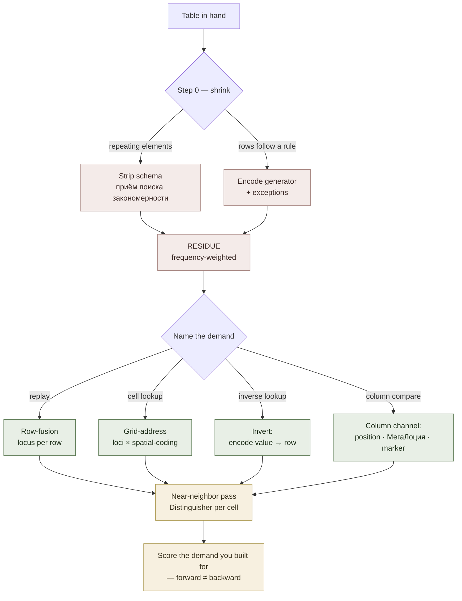

# Table Memorization

**Summary**: Routing guide for **tabular and matrix material** — schedules, timetables, unit and constant tables, reference rows, spec sheets, comparison grids. The fourth sibling beside code-memorization (structure is the load), verse-memorization (surface form is the load), and [prose-memorization](./prose-memorization.md) (meaning plus embedded exact facts). For a table the load is different again: **a table is not content, it is an access pattern** — the same nine rows are cheap or expensive depending entirely on whether you will be asked to replay them, look one up, invert them, or compare down a column. This page opens the row-14 gap named in [cross-school-encoding-router](./cross-school-encoding-router.md): the one material class where the Giordano school has a drilled technique and the Neural OS spine had no artifact at all.

**Sources**:
- `Мнемотехника шаг за шагом.pdf` — Course 2 §ЗАПОМИНАНИЕ ТАБЛИЧНЫХ ДАННЫХ (the two row-encoding variants and the "waterfalls of the world" worked table), §ПРИЕМ ПОИСКА ЗАКОНОМЕРНОСТИ (redundancy stripping).
- Internal owners: [memory-palace](./memory-palace.md) · [spatial-coding](./spatial-coding.md) · [four-level-blocks](./four-level-blocks.md) · [nedf-overview](./nedf-overview.md) · [mnemonic-methods-master](./mnemonic-methods-master.md) · [vocabulary-word-type-routing](./vocabulary-word-type-routing.md) (МегаЛоция) · [mental-markers-category-importance-order](./mental-markers-category-importance-order.md) · [kozarenko-mnemotechnics](./kozarenko-mnemotechnics.md) · [cross-school-encoding-router](./cross-school-encoding-router.md).
- Worked instance already in the wiki: georgian-driving-exam-b-numeric-table (speed/distance/gap tables, near-neighbor traps, frequency-weighted cells).

**Last updated**: 2026-09-02 ([multi-valued-attributes](./multi-valued-attributes.md) routes its *address* case to this page — a keyed paradigm is a table one level down); 2026-09-02 (row-level sibling [multi-attribute-encoding](./multi-attribute-encoding.md) authored and wired in — §The composition worth naming and §Related pages); 2026-07-22.

---

## The claim this page rests on

Kozarenko's framing is the right starting point and it is deliberately deflationary: **tabular data is just a set of same-type information messages.** A nine-row "waterfalls of the world" table is nine separate messages, and memorizing them "differs in no way from memorizing separate historical dates" (source: Мнемотехника шаг за шагом.pdf). That is true — and it is exactly what makes tables quietly expensive, because it hides the thing that actually varies.

What varies is the **access pattern**. Nine rows encoded for replay cost almost nothing and answer almost nothing; the same nine rows encoded for random cell access cost several times more and answer everything. Choosing without naming the demand is how table encoding silently fails: the encode felt fine, and the question you actually get is the one your structure cannot serve.

So this page routes on the demand first and the technique second.

## Step 0 — shrink the table before encoding anything

Two moves, both of which delete work rather than organize it. Run them in this order, and run them **before** picking a strategy.

**Strip the redundancy.** Kozarenko's *приём поиска закономерности*: in same-type data there are always repeating elements that need not be stored, and are re-added on recall. His worked case is the physical constant `e = 1,60 × 10⁻¹⁹ Кл`, where the `=`, the comma after the first digit, the `×`, and the `10` all repeat across every row of the constants table — leaving `e — 160 — "−" — 19 — Кл`, five elements instead of a dozen (source: Мнемотехника шаг за шагом.pdf). The schema is paid **once**, not per row. This generalizes past his examples: a column whose value is constant is not a column, it is a fact about the table.

**Then ask whether the table is derivable at all.** If rows follow a rule, encode the **rule plus its exceptions** and let the table regenerate. The wiki's precedent is [speed-math-unifying-generator](./speed-math-unifying-generator.md), where one identity replaces a family of memorized cases, and the same logic governs any conversion or unit table. This is the highest-leverage move on the page and the most frequently skipped, because a table *looks* like something to be memorized.

What survives both passes is the **residue** — and only the residue gets encoded.

**Frequency-weight the residue.** Not every surviving cell earns a scene. georgian-driving-exam-b-numeric-table does this explicitly with a high-frequency-cell count taken while reading the question bank: cells are ranked by how often they are actually asked, and the encoding budget follows the ranking. A table encoded uniformly spends the same effort on the cell you will be asked forty times and the one you will never be asked.

## The four retrieval demands

This is the router. Name the demand before choosing a structure, because each demand has a different cheapest structure and no structure serves all four.

| Demand | The question it answers | What it needs |
|---|---|---|
| **Replay** | "Recite the table in order" | Order only — a sequence of row-scenes |
| **Cell lookup** | "What is X's value in column C?" | Row address **plus** column address |
| **Inverse lookup** | "Which row has value V?" | The value must itself be addressable, not buried inside a row-scene |
| **Column compare** | "Which is largest / which two share a value?" | The column must exist as an object, not only as a position inside rows |

Most real tables are asked **cell lookup** and **inverse lookup**, and most table encoding is built for **replay** — which is the mismatch this page exists to prevent. An exam that asks "what is the following distance at 90 km/h" is a cell lookup; a diagnostic that asks "which drug causes this symptom" is an inverse lookup.

## The strategies

| Strategy | How | Serves | Costs |
|---|---|---|---|
| **Row-fusion, locus per row** (Giordano variant A) | Each row becomes one association, fixed on its **own** support-image; the row's unique discriminator goes in the first cell (source: Мнемотехника шаг за шагом.pdf) | Replay · row-level random access | Loses column addressability |
| **Row-chain, one locus total** (Giordano variant B) | Row-associations linked directly to each other; only the first attaches to a support-image, so **the whole table sits on one locus** (source: Мнемотехника шаг за шагом.pdf) | Replay, very cheap on loci | No random access at all; collision-prone — see [kozarenko-mnemotechnics](./kozarenko-mnemotechnics.md) on *затирание* |
| **Grid-address** | Rows = loci, columns = **position within** the locus, per [spatial-coding](./spatial-coding.md) | Cell lookup · column compare | Costs a position discipline you must keep constant across every row |
| **Column-as-environment** | Each column gets its own МегаЛоция re-skin ([vocabulary-word-type-routing](./vocabulary-word-type-routing.md)) so column membership is read off the scene's genre | Column compare, when columns are categorical | Only works for a handful of columns; wasteful for numeric ones |
| **Lattice** | Map the table onto [four-level-blocks](./four-level-blocks.md)' 5×5 addressable lattice — a store that is **already matrix-shaped** | Cell lookup, native (row, col) → address | Only fits tables that are small in both directions |
| **Invert the table** | Encode value → row instead of row → value | Inverse lookup | A second encoding, not a substitute; you now maintain both |
| **Transpose** | Encode along the shorter axis | Any, when the table is very lopsided | Nothing, if you actually check the shape first |

**The composition worth naming.** Grid-address is not a new primitive — it is *loci for rows × [spatial-coding](./spatial-coding.md) for columns × the ordinary per-type encoder for each cell*, with the cell's type routed by [cross-school-encoding-router](./cross-school-encoding-router.md) like any other material. A numeric cell takes the Major System, a term-cell takes a [NEDF](./nedf-overview.md) image. The table adds an address; it does not change how a datum is encoded once addressed.

**And one scale down.** A single row — one item carrying several attributes — has its own assignment problem that this page does not solve: which of the scene's channels each attribute takes, how many it can spend before the merge reverts to a stack, and which attributes have to leave the row entirely because they will be compared *across* rows. That is [multi-attribute-encoding](./multi-attribute-encoding.md), the row-level sibling. The handoff runs both ways: its Rule A ("an attribute you must compare does not belong inside the item") is exactly the move that turns an attribute into one of this page's columns.

## The column channel — what both Giordano variants lack

Both of Kozarenko's variants fuse a row into a single association. That is efficient and it is lossy in one specific way: **the column disappears.** You can replay "Анхель — Южная Америка — 1054" but the fused scene gives no handle for *"which waterfalls are in Africa"* without replaying every row and filtering.

The wiki already owns three free channels that restore it, and they are alternatives, not a stack:

- **Position** ([spatial-coding](./spatial-coding.md)) — the column lives in where the sub-image sits. Cheapest; requires an unvarying convention.
- **Environment** (МегаЛоция) — the column lives in the scene's genre. Best when columns are categorical and few.
- **Attached marker** ([mental-markers-category-importance-order](./mental-markers-category-importance-order.md)) — the column lives in a per-item tag. Best when only one or two columns need to be queryable.

Pick one per table. Two channels for the same column is redundancy that costs encode time and buys nothing; two channels for *different* columns is fine and often correct.

## How tables fail — three modes, not one

Tables fail differently from prose or verse. The failure is rarely "I can't recall the cell"; it is **producing the wrong thing with conviction**. The first version of this page claimed a single mode, and the falsifier run below showed that was too narrow. Three modes:

**1. Near-neighbor value collision.** Recalling an adjacent cell. Rows in a table are same-type by construction, so every row is a high-quality distractor for every other — the same structural hazard [kozarenko-mnemotechnics](./kozarenko-mnemotechnics.md) names as *затирание* for reused codes, arriving through the material's shape rather than through code reuse.

**2. Quantifier flip — right number, wrong direction.** The value is recalled perfectly and the *relation* attached to it is inverted: `≥ 2 s` produced as "no more than 2 s". Not a near-neighbor error, because the number is correct — and the most dangerous of the three precisely because every check that verifies the *value* passes.

> The structural reason it is under-defended: encoders routinely treat the operator as reconstructible context, the way they treat units. georgian-driving-exam-b-numeric-table §6 states that rule explicitly — units are never encoded, they are domain-typed and reconstruct from the question. That is right for units, which the question determines. **It is not right for the operator, which the question does not determine**: "no less than 2 seconds" and "no more than 2 seconds" are both well-formed answers to the same question, and only the source says which. If a cell's relation can be inverted and still parse, the relation is content and has to be encoded.

**3. Range-boundary error.** `4–6 m` produced as `2–4 m` or `6–8 m` — width right, anchoring off by a step. Distinct from mode 1: no other cell is being confused, the interval is simply misplaced.

Three consequences for encoding:

1. **The Distinguisher slot is not optional for table cells.** [NEDF](./nedf-overview.md) owns the discipline; a cell encoded vividly but not discriminably is the canonical mode-1 failure. "Vivid enough to see, not distinct enough to tell from the row above" is the exact defect.
2. **Encode the near-neighbors as a set, deliberately.** georgian-driving-exam-b-numeric-table carries an explicit trap list — the wrong values the distractors actually offer — because on that exam the confusable value *is* the thing being tested.
3. **A grid checksum kills mode 1 cheaply where cells are related.** That page's gap grid carries one — *ice triples normal (2→6, 3→9); uninhabited adds one step (2→3, 6→9)* — so a recalled pair breaking either relation is self-detectably wrong. Checksums are the strongest defense available and only exist where the cells stand in a relation; a table of unrelated constants cannot have one.

## Falsifier result — 2026-07-22, against the driving-exam table

The near-neighbor claim shipped with a falsifier; the falsifier was run. **It weakened the claim rather than confirming it.** Recorded here rather than quietly edited away.

**Structural half** (runnable with no memory test). If rows are high-quality distractors for each other, an exam's distractors should be drawn from the table's *own* value set. Counted over the 39 numeric distractors §4 of that page records:

| Sub-table | Distractors drawn from the table's own values | Chance rate for that value space |
|---|:--:|:--:|
| Speed limits | **20 / 21 (95%)** | ~67% — *space is nearly the table; weak test* |
| Following-gap grid | **6 / 12 (50%)** | ~33% — *space is open; clean test* |
| Distances | 3 / 6 (50%) | — |
| **Total** | **29 / 39 (74%)** | |

Read honestly: the rate is **above chance in every sub-table and overwhelming in none where the test is clean**. The 95% speed figure is confounded — plausible speed distractors are near-forced to be multiples of ten in a narrow band, so "drawn from the table" is close to unavoidable. The gap grid is the only unconfounded test available: 50% against a 33% baseline. Real, modest, not dominant. **(Small n — 12 distractors in the clean case. Suggestive, not decisive.)**

**What the run actually found.** The gap grid's dominant trap is not a value error at all. Against the correct "no less than 2 s" the bank offers *"no more than 2 s"* — same number, inverted relation. That is mode 2, and the first version of this page had no name for it.

**Status.** "Near-neighbor collision is *the* table failure mode" → **refuted**. "…is *a* failure mode, elevated above chance" → **survives, weakly evidenced**. The recall half — which error type real misses land on, feeding `driving.near_neighbor_error_rate` — **has not been run**; it needs a cold recall pass by the operator. Until then everything in this section rests on the structure of a question bank, not on an observed memory failure.

**Re-run it.** Both halves are a committed instrument, `tools/near_neighbor_falsifier.py`:

```
python tools/near_neighbor_falsifier.py --structural    # the half above, reproducible
python tools/near_neighbor_falsifier.py                 # the cold recall half
python tools/near_neighbor_falsifier.py --sheet         # static sheet + key, key last
python tools/near_neighbor_falsifier.py --list          # available tables
```

> **Cold means cold.** If the answers have been discussed recently — reviewing the source page, or talking the traps through — the run measures the discussion rather than the encoding. **Quantifier-flip items contaminate first**, because explaining the trap is exactly what installs the direction; that biases the result *against* the mode the instrument exists to detect. Leave a gap, or run a table that has not been talked about. A run whose cleanliness you cannot vouch for is an upper bound on accuracy and a lower bound on QF errors, not a verdict.

Item banks live in `tools/near-neighbor-banks/*.json`, one per table. The load-bearing rule for adding a table: **use only distractors the source actually offers.** Invented distractors are marked `attested: false` — they stay usable for recall practice but are excluded from the structural statistic, because a made-up distractor measures the author's imagination rather than the material's confusability.

## Pass floors

Measure the demand you encoded for, not the one that is easiest to test — the standing trap is testing replay because replay is pleasant, when the demand was lookup.

| Demand | Test | Floor |
|---|---|---|
| Replay | Reproduce rows in order | Giordano's four-band error rubric ([giordano-graded-curriculum](./giordano-graded-curriculum.md)) transfers directly |
| Cell lookup | Random (row, column) prompts | Latency floor per cell; use the relative floor — value retrieved faster than the scene it sits in — from [yagodkin-advance-mnemonics](./yagodkin-advance-mnemonics.md) |
| Inverse lookup | Given a value, name the row | Scored separately; **passing forward does not imply passing backward** — see [word-knowledge-links](./word-knowledge-links.md) on directed links |
| Near-neighbor | Forced choice between adjacent rows | The only test that catches confident-wrong recall |

Giordano's own graded test is worth reading precisely here: it gives support-image **ordinals** in random order and asks what is fixed on each ([giordano-graded-curriculum](./giordano-graded-curriculum.md)). That measures *row-level* random access — which his row-fusion technique serves well — and does not measure cell-level access, which it serves poorly. The rubric is reusable; its coverage is not complete.

## Failure modes

| Failure | What it looks like | Fix |
|---|---|---|
| **Encoding a derivable table** | Memorizing a conversion grid rule-free | Step 0 — encode the generator, then the exceptions |
| **Uniform budget** | Every cell gets equal effort | Frequency-weight the residue |
| **Demand mismatch** | Built for replay, asked for lookup | Name the demand first; it is the only irreversible choice |
| **Column loss** | Row-fused everything, now cannot query a column | Add one column channel — position, environment, or marker |
| **Channel stacking** | Column carried by position *and* genre *and* a marker | One channel per column |
| **Near-neighbor confidence** | Fluent recall of the wrong adjacent row | Distinguisher slot per cell; encode the trap set explicitly |
| **Whole table on one locus, then edits** | Variant B used for a table that changes | Variant B is for frozen tables; edits mean re-chaining |
| **Testing the pleasant direction** | Only ever replaying | Score inverse lookup separately |

## Mnemonic

**SHRINK · NAME · ADDRESS · SEPARATE.** *Shrink* the table (strip the schema, derive what can be derived, weight what survives). *Name* the demand — replay, lookup, inverse, compare — before touching a locus. *Address* it: rows take loci, columns take one free channel. *Separate* the neighbors, because the row above is the best distractor the material will ever have. A table is not nine facts; it is nine facts **and an access pattern**, and only the second one is a design decision.

## Checksum

- If you encoded the table before asking **what you will be asked** → the most expensive mistake available here; the demand is the only irreversible choice.
- If you memorized a table that follows a **rule** → wrong; encode the rule plus exceptions.
- If every cell got the **same budget** → wrong; frequency-weight the residue.
- If you row-fused everything and now want a **column** → the column was destroyed at encode time, not lost at recall time.
- If a column is carried by **two channels** → redundant; one per column.
- If recall is fluent but **wrong by one row** → that is the table failure mode, and it is a Distinguisher defect, not a retrieval defect.
- If forward lookup passes and you assumed **inverse** passes → wrong; separate directions, separately trained.
- If the whole table sits on **one locus** and the table is still changing → variant B is for frozen tables only.
- Giordano's graded rubric measures **row-level** random access, not cell-level — reusable, not complete.

## Visual



New framework minted: NONE. New acronym: NONE — SHRINK·NAME·ADDRESS·SEPARATE is a page-local mnemonic, not a registered protocol.

## Related pages

- [cross-school-encoding-router](./cross-school-encoding-router.md) — row 14, the gap this page opens; route a cell's *type* through it once the cell is addressed
- [multi-attribute-encoding](./multi-attribute-encoding.md) — the row-level sibling: what to do with one item's attributes once the table has addressed it
- [multi-valued-attributes](./multi-valued-attributes.md) — routes its *address* case here: a closed ordered key grid (person x number, case x gender) is a table with one row
- code-memorization · verse-memorization · [prose-memorization](./prose-memorization.md) — the three siblings; this is the fourth case
- [kozarenko-mnemotechnics](./kozarenko-mnemotechnics.md) — the two row-encoding variants, the cell-payload ladder, and *затирание*, the collision hazard tables reproduce structurally
- [giordano-graded-curriculum](./giordano-graded-curriculum.md) — the four-band rubric reused above, and its coverage limit
- [spatial-coding](./spatial-coding.md) — the position channel that restores the column
- [four-level-blocks](./four-level-blocks.md) — an addressable store that is already matrix-shaped
- [vocabulary-word-type-routing](./vocabulary-word-type-routing.md) — owner of МегаЛоция, the environment channel
- [mental-markers-category-importance-order](./mental-markers-category-importance-order.md) — owner of the per-item marker channel
- [nedf-overview](./nedf-overview.md) — the Distinguisher slot, load-bearing for near-neighbor separation
- [memory-palace](./memory-palace.md) — loci for the row axis
- [speed-math-unifying-generator](./speed-math-unifying-generator.md) — the precedent for encoding a generator instead of its cases
- georgian-driving-exam-b-numeric-table — the worked instance: frequency-weighted cells and an explicit trap list
- [word-knowledge-links](./word-knowledge-links.md) — why forward and inverse lookup are separately-trained memories
- [yagodkin-advance-mnemonics](./yagodkin-advance-mnemonics.md) — the relative floor used for cell-lookup latency
- [meter-overview](./meter-overview.md) — where these floors are measured

---

## U — See (CAST)

1. A table as two axes plus an access pattern, not as a block of content
2. Edges: rows → loci; columns → one free channel; cells → their own material type, routed elsewhere

## D — Name (NEDF)

1. Table memorization = routing guide for tabular/matrix material, fourth sibling in the memorization family
2. Distinguisher: routes on **retrieval demand** (replay · cell lookup · inverse · compare) where the sibling pages route on what the load is made of
3. Failure mode: encoding before naming the demand; row-fusing away the column; confident recall of the adjacent row

## F — Do (SPEAR)

1. Table arrives → strip schema → try to derive → frequency-weight the residue
2. Name the demand → pick the strategy → add exactly one column channel → run the near-neighbor pass
3. Score the demand you built for, in both directions

## B — Watch (HEART)

1. Drift toward replay because replay is the pleasant test
2. Column channels stacking
3. Variant B (whole table on one locus) applied to a table that still changes

## L — Predict (ORACLE)

1. Same-type rows with close numeric values → predict near-neighbor collision before any recall failure
2. A table encoded without Step 0 → predict most of the encode was deletable

## R — Act (GRACE)

1. New table → run Step 0 before opening a palace
2. "I know it but keep mixing up two rows" → Distinguisher work, not more repetition
3. Cell-type question mid-encode → route it through [cross-school-encoding-router](./cross-school-encoding-router.md), don't improvise
