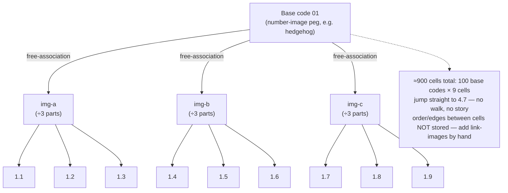

# Table of Support-Images (ТОО)

**Summary**: ТОО (*Таблица опорных образов*) is Kozarenko's self-generating synthetic-loci system: it manufactures roughly 900 numerically-addressed memory cells out of the 100 already-automatized two-digit number-image codes, using only free association and part-subdivision — no photography and no walked room required.

**Sources**: `GMS_V.Kozarenko.pdf`; internal [kozarenko-mnemotechnics](./kozarenko-mnemotechnics.md), [memory-palace](./memory-palace.md), [person-action-object-system](./person-action-object-system.md).

**Last updated**: 2026-07-10.

---

## What ТОО is

ТОО is one of the three ways [Kozarenko's Giordano school](./kozarenko-mnemotechnics.md) builds *опорные образы* (support-images) — the fixed, pre-learned loci that hold information for long-term storage. Kozarenko's own analogy: ТОО is "like a notebook into which you write important information," and unlike the photographic *метод Цицерона* loci or the walked [Method of Loci](./memory-palace.md), it is explicitly a **long-term** store whose cells can be reviewed on a schedule for maintenance (source: GMS_V.Kozarenko.pdf).

The distinctive move is that ТОО **generates its own addressable loci without any photography or physical walk**. Where the other two support-image methods require you to photograph 100 real places (rooms, playgrounds, routes) and subdivide each photo into parts, ТОО grows its cells purely inside imagination from the number-code vocabulary you already own (source: GMS_V.Kozarenko.pdf). It does not encode information itself — like all support-images, it is scaffolding that holds encoded material in a fixed, retrievable order (source: GMS_V.Kozarenko.pdf).

This page owns the ТОО method. It does **not** re-document the БЦК number-code table or the individual number→image codes — those are owned by [kozarenko-mnemotechnics](./kozarenko-mnemotechnics.md); treat that page as the vocabulary this method consumes.

## The generation recipe

ТОО is a combination of three simple techniques (source: GMS_V.Kozarenko.pdf):

1. **Number-image codes** — the fixed image for each two-digit number, owned by [kozarenko-mnemotechnics](./kozarenko-mnemotechnics.md).
2. **Free association** (*прием свободных ассоциаций*) — look at an image, let the brain surface a second image already naturally linked to it; do not force a connection.
3. **Part-extraction** (*выделение частей образа*) — mark out sub-parts of an image, left-to-right and top-to-bottom.

The fan-out: from one base number-image code, free-association yields **three** additional images; from each additional image you extract **three** parts. Three images times three parts gives **nine** numerically-addressed cells per base code (source: GMS_V.Kozarenko.pdf). The free-association chain is written `S → R(S) → R(S) → R` — each image is the stimulus that pulls the next (source: GMS_V.Kozarenko.pdf).

The result is a numbered *row* of support-images with cell addresses. Base code `01` spawns the cells `1.1, 1.2 … 1.9`; base code `02` spawns `2.1 … 2.9`, and so on (source: GMS_V.Kozarenko.pdf). Because the 100 base codes span `00–99`, the full table scales to roughly **900 addressable cells** (source: GMS_V.Kozarenko.pdf).

Each cell is an empty slot that can hold a single image (wasteful), a whole *association* (phone number, password, historical date), a chained list, or a small table of five-to-ten rows (source: GMS_V.Kozarenko.pdf). Kozarenko also builds a *second* table on the 33 letters of the Russian alphabet (`А–Я`), filled lazily — some letters grow the full nine images, some (`Ы`, `Ь`, `Ъ`) grow none (source: GMS_V.Kozarenko.pdf).

## Random-access addressing — the strength

The defining property is that ТОО cells are **numerically addressed**: to read or write cell `4.7` you jump straight to it, the way you would open a spreadsheet cell or a mailbox number. There is no walk to perform and no story to replay — the address *is* the lookup key (source: GMS_V.Kozarenko.pdf).

This is what makes ТОО the answer to a specific bottleneck. [PAO](./person-action-object-system.md) and the wider [method map](./mnemonic-methods-master.md) both hit a wall Kozarenko's method routes around: for long or open-ended storage, **the palace runs out of loci** — loci-consumption, not image vividness, is the scarce resource, and photographic loci are slow to manufacture. ТОО mints 900 fresh, indexed cells from a vocabulary you already over-learned, so the address space stops being the constraint (source: GMS_V.Kozarenko.pdf).

## What ТОО loses — the named failure mode

The same numeric addressing that makes ТОО fast is also its failure mode. ТОО cells are **random-access by number, not spatially or narratively ordered**. A walked [memory-palace](./memory-palace.md) preserves *sequence and adjacency* (this locus comes after that one; these two items sit side by side), and a [CAST](./cast-overview.md) graph preserves *typed edges between nodes*. ТОО's native structure preserves only the address — the relationships *between* cells are not carried by the method (source: GMS_V.Kozarenko.pdf).

Kozarenko has to bolt relationships back on manually. Cross-references between tables exist only if you deliberately store a *link-image* in a cell — e.g. writing at address `4.7` a link-image for the letter-table entry `Н` so that reviewing row 4 sends you to row Н (source: GMS_V.Kozarenko.pdf). Likewise, to read cells in a chosen *order* you must temporarily re-encode the addresses through the walked-loci method — proof that the table itself carries no order (source: GMS_V.Kozarenko.pdf).

The rule of thumb: use ТОО for **random-access lookup** (contacts, schedules, reference constants, facts you query by index) and reach for a walked [memory-palace](./memory-palace.md) or a [CAST](./cast-overview.md) graph the moment the *relationships between items* are the payload.

ТОО is not Kozarenko's only self-generating store. [four-level-blocks](./four-level-blocks.md) is the sibling structure — 125 loci grown by Matryoshka-nesting empty support-images (*стикеры*) into a per-topic, 3-digit-addressed block, rather than free-associating out of the number-code vocabulary into a global ~900-cell table. Both preserve address but not relationships between cells; see that page for when to reach for the topic-scoped block instead of this global table.

## METER fit

The measurement layer for ТОО, per [METER](./meter-overview.md), is retrieval latency at two gates:

- **Prerequisite gate (automaticity).** You cannot fill a single ТОО cell until the 100 two-digit number-image codes are over-learned. Kozarenko's threshold is recognition-class: a randomly-shown two-digit number must surface its image in about **0.5 seconds** with no hesitation (source: GMS_V.Kozarenko.pdf) — the automaticity-ladder level defined in [skill-progression-stages](./skill-progression-stages.md). This mirrors the Major-System code-recall contract owned by [mnemonic-methods-master](./mnemonic-methods-master.md). Only after that gate does the free-association fan-out produce stable loci.
- **Pass-floor (the cell as locus).** A ТОО cell address must resolve to its stored image in **under 2 seconds** — recognition-class, not reconstruction. If reaching `4.7` requires System-2 re-derivation of the base code and its associations, the cell is not yet a locus and the address will drop items under load ([METER](./meter-overview.md)).

## Mnemonic

**"The number that grew drawers."** Picture the base code's image — say code `01` as a hedgehog — turning into a filing cabinet. It sprouts three free-association branches; each branch splits into three labelled drawers, giving nine drawers numbered `1.1 … 1.9`. One hundred such cabinets (`00–99`) line the wall: ~900 drawers you never had to photograph, each opened by its number.

## Checksum

Three falsifiable recall questions:

1. **How many addressable cells does one base code spawn, and by what recipe?** Answer: **nine** — three free-association images, each cut into three parts (source: GMS_V.Kozarenko.pdf). If you said the base code *is* the cell, or counted five parts like a photographed locus, you are wrong.
2. **What must be true before you can fill even one ТОО cell?** Answer: the 100 two-digit number-image codes over-learned to ~0.5s recognition automaticity (the [skill-progression-stages](./skill-progression-stages.md) gate). If you tried to grow cells on un-automatized codes, the fan-out has nothing stable to hang on.
3. **What does ТОО's native structure fail to preserve that a walked palace or a CAST graph does?** Answer: the **relationships / ordering between cells** — ТОО is random-access by number, and cross-references exist only as manually stored link-images (source: GMS_V.Kozarenko.pdf).

## Visual

## Related pages

- [kozarenko-mnemotechnics](./kozarenko-mnemotechnics.md) — owner of the БЦК number-code vocabulary ТОО consumes; the doctrine map for the whole Giordano school
- [four-level-blocks](./four-level-blocks.md) — the sibling self-generating store: 125 theme-scoped, Matryoshka-nested loci vs. this table's ~900 number-addressed cells
- [memory-palace](./memory-palace.md) — the walked Method of Loci; ТОО's sibling support-image method and the one to prefer when order/adjacency is the payload
- [person-action-object-system](./person-action-object-system.md) — names the loci-consumption bottleneck ТОО is built to route around
- [mnemonic-methods-master](./mnemonic-methods-master.md) — owner of the Major System / number-peg contract ТОО's prerequisite gate rides on
- [cast-overview](./cast-overview.md) — the graph structure that preserves typed edges ТОО discards
- [skill-progression-stages](./skill-progression-stages.md) — the automaticity ladder the 0.5s prerequisite gate sits on
- [meter-overview](./meter-overview.md) — the measurement discipline that sets the retrieval-latency pass-floor

---

## U — See (CAST)
1. One number-code vocabulary self-replicating into ~900 indexed cells with no photography
2. Edges: base code → 3 free-association images → 3 parts each → 9 addressed sub-cells

## D — Name (NEDF)
1. ТОО = Table of Support-Images: synthetic, numerically-addressed loci grown from number-image codes
2. Distinguisher: random-access by address (4.7), long-term store, no walked route
3. Failure mode: using it for relational/sequential data — it drops the relationships between cells

## F — Do (SPEAR)
1. Automatize the 00–99 codes to 0.5s, then fan each into 3 free-association images × 3 parts
2. Address the cell (e.g. 4.7), store an association/list/mini-table on it, review to keep it warm

## B — Watch (HEART)
1. Filling cells before the number codes are automatized → unstable, collapsing loci
2. Reaching for ТОО when the payload is order or relationships → use memory-palace / CAST instead

## L — Predict (ORACLE)
1. Any "I ran out of palace loci" complaint → ТОО (or a letter-table twin) mints fresh addressed space
2. If a domain needs cross-links, expect to hand-place link-images — the table won't grow edges on its own

## R — Act (GRACE)
1. Random-access reference data (contacts, schedules, constants) → route to a ТОО cell address
2. Sequenced or relational data → route to a walked [memory-palace](./memory-palace.md) or a [CAST](./cast-overview.md) graph
