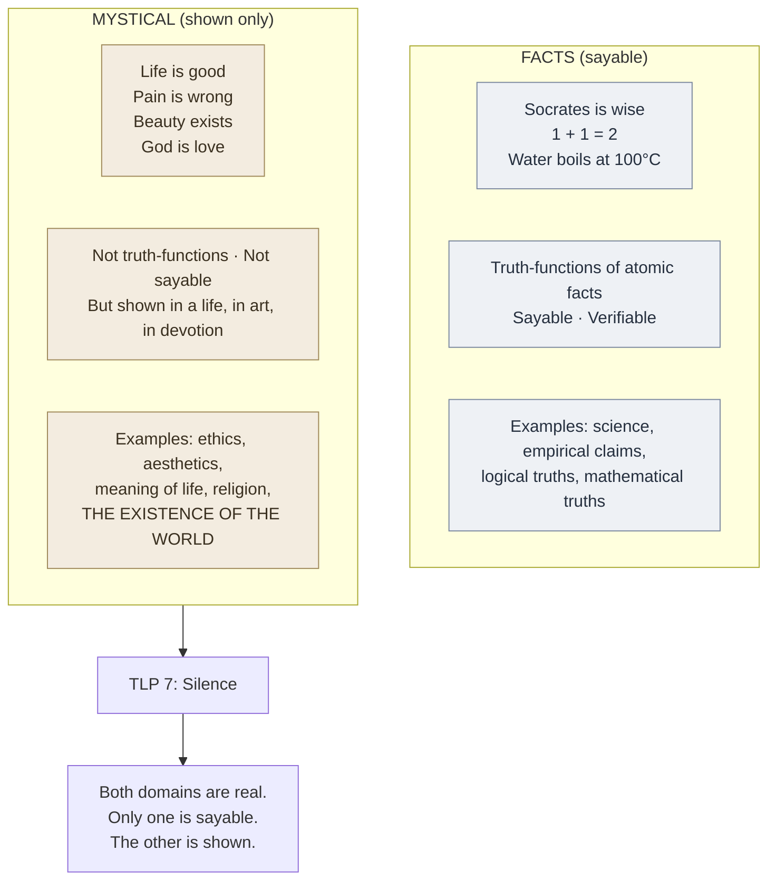

# The Mystical (TLP 6.4–6.522)

**Summary**: [TLP](./tractatus-logico-philosophicus.md) propositions 6.4–6.522. *Not how the world is, is the mystical, but that it is.* The propositions on **ethics, aesthetics, the meaning of life, and the inexpressible**. What lies beyond the limits of language — what can be *shown* but not *said*. The closing movement of TLP before proposition 7. **Cross-link to Hebrews 11:1** (faith as the substance of things hoped for, the evidence of things not seen): the same epistemic structure of *shown but not said*.

**Sources**:
- [Wittgenstein TLP](./tractatus-logico-philosophicus.md) propositions 6.4 – 6.522 (Ogden numbering matches Pears/McGuinness here).
- [show-vs-say](./show-vs-say.md) — TLP 4.121–4.1212 + 6.522 as a unified epistemic boundary.
- Russell's introduction to TLP — gentle reservation about Wittgenstein's mysticism.

**Last updated**: 2026-05-25

---

## One-line

> *Not how the world is, is the mystical, but that it is.* — TLP 6.44

The mystical isn't *another set of facts* — it's the *non-factual*. Ethics, aesthetics, meaning of life: these can be shown by a life lived; they cannot be said in propositions because propositions describe *facts* and the mystical isn't a fact.

## Unlocks (lead, not footer)

1. **Ethics is not a science.** TLP 6.42: *there can be no ethical propositions*. Ethical claims aren't truth-functions of atomic facts; they don't describe how the world *is*. They are the *non-factual layer* — they belong to the showing, not the saying. **The wiki cross-links to David's lived practice**: tithing (20% of gross), marriage, church community, substrate stewardship — these *show* an ethical commitment that can be observed in a life but not fully *said* in a proposition.

2. **The world is a *limit of language* not a limit of *the mystical*.** TLP 6.45: *the feeling of the world as a bounded whole is the mystical*. The world has a *boundary* (the limits of what can be said); the mystical lives at and beyond that boundary. The mystical isn't extra-territorial beyond the world; it's the *form* of the world taken in itself.

3. **Cross-link to Hebrews 11:1.** *Faith is the substance (ὑπόστασις, hypostasis) of things hoped for, the evidence (ἔλεγχος, elenchos) of things not seen.* The Hebrews structure parallels TLP show-vs-say at the theological layer: *substance/evidence* of the *not-seen* names exactly what TLP calls the mystical — that which shows itself in lived faith but cannot be said as a proposition about the world. **The wiki's Bible study cross-links to TLP via this parallel structure.**

4. **The mystical is the failure mode of philosophy when it tries to *say* what should be *shown*.** TLP 6.53: *the right method of philosophy would be to say nothing except what can be said, i.e., the propositions of natural science, i.e., something that has nothing to do with philosophy — and then always, when someone else wished to say something metaphysical, to demonstrate to him that he had given no meaning to certain signs in his propositions.* **Most of what passes for philosophy is the attempt to *say* the mystical — and is therefore nonsense in TLP's strict sense.** TLP itself acknowledges (TLP 6.54: the ladder) that it has done this and must be discarded after climbing.

## Mnemonic

**E-A-M-S** = *Ethics · Aesthetics · Meaning of life · Silence.*

Four domains of the mystical, ending in TLP 7's command.

For the key proposition: **6.44** = *Not HOW the world is, but THAT it is.*

## Memory checksum

1. **State TLP 6.44.** (*Not how the world is, is the mystical, but that it is.* The world's *existence* is the mystical; the world's *contents* are factual.)
2. **State TLP 6.45.** (*The feeling of the world as a bounded whole is the mystical.* The boundary of the world is felt as a totality; that feeling is the mystical.)
3. **State TLP 6.421 about ethics.** (*It is clear that ethics cannot be expressed. Ethics is transcendental.* Ethical claims aren't truth-functions of facts; they belong to the showing, not the saying.)
4. **State TLP 6.522.** (*There is indeed the inexpressible. This shows itself; it is the mystical.* The mystical *shows itself* — it's accessible in lived experience — but cannot be put into propositions.)
5. **Cross-link to Hebrews 11:1.** (*Faith is the substance of things hoped for, the evidence of things not seen.* Same epistemic structure: *substance/evidence* of *not-seen* = what is shown but not said.)

## Visual — the mystical's location

The two columns are exclusive: what can be said is in the left; what can be shown but not said is in the right. The mystical is not *less real* than facts — it's *differently accessible*.

---

## The propositions of TLP 6.4

| TLP # | Proposition (Pears/McGuinness) |
|---|---|
| **6.4** | All propositions are of equal value. |
| **6.41** | The sense of the world must lie outside the world. In the world everything is as it is, and happens as it does happen: in it no value exists — and if it did exist, it would have no value. If there is any value that does have value, it must lie outside the whole sphere of what happens and is the case. |
| **6.42** | Hence also there can be no ethical propositions. Propositions can express nothing of what is higher. |
| **6.421** | It is clear that ethics cannot be expressed. Ethics is transcendental. (Ethics and aesthetics are one and the same.) |
| **6.422** | The first thought in setting up an ethical law of the form "thou shalt..." is: And what if I do not do it? It is clear, however, that ethics has nothing to do with punishment and reward in the usual sense of the terms. |
| **6.43** | If good or bad willing changes the world, it can only change the limits of the world, not the facts. |
| **6.4311** | Death is not an event in life. We do not live to experience death. |
| **6.4312** | The temporal immortality of the soul of man, that is to say, its eternal survival after death, is not only in no way guaranteed, but this assumption in the first place will not do for us what we always tried to make it do. |
| **6.44** | Not *how* the world is, is the mystical, but *that* it is. |
| **6.45** | The contemplation of the world *sub specie aeterni* is its contemplation as a limited whole. The feeling of the world as a limited whole is the mystical feeling. |
| **6.5** | For an answer which cannot be expressed, the question too cannot be expressed. The riddle does not exist. If a question can be put at all, it is also possible to answer it. |
| **6.51** | Scepticism is not irrefutable, but obviously nonsensical, when it tries to doubt where no question can be asked. |
| **6.52** | We feel that even when all *possible* scientific questions have been answered, the problems of life have not yet been touched at all. Of course there is then no question left, and just this is the answer. |
| **6.521** | The solution of the problem of life is seen in the disappearance of this problem. (Is not this the reason why men, to whom after long doubting the sense of life became clear, could not then say wherein this sense consisted?) |
| **6.522** | There is indeed the inexpressible. This shows itself; it is the mystical. |
| **6.53** | The right method of philosophy would be this: to say nothing except what can be said, i.e., the propositions of natural science — i.e., something that has nothing to do with philosophy — and then always, when someone else wished to say something metaphysical, to demonstrate to him that he had given no meaning to certain signs in his propositions. |
| **6.54** | My propositions are elucidatory in this way: he who understands me finally recognizes them as senseless, when he has climbed out through them, on them, over them. (He must so to speak throw away the ladder, after he has climbed up on it.) He must surmount these propositions; then he sees the world rightly. |
| **7** | What we cannot speak about we must pass over in silence. |

The progression 6.4 → 7 is one of the most-tightly-organized passages in modern philosophy. Each proposition opens or closes a specific dimension of the mystical.

## Ethics is transcendental (6.421)

> *Ethics and aesthetics are one and the same.* — TLP 6.421

The claim:
- **Ethical propositions don't describe facts.** They don't have truth-conditions in the truth-functional sense.
- **They are *transcendental*** — they belong to the structure that makes meaningful experience possible, not to the contents of experience.
- **Ethics ≡ aesthetics**: both are about how the world *is* in its totality, not about specific facts in it.

This is a strong claim, controversial:
- It would make moral relativism untenable (ethics is transcendental, not factual; not a matter of cultural disagreement about facts).
- It would make ethical reasoning unable to produce *propositions*; what can be done in ethics is *show* ethical commitment, *act* ethically, *live* an ethical life. Not state ethical propositions.

The wiki's stance: TLP's claim is strong; modern ethical philosophy (Rawls, Williams, Korsgaard, etc.) treats ethics more proposition-friendly. But TLP's point about *show-vs-say* in ethics remains operationally important: an ethical commitment shows in a life lived; it cannot be exhaustively stated.

## The world's existence is the mystical (6.44)

> *Not how the world is, is the mystical, but that it is.*

The world's *existence* — the *that-ness* of being — is the mystical. This is the *contingent* fact that there is something rather than nothing. Wittgenstein doesn't develop a cosmological argument from it (TLP isn't a theistic text); the claim is *phenomenological*: the wonder at the world's existing-at-all is itself the mystical feeling.

Heidegger later develops a similar theme (*"Why are there beings rather than nothing?"* — the leading question of metaphysics). The Heidegger-Wittgenstein resonance on this point is one of the deeper non-coincidences in 20th-century philosophy.

## The world as a bounded whole (6.45)

> *The feeling of the world as a limited whole is the mystical feeling.*

The world has *limits* — the limits of meaningful language (TLP 5.6); the limits of one's own perspective (TLP 5.62-5.64); the limits of facts (the totality of facts is the world, no more). **The feeling of the world *as* this limited whole** — perceiving the totality and its boundedness simultaneously — is the mystical.

This is the *aesthetic* or *contemplative* side of the mystical. *Sub specie aeterni* — under the aspect of eternity. The contemplative tradition (Stoic, Christian-monastic, Buddhist, etc.) has developed this mode under various names. TLP names it as a philosophical structure: the world *as* a bounded totality.

## Cross-link to Hebrews 11:1

Hebrews 11:1: *Now faith is the substance (ὑπόστασις, hypostasis) of things hoped for, the evidence (ἔλεγχος, elenchos) of things not seen.*

The Greek pair *hypostasis/elenchos* has the same epistemic structure as TLP's *shown/said*:
- *Hypostasis* (substance, underlying reality) of things *hoped for* (not yet seen as fact) — what shows itself in faith without being a fact-claim.
- *Elenchos* (evidence, conviction) of things *not seen* (not in the sayable factual domain) — accessible to those who participate.

Both Hebrews and TLP draw the same boundary:
- **Sayable**: facts, propositions, what can be empirically described.
- **Shown**: faith, love, ethical commitment, the existence of the world, the feeling of bounded wholeness, the mystical.

The wiki cross-links this carefully: the parallel is structural, not theological. TLP is not a theistic text; Hebrews is. But the *epistemic shape* — substance/evidence of the not-seen — recurs in both, suggesting a deep cross-domain insight about how non-factual reality is accessible.

## TLP 6.53 — the right method of philosophy

> *The right method of philosophy would be this: to say nothing except what can be said, i.e., the propositions of natural science — i.e., something that has nothing to do with philosophy — and then always, when someone else wished to say something metaphysical, to demonstrate to him that he had given no meaning to certain signs in his propositions.*

This is TLP's **anti-philosophical** thesis. Philosophy as it has been done (metaphysics, ethics-as-propositions, philosophy-of-mind-as-propositions) is largely nonsense — the attempt to *say* what can only be *shown*. The right method is *therapeutic*: show the metaphysician that their propositions have no meaning.

TLP 6.54 (the ladder) admits TLP itself does this — uses propositions to point at what cannot be said, then discards them.

The wiki's stance: TLP's anti-philosophical move is provocative; most modern philosophy doesn't accept it (philosophy continues to be done). But the *show-vs-say discipline* is operationally useful: when you find yourself trying to *prove* an ethical claim or *deduce* a meaning-of-life answer, the warning sign is that you may have crossed into the unsayable.

## The mystical is not "spiritual" in the popular sense

Important boundary: TLP's *mystical* is not:
- New-age spirituality
- Religious experience (TLP isn't a theistic text, though it doesn't preclude theism)
- Irrationalism
- Anti-science (TLP 6.53 explicitly affirms natural science)

What TLP's mystical *is*:
- The boundary between sayable and shown
- The structural feature of all language meeting a non-factual layer
- The *form* of the world taken in itself
- The basis on which ethics and aesthetics are lived rather than asserted

The wiki cross-links to [Genova's take-seriously-but-hold-lightly meta-rule](./memory-paradox.md): take TLP's mystical seriously enough to recognize its structural insight; hold it lightly enough not to confuse it with popular mysticism or with TLP itself becoming a doctrine.

## METER integration

| Drill | Pass floor | Source |
|---|---|---|
| State TLP 6.44 | <15 s | this page §Mnemonic |
| State the show-vs-say boundary applied to ethics | <30 s | this page §Ethics 6.421 |
| Cross-link to Hebrews 11:1 | <60 s | this page §Cross-link |
| State the right method of philosophy (TLP 6.53) | <30 s | this page §TLP 6.53 |
| Distinguish TLP's mystical from popular spirituality | <60 s | this page §What it is not |

## Related pages

- [tractatus-logico-philosophicus](./tractatus-logico-philosophicus.md) — source primary text
- [show-vs-say](./show-vs-say.md) — TLP 4.121-4.1212 + 6.522 unified
- [picture-theory-of-language](./picture-theory-of-language.md) — what the mystical isn't (it isn't a picture)
- [limits-of-language-tlp](./limits-of-language-tlp.md) — TLP 5.6-5.641; the limits at which the mystical begins
- [atomic-fact-tlp](./atomic-fact-tlp.md) — TLP 2; what the mystical isn't (it isn't an atomic fact)
- bible-study-hebrews-11-1 — the parallel epistemic structure
- [memory-paradox](./memory-paradox.md) — take-seriously / hold-lightly applied to the mystical
- [wittgenstein-ludwig](./wittgenstein-ludwig.md) — author biography
- [godels-incompleteness](./godels-incompleteness.md) — Gödel's technical result vindicates show-vs-say structure
- [glossary](./glossary.md) — Logic layer registration
