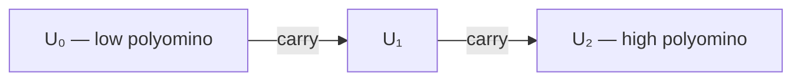

# Tile as Calculator — General-Purpose Arithmetic Substrate

**Summary**: An N-cell polyomino is the general substrate for base-N arithmetic. Marker walks the cells; carry fires on zero-cross; multi-digit numbers are polyominoes laid in a row. Works for any N — including base 10, which [cube-as-calculator](./cube-as-calculator.md) cannot host. Sister and trunk to the cube system: the cube specializes in 3D-native math; the tile substrate handles everything else.

**Sources**: User challenge (2026-06-03 session) — *"why don't we use tiles?"* — exposed that the cube was the wrong primary substrate for general arithmetic. Composes with existing [soroban-learning-method](./soroban-learning-method.md), [vedic-magic-squares](./vedic-magic-squares.md), [hand-to-number-system](./hand-to-number-system.md), [cube-as-calculator](./cube-as-calculator.md), [vedic-multiplication-nikhilam](./vedic-multiplication-nikhilam.md).

**Last updated**: 2026-06-03

---

## Different from [cube-as-calculator](./cube-as-calculator.md) — substrate partition

The cube specializes in the math that *requires* 3D structure to express:

1. The vertex-octal/binary identity — the same physical point is both a 3-bit binary number `(x,y,z)` and an octal digit `4z+2y+x`. Tiles can label two adjacent cells with both representations but cannot make them *the same point*.
2. The rotation group of order 24, S₄-action on the 4 diagonals.
3. The Euler invariant `V − E + F = 2`.

Everything else — base-N addition with carry, multi-digit chaining, base 10, bases that aren't divisors of 24 or 48 — is handled **here**. The tile substrate is the **trunk**; the cube is a specialized **branch**.

Both pages share the operation grammar (cycling = addition, composition = multiplication) and the unified carry rule. They split on the physical realization: cube anchors are 3D feature-sets, tile anchors are 2D N-cell polyominoes.

## Different from [soroban-learning-method](./soroban-learning-method.md) — embodiment partition

The soroban is the *running-arithmetic embodiment* of a tile-ring system: each rod is a fixed base-10 ring with bead positions encoding the digit. This page generalizes the soroban concept to **arbitrary base N** and to **non-bead substrates** (printed polyominoes, mental images, drawn glyphs). Soroban = the high-throughput physical instance; this page = the substrate description and learning ladder that makes the soroban legible to a learner.

## The polyomino convention — base IS the cell count, shape IS the factor pair

**Core convention**: A base-N digit ring is realized as an **N-cell polyomino**. The factor pair `N = a × b` (with `a ≤ b`, `a` as close to `√N` as possible) names the rectangle's dimensions. Cells are numbered `0` to `N−1` in **row-major order** from the top-left.

**The canonical six** (the bases worth memorizing as fixed shapes):

| Base N | Factor pair | Shape | Name | Common use |
|---|---|---|---|---|
| 2 | 1×2 | row of 2 | Domino | Binary digit |
| 6 | 2×3 | 2×3 rectangle | Hexomino | Senary / dice / hour-clock minutes-step |
| 8 | 2×4 | 2×4 rectangle | Octomino | Octal digit |
| 10 | 2×5 | 2×5 rectangle | Decomino | **Decimal — the daily base** |
| 12 | 3×4 | 3×4 rectangle | Dodecomino | Dozenal / clock hours / months |
| 16 | 4×4 | 4×4 square | Hexadecomino | Hex |

**Bases that resist factoring** — prime N has no rectangular factor pair and degenerates to a **1×N strip** (a single rod):

| Prime base N | Shape |
|---|---|
| 3 | 1×3 strip |
| 5 | 1×5 strip |
| 7 | 1×7 strip |
| 11 | 1×11 strip |
| 13 | 1×13 strip |
| 17, 19, 23 | 1×N strips |

The single-rod degeneracy is the same fallback the cube uses for base 7. Primes are *not* unfit substrates — they're just unfit **rectangles**. The 1×N rod is a polyomino too; it has the trivial factor pair `1×N`. A soroban rod is exactly this case for `N = 10` rendered as 10 bead-positions on one stick.

**Highly composite bases** offer multiple factor pairs:

- `12 = 3×4` (canonical, most-square non-trivial) — *also* `2×6` (used in clock arithmetic where 12 hours splits AM/PM into 2×6)
- `24 = 4×6` (canonical) — *also* `3×8` (octal-doubled view) — *also* `2×12` (dozenal-doubled)
- `60 = 6×10` (canonical for clock/angle) — *also* `5×12` — *also* `4×15`

Lock one pair per context. Switching factor pairs mid-drill is a documented failure mode (see below).

## Phase 0 cell-numbering lock — pick once, never re-pick

The orientation tax that breaks the cube does **not** break the tile substrate, but only because we lock Phase 0 hard and stick with it. All downstream work assumes:

- **Origin**: top-left cell = digit `0`.
- **Increment direction**: left-to-right within a row; row `r+1` follows row `r` (**row-major**, "read like a book").
- **Wrap**: marker exiting the last cell of row `r` enters the first cell of row `r+1`. From the final cell `N−1`, marker wraps to cell `0` (carry fires here).
- **Marker direction**: forward = increment digit; backward = decrement.
- **Rectangle orientation**: wider dimension horizontal (`2×5`, not `5×2`).

Same Phase-0 pattern as [cube-as-calculator](./cube-as-calculator.md)'s coordinate lock. One-time convention pick; recite the lock at the start of every session until automatic.

## Operation grammar — same as cube, generalized

- **Addition by k**: move marker forward `k` cells. Cells wrap modulo `N`.
- **Carry**: each time the marker crosses cell `0` in the forward direction, a carry of `+1` propagates to the next-higher polyomino.
- **Subtraction by k**: move marker backward `k` cells. Borrow propagates if the marker crosses cell `0` in the backward direction.
- **Multiplication**: composition — see §Multi-digit chaining and the open follow-up on polyomino composition.

Identical operation grammar to [cube-as-calculator](./cube-as-calculator.md); only the substrate changes.

## The unified carry rule (base-parameterized)

```
For each tile polyomino D operating in base N:
  D' := (D + k) mod N
  carry := floor((D + k) / N)
  Propagate carry to the next-higher polyomino U with the same rule.
```

Bit-identical to the cube's carry rule. Base `N` is a parameter; the rule has no `N`-specific branches. Carry direction is locked: **low polyomino on the right, high polyomino on the left, carry propagates leftward**. Same convention as positional notation in every base; same as the cube's 2-cube register.

## Multi-digit chaining

A `k`-digit base-`N` number is **`k` polyominoes laid in a row**, low-to-high right-to-left. Each polyomino is a single-digit register; each holds one marker. Carry from polyomino `i` propagates to polyomino `i+1`.



Three polyominoes; carry propagates from low (right) to high (left).

For base 10, three decominoes give you `0–999`. For base 12, three dodecominoes give you `0–1727`. The substrate scales by **repetition of the same shape**; the rule does not change.

This is structurally identical to a soroban with `N`-bead rods (just laid flat). The polyomino convention is the printable / mental version of the bead rod; the soroban is the bead-on-stick instance.

## Base 10 — what the cube can't do, tiles can

The **decomino** (2×5 rectangle) is the canonical base-10 register:

| 0 | 1 | 2 | 3 | 4 |
|---|---|---|---|---|
| 5 | 6 | 7 | 8 | 9 |

Marker on cell `7`. Add `5`: marker walks `7 → 8 → 9 → 0` **(CARRY fires)** `→ 1 → 2`. Final state: digit `2`, carry `1` propagated to the high decomino.

This is the central capability the tile substrate delivers and the cube does not. Every claim about "base-N arithmetic on a physical substrate" that [cube-as-calculator](./cube-as-calculator.md) makes, the decomino makes for the base most humans actually use.

## Composition with existing pages

### [soroban-learning-method](./soroban-learning-method.md) — the running-arithmetic instance
The soroban is a tile-calculator realized in beads on rods. Each rod is a base-10 ring; bead positions encode the digit. Soroban's value is **speed** (each rod is one register; throughput is high). This page's value is **generality** (any base; any shape; printable; mental). Use the soroban for daily arithmetic; use the polyomino frame to *understand why the soroban works* and to extend it to non-decimal bases (the soroban itself can be re-imagined as a base-12 device if each rod gets 12 positions — pure polyomino logic).

### [vedic-magic-squares](./vedic-magic-squares.md) — the 2D-grid sibling
A magic square is a tile-grid where the marker rule is "sum each row, column, diagonal to the same constant." Different operation grammar (sum-constraint, not carry-cycle), same substrate (N-cell tile grid). The magic square is the *constraint-satisfied* tile arrangement; the polyomino register is the *operation-driven* tile arrangement. Both compose with [universal-mental-tagging-framework](./universal-mental-tagging-framework.md) through the **Spatial + Pattern** axes.

### [hand-to-number-system](./hand-to-number-system.md) — the embodied-tile instance
The 10 fingers are a `1×10` decomino in degenerate single-row form. The hand is a polyomino you carry. Finger raised = marker on that cell. The hand is to base 10 what the cube's edges are to base 12: a built-in physical instance of the substrate. The decomino lock above explains *why* base 10 maps so cleanly to fingers — both are 10-cell row-major substrates.

### [cube-as-calculator](./cube-as-calculator.md) — the 3D-native branch
The cube specializes in bases that match cube symmetries (`3, 4, 6, 8, 12, 24, 48`) and in math that requires 3D (rotation group, Euler invariant, vertex-octal identity). For everything else, use this page. The two are **disjoint substrate sets**, not competing substrates — same operation grammar, split physical realizations. The two complete each other.

### [vedic-multiplication-nikhilam](./vedic-multiplication-nikhilam.md) — complement method composes natively
The Nikhilam complement (cell `d` paired with cell `(N − d)`) works on any polyomino the same way it works on the cube's opposite faces. For the decomino: cell `0 ↔ 9`, `1 ↔ 8`, `2 ↔ 7`, `3 ↔ 6`, `4 ↔ 5` — all pair-sums equal `9` (one less than the base, as the Nikhilam method requires). The complement is a **mirror reflection** across the center of the polyomino. Free shortcut, same as the cube's "look at the opposite face."

## Bases tiles handle naturally vs. specialty cases

| Family | Tile handling |
|---|---|
| **Powers of 2** (2, 4, 8, 16, 32, 64) | Square or near-square polyominoes. Binary↔hex conversion via shape doubling (`2×2 → 2×4 → 4×4 → 4×8`). |
| **Composite bases** (6, 10, 12, 14, 15, 18, 20, 24) | Rectangular polyomino, factor pair = dimensions. The canonical case. |
| **Highly composite** (12, 24, 60) | Multiple factor pairs; lock one per context (3×4 for dozenal arithmetic, 4×6 for the 24-hour clock, 6×10 for 60-minute clock). |
| **Primes** (3, 5, 7, 11, 13, 17, 19, 23) | 1×N rod (degenerate polyomino). Same fallback as the cube's base-7 case. |

The cube hosts ~8 bases natively. **Tiles host every composite base ≤ 100 natively, plus every prime as a rod.** Coverage ratio is roughly 6× the cube's — which is the practical reason this page is the trunk and the cube is the branch.

## METER integration — five `tile_calc::*` events

All events log alongside PULSE state.

| Event | Floor | Working | Target |
|---|---|---|---|
| `tile_calc::base_to_polyomino` (name N → state factor-pair rectangle dimensions) | ≤3s / ≥90% | ≤4s / ≥80% | ≤2s / ≥95% |
| `tile_calc::digit_to_cell` (digit d in base N → cell coords (row, col)) | ≤4s / ≥85% | ≤6s / ≥75% | ≤3s / ≥95% |
| `tile_calc::add_with_carry` (single polyomino, any base, single-carry case) | ≤7s / ≥90% | ≤10s / ≥80% | ≤5s / ≥95% |
| `tile_calc::multi_digit_chain` (3-polyomino base-N add with cross-carries) | ≤25s / ≥80% | ≤40s / ≥70% | ≤15s / ≥90% |
| `tile_calc::base_swap` (preserve digit value, swap polyomino — e.g., 7₁₀ → 7₁₂ → 7₁₆) | ≤5s / ≥85% | ≤8s / ≥75% | ≤3s / ≥95% |

Floor breach on `multi_digit_chain` for ≥3 consecutive sessions → drop to 2-polyomino drills.

These events **compose with — do not replace — `cube_calc::*` events**. A learner who can perform `cube_calc::base_anchor_id` AND `tile_calc::base_to_polyomino` for the same base has two mental substrates for the same content and can cross-check one against the other. osnf-protocol treats paired-substrate completion as a robustness multiplier; the two pages are designed to be drilled in parallel.

## Mnemonic

> *"Factor pair shapes the polyomino. Cell count names the base. Marker is the digit. Cross zero, carry left. Primes stand alone as rods."*

Five lines, one per load-bearing rule. **Two-path retrieval**: the shape → base direction (`2×5 → 10`) AND the base → shape direction (`10 → 2×5`). Either path recovers the convention.

**Counts roll-up**: `2 · 6 · 8 · 10 · 12 · 16` are the six canonical rectangle bases; `3 · 5 · 7 · 11 · 13` are the prime rod cases. Recite both in order at session start.

## Memory checksum

**Cold recite in ≤25 seconds**:

1. Polyomino convention: cell count = base, factor pair = dimensions.
2. Six canonical pairings: `2 = 1×2`, `6 = 2×3`, `8 = 2×4`, `10 = 2×5`, `12 = 3×4`, `16 = 4×4`.
3. Five prime degenerate cases: `3, 5, 7, 11, 13` → `1×N` rods.
4. Carry rule generalized: `D' = (D+k) mod N`, `carry = ⌊(D+k)/N⌋`, propagates leftward.
5. Multi-digit: `k` polyominoes laid right-to-left, carry chains low→high.
6. Phase 0 cell-numbering: top-left = `0`, row-major, marker forward = increment.

**Cold self-test in ≤60 seconds**:

> Draw the decomino. Place marker on cell `7`. Add `8`. State digit and carry.
> *(Answer: 7 + 8 = 15. Marker walks 7→8→9→0 (CARRY) →1→2→3→4→5. Final: digit 5, carry 1.)*

If both tests pass within budget, the page is encoded. If either fails, return to Rung 1 of the drill ladder.

## Visual — the frozen polyomino glyph set

Six static polyominoes, one per canonical base, with cells numbered and factor-pair dimensions printed below. **Read at a glance, no animation, no walk.** Parallels the [cube-as-calculator](./cube-as-calculator.md) isometric glyph: the cube glyph serves 3D content with a 3D shape; the tile content gets 2D tile shapes.

```p5 height=520
const shapes = [
  { title: "BASE 2 — domino", dims: "1×2", rows: 1, cols: 2,
    cells: ["0","1"] },
  { title: "BASE 6 — hexomino", dims: "2×3", rows: 2, cols: 3,
    cells: ["0","1","2","3","4","5"] },
  { title: "BASE 8 — octomino", dims: "2×4", rows: 2, cols: 4,
    cells: ["0","1","2","3","4","5","6","7"] },
  { title: "BASE 10 — decomino", dims: "2×5", rows: 2, cols: 5,
    cells: ["0","1","2","3","4","5","6","7","8","9"] },
  { title: "BASE 12 — dodecomino", dims: "3×4", rows: 3, cols: 4,
    cells: ["0","1","2","3","4","5","6","7","8","9","↊","↋"] },
  { title: "BASE 16 — hexadecomino", dims: "4×4", rows: 4, cols: 4,
    cells: ["0","1","2","3","4","5","6","7","8","9","a","b","c","d","e","f"] }
];

function drawPolyomino(p, cx, top, shape, cell) {
  const w = shape.cols * cell;
  const h = shape.rows * cell;
  const x0 = cx - w / 2;
  p.noStroke();
  p.fill(p.isDark ? '#ECE4D3' : '#2B2620');
  p.textAlign(p.CENTER, p.CENTER);
  p.textSize(13);
  p.text(shape.title, cx, top);
  for (let r = 0; r < shape.rows; r++) {
    for (let c = 0; c < shape.cols; c++) {
      const idx = r * shape.cols + c;
      const x = x0 + c * cell;
      const y = top + 24 + r * cell;
      p.stroke(p.isDark ? '#7d8aa0' : '#5c7a54');
      p.strokeWeight(1.2);
      p.fill(p.isDark ? '#2a2f36' : '#eef1f5');
      p.rect(x, y, cell, cell);
      p.noStroke();
      p.fill(p.isDark ? '#ECE4D3' : '#26303f');
      p.textSize(13);
      p.text(shape.cells[idx], x + cell / 2, y + cell / 2 + 1);
    }
  }
  p.noStroke();
  p.fill(p.isDark ? '#ECE4D3' : '#2B2620');
  p.textSize(12);
  p.text(shape.dims, cx, top + 24 + h + 14);
}

p.setup = () => {
  p.createCanvas(Math.min(el.clientWidth || 600, 600), 520);
  p.noLoop();
};
p.draw = () => {
  p.background(p.isDark ? 30 : 245);
  const cell = 26;
  const colX = [150, 450];
  const rowY = [20, 190, 360];
  for (let i = 0; i < shapes.length; i++) {
    const cx = colX[i % 2];
    const top = rowY[Math.floor(i / 2)];
    drawPolyomino(p, cx, top, shapes[i], cell);
  }
};
```

**Three rod cases** (primes — degenerate 1×N polyominoes):

```p5 height=220
const rods = [
  { title: "BASE 3", cells: ["0","1","2"] },
  { title: "BASE 5", cells: ["0","1","2","3","4"] },
  { title: "BASE 7", cells: ["0","1","2","3","4","5","6"] }
];

function drawRod(p, cx, top, rod, cell) {
  const w = rod.cells.length * cell;
  const x0 = cx - w / 2;
  p.noStroke();
  p.fill(p.isDark ? '#ECE4D3' : '#2B2620');
  p.textAlign(p.CENTER, p.CENTER);
  p.textSize(13);
  p.text(rod.title, cx, top);
  for (let c = 0; c < rod.cells.length; c++) {
    const x = x0 + c * cell;
    const y = top + 20;
    p.stroke(p.isDark ? '#7d8aa0' : '#5c7a54');
    p.strokeWeight(1.2);
    p.fill(p.isDark ? '#2a2f36' : '#eef1f5');
    p.rect(x, y, cell, cell);
    p.noStroke();
    p.fill(p.isDark ? '#ECE4D3' : '#26303f');
    p.textSize(13);
    p.text(rod.cells[c], x + cell / 2, y + cell / 2 + 1);
  }
}

p.setup = () => {
  p.createCanvas(Math.min(el.clientWidth || 600, 600), 220);
  p.noLoop();
};
p.draw = () => {
  p.background(p.isDark ? 30 : 245);
  const cell = 28;
  drawRod(p, 160, 30, rods[0], cell);
  drawRod(p, 420, 30, rods[1], cell);
  drawRod(p, 290, 130, rods[2], cell);
};
```

**The checksum-on-glyph**: each polyomino has its factor-pair dimensions printed beside its name (`1×2`, `2×3`, `2×4`, `2×5`, `3×4`, `4×4`). Reading the shape recovers the base directly. This is the load-bearing **frozen polyomino glyph** form — no time-unfolding palace walk required to read it (per the stored preference for code-shaped material).

## Drill ladder — citing [skill-progression-stages](./skill-progression-stages.md)

Eight rungs, paired by analogy with the [cube-as-calculator](./cube-as-calculator.md) ladder so the two systems can be drilled in lockstep:

- **Rung 0 — Orientation** (pipeline stage 1 / drill stage 0): read this page; understand the convention; no drill yet.
- **Rung 1 — Recognize** (drill stage 1): given a polyomino shape, name the base. Given a base, name the polyomino shape. Target: 80% accuracy in ≤3 s.
- **Rung 2 — Digit-to-cell** (drill stage 2): given `(base, digit)`, point at the cell. Given `(base, cell)`, name the digit.
- **Rung 3 — Single add with carry** (drill stage 3): one polyomino, single-carry case, base 10. Then base 12. Then base 16. Hit `tile_calc::add_with_carry` working target.
- **Rung 4 — Single add, full canonical six** (drill stage 4): base coverage across `{2, 6, 8, 10, 12, 16}`. Switch between polyominoes mid-drill without losing the convention.
- **Rung 5 — Multi-digit chaining** (drill stage 5): 2-polyomino then 3-polyomino chains. Hit `tile_calc::multi_digit_chain` working target.
- **Rung 6 — Base swap** (drill stage 6 / automaticity level 5): preserve digit value, swap polyomino. `7₁₀ → 7₁₂ → 7₁₆` — the marker stays on the same cell number but the surrounding shape changes.
- **Rung 7 — Transfer-zenith** (drill stage 7 / automaticity level 7): walk into a polyomino-naive base (say base 18 or base 36), recover the shape and operation grammar in ≤90 s. Page is fully internalized.

Each rung pairs with the cube ladder by analogy — completing Rung N for both tiles and cube in the same session is the **OSNF paired-substrate completion** pattern: same content, two attachment surfaces, robustness multiplied.

## Failure modes — seven

1. **Cell-numbering drift** — row-major vs. boustrophedon vs. column-major. Lock Phase 0; recite the lock with each session start until automatic.
2. **Polyomino orientation drift** — is the decomino `2×5` or `5×2`? Convention: wider dimension horizontal. Lock and stick.
3. **Marker direction confusion** — forward = increment, always. CCW polyominoes drawn on circles are a different convention; don't mix substrates mid-drill.
4. **Carry direction drift** — low polyomino on right, high on left, carry propagates leftward. Matches positional notation; matches [cube-as-calculator](./cube-as-calculator.md); do not invert.
5. **Composite vs. prime confusion** — base `9` is `3×3` (square), base `11` is `1×11` (rod). Memorize the prime list `{3, 5, 7, 11, 13, 17, 19, 23}` as the rod-only set within 1–25.
6. **Substrate-blur with the cube** — claiming "the cube hosts base 10" or "the polyomino hosts the rotation group" is false. The cube hosts only its symmetry-divisor bases; the polyomino hosts only single-ring arithmetic (no rotation group, no Euler invariant). Keep the partition clean.
7. **Multi-factor-pair confusion** — base 12 can be `3×4`, `2×6`, or `1×12`. Lock `3×4` as canonical (the most-square non-degenerate factorization); use others only when explicitly switching context (clock arithmetic, factor-pair-as-mnemonic puzzles).

## Open follow-ups

- **Multiplication algorithm** — what does "polyomino composition" actually mean operationally? Likely: lay one polyomino's marker against another and read the product off an embedded multiplication table. Defer until single-digit add automatizes.
- **Negative numbers** — sign-bit polyomino (domino: 0 = positive, 1 = negative) prefixed to the chain? Or excess-N representation directly on the polyomino?
- **Fractional registers** — radix point as a marker on the boundary between two polyominoes; sub-unit polyomino fractions (`1/N` cells per sub-polyomino).
- **Larger bases worth shape-locking** — `32 = 4×8`, `36 = 6×6` (perfect square — a useful mnemonic), `60 = 6×10` (clock/angle canonical).
- **Non-rectangular polyomino forms** — L-tromino, T-tetromino, S-pentomino. Useful when a base resists clean factoring (composite-with-awkward-factors like `14 = 2×7`) or when the ring needs to bend to fit a larger structure.
- **Interactive companion** — the cube has `cube-as-calculator.html`; the tile substrate deserves an equivalent. Single-file HTML, base selector picks the polyomino, two-operand add demo identical to the cube viz but with cell-walk animation. Defer until the page passes the 24-hour mnemonic test.
- **Room assignment** — meta-knowledge L6/D10 room TBD; pair with the cube page's room when assigned (the two should be adjacent in the palace since they share a domain and split a partition).
- **[composability-index](./composability-index.md) Confirmed Unlock row** — deferred per wiki convention until the page stabilizes through one drill cycle.
- **Polyomino tessellation as substrate** — multiple polyominoes tiled into a larger plane (not just chained as digits) opens a new operation: cross-polyomino swaps as base conversion. Speculative; only pursue if the simpler chain version proves out.

## Related pages

- [cube-as-calculator](./cube-as-calculator.md) — sibling architecture for 3D-native math; same operation grammar on a different substrate; the two complete each other
- [soroban-learning-method](./soroban-learning-method.md) — the running-arithmetic embodiment of the polyomino register (rod = one base-10 polyomino instance, rendered in beads)
- [vedic-magic-squares](./vedic-magic-squares.md) — same tile substrate, different operation grammar (sum-constraint instead of carry-cycle)
- [hand-to-number-system](./hand-to-number-system.md) — embodied `1×10` decomino (the hand is a polyomino you carry)
- [vedic-multiplication-nikhilam](./vedic-multiplication-nikhilam.md) — complement method composes natively (cell `d` and cell `(N−d−1)` pair across the polyomino center)
- [skill-progression-stages](./skill-progression-stages.md) — pipeline / drill / automaticity ladders cited throughout
- [universal-mental-tagging-framework](./universal-mental-tagging-framework.md) — dominant UMTF stack for the tile substrate is **Spatial + Pattern + Relation**
- [meter-overview](./meter-overview.md) — measurement schema for the `tile_calc::*` namespace
- osnf-protocol — paired-substrate completion (cube rung + tile rung in parallel) as a robustness multiplier
- [penrose-tilings-and-platonic-solids](./penrose-tilings-and-platonic-solids.md) — V/E/F counts and Platonic-solid context; the cube branch lives there as one of five Platonic solids; the polyomino register lives elsewhere in the tiling literature
- [framework-comparison-matrix](./framework-comparison-matrix.md) — Quick Matrix entry: main job = general arithmetic substrate; best for = base-N mental arithmetic at any N (including base 10); core unit = one polyomino; dominant UMTF stack = Spatial + Pattern + Relation; primary output = marker-walk on chosen polyomino with carry chain
