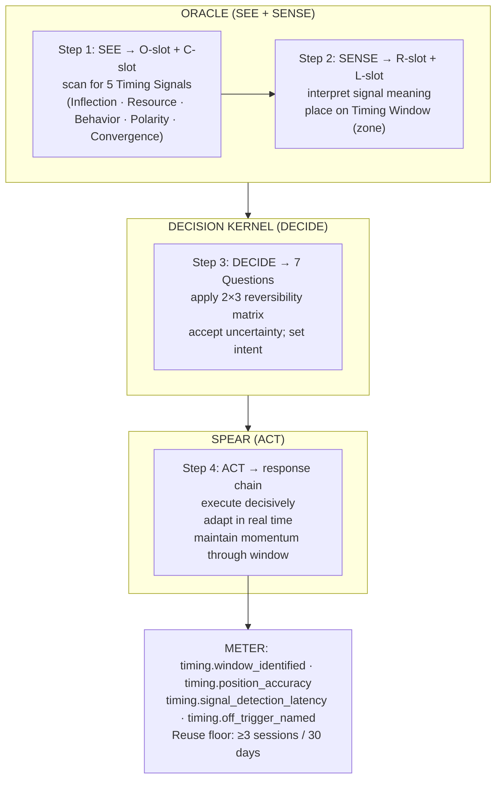

# Timing Operative — UMTF Dialect

**Summary**: A [UMTF](./universal-mental-tagging-framework.md) domain dialect for strategic timing: maps the 4 Disciplines of Timing (SEE → SENSE → DECIDE → ACT) onto existing Neural OS frameworks — [ORACLE](./oracle-overview.md) (SEE + SENSE), [decision-kernel](./decision-kernel.md) (DECIDE), and [SPEAR](./spear-overview.md) (ACT) — and registers the **Timing Window** bell curve and **5 High-Leverage Timing Signals** as the loadbearing new concepts. No new encoder slot or acronym; a Composite application of the existing framework family.

**Sources**:
- "Timing Is Everything" operational framework infographic (RDCTD.PRO; 2026-06-17 `/validate-idea`)
- [decision-kernel](./decision-kernel.md) — the *what/how* of committing to a move
- [ORACLE](./oracle-overview.md) — Anticipatory / Sequential mode; C-slot (the cue that fires prediction)
- [SPEAR](./spear-overview.md) — response chain; precise execution under time pressure
- [UMTF](./universal-mental-tagging-framework.md) — Temporal Tags (family 6) and Pattern Tags (family 5)
- [software-design-principles-for-neural-os](./software-design-principles-for-neural-os.md) — Composite + Strategy patterns; SRP constraint

**Last updated**: 2026-06-17

---

## Unlocks (lead, not footer)

> **Timing Window × Decision Kernel reversibility rule → 2×3 action matrix: the *when* and the *what* compose into a prescriptive decision table no single framework carries.**

The infographic's 4 Disciplines are a Composite already implemented across three Neural OS frameworks. What is genuinely new: the **Timing Window** bell curve (Too Early / Sweet Spot / Too Late), the **5 High-Leverage Timing Signals** as named C-slot vocabulary for ORACLE Anticipatory mode, and the 2×3 reversibility-timing matrix that composes both. Naming this Composite makes strategic timing teachable as one coherent reflex loop — with METER telemetry — rather than three isolated tools.

nonverbal-baseline-detection independently discovered a related Composite (ORACLE Anomaly baseline × per-encounter signal detection). [pattern-recognition-operative](./pattern-recognition-operative.md) named the operative-intelligence version of the same shape. This page closes the *strategic decision* version: not detecting anomalies in a target, but detecting when a window opens in a system.

**Cross-domain transfer**: the same Timing Window + 5-Signals loop applies to market entry (money), skill development (when to level up vs. consolidate), relationship initiation (when to move), and technical deployment (when to ship). Skill in one domain transfers because the underlying window-plus-signal detection loop is invariant.

---

## Framework Decomposition

The 4 Disciplines are a **Composite** (SDP §Composite pattern). Each Discipline maps to an existing Neural OS layer:

| Discipline | Neural OS layer | What it does |
|---|---|---|
| 1 — SEE (detect signals) | [ORACLE](./oracle-overview.md) — O-slot + C-slot | Scan environment; identify the specific cue that fires the prediction; read the 5 High-Leverage Timing Signals |
| 2 — SENSE (interpret meaning) | [ORACLE](./oracle-overview.md) — R-slot (Reading) + L-slot (Likelihood) | Assess what the signal means; place the system on the Timing Window bell curve; estimate likelihood of sweet spot |
| 3 — DECIDE (commit to the move) | [decision-kernel](./decision-kernel.md) — 7 Questions + reversibility rule | Choose the action; set clear intent; accept uncertainty with an explicit reversibility-timing check |
| 4 — ACT (execute with precision) | [SPEAR](./spear-overview.md) — response chain | Execute decisively; adapt in real time; maintain momentum through the window |

**Why not a new acronym?** SRP (see [software-design-principles-for-neural-os](./software-design-principles-for-neural-os.md) §S): each existing framework already owns one job. SEE + SENSE are ORACLE's Anticipatory/Sequential mode verbatim. DECIDE is the Decision Kernel verbatim. ACT is SPEAR verbatim. Minting a new code adds ceremony without payoff and risks a [glossary](./glossary.md) collision.

---

## The Timing Window

The loadbearing new concept. Not carried by any existing encoder page.

```p5 height=300
p.setup = () => { p.createCanvas(Math.min(el.clientWidth || 600, 600), 300); p.noLoop(); };
p.draw = () => {
  const ink = p.isDark ? '#ECE4D3' : '#2B2620';
  const sub = p.isDark ? '#B9AF9B' : '#5c5648';
  const green = '#5c7a54';
  p.background(p.isDark ? 30 : 245);
  const originX = 60, originY = 240, axisW = p.width - 100, axisH = 190;

  // axes
  p.stroke(ink);
  p.strokeWeight(1.5);
  p.line(originX, originY, originX, originY - axisH); // vertical: impact/ease
  p.line(originX, originY, originX + axisW, originY); // horizontal: time
  p.noStroke();
  p.fill(ink);
  p.textAlign(p.CENTER, p.CENTER);
  p.textSize(11);
  p.text('impact / ease', originX, originY - axisH - 14);
  p.text('HIGH', originX - 30, originY - axisH + 10);
  p.text('LOW', originX - 30, originY - 10);
  p.text('TIME', originX + axisW / 2, originY + 24);
  p.text('EARLY', originX + 20, originY + 14);
  p.text('LATE', originX + axisW - 20, originY + 14);

  // bell curve
  p.stroke(green);
  p.strokeWeight(2.5);
  p.noFill();
  p.beginShape();
  for (let x = 0; x <= axisW; x += 4) {
    const t = x / axisW; // 0..1
    const y = axisH * Math.exp(-Math.pow((t - 0.5) * 3.2, 2));
    p.vertex(originX + x, originY - y);
  }
  p.endShape();
  p.noStroke();

  // zone labels
  p.fill(ink);
  p.textSize(11);
  p.text('✗ TOO EARLY', originX + axisW * 0.14, originY - axisH * 0.28);
  p.fill(green);
  p.textSize(12);
  p.text('SWEET SPOT', originX + axisW * 0.5, originY - axisH * 0.92);
  p.fill(sub);
  p.textSize(9.5);
  p.text('high impact,\nlow resistance', originX + axisW * 0.5, originY - axisH * 0.72);
  p.fill(ink);
  p.textSize(11);
  p.text('✗ TOO LATE', originX + axisW * 0.86, originY - axisH * 0.28);
  p.fill(sub);
  p.textSize(9);
  p.text('missed opp.', originX + axisW * 0.86, originY - axisH * 0.12);
};
```

| Zone | Characteristics | Action rule |
|---|---|---|
| **Too Early** | Low impact, high effort — system not ready, resistance high | Validate signal; test cheaply; don't commit irreversible resources |
| **Sweet Spot** | High impact, low resistance — system porous, others unready | Act decisively; move with precision; do not over-deliberate |
| **Too Late** | Low impact, missed opportunity — window has closed | Learn the signal pattern; position for the next cycle; do not force entry |

**UMTF tag mapping**: the Timing Window is a **Pattern Tag** (family 5) × **Temporal Tag** (family 6) composition — a bell-curve opportunity shape (Pattern: choke-point inverted) unfolding over time (Temporal: rising → peak → falling). It nests with ORACLE's mode structure rather than competing with it: the Window is the macro shape; ORACLE processes micro-signals *inside* the window.

---

## 5 High-Leverage Timing Signals

Named C-slot vocabulary for ORACLE Anticipatory mode — the specific cues that fire the "window is opening" prediction. Previously unnamed in the wiki.

| Signal | Dominant UMTF tags | What it looks like | ORACLE C-slot example |
|---|---|---|---|
| **Inflection Point** | Tag 6 (Temporal) + Tag 3 (State) | Trend reversal — a metric that was falling starts rising, or vice versa | "Customer complaints shift from product to pricing — inflection in value perception" |
| **Resource Shift** | Tag 4 (Relation) + Tag 6 (Temporal) | Money, attention, or talent moves toward a new area | "Series A capital flowing into AI tooling — resource shift toward the developer-productivity layer" |
| **Behavior Change** | Tag 5 (Pattern) + Tag 3 (State) | Actions no longer match the historical pattern | "User cohort starts buying in Q1 instead of Q4 — behavior deviates from baseline" |
| **Polarity** | Tag 3 (State) + Tag 7 (Priority) | System reaches an extreme — consensus is uniformly pessimistic or uniformly optimistic | "Every advisor says wait — polarity extreme may signal contrarian opportunity" |
| **Convergence** | Tag 4 (Relation) + Tag 5 (Pattern) | Multiple independent signals align simultaneously | "Technology cost ↓ + regulation ↑ + market awareness ↑ all arriving in the same month" |

**Strategy selector** (SDP §Strategy): the dominant signal type determines which ORACLE mode handles it: Inflection Point → Conditional (what state does this transition into?); Polarity → Distributional (what probability mass has shifted?); Convergence → Anomaly (something would feel wrong about missing this); Behavior Change and Resource Shift → Sequential (what comes after a pattern break?).

---

## 2×3 Reversibility–Timing Matrix

The load-bearing composition unlock. Decision Kernel's reversibility rule × Timing Window position.

| | **Too Early** | **Sweet Spot** | **Too Late** |
|---|---|---|---|
| **Reversible decision** | Test cheaply; confirm the signal with a small experiment | Act with speed; cost of delay > cost of being slightly wrong | Learn the pattern; spot the next cycle; miss cost is low |
| **Irreversible decision** | Wait; validate signal further before burning irreversible capital | Move decisively; the window is open and the cost of inaction is permanent | Do not force entry; wait for the next cycle |

**The danger cell**: Irreversible + Too Early — high effort, uncertain signal, cannot undo. The Decision Kernel's "Type 2, slow down" rule maps exactly onto this cell.

**The free cell**: Reversible + Sweet Spot — move with speed; any downside is bounded and any upside is real.

---

## What Throws Off Timing (Anti-Patterns)

The infographic names 5 timing disruptors. Each maps to an existing wiki counter-protocol.

| Disruptor | Neural OS home | Counter-protocol |
|---|---|---|
| **Emotional decisions** | [PULSE](./pulse-overview.md) — S≥4 threat-state fires cognitive narrowing | PULSE: gate decision-making when Stress ≥ 4; run the F·A·I·L·U·R·E. scan to name which signal is firing |
| **Inaccurate information** | [ORACLE](./oracle-overview.md) — L-slot calibration failure | ORACLE: verify L-slot Likelihood source; use ordinal (common/less-common/rare) unless numeric is directly sourced |
| **Analysis paralysis** | [decision-kernel](./decision-kernel.md) §Anti-Patterns "collecting reasons without ranking" | Decision Kernel: one dominant reason beats ten vague ones; reversibility decides speed |
| **Waiting for certainty** | [decision-kernel](./decision-kernel.md) §Fast Decision Rules "if reversible and downside bounded → act" | Reversible + bounded downside = certainty is not required; the delay itself has cost |
| **Following the crowd** | cialdini-eight-principles §Social Proof | When Social Proof consensus is uniform → raise Polarity signal weight in ORACLE Distributional mode |

---

## The Timing Advantage

Two trajectories through the same Composite:

| | SEE | SENSE | DECIDE | ACT | Outcome |
|---|---|---|---|---|---|
| **Window reader** | Earlier | Faster | Sooner | Smarter | Win bigger |
| **Reactive actor** | Later | Slower | Too late | Reactively | Miss or lose |

The advantage is a **compounding loop**: see earlier → more decision time in the Sweet Spot → more reversible options available → higher-quality DECIDE → ACT lands before resistance consolidates → more Sweet-Spot data for the next cycle. ORACLE's observation log (`wiki/oracle-observation-log.md`) is the calibration mechanism: each correctly-called timing signal tightens the next SENSE evaluation.

---

## METER Hooks

| METER event | What it captures | Pass floor |
|---|---|---|
| `timing.window_identified` | Fires when user names a Timing Window (zone + dominant signal) before committing to a move | ≥70% of evaluated opportunities have a named window |
| `timing.position_accuracy` | After-action: was the action actually in the Sweet Spot? Scored retroactively | ≥60% of major irreversible moves land in sweet-spot position over rolling 90 days |
| `timing.signal_detection_latency` | Time from first observable signal to named window identification | <72h for Inflection Points and Resource Shifts; <24h for Convergence events |
| `timing.off_trigger_named` | Required after every missed Sweet Spot: which of the 5 disruptors fired? | 100% capture (no unexamined misses) |
| `timing.reversibility_matched` | Was the correct reversibility rule applied for this window position? | ≥85% correct rule application |

**Dialect reuse floor** (from [software-design-principles-for-neural-os](./software-design-principles-for-neural-os.md) §Domain Dialects legitimacy contract §METER fit): this dialect earns its keep if the Timing Window model is applied ≥3 times in practice within 30 days. Below that, treat as `disposable` tier per [UMTF](./universal-mental-tagging-framework.md) §Priority value classes.

---

## Mnemonic

**SSDA** = *SEE → SENSE → DECIDE → ACT* — the 4 Disciplines sequence.

Read as: **"Skilled Sentinels Decide Ahead"** — the practitioner who sees earlier and senses faster decides while others are still watching.

Short form: **Window first, then Wire** — identify the Timing Window (bell curve zone + dominant signal) *before* running the DECIDE step of the Decision Kernel. A wired decision without a named window is a guess.

**5 Signals mnemonic**: **I-R-B-P-C** = *Inflection · Resource · Behavior · Polarity · Convergence* — **"I Ran Before Polarity Converged"**

---

## Memory Checksum

If you can answer these from recall in <60s each, the page is encoded:

1. **Draw the Timing Window bell curve and name all three zones.** (Too Early: high effort/low impact; Sweet Spot: high impact/low resistance; Too Late: missed opportunity/do not force)
2. **Map the 4 Disciplines to their Neural OS owners.** (SEE + SENSE → ORACLE O/C + R/L slots; DECIDE → Decision Kernel 7 Questions + reversibility; ACT → SPEAR response chain)
3. **Complete the 2×3 reversibility-timing matrix — name the danger cell and the free cell.** (Danger: Irreversible+Too Early; Free: Reversible+Sweet Spot)
4. **Name the 5 High-Leverage Timing Signals and their dominant UMTF tag pairs.** (Inflection/Tag6+3, Resource/Tag4+6, Behavior/Tag5+3, Polarity/Tag3+7, Convergence/Tag4+5)
5. **Name the 5 disruptors and one counter-protocol for each.** (Emotional→PULSE S≥4; Inaccurate info→ORACLE L-slot; Paralysis→Decision Kernel reversibility rule; Certainty-wait→reversible+bounded=act; Crowd-follow→ORACLE Distributional + Polarity signal)

---

## Visual — the Composite skeleton



---

## Related Pages

- [ORACLE](./oracle-overview.md) — owner of SEE + SENSE (steps 1–2); §Timing Signals registers the 5 Signals as C-slot vocabulary for Anticipatory mode
- [decision-kernel](./decision-kernel.md) — owner of DECIDE (step 3); §Timing-Kernel Integration adds the 2×3 reversibility-timing matrix
- [SPEAR](./spear-overview.md) — owner of ACT (step 4)
- [UMTF](./universal-mental-tagging-framework.md) — Temporal Tags (family 6) and Pattern Tags (family 5) that underlie the Timing Window and 5 Signals
- [software-design-principles-for-neural-os](./software-design-principles-for-neural-os.md) — Composite pattern; Domain Dialects contract; SRP constraint that ruled out a new acronym
- [PULSE](./pulse-overview.md) — counter-protocol for the Emotional decisions disruptor
- cialdini-eight-principles — Social Proof principle; counter-protocol for the crowd-following disruptor
- [pattern-recognition-operative](./pattern-recognition-operative.md) — sibling Composite dialect (same architectural shape; same derivation date)
- [METER](./meter-overview.md) — `timing.*` event schema
- [composability-index](./composability-index.md) — unlock registry: Timing Window × Decision Kernel × 5 Signals → strategic timing reflex
- [framework-comparison-matrix](./framework-comparison-matrix.md) — master framework routing table
- [opportunity-windows](./opportunity-windows.md) — adds the expiry axis this page's 2×3 matrix does not carry: the deadline sets *when* you must decide, reversibility sets *how much care*
