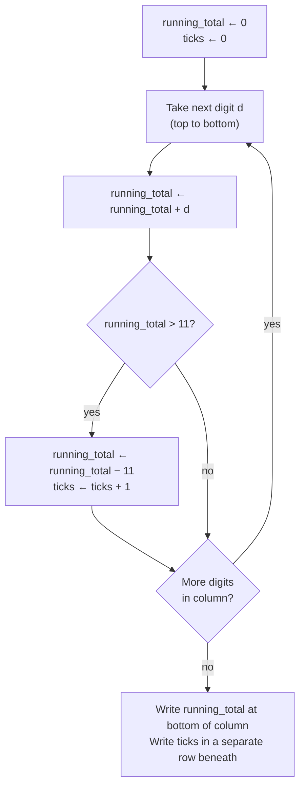

# Trachtenberg Addition — "Never Count Higher Than Eleven"

**Summary**: Trachtenberg's addition method ([trachtenberg-system](./trachtenberg-system.md) Ch 4) replaces conventional column-addition with a bounded-working-memory loop: as you walk down a column, **never let the running sum exceed 11** — when it would, subtract 11, write a tick, and continue with the reduced number. Each column ends with two artifacts — a **running total** (≤11, single value) and a **tick count**. The final answer is reconstructed by an L-shaped cascade: each column's tick count gets added to the next column's running total + that column's right-neighbor's ticks. The structural payoff is that mistakes can be **localized to a single column** and corrected without redoing the whole sum, which conventional column addition cannot do.

**Sources**:
- Trachtenberg, J. (1960). *The Trachtenberg Speed System of Basic Mathematics*, trans. Cutler & McShane — Chapter 4 "Addition and the right answer", pp. 105–131. PDF at `raw/01 Core_Memory/Math/Books/trachtenberg-system.pdf`.

**Last updated**: 2026-05-22


---

## Why 11 (not 10)

The running-sum cap of **11** is the only design choice that makes the method work. Conventional column-addition holds a running total in working memory that can climb arbitrarily high (sum of a column of 5-digit numbers can be in the hundreds). Trachtenberg's bound of 11 keeps the running total a single digit (or 10/11), which fits in one slot of working memory.

Why 11 specifically, not 10? The 11-rule encodes the "tens carry plus one stray unit" in a single threshold. The relationship to the recovery step is exact: each tick = `+11` that we subtracted out, and the recovery cascade reabsorbs them via right-neighbor lookup. (See "Why it works" below.) Using 10 instead of 11 would also work for sum bookkeeping, but the *check* — independent verification via tick counts — only goes through cleanly at 11 because the cascade interleaves carries with single-tick contributions.

The rule is therefore not a folk-mnemonic. It's the smallest cap that yields:
1. Single-digit running totals (working-memory bounded)
2. A second, independent statistic (tick count) per column
3. A clean reconstruction formula

---

## The procedure

### Step 1: Walk each column with the 11-rule

For each column (you can start from *any* column — the method does not require right-to-left progression):



### Step 2: Reconstruct the answer (L-shaped cascade)

Stack the running totals and tick counts as two parallel rows under the columns. The final answer is obtained by adding three things at each column position, working right-to-left:

```
   answer[k]  =  running_total[k]  +  ticks[k+1]  +  carry_from_k+1
                                       └─ right-neighbor's ticks ─┘
```

This is the **L-shape**: the running total is taken from the column above; the tick count is taken from the column immediately to the right. The two together (plus any carry) reconstruct the column's true sum.

### Worked example — from the book

Add: 3689 + 758 + 9667 + 1064 + 6498 + 745 + 9968 + 5887 + 9988 + 7615 + 8749

After running the 11-rule down each of the four columns:

```
   running totals:  0   2   3  10   1
   ticks         :       7   5'  8'

                  (units)
                  (tens)
                  (hundreds)
                  (thousands)
                  (ten-thousands position from leading-zero pass)
```

Reconstruct right-to-left:
- Units : `1 + 0 (no right neighbor ticks) = 1`
- Tens  : `10 + 5 + carry 0 = 15` → write 5, carry 1
- Hundreds: `3 + 6 + 5 (... see book details) + carry 1 = 14` → write 4, carry 1
- Continue cascading.

Final answer: **65,628**.

(Book uses a slightly different column-set; this is the structural shape, not the literal computation. See Trachtenberg pp. 109–112 for the fully traced numerical example.)

---

## Why it works — the algebraic identity

Each column's true sum equals `running_total + 11 × ticks`. Across columns, the `11 × ticks` term decomposes into a `10 × ticks` part (which is a carry into the next column) and a `1 × ticks` part (which contributes at the *current* column). The cascade in Step 2 is exactly this decomposition: take the running total at column *k*, add the ticks from column *k+1* (= the 1× part shifted by one place), and propagate carries.

This is the same arithmetic that conventional addition does — but stored differently. Conventional addition forces the running total to climb (and a separate "carry" to spill into the next column at the moment a 9-or-higher pair occurs). Trachtenberg pre-separates the carry-contributions into the tick row, where they can be checked independently.

---

## The error-localization payoff

Conventional column addition is **all-or-nothing for error finding**: if the bottom-line total is wrong, you re-add the whole problem and hope to catch it. The Trachtenberg method gives you **per-column verification** — each column has both a running total and a tick count, and re-running just that column verifies it without disturbing the others.

This matters because *most* arithmetic errors are localized to a single column (per Trachtenberg's clinical observation, cited in the chapter). Conventional repetition has two failure modes:
1. The calculator's "favorite error" recurs on repetition (e.g. "8 × 7 = 54" in the middle of a long calculation).
2. Another person checking by the same method makes the same "natural" error (e.g. mistaking a sloppily written 4 for a 9).

Independent-stat checking (tick count vs. running total) escapes both modes.

---

## How this composes with [trachtenberg-system](./trachtenberg-system.md)

[trachtenberg-system](./trachtenberg-system.md) is the parent page, owning the term *Trachtenberg System* and the Pillar 1 / Pillar 2 framing. This page covers Chapter 4 of the book, which is *independent* of both pillars — addition is its own method, not a multiplication rule.

The shared design DNA across the system:
- **Bounded working memory** — like the special-case multiplication rules, addition is engineered so no step requires the calculator to hold more than 1–2 digits + a carry.
- **Independent-statistic verification** — the addition method's tick row is the analogue of [trachtenberg-system](./trachtenberg-system.md)'s leading-zero check and the units-digit "10−d" anomaly. In both cases, a second derived quantity catches errors that re-running the main calculation would miss.

---

## Related pages

- [trachtenberg-system](./trachtenberg-system.md) — parent page; cites this method in §"The two pillars" overview
- [trachtenberg-division](./trachtenberg-division.md) — same author's division method, using the same digit-sum and 10× checks
- [vedic-digit-sum-check](./vedic-digit-sum-check.md) — the casting-out-nines check that Bathia recommends for addition; complementary, not redundant
- [memory-palace-for-aphantasia](./memory-palace-for-aphantasia.md) — Trachtenberg's bounded-working-memory design is the canonical example of the minimal-substrate extreme
- [symbolic-fluency-drill-ladder](./symbolic-fluency-drill-ladder.md)
- [automaticity-and-reflex-training](./automaticity-and-reflex-training.md)

---

## U — See (CAST)
1. Column with running total ≤11 and tick row beneath
2. L-shaped cascade: this column's total + right column's ticks

## D — Name (NEDF)
1. Trachtenberg addition = "never count higher than eleven"
2. Distinguisher: tick row separate from running total
3. Failure mode: forgetting to reset the running total when subtracting 11

## F — Do (SPEAR)
1. Walk column, apply 11-rule, log ticks
2. Cascade right-to-left: total + neighbor ticks + carry

## B — Watch (HEART)
1. Tick rule drift (subtracting 10 instead of 11)
2. Missing the per-column verification habit

## L — Predict (ORACLE)
1. Long column → predict error rate ~20% with conventional, ~5% with this method
2. Single misaligned column → predict tick-count mismatch

## R — Act (GRACE)
1. Long addition → switch to Trachtenberg
2. Sum mismatch → re-walk just the offending column
